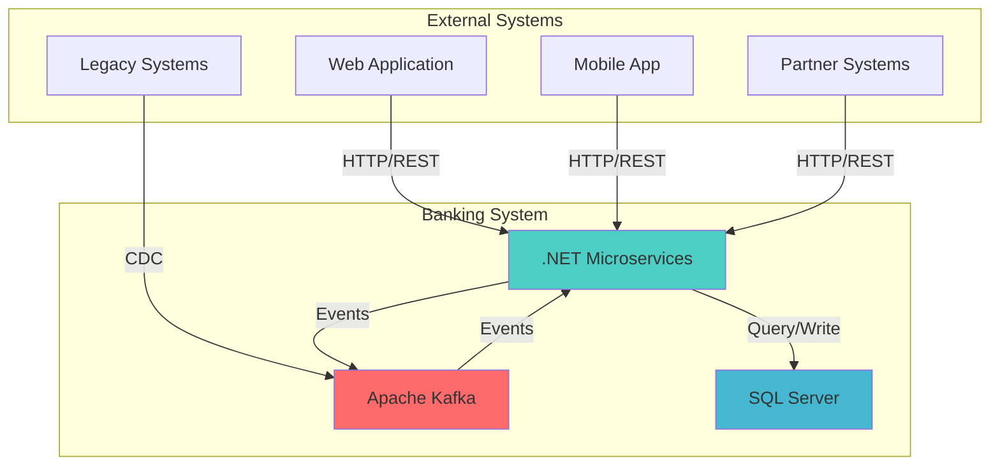
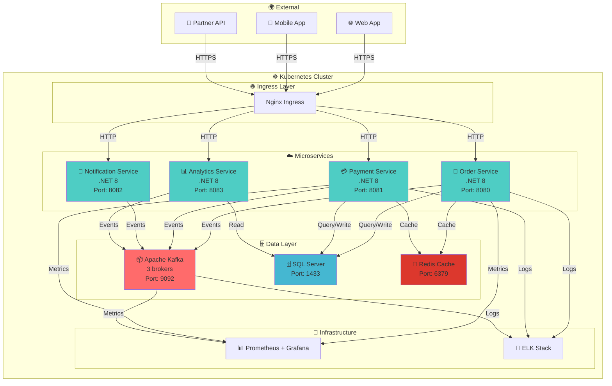
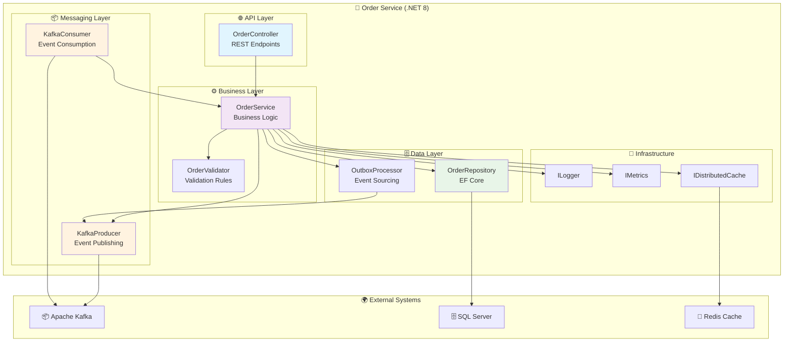
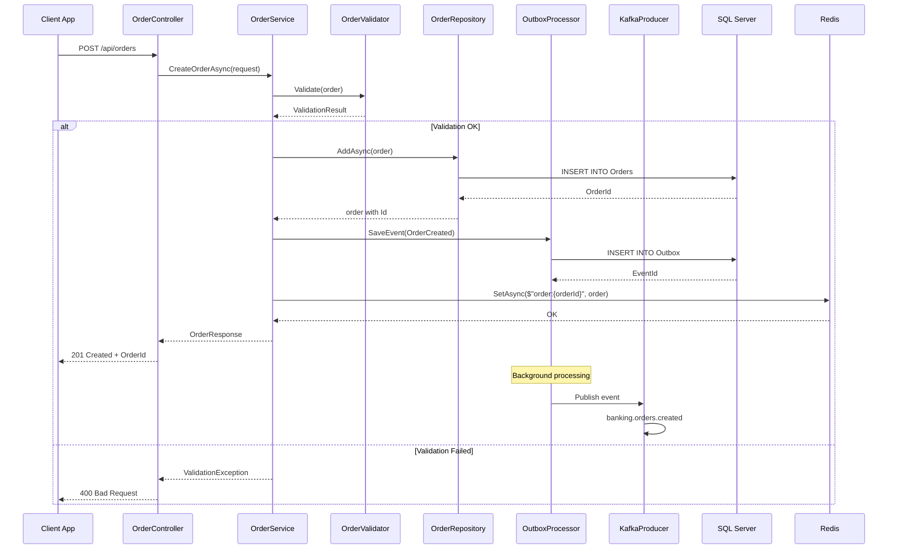
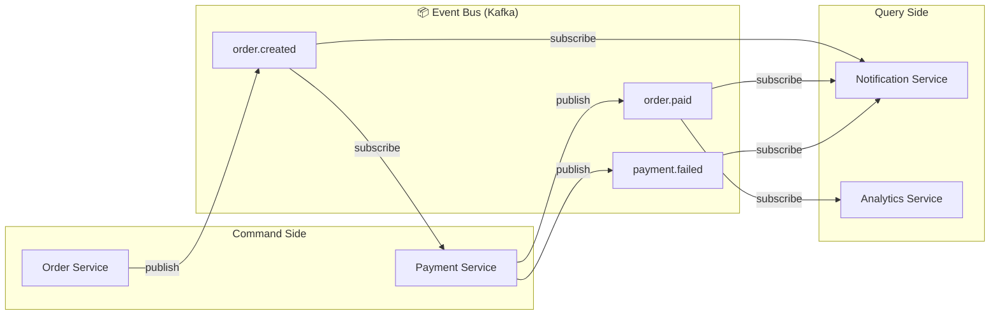
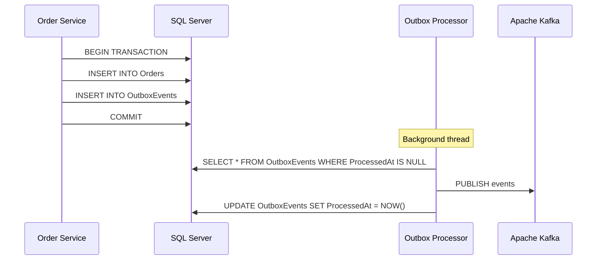
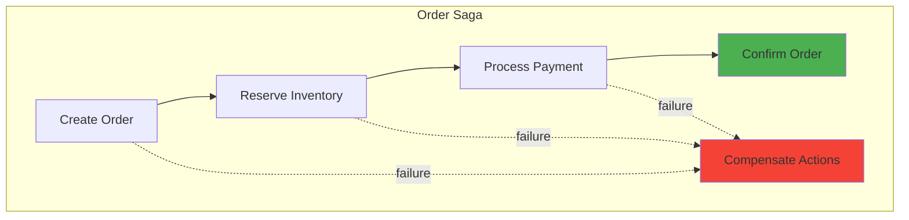
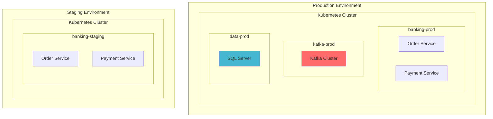
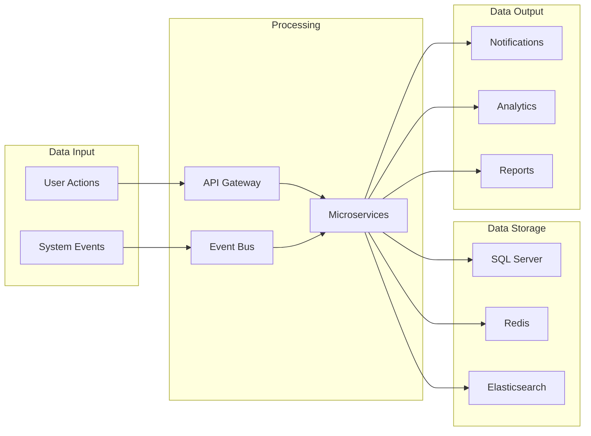

# 🏗️ C4 Models : Architecture Kafka Microservices

> Documentation d'architecture avec **C4 Model** pour les microservices .NET avec Apache Kafka

---

## 📋 Contexte

Les **C4 Models** (Context, Containers, Components, Code) fournissent une approche structurée pour documenter l'architecture logicielle. Ce guide applique C4 aux architectures **microservices .NET + Kafka**.

---

## 🌍 Level 1 : Context Diagram



### Description

Le **Banking System** est une architecture **event-driven** composée de :
- **Apache Kafka** : Bus d'événements central
- **.NET Microservices** : Services métier
- **SQL Server** : Base de données principale
- **External Systems** : Applications clientes et partenaires

---

## 📦 Level 2 : Container Diagram



### Description des Containers

| Container | Technologie | Responsabilité | Interfaces |
|-----------|-------------|----------------|------------|
| **Order Service** | .NET 8 Web API | Gestion des commandes | REST API, Kafka Producer/Consumer |
| **Payment Service** | .NET 8 Web API | Traitement des paiements | REST API, Kafka Producer/Consumer |
| **Notification Service** | .NET 8 Web API | Envoi de notifications | REST API, Kafka Consumer |
| **Analytics Service** | .NET 8 Web API | Analyse de données | REST API, Kafka Consumer |
| **Apache Kafka** | Kafka 3.x | Bus d'événements | TCP:9092 |
| **SQL Server** | SQL Server 2022 | Persistance des données | TCP:1433 |
| **Redis** | Redis 7.x | Cache distribué | TCP:6379 |

---

## 🧩 Level 3 : Component Diagram - Order Service



### Description des Components

| Component | Type | Responsabilité | Technologies |
|-----------|------|----------------|--------------|
| **OrderController** | API | Expose REST endpoints | ASP.NET Core, Swagger |
| **OrderService** | Business | Logique métier des commandes | C#, Dependency Injection |
| **OrderValidator** | Business | Validation des règles métier | FluentValidation |
| **OrderRepository** | Data | Accès aux données | Entity Framework Core |
| **OutboxProcessor** | Data | Pattern Outbox pour cohérence | EF Core, BackgroundService |
| **KafkaProducer** | Messaging | Publication d'événements | Confluent.Kafka |
| **KafkaConsumer** | Messaging | Consommation d'événements | Confluent.Kafka |

---

## 💻 Level 4 : Code Diagram - Order Processing Flow



### Code Structure

```csharp
// Controllers/OrderController.cs
[ApiController]
[Route("api/[controller]")]
public class OrderController : ControllerBase
{
    private readonly IOrderService _orderService;
    
    [HttpPost]
    public async Task<ActionResult<OrderResponse>> CreateOrder(CreateOrderRequest request)
    {
        var order = await _orderService.CreateOrderAsync(request);
        return CreatedAtAction(nameof(GetOrder), new { id = order.Id }, order);
    }
}

// Services/OrderService.cs
public class OrderService : IOrderService
{
    private readonly IOrderRepository _repository;
    private readonly IOrderValidator _validator;
    private readonly IKafkaProducer _kafkaProducer;
    private readonly IDistributedCache _cache;
    
    public async Task<Order> CreateOrderAsync(CreateOrderRequest request)
    {
        var order = new Order(request);
        await _validator.ValidateAsync(order);
        
        var savedOrder = await _repository.AddAsync(order);
        
        // Outbox pattern
        var orderCreatedEvent = new OrderCreatedEvent(savedOrder);
        await _kafkaProducer.PublishAsync("banking.orders.created", orderCreatedEvent);
        
        // Cache
        await _cache.SetAsync($"order:{savedOrder.Id}", savedOrder);
        
        return savedOrder;
    }
}
```

---

## 🔄 Architecture Patterns

### 1. Event-Driven Architecture



### 2. Outbox Pattern



### 3. Saga Pattern



---

## 📊 Architecture Decision Records (ADRs)

### ADR-001: Choix de Kafka comme Event Bus

**Status**: Accepted  
**Date**: 2024-02-05

**Context**
- Besoin d'un bus d'événements scalable
- Support du replay des événements
- Intégration avec .NET ecosystem

**Decision**
- Apache Kafka comme bus d'événements principal
- Confluent.Kafka comme client .NET
- Topics par type d'événement

**Consequences**
- ✅ Scalabilité horizontale
- ✅ Persistance des événements
- ✅ Multiple consumers
- ❌ Complexité opérationnelle

### ADR-002: Architecture Microservices avec .NET 8

**Status**: Accepted  
**Date**: 2024-02-05

**Context**
- Migration d'une architecture monolithique
- Besoin d'évolutivité et de résilience
- Équipe .NET expérimentée

**Decision**
- .NET 8 comme framework principal
- Conteneurs Docker + Kubernetes
- Communication via REST + Events

**Consequences**
- ✅ Performance et modernité
- ✅ Écosystème .NET riche
- ❌ Courbe d'apprentissage Kubernetes

---

## 🔍 Architecture Views

### 1. Deployment View



### 2. Data Flow View



---

## 📋 Architecture Checklist

### ✅ Microservices Design
- [ ] Single Responsibility Principle
- [ ] Loose Coupling
- [ ] High Cohesion
- [ ] API First Design
- [ ] Event-Driven Communication

### ✅ Data Management
- [ ] Database per Service
- [ ] Outbox Pattern
- [ ] Event Sourcing (si nécessaire)
- [ ] Data Consistency Strategy
- [ ] Backup & Recovery

### ✅ Kafka Integration
- [ ] Topic Naming Convention
- [ ] Schema Registry
- [ ] Error Handling
- [ ] Dead Letter Topics
- [ ] Monitoring

### ✅ Infrastructure
- [ ] Container Strategy
- [ ] Orchestration (K8s)
- [ ] Service Discovery
- [ ] Load Balancing
- [ ] Auto-scaling

### ✅ Observability
- [ ] Structured Logging
- [ ] Metrics Collection
- [ ] Distributed Tracing
- [ ] Health Checks
- [ ] Alerting

---

## 🎯 Conclusion

Les **C4 Models** fournissent une documentation claire et structurée de l'architecture **microservices .NET + Kafka**. Cette approche facilite la communication entre les équipes techniques et métier, et sert de référence pour l'évolution du système.

L'architecture **event-driven** avec Kafka permet de construire des systèmes **scalables**, **résilients** et **maintenables**, tout en respectant les principes modernes de développement logiciel.
