# ☸️ Déploiement Kafka sur OpenShift

> Guide de déploiement pour applications .NET Core avec Apache Kafka sur OpenShift/Kubernetes

## 📋 Prérequis

- Accès à un cluster OpenShift
- CLI `oc` installé et configuré
- Namespace/Project dédié

---

## 🏗️ Architecture sur OpenShift

```mermaid
flowchart TB
    subgraph OpenShift["☸️ OpenShift Cluster"]
        subgraph NS1["📦 kafka-infra"]
            K1["🔷 Kafka Broker 1"]
            K2["🔷 Kafka Broker 2"]
            K3["🔷 Kafka Broker 3"]
            ZK["Strimzi Operator"]
        end
        
        subgraph NS2["📦 app-namespace"]
            API["🟢 .NET API"]
            CONS["🔵 .NET Consumer"]
            CFG["ConfigMap"]
            SEC["Secret"]
        end
        
        K1 & K2 & K3 <-->|"29092"| API
        K1 & K2 & K3 <-->|"29092"| CONS
    end
    
    style K1 fill:#e8f5e9
    style K2 fill:#e8f5e9
    style K3 fill:#e8f5e9
```



---

## 🔧 Option 1 : Strimzi Operator (Recommandé)

### Installation de Strimzi

```bash
# Créer le namespace
oc new-project kafka-infra

# Installer Strimzi via OperatorHub (OpenShift Console)
# Ou via CLI :
oc apply -f https://strimzi.io/install/latest?namespace=kafka-infra
```

### Déploiement du cluster Kafka

```yaml
# kafka-cluster.yaml
apiVersion: kafka.strimzi.io/v1beta2
kind: Kafka
metadata:
  name: bhf-kafka
  namespace: kafka-infra
spec:
  kafka:
    version: 3.6.0
    replicas: 3
    listeners:
      - name: plain
        port: 9092
        type: internal
        tls: false
      - name: tls
        port: 9093
        type: internal
        tls: true
      - name: external
        port: 9094
        type: route
        tls: true
    config:
      offsets.topic.replication.factor: 3
      transaction.state.log.replication.factor: 3
      transaction.state.log.min.isr: 2
      default.replication.factor: 3
      min.insync.replicas: 2
      inter.broker.protocol.version: "3.6"
    storage:
      type: persistent-claim
      size: 10Gi
      class: managed-premium  # Azure, adapter selon cloud
    resources:
      requests:
        memory: 2Gi
        cpu: 500m
      limits:
        memory: 4Gi
        cpu: 2
  zookeeper:
    replicas: 3
    storage:
      type: persistent-claim
      size: 5Gi
      class: managed-premium
  entityOperator:
    topicOperator: {}
    userOperator: {}
```

```bash
oc apply -f kafka-cluster.yaml
```

### Création de topics via CRD

```yaml
# kafka-topic.yaml
apiVersion: kafka.strimzi.io/v1beta2
kind: KafkaTopic
metadata:
  name: orders
  namespace: kafka-infra
  labels:
    strimzi.io/cluster: bhf-kafka
spec:
  partitions: 6
  replicas: 3
  config:
    retention.ms: 604800000  # 7 jours
    min.insync.replicas: 2
```

---

## 🔷 Déploiement Application .NET

### ConfigMap pour la configuration Kafka

```yaml
# configmap-kafka.yaml
apiVersion: v1
kind: ConfigMap
metadata:
  name: kafka-config
  namespace: app-namespace
data:
  KAFKA_BOOTSTRAP_SERVERS: "bhf-kafka-kafka-bootstrap.kafka-infra.svc:9092"
  KAFKA_SECURITY_PROTOCOL: "PLAINTEXT"
  KAFKA_ACKS: "all"
  KAFKA_RETRIES: "10"
  KAFKA_RETRY_BACKOFF_MS: "100"
  KAFKA_ENABLE_IDEMPOTENCE: "true"
```

### Secret pour les credentials (si TLS)

```yaml
# secret-kafka.yaml
apiVersion: v1
kind: Secret
metadata:
  name: kafka-credentials
  namespace: app-namespace
type: Opaque
stringData:
  KAFKA_SSL_CA_LOCATION: "/certs/ca.crt"
  KAFKA_SSL_CERTIFICATE_LOCATION: "/certs/user.crt"
  KAFKA_SSL_KEY_LOCATION: "/certs/user.key"
```

### Deployment .NET Producer/Consumer

```yaml
# deployment-dotnet-api.yaml
apiVersion: apps/v1
kind: Deployment
metadata:
  name: order-api
  namespace: app-namespace
  labels:
    app: order-api
spec:
  replicas: 2
  selector:
    matchLabels:
      app: order-api
  template:
    metadata:
      labels:
        app: order-api
    spec:
      containers:
        - name: order-api
          image: registry.example.com/order-api:latest
          ports:
            - containerPort: 8080
          envFrom:
            - configMapRef:
                name: kafka-config
          env:
            - name: ASPNETCORE_ENVIRONMENT
              value: "Production"
            - name: KAFKA_GROUP_ID
              value: "order-api-producer"
          resources:
            requests:
              memory: "256Mi"
              cpu: "100m"
            limits:
              memory: "512Mi"
              cpu: "500m"
          livenessProbe:
            httpGet:
              path: /health
              port: 8080
            initialDelaySeconds: 30
            periodSeconds: 10
          readinessProbe:
            httpGet:
              path: /ready
              port: 8080
            initialDelaySeconds: 5
            periodSeconds: 5
---
apiVersion: v1
kind: Service
metadata:
  name: order-api
  namespace: app-namespace
spec:
  selector:
    app: order-api
  ports:
    - port: 80
      targetPort: 8080
---
apiVersion: route.openshift.io/v1
kind: Route
metadata:
  name: order-api
  namespace: app-namespace
spec:
  to:
    kind: Service
    name: order-api
  tls:
    termination: edge
```

### Deployment Consumer avec scaling horizontal

```yaml
# deployment-dotnet-consumer.yaml
apiVersion: apps/v1
kind: Deployment
metadata:
  name: order-consumer
  namespace: app-namespace
  labels:
    app: order-consumer
spec:
  replicas: 3  # Doit être <= nombre de partitions
  selector:
    matchLabels:
      app: order-consumer
  template:
    metadata:
      labels:
        app: order-consumer
    spec:
      containers:
        - name: order-consumer
          image: registry.example.com/order-consumer:latest
          envFrom:
            - configMapRef:
                name: kafka-config
          env:
            - name: KAFKA_GROUP_ID
              value: "order-consumer-group"
            - name: KAFKA_TOPICS
              value: "orders"
            - name: KAFKA_AUTO_OFFSET_RESET
              value: "earliest"
            - name: KAFKA_ENABLE_AUTO_COMMIT
              value: "false"
          resources:
            requests:
              memory: "256Mi"
              cpu: "100m"
            limits:
              memory: "512Mi"
              cpu: "500m"
```

---

## 📊 Monitoring sur OpenShift

### Métriques Prometheus

```yaml
# servicemonitor-kafka.yaml
apiVersion: monitoring.coreos.com/v1
kind: ServiceMonitor
metadata:
  name: kafka-metrics
  namespace: kafka-infra
spec:
  selector:
    matchLabels:
      strimzi.io/cluster: bhf-kafka
  endpoints:
    - port: tcp-prometheus
      interval: 30s
```

### PodMonitor pour applications .NET

```yaml
# podmonitor-dotnet.yaml
apiVersion: monitoring.coreos.com/v1
kind: PodMonitor
metadata:
  name: dotnet-apps
  namespace: app-namespace
spec:
  selector:
    matchLabels:
      app.kubernetes.io/framework: dotnet
  podMetricsEndpoints:
    - port: metrics
      path: /metrics
      interval: 30s
```

---

## 🔐 Sécurité

### NetworkPolicy pour isolation

```yaml
# networkpolicy-kafka.yaml
apiVersion: networking.k8s.io/v1
kind: NetworkPolicy
metadata:
  name: kafka-network-policy
  namespace: kafka-infra
spec:
  podSelector:
    matchLabels:
      strimzi.io/cluster: bhf-kafka
  policyTypes:
    - Ingress
  ingress:
    - from:
        - namespaceSelector:
            matchLabels:
              kafka-access: "true"
      ports:
        - protocol: TCP
          port: 9092
```

### KafkaUser avec ACLs

```yaml
# kafka-user.yaml
apiVersion: kafka.strimzi.io/v1beta2
kind: KafkaUser
metadata:
  name: order-service
  namespace: kafka-infra
  labels:
    strimzi.io/cluster: bhf-kafka
spec:
  authentication:
    type: tls
  authorization:
    type: simple
    acls:
      - resource:
          type: topic
          name: orders
          patternType: literal
        operations:
          - Read
          - Write
          - Describe
      - resource:
          type: group
          name: order-
          patternType: prefix
        operations:
          - Read
```

---

## 🚀 Script de déploiement complet

```bash
#!/bin/bash
# deploy-kafka-openshift.sh

set -e

# Variables
KAFKA_NS="kafka-infra"
APP_NS="app-namespace"

echo "📦 Création des namespaces..."
oc new-project $KAFKA_NS --skip-config-write || true
oc new-project $APP_NS --skip-config-write || true

echo "🏗️ Déploiement Strimzi Operator..."
oc apply -f https://strimzi.io/install/latest?namespace=$KAFKA_NS -n $KAFKA_NS

echo "⏳ Attente du démarrage de l'operator..."
oc wait deployment/strimzi-cluster-operator \
  --for=condition=Available \
  --timeout=300s \
  -n $KAFKA_NS

echo "🔷 Déploiement du cluster Kafka..."
oc apply -f kafka-cluster.yaml -n $KAFKA_NS

echo "⏳ Attente du cluster Kafka (peut prendre 5-10 minutes)..."
oc wait kafka/bhf-kafka \
  --for=condition=Ready \
  --timeout=600s \
  -n $KAFKA_NS

echo "📝 Création des topics..."
oc apply -f kafka-topic.yaml -n $KAFKA_NS

echo "⚙️ Configuration de l'application..."
oc apply -f configmap-kafka.yaml -n $APP_NS

echo "🟢 Déploiement de l'application .NET..."
oc apply -f deployment-dotnet-api.yaml -n $APP_NS
oc apply -f deployment-dotnet-consumer.yaml -n $APP_NS

echo "✅ Déploiement terminé!"
echo ""
echo "🔗 URLs:"
oc get routes -n $APP_NS
```

---

## 🔍 Troubleshooting OpenShift

### Vérifier le statut Kafka

```bash
# Statut du cluster
oc get kafka -n kafka-infra

# Logs des brokers
oc logs -f bhf-kafka-kafka-0 -n kafka-infra

# Décrire un pod Kafka
oc describe pod bhf-kafka-kafka-0 -n kafka-infra
```

### Vérifier les applications

```bash
# Logs de l'application
oc logs -f deployment/order-api -n app-namespace

# Events du namespace
oc get events --sort-by='.lastTimestamp' -n app-namespace

# Accéder au pod pour debug
oc rsh deployment/order-api -n app-namespace
```

### Problèmes courants

| Problème | Cause | Solution |
|----------|-------|----------|
| Connection refused | Mauvais bootstrap servers | Vérifier `svc:9092` |
| Timeout | NetworkPolicy | Ajouter label `kafka-access: "true"` |
| Consumer lag élevé | Pas assez de replicas | Augmenter replicas <= partitions |
| OOMKilled | Mémoire insuffisante | Augmenter limits |

---

## 📚 Ressources

- [Strimzi Documentation](https://strimzi.io/documentation/)
- [Red Hat AMQ Streams](https://access.redhat.com/documentation/en-us/red_hat_amq_streams/)
- [OpenShift Kafka Best Practices](https://docs.openshift.com/container-platform/latest/serverless/eventing/brokers/kafka-broker.html)
