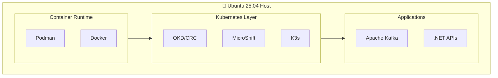

# 🐧 Installation OKD/Kubernetes sur Ubuntu 25.04

> Guide complet d'installation d'un cluster OKD (OpenShift Kubernetes Distribution) local pour le déploiement d'applications Kafka et .NET

## 📋 Table des matières

1. [Prérequis système](#-prérequis-système)
2. [Installation des dépendances](#-installation-des-dépendances)
3. [Option 1 : OKD avec CRC (CodeReady Containers)](#-option-1--okd-avec-crc)
4. [Option 2 : MicroShift (Lightweight)](#-option-2--microshift)
5. [Option 3 : K3s + OKD Tools](#-option-3--k3s--okd-tools)
6. [Configuration Docker/Podman](#-configuration-dockerpodman)
7. [Déploiement Kafka avec Strimzi](#-déploiement-kafka-avec-strimzi)
8. [Déploiement applications .NET](#-déploiement-applications-net)
9. [Troubleshooting](#-troubleshooting)

---

## 💻 Prérequis système

### Configuration minimale

| Ressource | Minimum | Recommandé |
|-----------|---------|------------|
| **CPU** | 4 cores | 8+ cores |
| **RAM** | 16 GB | 32 GB |
| **Disque** | 50 GB SSD | 100 GB SSD |
| **OS** | Ubuntu 25.04 | Ubuntu 25.04 LTS |

### Architecture supportée



---

## 📦 Installation des dépendances

### 1. Mise à jour du système

```bash
# Mise à jour complète
sudo apt update && sudo apt upgrade -y

# Installation des outils de base
sudo apt install -y \
    curl \
    wget \
    git \
    jq \
    vim \
    htop \
    net-tools \
    ca-certificates \
    gnupg \
    lsb-release \
    software-properties-common
```

### 2. Installation de Podman (recommandé pour OKD)

```bash
# Podman est le runtime de conteneurs natif pour OKD/OpenShift
sudo apt install -y podman podman-compose

# Vérification
podman --version
# podman version 4.x.x

# Configuration rootless
sudo usermod --add-subuids 100000-165535 --add-subgids 100000-165535 $USER

# Redémarrer la session ou exécuter
newgrp $USER
```

### 3. Installation de Docker (alternative)

```bash
# Ajout du repository Docker officiel
sudo install -m 0755 -d /etc/apt/keyrings
curl -fsSL https://download.docker.com/linux/ubuntu/gpg | sudo gpg --dearmor -o /etc/apt/keyrings/docker.gpg
sudo chmod a+r /etc/apt/keyrings/docker.gpg

echo \
  "deb [arch=$(dpkg --print-architecture) signed-by=/etc/apt/keyrings/docker.gpg] https://download.docker.com/linux/ubuntu \
  $(. /etc/os-release && echo "$VERSION_CODENAME") stable" | \
  sudo tee /etc/apt/sources.list.d/docker.list > /dev/null

# Installation
sudo apt update
sudo apt install -y docker-ce docker-ce-cli containerd.io docker-buildx-plugin docker-compose-plugin

# Ajouter l'utilisateur au groupe docker
sudo usermod -aG docker $USER
newgrp docker

# Vérification
docker --version
docker compose version
```

### 4. Installation de kubectl

```bash
# Téléchargement de kubectl
curl -LO "https://dl.k8s.io/release/$(curl -L -s https://dl.k8s.io/release/stable.txt)/bin/linux/amd64/kubectl"

# Installation
sudo install -o root -g root -m 0755 kubectl /usr/local/bin/kubectl

# Vérification
kubectl version --client
```

### 5. Installation de Helm

```bash
# Script d'installation officiel
curl https://raw.githubusercontent.com/helm/helm/main/scripts/get-helm-3 | bash

# Vérification
helm version
```

---

## 🔴 Option 1 : OKD avec CRC (CodeReady Containers)

> **CRC** fournit un cluster OKD complet en local, idéal pour le développement.

### Installation de CRC

```bash
# Télécharger CRC (vérifier la dernière version sur https://crc.dev/crc/)
CRC_VERSION="2.32.0"
wget https://developers.redhat.com/content-gateway/file/pub/openshift-v4/clients/crc/${CRC_VERSION}/crc-linux-amd64.tar.xz

# Extraction
tar -xvf crc-linux-amd64.tar.xz
sudo mv crc-linux-${CRC_VERSION}-amd64/crc /usr/local/bin/

# Vérification
crc version
```

### Configuration et démarrage

```bash
# Configuration initiale (télécharge ~4GB)
crc setup

# Démarrage du cluster (nécessite ~9GB RAM, 4 CPUs)
crc start

# Récupérer les credentials
crc console --credentials
```

### Configuration de l'environnement

```bash
# Ajouter au ~/.bashrc ou ~/.zshrc
eval $(crc oc-env)

# Connexion au cluster
oc login -u developer https://api.crc.testing:6443

# Vérification
oc get nodes
oc get pods -A
```

### Accès à la console web

```bash
# URL de la console
crc console

# Ouvre automatiquement : https://console-openshift-console.apps-crc.testing
# Login: developer / developer (ou kubeadmin avec mot de passe de crc console --credentials)
```

---

## 🔵 Option 2 : MicroShift (Lightweight)

> **MicroShift** est une version légère d'OpenShift, idéale pour les environnements edge et le développement local.

### Installation

```bash
# Ajouter le repository MicroShift
sudo dnf copr enable -y @redhat-et/microshift

# Pour Ubuntu, utiliser le package RPM converti ou installer via conteneur
# Méthode conteneur recommandée :

# Créer le répertoire de données
sudo mkdir -p /var/lib/microshift

# Lancer MicroShift via Podman
podman run -d --rm --name microshift \
    --privileged \
    -v /var/lib/microshift:/var/lib/microshift:z \
    -p 6443:6443 \
    -p 80:80 \
    -p 443:443 \
    quay.io/microshift/microshift-aio:latest
```

### Configuration kubectl

```bash
# Copier le kubeconfig
mkdir -p ~/.kube
podman cp microshift:/var/lib/microshift/resources/kubeadmin/kubeconfig ~/.kube/config

# Vérification
kubectl get nodes
kubectl get pods -A
```

---

## 🟢 Option 3 : K3s + OKD Tools

> **K3s** est un Kubernetes léger, combiné avec les outils OKD pour une expérience similaire.

### Installation de K3s

```bash
# Installation rapide (sans Traefik pour utiliser nos propres ingress)
curl -sfL https://get.k3s.io | INSTALL_K3S_EXEC="--disable traefik" sh -

# Configuration kubectl pour l'utilisateur courant
mkdir -p ~/.kube
sudo cp /etc/rancher/k3s/k3s.yaml ~/.kube/config
sudo chown $USER:$USER ~/.kube/config
chmod 600 ~/.kube/config

# Vérification
kubectl get nodes
# NAME        STATUS   ROLES                  AGE   VERSION
# ubuntu-vm   Ready    control-plane,master   1m    v1.28.x+k3s1
```

### Installation des outils OKD/OpenShift

```bash
# Télécharger oc CLI (compatible avec K3s pour la plupart des commandes)
OC_VERSION="4.14.0"
wget https://mirror.openshift.com/pub/openshift-v4/clients/ocp/${OC_VERSION}/openshift-client-linux.tar.gz

tar -xvf openshift-client-linux.tar.gz
sudo mv oc kubectl /usr/local/bin/

# Vérification
oc version
```

### Installation de NGINX Ingress Controller

```bash
# Via Helm
helm repo add ingress-nginx https://kubernetes.github.io/ingress-nginx
helm repo update

helm install ingress-nginx ingress-nginx/ingress-nginx \
    --namespace ingress-nginx \
    --create-namespace \
    --set controller.service.type=NodePort \
    --set controller.service.nodePorts.http=30080 \
    --set controller.service.nodePorts.https=30443
```

---

## 🐳 Configuration Docker/Podman

### Configuration du registry local

```bash
# Créer un registry local pour les images
docker run -d -p 5000:5000 --restart=always --name registry registry:2

# Ou avec Podman
podman run -d -p 5000:5000 --restart=always --name registry docker.io/library/registry:2
```

### Configuration pour K3s

```bash
# Configurer K3s pour utiliser le registry local
sudo mkdir -p /etc/rancher/k3s

sudo tee /etc/rancher/k3s/registries.yaml > /dev/null <<EOF
mirrors:
  "localhost:5000":
    endpoint:
      - "http://localhost:5000"
  "registry.local:5000":
    endpoint:
      - "http://registry.local:5000"
EOF

# Ajouter au /etc/hosts
echo "127.0.0.1 registry.local" | sudo tee -a /etc/hosts

# Redémarrer K3s
sudo systemctl restart k3s
```

### Build et push d'images .NET

```bash
# Exemple de Dockerfile pour application .NET
cat > Dockerfile <<'EOF'
FROM mcr.microsoft.com/dotnet/sdk:8.0 AS build
WORKDIR /src
COPY *.csproj .
RUN dotnet restore
COPY . .
RUN dotnet publish -c Release -o /app

FROM mcr.microsoft.com/dotnet/aspnet:8.0
WORKDIR /app
COPY --from=build /app .
EXPOSE 8080
ENV ASPNETCORE_URLS=http://+:8080
ENTRYPOINT ["dotnet", "MyApp.dll"]
EOF

# Build et push
docker build -t localhost:5000/myapp:v1 .
docker push localhost:5000/myapp:v1

# Ou avec Podman
podman build -t localhost:5000/myapp:v1 .
podman push localhost:5000/myapp:v1 --tls-verify=false
```

---

## 📊 Déploiement Kafka avec Strimzi

### Installation de Strimzi

```bash
# Créer le namespace
kubectl create namespace kafka

# Installer Strimzi Operator
kubectl create -f 'https://strimzi.io/install/latest?namespace=kafka' -n kafka

# Attendre que l'opérateur soit prêt
kubectl wait --for=condition=ready pod -l name=strimzi-cluster-operator -n kafka --timeout=300s
```

### Déployer un cluster Kafka

```yaml
# kafka-cluster.yaml
apiVersion: kafka.strimzi.io/v1beta2
kind: Kafka
metadata:
  name: bhf-kafka
  namespace: kafka
spec:
  kafka:
    version: 3.6.0
    replicas: 3
    listeners:
      - name: plain
        port: 9092
        type: internal
        tls: false
      - name: external
        port: 9094
        type: nodeport
        tls: false
        configuration:
          bootstrap:
            nodePort: 32092
    config:
      offsets.topic.replication.factor: 3
      transaction.state.log.replication.factor: 3
      transaction.state.log.min.isr: 2
      default.replication.factor: 3
      min.insync.replicas: 2
      inter.broker.protocol.version: "3.6"
    storage:
      type: jbod
      volumes:
        - id: 0
          type: persistent-claim
          size: 10Gi
          deleteClaim: false
    resources:
      requests:
        memory: 1Gi
        cpu: 500m
      limits:
        memory: 2Gi
        cpu: 1000m
  zookeeper:
    replicas: 3
    storage:
      type: persistent-claim
      size: 5Gi
      deleteClaim: false
    resources:
      requests:
        memory: 512Mi
        cpu: 250m
  entityOperator:
    topicOperator: {}
    userOperator: {}
```

```bash
# Appliquer la configuration
kubectl apply -f kafka-cluster.yaml

# Vérifier le déploiement
kubectl get kafka -n kafka
kubectl get pods -n kafka -w

# Attendre que le cluster soit prêt (5-10 minutes)
kubectl wait kafka/bhf-kafka --for=condition=Ready --timeout=600s -n kafka
```

### Créer des topics

```yaml
# kafka-topics.yaml
apiVersion: kafka.strimzi.io/v1beta2
kind: KafkaTopic
metadata:
  name: orders
  namespace: kafka
  labels:
    strimzi.io/cluster: bhf-kafka
spec:
  partitions: 6
  replicas: 3
  config:
    retention.ms: 604800000
    segment.bytes: 1073741824
---
apiVersion: kafka.strimzi.io/v1beta2
kind: KafkaTopic
metadata:
  name: orders-dlt
  namespace: kafka
  labels:
    strimzi.io/cluster: bhf-kafka
spec:
  partitions: 3
  replicas: 3
  config:
    retention.ms: 2592000000
```

```bash
kubectl apply -f kafka-topics.yaml
kubectl get kafkatopics -n kafka
```

---

## 🟣 Déploiement applications .NET

### ConfigMap et Secret

```yaml
# dotnet-config.yaml
apiVersion: v1
kind: ConfigMap
metadata:
  name: kafka-config
  namespace: default
data:
  KAFKA_BOOTSTRAP_SERVERS: "bhf-kafka-kafka-bootstrap.kafka.svc:9092"
  KAFKA_GROUP_ID: "dotnet-consumer-group"
  KAFKA_AUTO_OFFSET_RESET: "earliest"
---
apiVersion: v1
kind: Secret
metadata:
  name: kafka-secrets
  namespace: default
type: Opaque
stringData:
  KAFKA_SASL_USERNAME: ""
  KAFKA_SASL_PASSWORD: ""
```

### Déploiement de l'application

```yaml
# dotnet-deployment.yaml
apiVersion: apps/v1
kind: Deployment
metadata:
  name: dotnet-kafka-api
  namespace: default
spec:
  replicas: 2
  selector:
    matchLabels:
      app: dotnet-kafka-api
  template:
    metadata:
      labels:
        app: dotnet-kafka-api
    spec:
      containers:
        - name: api
          image: localhost:5000/kafka-dotnet-api:v1
          ports:
            - containerPort: 8080
          envFrom:
            - configMapRef:
                name: kafka-config
            - secretRef:
                name: kafka-secrets
          resources:
            requests:
              memory: "256Mi"
              cpu: "250m"
            limits:
              memory: "512Mi"
              cpu: "500m"
          livenessProbe:
            httpGet:
              path: /health
              port: 8080
            initialDelaySeconds: 10
            periodSeconds: 10
          readinessProbe:
            httpGet:
              path: /health
              port: 8080
            initialDelaySeconds: 5
            periodSeconds: 5
---
apiVersion: v1
kind: Service
metadata:
  name: dotnet-kafka-api
  namespace: default
spec:
  selector:
    app: dotnet-kafka-api
  ports:
    - port: 80
      targetPort: 8080
  type: ClusterIP
---
apiVersion: networking.k8s.io/v1
kind: Ingress
metadata:
  name: dotnet-kafka-api
  namespace: default
  annotations:
    nginx.ingress.kubernetes.io/rewrite-target: /
spec:
  ingressClassName: nginx
  rules:
    - host: api.local
      http:
        paths:
          - path: /
            pathType: Prefix
            backend:
              service:
                name: dotnet-kafka-api
                port:
                  number: 80
```

```bash
# Déployer
kubectl apply -f dotnet-config.yaml
kubectl apply -f dotnet-deployment.yaml

# Vérifier
kubectl get pods -l app=dotnet-kafka-api
kubectl get ingress

# Ajouter au /etc/hosts
echo "127.0.0.1 api.local" | sudo tee -a /etc/hosts

# Tester
curl http://api.local:30080/health
```

---

## 🔧 Scripts utilitaires

### Script de démarrage complet

```bash
#!/bin/bash
# start-cluster.sh

set -e

echo "🚀 Démarrage du cluster Kubernetes local..."

# Vérifier K3s
if ! systemctl is-active --quiet k3s; then
    echo "📦 Démarrage de K3s..."
    sudo systemctl start k3s
    sleep 10
fi

# Vérifier le registry
if ! docker ps | grep -q registry; then
    echo "🐳 Démarrage du registry local..."
    docker start registry 2>/dev/null || \
        docker run -d -p 5000:5000 --restart=always --name registry registry:2
fi

# Vérifier Kafka
echo "☕ Vérification de Kafka..."
kubectl wait --for=condition=ready pod -l strimzi.io/cluster=bhf-kafka -n kafka --timeout=120s 2>/dev/null || \
    echo "⚠️  Kafka n'est pas encore prêt, vérifiez avec: kubectl get pods -n kafka"

echo "✅ Cluster prêt!"
echo ""
echo "📊 Accès:"
echo "  - kubectl get nodes"
echo "  - Kafka: bhf-kafka-kafka-bootstrap.kafka.svc:9092"
echo "  - Registry: localhost:5000"
```

### Script de monitoring

```bash
#!/bin/bash
# monitor.sh

echo "=== Nodes ==="
kubectl get nodes

echo ""
echo "=== Kafka Pods ==="
kubectl get pods -n kafka

echo ""
echo "=== Application Pods ==="
kubectl get pods -n default

echo ""
echo "=== Services ==="
kubectl get svc -A

echo ""
echo "=== Ressources ==="
kubectl top nodes 2>/dev/null || echo "Metrics server non installé"
```

---

## 🔍 Troubleshooting

### Problèmes courants

#### K3s ne démarre pas

```bash
# Vérifier les logs
sudo journalctl -u k3s -f

# Vérifier les ports utilisés
sudo ss -tlnp | grep -E '6443|10250'

# Réinstaller si nécessaire
/usr/local/bin/k3s-uninstall.sh
curl -sfL https://get.k3s.io | sh -
```

#### Pods Kafka en CrashLoopBackOff

```bash
# Vérifier les logs
kubectl logs -n kafka <pod-name> --previous

# Vérifier les PVC
kubectl get pvc -n kafka

# Supprimer et recréer si nécessaire
kubectl delete kafka bhf-kafka -n kafka
kubectl apply -f kafka-cluster.yaml
```

#### Images non trouvées

```bash
# Vérifier le registry local
curl http://localhost:5000/v2/_catalog

# Vérifier que l'image est pushée
curl http://localhost:5000/v2/myapp/tags/list

# Forcer le pull
kubectl rollout restart deployment/dotnet-kafka-api
```

#### Problèmes de réseau

```bash
# Vérifier CoreDNS
kubectl get pods -n kube-system -l k8s-app=kube-dns

# Tester la résolution DNS
kubectl run -it --rm debug --image=busybox --restart=Never -- nslookup bhf-kafka-kafka-bootstrap.kafka.svc

# Vérifier les endpoints
kubectl get endpoints -n kafka
```

### Commandes utiles

```bash
# Voir tous les événements
kubectl get events --sort-by=.metadata.creationTimestamp

# Décrire un pod en erreur
kubectl describe pod <pod-name> -n <namespace>

# Exécuter un shell dans un pod
kubectl exec -it <pod-name> -n <namespace> -- /bin/sh

# Port-forward pour accès direct
kubectl port-forward svc/bhf-kafka-kafka-bootstrap 9092:9092 -n kafka

# Logs en temps réel
kubectl logs -f deployment/dotnet-kafka-api
```

---

## 📚 Ressources additionnelles

| Ressource | Lien |
|-----------|------|
| **OKD Documentation** | https://docs.okd.io/ |
| **CRC (CodeReady Containers)** | https://crc.dev/crc/ |
| **K3s Documentation** | https://docs.k3s.io/ |
| **Strimzi** | https://strimzi.io/documentation/ |
| **Podman** | https://podman.io/docs |

---

## ➡️ Prochaines étapes

Une fois votre cluster installé :

1. 📊 **[Déployer Kafka](./DEPLOYMENT-OPENSHIFT.md)** - Configuration complète du cluster Kafka
2. 🔷 **[Patterns .NET](./PATTERNS-DOTNET-EF.md)** - Intégration Entity Framework + Kafka
3. 🔄 **[Migration MQ → Kafka](./MIGRATION-MQ-KAFKA.md)** - Guide de migration
