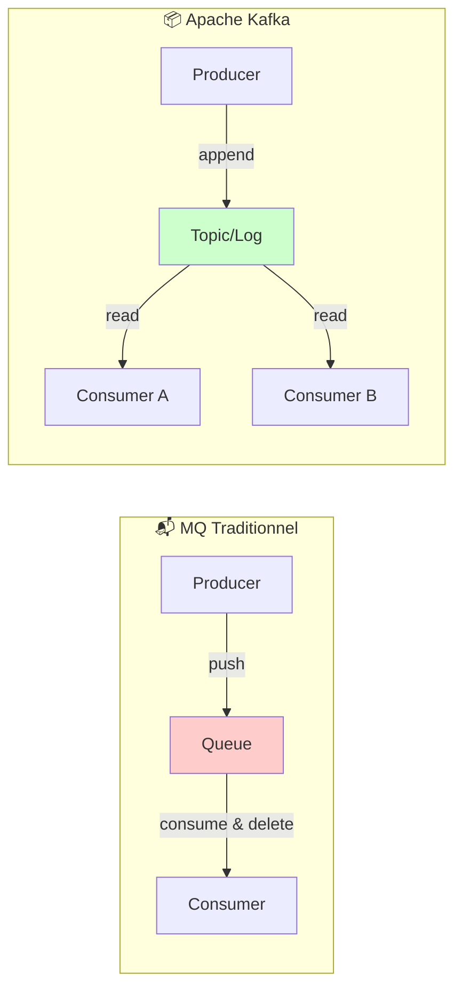
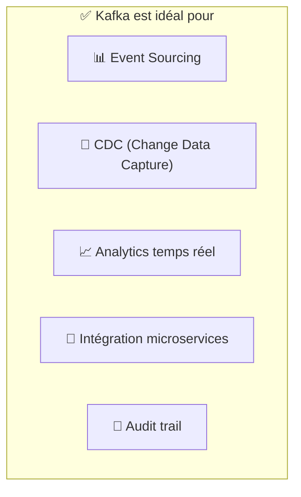
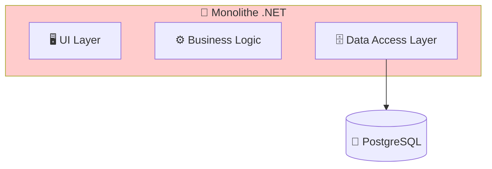
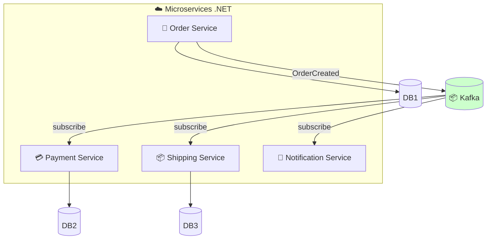
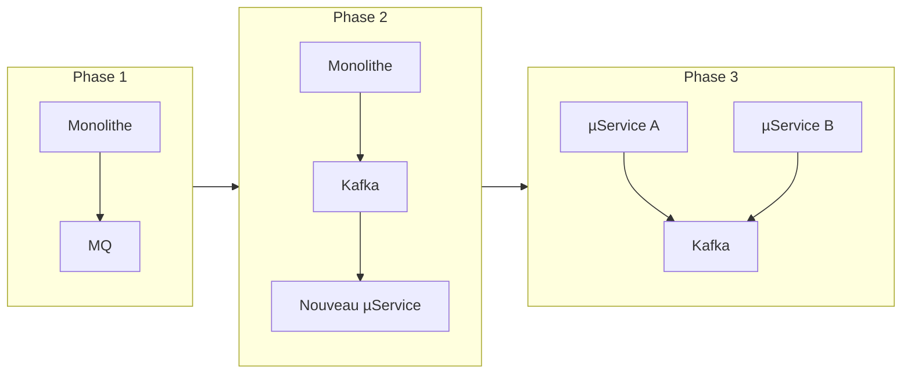
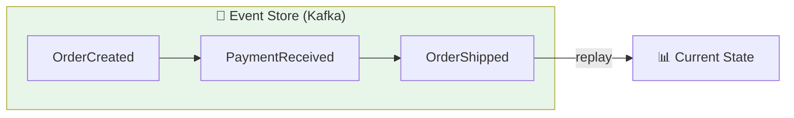
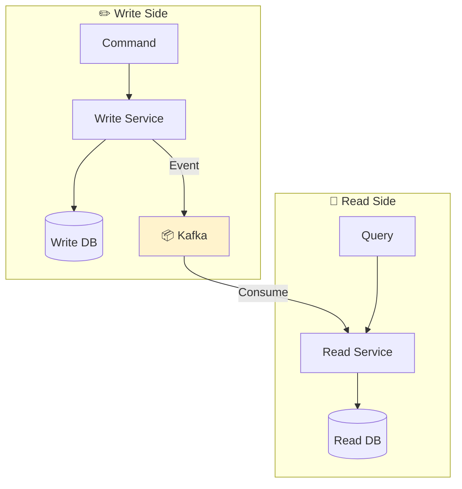
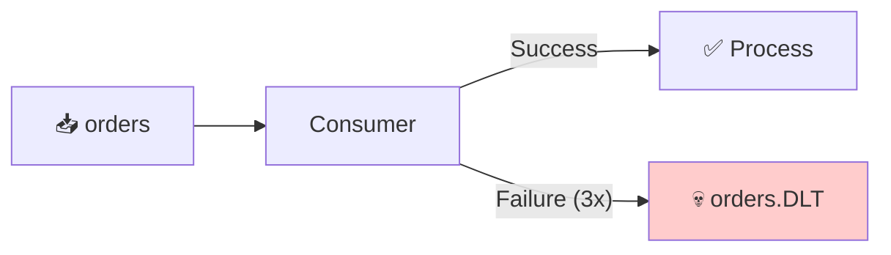
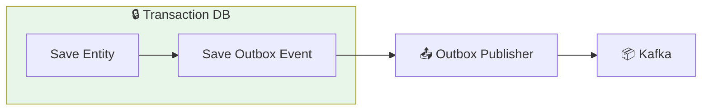

# 🔄 Guide de Migration : MQ Traditionnel → Apache Kafka

> **Pour équipes .NET** migrant d'une architecture monolithique vers microservices

## 📋 Contexte

Ce guide s'adresse aux développeurs .NET Core expérimentés qui :
- Utilisent actuellement un système de messaging traditionnel (IBM MQ, RabbitMQ, MSMQ)
- Migrent d'une architecture monolithique vers des microservices
- N'ont pas de connaissance préalable de Kafka

---

## 🎯 Pourquoi migrer vers Kafka ?

### Comparaison MQ Traditionnel vs Kafka



| Critère | MQ Traditionnel | Apache Kafka |
|---------|-----------------|--------------|
| **Modèle** | Queue (message supprimé après lecture) | Log (message persisté) |
| **Consumers** | Un seul consumer par message | Multiple consumers (replay possible) |
| **Throughput** | ~10K msg/sec | ~1M+ msg/sec |
| **Rétention** | Jusqu'à consommation | Configurable (jours/semaines) |
| **Ordering** | Par queue | Par partition |
| **Scalabilité** | Verticale | Horizontale |

### Cas d'usage favorisant Kafka



---

## 🏗️ Architecture : Monolithique → Event-Driven

### Avant : Architecture Monolithique



### Après : Architecture Event-Driven avec Kafka



---

## 🔀 Patterns de Migration

### Pattern 1 : Strangler Fig (Étranglement progressif)

Migrer progressivement en remplaçant les composants un par un.



### Pattern 2 : Event Sourcing

Stocker l'état comme une séquence d'événements.



```csharp
// Événement de domaine
public record OrderCreated(
    Guid OrderId,
    Guid CustomerId,
    List<OrderItem> Items,
    decimal TotalAmount,
    DateTime CreatedAt
);

// Publication vers Kafka
await _producer.ProduceAsync("orders.events", new Message<string, string>
{
    Key = order.Id.ToString(),
    Value = JsonSerializer.Serialize(new OrderCreated(...))
});
```

### Pattern 3 : CQRS avec Kafka

Séparer les commandes (write) des requêtes (read).



---

## 📝 Mapping des concepts MQ → Kafka

| Concept MQ | Équivalent Kafka | Notes |
|------------|------------------|-------|
| **Queue** | Topic | Un topic peut avoir plusieurs partitions |
| **Message** | Record | Clé + Valeur + Headers + Timestamp |
| **Consumer** | Consumer Group | Plusieurs consumers partagent le travail |
| **Acknowledge** | Commit Offset | Manuel ou automatique |
| **Dead Letter Queue** | DLT (Dead Letter Topic) | Topic séparé pour les erreurs |
| **Message Priority** | ❌ Non supporté | Utiliser des topics séparés |
| **Message Expiry** | Retention Policy | Au niveau du topic |

---

## 💻 Migration du code .NET

### Avant : IBM MQ / RabbitMQ

```csharp
// RabbitMQ - Producer
using var connection = factory.CreateConnection();
using var channel = connection.CreateModel();

channel.QueueDeclare("orders", durable: true, ...);
channel.BasicPublish("", "orders", null, body);

// RabbitMQ - Consumer
channel.BasicConsume("orders", autoAck: false, consumer);
```

### Après : Kafka avec Confluent.Kafka

```csharp
// Kafka - Producer
using var producer = new ProducerBuilder<string, string>(config).Build();

await producer.ProduceAsync("orders", new Message<string, string>
{
    Key = orderId,
    Value = JsonSerializer.Serialize(order)
});

// Kafka - Consumer
using var consumer = new ConsumerBuilder<string, string>(config).Build();
consumer.Subscribe("orders");

while (true)
{
    var result = consumer.Consume(cancellationToken);
    ProcessMessage(result.Message.Value);
    consumer.Commit(result);
}
```

### Configuration Kafka recommandée (.NET)

```csharp
// Producer Config - Fiabilité maximale
var producerConfig = new ProducerConfig
{
    BootstrapServers = "kafka:9092",
    
    // Idempotence pour éviter les doublons
    EnableIdempotence = true,
    Acks = Acks.All,
    
    // Retry configuration
    MessageSendMaxRetries = 10,
    RetryBackoffMs = 100,
    
    // Performance
    LingerMs = 5,
    BatchSize = 16384
};

// Consumer Config - Lecture fiable
var consumerConfig = new ConsumerConfig
{
    BootstrapServers = "kafka:9092",
    GroupId = "order-processor",
    
    // Commit manuel pour contrôle total
    EnableAutoCommit = false,
    AutoOffsetReset = AutoOffsetReset.Earliest,
    
    // Isolation pour transactions
    IsolationLevel = IsolationLevel.ReadCommitted
};
```

---

## 🔄 Gestion des erreurs : DLQ → DLT

### Pattern Dead Letter Topic



```csharp
public class KafkaConsumerWithDLT
{
    private const int MaxRetries = 3;
    
    public async Task ConsumeAsync(CancellationToken ct)
    {
        while (!ct.IsCancellationRequested)
        {
            var result = _consumer.Consume(ct);
            var retryCount = GetRetryCount(result.Message.Headers);
            
            try
            {
                await ProcessMessage(result.Message);
                _consumer.Commit(result);
            }
            catch (Exception ex)
            {
                if (retryCount >= MaxRetries)
                {
                    // Envoyer vers DLT
                    await SendToDLT(result.Message, ex);
                    _consumer.Commit(result);
                }
                else
                {
                    // Republier avec retry count incrémenté
                    await Republish(result.Message, retryCount + 1);
                    _consumer.Commit(result);
                }
            }
        }
    }
}
```

---

## 🏭 Intégration Entity Framework + Kafka

### Pattern Outbox pour garantir la cohérence



```csharp
// Entity
public class Order
{
    public Guid Id { get; set; }
    public string Status { get; set; }
    public decimal Total { get; set; }
}

// Outbox Event
public class OutboxEvent
{
    public Guid Id { get; set; }
    public string EventType { get; set; }
    public string Payload { get; set; }
    public DateTime CreatedAt { get; set; }
    public DateTime? ProcessedAt { get; set; }
}

// Service avec Outbox Pattern
public class OrderService
{
    public async Task CreateOrderAsync(CreateOrderCommand cmd)
    {
        await using var transaction = await _dbContext.Database
            .BeginTransactionAsync();
        
        try
        {
            // 1. Sauvegarder l'entité
            var order = new Order { ... };
            _dbContext.Orders.Add(order);
            
            // 2. Sauvegarder l'événement dans l'outbox
            var outboxEvent = new OutboxEvent
            {
                EventType = "OrderCreated",
                Payload = JsonSerializer.Serialize(new OrderCreatedEvent(order))
            };
            _dbContext.OutboxEvents.Add(outboxEvent);
            
            await _dbContext.SaveChangesAsync();
            await transaction.CommitAsync();
        }
        catch
        {
            await transaction.RollbackAsync();
            throw;
        }
    }
}

// Background service pour publier les événements
public class OutboxPublisher : BackgroundService
{
    protected override async Task ExecuteAsync(CancellationToken ct)
    {
        while (!ct.IsCancellationRequested)
        {
            var events = await _dbContext.OutboxEvents
                .Where(e => e.ProcessedAt == null)
                .OrderBy(e => e.CreatedAt)
                .Take(100)
                .ToListAsync(ct);
            
            foreach (var evt in events)
            {
                await _producer.ProduceAsync("domain-events", 
                    new Message<string, string>
                    {
                        Key = evt.Id.ToString(),
                        Value = evt.Payload
                    });
                
                evt.ProcessedAt = DateTime.UtcNow;
            }
            
            await _dbContext.SaveChangesAsync(ct);
            await Task.Delay(1000, ct);
        }
    }
}
```

---

## 📊 Checklist de migration

### Phase 1 : Préparation
- [ ] Inventaire des queues/topics MQ existants
- [ ] Mapping vers topics Kafka
- [ ] Définition des schémas d'événements
- [ ] Configuration infrastructure Kafka

### Phase 2 : Développement
- [ ] Migration des producers
- [ ] Migration des consumers
- [ ] Implémentation DLT
- [ ] Tests d'intégration

### Phase 3 : Déploiement
- [ ] Déploiement Kafka sur OpenShift
- [ ] Migration progressive (dual-write)
- [ ] Monitoring et alerting
- [ ] Décommissionnement MQ

---

## 🔗 Ressources complémentaires

- [Module 02 - Producer Reliability (.NET)](../day-01-foundations/module-02-producer-reliability/TUTORIAL-DOTNET.md)
- [Module 03 - Consumer Read Committed (.NET)](../day-01-foundations/module-03-consumer-read-committed/TUTORIAL-DOTNET.md)
- [Module 04 - Advanced Patterns (.NET)](../day-02-development/module-04-advanced-patterns/TUTORIAL-DOTNET.md)
- [Module 06 - Kafka Connect CDC](../day-03-integration/module-06-kafka-connect/README.md)
