# 🔷 Patterns .NET : Entity Framework + Apache Kafka

> Guide des patterns d'intégration entre Entity Framework Core et Kafka pour applications .NET

## 📋 Contexte

Ce guide couvre les patterns essentiels pour intégrer **Entity Framework Core** avec **Apache Kafka** dans une architecture microservices .NET.

---

## 🎯 Problématiques adressées

| Problème | Solution |
|----------|----------|
| Cohérence DB + Kafka | Outbox Pattern |
| Événements de domaine | Domain Events |
| Synchronisation données | CDC avec Debezium |
| Performance | Batch processing |

---

## 🏗️ Pattern 1 : Outbox Pattern

Garantit que les modifications DB et les événements Kafka sont cohérents.

```mermaid
flowchart LR
    subgraph Transaction["🔒 Transaction EF"]
        E["Entity"]
        O["OutboxEvent"]
    end
    
    E -->|"SaveChanges"| O
    O -->|"Background"| K["📦 Kafka"]
    
    style Transaction fill:#e8f5e9
```



### Modèles de données

```csharp
// Entities/Order.cs
public class Order
{
    public Guid Id { get; set; }
    public string CustomerId { get; set; } = string.Empty;
    public decimal TotalAmount { get; set; }
    public OrderStatus Status { get; set; }
    public DateTime CreatedAt { get; set; }
    public DateTime? UpdatedAt { get; set; }
    
    // Navigation
    public List<OrderItem> Items { get; set; } = new();
}

public enum OrderStatus
{
    Pending,
    Confirmed,
    Shipped,
    Delivered,
    Cancelled
}

// Entities/OutboxEvent.cs
public class OutboxEvent
{
    public Guid Id { get; set; }
    public string EventType { get; set; } = string.Empty;
    public string AggregateType { get; set; } = string.Empty;
    public string AggregateId { get; set; } = string.Empty;
    public string Payload { get; set; } = string.Empty;
    public DateTime CreatedAt { get; set; }
    public DateTime? ProcessedAt { get; set; }
    public int RetryCount { get; set; }
    public string? Error { get; set; }
}
```

### DbContext Configuration

```csharp
// Data/AppDbContext.cs
public class AppDbContext : DbContext
{
    public DbSet<Order> Orders => Set<Order>();
    public DbSet<OrderItem> OrderItems => Set<OrderItem>();
    public DbSet<OutboxEvent> OutboxEvents => Set<OutboxEvent>();

    public AppDbContext(DbContextOptions<AppDbContext> options) : base(options) { }

    protected override void OnModelCreating(ModelBuilder modelBuilder)
    {
        // Order configuration
        modelBuilder.Entity<Order>(entity =>
        {
            entity.HasKey(e => e.Id);
            entity.Property(e => e.CustomerId).IsRequired().HasMaxLength(100);
            entity.Property(e => e.TotalAmount).HasPrecision(18, 2);
            entity.HasIndex(e => e.CustomerId);
            entity.HasIndex(e => e.Status);
        });

        // OutboxEvent configuration
        modelBuilder.Entity<OutboxEvent>(entity =>
        {
            entity.HasKey(e => e.Id);
            entity.Property(e => e.EventType).IsRequired().HasMaxLength(200);
            entity.Property(e => e.AggregateType).IsRequired().HasMaxLength(100);
            entity.Property(e => e.AggregateId).IsRequired().HasMaxLength(100);
            entity.Property(e => e.Payload).IsRequired();
            
            // Index pour le polling
            entity.HasIndex(e => new { e.ProcessedAt, e.CreatedAt });
        });
    }
}
```

### Service avec Outbox

```csharp
// Services/OrderService.cs
public class OrderService
{
    private readonly AppDbContext _dbContext;
    private readonly ILogger<OrderService> _logger;

    public OrderService(AppDbContext dbContext, ILogger<OrderService> logger)
    {
        _dbContext = dbContext;
        _logger = logger;
    }

    public async Task<Order> CreateOrderAsync(CreateOrderCommand command)
    {
        // Utiliser une transaction explicite
        await using var transaction = await _dbContext.Database
            .BeginTransactionAsync(IsolationLevel.ReadCommitted);

        try
        {
            // 1. Créer l'entité
            var order = new Order
            {
                Id = Guid.NewGuid(),
                CustomerId = command.CustomerId,
                TotalAmount = command.Items.Sum(i => i.Price * i.Quantity),
                Status = OrderStatus.Pending,
                CreatedAt = DateTime.UtcNow,
                Items = command.Items.Select(i => new OrderItem
                {
                    Id = Guid.NewGuid(),
                    ProductId = i.ProductId,
                    Quantity = i.Quantity,
                    UnitPrice = i.Price
                }).ToList()
            };

            _dbContext.Orders.Add(order);

            // 2. Créer l'événement outbox (même transaction)
            var outboxEvent = new OutboxEvent
            {
                Id = Guid.NewGuid(),
                EventType = "OrderCreated",
                AggregateType = "Order",
                AggregateId = order.Id.ToString(),
                Payload = JsonSerializer.Serialize(new OrderCreatedEvent
                {
                    OrderId = order.Id,
                    CustomerId = order.CustomerId,
                    TotalAmount = order.TotalAmount,
                    ItemCount = order.Items.Count,
                    CreatedAt = order.CreatedAt
                }),
                CreatedAt = DateTime.UtcNow
            };

            _dbContext.OutboxEvents.Add(outboxEvent);

            // 3. Sauvegarder et committer
            await _dbContext.SaveChangesAsync();
            await transaction.CommitAsync();

            _logger.LogInformation("Order {OrderId} created with outbox event", order.Id);
            return order;
        }
        catch (Exception ex)
        {
            await transaction.RollbackAsync();
            _logger.LogError(ex, "Failed to create order");
            throw;
        }
    }

    public async Task UpdateOrderStatusAsync(Guid orderId, OrderStatus newStatus)
    {
        await using var transaction = await _dbContext.Database
            .BeginTransactionAsync(IsolationLevel.ReadCommitted);

        try
        {
            var order = await _dbContext.Orders.FindAsync(orderId)
                ?? throw new InvalidOperationException($"Order {orderId} not found");

            var oldStatus = order.Status;
            order.Status = newStatus;
            order.UpdatedAt = DateTime.UtcNow;

            // Événement de changement de statut
            var outboxEvent = new OutboxEvent
            {
                Id = Guid.NewGuid(),
                EventType = "OrderStatusChanged",
                AggregateType = "Order",
                AggregateId = order.Id.ToString(),
                Payload = JsonSerializer.Serialize(new OrderStatusChangedEvent
                {
                    OrderId = order.Id,
                    OldStatus = oldStatus.ToString(),
                    NewStatus = newStatus.ToString(),
                    ChangedAt = order.UpdatedAt.Value
                }),
                CreatedAt = DateTime.UtcNow
            };

            _dbContext.OutboxEvents.Add(outboxEvent);

            await _dbContext.SaveChangesAsync();
            await transaction.CommitAsync();
        }
        catch
        {
            await transaction.RollbackAsync();
            throw;
        }
    }
}
```

### Outbox Publisher (Background Service)

```csharp
// Services/OutboxPublisher.cs
public class OutboxPublisher : BackgroundService
{
    private readonly IServiceScopeFactory _scopeFactory;
    private readonly IProducer<string, string> _producer;
    private readonly ILogger<OutboxPublisher> _logger;
    private readonly TimeSpan _pollInterval = TimeSpan.FromSeconds(1);
    private readonly int _batchSize = 100;

    public OutboxPublisher(
        IServiceScopeFactory scopeFactory,
        IProducer<string, string> producer,
        ILogger<OutboxPublisher> logger)
    {
        _scopeFactory = scopeFactory;
        _producer = producer;
        _logger = logger;
    }

    protected override async Task ExecuteAsync(CancellationToken stoppingToken)
    {
        _logger.LogInformation("Outbox Publisher started");

        while (!stoppingToken.IsCancellationRequested)
        {
            try
            {
                await ProcessOutboxAsync(stoppingToken);
            }
            catch (Exception ex)
            {
                _logger.LogError(ex, "Error processing outbox");
            }

            await Task.Delay(_pollInterval, stoppingToken);
        }
    }

    private async Task ProcessOutboxAsync(CancellationToken ct)
    {
        using var scope = _scopeFactory.CreateScope();
        var dbContext = scope.ServiceProvider.GetRequiredService<AppDbContext>();

        // Récupérer les événements non traités
        var events = await dbContext.OutboxEvents
            .Where(e => e.ProcessedAt == null && e.RetryCount < 5)
            .OrderBy(e => e.CreatedAt)
            .Take(_batchSize)
            .ToListAsync(ct);

        if (!events.Any()) return;

        _logger.LogDebug("Processing {Count} outbox events", events.Count);

        foreach (var evt in events)
        {
            try
            {
                // Déterminer le topic basé sur le type d'agrégat
                var topic = $"domain.{evt.AggregateType.ToLower()}.events";

                // Headers pour le tracing
                var headers = new Headers
                {
                    { "event-type", Encoding.UTF8.GetBytes(evt.EventType) },
                    { "event-id", Encoding.UTF8.GetBytes(evt.Id.ToString()) },
                    { "aggregate-id", Encoding.UTF8.GetBytes(evt.AggregateId) },
                    { "correlation-id", Encoding.UTF8.GetBytes(evt.AggregateId) }
                };

                var message = new Message<string, string>
                {
                    Key = evt.AggregateId,
                    Value = evt.Payload,
                    Headers = headers
                };

                // Envoi synchrone pour garantie
                var result = await _producer.ProduceAsync(topic, message, ct);

                // Marquer comme traité
                evt.ProcessedAt = DateTime.UtcNow;

                _logger.LogDebug(
                    "Published {EventType} to {Topic} partition {Partition} offset {Offset}",
                    evt.EventType, topic, result.Partition.Value, result.Offset.Value);
            }
            catch (Exception ex)
            {
                evt.RetryCount++;
                evt.Error = ex.Message;
                _logger.LogWarning(ex, 
                    "Failed to publish event {EventId}, retry {Retry}/5", 
                    evt.Id, evt.RetryCount);
            }
        }

        await dbContext.SaveChangesAsync(ct);
    }
}
```

---

## 🏗️ Pattern 2 : Domain Events avec MediatR

Intégration des événements de domaine avec Entity Framework et publication Kafka.

```mermaid
flowchart LR
    C["Command"] --> H["Handler"]
    H --> E["Entity"]
    E -->|"AddDomainEvent"| DE["DomainEvent"]
    DE --> M["MediatR"]
    M --> KH["KafkaHandler"]
    KH --> K["📦 Kafka"]
```



### Configuration MediatR

```csharp
// Domain/IDomainEvent.cs
public interface IDomainEvent : INotification
{
    Guid EventId { get; }
    DateTime OccurredAt { get; }
}

// Domain/DomainEventBase.cs
public abstract record DomainEventBase : IDomainEvent
{
    public Guid EventId { get; } = Guid.NewGuid();
    public DateTime OccurredAt { get; } = DateTime.UtcNow;
}

// Domain/Events/OrderCreatedEvent.cs
public record OrderCreatedDomainEvent(
    Guid OrderId,
    string CustomerId,
    decimal TotalAmount
) : DomainEventBase;

// Domain/Events/OrderShippedEvent.cs
public record OrderShippedDomainEvent(
    Guid OrderId,
    string TrackingNumber,
    DateTime ShippedAt
) : DomainEventBase;
```

### Entity avec Domain Events

```csharp
// Domain/AggregateRoot.cs
public abstract class AggregateRoot
{
    private readonly List<IDomainEvent> _domainEvents = new();
    public IReadOnlyList<IDomainEvent> DomainEvents => _domainEvents.AsReadOnly();

    protected void AddDomainEvent(IDomainEvent domainEvent)
    {
        _domainEvents.Add(domainEvent);
    }

    public void ClearDomainEvents()
    {
        _domainEvents.Clear();
    }
}

// Domain/Order.cs
public class Order : AggregateRoot
{
    public Guid Id { get; private set; }
    public string CustomerId { get; private set; } = string.Empty;
    public decimal TotalAmount { get; private set; }
    public OrderStatus Status { get; private set; }

    private Order() { } // EF

    public static Order Create(string customerId, decimal totalAmount)
    {
        var order = new Order
        {
            Id = Guid.NewGuid(),
            CustomerId = customerId,
            TotalAmount = totalAmount,
            Status = OrderStatus.Pending
        };

        // Émettre l'événement de domaine
        order.AddDomainEvent(new OrderCreatedDomainEvent(
            order.Id, customerId, totalAmount));

        return order;
    }

    public void Ship(string trackingNumber)
    {
        if (Status != OrderStatus.Confirmed)
            throw new InvalidOperationException("Order must be confirmed before shipping");

        Status = OrderStatus.Shipped;

        AddDomainEvent(new OrderShippedDomainEvent(
            Id, trackingNumber, DateTime.UtcNow));
    }
}
```

### Dispatch des événements via SaveChanges

```csharp
// Data/AppDbContext.cs
public class AppDbContext : DbContext
{
    private readonly IMediator _mediator;

    public AppDbContext(DbContextOptions<AppDbContext> options, IMediator mediator) 
        : base(options)
    {
        _mediator = mediator;
    }

    public override async Task<int> SaveChangesAsync(CancellationToken cancellationToken = default)
    {
        // Récupérer les événements de domaine avant la sauvegarde
        var domainEvents = ChangeTracker
            .Entries<AggregateRoot>()
            .SelectMany(e => e.Entity.DomainEvents)
            .ToList();

        // Sauvegarder d'abord
        var result = await base.SaveChangesAsync(cancellationToken);

        // Publier les événements après la sauvegarde réussie
        foreach (var domainEvent in domainEvents)
        {
            await _mediator.Publish(domainEvent, cancellationToken);
        }

        // Nettoyer les événements
        ChangeTracker
            .Entries<AggregateRoot>()
            .ToList()
            .ForEach(e => e.Entity.ClearDomainEvents());

        return result;
    }
}
```

### Handler Kafka pour les Domain Events

```csharp
// Handlers/KafkaEventHandler.cs
public class KafkaEventHandler : 
    INotificationHandler<OrderCreatedDomainEvent>,
    INotificationHandler<OrderShippedDomainEvent>
{
    private readonly IProducer<string, string> _producer;
    private readonly ILogger<KafkaEventHandler> _logger;

    public KafkaEventHandler(
        IProducer<string, string> producer, 
        ILogger<KafkaEventHandler> logger)
    {
        _producer = producer;
        _logger = logger;
    }

    public async Task Handle(OrderCreatedDomainEvent notification, CancellationToken ct)
    {
        await PublishToKafka("order.created", notification.OrderId.ToString(), notification, ct);
    }

    public async Task Handle(OrderShippedDomainEvent notification, CancellationToken ct)
    {
        await PublishToKafka("order.shipped", notification.OrderId.ToString(), notification, ct);
    }

    private async Task PublishToKafka<T>(string topic, string key, T evt, CancellationToken ct)
        where T : IDomainEvent
    {
        var message = new Message<string, string>
        {
            Key = key,
            Value = JsonSerializer.Serialize(evt),
            Headers = new Headers
            {
                { "event-id", Encoding.UTF8.GetBytes(evt.EventId.ToString()) },
                { "event-type", Encoding.UTF8.GetBytes(typeof(T).Name) }
            }
        };

        var result = await _producer.ProduceAsync(topic, message, ct);
        
        _logger.LogInformation(
            "Published {EventType} to {Topic}:{Partition}@{Offset}",
            typeof(T).Name, topic, result.Partition.Value, result.Offset.Value);
    }
}
```

---

## 🏗️ Pattern 3 : Consumer avec EF Core

Consommer des événements Kafka et mettre à jour la base de données.

```mermaid
flowchart LR
    K["📦 Kafka"] --> C["Consumer"]
    C --> H["Handler"]
    H --> EF["DbContext"]
    EF --> DB[("PostgreSQL")]
    
    C -->|"Error"| DLT["💀 DLT"]
```



### Consumer Service

```csharp
// Services/OrderEventConsumer.cs
public class OrderEventConsumer : BackgroundService
{
    private readonly IServiceScopeFactory _scopeFactory;
    private readonly IConsumer<string, string> _consumer;
    private readonly IProducer<string, string> _dlqProducer;
    private readonly ILogger<OrderEventConsumer> _logger;
    private const int MaxRetries = 3;

    public OrderEventConsumer(
        IServiceScopeFactory scopeFactory,
        IConsumer<string, string> consumer,
        IProducer<string, string> dlqProducer,
        ILogger<OrderEventConsumer> logger)
    {
        _scopeFactory = scopeFactory;
        _consumer = consumer;
        _dlqProducer = dlqProducer;
        _logger = logger;
    }

    protected override async Task ExecuteAsync(CancellationToken stoppingToken)
    {
        _consumer.Subscribe(new[] { "order.created", "order.shipped" });

        while (!stoppingToken.IsCancellationRequested)
        {
            try
            {
                var result = _consumer.Consume(stoppingToken);
                await ProcessMessageAsync(result, stoppingToken);
                _consumer.Commit(result);
            }
            catch (OperationCanceledException)
            {
                break;
            }
            catch (Exception ex)
            {
                _logger.LogError(ex, "Consumer error");
            }
        }

        _consumer.Close();
    }

    private async Task ProcessMessageAsync(
        ConsumeResult<string, string> result, 
        CancellationToken ct)
    {
        var retryCount = GetRetryCount(result.Message.Headers);
        
        try
        {
            using var scope = _scopeFactory.CreateScope();
            var dbContext = scope.ServiceProvider.GetRequiredService<AppDbContext>();

            var eventType = GetHeader(result.Message.Headers, "event-type");
            
            switch (eventType)
            {
                case "OrderCreatedDomainEvent":
                    await HandleOrderCreated(result.Message.Value, dbContext, ct);
                    break;
                    
                case "OrderShippedDomainEvent":
                    await HandleOrderShipped(result.Message.Value, dbContext, ct);
                    break;
                    
                default:
                    _logger.LogWarning("Unknown event type: {EventType}", eventType);
                    break;
            }
        }
        catch (Exception ex)
        {
            _logger.LogError(ex, "Error processing message");
            
            if (retryCount >= MaxRetries)
            {
                await SendToDLT(result, ex, ct);
            }
            else
            {
                throw; // Retry via consumer
            }
        }
    }

    private async Task HandleOrderCreated(
        string payload, AppDbContext dbContext, CancellationToken ct)
    {
        var evt = JsonSerializer.Deserialize<OrderCreatedDomainEvent>(payload)!;
        
        // Idempotence check
        var exists = await dbContext.OrderProjections
            .AnyAsync(o => o.OrderId == evt.OrderId, ct);
            
        if (exists)
        {
            _logger.LogDebug("Order {OrderId} already projected, skipping", evt.OrderId);
            return;
        }

        // Créer la projection
        var projection = new OrderProjection
        {
            OrderId = evt.OrderId,
            CustomerId = evt.CustomerId,
            TotalAmount = evt.TotalAmount,
            Status = "Pending",
            CreatedAt = evt.OccurredAt
        };

        dbContext.OrderProjections.Add(projection);
        await dbContext.SaveChangesAsync(ct);
        
        _logger.LogInformation("Projected order {OrderId}", evt.OrderId);
    }

    private async Task HandleOrderShipped(
        string payload, AppDbContext dbContext, CancellationToken ct)
    {
        var evt = JsonSerializer.Deserialize<OrderShippedDomainEvent>(payload)!;
        
        var projection = await dbContext.OrderProjections
            .FirstOrDefaultAsync(o => o.OrderId == evt.OrderId, ct);

        if (projection == null)
        {
            _logger.LogWarning("Order {OrderId} not found for shipping update", evt.OrderId);
            return;
        }

        projection.Status = "Shipped";
        projection.TrackingNumber = evt.TrackingNumber;
        projection.ShippedAt = evt.ShippedAt;

        await dbContext.SaveChangesAsync(ct);
        
        _logger.LogInformation("Updated order {OrderId} to Shipped", evt.OrderId);
    }

    private async Task SendToDLT(
        ConsumeResult<string, string> result, Exception ex, CancellationToken ct)
    {
        var dlqMessage = new Message<string, string>
        {
            Key = result.Message.Key,
            Value = result.Message.Value,
            Headers = new Headers(result.Message.Headers)
            {
                { "error", Encoding.UTF8.GetBytes(ex.Message) },
                { "original-topic", Encoding.UTF8.GetBytes(result.Topic) },
                { "failed-at", Encoding.UTF8.GetBytes(DateTime.UtcNow.ToString("O")) }
            }
        };

        await _dlqProducer.ProduceAsync($"{result.Topic}.DLT", dlqMessage, ct);
        _logger.LogWarning("Message sent to DLT after {Retries} retries", MaxRetries);
    }

    private static int GetRetryCount(Headers headers)
    {
        var header = headers.FirstOrDefault(h => h.Key == "retry-count");
        if (header == null) return 0;
        return int.TryParse(Encoding.UTF8.GetString(header.GetValueBytes()), out var count) 
            ? count : 0;
    }

    private static string GetHeader(Headers headers, string key)
    {
        var header = headers.FirstOrDefault(h => h.Key == key);
        return header != null ? Encoding.UTF8.GetString(header.GetValueBytes()) : string.Empty;
    }
}
```

---

## 🏗️ Pattern 4 : Transactional Outbox avec PostgreSQL

Version optimisée utilisant les fonctionnalités PostgreSQL.

```csharp
// Services/PostgresOutboxPublisher.cs
public class PostgresOutboxPublisher : BackgroundService
{
    private readonly NpgsqlDataSource _dataSource;
    private readonly IProducer<string, string> _producer;
    private readonly ILogger<PostgresOutboxPublisher> _logger;

    protected override async Task ExecuteAsync(CancellationToken stoppingToken)
    {
        while (!stoppingToken.IsCancellationRequested)
        {
            await using var connection = await _dataSource.OpenConnectionAsync(stoppingToken);
            await using var transaction = await connection.BeginTransactionAsync(stoppingToken);

            try
            {
                // SELECT FOR UPDATE SKIP LOCKED pour éviter les conflits
                var events = await connection.QueryAsync<OutboxEvent>(
                    @"SELECT * FROM outbox_events 
                      WHERE processed_at IS NULL 
                      ORDER BY created_at 
                      LIMIT 100 
                      FOR UPDATE SKIP LOCKED",
                    transaction: transaction);

                foreach (var evt in events)
                {
                    var topic = $"domain.{evt.AggregateType.ToLower()}.events";
                    
                    await _producer.ProduceAsync(topic, new Message<string, string>
                    {
                        Key = evt.AggregateId,
                        Value = evt.Payload
                    }, stoppingToken);

                    await connection.ExecuteAsync(
                        "UPDATE outbox_events SET processed_at = @now WHERE id = @id",
                        new { now = DateTime.UtcNow, id = evt.Id },
                        transaction);
                }

                await transaction.CommitAsync(stoppingToken);
            }
            catch (Exception ex)
            {
                await transaction.RollbackAsync(stoppingToken);
                _logger.LogError(ex, "Outbox processing error");
            }

            await Task.Delay(1000, stoppingToken);
        }
    }
}
```

---

## 📦 Configuration Program.cs complète

```csharp
// Program.cs
using Confluent.Kafka;
using Microsoft.EntityFrameworkCore;

var builder = WebApplication.CreateBuilder(args);

// Entity Framework avec PostgreSQL
builder.Services.AddDbContext<AppDbContext>(options =>
    options.UseNpgsql(builder.Configuration.GetConnectionString("PostgreSQL")));

// MediatR pour Domain Events
builder.Services.AddMediatR(cfg => 
    cfg.RegisterServicesFromAssembly(typeof(Program).Assembly));

// Kafka Producer (Singleton)
builder.Services.AddSingleton<IProducer<string, string>>(sp =>
{
    var config = new ProducerConfig
    {
        BootstrapServers = builder.Configuration["Kafka:BootstrapServers"],
        EnableIdempotence = true,
        Acks = Acks.All,
        MaxInFlight = 5,
        LingerMs = 5,
        BatchSize = 16384
    };
    return new ProducerBuilder<string, string>(config).Build();
});

// Kafka Consumer (Singleton)
builder.Services.AddSingleton<IConsumer<string, string>>(sp =>
{
    var config = new ConsumerConfig
    {
        BootstrapServers = builder.Configuration["Kafka:BootstrapServers"],
        GroupId = builder.Configuration["Kafka:GroupId"],
        EnableAutoCommit = false,
        AutoOffsetReset = AutoOffsetReset.Earliest,
        IsolationLevel = IsolationLevel.ReadCommitted
    };
    return new ConsumerBuilder<string, string>(config).Build();
});

// Background Services
builder.Services.AddHostedService<OutboxPublisher>();
builder.Services.AddHostedService<OrderEventConsumer>();

// Services métier
builder.Services.AddScoped<OrderService>();

var app = builder.Build();

// Endpoints
app.MapPost("/orders", async (CreateOrderCommand cmd, OrderService service) =>
{
    var order = await service.CreateOrderAsync(cmd);
    return Results.Created($"/orders/{order.Id}", order);
});

app.MapPut("/orders/{id}/ship", async (Guid id, ShipOrderCommand cmd, OrderService service) =>
{
    await service.ShipOrderAsync(id, cmd.TrackingNumber);
    return Results.NoContent();
});

app.Run();
```

---

## 📚 Ressources

- [Module 02 - Producer Reliability (.NET)](../day-01-foundations/module-02-producer-reliability/TUTORIAL-DOTNET.md)
- [Module 04 - Advanced Patterns (.NET)](../day-02-development/module-04-advanced-patterns/TUTORIAL-DOTNET.md)
- [Guide Migration MQ → Kafka](./MIGRATION-MQ-KAFKA.md)
- [Déploiement OpenShift](./DEPLOYMENT-OPENSHIFT.md)
