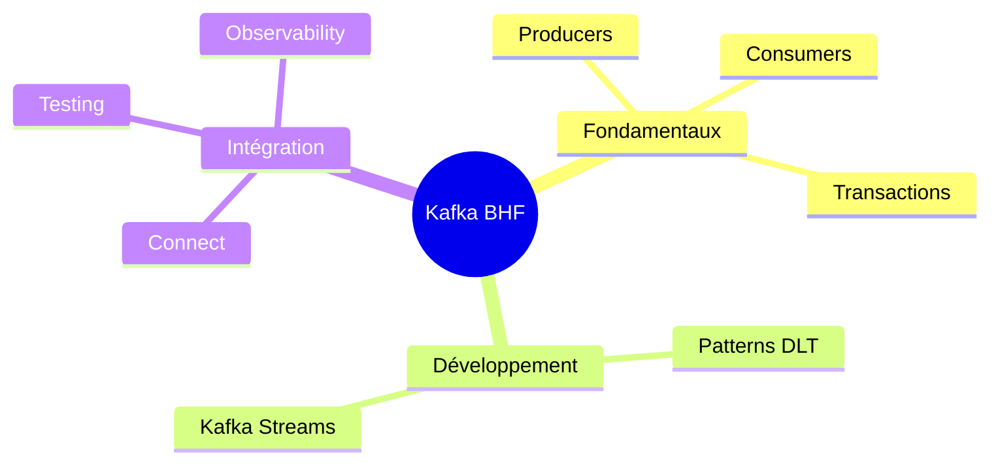
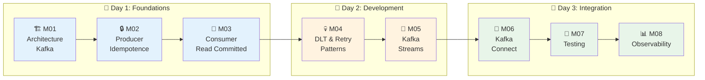
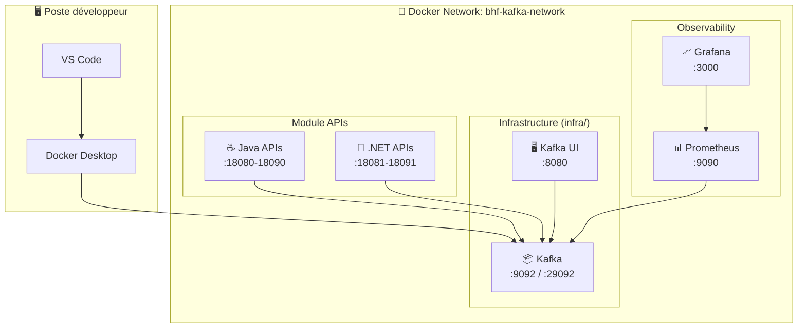
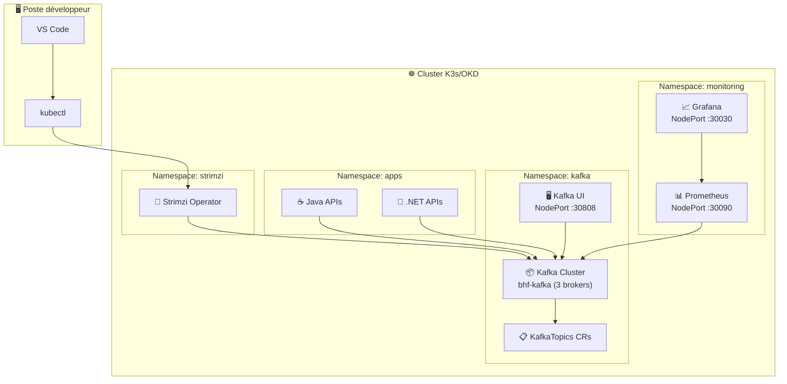
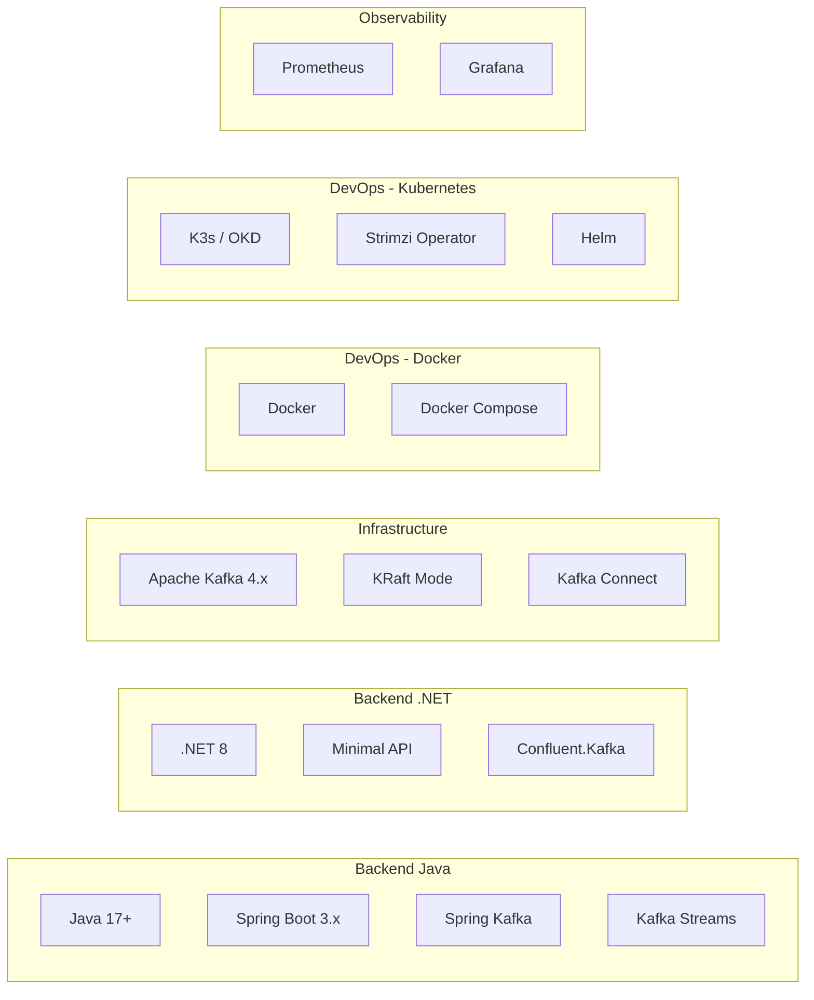

# 🎓 Formation Kafka Enterprise - BHF

> **Version 2.0** | Formation auto-rythmée pour développeurs Java & .NET

---

## 📋 Executive Summary

Cette formation **Kafka pour développeurs** est conçue pour les équipes IT de **BHF** souhaitant maîtriser Apache Kafka dans un contexte enterprise. Elle couvre les fondamentaux jusqu'aux patterns avancés, avec une approche **hands-on** via des labs pratiques.



---

## 🎯 Objectifs de la formation

À l'issue de cette formation, les participants seront capables de :

| Compétence | Description |
|------------|-------------|
| **Producer Reliability** | Configurer des producers idempotents avec gestion des retries |
| **Consumer Transactions** | Implémenter des consumers avec isolation `read_committed` |
| **Error Handling** | Mettre en place des Dead Letter Topics et stratégies de retry |
| **Stream Processing** | Développer des applications Kafka Streams temps réel |
| **Data Integration** | Déployer et configurer des connecteurs Kafka Connect |
| **Quality Assurance** | Tester les applications Kafka (unit + integration) |
| **Production Readiness** | Monitorer Kafka avec Prometheus et Grafana |

---

## 🗓️ Structure de la formation

```mermaid
gantt
    title Programme de formation (3 jours)
    dateFormat X
    axisFormat %s
    
    section Day 1 - Fondamentaux
    Module 01 - Architecture Kafka      :m01, 0, 1
    Module 02 - Producer Reliability    :m02, 1, 3
    Module 03 - Consumer Transactions   :m03, 3, 5
    
    section Day 2 - Développement
    Module 04 - Advanced Patterns       :m04, 5, 7
    Module 05 - Kafka Streams           :m05, 7, 9
    
    section Day 3 - Intégration
    Module 06 - Kafka Connect           :m06, 9, 11
    Module 07 - Testing                 :m07, 11, 12
    Module 08 - Observability           :m08, 12, 13
```



### Parcours d'apprentissage



---

## 📚 Détail des modules

### [Day 1 - Fondamentaux Kafka](../day-01-foundations/README.md)

| Module | Titre | Durée | Technologies |
|--------|-------|-------|--------------|
| **M01** | Architecture Kafka & KRaft | 30-45 min | Docker, Kafka CLI |
| **M02** | Producer Reliability (Idempotence) | 60-90 min | Java, .NET, Toxiproxy |
| **M03** | Consumer Read Committed | 60-90 min | Java, .NET |

**Compétences acquises :**
- Architecture cluster Kafka (Brokers, Topics, Partitions)
- Mode KRaft vs ZooKeeper
- Concepts Producer/Consumer et Offsets
- Configuration `enable.idempotence=true`
- Gestion des retries et timeouts
- Transactions Kafka et isolation level
- Callbacks et gestion asynchrone

### [Day 2 - Développement avancé](../day-02-development/README.md)

| Module | Titre | Durée | Technologies |
|--------|-------|-------|--------------|
| **M04** | Advanced Patterns (DLT, Retry) | 90-120 min | Spring Kafka, .NET |
| **M05** | Kafka Streams | 90-120 min | Kafka Streams API |

**Compétences acquises :**
- Dead Letter Topic pattern
- Backoff exponentiel
- KStream / KTable
- Windowing et agrégations
- Interactive Queries

### [Day 3 - Intégration & Production](../day-03-integration/README.md)

| Module | Titre | Durée | Technologies |
|--------|-------|-------|--------------|
| **M06** | Kafka Connect | 60-90 min | Connect REST API |
| **M07** | Testing Kafka Applications | 60 min | JUnit, Testcontainers |
| **M08** | Observability | 60-90 min | Prometheus, Grafana |

**Compétences acquises :**
- Source & Sink Connectors
- MockProducer / MockConsumer
- Tests d'intégration avec Testcontainers
- Métriques JMX et alerting

---

## 🏗️ Architecture technique

> 💡 **Deux modes de déploiement** : Cette formation supporte **Docker** (développement local) et **OKD/K3s** (environnement Kubernetes).

### 🐳 Mode Docker (Développement local)



### ☸️ Mode OKD/K3s (Kubernetes)



### Stack technologique



---

## 💻 Prérequis techniques

### Logiciels requis (Mode Docker)

| Outil | Version | Installation |
|-------|---------|--------------|
| **VS Code** | Latest | [code.visualstudio.com](https://code.visualstudio.com) |
| **Docker Desktop** | 4.x+ | [docker.com](https://docker.com) |
| **Java JDK** | 17+ | `winget install Microsoft.OpenJDK.17` |
| **Maven** | 3.8+ | `winget install Apache.Maven` |
| **.NET SDK** | 8.0+ | `winget install Microsoft.DotNet.SDK.8` |
| **Git** | Latest | `winget install Git.Git` |

### Logiciels requis (Mode OKD/K3s)

| Outil | Version | Installation |
|-------|---------|--------------|
| **kubectl** | Latest | `curl -LO https://dl.k8s.io/release/$(curl -L -s https://dl.k8s.io/release/stable.txt)/bin/linux/amd64/kubectl` |
| **Helm** | 3.x+ | `curl https://raw.githubusercontent.com/helm/helm/main/scripts/get-helm-3 \| bash` |
| **K3s** | Latest | `curl -sfL https://get.k3s.io \| sh -` |
| **Java JDK** | 17+ | `sudo apt install openjdk-17-jdk` |
| **.NET SDK** | 8.0+ | Voir [docs.microsoft.com](https://docs.microsoft.com/dotnet/core/install/linux-ubuntu) |

> 📘 Pour une installation complète K8s, voir **[Guide Installation OKD/K8s Ubuntu](./INSTALL-OKD-UBUNTU.md)**

### Extensions VS Code recommandées

```bash
# Java
code --install-extension vscjava.vscode-java-pack
code --install-extension vmware.vscode-boot-dev-pack

# .NET
code --install-extension ms-dotnettools.csharp
code --install-extension ms-dotnettools.csdevkit

# Docker & REST
code --install-extension ms-azuretools.vscode-docker
code --install-extension humao.rest-client
```

### Connaissances préalables

- ✅ Programmation Java ou C#/.NET
- ✅ Concepts REST API
- ✅ Bases Docker (containers, images, compose)
- ✅ Notions de messaging asynchrone

---

## 📂 Structure du repository

```text
formation-v2/
├── 00-overview/              # Vue d'ensemble (ce document)
├── infra/                    # Infrastructure Docker partagée
│   └── docker-compose.single-node.yml
│
├── day-01-foundations/       # Jour 1 - Fondamentaux
│   ├── module-01-cluster/    # Architecture Kafka & KRaft
│   │   ├── README.md         # Théorie + Lab CLI
│   │   └── scripts/
│   ├── module-02-producer-reliability/
│   │   ├── README.md         # Théorie
│   │   ├── TUTORIAL-JAVA.md  # Lab Java pas-à-pas
│   │   ├── TUTORIAL-DOTNET.md
│   │   ├── java/             # Code source Java
│   │   ├── dotnet/           # Code source .NET
│   │   └── docker-compose.module.yml
│   └── module-03-consumer-read-committed/
│
├── day-02-development/       # Jour 2 - Développement
│   ├── module-04-advanced-patterns/
│   └── module-05-kafka-streams/
│
└── day-03-integration/       # Jour 3 - Intégration
    ├── module-06-kafka-connect/
    ├── module-07-testing/
    └── module-08-observability/
```

---

## 🚀 Quick Start

### 1. Cloner le repository

```bash
git clone https://github.com/msellamiTN/kafka-bhf.git
cd kafka-bhf/formation-v2
```

### 2. Choisir votre environnement

<details>
<summary>🐳 <b>Mode Docker (Windows/Mac/Linux)</b></summary>

**Démarrer Kafka** :

```bash
cd infra
docker-compose -f docker-compose.single-node.yml up -d
```

**Vérifier l'installation** :

```bash
# Kafka UI disponible sur http://localhost:8080
curl http://localhost:8080
```

</details>

<details>
<summary>☸️ <b>Mode OKD/K3s (Linux/Ubuntu)</b></summary>

**Installer les prérequis** :

```bash
cd infra/Scripts
sudo ./01-install-prerequisites.sh
```

**Installer K3s** :

```bash
sudo ./02-install-k3s.sh
```

**Installer Kafka avec Strimzi** :

```bash
sudo ./03-install-kafka.sh
```

**Vérifier l'installation** :

```bash
# Vérifier le cluster Kafka
kubectl get kafka -n kafka
kubectl get pods -n kafka

# Kafka UI disponible sur http://<NODE_IP>:30808
```

> 📘 Guide complet : **[Installation OKD/K8s Ubuntu](./INSTALL-OKD-UBUNTU.md)**

</details>

### 3. Commencer le premier module

```bash
cd day-01-foundations/module-01-cluster
# Suivre le README.md (supporte Docker ET K8s)
```

---

## 📊 Ports de référence

### 🐳 Mode Docker

| Service | Port | Description |
|---------|------|-------------|
| Kafka (externe) | 9092 | Bootstrap servers (localhost) |
| Kafka (Docker) | 29092 | Bootstrap servers (containers) |
| Kafka UI | 8080 | Interface web |
| M02 Java API | 18080 | Producer Reliability |
| M02 .NET API | 18081 | Producer Reliability |
| M03 Java API | 18090 | Consumer Read Committed |
| M03 .NET API | 18091 | Consumer Read Committed |
| M04 Java API | 18082 | Advanced Patterns |
| M04 .NET Consumer | 18083 | Advanced Patterns |
| M05 Streams App | 18084 | Kafka Streams |
| Kafka Connect | 8083 | REST API |
| Prometheus | 9090 | Metrics |
| Grafana | 3000 | Dashboards |
| JMX Exporter | 9404 | Kafka JMX Metrics |

### ☸️ Mode OKD/K3s

| Service | Port/NodePort | URL |
|---------|---------------|-----|
| Kafka Bootstrap | 9092 (ClusterIP) | `bhf-kafka-kafka-bootstrap.kafka.svc:9092` |
| Kafka UI | 30808 | `http://<NODE_IP>:30808` |
| Prometheus | 30090 | `http://<NODE_IP>:30090` |
| Grafana | 30030 | `http://<NODE_IP>:30030` |
| Local Registry | 5000 | `localhost:5000` |

---

## � Guides spécialisés

| Guide | Description | Audience |
|-------|-------------|----------|
| [� Installation OKD/K8s Ubuntu](./INSTALL-OKD-UBUNTU.md) | Installer OKD/Kubernetes sur Ubuntu 25.04 | DevOps / Développeurs |
| [�🔄 Migration MQ → Kafka](./MIGRATION-MQ-KAFKA.md) | Migrer d'un MQ traditionnel vers Kafka | Équipes migrant de monolithique vers microservices |
| [☸️ Déploiement OpenShift](./DEPLOYMENT-OPENSHIFT.md) | Déployer Kafka et apps .NET sur OpenShift | DevOps / Platform teams |
| [🔷 Patterns .NET + EF](./PATTERNS-DOTNET-EF.md) | Intégration Entity Framework + Kafka | Développeurs .NET Core |

---

## �📞 Support

| Contact | Rôle |
|---------|------|
| **Data2AI Academy** | Organisme de formation |
| **Équipe BHF** | Client |

---

## 📜 Licence

© 2024-2026 Data2AI Academy - Formation Kafka Enterprise BHF

---

*Dernière mise à jour : Janvier 2026*
