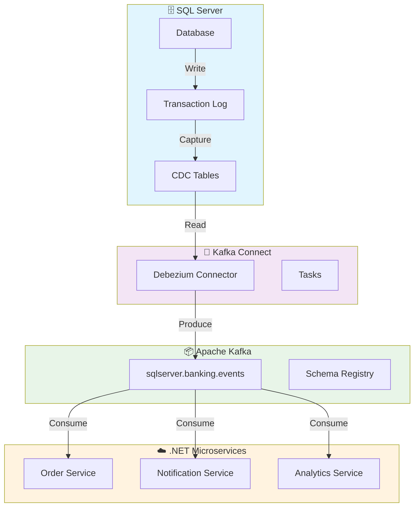

# 🗄️ SQL Server + CDC avec Kafka Connect

> Guide complet pour intégrer SQL Server avec Apache Kafka via Change Data Capture (CDC)

---

## 📋 Contexte

Ce guide s'adresse aux développeurs .NET Core travaillant avec **SQL Server** dans un environnement **microservices** et souhaitant implémenter du **Change Data Capture (CDC)** avec **Apache Kafka**.

---

## 🎯 Objectifs

À la fin de ce guide, vous serez capable de :

- ✅ Configurer SQL Server pour le CDC
- ✅ Déployer un connecteur Debezium SQL Server
- ✅ Capturer les changements en temps réel
- ✅ Intégrer avec des microservices .NET
- ✅ Monitorer et dépanner le pipeline CDC

---

## 🏗️ Architecture CDC avec SQL Server



---

## 🔧 Étape 1 : Configuration SQL Server

### 1.1 Activer le CDC sur la base de données

```sql
-- Activer le CDC sur la base de données
USE master;
GO
EXEC sys.sp_cdc_enable_db;
GO

-- Vérifier que le CDC est activé
SELECT name, is_cdc_enabled
FROM sys.databases
WHERE name = 'BankingDB';
GO
```

### 1.2 Activer le CDC sur les tables

```sql
-- Activer le CDC sur la table Customers
USE BankingDB;
GO
EXEC sys.sp_cdc_enable_table
    @source_schema = 'dbo',
    @source_name = 'Customers',
    @role_name = NULL,
    @supports_net_changes = 1,
    @capture_instance = 'dbo_Customers';
GO

-- Activer le CDC sur la table Orders
EXEC sys.sp_cdc_enable_table
    @source_schema = 'dbo',
    @source_name = 'Orders',
    @role_name = NULL,
    @supports_net_changes = 1,
    @capture_instance = 'dbo_Orders';
GO
```

### 1.3 Schéma des tables d'exemple

```sql
-- Table Customers
CREATE TABLE dbo.Customers (
    CustomerId UNIQUEIDENTIFIER PRIMARY KEY DEFAULT NEWID(),
    FirstName NVARCHAR(50) NOT NULL,
    LastName NVARCHAR(50) NOT NULL,
    Email NVARCHAR(100) UNIQUE NOT NULL,
    PhoneNumber NVARCHAR(20),
    CreatedAt DATETIME2 DEFAULT GETUTCDATE(),
    UpdatedAt DATETIME2,
    IsActive BIT DEFAULT 1
);
GO

-- Table Orders
CREATE TABLE dbo.Orders (
    OrderId UNIQUEIDENTIFIER PRIMARY KEY DEFAULT NEWID(),
    CustomerId UNIQUEIDENTIFIER NOT NULL,
    OrderNumber NVARCHAR(20) UNIQUE NOT NULL,
    TotalAmount DECIMAL(18,2) NOT NULL,
    Status NVARCHAR(20) NOT NULL DEFAULT 'Pending',
    OrderDate DATETIME2 DEFAULT GETUTCDATE(),
    UpdatedAt DATETIME2,
    FOREIGN KEY (CustomerId) REFERENCES dbo.Customers(CustomerId)
);
GO
```

---

## 🔌 Étape 2 : Configuration Kafka Connect

### 2.1 Connecteur Debezium SQL Server

```json
{
  "name": "sqlserver-banking-cdc",
  "config": {
    "connector.class": "io.debezium.connector.sqlserver.SqlServerConnector",
    "database.hostname": "sqlserver-banking",
    "database.port": "1433",
    "database.user": "sa",
    "database.password": "YourStrong@Passw0rd",
    "database.names": "BankingDB",
    "database.encrypt": "false",
    "database.trustServerCertificate": "true",
    "topic.prefix": "banking.sqlserver",
    "schema.history.internal.kafka.bootstrap.servers": "kafka:9092",
    "schema.history.internal.kafka.topic": "schema-history.banking",
    "table.include.list": "dbo.Customers,dbo.Orders",
    "key.converter": "org.apache.kafka.connect.json.JsonConverter",
    "key.converter.schemas.enable": "false",
    "value.converter": "org.apache.kafka.connect.json.JsonConverter",
    "value.converter.schemas.enable": "false",
    "transforms": "unwrap",
    "transforms.unwrap.type": "io.debezium.transforms.ExtractNewRecordState",
    "transforms.unwrap.drop.tombstones": "false",
    "transforms.unwrap.delete.handling.mode": "rewrite",
    "transforms.unwrap.add.fields": "op,table,source.ts_ms",
    "snapshot.mode": "initial",
    "snapshot.isolation.mode": "snapshot",
    "snapshot.locking.mode": "minimal",
    "max.batch.size": "2048",
    "max.queue.size": "8192",
    "poll.interval.ms": "1000",
    "connect.timeout.ms": "30000"
  }
}
```

### 2.2 Déploiement avec Docker Compose

```yaml
version: '3.8'
services:
  sqlserver:
    image: mcr.microsoft.com/mssql/server:2022-latest
    container_name: sqlserver-banking
    environment:
      ACCEPT_EULA: "Y"
      SA_PASSWORD: "YourStrong@Passw0rd"
      MSSQL_PID: "Developer"
    ports:
      - "1433:1433"
    volumes:
      - sqlserver_data:/var/opt/mssql
      - ./init-scripts:/docker-entrypoint-initdb.d
    networks:
      - banking-network

  kafka-connect:
    image: debezium/connect:2.5
    container_name: kafka-connect-sqlserver
    environment:
      BOOTSTRAP_SERVERS: "kafka:9092"
      GROUP_ID: "connect-cluster-sqlserver"
      CONFIG_STORAGE_TOPIC: "connect-configs-sqlserver"
      OFFSET_STORAGE_TOPIC: "connect-offsets-sqlserver"
      STATUS_STORAGE_TOPIC: "connect-statuses-sqlserver"
      KEY_CONVERTER: "org.apache.kafka.connect.json.JsonConverter"
      VALUE_CONVERTER: "org.apache.kafka.connect.json.JsonConverter"
    ports:
      - "8083:8083"
    depends_on:
      - kafka
      - sqlserver
    networks:
      - banking-network

volumes:
  sqlserver_data:

networks:
  banking-network:
    driver: bridge
```

---

## 📊 Étape 3 : Messages CDC Exemples

### 3.1 Message d'insertion (Customer)

```json
{
  "before": null,
  "after": {
    "CustomerId": "a1b2c3d4-e5f6-7890-1234-567890abcdef",
    "FirstName": "Jean",
    "LastName": "Dupont",
    "Email": "jean.dupont@example.com",
    "PhoneNumber": "+33 6 12 34 56 78",
    "CreatedAt": "2024-02-05T10:30:00.000Z",
    "UpdatedAt": null,
    "IsActive": true
  },
  "op": "c",
  "ts_ms": 1707138600000,
  "transaction": null
}
```

### 3.2 Message de mise à jour (Order)

```json
{
  "before": {
    "OrderId": "b2c3d4e5-f6g7-8901-2345-67890abcdef1",
    "Status": "Pending",
    "UpdatedAt": "2024-02-05T10:30:00.000Z"
  },
  "after": {
    "OrderId": "b2c3d4e5-f6g7-8901-2345-67890abcdef1",
    "Status": "Confirmed",
    "UpdatedAt": "2024-02-05T11:15:00.000Z"
  },
  "op": "u",
  "ts_ms": 1707141300000,
  "transaction": null
}
```

### 3.3 Message de suppression

```json
{
  "before": {
    "CustomerId": "c3d4e5f6-g7h8-9012-3456-7890abcdef12",
    "FirstName": "Marie",
    "LastName": "Martin",
    "Email": "marie.martin@example.com",
    "IsActive": true
  },
  "after": null,
  "op": "d",
  "ts_ms": 1707144900000,
  "transaction": null
}
```

---

## 🎯 Étape 4 : Microservice .NET Consumer

### 4.1 Consumer pour les événements Customers

```csharp
// Services/CustomerEventConsumer.cs
public class CustomerEventConsumer : BackgroundService
{
    private readonly IConsumer<string, string> _consumer;
    private readonly ILogger<CustomerEventConsumer> _logger;
    private readonly ICustomerRepository _customerRepository;

    public CustomerEventConsumer(
        IConfiguration configuration,
        ILogger<CustomerEventConsumer> logger,
        ICustomerRepository customerRepository)
    {
        _logger = logger;
        _customerRepository = customerRepository;

        var consumerConfig = new ConsumerConfig
        {
            BootstrapServers = configuration["Kafka:BootstrapServers"],
            GroupId = "customer-event-processor",
            AutoOffsetReset = AutoOffsetReset.Earliest,
            EnableAutoCommit = false
        };

        _consumer = new ConsumerBuilder<string, string>(consumerConfig).Build();
        _consumer.Subscribe("banking.sqlserver.dbo.Customers");
    }

    protected override async Task ExecuteAsync(CancellationToken stoppingToken)
    {
        while (!stoppingToken.IsCancellationRequested)
        {
            try
            {
                var result = _consumer.Consume(stoppingToken);
                await ProcessCustomerEvent(result.Message.Value);
                _consumer.Commit(result);
            }
            catch (Exception ex)
            {
                _logger.LogError(ex, "Error processing customer event");
            }
        }
    }

    private async Task ProcessCustomerEvent(string eventJson)
    {
        var eventData = JsonSerializer.Deserialize<SqlServerCdcEvent>(eventJson);
        
        switch (eventData.Operation)
        {
            case "c": // Create
                await HandleCustomerCreated(eventData.After);
                break;
            case "u": // Update
                await HandleCustomerUpdated(eventData.Before, eventData.After);
                break;
            case "d": // Delete
                await HandleCustomerDeleted(eventData.Before);
                break;
        }
    }

    private async Task HandleCustomerCreated(dynamic customerData)
    {
        var customer = new Customer
        {
            CustomerId = Guid.Parse(customerData.CustomerId),
            FirstName = customerData.FirstName,
            LastName = customerData.LastName,
            Email = customerData.Email,
            CreatedAt = DateTime.Parse(customerData.CreatedAt)
        };

        await _customerRepository.AddAsync(customer);
        _logger.LogInformation("Customer created: {CustomerId}", customer.CustomerId);
    }

    private async Task HandleCustomerUpdated(dynamic before, dynamic after)
    {
        var customerId = Guid.Parse(after.CustomerId);
        var customer = await _customerRepository.GetByIdAsync(customerId);
        
        if (customer != null)
        {
            customer.FirstName = after.FirstName;
            customer.LastName = after.LastName;
            customer.Email = after.Email;
            customer.UpdatedAt = DateTime.Parse(after.UpdatedAt);
            
            await _customerRepository.UpdateAsync(customer);
            _logger.LogInformation("Customer updated: {CustomerId}", customerId);
        }
    }

    private async Task HandleCustomerDeleted(dynamic customerData)
    {
        var customerId = Guid.Parse(customerData.CustomerId);
        await _customerRepository.DeleteAsync(customerId);
        _logger.LogInformation("Customer deleted: {CustomerId}", customerId);
    }
}

// Models/SqlServerCdcEvent.cs
public class SqlServerCdcEvent
{
    public dynamic Before { get; set; }
    public dynamic After { get; set; }
    public string Operation { get; set; } // c = create, u = update, d = delete
    public long TsMs { get; set; }
}
```

---

## 🔍 Étape 5 : Monitoring et Dépannage

### 5.1 Monitoring avec Kafka Connect REST API

```bash
# Vérifier le statut du connecteur
curl -X GET http://localhost:8083/connectors/sqlserver-banking-cdc/status

# Vérifier les tâches du connecteur
curl -X GET http://localhost:8083/connectors/sqlserver-banking-cdc/tasks

# Consulter les logs du connecteur
docker logs kafka-connect-sqlserver
```

### 5.2 Métriques importantes

| Métrique | Description | Alerte |
|----------|-------------|--------|
| `records-lag-max` | Lag maximum des enregistrements | > 1000 |
| `record-send-rate` | Taux d'envoi des enregistrements | < 100/s |
| `connect-record-poll-rate` | Taux de polling du connecteur | < 10/s |
| `connect-record-error-rate` | Taux d'erreurs | > 0 |

### 5.3 Problèmes courants

| Problème | Cause | Solution |
|----------|-------|----------|
| **Pas de messages** | CDC non activé sur la table | `EXEC sys.sp_cdc_enable_table` |
| **Messages en double** | Redémarrage du connecteur | Configurer `snapshot.mode: never` |
| **Lag important** | Volume élevé de changements | Augmenter `max.batch.size` |
| **Connexion refusée** | SQL Server non accessible | Vérifier réseau et credentials |

---

## 🚀 Étape 6 : Déploiement en Production

### 6.1 Configuration Production

```json
{
  "name": "sqlserver-banking-cdc-prod",
  "config": {
    "connector.class": "io.debezium.connector.sqlserver.SqlServerConnector",
    "database.hostname": "sqlserver-prod.banking.local",
    "database.port": "1433",
    "database.user": "kafka-connect",
    "database.password": "${file:/etc/kafka-connect/secrets/sqlserver-password:password}",
    "database.names": "BankingDB",
    "topic.prefix": "banking.sqlserver.prod",
    "snapshot.mode": "never",
    "max.batch.size": "4096",
    "max.queue.size": "16384",
    "errors.tolerance": "all",
    "errors.log.enable": "true",
    "errors.log.include.messages": "true"
  }
}
```

### 6.2 Sécurité

```yaml
# Kubernetes Secret pour les credentials
apiVersion: v1
kind: Secret
metadata:
  name: sqlserver-credentials
type: Opaque
stringData:
  username: kafka-connect
  password: YourSecurePassword123!
---
apiVersion: kafka.strimzi.io/v1beta2
kind: KafkaConnector
metadata:
  name: sqlserver-cdc-connector
  labels:
    strimzi.io/cluster: kafka-connect-cluster
spec:
  class: io.debezium.connector.sqlserver.SqlServerConnector
  tasksMax: 3
  config:
    database.hostname: sqlserver-prod.banking.svc.cluster.local
    database.port: "1433"
    database.user: "${file:/etc/kafka-connect/secrets/sqlserver-credentials:username}"
    database.password: "${file:/etc/kafka-connect/secrets/sqlserver-credentials:password}"
```

---

## 📚 Références

- [Debezium SQL Server Connector](https://debezium.io/documentation/reference/connectors/sqlserver.html)
- [SQL Server Change Data Capture](https://docs.microsoft.com/en-us/sql/relational-databases/track-changes/about-change-data-capture-sql-server)
- [Kafka Connect Documentation](https://kafka.apache.org/documentation/#connect)

---

## ✅ Checklist de déploiement

- [ ] CDC activé sur la base de données SQL Server
- [ ] Tables configurées pour le CDC
- [ ] Connecteur Debezium déployé
- [ ] Topics Kafka créés
- [ ] Consumers .NET déployés
- [ ] Monitoring configuré
- [ ] Sécurité mise en place
- [ ] Documentation mise à jour

---

## 🎯 Conclusion

L'intégration **SQL Server + CDC + Kafka** permet de construire des architectures **event-driven** robustes et scalables. Les microservices .NET peuvent réagir en temps réel aux changements de données, tout en maintenant la cohérence et la traçabilité des événements.
