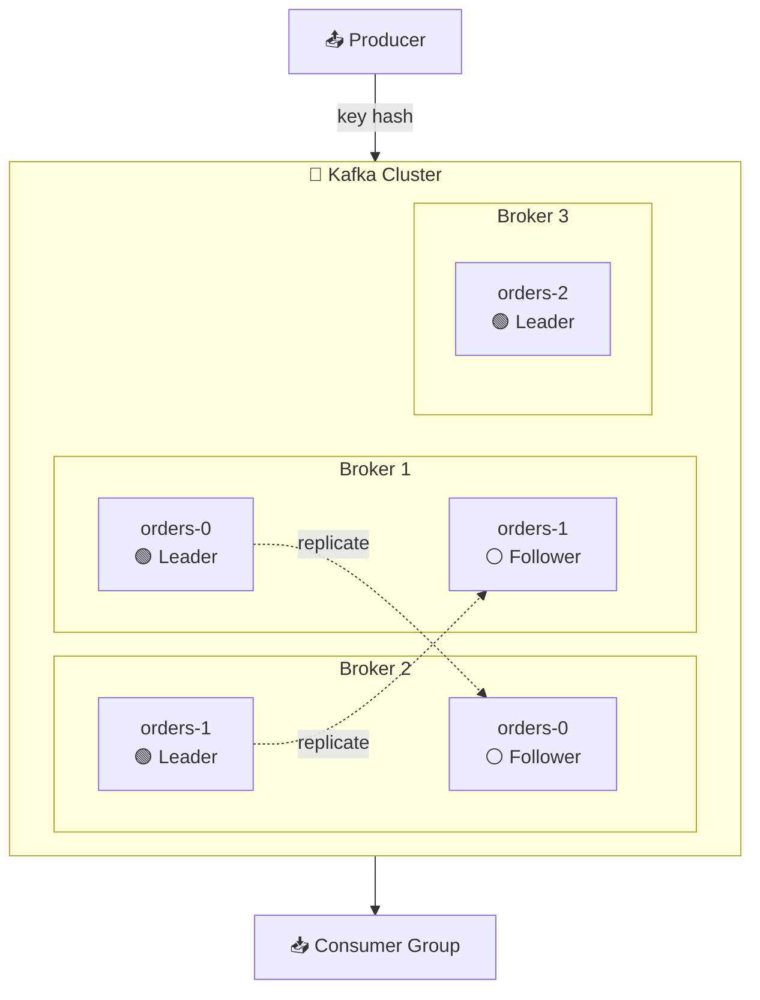
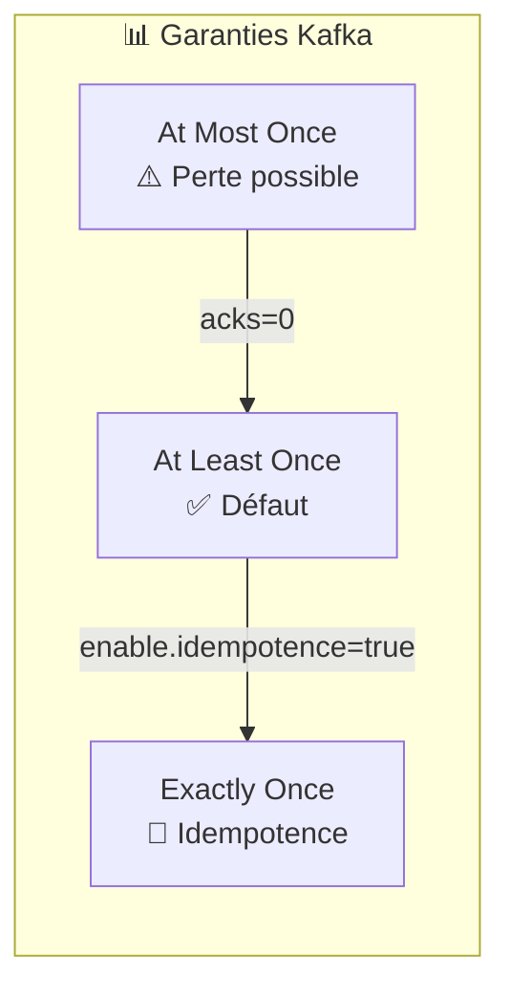
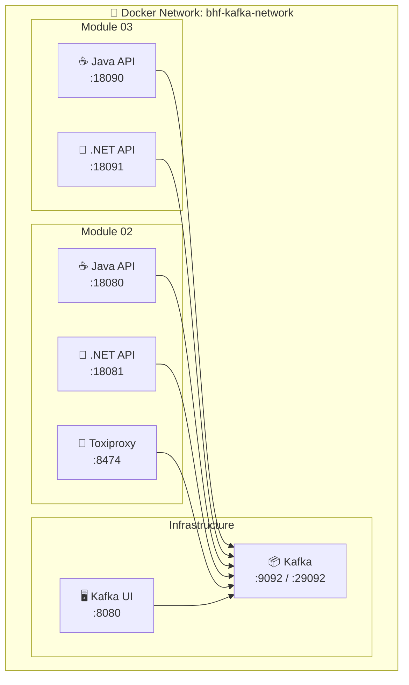

# 📅 Day 01 - Fondamentaux Kafka

> **Durée estimée** : 4-5 heures | **Niveau** : Débutant → Intermédiaire

---

## 🎯 Objectifs pédagogiques

À la fin de cette journée, vous serez capable de :

| # | Objectif | Module |
|---|----------|--------|
| 1 | Comprendre l'**architecture interne** de Kafka (brokers, topics, partitions) | M01 |
| 2 | Expliquer le mode **KRaft** et ses avantages vs ZooKeeper | M01 |
| 3 | Configurer un **producer idempotent** avec gestion des retries | M02 |
| 4 | Implémenter l'envoi **synchrone vs asynchrone** avec callbacks | M02 |
| 5 | Comprendre les **transactions Kafka** et l'isolation `read_committed` | M03 |
| 6 | Développer un **consumer transactionnel** qui ignore les messages abortés | M03 |

---

## 📚 Concepts fondamentaux

### Architecture Kafka



### Concepts clés

| Concept | Description | Importance |
|---------|-------------|------------|
| **Topic** | Canal de messages nommé | Organisation des données |
| **Partition** | Subdivision pour parallélisme | Scalabilité |
| **Offset** | Position d'un message dans une partition | Reprise après erreur |
| **Consumer Group** | Ensemble de consumers partageant la charge | Load balancing |
| **Replication Factor** | Nombre de copies d'une partition | Haute disponibilité |

### Garanties de livraison



| Garantie | Configuration | Cas d'usage |
|----------|---------------|-------------|
| **At Most Once** | `acks=0` | Logs non critiques |
| **At Least Once** | `acks=1` ou `acks=all` | Défaut, peut dupliquer |
| **Exactly Once** | `enable.idempotence=true` | Transactions financières |

---

## 💡 Tips & Best Practices

### Producer

> **🔒 Toujours activer l'idempotence en production**
> ```java
> props.put("enable.idempotence", "true");
> props.put("acks", "all");
> props.put("retries", Integer.MAX_VALUE);
> ```

> **⚡ Optimiser le throughput avec le batching**
> ```java
> props.put("linger.ms", "5");      // Attendre 5ms pour grouper
> props.put("batch.size", "16384"); // 16KB par batch
> ```

### Consumer

> **📖 Préférer `read_committed` pour les données transactionnelles**
> ```java
> props.put("isolation.level", "read_committed");
> ```

> **🔄 Gérer le rebalancing avec CooperativeSticky**
> ```java
> props.put("partition.assignment.strategy", 
>           "org.apache.kafka.clients.consumer.CooperativeStickyAssignor");
> ```

---

## 🏗️ Architecture du Lab



---

## 📦 Modules

| Module | Titre | Durée | Description |
|--------|-------|-------|-------------|
| [**M01**](./module-01-cluster/README.md) | Architecture Kafka & KRaft | 30-45 min | Théorie + Lab CLI |
| [**M02**](./module-02-producer-reliability/README.md) | Producer Reliability | 60-90 min | Idempotence, Java/.NET |
| [**M03**](./module-03-consumer-read-committed/README.md) | Consumer Read Committed | 60-90 min | Transactions, Java/.NET |

---

## 🚀 Quick Start

### Prérequis

- Docker Desktop 4.x+
- Docker Compose plugin (`docker compose`)

### Démarrer l'infrastructure

```powershell
# Depuis formation-v2/
cd infra

# Démarrer Kafka + UI
docker-compose -f docker-compose.single-node.yml up -d

# Vérifier
docker-compose -f docker-compose.single-node.yml ps
```

### URLs

| Service | URL | Description |
|---------|-----|-------------|
| Kafka UI | http://localhost:8080 | Interface web |
| Kafka | localhost:9092 | Bootstrap servers |

### Arrêter

```powershell
docker-compose -f docker-compose.single-node.yml down
```

---

## ⚠️ Erreurs courantes

| Erreur | Cause | Solution |
|--------|-------|----------|
| `Connection refused :9092` | Kafka pas démarré | Attendre 30s, vérifier `docker ps` |
| `Topic not found` | Topic inexistant | Créer avec `kafka-topics.sh --create` |
| `Offset out of range` | Consumer reset | Utiliser `--from-beginning` |
| `Rebalancing in progress` | Consumer group instable | Attendre fin du rebalance |

---

## ➡️ Suite

Après Day 01, passez à :

👉 **[Day 02 - Développement avancé](../day-02-development/README.md)**
