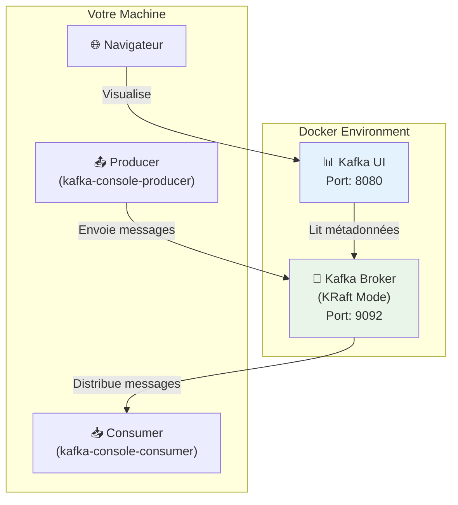

# Module 01 - Architecture du Cluster Kafka (KRaft) - Formation Auto-rythmée

## Durée estimée

⏱️ **30-45 minutes**

## Objectifs pédagogiques

À la fin de ce module, vous serez capable de :

1. ✅ Comprendre l'architecture d'un cluster Kafka avec KRaft (sans ZooKeeper)
2. ✅ Démarrer et arrêter un cluster Kafka local via Docker Compose
3. ✅ Vérifier l'état de santé du cluster
4. ✅ Créer un topic avec plusieurs partitions
5. ✅ Produire et consommer des messages via la ligne de commande
6. ✅ Naviguer dans Kafka UI pour visualiser les messages

## Concepts clés

### Qu'est-ce que Kafka ?

**Apache Kafka** est une plateforme de streaming distribuée qui permet de :

- **Publier et souscrire** à des flux de données (messages)
- **Stocker** les messages de manière durable et résiliente
- **Traiter** les flux de données en temps réel

### Architecture KRaft

Depuis Kafka 3.3+, le mode **KRaft** (Kafka Raft) remplace ZooKeeper pour la gestion des métadonnées :

| Composant | Rôle |
|-----------|------|
| **Broker** | Stocke les messages, gère les partitions |
| **Controller** | Gère les métadonnées du cluster (leader election, etc.) |
| **Topic** | Catégorie/flux de messages |
| **Partition** | Sous-division d'un topic pour le parallélisme |
| **Offset** | Position d'un message dans une partition |

### Diagramme d'architecture



## Ports et URLs

| Service | Port | URL |
|---------|------|-----|
| Kafka (externe) | 9092 | `localhost:9092` |
| Kafka (interne Docker) | 29092 | `kafka:29092` |
| Kafka UI | 8080 | http://localhost:8080 |

## Pré-requis

### Logiciels nécessaires

- ✅ **Docker Desktop** ou **Docker Engine** (version 20.10+)
- ✅ **Docker Compose** plugin (`docker compose` - pas `docker-compose`)
- ✅ **Terminal** (Bash, PowerShell, ou autre)
- ✅ **Navigateur web** (Chrome, Firefox, Edge)

### Vérification des pré-requis

```bash
# Vérifier Docker
docker --version
# Attendu: Docker version 20.10+ ou supérieur

# Vérifier Docker Compose
docker compose version
# Attendu: Docker Compose version v2.x.x
```

---

## 📚 Guide pas à pas

### Étape 0 - Positionnement dans le répertoire

**Objectif** : Se placer dans le bon répertoire de travail.

```bash
cd formation-v2/
```

**Vérification** :

```bash
ls -la scripts/
```

**Résultat attendu** : Vous devez voir les fichiers `up.sh`, `down.sh`, `start.sh`, `stop.sh`.

---

### Étape 1 - Démarrage du cluster Kafka

**Objectif** : Lancer le cluster Kafka en mode KRaft avec Kafka UI.

**Explication** : Le script `up.sh` va :
1. Télécharger l'image `apache/kafka:latest` (si nécessaire)
2. Créer le réseau Docker `bhf-kafka-network`
3. Démarrer le conteneur Kafka en mode KRaft
4. Démarrer Kafka UI pour la visualisation

**Commande** :

```bash
./scripts/up.sh
```

**Résultat attendu** :

```
Starting Kafka KRaft SINGLE NODE...
Checking for existing containers...
[+] Running 3/3
 ✔ Network bhf-kafka-network  Created
 ✔ Container kafka            Started
 ✔ Container kafka-ui         Started
✅ Kafka KRaft single-node is ready!
Kafka UI: http://localhost:8080
```

**⏱️ Temps d'attente** : 30-60 secondes pour le premier démarrage.

**💡 Astuce** : Si vous voyez des erreurs, attendez 30 secondes et passez à l'étape suivante pour vérifier l'état.

---

### Étape 2 - Vérification de l'état du cluster

**Objectif** : S'assurer que tous les conteneurs sont en fonctionnement.

**Commande** :

```bash
docker ps --format 'table {{.Names}}\t{{.Status}}\t{{.Ports}}'
```

**Résultat attendu** :

```
NAMES       STATUS                   PORTS
kafka-ui    Up X minutes (healthy)   0.0.0.0:8080->8080/tcp
kafka       Up X minutes (healthy)   0.0.0.0:9092->9092/tcp, 0.0.0.0:29092->29092/tcp
```

**✅ Checkpoint 1** : Les deux conteneurs affichent `(healthy)`.

**⚠️ Si "unhealthy" ou "starting"** : Attendez 30 secondes supplémentaires et relancez la commande.

---

### Étape 3 - Accès à Kafka UI

**Objectif** : Vérifier que l'interface web est accessible.

**Action** : Ouvrez votre navigateur et accédez à :

👉 **http://localhost:8080**

**Ce que vous devez voir** :

1. Page d'accueil de Kafka UI
2. Cluster nommé `BHF-Training` dans la liste
3. Statut du cluster : **Online**

**Navigation dans Kafka UI** :

| Menu | Description |
|------|-------------|
| **Dashboard** | Vue d'ensemble du cluster |
| **Brokers** | Liste des brokers (1 dans notre cas) |
| **Topics** | Liste des topics existants |
| **Consumers** | Groupes de consommateurs |

**✅ Checkpoint 2** : Kafka UI est accessible et affiche le cluster.

---

### Étape 4 - Lister les topics existants

**Objectif** : Utiliser la CLI Kafka pour lister les topics.

**Explication** : Nous exécutons la commande `kafka-topics.sh` à l'intérieur du conteneur Kafka.

**Commande** :

```bash
docker exec kafka /opt/kafka/bin/kafka-topics.sh \
  --bootstrap-server localhost:9092 \
  --list
```

**Résultat attendu** : Liste vide ou quelques topics internes (commençant par `__`).

**Explication des paramètres** :

| Paramètre | Description |
|-----------|-------------|
| `docker exec kafka` | Exécute une commande dans le conteneur `kafka` |
| `/opt/kafka/bin/kafka-topics.sh` | Script de gestion des topics |
| `--bootstrap-server localhost:9092` | Adresse du broker Kafka |
| `--list` | Action : lister les topics |

---

### Étape 5 - Création d'un topic avec 3 partitions

**Objectif** : Créer un topic nommé `bhf-demo` avec 3 partitions.

**Théorie** : Les partitions permettent :
- **Parallélisme** : Plusieurs consommateurs peuvent lire en parallèle
- **Scalabilité** : Les données sont distribuées sur plusieurs partitions
- **Ordre** : L'ordre est garanti uniquement au sein d'une partition

**Commande** :

```bash
docker exec kafka /opt/kafka/bin/kafka-topics.sh \
  --bootstrap-server localhost:9092 \
  --create \
  --if-not-exists \
  --topic bhf-demo \
  --partitions 3 \
  --replication-factor 1
```

**Résultat attendu** :

```
Created topic bhf-demo.
```

**Explication des paramètres** :

| Paramètre | Description |
|-----------|-------------|
| `--create` | Action : créer un topic |
| `--if-not-exists` | Ne pas échouer si le topic existe déjà |
| `--topic bhf-demo` | Nom du topic |
| `--partitions 3` | Nombre de partitions |
| `--replication-factor 1` | Facteur de réplication (1 car cluster single-node) |

---

### Étape 6 - Description du topic

**Objectif** : Vérifier la configuration du topic créé.

**Commande** :

```bash
docker exec kafka /opt/kafka/bin/kafka-topics.sh \
  --bootstrap-server localhost:9092 \
  --describe \
  --topic bhf-demo
```

**Résultat attendu** :

```
Topic: bhf-demo	TopicId: xxxxx	PartitionCount: 3	ReplicationFactor: 1	Configs: 
	Topic: bhf-demo	Partition: 0	Leader: 1	Replicas: 1	Isr: 1
	Topic: bhf-demo	Partition: 1	Leader: 1	Replicas: 1	Isr: 1
	Topic: bhf-demo	Partition: 2	Leader: 1	Replicas: 1	Isr: 1
```

**Explication de la sortie** :

| Champ | Description |
|-------|-------------|
| `PartitionCount: 3` | Le topic a bien 3 partitions |
| `Leader: 1` | Le broker 1 est leader de chaque partition |
| `Replicas: 1` | Une seule réplique (cluster single-node) |
| `Isr: 1` | In-Sync Replicas : répliques synchronisées |

**✅ Checkpoint 3** : Le topic `bhf-demo` existe avec 3 partitions.

---

### Étape 7 - Production d'un message

**Objectif** : Envoyer un message dans le topic `bhf-demo`.

**Théorie** : Le **Producer** est responsable de :
- Sérialiser les messages
- Déterminer la partition de destination
- Envoyer les messages au broker

**Commande** :

```bash
# Générer un message unique avec timestamp
MSG="hello-bhf-$(date +%s)"
echo "Message à envoyer: $MSG"

# Envoyer le message
echo "$MSG" | docker exec -i kafka /opt/kafka/bin/kafka-console-producer.sh \
  --bootstrap-server localhost:9092 \
  --topic bhf-demo
```

**Résultat attendu** : Pas de message d'erreur (la commande se termine silencieusement).

**💡 Note** : Le flag `-i` permet de passer l'entrée standard au conteneur.

---

### Étape 8 - Consommation du message

**Objectif** : Lire le message envoyé depuis le topic.

**Théorie** : Le **Consumer** est responsable de :
- Souscrire à un ou plusieurs topics
- Lire les messages depuis les partitions
- Gérer les offsets (position de lecture)

**Commande** :

```bash
docker exec kafka /opt/kafka/bin/kafka-console-consumer.sh \
  --bootstrap-server localhost:9092 \
  --topic bhf-demo \
  --from-beginning \
  --timeout-ms 10000
```

**Résultat attendu** :

```
hello-bhf-1706390000
```

**Explication des paramètres** :

| Paramètre | Description |
|-----------|-------------|
| `--from-beginning` | Lire depuis le début du topic |
| `--timeout-ms 10000` | Timeout de 10 secondes si pas de nouveaux messages |

**✅ Checkpoint 4** : Le message produit a été consommé avec succès.

---

### Étape 9 - Visualisation dans Kafka UI

**Objectif** : Observer les messages via l'interface graphique.

**Actions** :

1. Ouvrez **http://localhost:8080** dans votre navigateur
2. Cliquez sur le cluster **BHF-Training**
3. Dans le menu, cliquez sur **Topics**
4. Cliquez sur le topic **bhf-demo**
5. Cliquez sur l'onglet **Messages**
6. Cliquez sur le bouton **▶ Fetch Messages** ou réglez sur **Live mode**

**Ce que vous devez voir** :

- Le message `hello-bhf-XXXX` apparaît dans la liste
- La partition d'affectation (0, 1 ou 2)
- L'offset du message
- Le timestamp

**💡 Exploration supplémentaire** :

- Onglet **Overview** : statistiques du topic
- Onglet **Partitions** : répartition des partitions
- Onglet **Settings** : configuration du topic

**✅ Checkpoint 5** : Le message est visible dans Kafka UI.

---

### Étape 10 - Validation automatisée

**Objectif** : Exécuter le script de validation pour confirmer que tout fonctionne.

**Commande** :

```bash
./day-01-foundations/module-01-cluster/scripts/validate.sh
```

**Résultat attendu** :

```
OK
```

**Ce que le script vérifie** :
1. ✅ Le conteneur `kafka` est en cours d'exécution
2. ✅ Le conteneur `kafka-ui` est en cours d'exécution
3. ✅ Kafka UI répond sur le port 8080
4. ✅ Le topic `bhf-demo` existe avec 3 partitions
5. ✅ Un message peut être produit et consommé

---

## ✅ Récapitulatif des checkpoints

| # | Checkpoint | Statut |
|---|------------|--------|
| 1 | Conteneurs `kafka` et `kafka-ui` sont healthy | ☐ |
| 2 | Kafka UI accessible sur http://localhost:8080 | ☐ |
| 3 | Topic `bhf-demo` créé avec 3 partitions | ☐ |
| 4 | Message produit et consommé via CLI | ☐ |
| 5 | Message visible dans Kafka UI | ☐ |
| 6 | Script `validate.sh` retourne OK | ☐ |

---

## 🔧 Troubleshooting

### Problème : Kafka ne démarre pas

**Symptôme** : Le conteneur `kafka` reste en `starting` ou `unhealthy`.

**Solutions** :

1. **Vérifiez les logs** :
   ```bash
   docker logs kafka --tail 50
   ```

2. **Redémarrez le cluster** :
   ```bash
   ./scripts/down.sh
   ./scripts/up.sh
   ```

3. **Nettoyez les volumes** (perte de données) :
   ```bash
   docker volume rm bhf-kafka_kafka-data
   ```

### Problème : Kafka UI non accessible

**Symptôme** : http://localhost:8080 ne répond pas.

**Solutions** :

1. **Vérifiez que kafka-ui est running** :
   ```bash
   docker ps | grep kafka-ui
   ```

2. **Vérifiez les logs** :
   ```bash
   docker logs kafka-ui --tail 50
   ```

3. **Vérifiez qu'un autre service n'utilise pas le port 8080** :
   ```bash
   # Linux/Mac
   lsof -i :8080
   # Windows
   netstat -ano | findstr :8080
   ```

### Problème : Commande kafka-topics.sh non trouvée

**Symptôme** : `kafka-topics: command not found`

**Solution** : Utilisez le chemin complet `/opt/kafka/bin/kafka-topics.sh`.

---

## 🧹 Nettoyage

**Objectif** : Arrêter et supprimer les conteneurs.

**Commande** :

```bash
./scripts/down.sh
```

**Résultat attendu** :

```
Stopping Kafka KRaft SINGLE NODE...
[+] Running 3/3
 ✔ Container kafka-ui         Removed
 ✔ Container kafka            Removed
 ✔ Volume bhf-kafka_kafka-data Removed
✅ Kafka KRaft single-node stopped and cleaned up!
```

---

## 📖 Pour aller plus loin

### Exercices supplémentaires

1. **Créez un topic avec 5 partitions** et observez la distribution dans Kafka UI
2. **Produisez 10 messages** et observez comment ils sont répartis sur les partitions
3. **Utilisez une clé** lors de la production pour garantir l'ordre :
   ```bash
   echo "key1:message1" | docker exec -i kafka /opt/kafka/bin/kafka-console-producer.sh \
     --bootstrap-server localhost:9092 \
     --topic bhf-demo \
     --property "parse.key=true" \
     --property "key.separator=:"
   ```

### Ressources

- [Documentation officielle Apache Kafka](https://kafka.apache.org/documentation/)
- [KRaft Mode Documentation](https://kafka.apache.org/documentation/#kraft)
- [Kafka UI GitHub](https://github.com/provectus/kafka-ui)

---

## ➡️ Module suivant

Une fois ce module terminé, passez au :

👉 **[Module 02 - Fiabilité du Producteur](../module-02-producer-reliability/README.md)**
