# Module 01 - Architecture du Cluster Kafka (KRaft) - Formation Auto-rythmée

## Durée estimée

⏱️ **30-45 minutes**

## Objectifs pédagogiques

À la fin de ce module, vous serez capable de :

1. ✅ Comprendre l'architecture d'un cluster Kafka avec KRaft (sans ZooKeeper)
2. ✅ Démarrer et arrêter un cluster Kafka local via Docker Compose
3. ✅ Vérifier l'état de santé du cluster
4. ✅ Créer un topic avec plusieurs partitions
5. ✅ Produire et consommer des messages via la ligne de commande
6. ✅ Naviguer dans Kafka UI pour visualiser les messages

---

## 📖 Partie Théorique

### 1. Qu'est-ce que Apache Kafka ?

**Apache Kafka** est une plateforme de streaming distribuée open-source, initialement développée par LinkedIn et maintenant maintenue par la Apache Software Foundation.

#### Cas d'usage principaux

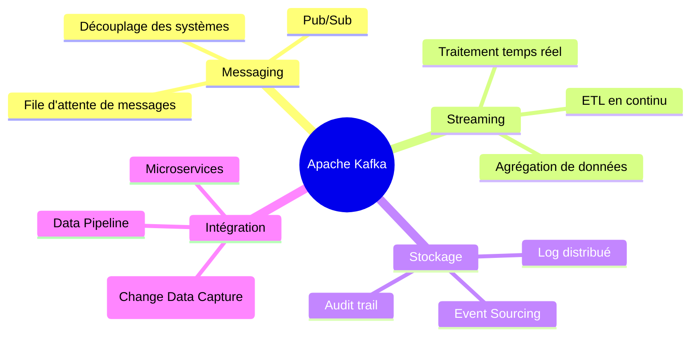

#### Caractéristiques clés

| Caractéristique | Description |
|-----------------|-------------|
| **Haute performance** | Millions de messages/seconde avec latence < 10ms |
| **Scalabilité horizontale** | Ajout de brokers sans interruption |
| **Durabilité** | Messages persistés sur disque, répliqués |
| **Tolérance aux pannes** | Réplication automatique, failover |
| **Ordre garanti** | Au sein d'une partition |

---

### 2. Architecture de Kafka

#### Vue d'ensemble

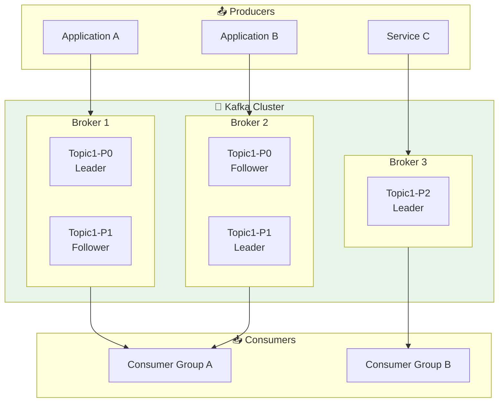

#### Composants fondamentaux

| Composant | Icône | Description |
|-----------|-------|-------------|
| **Broker** | 🖥️ | Serveur Kafka qui stocke les messages et sert les clients |
| **Topic** | 📁 | Catégorie logique pour organiser les messages |
| **Partition** | 📊 | Subdivision d'un topic pour la parallélisation |
| **Producer** | 📤 | Application qui envoie des messages |
| **Consumer** | 📥 | Application qui lit des messages |
| **Consumer Group** | 👥 | Ensemble de consumers qui se partagent la lecture |

---

### 3. Topics et Partitions

#### Concept de Topic

Un **Topic** est un flux de messages nommé. C'est la catégorie dans laquelle les messages sont publiés.

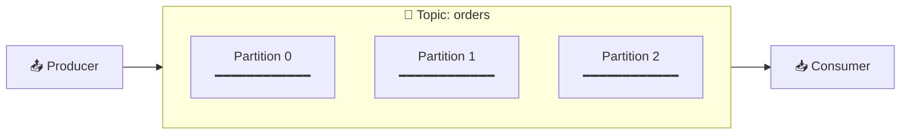

#### Anatomie d'une Partition

Une **Partition** est un log ordonné et immuable de messages :

```
Partition 0:
┌─────┬─────┬─────┬─────┬─────┬─────┬─────┬─────┐
│  0  │  1  │  2  │  3  │  4  │  5  │  6  │  7  │  ← Offsets
├─────┼─────┼─────┼─────┼─────┼─────┼─────┼─────┤
│ Msg │ Msg │ Msg │ Msg │ Msg │ Msg │ Msg │ Msg │  ← Messages
└─────┴─────┴─────┴─────┴─────┴─────┴─────┴─────┘
                                              ↑
                                         Nouveaux messages
                                         (append-only)
```

#### Pourquoi plusieurs partitions ?

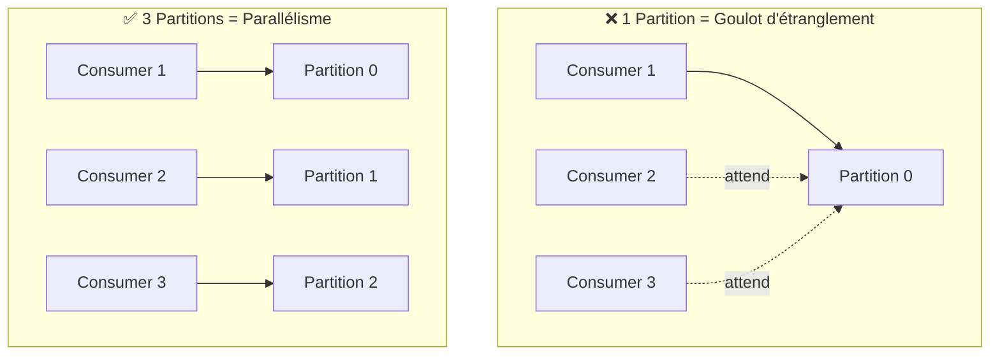

| Nombre de partitions | Avantages | Inconvénients |
|----------------------|-----------|---------------|
| **1** | Ordre global garanti | Pas de parallélisme |
| **3-10** | Bon équilibre | Standard pour la plupart des cas |
| **100+** | Très haut débit | Plus de ressources, latence accrue |

---

### 4. Offsets et Consommation

#### Qu'est-ce qu'un Offset ?

L'**Offset** est la position unique d'un message dans une partition. C'est un entier croissant.

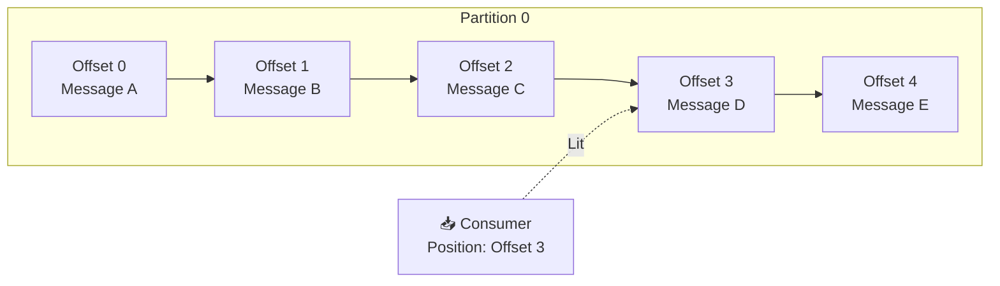

#### Gestion des Offsets

| Mode | Description | Cas d'usage |
|------|-------------|-------------|
| **Earliest** | Lire depuis le début | Retraitement complet |
| **Latest** | Lire les nouveaux messages uniquement | Temps réel |
| **Specific** | Lire depuis un offset précis | Reprise après erreur |

---

### 5. Mode KRaft vs ZooKeeper

#### Évolution de l'architecture

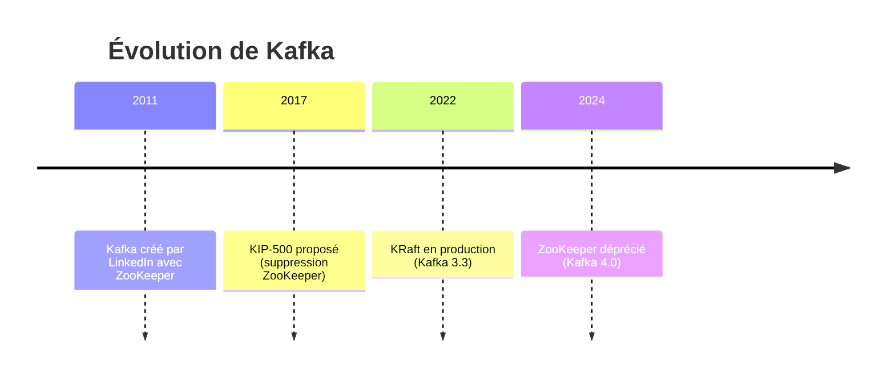

#### Comparaison

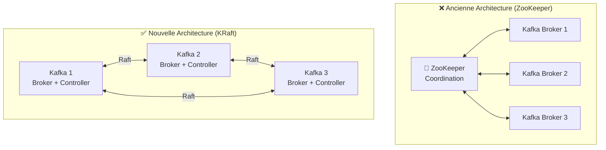

| Aspect | ZooKeeper | KRaft |
|--------|-----------|-------|
| **Composants** | Kafka + ZooKeeper | Kafka seul |
| **Complexité** | Élevée | Réduite |
| **Performances** | Bonnes | Meilleures |
| **Scalabilité** | Limitée par ZK | Améliorée |
| **Démarrage** | Lent | Rapide |

---

### 6. Producer et Consumer

#### Le Producer

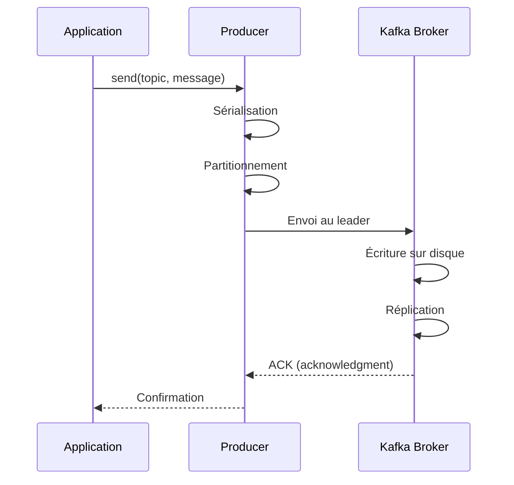

#### Le Consumer

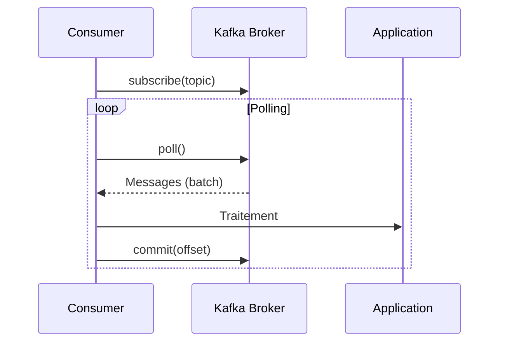

---

### 7. Diagramme d'architecture du Lab

#### Option A : Docker (Développement local)

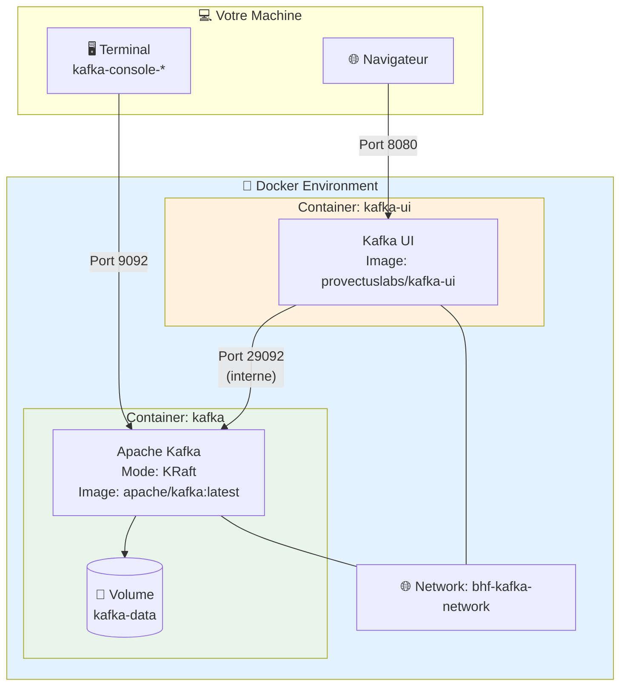

#### Option B : OKD/K3s (Production-like)

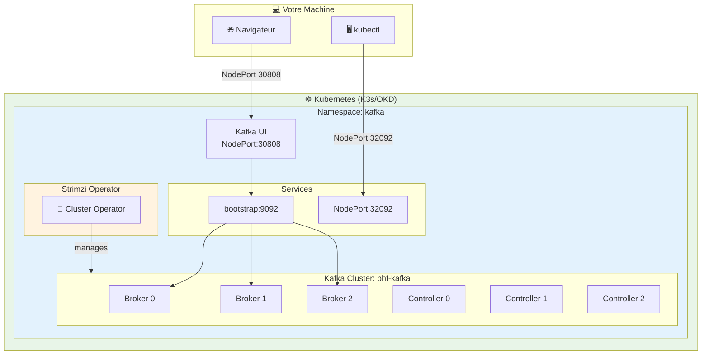

## Ports et URLs

### 🐳 Mode Docker

| Service | Port | URL |
|---------|------|-----|
| Kafka (externe) | 9092 | `localhost:9092` |
| Kafka (interne Docker) | 29092 | `kafka:29092` |
| Kafka UI | 8080 | http://localhost:8080 |

### ☸️ Mode OKD/K3s

| Service | Port | URL |
|---------|------|-----|
| Kafka Bootstrap (interne) | 9092 | `bhf-kafka-kafka-bootstrap.kafka.svc:9092` |
| Kafka Bootstrap (externe) | 32092 | `<NODE_IP>:32092` |
| Kafka UI | 30808 | http://<NODE_IP>:30808 |

## Pré-requis

### 🐳 Mode Docker (Développement local)

- ✅ **Docker Desktop** ou **Docker Engine** (version 20.10+)
- ✅ **Docker Compose** plugin (`docker compose` - pas `docker-compose`)
- ✅ **Terminal** (Bash, PowerShell, ou autre)
- ✅ **Navigateur web** (Chrome, Firefox, Edge)

```bash
# Vérifier Docker
docker --version
# Attendu: Docker version 20.10+ ou supérieur

# Vérifier Docker Compose
docker compose version
# Attendu: Docker Compose version v2.x.x
```

### ☸️ Mode OKD/K3s (Production-like)

- ✅ **K3s** ou **OKD/OpenShift** installé
- ✅ **kubectl** configuré
- ✅ **Strimzi Operator** déployé
- ✅ **Kafka cluster** déployé via Strimzi
- ✅ **Terminal** (Bash, PowerShell, ou autre)
- ✅ **Navigateur web** (Chrome, Firefox, Edge)

```bash
# Vérifier kubectl
kubectl version --client
# Attendu: Client Version: v1.28+ ou supérieur

# Vérifier le cluster
kubectl get nodes
# Attendu: Au moins 1 node en status Ready

# Vérifier Kafka
kubectl get kafka -n kafka
# Attendu: bhf-kafka avec status Ready
```

> 📖 **Installation K3s + Kafka** : Voir [Guide d'installation OKD/K3s](../../00-overview/INSTALL-OKD-UBUNTU.md) et les scripts dans `infra/Scripts/`

---

## 📚 Guide pas à pas

### Étape 0 - Positionnement dans le répertoire

**Objectif** : Se placer dans le bon répertoire de travail.

```bash
cd formation-v2/
```

**Vérification** :

```bash
ls -la scripts/
```

**Résultat attendu** : Vous devez voir les fichiers `up.sh`, `down.sh`, `start.sh`, `stop.sh`.

---

### Étape 1 - Démarrage du cluster Kafka

**Objectif** : Lancer le cluster Kafka en mode KRaft avec Kafka UI.

<details>
<summary>🐳 <b>Mode Docker</b></summary>

**Explication** : Le script `up.sh` va :
1. Télécharger l'image `apache/kafka:latest` (si nécessaire)
2. Créer le réseau Docker `bhf-kafka-network`
3. Démarrer le conteneur Kafka en mode KRaft
4. Démarrer Kafka UI pour la visualisation

**Commande** :

```bash
./scripts/up.sh
```

**Résultat attendu** :

```
Starting Kafka KRaft SINGLE NODE...
Checking for existing containers...
[+] Running 3/3
 ✔ Network bhf-kafka-network  Created
 ✔ Container kafka            Started
 ✔ Container kafka-ui         Started
✅ Kafka KRaft single-node is ready!
Kafka UI: http://localhost:8080
```

**⏱️ Temps d'attente** : 30-60 secondes pour le premier démarrage.

</details>

<details>
<summary>☸️ <b>Mode OKD/K3s</b></summary>

**Explication** : Le cluster Kafka est déjà déployé via Strimzi. Vérifiez son état :

**Commande** :

```bash
# Vérifier que le cluster Kafka est prêt
kubectl get kafka -n kafka

# Vérifier les pods Kafka
kubectl get pods -n kafka
```

**Résultat attendu** :

```
NAME        CLUSTER     READY   WARNINGS
bhf-kafka   bhf-kafka   True    

NAME                                         READY   STATUS
bhf-kafka-broker-0                           1/1     Running
bhf-kafka-broker-1                           1/1     Running
bhf-kafka-broker-2                           1/1     Running
bhf-kafka-controller-3                       1/1     Running
bhf-kafka-controller-4                       1/1     Running
bhf-kafka-controller-5                       1/1     Running
bhf-kafka-entity-operator-xxxx               2/2     Running
kafka-ui-xxxx                                1/1     Running
strimzi-cluster-operator-xxxx                1/1     Running
```

> 📝 **Note** : Si le cluster n'est pas déployé, exécutez `sudo ./infra/Scripts/03-install-kafka.sh`

</details>

**💡 Astuce** : Si vous voyez des erreurs, attendez 30 secondes et passez à l'étape suivante pour vérifier l'état.

---

### Étape 2 - Vérification de l'état du cluster

**Objectif** : S'assurer que tous les composants sont en fonctionnement.

<details>
<summary>🐳 <b>Mode Docker</b></summary>

**Commande** :

```bash
docker ps --format 'table {{.Names}}\t{{.Status}}\t{{.Ports}}'
```

**Résultat attendu** :

```
NAMES       STATUS                   PORTS
kafka-ui    Up X minutes (healthy)   0.0.0.0:8080->8080/tcp
kafka       Up X minutes (healthy)   0.0.0.0:9092->9092/tcp, 0.0.0.0:29092->29092/tcp
```

**✅ Checkpoint 1** : Les deux conteneurs affichent `(healthy)`.

**⚠️ Si "unhealthy" ou "starting"** : Attendez 30 secondes supplémentaires et relancez la commande.

</details>

<details>
<summary>☸️ <b>Mode OKD/K3s</b></summary>

**Commande** :

```bash
# Vérifier l'état du cluster Kafka
kubectl get kafka bhf-kafka -n kafka

# Vérifier les pods
kubectl get pods -n kafka -l strimzi.io/cluster=bhf-kafka

# Vérifier les services
kubectl get svc -n kafka
```

**Résultat attendu** :

```
NAME        CLUSTER     READY   WARNINGS
bhf-kafka   bhf-kafka   True    

NAME                        TYPE        CLUSTER-IP      PORT(S)
bhf-kafka-kafka-bootstrap   ClusterIP   10.43.x.x       9091/TCP,9092/TCP,9093/TCP
bhf-kafka-kafka-brokers     ClusterIP   None            9090/TCP,9091/TCP,9092/TCP
bhf-kafka-kafka-external    NodePort    10.43.x.x       9094:32092/TCP
```

**✅ Checkpoint 1** : Le cluster affiche `READY: True` et les pods sont `Running`.

</details>

---

### Étape 3 - Accès à Kafka UI

**Objectif** : Vérifier que l'interface web est accessible.

<details>
<summary>🐳 <b>Mode Docker</b></summary>

**Action** : Ouvrez votre navigateur et accédez à :

👉 **http://localhost:8080**

**Ce que vous devez voir** :

1. Page d'accueil de Kafka UI
2. Cluster nommé `BHF-Training` dans la liste
3. Statut du cluster : **Online**

</details>

<details>
<summary>☸️ <b>Mode OKD/K3s</b></summary>

**Action** : Récupérez l'IP du node et accédez à Kafka UI :

```bash
# Récupérer l'IP du node
NODE_IP=$(kubectl get nodes -o jsonpath='{.items[0].status.addresses[?(@.type=="InternalIP")].address}')
echo "Kafka UI: http://$NODE_IP:30808"
```

👉 **http://<NODE_IP>:30808**

**Ce que vous devez voir** :

1. Page d'accueil de Kafka UI
2. Cluster nommé `bhf-kafka` dans la liste
3. Statut du cluster : **Online**

</details>

**Navigation dans Kafka UI** :

| Menu | Description |
|------|-------------|
| **Dashboard** | Vue d'ensemble du cluster |
| **Brokers** | Liste des brokers (1 dans notre cas) |
| **Topics** | Liste des topics existants |
| **Consumers** | Groupes de consommateurs |

**✅ Checkpoint 2** : Kafka UI est accessible et affiche le cluster.

---

### Étape 4 - Lister les topics existants

**Objectif** : Utiliser la CLI Kafka pour lister les topics.

<details>
<summary>🐳 <b>Mode Docker</b></summary>

**Explication** : Nous exécutons la commande `kafka-topics.sh` à l'intérieur du conteneur Kafka.

**Commande** :

```bash
docker exec kafka /opt/kafka/bin/kafka-topics.sh \
  --bootstrap-server localhost:9092 \
  --list
```

**Résultat attendu** : Liste vide ou quelques topics internes (commençant par `__`).

**Explication des paramètres** :

| Paramètre | Description |
|-----------|-------------|
| `docker exec kafka` | Exécute une commande dans le conteneur `kafka` |
| `/opt/kafka/bin/kafka-topics.sh` | Script de gestion des topics |
| `--bootstrap-server localhost:9092` | Adresse du broker Kafka |
| `--list` | Action : lister les topics |

</details>

<details>
<summary>☸️ <b>Mode OKD/K3s</b></summary>

**Explication** : Nous utilisons un pod éphémère avec l'image Strimzi pour exécuter les commandes Kafka.

**Commande** :

```bash
kubectl run kafka-cli -it --rm --image=quay.io/strimzi/kafka:latest-kafka-4.0.0 \
  --restart=Never -n kafka -- \
  bin/kafka-topics.sh --bootstrap-server bhf-kafka-kafka-bootstrap:9092 --list
```

**Résultat attendu** : Liste des topics pré-créés par Strimzi :

```
bhf-events
bhf-transactions
orders
orders-dlt
orders-retry
```

**Explication des paramètres** :

| Paramètre | Description |
|-----------|-------------|
| `kubectl run kafka-cli` | Crée un pod éphémère nommé `kafka-cli` |
| `-it --rm` | Interactif et supprimé après exécution |
| `--image=quay.io/strimzi/kafka:latest-kafka-4.0.0` | Image Kafka Strimzi |
| `bhf-kafka-kafka-bootstrap:9092` | Service bootstrap interne |
| `--list` | Action : lister les topics |

</details>

---

### Étape 5 - Création d'un topic avec 3 partitions

**Objectif** : Créer un topic nommé `bhf-demo` avec 3 partitions.

**Théorie** : Les partitions permettent :
- **Parallélisme** : Plusieurs consommateurs peuvent lire en parallèle
- **Scalabilité** : Les données sont distribuées sur plusieurs partitions
- **Ordre** : L'ordre est garanti uniquement au sein d'une partition

<details>
<summary>🐳 <b>Mode Docker</b></summary>

**Commande** :

```bash
docker exec kafka /opt/kafka/bin/kafka-topics.sh \
  --bootstrap-server localhost:9092 \
  --create \
  --if-not-exists \
  --topic bhf-demo \
  --partitions 3 \
  --replication-factor 1
```

**Résultat attendu** :

```
Created topic bhf-demo.
```

**Explication des paramètres** :

| Paramètre | Description |
|-----------|-------------|
| `--create` | Action : créer un topic |
| `--if-not-exists` | Ne pas échouer si le topic existe déjà |
| `--topic bhf-demo` | Nom du topic |
| `--partitions 3` | Nombre de partitions |
| `--replication-factor 1` | Facteur de réplication (1 car cluster single-node) |

</details>

<details>
<summary>☸️ <b>Mode OKD/K3s</b></summary>

**Option 1 : Via KafkaTopic CR (recommandé)** :

```bash
cat <<EOF | kubectl apply -n kafka -f -
apiVersion: kafka.strimzi.io/v1
kind: KafkaTopic
metadata:
  name: bhf-demo
  labels:
    strimzi.io/cluster: bhf-kafka
spec:
  partitions: 3
  replicas: 3
  config:
    retention.ms: 604800000
EOF
```

**Option 2 : Via CLI** :

```bash
kubectl run kafka-cli -it --rm --image=quay.io/strimzi/kafka:latest-kafka-4.0.0 \
  --restart=Never -n kafka -- \
  bin/kafka-topics.sh --bootstrap-server bhf-kafka-kafka-bootstrap:9092 \
  --create --if-not-exists --topic bhf-demo --partitions 3 --replication-factor 3
```

**Résultat attendu** :

```
kafkatopic.kafka.strimzi.io/bhf-demo created
```

> 📝 **Note** : En mode K8s avec 3 brokers, utilisez `--replication-factor 3` pour la haute disponibilité.

</details>

---

### Étape 6 - Description du topic

**Objectif** : Vérifier la configuration du topic créé.

<details>
<summary>🐳 <b>Mode Docker</b></summary>

**Commande** :

```bash
docker exec kafka /opt/kafka/bin/kafka-topics.sh \
  --bootstrap-server localhost:9092 \
  --describe \
  --topic bhf-demo
```

**Résultat attendu** :

```
Topic: bhf-demo	TopicId: xxxxx	PartitionCount: 3	ReplicationFactor: 1	Configs: 
	Topic: bhf-demo	Partition: 0	Leader: 1	Replicas: 1	Isr: 1
	Topic: bhf-demo	Partition: 1	Leader: 1	Replicas: 1	Isr: 1
	Topic: bhf-demo	Partition: 2	Leader: 1	Replicas: 1	Isr: 1
```

</details>

<details>
<summary>☸️ <b>Mode OKD/K3s</b></summary>

**Option 1 : Via kubectl** :

```bash
kubectl get kafkatopic bhf-demo -n kafka -o yaml
```

**Option 2 : Via CLI Kafka** :

```bash
kubectl run kafka-cli -it --rm --image=quay.io/strimzi/kafka:latest-kafka-4.0.0 \
  --restart=Never -n kafka -- \
  bin/kafka-topics.sh --bootstrap-server bhf-kafka-kafka-bootstrap:9092 \
  --describe --topic bhf-demo
```

**Résultat attendu** :

```
Topic: bhf-demo	TopicId: xxxxx	PartitionCount: 3	ReplicationFactor: 3	Configs: 
	Topic: bhf-demo	Partition: 0	Leader: 0	Replicas: 0,1,2	Isr: 0,1,2
	Topic: bhf-demo	Partition: 1	Leader: 1	Replicas: 1,2,0	Isr: 1,2,0
	Topic: bhf-demo	Partition: 2	Leader: 2	Replicas: 2,0,1	Isr: 2,0,1
```

</details>

**Explication de la sortie** :

| Champ | Description |
|-------|-------------|
| `PartitionCount: 3` | Le topic a bien 3 partitions |
| `Leader: X` | Le broker X est leader de la partition |
| `Replicas` | Liste des brokers hébergeant une réplique |
| `Isr` | In-Sync Replicas : répliques synchronisées |

**✅ Checkpoint 3** : Le topic `bhf-demo` existe avec 3 partitions.

---

### Étape 7 - Production d'un message

**Objectif** : Envoyer un message dans le topic `bhf-demo`.

**Théorie** : Le **Producer** est responsable de :
- Sérialiser les messages
- Déterminer la partition de destination
- Envoyer les messages au broker

<details>
<summary>🐳 <b>Mode Docker</b></summary>

**Commande** :

```bash
# Générer un message unique avec timestamp
MSG="hello-bhf-$(date +%s)"
echo "Message à envoyer: $MSG"

# Envoyer le message
echo "$MSG" | docker exec -i kafka /opt/kafka/bin/kafka-console-producer.sh \
  --bootstrap-server localhost:9092 \
  --topic bhf-demo
```

**Résultat attendu** : Pas de message d'erreur (la commande se termine silencieusement).

**💡 Note** : Le flag `-i` permet de passer l'entrée standard au conteneur.

</details>

<details>
<summary>☸️ <b>Mode OKD/K3s</b></summary>

**Commande** :

```bash
# Générer un message unique avec timestamp
MSG="hello-bhf-$(date +%s)"
echo "Message à envoyer: $MSG"

# Envoyer le message via pod éphémère
echo "$MSG" | kubectl run kafka-producer -i --rm --image=quay.io/strimzi/kafka:latest-kafka-4.0.0 \
  --restart=Never -n kafka -- \
  bin/kafka-console-producer.sh --bootstrap-server bhf-kafka-kafka-bootstrap:9092 --topic bhf-demo
```

**Résultat attendu** : Le pod se termine avec succès après envoi du message.

</details>

---

### Étape 8 - Consommation du message

**Objectif** : Lire le message envoyé depuis le topic.

**Théorie** : Le **Consumer** est responsable de :
- Souscrire à un ou plusieurs topics
- Lire les messages depuis les partitions
- Gérer les offsets (position de lecture)

<details>
<summary>🐳 <b>Mode Docker</b></summary>

**Commande** :

```bash
docker exec kafka /opt/kafka/bin/kafka-console-consumer.sh \
  --bootstrap-server localhost:9092 \
  --topic bhf-demo \
  --from-beginning \
  --timeout-ms 10000
```

**Résultat attendu** :

```
hello-bhf-1706390000
```

</details>

<details>
<summary>☸️ <b>Mode OKD/K3s</b></summary>

**Commande** :

```bash
kubectl run kafka-consumer -it --rm --image=quay.io/strimzi/kafka:latest-kafka-4.0.0 \
  --restart=Never -n kafka -- \
  bin/kafka-console-consumer.sh --bootstrap-server bhf-kafka-kafka-bootstrap:9092 \
  --topic bhf-demo --from-beginning --timeout-ms 10000
```

**Résultat attendu** :

```
hello-bhf-1706390000
```

</details>

**Explication des paramètres** :

| Paramètre | Description |
|-----------|-------------|
| `--from-beginning` | Lire depuis le début du topic |
| `--timeout-ms 10000` | Timeout de 10 secondes si pas de nouveaux messages |

**✅ Checkpoint 4** : Le message produit a été consommé avec succès.

---

### Étape 9 - Visualisation dans Kafka UI

**Objectif** : Observer les messages via l'interface graphique.

<details>
<summary>🐳 <b>Mode Docker</b></summary>

**Actions** :

1. Ouvrez **http://localhost:8080** dans votre navigateur
2. Cliquez sur le cluster **BHF-Training**
3. Dans le menu, cliquez sur **Topics**
4. Cliquez sur le topic **bhf-demo**
5. Cliquez sur l'onglet **Messages**
6. Cliquez sur le bouton **▶ Fetch Messages** ou réglez sur **Live mode**

</details>

<details>
<summary>☸️ <b>Mode OKD/K3s</b></summary>

**Actions** :

1. Récupérez l'URL Kafka UI :
   ```bash
   NODE_IP=$(kubectl get nodes -o jsonpath='{.items[0].status.addresses[?(@.type=="InternalIP")].address}')
   echo "Kafka UI: http://$NODE_IP:30808"
   ```
2. Ouvrez **http://<NODE_IP>:30808** dans votre navigateur
3. Cliquez sur le cluster **bhf-kafka**
4. Dans le menu, cliquez sur **Topics**
5. Cliquez sur le topic **bhf-demo**
6. Cliquez sur l'onglet **Messages**
7. Cliquez sur le bouton **▶ Fetch Messages** ou réglez sur **Live mode**

</details>

**Ce que vous devez voir** :

- Le message `hello-bhf-XXXX` apparaît dans la liste
- La partition d'affectation (0, 1 ou 2)
- L'offset du message
- Le timestamp

**💡 Exploration supplémentaire** :

- Onglet **Overview** : statistiques du topic
- Onglet **Partitions** : répartition des partitions
- Onglet **Settings** : configuration du topic

**✅ Checkpoint 5** : Le message est visible dans Kafka UI.

---

### Étape 10 - Validation automatisée

**Objectif** : Exécuter le script de validation pour confirmer que tout fonctionne.

<details>
<summary>🐳 <b>Mode Docker</b></summary>

**Commande** :

```bash
./day-01-foundations/module-01-cluster/scripts/validate.sh
```

**Résultat attendu** :

```
OK
```

**Ce que le script vérifie** :
1. ✅ Le conteneur `kafka` est en cours d'exécution
2. ✅ Le conteneur `kafka-ui` est en cours d'exécution
3. ✅ Kafka UI répond sur le port 8080
4. ✅ Le topic `bhf-demo` existe avec 3 partitions
5. ✅ Un message peut être produit et consommé

</details>

<details>
<summary>☸️ <b>Mode OKD/K3s</b></summary>

**Commande** :

```bash
./day-01-foundations/module-01-cluster/scripts/validate.sh --k8s
```

**Résultat attendu** :

```
OK
```

**Ce que le script vérifie** :
1. ✅ Le cluster Kafka est en état `Ready`
2. ✅ Les pods Kafka sont en état `Running`
3. ✅ Kafka UI est accessible
4. ✅ Le topic `bhf-demo` existe avec 3 partitions
5. ✅ Un message peut être produit et consommé

</details>

---

## ✅ Récapitulatif des checkpoints

### 🐳 Mode Docker

| # | Checkpoint | Statut |
|---|------------|--------|
| 1 | Conteneurs `kafka` et `kafka-ui` sont healthy | ☐ |
| 2 | Kafka UI accessible sur http://localhost:8080 | ☐ |
| 3 | Topic `bhf-demo` créé avec 3 partitions | ☐ |
| 4 | Message produit et consommé via CLI | ☐ |
| 5 | Message visible dans Kafka UI | ☐ |
| 6 | Script `validate.sh` retourne OK | ☐ |

### ☸️ Mode OKD/K3s

| # | Checkpoint | Statut |
|---|------------|--------|
| 1 | Cluster Kafka `bhf-kafka` est Ready | ☐ |
| 2 | Kafka UI accessible sur http://<NODE_IP>:30808 | ☐ |
| 3 | Topic `bhf-demo` créé avec 3 partitions | ☐ |
| 4 | Message produit et consommé via kubectl | ☐ |
| 5 | Message visible dans Kafka UI | ☐ |
| 6 | Script `validate.sh --k8s` retourne OK | ☐ |

---

## 🔧 Troubleshooting

### 🐳 Mode Docker

#### Problème : Kafka ne démarre pas

**Symptôme** : Le conteneur `kafka` reste en `starting` ou `unhealthy`.

**Solutions** :

1. **Vérifiez les logs** :
   ```bash
   docker logs kafka --tail 50
   ```

2. **Redémarrez le cluster** :
   ```bash
   ./scripts/down.sh
   ./scripts/up.sh
   ```

3. **Nettoyez les volumes** (perte de données) :
   ```bash
   docker volume rm bhf-kafka_kafka-data
   ```

#### Problème : Kafka UI non accessible

**Symptôme** : http://localhost:8080 ne répond pas.

**Solutions** :

1. **Vérifiez que kafka-ui est running** :
   ```bash
   docker ps | grep kafka-ui
   ```

2. **Vérifiez les logs** :
   ```bash
   docker logs kafka-ui --tail 50
   ```

3. **Vérifiez qu'un autre service n'utilise pas le port 8080** :
   ```bash
   # Linux/Mac
   lsof -i :8080
   # Windows
   netstat -ano | findstr :8080
   ```

#### Problème : Commande kafka-topics.sh non trouvée

**Symptôme** : `kafka-topics: command not found`

**Solution** : Utilisez le chemin complet `/opt/kafka/bin/kafka-topics.sh`.

---

### ☸️ Mode OKD/K3s

#### Problème : Kafka cluster non Ready

**Symptôme** : `kubectl get kafka -n kafka` affiche `READY: False`.

**Solutions** :

1. **Vérifiez les événements** :
   ```bash
   kubectl describe kafka bhf-kafka -n kafka
   ```

2. **Vérifiez les logs de l'opérateur Strimzi** :
   ```bash
   kubectl logs -n kafka -l name=strimzi-cluster-operator --tail=50
   ```

3. **Vérifiez les pods Kafka** :
   ```bash
   kubectl get pods -n kafka
   kubectl logs -n kafka bhf-kafka-broker-0 --tail=50
   ```

#### Problème : Kafka UI non accessible

**Symptôme** : http://<NODE_IP>:30808 ne répond pas.

**Solutions** :

1. **Vérifiez le pod Kafka UI** :
   ```bash
   kubectl get pods -n kafka -l app=kafka-ui
   kubectl logs -n kafka -l app=kafka-ui --tail=50
   ```

2. **Vérifiez le service NodePort** :
   ```bash
   kubectl get svc kafka-ui -n kafka
   ```

3. **Vérifiez le firewall** :
   ```bash
   sudo ufw status
   # Si actif, ouvrir le port
   sudo ufw allow 30808/tcp
   ```

#### Problème : Pod kafka-cli reste en Pending

**Symptôme** : Le pod éphémère ne démarre pas.

**Solutions** :

1. **Supprimez les pods orphelins** :
   ```bash
   kubectl delete pod kafka-cli kafka-producer kafka-consumer -n kafka --ignore-not-found
   ```

2. **Vérifiez les ressources du cluster** :
   ```bash
   kubectl top nodes
   kubectl describe nodes
   ```

---

## 🧹 Nettoyage

**Objectif** : Arrêter et supprimer l'environnement.

<details>
<summary>🐳 <b>Mode Docker</b></summary>

**Commande** :

```bash
./scripts/down.sh
```

**Résultat attendu** :

```
Stopping Kafka KRaft SINGLE NODE...
[+] Running 3/3
 ✔ Container kafka-ui         Removed
 ✔ Container kafka            Removed
 ✔ Volume bhf-kafka_kafka-data Removed
✅ Kafka KRaft single-node stopped and cleaned up!
```

</details>

<details>
<summary>☸️ <b>Mode OKD/K3s</b></summary>

> ⚠️ **Attention** : Le nettoyage en mode K8s supprime le cluster Kafka complet. N'utilisez que si nécessaire.

**Supprimer uniquement le topic bhf-demo** :

```bash
kubectl delete kafkatopic bhf-demo -n kafka
```

**Nettoyage complet** (utiliser le script) :

```bash
sudo ./infra/Scripts/06-cleanup.sh --kafka
```

**Ce que le script supprime** :
- Le cluster Kafka `bhf-kafka`
- Les KafkaNodePools (brokers, controllers)
- Les topics créés
- Les PVCs de données
- Kafka UI

</details>

---

## 📖 Pour aller plus loin

### Exercices supplémentaires

1. **Créez un topic avec 5 partitions** et observez la distribution dans Kafka UI
2. **Produisez 10 messages** et observez comment ils sont répartis sur les partitions
3. **Utilisez une clé** lors de la production pour garantir l'ordre :
   ```bash
   echo "key1:message1" | docker exec -i kafka /opt/kafka/bin/kafka-console-producer.sh \
     --bootstrap-server localhost:9092 \
     --topic bhf-demo \
     --property "parse.key=true" \
     --property "key.separator=:"
   ```

### Ressources

- [Documentation officielle Apache Kafka](https://kafka.apache.org/documentation/)
- [KRaft Mode Documentation](https://kafka.apache.org/documentation/#kraft)
- [Kafka UI GitHub](https://github.com/provectus/kafka-ui)

---

## ➡️ Module suivant

Une fois ce module terminé, passez au :

👉 **[Module 02 - Fiabilité du Producteur](../module-02-producer-reliability/README.md)**
