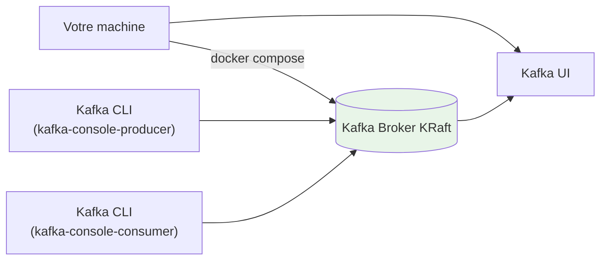

# Module 01 - Cluster Architecture (Local Kafka) - Self-Paced

## Objectif

Démarrer le **cluster Kafka local** avec KRaft (Kafka + Kafka UI) et comprendre les composants fondamentaux: brokers, topics, partitions, offsets.

## Ce que vous allez apprendre

- Démarrer/arrêter la stack Kafka via Docker Compose
- Vérifier l'état du cluster (health, list topics)
- Créer un topic avec plusieurs partitions
- Produire/consommer un message depuis le conteneur Kafka
- Observer les messages via Kafka UI

## Architecture



## Ports

- Kafka (externe): `localhost:9092`
- Kafka (interne docker): `kafka:29092`
- Kafka UI: `localhost:8080`

## Pré-requis

- Docker + Docker Compose plugin (`docker compose`)

## Step-by-step

### Step 0 - Se placer au bon endroit

Positionnez-vous dans le dossier `formation-v2/`.

### Step 1 - Démarrer la base Kafka

```bash
./scripts/up.sh
```

### Step 2 - Valider que la base est prête

```bash
docker ps --format '{{.Names}}\t{{.Status}}' | grep -E 'kafka|kafka-ui'
```

Résultat attendu:

- `kafka` et `kafka-ui` sont `Up (healthy)`

### Step 3 - Lister les services et vérifier les ports

```bash
docker ps --format '{{.Names}}\t{{.Status}}\t{{.Ports}}' | grep -E 'kafka$|kafka-ui$'
```

### Step 4 - Lister les topics

```bash
docker exec kafka /opt/kafka/bin/kafka-topics.sh --bootstrap-server localhost:9092 --list
```

### Step 5 - Créer un topic de démonstration (3 partitions)

```bash
docker exec kafka /opt/kafka/bin/kafka-topics.sh \
  --bootstrap-server localhost:9092 \
  --create --if-not-exists \
  --topic bhf-demo \
  --partitions 3 \
  --replication-factor 1
```

### Step 6 - Décrire le topic et observer les partitions

```bash
docker exec kafka /opt/kafka/bin/kafka-topics.sh \
  --bootstrap-server localhost:9092 \
  --describe --topic bhf-demo
```

Résultat attendu:

- `PartitionCount: 3`

### Step 7 - Produire un message

```bash
MSG="hello-bhf-$(date +%s)"

echo "$MSG" | docker exec -i kafka /opt/kafka/bin/kafka-console-producer.sh \
  --bootstrap-server localhost:9092 \
  --topic bhf-demo
```

### Step 8 - Consommer le message

```bash
docker exec kafka /opt/kafka/bin/kafka-console-consumer.sh \
  --bootstrap-server localhost:9092 \
  --topic bhf-demo \
  --from-beginning \
  --timeout-ms 10000
```

### Step 9 - Observer dans Kafka UI

1. Ouvrez `localhost:8080`
2. Cluster `BHF-Training`
3. Topic `bhf-demo`
4. Messages

### Step 10 - Checkpoint automatisé

```bash
./day-01-foundations/module-01-cluster/scripts/validate.sh
```

Résultat attendu:

- `OK`

## Checkpoint

- Les conteneurs `kafka`, `kafka-ui` sont `Up`
- Le topic `bhf-demo` existe avec **3 partitions**
- Un message peut être produit et consommé

## Troubleshooting

### Kafka UI non accessible

- Vérifiez que `kafka-ui` est `Up`:

```bash
docker ps --format '{{.Names}}\t{{.Status}}' | grep kafka-ui
```

### Kafka pas prêt

- Attendez 30-60 secondes et relancez:

```bash
docker ps --format '{{.Names}}\t{{.Status}}' | grep kafka
```

## Nettoyage

```bash
./scripts/down.sh
```
