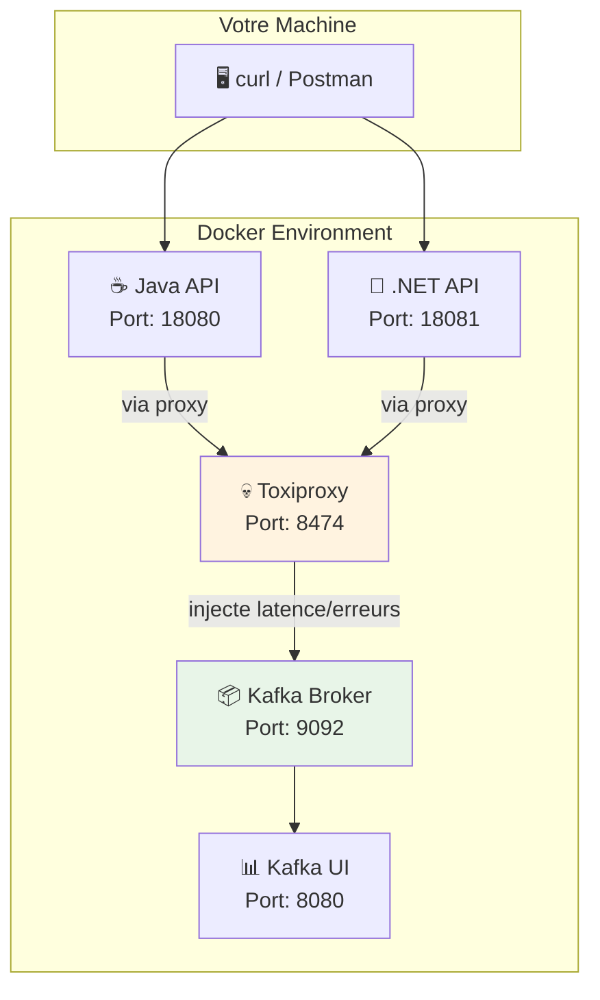

# Module 02 - Fiabilité du Producteur Kafka (Idempotence) - Formation Auto-rythmée

## Durée estimée

⏱️ **60-90 minutes**

## Objectifs pédagogiques

À la fin de ce module, vous serez capable de :

1. ✅ Comprendre la différence entre un producer **idempotent** et **non-idempotent**
2. ✅ Maîtriser l'envoi **synchrone** vs **asynchrone** et les callbacks
3. ✅ Configurer les **retries** et **timeouts** pour la fiabilité
4. ✅ Comprendre l'impact des **clés** sur le partitionnement
5. ✅ Utiliser **Toxiproxy** pour simuler des pannes réseau
6. ✅ Observer et déboguer les messages via **Kafka UI**
7. ✅ Comprendre la **log compaction** et son utilité

---

## 📖 Concepts théoriques

### Qu'est-ce que l'idempotence ?

L'**idempotence** garantit qu'un message envoyé plusieurs fois (à cause de retries) n'est écrit qu'**une seule fois** dans Kafka.

```
Sans idempotence (plain):
  Producer → [retry] → [retry] → Kafka = 3 messages identiques ❌

Avec idempotence:
  Producer → [retry] → [retry] → Kafka = 1 message unique ✅
```

### Configuration de l'idempotence

```properties
enable.idempotence=true
acks=all
max.in.flight.requests.per.connection=5
```

### Envoi synchrone vs asynchrone

| Mode | Comportement | Réponse HTTP | Cas d'usage |
|------|--------------|--------------|-------------|
| **Synchrone** | Attend l'ACK Kafka | 200 + offset | Simple, fiable |
| **Asynchrone** | Retourne immédiatement | 202 + requestId | Haute performance |

### Retries et timeouts

| Paramètre | Description | Valeur par défaut |
|-----------|-------------|-------------------|
| `retries` | Nombre max de tentatives | 2147483647 |
| `request.timeout.ms` | Timeout par requête | 30000 |
| `delivery.timeout.ms` | Timeout total de livraison | 120000 |
| `retry.backoff.ms` | Délai entre retries | 100 |

### Partitionnement et clés

- **Sans clé** : Round-robin sur les partitions
- **Avec clé** : Hash de la clé → partition déterministe
- **Ordre garanti** : Uniquement au sein d'une même partition

### Log compaction

La **compaction** conserve uniquement la dernière valeur pour chaque clé :

```
Avant compaction:
  key1 → value1, key1 → value2, key2 → value3, key1 → value4

Après compaction:
  key1 → value4, key2 → value3
```

---

## 🏗️ Architecture du module



---

## 🔌 Ports et endpoints

### Services

| Service | Port | URL |
|---------|------|-----|
| Java API | 18080 | http://localhost:18080 |
| .NET API | 18081 | http://localhost:18081 |
| Toxiproxy | 8474 | http://localhost:8474 |
| Kafka UI | 8080 | http://localhost:8080 |

### Endpoints des APIs

| Méthode | Endpoint | Description |
|---------|----------|-------------|
| GET | `/health` | Health check |
| POST | `/api/v1/send` | Envoyer un message |
| GET | `/api/v1/status` | Statut d'un envoi async |

### Paramètres de `/api/v1/send`

| Paramètre | Valeurs | Description |
|-----------|---------|-------------|
| `mode` | `plain`, `idempotent` | Mode du producer |
| `sendMode` | `sync`, `async` | Synchrone ou asynchrone |
| `eventId` | string | Identifiant unique du message |
| `key` | string (optionnel) | Clé de partitionnement |
| `partition` | int (optionnel) | Partition cible |

---

## 📋 Pré-requis

### Logiciels

- ✅ Docker + Docker Compose
- ✅ curl (ligne de commande)
- ✅ Navigateur web

### Cluster Kafka démarré

```bash
cd formation-v2/
./scripts/up.sh
```

**Vérification** :

```bash
docker ps --format 'table {{.Names}}\t{{.Status}}' | grep kafka
```

**Résultat attendu** : `kafka` et `kafka-ui` sont `Up (healthy)`.

---

## 📚 Lab 02.0 - Démarrage du module

### Objectif

Démarrer les services du module (APIs Java/.NET + Toxiproxy) et vérifier leur bon fonctionnement.

---

### Étape 1 - Positionnement

**Objectif** : Se placer dans le bon répertoire.

```bash
cd formation-v2/
```

---

### Étape 2 - Démarrage des services

**Objectif** : Lancer les conteneurs du module.

**Explication** : Cette commande lance :
- **Toxiproxy** : Proxy réseau pour injecter des pannes
- **toxiproxy-init** : Configuration initiale du proxy (one-shot)
- **m02-java-api** : API Spring Boot (Java)
- **m02-dotnet-api** : API ASP.NET (.NET)

**Commande** :

```bash
docker compose -f infra/docker-compose.single-node.yml \
  -f day-01-foundations/module-02-producer-reliability/docker-compose.module.yml \
  up -d --build
```

**⏱️ Temps d'attente** : 2-3 minutes (build des images Java/.NET).

**Résultat attendu** :

```
[+] Running 5/5
 ✔ Container toxiproxy        Started
 ✔ Container toxiproxy-init   Started
 ✔ Container m02-java-api     Started
 ✔ Container m02-dotnet-api   Started
```

---

### Étape 3 - Vérification des conteneurs

**Objectif** : S'assurer que tous les services sont opérationnels.

**Commande** :

```bash
docker ps --format 'table {{.Names}}\t{{.Status}}\t{{.Ports}}'
```

**Résultat attendu** :

| Conteneur | Statut attendu |
|-----------|----------------|
| kafka | Up (healthy) |
| kafka-ui | Up (healthy) |
| toxiproxy | Up |
| toxiproxy-init | Exited (0) ✅ normal |
| m02-java-api | Up |
| m02-dotnet-api | Up |

---

### Étape 4 - Test de santé des APIs

**Objectif** : Vérifier que les APIs répondent.

**Commandes** :

```bash
# Test Java API
curl -fsS http://localhost:18080/health
# Résultat attendu: OK

# Test .NET API
curl -fsS http://localhost:18081/health
# Résultat attendu: OK
```

**✅ Checkpoint 02.0** : Les deux APIs répondent `OK`.

---

## 📚 Lab 02.1 - Envoi synchrone (baseline)

### Objectif

Envoyer un message en mode **synchrone** et comprendre la réponse avec l'offset.

---

### Étape 5 - Envoi d'un message synchrone (Java API)

**Objectif** : Envoyer un message et recevoir l'ACK Kafka.

**Théorie** : En mode **synchrone**, l'API attend la confirmation de Kafka avant de répondre. La réponse contient :
- Le **topic** de destination
- La **partition** utilisée
- L'**offset** du message

**Commande** :

```bash
# Générer un ID unique
EVENT_ID="JAVA-SYNC-$(date +%s)"
echo "EventId: $EVENT_ID"

# Envoyer le message
curl -fsS -X POST "http://localhost:18080/api/v1/send?mode=plain&sendMode=sync&eventId=$EVENT_ID"
```

**Résultat attendu** :

```json
{
  "status": "OK",
  "topic": "bhf-transactions",
  "partition": 0,
  "offset": 5,
  "eventId": "JAVA-SYNC-1706400000"
}
```

**Explication de la réponse** :

| Champ | Description |
|-------|-------------|
| `status` | OK = message écrit avec succès |
| `topic` | Topic de destination |
| `partition` | Partition où le message est stocké |
| `offset` | Position du message dans la partition |
| `eventId` | Identifiant unique envoyé |

---

### Étape 6 - Envoi avec l'API .NET

**Objectif** : Vérifier que l'API .NET fonctionne de la même manière.

**Commande** :

```bash
EVENT_ID="DOTNET-SYNC-$(date +%s)"
curl -fsS -X POST "http://localhost:18081/api/v1/send?mode=plain&sendMode=sync&eventId=$EVENT_ID"
```

**✅ Checkpoint 02.1** : Les deux APIs retournent un JSON avec `partition` et `offset`.

---

### Étape 7 - Visualisation dans Kafka UI

**Objectif** : Observer les messages envoyés.

**Actions** :

1. Ouvrez **http://localhost:8080**
2. Cliquez sur le cluster **BHF-Training**
3. Menu **Topics** → **bhf-transactions**
4. Onglet **Messages** → **Fetch Messages**

**Ce que vous devez voir** :
- Vos messages avec les `eventId` envoyés
- La partition et l'offset de chaque message
- Le timestamp d'envoi

---

## 📚 Lab 02.2 - Envoi asynchrone et callbacks

### Objectif

Comprendre le mode **asynchrone** et comment récupérer le statut via polling.

---

### Étape 8 - Envoi asynchrone (Java)

**Objectif** : Envoyer un message sans attendre l'ACK.

**Théorie** : En mode **asynchrone** :
1. L'API retourne immédiatement un `requestId`
2. Le message est envoyé en arrière-plan
3. Vous consultez le statut via `/api/v1/status`

**Commande** :

```bash
EVENT_ID="JAVA-ASYNC-$(date +%s)"

# Envoyer en asynchrone
RESPONSE=$(curl -fsS -X POST "http://localhost:18080/api/v1/send?mode=idempotent&sendMode=async&eventId=$EVENT_ID")
echo "Réponse: $RESPONSE"

# Extraire le requestId
REQ_ID=$(echo "$RESPONSE" | sed -n 's/.*"requestId":"\([^"]*\)".*/\1/p')
echo "RequestId: $REQ_ID"
```

**Résultat attendu** :

```json
{
  "status": "ACCEPTED",
  "requestId": "abc123-def456",
  "eventId": "JAVA-ASYNC-1706400000"
}
```

---

### Étape 9 - Consultation du statut

**Objectif** : Récupérer le résultat de l'envoi asynchrone.

**Commande** :

```bash
# Attendre 2 secondes pour que l'envoi se termine
sleep 2

# Consulter le statut
curl -fsS "http://localhost:18080/api/v1/status?requestId=$REQ_ID"
```

**Résultat attendu (succès)** :

```json
{
  "state": "OK",
  "topic": "bhf-transactions",
  "partition": 1,
  "offset": 10
}
```

**Résultat possible (en cours)** :

```json
{
  "state": "PENDING"
}
```

**✅ Checkpoint 02.2** : Vous savez envoyer en asynchrone et récupérer le statut.

---

## 📚 Lab 02.3 - Injection de pannes avec Toxiproxy

### Objectif

Simuler des problèmes réseau pour observer le comportement des retries.

---

### Étape 10 - Vérification du proxy Toxiproxy

**Objectif** : Confirmer que le proxy Kafka est configuré.

**Commande** :

```bash
curl -fsS http://localhost:8474/proxies | python3 -m json.tool
```

**Résultat attendu** : Un proxy nommé `kafka` avec :
- `listen`: `0.0.0.0:29093`
- `upstream`: `kafka:29092`

---

### Étape 11 - Injection de latence

**Objectif** : Ajouter 5 secondes de latence sur les réponses Kafka.

**Théorie** : La latence peut provoquer des **timeouts** côté producer, ce qui déclenche des **retries**.

**Commande pour ajouter la latence** :

```bash
curl -fsS -H 'Content-Type: application/json' \
  -X POST http://localhost:8474/proxies/kafka/toxics \
  -d '{
    "name": "latency",
    "type": "latency",
    "stream": "downstream",
    "attributes": {
      "latency": 5000,
      "jitter": 0
    }
  }'
```

**Vérification** :

```bash
curl -fsS http://localhost:8474/proxies/kafka/toxics
```

---

### Étape 12 - Test avec latence

**Objectif** : Observer le comportement avec la latence.

**Commande** :

```bash
EVENT_ID="LATENCY-TEST-$(date +%s)"
time curl -fsS -X POST "http://localhost:18080/api/v1/send?mode=plain&sendMode=sync&eventId=$EVENT_ID"
```

**Observation** : La requête prend ~5 secondes de plus que d'habitude.

---

### Étape 13 - Suppression de la latence

**Objectif** : Retirer la latence pour continuer les tests.

**Commande** :

```bash
curl -fsS -X DELETE http://localhost:8474/proxies/kafka/toxics/latency
```

**Vérification** :

```bash
curl -fsS http://localhost:8474/proxies/kafka/toxics
# Résultat: [] (liste vide)
```

---

## 📚 Lab 02.4 - Idempotence vs Plain (test clé)

### Objectif

Prouver que l'idempotence évite les doublons lors des retries.

---

### Étape 14 - Exécution du test automatisé

**Objectif** : Valider le comportement idempotent vs non-idempotent.

**Explication** : Le script `validate.sh` :
1. Injecte de la latence via Toxiproxy
2. Envoie des messages en mode `plain` et `idempotent`
3. Compte les messages dans Kafka
4. Vérifie que `idempotent` = 1 message exactement

**Commande** :

```bash
./day-01-foundations/module-02-producer-reliability/scripts/validate.sh
```

**Résultat attendu** :

```
OK: java_idempotent=1 java_plain=1 dotnet_idempotent=1 dotnet_plain=1
```

**Note** : Si `java_plain` ou `dotnet_plain` > 1, c'est normal ! Cela prouve que les retries peuvent créer des doublons sans idempotence.

**✅ Checkpoint 02.4** : L'idempotence produit exactement 1 message.

---

## 📚 Lab 02.5 - Partitionnement

### Objectif

Comprendre comment les clés influencent le partitionnement.

---

### Étape 15 - Envoi sur des partitions différentes

**Objectif** : Envoyer des messages sur des partitions spécifiques.

**Commandes** :

```bash
# Message sur partition 0
curl -fsS -X POST "http://localhost:18080/api/v1/send?mode=plain&sendMode=sync&eventId=P0-$(date +%s)&partition=0"

# Message sur partition 1
curl -fsS -X POST "http://localhost:18080/api/v1/send?mode=plain&sendMode=sync&eventId=P1-$(date +%s)&partition=1"

# Message sur partition 2
curl -fsS -X POST "http://localhost:18080/api/v1/send?mode=plain&sendMode=sync&eventId=P2-$(date +%s)&partition=2"
```

---

### Étape 16 - Vérification des partitions

**Objectif** : Confirmer la distribution des messages.

**Commande** :

```bash
docker exec kafka /opt/kafka/bin/kafka-console-consumer.sh \
  --bootstrap-server localhost:9092 \
  --topic bhf-transactions \
  --from-beginning \
  --timeout-ms 5000 \
  --property print.partition=true \
  --property print.offset=true
```

**Résultat attendu** : Messages sur différentes partitions (0, 1, 2).

---

## 📚 Lab 02.6 - Log compaction

### Objectif

Comprendre la compaction et son utilité pour les états.

---

### Étape 17 - Création d'un topic compacté

**Objectif** : Créer un topic avec la politique de compaction.

**Commande** :

```bash
docker exec kafka /opt/kafka/bin/kafka-topics.sh \
  --bootstrap-server localhost:9092 \
  --create --if-not-exists \
  --topic bhf-compact-demo \
  --partitions 1 \
  --replication-factor 1 \
  --config cleanup.policy=compact \
  --config segment.ms=1000 \
  --config min.cleanable.dirty.ratio=0.01
```

---

### Étape 18 - Envoi de plusieurs versions

**Objectif** : Envoyer plusieurs valeurs pour la même clé.

**Commande** :

```bash
KEY="customer-42"

# Version 1
curl -fsS -X POST "http://localhost:18081/api/v1/send?mode=plain&sendMode=sync&topic=bhf-compact-demo&eventId=V1&key=$KEY"

# Version 2
curl -fsS -X POST "http://localhost:18081/api/v1/send?mode=plain&sendMode=sync&topic=bhf-compact-demo&eventId=V2&key=$KEY"

# Version 3 (finale)
curl -fsS -X POST "http://localhost:18081/api/v1/send?mode=plain&sendMode=sync&topic=bhf-compact-demo&eventId=V3&key=$KEY"
```

**Note** : Après compaction (asynchrone), seul `V3` sera conservé pour `customer-42`.

**✅ Checkpoint 02.6** : Vous comprenez la log compaction.

---

## ✅ Récapitulatif des checkpoints

| # | Checkpoint | Statut |
|---|------------|--------|
| 02.0 | APIs Java et .NET répondent OK | ☐ |
| 02.1 | Envoi synchrone retourne partition/offset | ☐ |
| 02.2 | Envoi asynchrone + récupération du statut | ☐ |
| 02.3 | Injection de latence via Toxiproxy | ☐ |
| 02.4 | Script validate.sh retourne OK | ☐ |
| 02.5 | Messages sur différentes partitions | ☐ |
| 02.6 | Compréhension de la log compaction | ☐ |

---

## 🔧 Troubleshooting

### APIs ne démarrent pas

**Symptôme** : `m02-java-api` ou `m02-dotnet-api` en erreur.

**Solution** :

```bash
# Vérifier les logs
docker logs m02-java-api --tail 100
docker logs m02-dotnet-api --tail 100

# Reconstruire les images
docker compose -f infra/docker-compose.single-node.yml \
  -f day-01-foundations/module-02-producer-reliability/docker-compose.module.yml \
  up -d --build --force-recreate
```

### Toxiproxy ne répond pas

**Symptôme** : `curl: (7) Failed to connect to localhost port 8474`.

**Solution** :

```bash
docker logs toxiproxy
docker restart toxiproxy
```

### Messages non visibles dans Kafka UI

**Symptôme** : Le topic existe mais pas de messages.

**Solution** :

1. Cliquez sur **Fetch Messages**
2. Réglez le filtre sur **Earliest** (depuis le début)
3. Vérifiez le bon topic (`bhf-transactions`)

---

## 🧹 Nettoyage

**Objectif** : Arrêter les services du module.

**Commande** :

```bash
docker compose -f infra/docker-compose.single-node.yml \
  -f day-01-foundations/module-02-producer-reliability/docker-compose.module.yml \
  down
```

---

## 📖 Pour aller plus loin

### Exercices supplémentaires

1. **Modifiez les timeouts** dans `docker-compose.module.yml` et observez l'impact
2. **Injectez un timeout complet** avec Toxiproxy et observez les erreurs
3. **Testez avec différentes clés** et observez la distribution sur les partitions

### Ressources

- [Kafka Producer Configuration](https://kafka.apache.org/documentation/#producerconfigs)
- [Idempotent Producer](https://kafka.apache.org/documentation/#semantics)
- [Toxiproxy Documentation](https://github.com/Shopify/toxiproxy)

---

## ➡️ Module suivant

Une fois ce module terminé, passez au :

👉 **[Module 03 - Consumer Read-Committed](../module-03-consumer-read-committed/README.md)**
