# Module 02 - Fiabilité du Producteur Kafka (Idempotence) - Formation Auto-rythmée

## Durée estimée

⏱️ **60-90 minutes**

## Objectifs pédagogiques

À la fin de ce module, vous serez capable de :

1. ✅ Comprendre la différence entre un producer **idempotent** et **non-idempotent**
2. ✅ Maîtriser l'envoi **synchrone** vs **asynchrone** et les callbacks
3. ✅ Configurer les **retries** et **timeouts** pour la fiabilité
4. ✅ Comprendre l'impact des **clés** sur le partitionnement
5. ✅ Utiliser **Toxiproxy** pour simuler des pannes réseau
6. ✅ Observer et déboguer les messages via **Kafka UI**
7. ✅ Comprendre la **log compaction** et son utilité

---

## 📖 Partie Théorique Approfondie

### 1. Le Producteur Kafka en détail

#### Cycle de vie d'un message


#### Composants internes du Producer

```mermaid
flowchart TB
    subgraph Producer["📤 Kafka Producer"]
        subgraph Config["Configuration"]
            BS["batch.size<br/>16KB"]
            LI["linger.ms<br/>0ms"]
            AC["acks<br/>all"]
            RE["retries<br/>∞"]
        end
        
        subgraph Pipeline["Pipeline d'envoi"]
            SER["🔄 Serializer<br/>Key + Value"]
            PAR["📊 Partitioner<br/>Round-robin / Hash"]
            ACC["📦 RecordAccumulator<br/>Batching"]
            SND["🌐 Sender Thread<br/>Network I/O"]
        end
        
        SER --> PAR --> ACC --> SND
    end
    
    SND -->|"ProduceRequest"| K["📦 Kafka Broker"]
    K -->|"ACK"| SND
```



---

### 2. Les Acknowledgments (ACKs)

#### Niveaux d'ACK


#### Comparaison des modes ACK

| Mode | Durabilité | Performance | Risque de perte |
|------|------------|-------------|-----------------|
| `acks=0` | ❌ Aucune | ⚡⚡⚡ Maximale | Élevé |
| `acks=1` | ⚠️ Partielle | ⚡⚡ Bonne | Moyen |
| `acks=all` | ✅ Complète | ⚡ Modérée | Minimal |

---

### 3. L'Idempotence en profondeur

#### Le problème des doublons

```mermaid
sequenceDiagram
    participant P as Producer
    participant B as Broker
    
    P->>B: Message "order-123"
    B->>B: Write OK
    B--xP: ACK perdu (réseau)
    Note over P: Timeout → Retry
    P->>B: Message "order-123" (retry)
    B->>B: Write OK (DOUBLON !)
    B-->>P: ACK
    
    Note over B: ❌ 2 messages identiques
```



#### Solution : Producer Idempotent

```mermaid
sequenceDiagram
    participant P as Producer (PID=42)
    participant B as Broker
    
    P->>B: Message "order-123" (seq=0)
    B->>B: Write OK, store seq=0
    B--xP: ACK perdu
    Note over P: Timeout → Retry
    P->>B: Message "order-123" (seq=0, retry)
    B->>B: Check: seq=0 déjà vu → SKIP
    B-->>P: ACK (avec offset original)
    
    Note over B: ✅ 1 seul message
```



#### Mécanisme interne

| Concept | Description |
|---------|-------------|
| **PID** (Producer ID) | Identifiant unique du producer (assigné au démarrage) |
| **Epoch** | Version du producer (incrémenté si redémarrage) |
| **Sequence Number** | Numéro séquentiel par partition (0, 1, 2, ...) |

```
Message format avec idempotence:
┌─────────────────────────────────────────────────┐
│ PID: 42 │ Epoch: 0 │ SeqNum: 5 │ Partition: 0  │
├─────────────────────────────────────────────────┤
│                   Payload                        │
└─────────────────────────────────────────────────┘
```

---

### 4. Retries et Gestion des erreurs

#### Timeline des retries


#### Paramètres de retry

```mermaid
flowchart LR
    subgraph Timeouts["⏱️ Timeouts"]
        RT["request.timeout.ms<br/>30s"]
        DT["delivery.timeout.ms<br/>120s"]
    end
    
    subgraph Retries["🔄 Retries"]
        R["retries<br/>2147483647"]
        RB["retry.backoff.ms<br/>100ms"]
    end
    
    subgraph Constraint["⚠️ Contrainte"]
        C["delivery.timeout.ms ≥<br/>request.timeout.ms +<br/>linger.ms"]
    end
```



#### Erreurs récupérables vs non-récupérables

| Type | Exemples | Action |
|------|----------|--------|
| **Récupérable** | NetworkException, LeaderNotAvailable | Retry automatique |
| **Non-récupérable** | InvalidTopicException, AuthorizationException | Échec immédiat |
| **Fatal** | ProducerFenced, OutOfMemory | Arrêt du producer |

---

### 5. Synchrone vs Asynchrone

#### Mode Synchrone


#### Mode Asynchrone

```mermaid
sequenceDiagram
    participant C as Client HTTP
    participant A as API
    participant P as Producer
    participant K as Kafka
    participant S as StatusStore
    
    C->>A: POST /send (async)
    A->>P: send() + callback
    A->>S: Store requestId=PENDING
    A-->>C: 202 Accepted + requestId
    
    Note over C: Client libéré immédiatement
    
    P->>K: ProduceRequest
    K-->>P: ProduceResponse
    P->>S: Update requestId=OK
    
    C->>A: GET /status?requestId=...
    A->>S: Get status
    A-->>C: 200 OK + offset
```



#### Comparaison

| Aspect | Synchrone | Asynchrone |
|--------|-----------|------------|
| **Latence perçue** | Haute | Basse |
| **Complexité** | Simple | Plus complexe |
| **Gestion d'erreur** | Immédiate | Différée (polling) |
| **Débit** | Limité | Élevé |
| **Cas d'usage** | APIs critiques | Haute performance |

---

### 6. Partitionnement et Clés

#### Stratégies de partitionnement


#### Garantie d'ordre avec les clés

```
Topic: orders (3 partitions)

key="customer-42":
  Partition 1: [order-1] → [order-2] → [order-3] ✅ Ordre garanti

key="customer-99":
  Partition 0: [order-A] → [order-B] → [order-C] ✅ Ordre garanti

⚠️ Pas d'ordre garanti ENTRE les partitions
```

---

### 7. Log Compaction

#### Principe

```mermaid
flowchart LR
    subgraph Before["Avant Compaction"]
        B1["k1:v1"]
        B2["k2:v1"]
        B3["k1:v2"]
        B4["k3:v1"]
        B5["k1:v3"]
        B6["k2:v2"]
    end
    
    Compact["🔄 Compaction"]
    
    subgraph After["Après Compaction"]
        A1["k3:v1"]
        A2["k1:v3"]
        A3["k2:v2"]
    end
    
    Before --> Compact --> After
```



#### Cas d'usage

| Scénario | Exemple | Clé | Valeur |
|----------|---------|-----|--------|
| **État utilisateur** | Profil client | userId | JSON profil |
| **Position GPS** | Flotte véhicules | vehicleId | lat/long |
| **Configuration** | Feature flags | featureName | enabled/disabled |
| **Inventaire** | Stock produits | productId | quantité |

---

### 8. Toxiproxy : Simulation de pannes

#### Architecture avec Toxiproxy

```mermaid
flowchart LR
    subgraph Normal["Mode Normal"]
        A1["API"] -->|"29092"| K1["Kafka"]
    end
    
    subgraph Proxy["Mode Proxy"]
        A2["API"] -->|"29093"| T["💀 Toxiproxy"]
        T -->|"29092"| K2["Kafka"]
        
        subgraph Toxics["Effets injectables"]
            L["⏱️ Latency"]
            TO["⏹️ Timeout"]
            BW["📉 Bandwidth"]
            SL["🔀 Slicer"]
        end
    end
    
    style T fill:#fff3e0
```



#### Types de pannes simulables

| Toxic | Effet | Paramètres |
|-------|-------|------------|
| **latency** | Ajoute un délai | `latency`, `jitter` |
| **timeout** | Coupe la connexion après N ms | `timeout` |
| **bandwidth** | Limite le débit | `rate` (KB/s) |
| **slicer** | Fragmente les paquets | `average_size`, `delay` |
| **slow_close** | Fermeture lente | `delay` |

```json
// Exemple : ajouter 5 secondes de latence
{
  "name": "latency",
  "type": "latency",
  "stream": "downstream",
  "attributes": {
    "latency": 5000,
    "jitter": 500
  }
}
```

---

## 🏗️ Architecture du module

```mermaid
flowchart TB
    subgraph Client["Votre Machine"]
        curl["🖥️ curl / Postman"]
    end
    
    subgraph Docker["Docker Environment"]
        Java["☕ Java API<br/>Port: 18080"]
        DotNet["🔷 .NET API<br/>Port: 18081"]
        Toxi["💀 Toxiproxy<br/>Port: 8474<br/>(tests de pannes)"]
        K["📦 Kafka Broker<br/>Port: 29092"]
        UI["📊 Kafka UI<br/>Port: 8080"]
    end
    
    curl --> Java
    curl --> DotNet
    Java -->|"kafka:29092"| K
    DotNet -->|"kafka:29092"| K
    Toxi -.->|"proxy disponible<br/>sur :29093"| K
    K --> UI
    
    style Toxi fill:#fff3e0
    style K fill:#e8f5e8
```



> **Note** : Les APIs se connectent directement à Kafka. Toxiproxy est disponible sur le port 29093 pour les tests d'injection de pannes manuels.

---

## 🔌 Ports et endpoints

### Services

| Service | Port | URL |
|---------|------|-----|
| Java API | 18080 | http://localhost:18080 |
| .NET API | 18081 | http://localhost:18081 |
| Toxiproxy | 8474 | http://localhost:8474 |
| Kafka UI | 8080 | http://localhost:8080 |

### Endpoints des APIs

| Méthode | Endpoint | Description |
|---------|----------|-------------|
| GET | `/health` | Health check |
| POST | `/api/v1/send` | Envoyer un message |
| GET | `/api/v1/status` | Statut d'un envoi async |

### Paramètres de `/api/v1/send`

| Paramètre | Valeurs | Description |
|-----------|---------|-------------|
| `mode` | `plain`, `idempotent` | Mode du producer |
| `sendMode` | `sync`, `async` | Synchrone ou asynchrone |
| `eventId` | string | Identifiant unique du message |
| `key` | string (optionnel) | Clé de partitionnement |
| `partition` | int (optionnel) | Partition cible |

---

## 📋 Pré-requis

### Logiciels

<details>
<summary>🐳 <b>Mode Docker</b></summary>

- ✅ Docker + Docker Compose
- ✅ curl (ligne de commande)
- ✅ Navigateur web

</details>

<details>
<summary>☸️ <b>Mode OKD/K3s</b></summary>

- ✅ Cluster Kubernetes (K3s, OKD, ou OpenShift)
- ✅ kubectl configuré
- ✅ Strimzi Operator installé
- ✅ curl (ligne de commande)

</details>

### Cluster Kafka démarré

<details>
<summary>🐳 <b>Mode Docker</b></summary>

```bash
cd formation-v2/
./scripts/up.sh   # Mode single-node par défaut
# ou: ./scripts/up.sh cluster   # Mode cluster 3 brokers
```

**Vérification** :

```bash
docker ps --format 'table {{.Names}}\t{{.Status}}' | grep kafka
```

**Résultat attendu** : `kafka` et `kafka-ui` sont `Up (healthy)`.

</details>

<details>
<summary>☸️ <b>Mode OKD/K3s</b></summary>

```bash
# Vérifier que le cluster Kafka est prêt
kubectl get kafka -n kafka

# Résultat attendu:
# NAME        DESIRED KAFKA REPLICAS   DESIRED ZK REPLICAS   READY   ...
# bhf-kafka   3                                              True    ...
```

**Vérification des pods** :

```bash
kubectl get pods -n kafka -l strimzi.io/cluster=bhf-kafka
```

</details>

---

## 📚 Lab 02.0 - Démarrage du module

### Objectif

Démarrer les services du module (APIs Java/.NET + Toxiproxy) et vérifier leur bon fonctionnement.

---

### Étape 1 - Positionnement

**Objectif** : Se placer dans le bon répertoire.

```bash
cd formation-v2/
```

---

### Étape 2 - Démarrage des services

**Objectif** : Lancer les conteneurs du module.

<details>
<summary>🐳 <b>Mode Docker</b></summary>

**Explication** : Cette commande lance :

- **Toxiproxy** : Proxy réseau pour injecter des pannes
- **toxiproxy-init** : Configuration initiale du proxy (one-shot)
- **m02-java-api** : API Spring Boot (Java)
- **m02-dotnet-api** : API ASP.NET (.NET)

**Commande** :

```bash
# Si le cluster Kafka est déjà démarré via ./scripts/up.sh :
docker compose -f day-01-foundations/module-02-producer-reliability/docker-compose.module.yml up -d --build
```

**⏱️ Temps d'attente** : 2-3 minutes (build des images Java/.NET).

**Résultat attendu** :

```text
[+] Running 4/4
 ✔ Container toxiproxy        Healthy
 ✔ Container toxiproxy-init   Started
 ✔ Container m02-java-api     Started
 ✔ Container m02-dotnet-api   Started
```

</details>

<details>
<summary>☸️ <b>Mode OKD/K3s</b></summary>

**Explication** : En mode K8s, les APIs doivent être déployées comme des Deployments avec des Services NodePort.

**Option 1 - Utiliser les images Docker locales** :

```bash
# Builder et pousser les images vers le registry local
cd formation-v2/day-01-foundations/module-02-producer-reliability

# Build Java API
docker build -t localhost:5000/m02-java-api:latest -f java-api/Dockerfile java-api/
docker push localhost:5000/m02-java-api:latest

# Build .NET API
docker build -t localhost:5000/m02-dotnet-api:latest -f dotnet-api/Dockerfile dotnet-api/
docker push localhost:5000/m02-dotnet-api:latest
```

**Option 2 - Déployer sur K8s** :

```bash
# Créer le déploiement Java API
cat <<EOF | kubectl apply -f -
apiVersion: apps/v1
kind: Deployment
metadata:
  name: m02-java-api
  namespace: kafka
spec:
  replicas: 1
  selector:
    matchLabels:
      app: m02-java-api
  template:
    metadata:
      labels:
        app: m02-java-api
    spec:
      containers:
      - name: java-api
        image: localhost:5000/m02-java-api:latest
        ports:
        - containerPort: 8080
        env:
        - name: KAFKA_BOOTSTRAP_SERVERS
          value: "bhf-kafka-kafka-bootstrap.kafka.svc:9092"
---
apiVersion: v1
kind: Service
metadata:
  name: m02-java-api
  namespace: kafka
spec:
  type: NodePort
  ports:
  - port: 8080
    targetPort: 8080
    nodePort: 31080
  selector:
    app: m02-java-api
EOF
```

**Vérification** :

```bash
kubectl get pods -n kafka -l app=m02-java-api
kubectl get svc m02-java-api -n kafka
```

> **Note** : En mode K8s, Toxiproxy n'est pas utilisé. Les tests de latence peuvent être effectués avec des outils comme `tc` (traffic control) ou en simulant des pannes de pods.

</details>

---

### Étape 3 - Vérification des conteneurs

**Objectif** : S'assurer que tous les services sont opérationnels.

<details>
<summary>🐳 <b>Mode Docker</b></summary>

**Commande** :

```bash
docker ps --format 'table {{.Names}}\t{{.Status}}\t{{.Ports}}'
```

**Résultat attendu** :

| Conteneur | Statut attendu |
|-----------|----------------|
| kafka | Up (healthy) |
| kafka-ui | Up (healthy) |
| toxiproxy | Up |
| toxiproxy-init | Exited (0) ✅ normal |
| m02-java-api | Up |
| m02-dotnet-api | Up |

</details>

<details>
<summary>☸️ <b>Mode OKD/K3s</b></summary>

**Commande** :

```bash
kubectl get pods -n kafka
```

**Résultat attendu** :

| Pod | Statut attendu |
|-----|----------------|
| bhf-kafka-* | Running |
| m02-java-api-* | Running |
| m02-dotnet-api-* | Running (si déployé) |

</details>

---

### Étape 4 - Test de santé des APIs

**Objectif** : Vérifier que les APIs répondent.

<details>
<summary>🐳 <b>Mode Docker</b></summary>

```bash
# Test Java API
curl -fsS http://localhost:18080/health
# Résultat attendu: OK

# Test .NET API
curl -fsS http://localhost:18081/health
# Résultat attendu: OK
```

</details>

<details>
<summary>☸️ <b>Mode OKD/K3s</b></summary>

```bash
# Test Java API (NodePort 31080)
curl -fsS http://localhost:31080/health
# Résultat attendu: OK

# Test .NET API (NodePort 31081)
curl -fsS http://localhost:31081/health
# Résultat attendu: OK

# Si localhost ne fonctionne pas, utilisez l'IP du node:
curl -fsS http://$(hostname -I | awk '{print $1}'):31080/health
```

</details>

**✅ Checkpoint 02.0** : Les deux APIs répondent `OK`.

---

## 📚 Lab 02.1 - Envoi synchrone (baseline)

### Objectif

Envoyer un message en mode **synchrone** et comprendre la réponse avec l'offset.

---

### Étape 5 - Envoi d'un message synchrone (Java API)

**Objectif** : Envoyer un message et recevoir l'ACK Kafka.

**Théorie** : En mode **synchrone**, l'API attend la confirmation de Kafka avant de répondre. La réponse contient :
- Le **topic** de destination
- La **partition** utilisée
- L'**offset** du message

<details>
<summary>🐳 <b>Mode Docker</b></summary>

```bash
# Générer un ID unique
EVENT_ID="JAVA-SYNC-$(date +%s)"
echo "EventId: $EVENT_ID"

# Envoyer le message
curl -fsS -X POST "http://localhost:18080/api/v1/send?mode=plain&sendMode=sync&eventId=$EVENT_ID"
```

</details>

<details>
<summary>☸️ <b>Mode OKD/K3s</b></summary>

```bash
# Générer un ID unique
EVENT_ID="JAVA-SYNC-$(date +%s)"
echo "EventId: $EVENT_ID"

# Envoyer le message (NodePort 31080)
curl -fsS -X POST "http://localhost:31080/api/v1/send?mode=plain&sendMode=sync&eventId=$EVENT_ID"
```

</details>

**Résultat attendu** :

```json
{
  "status": "OK",
  "topic": "bhf-transactions",
  "partition": 0,
  "offset": 5,
  "eventId": "JAVA-SYNC-1706400000"
}
```

**Explication de la réponse** :

| Champ | Description |
|-------|-------------|
| `status` | OK = message écrit avec succès |
| `topic` | Topic de destination |
| `partition` | Partition où le message est stocké |
| `offset` | Position du message dans la partition |
| `eventId` | Identifiant unique envoyé |

---

### Étape 6 - Envoi avec l'API .NET

**Objectif** : Vérifier que l'API .NET fonctionne de la même manière.

<details>
<summary>🐳 <b>Mode Docker</b></summary>

```bash
EVENT_ID="DOTNET-SYNC-$(date +%s)"
curl -fsS -X POST "http://localhost:18081/api/v1/send?mode=plain&sendMode=sync&eventId=$EVENT_ID"
```

</details>

<details>
<summary>☸️ <b>Mode OKD/K3s</b></summary>

```bash
EVENT_ID="DOTNET-SYNC-$(date +%s)"
curl -fsS -X POST "http://localhost:31081/api/v1/send?mode=plain&sendMode=sync&eventId=$EVENT_ID"
```

</details>

**✅ Checkpoint 02.1** : Les deux APIs retournent un JSON avec `partition` et `offset`.

---

### Étape 7 - Visualisation dans Kafka UI

**Objectif** : Observer les messages envoyés.

<details>
<summary>🐳 <b>Mode Docker</b></summary>

**Actions** :

1. Ouvrez **http://localhost:8080**
2. Cliquez sur le cluster **BHF-Training**
3. Menu **Topics** → **bhf-transactions**
4. Onglet **Messages** → **Fetch Messages**

</details>

<details>
<summary>☸️ <b>Mode OKD/K3s</b></summary>

**Via kubectl** :

```bash
# Consommer les messages directement
kubectl run kafka-consumer --rm -it --restart=Never \
  --image=quay.io/strimzi/kafka:latest-kafka-4.0.0 \
  -n kafka -- bin/kafka-console-consumer.sh \
  --bootstrap-server bhf-kafka-kafka-bootstrap:9092 \
  --topic bhf-transactions --from-beginning --max-messages 5
```

**Via Kafka UI (si déployé)** : Accédez via le NodePort ou Route configuré.

</details>

**Ce que vous devez voir** :
- Vos messages avec les `eventId` envoyés
- La partition et l'offset de chaque message
- Le timestamp d'envoi

---

## 📚 Lab 02.2 - Envoi asynchrone et callbacks

### Objectif

Comprendre le mode **asynchrone** et comment récupérer le statut via polling.

---

### Étape 8 - Envoi asynchrone (Java)

**Objectif** : Envoyer un message sans attendre l'ACK.

**Théorie** : En mode **asynchrone** :
1. L'API retourne immédiatement un `requestId`
2. Le message est envoyé en arrière-plan
3. Vous consultez le statut via `/api/v1/status`

<details>
<summary>🐳 <b>Mode Docker</b></summary>

```bash
EVENT_ID="JAVA-ASYNC-$(date +%s)"

# Envoyer en asynchrone
RESPONSE=$(curl -fsS -X POST "http://localhost:18080/api/v1/send?mode=idempotent&sendMode=async&eventId=$EVENT_ID")
echo "Réponse: $RESPONSE"

# Extraire le requestId
REQ_ID=$(echo "$RESPONSE" | sed -n 's/.*"requestId":"\([^"]*\)".*/\1/p')
echo "RequestId: $REQ_ID"
```

</details>

<details>
<summary>☸️ <b>Mode OKD/K3s</b></summary>

```bash
EVENT_ID="JAVA-ASYNC-$(date +%s)"

# Envoyer en asynchrone (NodePort 31080)
RESPONSE=$(curl -fsS -X POST "http://localhost:31080/api/v1/send?mode=idempotent&sendMode=async&eventId=$EVENT_ID")
echo "Réponse: $RESPONSE"

# Extraire le requestId
REQ_ID=$(echo "$RESPONSE" | sed -n 's/.*"requestId":"\([^"]*\)".*/\1/p')
echo "RequestId: $REQ_ID"
```

</details>

**Résultat attendu** :

```json
{
  "status": "ACCEPTED",
  "requestId": "abc123-def456",
  "eventId": "JAVA-ASYNC-1706400000"
}
```

---

### Étape 9 - Consultation du statut

**Objectif** : Récupérer le résultat de l'envoi asynchrone.

<details>
<summary>🐳 <b>Mode Docker</b></summary>

```bash
# Attendre 2 secondes pour que l'envoi se termine
sleep 2

# Consulter le statut
curl -fsS "http://localhost:18080/api/v1/status?requestId=$REQ_ID"
```

</details>

<details>
<summary>☸️ <b>Mode OKD/K3s</b></summary>

```bash
# Attendre 2 secondes pour que l'envoi se termine
sleep 2

# Consulter le statut (NodePort 31080)
curl -fsS "http://localhost:31080/api/v1/status?requestId=$REQ_ID"
```

</details>

**Résultat attendu (succès)** :

```json
{
  "state": "OK",
  "topic": "bhf-transactions",
  "partition": 1,
  "offset": 10
}
```

**Résultat possible (en cours)** :

```json
{
  "state": "PENDING"
}
```

**✅ Checkpoint 02.2** : Vous savez envoyer en asynchrone et récupérer le statut.

---

## 📚 Lab 02.3 - Injection de pannes avec Toxiproxy

### Objectif

Simuler des problèmes réseau pour observer le comportement des retries.

> ☸️ **Note K8s** : Toxiproxy n'est pas disponible en mode K8s. Les étapes 10-13 sont spécifiques au mode Docker. Pour simuler des pannes en K8s, utilisez des outils comme `kubectl delete pod` ou des NetworkPolicies.

---

### Étape 10 - Vérification du proxy Toxiproxy

**Objectif** : Confirmer que le proxy Kafka est configuré.

**Commande** :

```bash
curl -fsS http://localhost:8474/proxies | python3 -m json.tool
```

**Résultat attendu** : Un proxy nommé `kafka` avec :
- `listen`: `0.0.0.0:29093`
- `upstream`: `kafka:29092`

---

### Étape 11 - Injection de latence

**Objectif** : Ajouter 5 secondes de latence sur les réponses Kafka.

**Théorie** : La latence peut provoquer des **timeouts** côté producer, ce qui déclenche des **retries**.

**Commande pour ajouter la latence** :

```bash
curl -fsS -H 'Content-Type: application/json' \
  -X POST http://localhost:8474/proxies/kafka/toxics \
  -d '{
    "name": "latency",
    "type": "latency",
    "stream": "downstream",
    "attributes": {
      "latency": 5000,
      "jitter": 0
    }
  }'
```

**Vérification** :

```bash
curl -fsS http://localhost:8474/proxies/kafka/toxics
```

---

### Étape 12 - Test avec latence

**Objectif** : Observer le comportement avec la latence.

**Commande** :

```bash
EVENT_ID="LATENCY-TEST-$(date +%s)"
time curl -fsS -X POST "http://localhost:18080/api/v1/send?mode=plain&sendMode=sync&eventId=$EVENT_ID"
```

**Observation** : La requête prend ~5 secondes de plus que d'habitude.

---

### Étape 13 - Suppression de la latence

**Objectif** : Retirer la latence pour continuer les tests.

**Commande** :

```bash
curl -fsS -X DELETE http://localhost:8474/proxies/kafka/toxics/latency
```

**Vérification** :

```bash
curl -fsS http://localhost:8474/proxies/kafka/toxics
# Résultat: [] (liste vide)
```

---

## 📚 Lab 02.4 - Idempotence vs Plain (test clé)

### Objectif

Prouver que l'idempotence évite les doublons lors des retries.

---

### Étape 14 - Exécution du test automatisé

**Objectif** : Valider le comportement idempotent vs non-idempotent.

<details>
<summary>🐳 <b>Mode Docker</b></summary>

**Explication** : Le script `validate.sh` :

1. Injecte de la latence via Toxiproxy
2. Envoie des messages en mode `plain` et `idempotent`
3. Compte les messages dans Kafka
4. Vérifie que `idempotent` = 1 message exactement

**Commande** :

```bash
./day-01-foundations/module-02-producer-reliability/scripts/validate.sh
```

**Résultat attendu** :

```text
OK: java_idempotent=1 java_plain=1 dotnet_idempotent=1 dotnet_plain=1
```

**Note** : Si `java_plain` ou `dotnet_plain` > 1, c'est normal ! Cela prouve que les retries peuvent créer des doublons sans idempotence.

</details>

<details>
<summary>☸️ <b>Mode OKD/K3s</b></summary>

**Explication** : En mode K8s, le script valide le producteur idempotent sans injection de latence Toxiproxy.

**Commande** :

```bash
./day-01-foundations/module-02-producer-reliability/scripts/validate.sh --k8s
```

**Résultat attendu** :

```text
Running validation in K8s mode...
NOTE: K8s mode tests idempotent producer without Toxiproxy latency injection
OK: java_idempotent=1 (K8s mode - no latency injection)
```

> **Note** : Si les APIs ne sont pas déployées sur K8s, le script validera uniquement le cluster Kafka.

</details>

**✅ Checkpoint 02.4** : L'idempotence produit exactement 1 message.

---

## 📚 Lab 02.5 - Partitionnement

### Objectif

Comprendre comment les clés influencent le partitionnement.

---

### Étape 15 - Envoi sur des partitions différentes

**Objectif** : Envoyer des messages sur des partitions spécifiques.

<details>
<summary>🐳 <b>Mode Docker</b></summary>

```bash
# Message sur partition 0
curl -fsS -X POST "http://localhost:18080/api/v1/send?mode=plain&sendMode=sync&eventId=P0-$(date +%s)&partition=0"

# Message sur partition 1
curl -fsS -X POST "http://localhost:18080/api/v1/send?mode=plain&sendMode=sync&eventId=P1-$(date +%s)&partition=1"

# Message sur partition 2
curl -fsS -X POST "http://localhost:18080/api/v1/send?mode=plain&sendMode=sync&eventId=P2-$(date +%s)&partition=2"
```

</details>

<details>
<summary>☸️ <b>Mode OKD/K3s</b></summary>

```bash
# Message sur partition 0 (NodePort 31080)
curl -fsS -X POST "http://localhost:31080/api/v1/send?mode=plain&sendMode=sync&eventId=P0-$(date +%s)&partition=0"

# Message sur partition 1
curl -fsS -X POST "http://localhost:31080/api/v1/send?mode=plain&sendMode=sync&eventId=P1-$(date +%s)&partition=1"

# Message sur partition 2
curl -fsS -X POST "http://localhost:31080/api/v1/send?mode=plain&sendMode=sync&eventId=P2-$(date +%s)&partition=2"
```

</details>

---

### Étape 16 - Vérification des partitions

**Objectif** : Confirmer la distribution des messages.

<details>
<summary>🐳 <b>Mode Docker</b></summary>

```bash
docker exec kafka /opt/kafka/bin/kafka-console-consumer.sh \
  --bootstrap-server localhost:9092 \
  --topic bhf-transactions \
  --from-beginning \
  --timeout-ms 5000 \
  --property print.partition=true \
  --property print.offset=true
```

</details>

<details>
<summary>☸️ <b>Mode OKD/K3s</b></summary>

```bash
kubectl run kafka-consumer --rm -it --restart=Never \
  --image=quay.io/strimzi/kafka:latest-kafka-4.0.0 \
  -n kafka -- bin/kafka-console-consumer.sh \
  --bootstrap-server bhf-kafka-kafka-bootstrap:9092 \
  --topic bhf-transactions --from-beginning \
  --timeout-ms 5000 \
  --property print.partition=true \
  --property print.offset=true
```

</details>

**Résultat attendu** : Messages sur différentes partitions (0, 1, 2).

---

## 📚 Lab 02.6 - Log compaction

### Objectif

Comprendre la compaction et son utilité pour les états.

---

### Étape 17 - Création d'un topic compacté

**Objectif** : Créer un topic avec la politique de compaction.

<details>
<summary>🐳 <b>Mode Docker</b></summary>

```bash
docker exec kafka /opt/kafka/bin/kafka-topics.sh \
  --bootstrap-server localhost:9092 \
  --create --if-not-exists \
  --topic bhf-compact-demo \
  --partitions 1 \
  --replication-factor 1 \
  --config cleanup.policy=compact \
  --config segment.ms=1000 \
  --config min.cleanable.dirty.ratio=0.01
```

</details>

<details>
<summary>☸️ <b>Mode OKD/K3s</b></summary>

```bash
cat <<EOF | kubectl apply -f -
apiVersion: kafka.strimzi.io/v1beta2
kind: KafkaTopic
metadata:
  name: bhf-compact-demo
  namespace: kafka
  labels:
    strimzi.io/cluster: bhf-kafka
spec:
  partitions: 1
  replicas: 3
  config:
    cleanup.policy: compact
    segment.ms: "1000"
    min.cleanable.dirty.ratio: "0.01"
EOF
```

</details>

---

### Étape 18 - Envoi de plusieurs versions

**Objectif** : Envoyer plusieurs valeurs pour la même clé.

<details>
<summary>🐳 <b>Mode Docker</b></summary>

```bash
KEY="customer-42"

# Version 1
curl -fsS -X POST "http://localhost:18081/api/v1/send?mode=plain&sendMode=sync&topic=bhf-compact-demo&eventId=V1&key=$KEY"

# Version 2
curl -fsS -X POST "http://localhost:18081/api/v1/send?mode=plain&sendMode=sync&topic=bhf-compact-demo&eventId=V2&key=$KEY"

# Version 3 (finale)
curl -fsS -X POST "http://localhost:18081/api/v1/send?mode=plain&sendMode=sync&topic=bhf-compact-demo&eventId=V3&key=$KEY"
```

</details>

<details>
<summary>☸️ <b>Mode OKD/K3s</b></summary>

```bash
KEY="customer-42"

# Version 1 (NodePort 31081)
curl -fsS -X POST "http://localhost:31081/api/v1/send?mode=plain&sendMode=sync&topic=bhf-compact-demo&eventId=V1&key=$KEY"

# Version 2
curl -fsS -X POST "http://localhost:31081/api/v1/send?mode=plain&sendMode=sync&topic=bhf-compact-demo&eventId=V2&key=$KEY"

# Version 3 (finale)
curl -fsS -X POST "http://localhost:31081/api/v1/send?mode=plain&sendMode=sync&topic=bhf-compact-demo&eventId=V3&key=$KEY"
```

</details>

**Note** : Après compaction (asynchrone), seul `V3` sera conservé pour `customer-42`.

**✅ Checkpoint 02.6** : Vous comprenez la log compaction.

---

## ✅ Récapitulatif des checkpoints

| # | Checkpoint | Statut |
|---|------------|--------|
| 02.0 | APIs Java et .NET répondent OK | ☐ |
| 02.1 | Envoi synchrone retourne partition/offset | ☐ |
| 02.2 | Envoi asynchrone + récupération du statut | ☐ |
| 02.3 | Injection de latence via Toxiproxy | ☐ |
| 02.4 | Script validate.sh retourne OK | ☐ |
| 02.5 | Messages sur différentes partitions | ☐ |
| 02.6 | Compréhension de la log compaction | ☐ |

---

## 🔧 Troubleshooting

### APIs ne démarrent pas

**Symptôme** : `m02-java-api` ou `m02-dotnet-api` en erreur.

**Solution** :

```bash
# Vérifier les logs
docker logs m02-java-api --tail 100
docker logs m02-dotnet-api --tail 100

# Reconstruire les images
docker compose -f day-01-foundations/module-02-producer-reliability/docker-compose.module.yml \
  up -d --build --force-recreate
```

### Toxiproxy ne répond pas

**Symptôme** : `curl: (7) Failed to connect to localhost port 8474`.

**Solution** :

```bash
# Vérifier les logs
docker logs toxiproxy

# Vérifier le healthcheck
docker inspect toxiproxy --format='{{.State.Health.Status}}'

# Redémarrer si nécessaire
docker compose -f day-01-foundations/module-02-producer-reliability/docker-compose.module.yml restart toxiproxy

# Recréer le proxy après redémarrage
curl -fsS -X POST http://localhost:8474/proxies \
  -H 'Content-Type: application/json' \
  -d '{"name":"kafka","listen":"0.0.0.0:29093","upstream":"kafka:29092"}'
```

### Messages non visibles dans Kafka UI

**Symptôme** : Le topic existe mais pas de messages.

**Solution** :

1. Cliquez sur **Fetch Messages**
2. Réglez le filtre sur **Earliest** (depuis le début)
3. Vérifiez le bon topic (`bhf-transactions`)

---

## 🧹 Nettoyage

**Objectif** : Arrêter les services du module.

**Commande** :

```bash
# Arrêter uniquement le module
docker compose -f day-01-foundations/module-02-producer-reliability/docker-compose.module.yml down

# Arrêter tout (module + cluster Kafka)
./scripts/down.sh
```

---

## 📖 Pour aller plus loin

### Exercices supplémentaires

1. **Modifiez les timeouts** dans `docker-compose.module.yml` et observez l'impact
2. **Injectez un timeout complet** avec Toxiproxy et observez les erreurs
3. **Testez avec différentes clés** et observez la distribution sur les partitions

### Ressources

- [Kafka Producer Configuration](https://kafka.apache.org/documentation/#producerconfigs)
- [Idempotent Producer](https://kafka.apache.org/documentation/#semantics)
- [Toxiproxy Documentation](https://github.com/Shopify/toxiproxy)

---

## 🛠️ Tutorials pas-à-pas

| IDE | Tutorial | Description |
|-----|----------|-------------|
| **VS Code** | [TUTORIAL-DOTNET.md](./TUTORIAL-DOTNET.md) | Minimal API avec Confluent.Kafka |
| **Visual Studio 2022** | [TUTORIAL-VS2022.md](./TUTORIAL-VS2022.md) | Projet complet avec debugging, tests, Swagger |
| **IntelliJ / VS Code** | [TUTORIAL-JAVA.md](./TUTORIAL-JAVA.md) | Spring Boot avec kafka-clients |

---

## ➡️ Module suivant

Une fois ce module terminé, passez au :

👉 **[Module 03 - Consumer Read-Committed](../module-03-consumer-read-committed/README.md)**
