# Module 02 - Fiabilité du Producteur Kafka (Idempotence) - Formation Auto-rythmée

## Durée estimée

⏱️ **60-90 minutes**

## Objectifs pédagogiques

À la fin de ce module, vous serez capable de :

1. ✅ Comprendre la différence entre un producer **idempotent** et **non-idempotent**
2. ✅ Maîtriser l'envoi **synchrone** vs **asynchrone** et les callbacks
3. ✅ Configurer les **retries** et **timeouts** pour la fiabilité
4. ✅ Comprendre l'impact des **clés** sur le partitionnement
5. ✅ Utiliser **Toxiproxy** pour simuler des pannes réseau
6. ✅ Observer et déboguer les messages via **Kafka UI**
7. ✅ Comprendre la **log compaction** et son utilité

---

## 📖 Partie Théorique Approfondie

### 1. Le Producteur Kafka en détail

#### Cycle de vie d'un message


#### Composants internes du Producer


---

### 2. Les Acknowledgments (ACKs)

#### Niveaux d'ACK

```mermaid
flowchart TB
    subgraph acks0["acks=0 (Fire & Forget)"]
        P0["Producer"] -->|"Envoie"| B0["Broker"]
        P0 -.->|"N'attend pas"| X0["❌"]
    end
    
    subgraph acks1["acks=1 (Leader Only)"]
        P1["Producer"] -->|"Envoie"| L1["Leader"]
        L1 -->|"ACK"| P1
        L1 -.->|"Réplique après"| F1["Follower"]
    end
    
    subgraph acksAll["acks=all (Toutes les ISR)"]
        P2["Producer"] -->|"Envoie"| L2["Leader"]
        L2 -->|"Réplique"| F2["Follower 1"]
        L2 -->|"Réplique"| F3["Follower 2"]
        F2 -->|"ACK"| L2
        F3 -->|"ACK"| L2
        L2 -->|"ACK"| P2
    end
    
    style acks0 fill:#ffebee
    style acks1 fill:#fff3e0
    style acksAll fill:#e8f5e9
```



#### Comparaison des modes ACK

| Mode | Durabilité | Performance | Risque de perte |
|------|------------|-------------|-----------------|
| `acks=0` | ❌ Aucune | ⚡⚡⚡ Maximale | Élevé |
| `acks=1` | ⚠️ Partielle | ⚡⚡ Bonne | Moyen |
| `acks=all` | ✅ Complète | ⚡ Modérée | Minimal |

---

### 3. L'Idempotence en profondeur

#### Le problème des doublons

```mermaid
sequenceDiagram
    participant P as Producer
    participant B as Broker
    
    P->>B: Message "order-123"
    B->>B: Write OK
    B--xP: ACK perdu (réseau)
    Note over P: Timeout → Retry
    P->>B: Message "order-123" (retry)
    B->>B: Write OK (DOUBLON !)
    B-->>P: ACK
    
    Note over B: ❌ 2 messages identiques
```



#### Solution : Producer Idempotent

```mermaid
sequenceDiagram
    participant P as Producer (PID=42)
    participant B as Broker
    
    P->>B: Message "order-123" (seq=0)
    B->>B: Write OK, store seq=0
    B--xP: ACK perdu
    Note over P: Timeout → Retry
    P->>B: Message "order-123" (seq=0, retry)
    B->>B: Check: seq=0 déjà vu → SKIP
    B-->>P: ACK (avec offset original)
    
    Note over B: ✅ 1 seul message
```



#### Mécanisme interne

| Concept | Description |
|---------|-------------|
| **PID** (Producer ID) | Identifiant unique du producer (assigné au démarrage) |
| **Epoch** | Version du producer (incrémenté si redémarrage) |
| **Sequence Number** | Numéro séquentiel par partition (0, 1, 2, ...) |

```
Message format avec idempotence:
┌─────────────────────────────────────────────────┐
│ PID: 42 │ Epoch: 0 │ SeqNum: 5 │ Partition: 0  │
├─────────────────────────────────────────────────┤
│                   Payload                        │
└─────────────────────────────────────────────────┘
```

---

### 4. Retries et Gestion des erreurs

#### Timeline des retries


#### Paramètres de retry

```mermaid
flowchart LR
    subgraph Timeouts["⏱️ Timeouts"]
        RT["request.timeout.ms<br/>30s"]
        DT["delivery.timeout.ms<br/>120s"]
    end
    
    subgraph Retries["🔄 Retries"]
        R["retries<br/>2147483647"]
        RB["retry.backoff.ms<br/>100ms"]
    end
    
    subgraph Constraint["⚠️ Contrainte"]
        C["delivery.timeout.ms ≥<br/>request.timeout.ms +<br/>linger.ms"]
    end
```



#### Erreurs récupérables vs non-récupérables

| Type | Exemples | Action |
|------|----------|--------|
| **Récupérable** | NetworkException, LeaderNotAvailable | Retry automatique |
| **Non-récupérable** | InvalidTopicException, AuthorizationException | Échec immédiat |
| **Fatal** | ProducerFenced, OutOfMemory | Arrêt du producer |

---

### 5. Synchrone vs Asynchrone

#### Mode Synchrone


#### Mode Asynchrone

```mermaid
sequenceDiagram
    participant C as Client HTTP
    participant A as API
    participant P as Producer
    participant K as Kafka
    participant S as StatusStore
    
    C->>A: POST /send (async)
    A->>P: send() + callback
    A->>S: Store requestId=PENDING
    A-->>C: 202 Accepted + requestId
    
    Note over C: Client libéré immédiatement
    
    P->>K: ProduceRequest
    K-->>P: ProduceResponse
    P->>S: Update requestId=OK
    
    C->>A: GET /status?requestId=...
    A->>S: Get status
    A-->>C: 200 OK + offset
```



#### Comparaison

| Aspect | Synchrone | Asynchrone |
|--------|-----------|------------|
| **Latence perçue** | Haute | Basse |
| **Complexité** | Simple | Plus complexe |
| **Gestion d'erreur** | Immédiate | Différée (polling) |
| **Débit** | Limité | Élevé |
| **Cas d'usage** | APIs critiques | Haute performance |

---

### 6. Partitionnement et Clés

#### Stratégies de partitionnement


#### Garantie d'ordre avec les clés

```
Topic: orders (3 partitions)

key="customer-42":
  Partition 1: [order-1] → [order-2] → [order-3] ✅ Ordre garanti

key="customer-99":
  Partition 0: [order-A] → [order-B] → [order-C] ✅ Ordre garanti

⚠️ Pas d'ordre garanti ENTRE les partitions
```

---

### 7. Log Compaction

#### Principe

```mermaid
flowchart LR
    subgraph Before["Avant Compaction"]
        B1["k1:v1"]
        B2["k2:v1"]
        B3["k1:v2"]
        B4["k3:v1"]
        B5["k1:v3"]
        B6["k2:v2"]
    end
    
    Compact["🔄 Compaction"]
    
    subgraph After["Après Compaction"]
        A1["k3:v1"]
        A2["k1:v3"]
        A3["k2:v2"]
    end
    
    Before --> Compact --> After
```



#### Cas d'usage

| Scénario | Exemple | Clé | Valeur |
|----------|---------|-----|--------|
| **État utilisateur** | Profil client | userId | JSON profil |
| **Position GPS** | Flotte véhicules | vehicleId | lat/long |
| **Configuration** | Feature flags | featureName | enabled/disabled |
| **Inventaire** | Stock produits | productId | quantité |

---

### 8. Toxiproxy : Simulation de pannes

#### Architecture avec Toxiproxy

```mermaid
flowchart LR
    subgraph Normal["Mode Normal"]
        A1["API"] -->|"29092"| K1["Kafka"]
    end
    
    subgraph Proxy["Mode Proxy"]
        A2["API"] -->|"29093"| T["💀 Toxiproxy"]
        T -->|"29092"| K2["Kafka"]
        
        subgraph Toxics["Effets injectables"]
            L["⏱️ Latency"]
            TO["⏹️ Timeout"]
            BW["📉 Bandwidth"]
            SL["🔀 Slicer"]
        end
    end
    
    style T fill:#fff3e0
```



#### Types de pannes simulables

| Toxic | Effet | Paramètres |
|-------|-------|------------|
| **latency** | Ajoute un délai | `latency`, `jitter` |
| **timeout** | Coupe la connexion après N ms | `timeout` |
| **bandwidth** | Limite le débit | `rate` (KB/s) |
| **slicer** | Fragmente les paquets | `average_size`, `delay` |
| **slow_close** | Fermeture lente | `delay` |

```json
// Exemple : ajouter 5 secondes de latence
{
  "name": "latency",
  "type": "latency",
  "stream": "downstream",
  "attributes": {
    "latency": 5000,
    "jitter": 500
  }
}
```

---

## 🏗️ Architecture du module

```mermaid
flowchart TB
    subgraph Client["Votre Machine"]
        curl["🖥️ curl / Postman"]
    end
    
    subgraph Docker["Docker Environment"]
        Java["☕ Java API<br/>Port: 18080"]
        DotNet["🔷 .NET API<br/>Port: 18081"]
        Toxi["💀 Toxiproxy<br/>Port: 8474<br/>(tests de pannes)"]
        K["📦 Kafka Broker<br/>Port: 29092"]
        UI["📊 Kafka UI<br/>Port: 8080"]
    end
    
    curl --> Java
    curl --> DotNet
    Java -->|"kafka:29092"| K
    DotNet -->|"kafka:29092"| K
    Toxi -.->|"proxy disponible<br/>sur :29093"| K
    K --> UI
    
    style Toxi fill:#fff3e0
    style K fill:#e8f5e8
```



> **Note** : Les APIs se connectent directement à Kafka. Toxiproxy est disponible sur le port 29093 pour les tests d'injection de pannes manuels.

---

## 🔌 Ports et endpoints

### Services

| Service | Port Docker | Port K8s | URL |
|---------|-------------|----------|-----|
| Java API | 18080 | 31080 | http://localhost:18080 (Docker) / http://localhost:31080 (K8s) |
| .NET API | 18081 | 31081 | http://localhost:18081 (Docker) / http://localhost:31081 (K8s) |
| Toxiproxy | 8474 | 31474 | http://localhost:8474 (Docker) / http://localhost:31474 (K8s) |
| Kafka UI | 8080 | 30808 | http://localhost:8080 (Docker) / http://localhost:30808 (K8s) |

### Endpoints des APIs

| Méthode | Endpoint | Description |
|---------|----------|-------------|
| GET | `/health` | Health check |
| POST | `/api/v1/send` | Envoyer un message |
| GET | `/api/v1/status` | Statut d'un envoi async |

### Paramètres de `/api/v1/send`

| Paramètre | Valeurs | Description |
|-----------|---------|-------------|
| `mode` | `plain`, `idempotent` | Mode du producer |
| `sendMode` | `sync`, `async` | Synchrone ou asynchrone |
| `eventId` | string | Identifiant unique du message |
| `key` | string (optionnel) | Clé de partitionnement |
| `partition` | int (optionnel) | Partition cible |

---

## 📋 Pré-requis

### Logiciels

<details>
<summary>🐳 <b>Mode Docker</b></summary>

- ✅ Docker + Docker Compose
- ✅ curl (ligne de commande)
- ✅ Navigateur web

</details>

<details>
<summary>☸️ <b>Mode OKD/K3s</b></summary>

- ✅ Cluster Kubernetes (K3s, OKD, ou OpenShift)
- ✅ kubectl configuré
- ✅ Strimzi Operator installé
- ✅ curl (ligne de commande)

</details>

### Cluster Kafka démarré

<details>
<summary>🐳 <b>Mode Docker</b></summary>

```bash
cd formation-v2/
./scripts/up.sh   # Mode single-node par défaut
# ou: ./scripts/up.sh cluster   # Mode cluster 3 brokers
```

**Vérification** :

```bash
docker ps --format 'table {{.Names}}\t{{.Status}}' | grep kafka
```

**Résultat attendu** : `kafka` et `kafka-ui` sont `Up (healthy)`.

</details>

<details>
<summary>☸️ <b>Mode OKD/K3s</b></summary>

```bash
# Vérifier que le cluster Kafka est prêt
kubectl get kafka -n kafka

# Résultat attendu:
# NAME        DESIRED KAFKA REPLICAS   DESIRED ZK REPLICAS   READY   ...
# bhf-kafka   3                                              True    ...
```

**Vérification des pods** :

```bash
kubectl get pods -n kafka -l strimzi.io/cluster=bhf-kafka
```

</details>

---

## �️ Phase de Développement (Optionnel)

### Objectif

Si vous souhaitez **développer les APIs depuis zéro** plutôt que d'utiliser le code fourni, suivez les tutoriels détaillés ci-dessous.

> **Note** : Cette phase est **optionnelle**. Si vous voulez simplement déployer et tester les APIs existantes, passez directement au [Lab 02.0](#-lab-020---démarrage-du-module).

---

### Option A : Développer l'API Java

**Tutoriel complet** : [`TUTORIAL-JAVA.md`](./TUTORIAL-JAVA.md)

Ce tutoriel vous guide pas à pas pour créer l'API Java Spring Boot :

| Étape | Description | Temps estimé |
|-------|-------------|--------------|
| **Étape 1** | Structure du projet Maven | 5 min |
| **Étape 2** | Configuration `pom.xml` avec dépendances Kafka | 5 min |
| **Étape 3** | Application Spring Boot principale | 5 min |
| **Étape 4** | Service Producer (Plain + Idempotent) | 20 min |
| **Étape 5** | Controllers REST (send + status + health) | 15 min |
| **Étape 6** | Tests avec REST Client | 10 min |
| **Étape 7** | Dockerfile multi-stage | 5 min |
| **Étape 8** | Build et déploiement Docker | 10 min |

**Prérequis pour le développement Java** :
- VS Code avec extensions Java
- JDK 17+
- Maven 3.8+

**Commandes rapides** :

```bash
# Créer la structure
mkdir -p java/src/main/java/com/bhf/m02/{api,kafka}

# Suivre le tutoriel TUTORIAL-JAVA.md
code TUTORIAL-JAVA.md

# Build local (sans Docker)
cd java
mvn clean package
mvn spring-boot:run

# Build Docker
docker build -t m02-java-api:latest -f Dockerfile .
```

---

### Option B : Développer l'API .NET

**Tutoriel complet** : [`TUTORIAL-DOTNET.md`](./TUTORIAL-DOTNET.md)

Ce tutoriel vous guide pas à pas pour créer l'API .NET Minimal API :

| Étape | Description | Temps estimé |
|-------|-------------|--------------|
| **Étape 1** | Créer le projet .NET | 5 min |
| **Étape 2** | `Program.cs` avec Confluent.Kafka | 20 min |
| **Étape 3** | Endpoints REST (send + status + health) | 15 min |
| **Étape 4** | Tests avec REST Client | 10 min |
| **Étape 5** | Dockerfile | 5 min |
| **Étape 6** | Build et déploiement Docker | 10 min |

**Prérequis pour le développement .NET** :
- VS Code avec extensions C#
- .NET SDK 8.0+

**Commandes rapides** :

```bash
# Créer le projet
mkdir dotnet && cd dotnet
dotnet new web -n M02ProducerReliability
cd M02ProducerReliability
dotnet add package Confluent.Kafka

# Suivre le tutoriel TUTORIAL-DOTNET.md
code ../TUTORIAL-DOTNET.md

# Run local (sans Docker)
dotnet run

# Build Docker
docker build -t m02-dotnet-api:latest -f Dockerfile .
```

---

### Workflow Complet : Développement → Déploiement

```mermaid
flowchart TB
    START["🎯 Début du Module"]
    
    subgraph DEV["🛠️ Phase Développement (Optionnel)"]
        D1["📖 Lire TUTORIAL-JAVA.md<br/>ou TUTORIAL-DOTNET.md"]
        D2["💻 Coder l'API<br/>étape par étape"]
        D3["🧪 Tester localement<br/>mvn spring-boot:run<br/>ou dotnet run"]
        D4["🐳 Créer Dockerfile"]
        D5["📦 Build image Docker<br/>docker build"]
        
        D1 --> D2 --> D3 --> D4 --> D5
    end
    
    subgraph DEPLOY["🚀 Phase Déploiement"]
        L1["Lab 02.0: Démarrer services"]
        L2["Lab 02.1: Tests synchrones"]
        L3["Lab 02.2: Tests asynchrones"]
        L4["Lab 02.3: Injection pannes"]
        L5["Lab 02.4: Validation idempotence"]
        
        L1 --> L2 --> L3 --> L4 --> L5
    end
    
    START --> |"Je veux coder"| DEV
    START --> |"Je veux déployer"| DEPLOY
    DEV --> DEPLOY
    
    style DEV fill:#e3f2fd
    style DEPLOY fill:#f3e5f5
```



---

### Comparaison des Approches

| Approche | Avantages | Inconvénients | Temps |
|----------|-----------|---------------|-------|
| **Développer depuis zéro** | ✅ Comprendre chaque ligne<br/>✅ Personnaliser le code<br/>✅ Apprendre Spring Boot/.NET | ⏱️ Plus long<br/>🐛 Risque d'erreurs | ~75 min |
| **Utiliser le code fourni** | ⚡ Rapide<br/>✅ Code testé<br/>✅ Focus sur Kafka | ❌ Moins d'apprentissage du code | ~10 min |

---

### Fichiers de Référence

Le code source complet est disponible dans :

```text
module-02-producer-reliability/
├── java/                          # API Java Spring Boot
│   ├── src/main/java/com/bhf/m02/
│   │   ├── M02ProducerReliabilityApplication.java
│   │   ├── api/
│   │   │   ├── ProducerController.java
│   │   │   └── HealthController.java
│   │   └── kafka/
│   │       └── ProducerService.java
│   ├── pom.xml
│   └── Dockerfile
├── dotnet/                        # API .NET Minimal API
│   ├── M02ProducerReliability/
│   │   └── Program.cs
│   ├── M02ProducerReliability.csproj
│   └── Dockerfile
├── TUTORIAL-JAVA.md              # 📖 Guide développement Java
├── TUTORIAL-DOTNET.md            # 📖 Guide développement .NET
└── README.md                     # 📖 Ce fichier
```

---

## �📚 Lab 02.0 - Démarrage du module

### Objectif

Démarrer les services du module (APIs Java/.NET + Toxiproxy) et vérifier leur bon fonctionnement.

> **Prérequis** : Si vous avez suivi la phase de développement, assurez-vous que vos images Docker sont construites. Sinon, les images seront construites automatiquement lors du déploiement.

---

### Étape 1 - Positionnement

**Objectif** : Se placer dans le bon répertoire.

```bash
cd formation-v2/
```

---

### Étape 2 - Démarrage des services

**Objectif** : Lancer les conteneurs du module.

<details>
<summary>🐳 <b>Mode Docker</b></summary>

**Explication** : Cette commande lance :

- **Toxiproxy** : Proxy réseau pour injecter des pannes
- **toxiproxy-init** : Configuration initiale du proxy (one-shot)
- **m02-java-api** : API Spring Boot (Java)
- **m02-dotnet-api** : API ASP.NET (.NET)

**Commande** :

```bash
# Si le cluster Kafka est déjà démarré via ./scripts/up.sh :
docker compose -f day-01-foundations/module-02-producer-reliability/docker-compose.module.yml up -d --build
```

**⏱️ Temps d'attente** : 2-3 minutes (build des images Java/.NET).

**Résultat attendu** :

```text
[+] Running 4/4
 ✔ Container toxiproxy        Healthy
 ✔ Container toxiproxy-init   Started
 ✔ Container m02-java-api     Started
 ✔ Container m02-dotnet-api   Started
```

</details>

<details>
<summary>☸️ <b>Mode OKD/K3s</b></summary>

**Explication** : En mode K8s, les APIs sont déployées comme des Deployments avec des Services NodePort. Les manifests YAML sont pré-configurés dans le dossier `k8s/`.

#### Architecture K8s du Module

```text
┌─────────────────────────────────────────────────────────────┐
│                   Namespace: kafka                           │
│  ┌─────────────────┐  ┌─────────────────┐  ┌─────────────┐  │
│  │   Java API      │  │   .NET API      │  │  Toxiproxy  │  │
│  │   NodePort:     │  │   NodePort:     │  │  NodePort:  │  │
│  │   31080         │  │   31081         │  │  31474      │  │
│  └────────┬────────┘  └────────┬────────┘  └──────┬──────┘  │
│           │                    │                   │         │
│           └────────────────────┼───────────────────┘         │
│                                │                             │
│                    ┌───────────▼───────────┐                 │
│                    │   Kafka Bootstrap     │                 │
│                    │   bhf-kafka:9092      │                 │
│                    └───────────────────────┘                 │
└─────────────────────────────────────────────────────────────┘
```

#### Option A : Déploiement automatisé (Recommandé)

Des scripts automatisés sont disponibles pour simplifier le déploiement :

```bash
cd day-01-foundations/module-02-producer-reliability/scripts/k8s
chmod +x *.sh

# Pipeline complet (build + import + deploy + test)
sudo ./00-full-deploy.sh
```

**Ce script exécute automatiquement** :
1. Construction des images Docker
2. Import des images dans K3s containerd
3. Déploiement des manifests Kubernetes
4. Validation des pods et services
5. Tests des APIs

#### Option B : Déploiement manuel étape par étape

**Étape 2.1 - Construction des images Docker**

```bash
cd formation-v2/day-01-foundations/module-02-producer-reliability

# Build Java API
docker build -t m02-java-api:latest -f java/Dockerfile java/

# Build .NET API  
docker build -t m02-dotnet-api:latest -f dotnet/Dockerfile dotnet/

# Vérifier les images
docker images | grep m02
```

**Résultat attendu** :

```text
m02-java-api      latest    xxxxx    xx seconds ago    438MB
m02-dotnet-api    latest    xxxxx    xx seconds ago    425MB
```

**Étape 2.2 - Import des images dans K3s**

> **Important** : K3s utilise **containerd** comme runtime, pas Docker. Les images doivent être exportées puis importées dans containerd.

```bash
# Exporter les images Docker
sudo docker save m02-java-api:latest -o /tmp/m02-java-api.tar
sudo docker save m02-dotnet-api:latest -o /tmp/m02-dotnet-api.tar

# Importer dans K3s containerd
sudo k3s ctr images import /tmp/m02-java-api.tar
sudo k3s ctr images import /tmp/m02-dotnet-api.tar

# Vérifier les images importées
sudo k3s ctr images list | grep m02
```

**Résultat attendu** :

```text
docker.io/library/m02-java-api:latest      application/vnd.oci.image.index.v1+json   sha256:xxx   119.5 MiB
docker.io/library/m02-dotnet-api:latest    application/vnd.oci.image.index.v1+json   sha256:xxx   115.4 MiB
```

**Étape 2.3 - Déploiement des manifests**

```bash
# Déployer tous les services
kubectl apply -f k8s/

# Ou déployer individuellement :
kubectl apply -f k8s/toxiproxy.yaml
kubectl apply -f k8s/toxiproxy-init.yaml
kubectl apply -f k8s/m02-java-api.yaml
kubectl apply -f k8s/m02-dotnet-api.yaml
```

**Résultat attendu** :

```text
deployment.apps/toxiproxy created
service/toxiproxy created
job.batch/toxiproxy-init created
deployment.apps/m02-java-api created
service/m02-java-api created
deployment.apps/m02-dotnet-api created
service/m02-dotnet-api created
```

**Étape 2.4 - Vérification des déploiements**

```bash
# Vérifier les pods
kubectl get pods -n kafka -l 'app in (toxiproxy,m02-java-api,m02-dotnet-api)'

# Vérifier les services
kubectl get svc -n kafka | grep -E "m02|toxiproxy"
```

**Résultat attendu** :

```text
NAME                       READY   STATUS    RESTARTS   AGE
toxiproxy-xxxxx            1/1     Running   0          Xs
m02-java-api-xxxxx         1/1     Running   0          Xs
m02-dotnet-api-xxxxx       1/1     Running   0          Xs

NAME             TYPE       CLUSTER-IP      EXTERNAL-IP   PORT(S)                         AGE
m02-java-api     NodePort   10.x.x.x        <none>        8080:31080/TCP                  Xs
m02-dotnet-api   NodePort   10.x.x.x        <none>        8080:31081/TCP                  Xs
toxiproxy        NodePort   10.x.x.x        <none>        8474:31474/TCP,29093:32093/TCP  Xs
```

#### Tableau des ports K8s

| Service | Port interne | NodePort | Description |
| ------- | ------------ | -------- | ----------- |
| m02-java-api | 8080 | 31080 | API Java Spring Boot |
| m02-dotnet-api | 8080 | 31081 | API .NET ASP.NET |
| toxiproxy (API) | 8474 | 31474 | API de gestion Toxiproxy |
| toxiproxy (Proxy) | 29093 | 32093 | Proxy Kafka avec injection de latence |

#### Dépannage K8s

**Problème : ImagePullBackOff**

```bash
# Vérifier que les images sont dans containerd
sudo k3s ctr images list | grep m02

# Si absent, réimporter
sudo ./scripts/k8s/02-import-images.sh
```

**Problème : Toxiproxy CrashLoopBackOff**

```bash
# Vérifier les logs
kubectl logs -n kafka -l app=toxiproxy

# Le manifest utilise /version pour les health checks
# Si problème persiste, redéployer
kubectl delete deployment toxiproxy -n kafka
kubectl apply -f k8s/toxiproxy.yaml
```

**Problème : API ne répond pas**

```bash
# Tester depuis l'intérieur du cluster
kubectl run curl --rm -it --image=curlimages/curl:8.5.0 -n kafka -- \
  curl http://m02-java-api:8080/health
```

</details>

---

### Étape 3 - Vérification des conteneurs

**Objectif** : S'assurer que tous les services sont opérationnels.

<details>
<summary>🐳 <b>Mode Docker</b></summary>

**Commande** :

```bash
docker ps --format 'table {{.Names}}\t{{.Status}}\t{{.Ports}}'
```

**Résultat attendu** :

| Conteneur | Statut attendu |
|-----------|----------------|
| kafka | Up (healthy) |
| kafka-ui | Up (healthy) |
| toxiproxy | Up |
| toxiproxy-init | Exited (0) ✅ normal |
| m02-java-api | Up |
| m02-dotnet-api | Up |

</details>

<details>
<summary>☸️ <b>Mode OKD/K3s</b></summary>

**Commande** :

```bash
kubectl get pods -n kafka
```

**Résultat attendu** :

| Pod | Statut attendu |
|-----|----------------|
| bhf-kafka-* | Running |
| m02-java-api-* | Running |
| m02-dotnet-api-* | Running (si déployé) |

</details>

---

### Étape 4 - Test de santé des APIs

**Objectif** : Vérifier que les APIs répondent.

<details>
<summary>🐳 <b>Mode Docker</b></summary>

```bash
# Test Java API
curl -fsS http://localhost:18080/health
# Résultat attendu: OK

# Test .NET API
curl -fsS http://localhost:18081/health
# Résultat attendu: OK
```

</details>

<details>
<summary>☸️ <b>Mode OKD/K3s</b></summary>

```bash
# Test Java API (NodePort 31080)
curl -fsS http://localhost:31080/health
# Résultat attendu: OK

# Test .NET API (NodePort 31081)
curl -fsS http://localhost:31081/health
# Résultat attendu: OK

# Si localhost ne fonctionne pas, utilisez l'IP du node:
curl -fsS http://$(hostname -I | awk '{print $1}'):31080/health
```

</details>

**✅ Checkpoint 02.0** : Les deux APIs répondent `OK`.

---

## 📚 Lab 02.1 - Envoi synchrone (baseline)

### Objectif

Envoyer un message en mode **synchrone** et comprendre la réponse avec l'offset.

---

### Étape 5 - Envoi d'un message synchrone (Java API)

**Objectif** : Envoyer un message et recevoir l'ACK Kafka.

**Théorie** : En mode **synchrone**, l'API attend la confirmation de Kafka avant de répondre. La réponse contient :
- Le **topic** de destination
- La **partition** utilisée
- L'**offset** du message

<details>
<summary>🐳 <b>Mode Docker</b></summary>

```bash
# Générer un ID unique
EVENT_ID="JAVA-SYNC-$(date +%s)"
echo "EventId: $EVENT_ID"

# Envoyer le message
curl -fsS -X POST "http://localhost:18080/api/v1/send?mode=plain&sendMode=sync&eventId=$EVENT_ID"
```

</details>

<details>
<summary>☸️ <b>Mode OKD/K3s</b></summary>

```bash
# Générer un ID unique
EVENT_ID="JAVA-SYNC-$(date +%s)"
echo "EventId: $EVENT_ID"

# Envoyer le message (NodePort 31080)
curl -fsS -X POST "http://localhost:31080/api/v1/send?mode=plain&sendMode=sync&eventId=$EVENT_ID"
```

</details>

**Résultat attendu** :

```json
{
  "status": "OK",
  "topic": "bhf-transactions",
  "partition": 0,
  "offset": 5,
  "eventId": "JAVA-SYNC-1706400000"
}
```

**Explication de la réponse** :

| Champ | Description |
|-------|-------------|
| `status` | OK = message écrit avec succès |
| `topic` | Topic de destination |
| `partition` | Partition où le message est stocké |
| `offset` | Position du message dans la partition |
| `eventId` | Identifiant unique envoyé |

---

### Étape 6 - Envoi avec l'API .NET

**Objectif** : Vérifier que l'API .NET fonctionne de la même manière.

<details>
<summary>🐳 <b>Mode Docker</b></summary>

```bash
EVENT_ID="DOTNET-SYNC-$(date +%s)"
curl -fsS -X POST "http://localhost:18081/api/v1/send?mode=plain&sendMode=sync&eventId=$EVENT_ID"
```

</details>

<details>
<summary>☸️ <b>Mode OKD/K3s</b></summary>

```bash
EVENT_ID="DOTNET-SYNC-$(date +%s)"
curl -fsS -X POST "http://localhost:31081/api/v1/send?mode=plain&sendMode=sync&eventId=$EVENT_ID"
```

</details>

**✅ Checkpoint 02.1** : Les deux APIs retournent un JSON avec `partition` et `offset`.

---

### Étape 7 - Visualisation dans Kafka UI

**Objectif** : Observer les messages envoyés.

<details>
<summary>🐳 <b>Mode Docker</b></summary>

**Actions** :

1. Ouvrez **http://localhost:8080**
2. Cliquez sur le cluster **BHF-Training**
3. Menu **Topics** → **bhf-transactions**
4. Onglet **Messages** → **Fetch Messages**

</details>

<details>
<summary>☸️ <b>Mode OKD/K3s</b></summary>

**Via kubectl** :

```bash
# Consommer les messages directement
kubectl run kafka-consumer --rm -it --restart=Never \
  --image=quay.io/strimzi/kafka:latest-kafka-4.0.0 \
  -n kafka -- bin/kafka-console-consumer.sh \
  --bootstrap-server bhf-kafka-kafka-bootstrap:9092 \
  --topic bhf-transactions --from-beginning --max-messages 5
```

**Via Kafka UI (si déployé)** : Accédez via le NodePort ou Route configuré.

</details>

**Ce que vous devez voir** :
- Vos messages avec les `eventId` envoyés
- La partition et l'offset de chaque message
- Le timestamp d'envoi

---

## 📚 Lab 02.2 - Envoi asynchrone et callbacks

### Objectif

Comprendre le mode **asynchrone** et comment récupérer le statut via polling.

---

### Étape 8 - Envoi asynchrone (Java)

**Objectif** : Envoyer un message sans attendre l'ACK.

**Théorie** : En mode **asynchrone** :
1. L'API retourne immédiatement un `requestId`
2. Le message est envoyé en arrière-plan
3. Vous consultez le statut via `/api/v1/status`

<details>
<summary>🐳 <b>Mode Docker</b></summary>

```bash
EVENT_ID="JAVA-ASYNC-$(date +%s)"

# Envoyer en asynchrone
RESPONSE=$(curl -fsS -X POST "http://localhost:18080/api/v1/send?mode=idempotent&sendMode=async&eventId=$EVENT_ID")
echo "Réponse: $RESPONSE"

# Extraire le requestId
REQ_ID=$(echo "$RESPONSE" | sed -n 's/.*"requestId":"\([^"]*\)".*/\1/p')
echo "RequestId: $REQ_ID"
```

</details>

<details>
<summary>☸️ <b>Mode OKD/K3s</b></summary>

```bash
EVENT_ID="JAVA-ASYNC-$(date +%s)"

# Envoyer en asynchrone (NodePort 31080)
RESPONSE=$(curl -fsS -X POST "http://localhost:31080/api/v1/send?mode=idempotent&sendMode=async&eventId=$EVENT_ID")
echo "Réponse: $RESPONSE"

# Extraire le requestId
REQ_ID=$(echo "$RESPONSE" | sed -n 's/.*"requestId":"\([^"]*\)".*/\1/p')
echo "RequestId: $REQ_ID"
```

</details>

**Résultat attendu** :

```json
{
  "status": "ACCEPTED",
  "requestId": "abc123-def456",
  "eventId": "JAVA-ASYNC-1706400000"
}
```

---

### Étape 9 - Consultation du statut

**Objectif** : Récupérer le résultat de l'envoi asynchrone.

<details>
<summary>🐳 <b>Mode Docker</b></summary>

```bash
# Attendre 2 secondes pour que l'envoi se termine
sleep 2

# Consulter le statut
curl -fsS "http://localhost:18080/api/v1/status?requestId=$REQ_ID"
```

</details>

<details>
<summary>☸️ <b>Mode OKD/K3s</b></summary>

```bash
# Attendre 2 secondes pour que l'envoi se termine
sleep 2

# Consulter le statut (NodePort 31080)
curl -fsS "http://localhost:31080/api/v1/status?requestId=$REQ_ID"
```

</details>

**Résultat attendu (succès)** :

```json
{
  "state": "OK",
  "topic": "bhf-transactions",
  "partition": 1,
  "offset": 10
}
```

**Résultat possible (en cours)** :

```json
{
  "state": "PENDING"
}
```

**✅ Checkpoint 02.2** : Vous savez envoyer en asynchrone et récupérer le statut.

---

## 📚 Lab 02.3 - Injection de pannes avec Toxiproxy

### Objectif

Simuler des problèmes réseau pour observer le comportement des retries.

---

### Étape 10 - Vérification du proxy Toxiproxy

**Objectif** : Confirmer que le proxy Kafka est configuré.

<details>
<summary>🐳 <b>Mode Docker</b></summary>

**Commande** :

```bash
curl -fsS http://localhost:8474/proxies | python3 -m json.tool
```

**Résultat attendu** : Un proxy nommé `kafka` avec :
- `listen`: `0.0.0.0:29093`
- `upstream`: `kafka:29092`

</details>

<details>
<summary>☸️ <b>Mode OKD/K3s</b></summary>

**Commande** :

```bash
# Obtenir l'IP du node
NODE_IP=$(hostname -I | awk '{print $1}')

# Vérifier la version de Toxiproxy
curl -fsS http://${NODE_IP}:31474/version

# Lister les proxies configurés
curl -fsS http://${NODE_IP}:31474/proxies | python3 -m json.tool
```

**Résultat attendu** :

```json
{
    "version": "2.9.0"
}
```

Et un proxy nommé `kafka` avec :
- `listen`: `0.0.0.0:29093`
- `upstream`: `bhf-kafka-kafka-bootstrap:9092`

</details>

---

### Étape 11 - Injection de latence

**Objectif** : Ajouter 5 secondes de latence sur les réponses Kafka.

**Théorie** : La latence peut provoquer des **timeouts** côté producer, ce qui déclenche des **retries**.

<details>
<summary>🐳 <b>Mode Docker</b></summary>

**Commande pour ajouter la latence** :

```bash
curl -fsS -H 'Content-Type: application/json' \
  -X POST http://localhost:8474/proxies/kafka/toxics \
  -d '{
    "name": "latency",
    "type": "latency",
    "stream": "downstream",
    "attributes": {
      "latency": 5000,
      "jitter": 0
    }
  }'
```

**Vérification** :

```bash
curl -fsS http://localhost:8474/proxies/kafka/toxics
```

</details>

<details>
<summary>☸️ <b>Mode OKD/K3s</b></summary>

**Commande pour ajouter la latence** :

```bash
NODE_IP=$(hostname -I | awk '{print $1}')

curl -fsS -H 'Content-Type: application/json' \
  -X POST http://${NODE_IP}:31474/proxies/kafka/toxics \
  -d '{
    "name": "latency",
    "type": "latency",
    "stream": "downstream",
    "attributes": {
      "latency": 5000,
      "jitter": 0
    }
  }'
```

**Vérification** :

```bash
curl -fsS http://${NODE_IP}:31474/proxies/kafka/toxics
```

</details>

---

### Étape 12 - Test avec latence

**Objectif** : Observer le comportement avec la latence.

<details>
<summary>🐳 <b>Mode Docker</b></summary>

**Commande** :

```bash
EVENT_ID="LATENCY-TEST-$(date +%s)"
time curl -fsS -X POST "http://localhost:18080/api/v1/send?mode=plain&sendMode=sync&eventId=$EVENT_ID"
```

**Observation** : La requête prend ~5 secondes de plus que d'habitude.

</details>

<details>
<summary>☸️ <b>Mode OKD/K3s</b></summary>

**Commande** :

```bash
NODE_IP=$(hostname -I | awk '{print $1}')
EVENT_ID="LATENCY-TEST-$(date +%s)"

time curl -fsS -X POST "http://${NODE_IP}:31080/api/v1/send?mode=plain&sendMode=sync&eventId=$EVENT_ID"
```

**Observation** : La requête prend ~5 secondes de plus que d'habitude.

> **Note** : Pour que les APIs utilisent Toxiproxy, elles doivent être configurées pour se connecter via le proxy (port 29093/32093) au lieu de directement à Kafka. Par défaut, les manifests K8s connectent les APIs directement à Kafka.

</details>

---

### Étape 13 - Suppression de la latence

**Objectif** : Retirer la latence pour continuer les tests.

<details>
<summary>🐳 <b>Mode Docker</b></summary>

**Commande** :

```bash
curl -fsS -X DELETE http://localhost:8474/proxies/kafka/toxics/latency
```

**Vérification** :

```bash
curl -fsS http://localhost:8474/proxies/kafka/toxics
# Résultat: [] (liste vide)
```

</details>

<details>
<summary>☸️ <b>Mode OKD/K3s</b></summary>

**Commande** :

```bash
NODE_IP=$(hostname -I | awk '{print $1}')

curl -fsS -X DELETE http://${NODE_IP}:31474/proxies/kafka/toxics/latency
```

**Vérification** :

```bash
curl -fsS http://${NODE_IP}:31474/proxies/kafka/toxics
# Résultat: [] (liste vide)
```

</details>

---

### Alternatives K8s pour simuler des pannes

En mode Kubernetes, vous pouvez également utiliser ces méthodes natives pour simuler des pannes :

#### Méthode 1 : Suppression de pod (simule un crash)

```bash
# Supprimer un pod Kafka pour simuler un crash
kubectl delete pod -n kafka -l strimzi.io/name=bhf-kafka-kafka --wait=false

# Observer la récupération automatique
kubectl get pods -n kafka -w
```

#### Méthode 2 : NetworkPolicy (simule une partition réseau)

```bash
# Créer une NetworkPolicy pour bloquer le trafic
kubectl apply -f - <<EOF
apiVersion: networking.k8s.io/v1
kind: NetworkPolicy
metadata:
  name: block-kafka-traffic
  namespace: kafka
spec:
  podSelector:
    matchLabels:
      app: m02-java-api
  policyTypes:
  - Egress
  egress: []
EOF

# Tester l'envoi (devrait échouer)
curl -X POST "http://${NODE_IP}:31080/api/v1/send?mode=plain&sendMode=sync&eventId=TEST"

# Supprimer la NetworkPolicy
kubectl delete networkpolicy block-kafka-traffic -n kafka
```

#### Méthode 3 : Chaos Engineering avec Litmus ou Chaos Mesh

Pour des tests de chaos plus avancés, considérez :
- **Litmus Chaos** : https://litmuschaos.io/
- **Chaos Mesh** : https://chaos-mesh.org/

---

## 📚 Lab 02.4 - Idempotence vs Plain (test clé)

### Objectif

Prouver que l'idempotence évite les doublons lors des retries.

---

### Étape 14 - Exécution du test automatisé

**Objectif** : Valider le comportement idempotent vs non-idempotent.

<details>
<summary>🐳 <b>Mode Docker</b></summary>

**Explication** : Le script `validate.sh` :

1. Injecte de la latence via Toxiproxy
2. Envoie des messages en mode `plain` et `idempotent`
3. Compte les messages dans Kafka
4. Vérifie que `idempotent` = 1 message exactement

**Commande** :

```bash
./day-01-foundations/module-02-producer-reliability/scripts/validate.sh
```

**Résultat attendu** :

```text
OK: java_idempotent=1 java_plain=1 dotnet_idempotent=1 dotnet_plain=1
```

**Note** : Si `java_plain` ou `dotnet_plain` > 1, c'est normal ! Cela prouve que les retries peuvent créer des doublons sans idempotence.

</details>

<details>
<summary>☸️ <b>Mode OKD/K3s</b></summary>

**Explication** : En mode K8s, le script valide le producteur idempotent sans injection de latence Toxiproxy.

**Commande** :

```bash
./day-01-foundations/module-02-producer-reliability/scripts/validate.sh --k8s
```

**Résultat attendu** :

```text
Running validation in K8s mode...
NOTE: K8s mode tests idempotent producer without Toxiproxy latency injection
OK: java_idempotent=1 (K8s mode - no latency injection)
```

> **Note** : Si les APIs ne sont pas déployées sur K8s, le script validera uniquement le cluster Kafka.

</details>

**✅ Checkpoint 02.4** : L'idempotence produit exactement 1 message.

---

## 📚 Lab 02.5 - Partitionnement

### Objectif

Comprendre comment les clés influencent le partitionnement.

---

### Étape 15 - Envoi sur des partitions différentes

**Objectif** : Envoyer des messages sur des partitions spécifiques.

<details>
<summary>🐳 <b>Mode Docker</b></summary>

```bash
# Message sur partition 0
curl -fsS -X POST "http://localhost:18080/api/v1/send?mode=plain&sendMode=sync&eventId=P0-$(date +%s)&partition=0"

# Message sur partition 1
curl -fsS -X POST "http://localhost:18080/api/v1/send?mode=plain&sendMode=sync&eventId=P1-$(date +%s)&partition=1"

# Message sur partition 2
curl -fsS -X POST "http://localhost:18080/api/v1/send?mode=plain&sendMode=sync&eventId=P2-$(date +%s)&partition=2"
```

</details>

<details>
<summary>☸️ <b>Mode OKD/K3s</b></summary>

```bash
# Message sur partition 0 (NodePort 31080)
curl -fsS -X POST "http://localhost:31080/api/v1/send?mode=plain&sendMode=sync&eventId=P0-$(date +%s)&partition=0"

# Message sur partition 1
curl -fsS -X POST "http://localhost:31080/api/v1/send?mode=plain&sendMode=sync&eventId=P1-$(date +%s)&partition=1"

# Message sur partition 2
curl -fsS -X POST "http://localhost:31080/api/v1/send?mode=plain&sendMode=sync&eventId=P2-$(date +%s)&partition=2"
```

</details>

---

### Étape 16 - Vérification des partitions

**Objectif** : Confirmer la distribution des messages.

<details>
<summary>🐳 <b>Mode Docker</b></summary>

```bash
docker exec kafka /opt/kafka/bin/kafka-console-consumer.sh \
  --bootstrap-server localhost:9092 \
  --topic bhf-transactions \
  --from-beginning \
  --timeout-ms 5000 \
  --property print.partition=true \
  --property print.offset=true
```

</details>

<details>
<summary>☸️ <b>Mode OKD/K3s</b></summary>

```bash
kubectl run kafka-consumer --rm -it --restart=Never \
  --image=quay.io/strimzi/kafka:latest-kafka-4.0.0 \
  -n kafka -- bin/kafka-console-consumer.sh \
  --bootstrap-server bhf-kafka-kafka-bootstrap:9092 \
  --topic bhf-transactions --from-beginning \
  --timeout-ms 5000 \
  --property print.partition=true \
  --property print.offset=true
```

</details>

**Résultat attendu** : Messages sur différentes partitions (0, 1, 2).

---

## 📚 Lab 02.6 - Log compaction

### Objectif

Comprendre la compaction et son utilité pour les états.

---

### Étape 17 - Création d'un topic compacté

**Objectif** : Créer un topic avec la politique de compaction.

<details>
<summary>🐳 <b>Mode Docker</b></summary>

```bash
docker exec kafka /opt/kafka/bin/kafka-topics.sh \
  --bootstrap-server localhost:9092 \
  --create --if-not-exists \
  --topic bhf-compact-demo \
  --partitions 1 \
  --replication-factor 1 \
  --config cleanup.policy=compact \
  --config segment.ms=1000 \
  --config min.cleanable.dirty.ratio=0.01
```

</details>

<details>
<summary>☸️ <b>Mode OKD/K3s</b></summary>

```bash
cat <<EOF | kubectl apply -f -
apiVersion: kafka.strimzi.io/v1beta2
kind: KafkaTopic
metadata:
  name: bhf-compact-demo
  namespace: kafka
  labels:
    strimzi.io/cluster: bhf-kafka
spec:
  partitions: 1
  replicas: 3
  config:
    cleanup.policy: compact
    segment.ms: "1000"
    min.cleanable.dirty.ratio: "0.01"
EOF
```

</details>

---

### Étape 18 - Envoi de plusieurs versions

**Objectif** : Envoyer plusieurs valeurs pour la même clé.

<details>
<summary>🐳 <b>Mode Docker</b></summary>

```bash
KEY="customer-42"

# Version 1
curl -fsS -X POST "http://localhost:18081/api/v1/send?mode=plain&sendMode=sync&topic=bhf-compact-demo&eventId=V1&key=$KEY"

# Version 2
curl -fsS -X POST "http://localhost:18081/api/v1/send?mode=plain&sendMode=sync&topic=bhf-compact-demo&eventId=V2&key=$KEY"

# Version 3 (finale)
curl -fsS -X POST "http://localhost:18081/api/v1/send?mode=plain&sendMode=sync&topic=bhf-compact-demo&eventId=V3&key=$KEY"
```

</details>

<details>
<summary>☸️ <b>Mode OKD/K3s</b></summary>

```bash
KEY="customer-42"

# Version 1 (NodePort 31081)
curl -fsS -X POST "http://localhost:31081/api/v1/send?mode=plain&sendMode=sync&topic=bhf-compact-demo&eventId=V1&key=$KEY"

# Version 2
curl -fsS -X POST "http://localhost:31081/api/v1/send?mode=plain&sendMode=sync&topic=bhf-compact-demo&eventId=V2&key=$KEY"

# Version 3 (finale)
curl -fsS -X POST "http://localhost:31081/api/v1/send?mode=plain&sendMode=sync&topic=bhf-compact-demo&eventId=V3&key=$KEY"
```

</details>

**Note** : Après compaction (asynchrone), seul `V3` sera conservé pour `customer-42`.

**✅ Checkpoint 02.6** : Vous comprenez la log compaction.

---

## ✅ Récapitulatif des checkpoints

| # | Checkpoint | Statut |
|---|------------|--------|
| 02.0 | APIs Java et .NET répondent OK | ☐ |
| 02.1 | Envoi synchrone retourne partition/offset | ☐ |
| 02.2 | Envoi asynchrone + récupération du statut | ☐ |
| 02.3 | Injection de latence via Toxiproxy | ☐ |
| 02.4 | Script validate.sh retourne OK | ☐ |
| 02.5 | Messages sur différentes partitions | ☐ |
| 02.6 | Compréhension de la log compaction | ☐ |

---

## 🔧 Troubleshooting

### APIs ne démarrent pas

**Symptôme** : `m02-java-api` ou `m02-dotnet-api` en erreur.

**Solution** :

```bash
# Vérifier les logs
docker logs m02-java-api --tail 100
docker logs m02-dotnet-api --tail 100

# Reconstruire les images
docker compose -f day-01-foundations/module-02-producer-reliability/docker-compose.module.yml \
  up -d --build --force-recreate
```

### Toxiproxy ne répond pas

**Symptôme** : `curl: (7) Failed to connect to localhost port 8474`.

**Solution** :

```bash
# Vérifier les logs
docker logs toxiproxy

# Vérifier le healthcheck
docker inspect toxiproxy --format='{{.State.Health.Status}}'

# Redémarrer si nécessaire
docker compose -f day-01-foundations/module-02-producer-reliability/docker-compose.module.yml restart toxiproxy

# Recréer le proxy après redémarrage
curl -fsS -X POST http://localhost:8474/proxies \
  -H 'Content-Type: application/json' \
  -d '{"name":"kafka","listen":"0.0.0.0:29093","upstream":"kafka:29092"}'
```

### Messages non visibles dans Kafka UI

**Symptôme** : Le topic existe mais pas de messages.

**Solution** :

1. Cliquez sur **Fetch Messages**
2. Réglez le filtre sur **Earliest** (depuis le début)
3. Vérifiez le bon topic (`bhf-transactions`)

---

## 🧹 Nettoyage

**Objectif** : Arrêter les services du module.

**Commande** :

```bash
# Arrêter uniquement le module
docker compose -f day-01-foundations/module-02-producer-reliability/docker-compose.module.yml down

# Arrêter tout (module + cluster Kafka)
./scripts/down.sh
```

---

## 📖 Pour aller plus loin

### Exercices supplémentaires

1. **Modifiez les timeouts** dans `docker-compose.module.yml` et observez l'impact
2. **Injectez un timeout complet** avec Toxiproxy et observez les erreurs
3. **Testez avec différentes clés** et observez la distribution sur les partitions

### Ressources

- [Kafka Producer Configuration](https://kafka.apache.org/documentation/#producerconfigs)
- [Idempotent Producer](https://kafka.apache.org/documentation/#semantics)
- [Toxiproxy Documentation](https://github.com/Shopify/toxiproxy)

---

## 🛠️ Tutorials pas-à-pas

| IDE | Tutorial | Description |
|-----|----------|-------------|
| **VS Code** | [TUTORIAL-DOTNET.md](./TUTORIAL-DOTNET.md) | Minimal API avec Confluent.Kafka |
| **Visual Studio 2022** | [TUTORIAL-VS2022.md](./TUTORIAL-VS2022.md) | Projet complet avec debugging, tests, Swagger |
| **IntelliJ / VS Code** | [TUTORIAL-JAVA.md](./TUTORIAL-JAVA.md) | Spring Boot avec kafka-clients |

---

## ➡️ Module suivant

Une fois ce module terminé, passez au :

👉 **[Module 03 - Consumer Read-Committed](../module-03-consumer-read-committed/README.md)**
