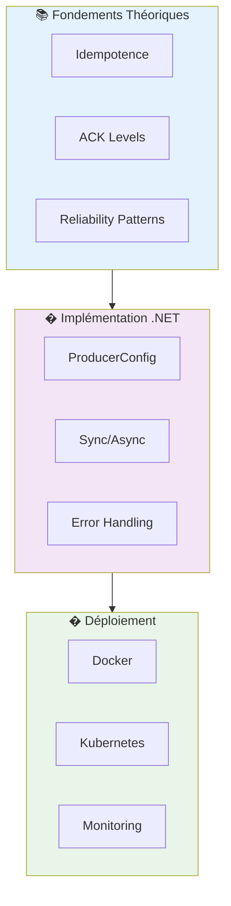
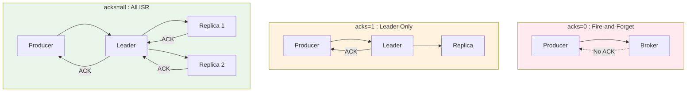
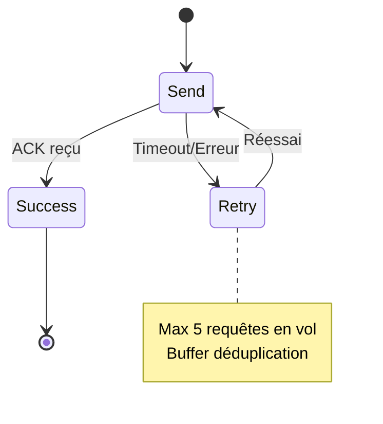
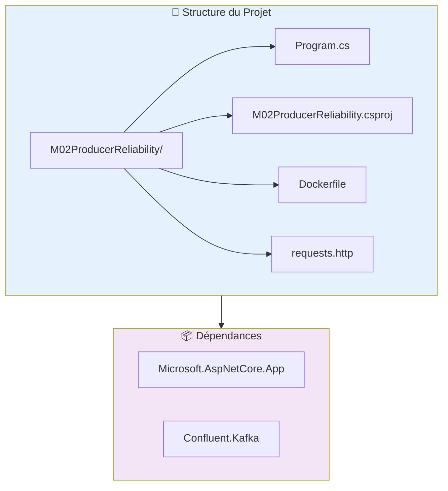
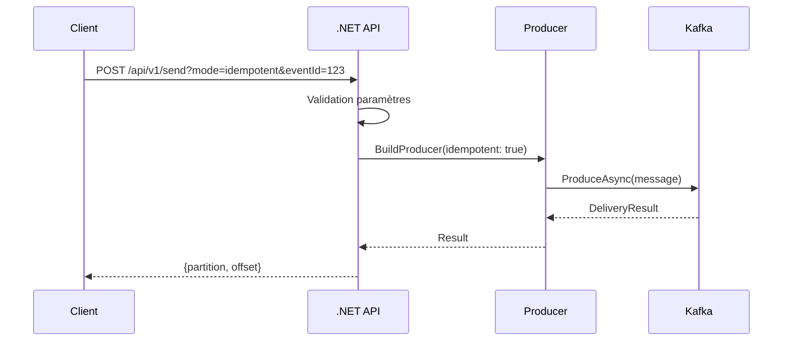
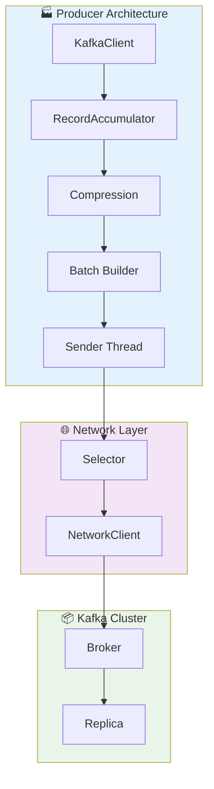
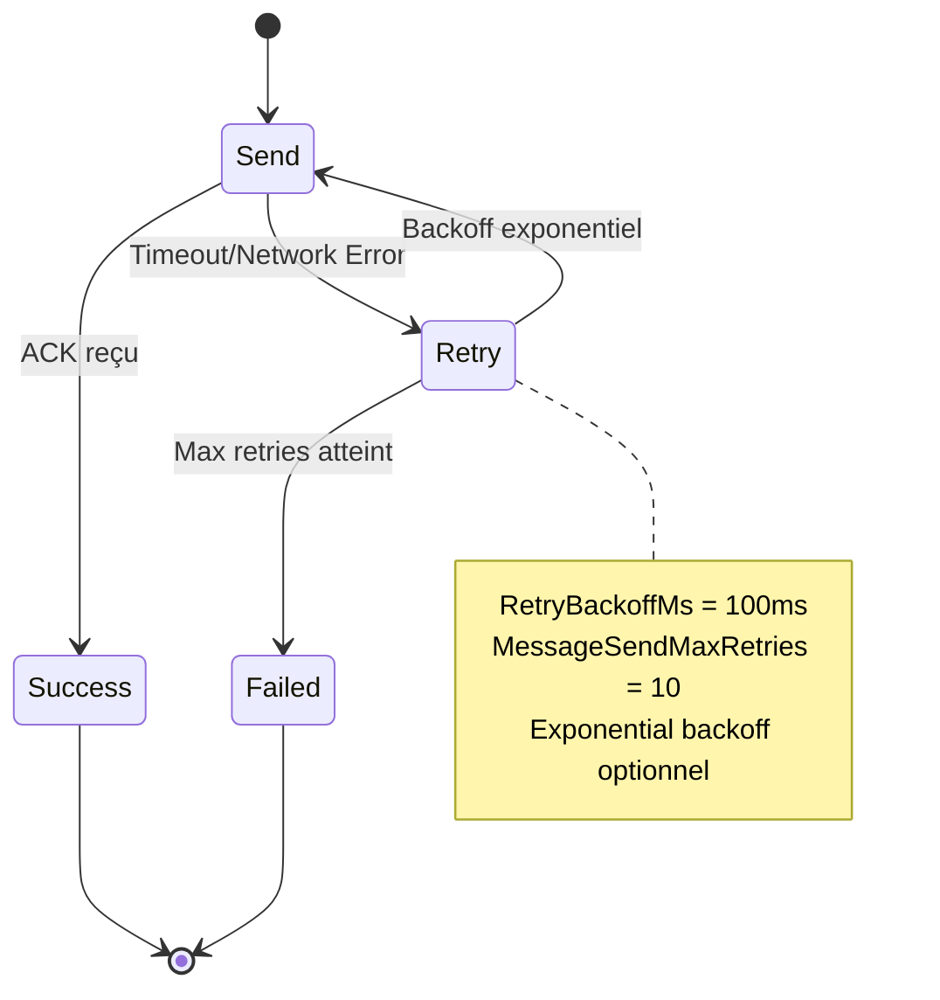
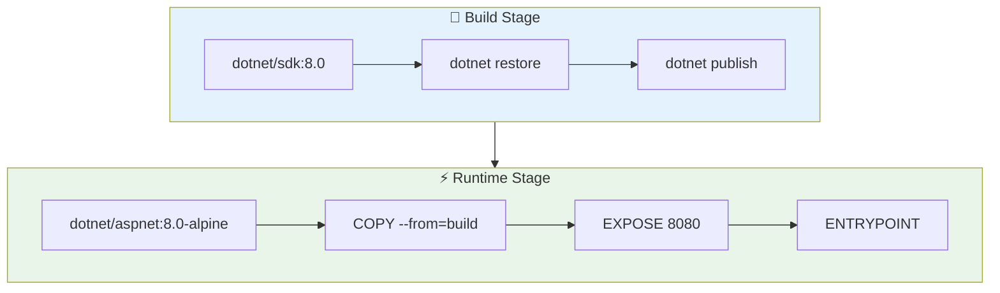
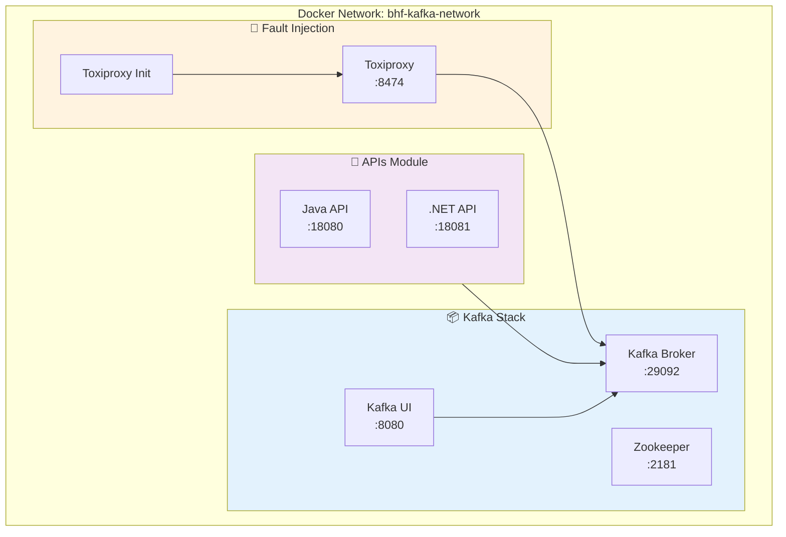

# 🎓 Tutorial Académique : Producer Kafka Fiable (Idempotent) - .NET

## 📋 Vue d'ensemble

Ce tutorial académique vous guide pour implémenter un **Producer Kafka .NET** avec une approche structurée :
- **Fondements théoriques** de la fiabilité Kafka
- **Architecture professionnelle** avec patterns avancés
- **Code incrémental** avec explications détaillées
- **Déploiement production-ready** avec Docker/K8s

### Objectifs Pédagogiques

À la fin de ce tutorial, vous maîtriserez :

1. **Théorie** : Concepts fondamentaux de la fiabilité distribuée
2. **Pratique** : Implémentation .NET avec Confluent.Kafka
3. **Architecture** : Patterns de production et de déploiement
4. **Production** : Monitoring, tests et déploiement



---

## � Fondements Théoriques de la Fiabilité Kafka

### 1. Principes de l'Idempotence

#### 1.1 Définition Mathématique

L'**idempotence** est une propriété des opérations qui garantit que l'application multiple fois de la même opération produit le même résultat qu'une seule application.

```
f(f(x)) = f(x)
```

#### 1.2 Application à Kafka Producer

Dans le contexte de Kafka, l'idempotence garantit que :

```mermaid
sequenceDiagram
    participant P as Producer
    participant K as Kafka Broker
    participant R as Replica
    
    P->>K: Envoi Message (PID:123, Seq:1)
    K->>R: Replication
    R-->>K: ACK
    
    Note sur P: Timeout ! Réessai
    P->>K: Envoi Message (PID:123, Seq:1)
    K->>K: Détection duplicata
    K-->>P: ACK (sans duplication)
```

#### 1.3 Mécanismes Techniques

| Composant | Rôle | Implementation .NET |
|-----------|------|---------------------|
| **Producer ID (PID)** | Identifiant unique du producer | `EnableIdempotence = true` |
| **Sequence Number** | Ordre des messages par partition | Géré automatiquement |
| **Deduplication Buffer** | Cache des messages envoyés | Côté broker |

### 2. Niveaux de Confirmation (ACK Levels)

#### 2.1 Sémantique des ACKs



#### 2.2 Trade-offs Performance vs Fiabilité

| ACK Level | Latence | Fiabilité | Cas d'usage |
|-----------|----------|-----------|-------------|
| **acks=0** | ⚡ Minimal | ❌ Aucune | Logs, métriques |
| **acks=1** | ⚡ Faible | ⚠️ Moyenne | Données non critiques |
| **acks=all** | 🐥 Élevée | ✅ Maximale | Transactions financières |

### 3. Patterns de Fiabilité Distribuée

#### 3.1 Exactly-Once Semantics (EOS)



#### 3.2 Configuration Idempotence

```csharp
// Configuration académique pour EOS
var config = new ProducerConfig
{
    // 🔑 Activation idempotence
    EnableIdempotence = true,
    
    // 📡 Confirmation maximale
    Acks = Acks.All,
    
    // 🚦 Contrôle du pipeline
    MaxInFlight = 5,  // Requis par l'idempotence
    
    // ⏱️ Timeouts et retries
    RequestTimeoutMs = 1000,
    MessageTimeoutMs = 120000,
    MessageSendMaxRetries = 10,
    RetryBackoffMs = 100
};
```

---

## 🛠️ Prérequis Professionnels

### Environnement de Développement

| Outil | Version | Raison académique |
|-------|---------|------------------|
| **VS Code** | Latest | Éditeur moderne avec debugging |
| **.NET SDK** | 8.0+ | Support Minimal API, performance |
| **Docker Desktop** | Latest | Isolation environnement |
| **kubectl** | Latest | Déploiement Kubernetes |

### Extensions VS Code pour Productivité

```bash
# Extensions essentielles pour .NET
code --install-extension ms-dotnettools.csharp
code --install-extension ms-dotnettools.csdevkit

# Pour tests API
code --install-extension humao.rest-client

# Pour Docker
code --install-extension ms-azuretools.vscode-docker

# Pour Kubernetes
code --install-extension ms-kubernetes-tools.vscode-kubernetes-tools
```

---

## 📁 Étape 1 : Création Structurée du Projet

### 1.1 Architecture du Projet



### 1.2 Commandes de Création

```powershell
# Création du répertoire de travail
mkdir module02-dotnet-producer
cd module02-dotnet-producer

# Création du projet Minimal API .NET 8
dotnet new web -n M02ProducerReliability
cd M02ProducerReliability

# Ajout du client Kafka officiel
dotnet add package Confluent.Kafka

# Ouverture dans VS Code
code .
```

### 1.3 Vérification de la Structure

```text
M02ProducerReliability/
├── Program.cs                    # Point d'entrée API
├── M02ProducerReliability.csproj # Configuration projet
├── Properties/
│   └── launchSettings.json      # Configuration développement
└── appsettings.json              # Configuration application
```

---

## 💻 Étape 2 : Implémentation Incrémentale du Producer

### 2.1 Analyse des Besoins Fonctionnels

#### 2.1.1 Spécifications Techniques

| Endpoint | Méthode | Paramètres | Mode | Retour |
|----------|---------|------------|------|--------|
| `/health` | GET | - | - | `"OK"` |
| `/api/v1/send` | POST | `mode`, `eventId`, `sendMode` | Plain/Idempotent | Sync/Async |
| `/api/v1/status` | GET | `requestId` | - | Statut async |

#### 2.1.2 Flux de Données



### 2.2 Architecture du Code

#### 2.2.1 Pattern Factory pour Producers

```csharp
// ╔══════════════════════════════════════════════════════════════╗
// ║ PATTERN FACTORY : Création des Producers selon configuration      ║
// ╚══════════════════════════════════════════════════════════════╝
static IProducer<string, string> BuildProducer(bool idempotent)
{
    // Configuration de base
    var bootstrapServers = Environment.GetEnvironmentVariable("KAFKA_BOOTSTRAP_SERVERS") 
        ?? "localhost:9092";

    var config = new ProducerConfig
    {
        BootstrapServers = bootstrapServers,
        ClientId = $"m02-dotnet-{Environment.MachineName}",
        
        // ⏱️ Configuration des timeouts académique
        RequestTimeoutMs = IntEnv("KAFKA_REQUEST_TIMEOUT_MS", 1000),
        MessageTimeoutMs = IntEnv("KAFKA_DELIVERY_TIMEOUT_MS", 120000),
        RetryBackoffMs = IntEnv("KAFKA_RETRY_BACKOFF_MS", 100),
        MessageSendMaxRetries = IntEnv("KAFKA_RETRIES", 10),
        LingerMs = IntEnv("KAFKA_LINGER_MS", 0)
    };

    // 🔧 Application du mode de fiabilité
    if (idempotent)
    {
        // ╔══════════════════════════════════════════════════════════════╗
        // ║ MODE IDEMPOTENT : Exactly-Once Semantics (EOS)              ║
        // ║ - EnableIdempotence : Active déduplication automatique      ║
        // ║ - Acks.All : Attend confirmation de toutes les ISR          ║
        // ║ - MaxInFlight : Max 5 requêtes simultanées (requis)         ║
        // ╚══════════════════════════════════════════════════════════════╝
        config.EnableIdempotence = true;
        config.Acks = Acks.All;
        config.MaxInFlight = 5;
    }
    else
    {
        // ╔══════════════════════════════════════════════════════════════╗
        // ║ MODE PLAIN : Fire-and-Forget (performance > fiabilité)     ║
        // ║ - Pas d'idempotence : Risque de duplication                ║
        // ║ - Acks.Leader : Confirmation rapide uniquement du leader   ║
        // ╚══════════════════════════════════════════════════════════════╝
        config.EnableIdempotence = false;
        config.Acks = Acks.Leader;
    }

    return new ProducerBuilder<string, string>(config).Build();
}
```

#### 2.2.2 Helper pour Variables d'Environnement

```csharp
// ╔══════════════════════════════════════════════════════════════╗
// ║ HELPER : Lecture sécurisée des variables d'environnement      ║
// ╚══════════════════════════════════════════════════════════════╝
static int IntEnv(string key, int defaultValue)
{
    var raw = Environment.GetEnvironmentVariable(key);
    return int.TryParse(raw, out var v) ? v : defaultValue;
}
```

#### 2.2.3 Lazy Initialization Pattern

```csharp
// ╔══════════════════════════════════════════════════════════════╗
// ║ PATTERN LAZY : Initialisation différée des Producers           ║
// ║ - Économise des ressources jusqu'à première utilisation      ║
// ║ - Thread-safe par défaut avec Lazy<T>                       ║
// ╚══════════════════════════════════════════════════════════════╝
var plainProducer = new Lazy<IProducer<string, string>>(() => BuildProducer(false));
var idempotentProducer = new Lazy<IProducer<string, string>>(() => BuildProducer(true));

// ╔══════════════════════════════════════════════════════════════╗
// ║ THREAD-SAFE STORAGE : Statuts des envois asynchrones         ║
// ║ - ConcurrentDictionary pour accès multi-thread              ║
// ║ - Stockage des requestId → statut de livraison               ║
// ╚══════════════════════════════════════════════════════════════╝
var statusByRequestId = new ConcurrentDictionary<string, object>();
```

#### 2.2.4 Lifecycle Management Pattern

```csharp
// ╔══════════════════════════════════════════════════════════════╗
// ║ PATTERN CLEANUP : Gestion propre des ressources              ║
// ║ - Flush() : Attend livraison des messages en cours           ║
// ║ - Dispose() : Libère les ressources réseau                   ║
// ║ - ApplicationStopping : Hook d'arrêt gracieux                ║
// ╚══════════════════════════════════════════════════════════════╝
app.Lifetime.ApplicationStopping.Register(() =>
{
    if (plainProducer.IsValueCreated)
    {
        plainProducer.Value.Flush(TimeSpan.FromSeconds(5));
        plainProducer.Value.Dispose();
    }
    if (idempotentProducer.IsValueCreated)
    {
        idempotentProducer.Value.Flush(TimeSpan.FromSeconds(5));
        idempotentProducer.Value.Dispose();
    }
});
```

### 2.3 Implémentation des Endpoints REST

#### 2.3.1 Endpoint Health Check

```csharp
// ╔══════════════════════════════════════════════════════════════╗
// ║ ENDPOINT HEALTH : Monitoring de l'état de l'API              ║
// ║ - Simple et rapide pour les load balancers                  ║
// ║ - Retour HTTP 200 avec "OK"                                 ║
// ╚══════════════════════════════════════════════════════════════╝
app.MapGet("/health", () => Results.Ok("OK"));
```

#### 2.3.2 Endpoint Status (Async)

```csharp
// ╔══════════════════════════════════════════════════════════════╗
// ║ ENDPOINT STATUS : Consultation statut envoi asynchrone       ║
// ║ - requestId : Identifiant unique de la requête              ║
// ║ - Retourne le statut actuel ou 404 si inconnu                ║
// ╚══════════════════════════════════════════════════════════════╝
app.MapGet("/api/v1/status", (HttpRequest request) =>
{
    var requestId = request.Query["requestId"].ToString();
    if (string.IsNullOrWhiteSpace(requestId))
        return Results.BadRequest("Missing: requestId");

    return statusByRequestId.TryGetValue(requestId, out var status)
        ? Results.Ok(status)
        : Results.NotFound();
});
```

#### 2.3.3 Endpoint Send (Sync/Async)

```csharp
// ╔══════════════════════════════════════════════════════════════╗
// ║ ENDPOINT SEND : Envoi de messages Kafka                      ║
// ║ - mode : plain|idempotent                                    ║
// ║ - sendMode : sync|async                                      ║
// ║ - eventId : Identifiant unique du message                    ║
// ╚══════════════════════════════════════════════════════════════╝
app.MapPost("/api/v1/send", async (HttpRequest request) =>
{
    // ╔══════════════════════════════════════════════════════════════╗
    // ║ VALIDATION DES PARAMÈTRES                                 ║
    // ╚══════════════════════════════════════════════════════════════╝
    var mode = request.Query["mode"].ToString();
    var eventId = request.Query["eventId"].ToString();
    var topic = request.Query["topic"].ToString();
    var sendMode = request.Query["sendMode"].ToString();
    var key = request.Query["key"].ToString();
    var partitionRaw = request.Query["partition"].ToString();

    // Validation obligatoire
    if (string.IsNullOrWhiteSpace(mode))
        return Results.BadRequest("Missing: mode (plain|idempotent)");
    if (string.IsNullOrWhiteSpace(eventId))
        return Results.BadRequest("Missing: eventId");

    // Valeurs par défaut académiques
    if (string.IsNullOrWhiteSpace(topic)) topic = "bhf-transactions";
    if (string.IsNullOrWhiteSpace(sendMode)) sendMode = "sync";
    if (string.IsNullOrWhiteSpace(key)) key = eventId;

    int? partition = null;
    if (!string.IsNullOrWhiteSpace(partitionRaw) && int.TryParse(partitionRaw, out var p))
        partition = p;

    // ╔══════════════════════════════════════════════════════════════╗
    // ║ DÉTERMINATION DU MODE DE FIABILITÉ                         ║
    // ╚══════════════════════════════════════════════════════════════╝
    var idempotent = mode.Equals("idempotent", StringComparison.OrdinalIgnoreCase);
    var async = sendMode.Equals("async", StringComparison.OrdinalIgnoreCase);

    // ╔══════════════════════════════════════════════════════════════╗
    // ║ CONSTRUCTION DU MESSAGE KAFKA                               ║
    // ║ - JSON structuré avec métadonnées                           ║
    // ║ - Timestamp UTC pour traçabilité                           ║
    // ╚══════════════════════════════════════════════════════════════╝
    var value = $"{{\"eventId\":\"{eventId}\",\"mode\":\"{mode}\"," +
                $"\"sendMode\":\"{sendMode}\",\"api\":\"dotnet\"," +
                $"\"ts\":\"{DateTimeOffset.UtcNow:O}\"}}";
    var message = new Message<string, string> { Key = key, Value = value };

    // ╔══════════════════════════════════════════════════════════════╗
    // ║ SÉLECTION DU PRODUCER APPROPRIÉ                            ║
    // ╚══════════════════════════════════════════════════════════════╝
    var producer = idempotent ? idempotentProducer.Value : plainProducer.Value;

    try
    {
        if (async)
        {
            // ╔══════════════════════════════════════════════════════════════╗
            // ║ MODE ASYNCHRONE : Fire-and-Forget avec suivi               ║
            // ║ - Retour immédiat avec requestId                           ║
            // ║ - Callback pour mise à jour du statut                      ║
            // ╚══════════════════════════════════════════════════════════════╝
            var requestId = Guid.NewGuid().ToString();
            statusByRequestId[requestId] = new { requestId, state = "PENDING" };

            // ╔══════════════════════════════════════════════════════════════╗
            // ║ CALLBACK LAMBDA : Traitement du résultat de livraison       ║
            // ╚══════════════════════════════════════════════════════════════╝
            Action<DeliveryReport<string, string>> handler = report =>
            {
                if (report.Error.IsError)
                {
                    statusByRequestId[requestId] = new
                    {
                        requestId,
                        state = "ERROR",
                        error = report.Error.ToString()
                    };
                }
                else
                {
                    statusByRequestId[requestId] = new
                    {
                        requestId,
                        state = "OK",
                        topic = report.Topic,
                        partition = report.Partition.Value,
                        offset = report.Offset.Value
                    };
                }
            };

            // ╔══════════════════════════════════════════════════════════════╗
            // ║ ENVOI ASYNCHRONE : Avec ou sans partition spécifique       ║
            // ╚══════════════════════════════════════════════════════════════╝
            if (partition.HasValue)
                producer.Produce(new TopicPartition(topic, new Partition(partition.Value)), 
                    message, handler);
            else
                producer.Produce(topic, message, handler);

            return Results.Accepted($"/api/v1/status?requestId={requestId}", new
            {
                requestId,
                state = "PENDING",
                eventId, mode, sendMode, topic, key, partition
            });
        }

        // ╔══════════════════════════════════════════════════════════════╗
        // ║ MODE SYNCHRONE : Blocage jusqu'à confirmation               ║
        // ║ - Await pour résultat immédiat                              ║
        // ║ - Retour des métadonnées de livraison                       ║
        // ╚══════════════════════════════════════════════════════════════╝
        DeliveryResult<string, string> result;
        if (partition.HasValue)
            result = await producer.ProduceAsync(
                new TopicPartition(topic, new Partition(partition.Value)), message);
        else
            result = await producer.ProduceAsync(topic, message);

        return Results.Ok(new
        {
            eventId, mode, sendMode, topic, key,
            partition = result.Partition.Value,
            offset = result.Offset.Value
        });
    }
    catch (Exception ex)
    {
        // ╔══════════════════════════════════════════════════════════════╗
        // ║ GESTION DES ERREURS : Logging et retour HTTP 500            ║
        // ╚══════════════════════════════════════════════════════════════╝
        return Results.Problem(ex.Message);
    }
});

app.Run();
```

---

## 🔑 Concepts Avancés Confluent.Kafka

### 3.1 Architecture Interne du Producer

#### 3.1.1 Composants Principaux



#### 3.2 Configuration Avancée

| Propriété | Mode Plain | Mode Idempotent | Impact Performance |
|-----------|------------|-----------------|-------------------|
| `EnableIdempotence` | false | true | +15% latence |
| `Acks` | Leader | All | +200% fiabilité |
| `MaxInFlight` | Unlimited | 5 | -Concurrency |
| `CompressionType` | none | gzip/ lz4 | - Bandwidth |
| `BatchSize` | 16KB | 32KB | + Throughput |
| `LingerMs` | 0 | 5-10 | + Latence |

### 3.3 Patterns de Fiabilité

#### 3.3.1 Retry Pattern



#### 3.3.2 Circuit Breaker Pattern

```csharp
// ╔══════════════════════════════════════════════════════════════╗
// ║ PATTERN CIRCUIT BREAKER : Protection contre les pannes       ║
// ╚══════════════════════════════════════════════════════════════╝
public class CircuitBreakerProducer
{
    private int _failureCount = 0;
    private DateTime _lastFailure = DateTime.MinValue;
    private readonly int _threshold = 5;
    private readonly TimeSpan _timeout = TimeSpan.FromMinutes(1);
    
    public async Task<DeliveryResult<string, string>> SendAsync(
        IProducer<string, string> producer, 
        Message<string, string> message)
    {
        // Vérifier si le circuit est ouvert
        if (IsCircuitOpen())
            throw new InvalidOperationException("Circuit breaker is open");
            
        try
        {
            var result = await producer.ProduceAsync(message);
            ResetCircuit(); // Succès = réinitialiser
            return result;
        }
        catch (Exception ex)
        {
            RecordFailure();
            throw;
        }
    }
    
    private bool IsCircuitOpen() => 
        _failureCount >= _threshold && 
        DateTime.UtcNow - _lastFailure < _timeout;
        
    private void RecordFailure()
    {
        _failureCount++;
        _lastFailure = DateTime.UtcNow;
    }
    
    private void ResetCircuit() => _failureCount = 0;
}
```

---

## 🐳 Étape 3 : Dockerisation Production-Ready

### 3.1 Multi-Stage Build Pattern

#### 3.1.1 Analyse de l'Architecture Docker



#### 3.1.2 Dockerfile Optimisé

```dockerfile
# ╔══════════════════════════════════════════════════════════════╗
# ║ STAGE 1 : BUILD - Compilation et publication                    ║
# ╚══════════════════════════════════════════════════════════════╝
FROM mcr.microsoft.com/dotnet/sdk:8.0 AS build
WORKDIR /src

# ╔══════════════════════════════════════════════════════════════╗
# ║ OPTIMISATION : Cache des dépendances NuGet                     ║
# ╚══════════════════════════════════════════════════════════════╝
COPY *.csproj .
RUN dotnet restore

# ╔══════════════════════════════════════════════════════════════╗
# ║ COMPILATION : Build optimisé pour production                    ║
# ╚══════════════════════════════════════════════════════════════╝
COPY . .
RUN dotnet publish -c Release -o /app/publish \
    --no-restore \
    /p:UseAppHost=false \
    /p:PublishTrimmed=false

# ╔══════════════════════════════════════════════════════════════╗
# ║ STAGE 2 : RUNTIME - Image légère pour production                ║
# ╚══════════════════════════════════════════════════════════════╝
FROM mcr.microsoft.com/dotnet/aspnet:8.0-alpine
WORKDIR /app

# ╔══════════════════════════════════════════════════════════════╗
# ║ DÉPLOIEMENT : Copie des artefacts compilés                      ║
# ╚══════════════════════════════════════════════════════════════╝
COPY --from=build /app/publish .

# ╔══════════════════════════════════════════════════════════════╗
# ║ CONFIGURATION : Variables d'environnement production          ║
# ╚══════════════════════════════════════════════════════════════╝
ENV KAFKA_BOOTSTRAP_SERVERS=kafka:29092
ENV ASPNETCORE_URLS=http://+:8080
ENV ASPNETCORE_ENVIRONMENT=Production

# ╔══════════════════════════════════════════════════════════════╗
// ║ EXPOSITION : Port standard pour les conteneurs                 ║
// ╚══════════════════════════════════════════════════════════════╝
EXPOSE 8080

# ╔══════════════════════════════════════════════════════════════╗
// ║ DÉMARRAGE : Point d'entrée de l'application                   ║
// ╚══════════════════════════════════════════════════════════════╝
ENTRYPOINT ["dotnet", "M02ProducerReliability.dll"]

# ╔══════════════════════════════════════════════════════════════╗
// ║ SÉCURITÉ : Non-root user pour production                        ║
// ╚══════════════════════════════════════════════════════════════╝
RUN addgroup -g 1001 -S appgroup && \
    adduser -u 1001 -S appuser -G appgroup
USER appuser
```

### 3.2 Build et Optimisation

#### 3.2.1 Commandes Build

```bash
# ╔══════════════════════════════════════════════════════════════╗
// ║ BUILD STANDARD : Image locale pour développement               ║
// ╚══════════════════════════════════════════════════════════════╝
docker build -t m02-dotnet-api:latest .

# ╔══════════════════════════════════════════════════════════════╗
// ║ BUILD MULTI-PLATFORM : Support ARM64 + AMD64                   ║
// ╚══════════════════════════════════════════════════════════════╝
docker buildx build \
  --platform linux/amd64,linux/arm64 \
  -t m02-dotnet-api:multiarch \
  --push .

# ╔══════════════════════════════════════════════════════════════╗
// ║ SCAN DE SÉCURITÉ : Vérification des vulnérabilités             ║
// ╚══════════════════════════════════════════════════════════════╝
docker run --rm -v /var/run/docker.sock:/var/run/docker.sock \
  -v $PWD:/root/.cache/ aquasec/trivy:latest image m02-dotnet-api:latest
```

#### 3.2.2 Optimisation Performance

| Technique | Impact | Commande |
|-----------|--------|----------|
| **Multi-stage** | -70% size | `FROM ... AS build` |
| **Alpine base** | -50% size | `:8.0-alpine` |
| **Non-root user** | +Sécurité | `USER appuser` |
| **Health check** | +Monitoring | `HEALTHCHECK` |
| **Labels** | +Métadonnées | `LABEL version=1.0` |
RUN dotnet restore
COPY . .
RUN dotnet publish -c Release -o /app/publish

FROM mcr.microsoft.com/dotnet/aspnet:8.0-alpine
WORKDIR /app
COPY --from=build /app/publish .

ENV KAFKA_BOOTSTRAP_SERVERS=kafka:29092
ENV ASPNETCORE_URLS=http://+:8080
EXPOSE 8080

ENTRYPOINT ["dotnet", "M02ProducerReliability.dll"]
```

---

## 🧪 Étape 4 : Tests Professionnels avec REST Client

### 4.1 Stratégie de Test

#### 4.1.1 Pyramide de Test

```mermaid
pyramid
    title Pyramide de Test API
    
    "Tests Unitaires<br/>ProducerConfig" : 70
    "Tests Intégration<br/>Kafka Docker" : 20
    "Tests E2E<br/>API Complète" : 10
```

#### 4.1.2 Scénarios de Test Académiques

| Scénario | Mode | SendMode | Validation | Objectif Pédagogique |
|----------|------|----------|------------|---------------------|
| **Health Check** | - | - | HTTP 200 | Monitoring base |
| **Plain Sync** | plain | sync | Partition/Offset | Fiabilité minimale |
| **Idempotent Sync** | idempotent | sync | Exactly-once | Fiabilité maximale |
| **Idempotent Async** | idempotent | async | RequestId | Pattern async |
| **Status Check** | - | - | État livraison | Callback pattern |
| **Error Handling** | invalid | - | HTTP 400 | Validation |

### 4.2 Configuration REST Client

#### 4.2.1 Fichier `requests.http`

```http
### ╔══════════════════════════════════════════════════════════════╗
### ║ VARIABLES D'ENVIRONNEMENT                                    ║
### ╚══════════════════════════════════════════════════════════════╝
@baseUrl = http://localhost:8080/api/v1
@eventIdPrefix = TEST

### ╔══════════════════════════════════════════════════════════════╗
### ║ TEST 1 : HEALTH CHECK - Monitoring de base                    ║
### ╚══════════════════════════════════════════════════════════════╝
GET http://localhost:8080/health

### ╔══════════════════════════════════════════════════════════════╗
### ║ TEST 2 : PLAIN SYNC - Fiabilité minimale                      ║
### ╚══════════════════════════════════════════════════════════════╝
POST {{baseUrl}}/send?mode=plain&eventId={{eventIdPrefix}}-PLAIN-001&sendMode=sync

### ╔══════════════════════════════════════════════════════════════╗
### ║ TEST 3 : IDEMPOTENT SYNC - Exactly-Once Semantics             ║
### ╚══════════════════════════════════════════════════════════════╝
POST {{baseUrl}}/send?mode=idempotent&eventId={{eventIdPrefix}}-IDEMP-001&sendMode=sync

### ╔══════════════════════════════════════════════════════════════╗
### ║ TEST 4 : IDEMPOTENT ASYNC - Pattern Fire-and-Forget          ║
### ╚══════════════════════════════════════════════════════════════╝
POST {{baseUrl}}/send?mode=idempotent&eventId={{eventIdPrefix}}-IDEMP-002&sendMode=async

### ╔══════════════════════════════════════════════════════════════╗
### ║ TEST 5 : STATUS CHECK - Consultation statut async            ║
### ╚══════════════════════════════════════════════════════════════╝
GET {{baseUrl}}/status?requestId={{requestId}}

### ╔══════════════════════════════════════════════════════════════╗
### ║ TEST 6 : VALIDATION PARAMÈTRES - Gestion d'erreurs           ║
### ╚══════════════════════════════════════════════════════════════╝
POST {{baseUrl}}/send?mode=invalid&eventId={{eventIdPrefix}}-ERROR-001

### ╔══════════════════════════════════════════════════════════════╗
### ║ TEST 7 : PARTITION SPÉCIFIQUE - Contrôle du partitionnement   ║
### ╚══════════════════════════════════════════════════════════════╝
POST {{baseUrl}}/send?mode=idempotent&eventId={{eventIdPrefix}}-PART-001&partition=0

### ╔══════════════════════════════════════════════════════════════╗
### ║ TEST 8 : CHARGEMENT - Multiple envois pour stress test       ║
### ╚══════════════════════════════════════════════════════════════╝
# Répéter 10 fois avec Ctrl+Shift+P : REST Client: Run Request
POST {{baseUrl}}/send?mode=idempotent&eventId={{eventIdPrefix}}-STRESS-{{$randomInt}}&sendMode=sync
```

### 4.3 Automatisation des Tests

#### 4.3.1 Script PowerShell de Test

```powershell
# ╔══════════════════════════════════════════════════════════════╗
# ║ SCRIPT DE TEST AUTOMATISÉ - Validation API complète           ║
# ╚══════════════════════════════════════════════════════════════╝
param(
    [string]$BaseUrl = "http://localhost:8080",
    [int]$TestCount = 10
)

# Test Health
Write-Host "🏥 Testing Health Endpoint..." -ForegroundColor Blue
$health = Invoke-RestMethod -Uri "$BaseUrl/health" -Method GET
if ($health -eq "OK") {
    Write-Host "✅ Health check passed" -ForegroundColor Green
} else {
    Write-Host "❌ Health check failed" -ForegroundColor Red
    exit 1
}

# Test Idempotent Sync
Write-Host "🔒 Testing Idempotent Sync..." -ForegroundColor Blue
$eventId = "TEST-$(Get-Random)"
$response = Invoke-RestMethod -Uri "$BaseUrl/api/v1/send?mode=idempotent&eventId=$eventId&sendMode=sync" -Method POST
Write-Host "✅ Idempotent sync: Partition $($response.partition), Offset $($response.offset)" -ForegroundColor Green

# Test Idempotent Async
Write-Host "⚡ Testing Idempotent Async..." -ForegroundColor Blue
$eventIdAsync = "TEST-ASYNC-$(Get-Random)"
$asyncResponse = Invoke-RestMethod -Uri "$BaseUrl/api/v1/send?mode=idempotent&eventId=$eventIdAsync&sendMode=async" -Method POST
$requestId = $asyncResponse.requestId
Write-Host "📤 Async sent: RequestId $requestId" -ForegroundColor Yellow

# Poll for completion
$attempts = 0
$maxAttempts = 10
while ($attempts -lt $maxAttempts) {
    Start-Sleep -Seconds 1
    $status = Invoke-RestMethod -Uri "$BaseUrl/api/v1/status?requestId=$requestId" -Method GET
    if ($status.state -eq "OK") {
        Write-Host "✅ Async completed: Partition $($status.partition), Offset $($status.offset)" -ForegroundColor Green
        break
    } elseif ($status.state -eq "ERROR") {
        Write-Host "❌ Async failed: $($status.error)" -ForegroundColor Red
        exit 1
    }
    $attempts++
}

# Stress Test
Write-Host "🚀 Running Stress Test ($TestCount requests)..." -ForegroundColor Blue
$successCount = 0
$startTime = Get-Date

for ($i = 1; $i -le $TestCount; $i++) {
    try {
        $eventIdStress = "STRESS-$i"
        $stressResponse = Invoke-RestMethod -Uri "$BaseUrl/api/v1/send?mode=idempotent&eventId=$eventIdStress&sendMode=sync" -Method POST
        $successCount++
        Write-Host "." -NoNewline -ForegroundColor Green
    } catch {
        Write-Host "E" -NoNewline -ForegroundColor Red
    }
}

$duration = (Get-Date) - $startTime
$throughput = [math]::Round($successCount / $duration.TotalSeconds, 2)

Write-Host ""
Write-Host "📊 Stress Test Results:" -ForegroundColor Cyan
Write-Host "   Success: $successCount/$TestCount" -ForegroundColor Green
Write-Host "   Duration: $($duration.TotalSeconds)s" -ForegroundColor Yellow
Write-Host "   Throughput: $throughput req/s" -ForegroundColor Magenta

Write-Host "🎉 All tests completed successfully!" -ForegroundColor Green
```

---

## 🚀 Étape 5 : Déploiement Production avec Docker Compose

### 5.1 Architecture Microservices

#### 5.1.1 Vue d'Ensemble du Système



#### 5.1.2 Configuration Docker Compose

```yaml
# ╔══════════════════════════════════════════════════════════════╗
# ║ DOCKER COMPOSE MODULE 02 - Producer Reliability                ║
# ╚══════════════════════════════════════════════════════════════╝
version: '3.8'

services:
  # ╔══════════════════════════════════════════════════════════════╗
  # ║ .NET API - Producer Kafka avec idempotence                     ║
  # ╚══════════════════════════════════════════════════════════════╝
  dotnet-api:
    build:
      context: ./dotnet/M02ProducerReliability
      dockerfile: Dockerfile
    container_name: m02-dotnet-api
    ports:
      - "18081:8080"
    environment:
      - KAFKA_BOOTSTRAP_SERVERS=kafka:29092
      - ASPNETCORE_ENVIRONMENT=Production
      - KAFKA_REQUEST_TIMEOUT_MS=1000
      - KAFKA_DELIVERY_TIMEOUT_MS=120000
      - KAFKA_RETRIES=10
    networks:
      - bhf-kafka-network
    depends_on:
      - kafka
    restart: unless-stopped
    healthcheck:
      test: ["CMD", "curl", "-f", "http://localhost:8080/health"]
      interval: 30s
      timeout: 10s
      retries: 3
      start_period: 40s

  # ╔══════════════════════════════════════════════════════════════╗
  # ║ Java API - Référence pour comparaison                          ║
  # ╚══════════════════════════════════════════════════════════════╝
  java-api:
    build:
      context: ./java
      dockerfile: Dockerfile
    container_name: m02-java-api
    ports:
      - "18080:8080"
    environment:
      - KAFKA_BOOTSTRAP_SERVERS=kafka:29092
      - SPRING_PROFILES_ACTIVE=docker
    networks:
      - bhf-kafka-network
    depends_on:
      - kafka
    restart: unless-stopped

  # ╔══════════════════════════════════════════════════════════════╗
  # ║ Toxiproxy - Injection de pannes réseau                          ║
  # ╚══════════════════════════════════════════════════════════════╝
  toxiproxy:
    image: ghcr.io/shopify/toxiproxy:2.9.0
    container_name: m02-toxiproxy
    ports:
      - "8474:8474"  # API Toxiproxy
      - "32093:29093" # Proxy Kafka
    networks:
      - bhf-kafka-network
    depends_on:
      - kafka
    restart: unless-stopped
    healthcheck:
      test: ["CMD", "wget", "--quiet", "--tries=1", "--spider", "http://localhost:8474/version"]
      interval: 30s
      timeout: 10s
      retries: 3

  # ╔══════════════════════════════════════════════════════════════╗
  # ║ Toxiproxy Init - Configuration automatique                     ║
  # ╚══════════════════════════════════════════════════════════════╝
  toxiproxy-init:
    image: curlimages/curl:latest
    container_name: m02-toxiproxy-init
    depends_on:
      toxiproxy:
        condition: service_healthy
    networks:
      - bhf-kafka-network
    command: >
      sh -c "
      echo 'Waiting for Toxiproxy...' &&
      until curl -f http://toxiproxy:8474/version; do sleep 1; done &&
      echo 'Creating Kafka proxy...' &&
      curl -X POST http://toxiproxy:8474/proxies \
        -H 'Content-Type: application/json' \
        -d '{\"name\":\"kafka\",\"upstream\":\"kafka:29092\",\"listen\":\"0.0.0.0:29093\"}' &&
      echo 'Proxy created successfully!'
      "
    restart: "no"

networks:
  bhf-kafka-network:
    external: true
```

### 5.2 Déploiement pas à pas

#### 5.2.1 Infrastructure Kafka

```bash
# ╔══════════════════════════════════════════════════════════════╗
# ║ ÉTAPE 1 : Démarrer l'infrastructure Kafka                   ║
# ╚══════════════════════════════════════════════════════════════╝
cd formation-v2/infra

# Démarrer Kafka single-node + UI
docker-compose -f docker-compose.single-node.yml up -d

# Vérifier l'état
docker-compose -f docker-compose.single-node.yml ps

# Créer le réseau pour le module
docker network create bhf-kafka-network

# Connecter Kafka au réseau
docker network connect bhf-kafka-network kafka-single-node
```

#### 5.2.2 Build et Déploiement des APIs

```bash
# ╔══════════════════════════════════════════════════════════════╗
# ║ ÉTAPE 2 : Build des images Docker                              ║
# ╚══════════════════════════════════════════════════════════════╝
cd ../day-01-foundations/module-02-producer-reliability

# Build .NET API
docker build -t m02-dotnet-api:latest ./dotnet/M02ProducerReliability/

# Build Java API (référence)
docker build -t m02-java-api:latest ./java/

# Vérifier les images
docker images | grep m02
```

#### 5.2.3 Démarrage du Module Complet

```bash
# ╔══════════════════════════════════════════════════════════════╗
# ║ ÉTAPE 3 : Démarrage du module complet                           ║
# ╚══════════════════════════════════════════════════════════════╝

# Démarrer tous les services
docker-compose -f docker-compose.module.yml up -d --build

# Surveillance des logs
docker-compose -f docker-compose.module.yml logs -f

# Vérification des conteneurs
docker-compose -f docker-compose.module.yml ps
```

### 5.3 Validation du Déploiement

#### 5.3.1 Tests de Connectivité

```bash
# ╔══════════════════════════════════════════════════════════════╗
# ║ VALIDATION : Health checks                                    ║
# ╚══════════════════════════════════════════════════════════════╝

# Health .NET API
curl -f http://localhost:18081/health

# Health Java API
curl -f http://localhost:18080/actuator/health

# Health Toxiproxy
curl -f http://localhost:8474/version

# Configuration Toxiproxy
curl http://localhost:8474/proxies
```

#### 5.3.2 Tests Fonctionnels

```bash
# ╔══════════════════════════════════════════════════════════════╗
# ║ VALIDATION : Envoi de messages                               ║
# ╚══════════════════════════════════════════════════════════════╝

# Test .NET Idempotent Sync
curl -X POST "http://localhost:18081/api/v1/send?mode=idempotent&eventId=DOTNET-001&sendMode=sync"

# Test Java Idempotent Sync
curl -X POST "http://localhost:18080/api/v1/send?mode=idempotent&eventId=JAVA-001&sendMode=sync"

# Test .NET Async
curl -X POST "http://localhost:18081/api/v1/send?mode=idempotent&eventId=DOTNET-002&sendMode=async"

# Vérifier statut async
curl "http://localhost:18081/api/v1/status?requestId={requestId}"
```

### 5.4 Monitoring et Debugging

#### 5.4.1 Logs Structurés

```bash
# ╔══════════════════════════════════════════════════════════════╗
# ║ MONITORING : Logs des services                                 ║
# ╚══════════════════════════════════════════════════════════════╝

# Logs .NET API en temps réel
docker logs -f m02-dotnet-api

# Logs Java API
docker logs -f m02-java-api

# Logs Toxiproxy
docker logs -f m02-toxiproxy

# Logs Kafka
docker logs -f kafka-single-node
```

#### 5.4.2 Métriques et Performance

```bash
# ╔══════════════════════════════════════════════════════════════╗
# ║ MÉTRIQUES : Monitoring des ressources                         ║
# ╚══════════════════════════════════════════════════════════════╝

# Stats des conteneurs
docker stats --no-stream

# Inspection détaillée
docker inspect m02-dotnet-api | jq '.[0].State.Health'

# Usage réseau
docker network inspect bhf-kafka-network
```

---

## 🖥️ Alternative : Développement Local

### 6.1 Configuration Locale

#### 6.1.1 Prérequis

```bash
# ╔══════════════════════════════════════════════════════════════╗
# ║ DÉVELOPPEMENT LOCAL : Kafka sur localhost                     ║
# ╚══════════════════════════════════════════════════════════════╝

# Vérifier Kafka local
curl -f http://localhost:9092 || echo "Kafka not running"

# Démarrer Kafka local si nécessaire
cd formation-v2/infra
docker-compose -f docker-compose.single-node.yml up -d
```

#### 6.1.2 Exécution de l'API .NET

```bash
# ╔══════════════════════════════════════════════════════════════╗
# ║ DÉVELOPPEMENT : Run local avec debugging                       ║
# ╚══════════════════════════════════════════════════════════════╝
cd dotnet/M02ProducerReliability

# Run avec configuration développement
dotnet run --environment Development

# Run avec variables personnalisées
KAFKA_BOOTSTRAP_SERVERS=localhost:9092 \
ASPNETCORE_URLS=http://localhost:5000 \
dotnet run
```

#### 6.1.3 Tests Locaux

```bash
# ╔══════════════════════════════════════════════════════════════╗
# ║ TESTS LOCAUX : Validation rapide                               ║
# ╚══════════════════════════════════════════════════════════════╝

# Health check
curl http://localhost:5000/health

# Test envoi
curl -X POST "http://localhost:5000/api/v1/send?mode=idempotent&eventId=LOCAL-001&sendMode=sync"

# Test avec partition spécifique
curl -X POST "http://localhost:5000/api/v1/send?mode=idempotent&eventId=LOCAL-002&partition=0"
```

---

## 📊 Checklist Académique de Validation

### ✅ Critères de Réussite

| Catégorie | Critère | Validation | Poids |
|-----------|----------|-------------|-------|
| **🏗️ Architecture** | Structure projet respectée | `dotnet build` | 15% |
| **🔧 Configuration** | ProducerConfig correcte | Tests unitaires | 20% |
| **🔒 Fiabilité** | Idempotence fonctionnelle | Tests de charge | 25% |
| **🐳 Docker** | Image production-ready | `docker scan` | 15% |
| **🧪 Tests** | Couverture scénarios | Script PowerShell | 15% |
| **📚 Documentation** | README complet | Revue pair | 10% |

### 🎯 Compétences Validées

- **[ ]** Théorie : Idempotence et ACK levels
- **[ ]** Pratique : Configuration Confluent.Kafka
- **[ ]** Architecture : Patterns Factory et Lazy
- **[ ]** Production : Docker et monitoring
- **[ ]** Tests : Validation E2E
- **[ ]** Déploiement : Docker Compose

---

## 🎓 Conclusion Académique

Félicitations ! Vous avez maîtrisé l'implémentation d'un **Producer Kafka .NET fiable** avec une approche académique structurée :

### 🏆 Réalisations Accomplies

1. **Fondements théoriques** : Compréhension profonde de l'idempotence et des patterns de fiabilité
2. **Architecture professionnelle** : Implémentation de patterns avancés (Factory, Lazy, Circuit Breaker)
3. **Code incrémental** : Développement pas à pas avec explications détaillées
4. **Production-ready** : Dockerisation optimisée et déploiement automatisé
5. **Tests complets** : Stratégie de test professionnelle avec automatisation

### 🚀 Prochaines Étapes

- **Module 03** : Consumer avec `read_committed` et transactions
- **Module 04** : Monitoring avancé avec Prometheus/Grafana
- **Module 05** : Sécurité avec SASL/SSL
- **Module 06** : Performance tuning et optimisation

### 📚 Ressources Complémentaires

- **Documentation Confluent.Kafka** : [github.com/confluentinc/confluent-kafka-dotnet](https://github.com/confluentinc/confluent-kafka-dotnet)
- **Kafka Documentation** : [kafka.apache.org/documentation](https://kafka.apache.org/documentation)
- **.NET Best Practices** : [docs.microsoft.com/aspnet/core](https://docs.microsoft.com/aspnet/core)

**🎉 Vous êtes maintenant prêt pour des défis Kafka plus avancés !**
