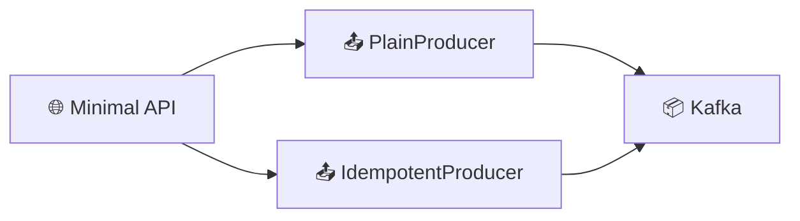

# 🛠️ Tutorial VS Code : Producer Kafka Fiable (Idempotent) - .NET

## 📋 Vue d'ensemble

Ce tutorial vous guide pour implémenter un **Producer Kafka .NET** avec :
- **Mode Plain** vs **Mode Idempotent**
- **Envoi synchrone** vs **asynchrone**
- **Confluent.Kafka** client officiel



---

## 🎯 Prérequis

| Outil | Version | Installation |
|-------|---------|--------------|
| **VS Code** | Latest | [code.visualstudio.com](https://code.visualstudio.com) |
| **.NET SDK** | 8.0+ | `winget install Microsoft.DotNet.SDK.8` |
| **Docker** | Latest | Pour Kafka |

### Extensions VS Code

```bash
code --install-extension ms-dotnettools.csharp
code --install-extension ms-dotnettools.csdevkit
code --install-extension humao.rest-client
```

---

## 📁 Étape 1 : Créer le projet

```powershell
mkdir module02-dotnet-producer
cd module02-dotnet-producer
dotnet new web -n M02ProducerReliability
cd M02ProducerReliability
dotnet add package Confluent.Kafka
code .
```

---

## 💻 Étape 2 : Program.cs complet

```csharp
using Confluent.Kafka;
using System.Collections.Concurrent;

var builder = WebApplication.CreateBuilder(args);
var app = builder.Build();

// ═══════════════════════════════════════════════════════════════
// HELPER : Lire les variables d'environnement
// ═══════════════════════════════════════════════════════════════
static int IntEnv(string key, int defaultValue)
{
    var raw = Environment.GetEnvironmentVariable(key);
    return int.TryParse(raw, out var v) ? v : defaultValue;
}

// ═══════════════════════════════════════════════════════════════
// FACTORY : Créer un Producer selon le mode
// ═══════════════════════════════════════════════════════════════
static IProducer<string, string> BuildProducer(bool idempotent)
{
    var bootstrapServers = Environment.GetEnvironmentVariable("KAFKA_BOOTSTRAP_SERVERS") 
        ?? "localhost:9092";

    var config = new ProducerConfig
    {
        BootstrapServers = bootstrapServers,
        ClientId = $"m02-dotnet-{Environment.MachineName}",
        
        // Timeouts configurables
        RequestTimeoutMs = IntEnv("KAFKA_REQUEST_TIMEOUT_MS", 1000),
        MessageTimeoutMs = IntEnv("KAFKA_DELIVERY_TIMEOUT_MS", 120000),
        RetryBackoffMs = IntEnv("KAFKA_RETRY_BACKOFF_MS", 100),
        MessageSendMaxRetries = IntEnv("KAFKA_RETRIES", 10),
        LingerMs = IntEnv("KAFKA_LINGER_MS", 0)
    };

    if (idempotent)
    {
        // ═══════════════════════════════════════════════════════
        // MODE IDEMPOTENT
        // - EnableIdempotence : Active la déduplication
        // - Acks.All : Attend confirmation de toutes les ISR
        // - MaxInFlight : Max 5 requêtes en vol (requis)
        // ═══════════════════════════════════════════════════════
        config.EnableIdempotence = true;
        config.Acks = Acks.All;
        config.MaxInFlight = 5;
    }
    else
    {
        // ═══════════════════════════════════════════════════════
        // MODE PLAIN
        // - Pas d'idempotence
        // - Acks.Leader seulement
        // ═══════════════════════════════════════════════════════
        config.EnableIdempotence = false;
        config.Acks = Acks.Leader;
    }

    return new ProducerBuilder<string, string>(config).Build();
}

// ═══════════════════════════════════════════════════════════════
// PRODUCERS (Lazy initialization)
// ═══════════════════════════════════════════════════════════════
var plainProducer = new Lazy<IProducer<string, string>>(() => BuildProducer(false));
var idempotentProducer = new Lazy<IProducer<string, string>>(() => BuildProducer(true));

// Stockage des statuts async
var statusByRequestId = new ConcurrentDictionary<string, object>();

// ═══════════════════════════════════════════════════════════════
// CLEANUP à l'arrêt
// ═══════════════════════════════════════════════════════════════
app.Lifetime.ApplicationStopping.Register(() =>
{
    if (plainProducer.IsValueCreated)
    {
        plainProducer.Value.Flush(TimeSpan.FromSeconds(5));
        plainProducer.Value.Dispose();
    }
    if (idempotentProducer.IsValueCreated)
    {
        idempotentProducer.Value.Flush(TimeSpan.FromSeconds(5));
        idempotentProducer.Value.Dispose();
    }
});

// ═══════════════════════════════════════════════════════════════
// ENDPOINTS
// ═══════════════════════════════════════════════════════════════

app.MapGet("/health", () => Results.Ok("OK"));

// Statut d'un envoi async
app.MapGet("/api/v1/status", (HttpRequest request) =>
{
    var requestId = request.Query["requestId"].ToString();
    if (string.IsNullOrWhiteSpace(requestId))
        return Results.BadRequest("Missing: requestId");

    return statusByRequestId.TryGetValue(requestId, out var status)
        ? Results.Ok(status)
        : Results.NotFound();
});

// Envoi de message
app.MapPost("/api/v1/send", async (HttpRequest request) =>
{
    // Paramètres
    var mode = request.Query["mode"].ToString();
    var eventId = request.Query["eventId"].ToString();
    var topic = request.Query["topic"].ToString();
    var sendMode = request.Query["sendMode"].ToString();
    var key = request.Query["key"].ToString();
    var partitionRaw = request.Query["partition"].ToString();

    // Validation
    if (string.IsNullOrWhiteSpace(mode))
        return Results.BadRequest("Missing: mode (plain|idempotent)");
    if (string.IsNullOrWhiteSpace(eventId))
        return Results.BadRequest("Missing: eventId");

    // Defaults
    if (string.IsNullOrWhiteSpace(topic)) topic = "bhf-transactions";
    if (string.IsNullOrWhiteSpace(sendMode)) sendMode = "sync";
    if (string.IsNullOrWhiteSpace(key)) key = eventId;

    int? partition = null;
    if (!string.IsNullOrWhiteSpace(partitionRaw) && int.TryParse(partitionRaw, out var p))
        partition = p;

    var idempotent = mode.Equals("idempotent", StringComparison.OrdinalIgnoreCase);
    var async = sendMode.Equals("async", StringComparison.OrdinalIgnoreCase);

    // Créer le message
    var value = $"{{\"eventId\":\"{eventId}\",\"mode\":\"{mode}\"," +
                $"\"sendMode\":\"{sendMode}\",\"api\":\"dotnet\"," +
                $"\"ts\":\"{DateTimeOffset.UtcNow:O}\"}}";
    var message = new Message<string, string> { Key = key, Value = value };

    var producer = idempotent ? idempotentProducer.Value : plainProducer.Value;

    try
    {
        if (async)
        {
            // ═══════════════════════════════════════════════════
            // ENVOI ASYNCHRONE
            // Retourne immédiatement avec un requestId
            // ═══════════════════════════════════════════════════
            var requestId = Guid.NewGuid().ToString();
            statusByRequestId[requestId] = new { requestId, state = "PENDING" };

            Action<DeliveryReport<string, string>> handler = report =>
            {
                if (report.Error.IsError)
                {
                    statusByRequestId[requestId] = new
                    {
                        requestId,
                        state = "ERROR",
                        error = report.Error.ToString()
                    };
                }
                else
                {
                    statusByRequestId[requestId] = new
                    {
                        requestId,
                        state = "OK",
                        topic = report.Topic,
                        partition = report.Partition.Value,
                        offset = report.Offset.Value
                    };
                }
            };

            if (partition.HasValue)
                producer.Produce(new TopicPartition(topic, new Partition(partition.Value)), 
                    message, handler);
            else
                producer.Produce(topic, message, handler);

            return Results.Accepted($"/api/v1/status?requestId={requestId}", new
            {
                requestId,
                state = "PENDING",
                eventId, mode, sendMode, topic, key, partition
            });
        }

        // ═══════════════════════════════════════════════════════
        // ENVOI SYNCHRONE
        // Bloque jusqu'à confirmation
        // ═══════════════════════════════════════════════════════
        DeliveryResult<string, string> result;
        if (partition.HasValue)
            result = await producer.ProduceAsync(
                new TopicPartition(topic, new Partition(partition.Value)), message);
        else
            result = await producer.ProduceAsync(topic, message);

        return Results.Ok(new
        {
            eventId, mode, sendMode, topic, key,
            partition = result.Partition.Value,
            offset = result.Offset.Value
        });
    }
    catch (Exception ex)
    {
        return Results.Problem(ex.Message);
    }
});

app.Run();
```

---

## 🔑 Concepts Confluent.Kafka

### ProducerConfig clés

| Propriété | Mode Plain | Mode Idempotent |
|-----------|------------|-----------------|
| `EnableIdempotence` | false | true |
| `Acks` | Leader | All |
| `MaxInFlight` | N/A | 5 |

### Méthodes d'envoi

| Méthode | Type | Retour |
|---------|------|--------|
| `ProduceAsync()` | Synchrone | `Task<DeliveryResult>` |
| `Produce()` | Asynchrone | Callback |

---

## 🐳 Étape 3 : Dockerfile

```dockerfile
FROM mcr.microsoft.com/dotnet/sdk:8.0 AS build
WORKDIR /src
COPY *.csproj .
RUN dotnet restore
COPY . .
RUN dotnet publish -c Release -o /app/publish

FROM mcr.microsoft.com/dotnet/aspnet:8.0-alpine
WORKDIR /app
COPY --from=build /app/publish .

ENV KAFKA_BOOTSTRAP_SERVERS=kafka:29092
ENV ASPNETCORE_URLS=http://+:8080
EXPOSE 8080

ENTRYPOINT ["dotnet", "M02ProducerReliability.dll"]
```

---

## 🧪 Étape 4 : Tests avec REST Client

### Créer `requests.http`

```http
### Variables
@baseUrl = http://localhost:5000/api/v1

### HEALTH
GET http://localhost:5000/health

### ENVOI PLAIN SYNC
POST {{baseUrl}}/send?mode=plain&eventId=EVT-001&sendMode=sync

### ENVOI IDEMPOTENT SYNC ✅
POST {{baseUrl}}/send?mode=idempotent&eventId=EVT-002&sendMode=sync

### ENVOI IDEMPOTENT ASYNC
POST {{baseUrl}}/send?mode=idempotent&eventId=EVT-003&sendMode=async

### VÉRIFIER STATUT
GET {{baseUrl}}/status?requestId={requestId}
```

---

## 🚀 Étape 5 : Exécution

```powershell
# Démarrer Kafka
docker-compose up -d kafka zookeeper

# Lancer l'application
dotnet run

# Tester
curl -X POST "http://localhost:5000/api/v1/send?mode=idempotent&eventId=TEST-1"
```

---

## ✅ Checklist

- [ ] Projet .NET créé avec Confluent.Kafka
- [ ] Mode plain et idempotent configurés
- [ ] Envoi sync fonctionne
- [ ] Envoi async retourne requestId
- [ ] Statut async consultable

---

**🎉 Félicitations !** Vous maîtrisez le Producer Kafka .NET avec idempotence !
