# 🛠️ Tutorial VS Code : Producer Kafka Fiable (Idempotent) - Java

## 📋 Vue d'ensemble

Ce tutorial vous guide pour implémenter un **Producer Kafka** avec :
- **Mode Plain** vs **Mode Idempotent**
- **Envoi synchrone** vs **asynchrone**
- **Retries** et gestion des timeouts
- **Configuration de fiabilité** (acks, retries, idempotence)

```mermaid
flowchart LR
    API["🌐 REST API"] --> SVC["⚙️ ProducerService"]
    SVC -->|plain| PP["📤 PlainProducer"]
    SVC -->|idempotent| IP["📤 IdempotentProducer"]
    PP --> K["📦 Kafka"]
    IP --> K
```



---

## 🎯 Prérequis

| Outil | Version | Installation |
|-------|---------|--------------|
| **VS Code** | Latest | [code.visualstudio.com](https://code.visualstudio.com) |
| **Java JDK** | 17+ | `winget install Microsoft.OpenJDK.17` |
| **Maven** | 3.8+ | `winget install Apache.Maven` |
| **Docker** | Latest | Pour Kafka |

### Extensions VS Code

```bash
code --install-extension vscjava.vscode-java-pack
code --install-extension vmware.vscode-boot-dev-pack
code --install-extension humao.rest-client
```

---

## 📁 Étape 1 : Structure du projet

```
module02-producer-reliability/
├── pom.xml
├── Dockerfile
├── src/main/java/com/bhf/m02/
│   ├── M02ProducerReliabilityApplication.java
│   ├── api/
│   │   ├── ProducerController.java
│   │   └── HealthController.java
│   └── kafka/
│       └── ProducerService.java
└── requests.http
```

---

## 📝 Étape 2 : Configuration Maven (pom.xml)

```xml
<project xmlns="http://maven.apache.org/POM/4.0.0">
  <modelVersion>4.0.0</modelVersion>

  <groupId>com.bhf</groupId>
  <artifactId>m02-producer-reliability</artifactId>
  <version>0.0.1-SNAPSHOT</version>

  <parent>
    <groupId>org.springframework.boot</groupId>
    <artifactId>spring-boot-starter-parent</artifactId>
    <version>3.2.2</version>
  </parent>

  <properties>
    <java.version>17</java.version>
  </properties>

  <dependencies>
    <!-- Spring Boot Web -->
    <dependency>
      <groupId>org.springframework.boot</groupId>
      <artifactId>spring-boot-starter-web</artifactId>
    </dependency>

    <!-- Jakarta Annotations -->
    <dependency>
      <groupId>jakarta.annotation</groupId>
      <artifactId>jakarta.annotation-api</artifactId>
    </dependency>

    <!-- Kafka Client (sans Spring Kafka) -->
    <dependency>
      <groupId>org.apache.kafka</groupId>
      <artifactId>kafka-clients</artifactId>
      <version>3.6.1</version>
    </dependency>
  </dependencies>

  <build>
    <plugins>
      <plugin>
        <groupId>org.springframework.boot</groupId>
        <artifactId>spring-boot-maven-plugin</artifactId>
      </plugin>
    </plugins>
  </build>
</project>
```

---

## ☕ Étape 3 : Application principale

### 3.1 Créer `M02ProducerReliabilityApplication.java`

```java
package com.bhf.m02;

import org.springframework.boot.SpringApplication;
import org.springframework.boot.autoconfigure.SpringBootApplication;

@SpringBootApplication
public class M02ProducerReliabilityApplication {
    public static void main(String[] args) {
        SpringApplication.run(M02ProducerReliabilityApplication.class, args);
    }
}
```

---

## ⚙️ Étape 4 : Service Producer

### 4.1 Créer `kafka/ProducerService.java`

```java
package com.bhf.m02.kafka;

import jakarta.annotation.PreDestroy;
import org.apache.kafka.clients.producer.KafkaProducer;
import org.apache.kafka.clients.producer.ProducerConfig;
import org.apache.kafka.clients.producer.ProducerRecord;
import org.apache.kafka.clients.producer.RecordMetadata;
import org.apache.kafka.common.serialization.StringSerializer;
import org.springframework.stereotype.Service;

import java.util.HashMap;
import java.util.Map;
import java.util.Properties;
import java.util.UUID;
import java.util.concurrent.ConcurrentHashMap;

/**
 * Service Producer avec deux modes :
 * - Plain : Sans idempotence (risque de doublons)
 * - Idempotent : Avec idempotence (exactly-once dans partition)
 */
@Service
public class ProducerService {

    private final KafkaProducer<String, String> plainProducer;
    private final KafkaProducer<String, String> idempotentProducer;

    // Stockage des statuts pour envois asynchrones
    private final ConcurrentHashMap<String, Map<String, Object>> statusByRequestId = 
        new ConcurrentHashMap<>();

    public ProducerService() {
        String bootstrapServers = System.getenv()
            .getOrDefault("KAFKA_BOOTSTRAP_SERVERS", "localhost:9092");

        // ═══════════════════════════════════════════════════════════
        // CONFIGURATION DE BASE
        // ═══════════════════════════════════════════════════════════
        Properties baseProps = new Properties();
        baseProps.put(ProducerConfig.BOOTSTRAP_SERVERS_CONFIG, bootstrapServers);
        baseProps.put(ProducerConfig.KEY_SERIALIZER_CLASS_CONFIG, 
            StringSerializer.class.getName());
        baseProps.put(ProducerConfig.VALUE_SERIALIZER_CLASS_CONFIG, 
            StringSerializer.class.getName());

        // Timeouts et retries (configurables via env)
        baseProps.put(ProducerConfig.REQUEST_TIMEOUT_MS_CONFIG, 
            intEnv("KAFKA_REQUEST_TIMEOUT_MS", 1000));
        baseProps.put(ProducerConfig.DELIVERY_TIMEOUT_MS_CONFIG, 
            intEnv("KAFKA_DELIVERY_TIMEOUT_MS", 120000));
        baseProps.put(ProducerConfig.RETRY_BACKOFF_MS_CONFIG, 
            intEnv("KAFKA_RETRY_BACKOFF_MS", 100));
        baseProps.put(ProducerConfig.RETRIES_CONFIG, 
            intEnv("KAFKA_RETRIES", 10));
        baseProps.put(ProducerConfig.LINGER_MS_CONFIG, 
            intEnv("KAFKA_LINGER_MS", 0));

        // ═══════════════════════════════════════════════════════════
        // PLAIN PRODUCER (pas d'idempotence)
        // ═══════════════════════════════════════════════════════════
        Properties plainProps = new Properties();
        plainProps.putAll(baseProps);
        plainProps.put(ProducerConfig.ENABLE_IDEMPOTENCE_CONFIG, false);
        plainProps.put(ProducerConfig.ACKS_CONFIG, 
            System.getenv().getOrDefault("KAFKA_ACKS_PLAIN", "1"));

        // ═══════════════════════════════════════════════════════════
        // IDEMPOTENT PRODUCER
        // Garantit exactly-once pour la partition
        // ═══════════════════════════════════════════════════════════
        Properties idempotentProps = new Properties();
        idempotentProps.putAll(baseProps);
        idempotentProps.put(ProducerConfig.ENABLE_IDEMPOTENCE_CONFIG, true);
        idempotentProps.put(ProducerConfig.ACKS_CONFIG, "all");
        idempotentProps.put(ProducerConfig.MAX_IN_FLIGHT_REQUESTS_PER_CONNECTION, 5);

        this.plainProducer = new KafkaProducer<>(plainProps);
        this.idempotentProducer = new KafkaProducer<>(idempotentProps);
    }

    /**
     * Envoi SYNCHRONE - Bloque jusqu'à confirmation.
     */
    public RecordMetadata sendSync(boolean idempotent, String topic, 
                                   Integer partition, String key, String value) 
                                   throws Exception {
        KafkaProducer<String, String> producer = 
            idempotent ? idempotentProducer : plainProducer;

        ProducerRecord<String, String> record = partition == null
            ? new ProducerRecord<>(topic, key, value)
            : new ProducerRecord<>(topic, partition, key, value);

        // .get() bloque jusqu'à réception de l'ACK
        return producer.send(record).get();
    }

    /**
     * Envoi ASYNCHRONE - Retourne immédiatement avec un requestId.
     * Le statut peut être consulté via getStatus().
     */
    public String sendAsync(boolean idempotent, String topic, 
                           Integer partition, String key, String value) {
        KafkaProducer<String, String> producer = 
            idempotent ? idempotentProducer : plainProducer;

        String requestId = UUID.randomUUID().toString();

        // Statut initial : PENDING
        Map<String, Object> pending = new HashMap<>();
        pending.put("requestId", requestId);
        pending.put("state", "PENDING");
        statusByRequestId.put(requestId, pending);

        ProducerRecord<String, String> record = partition == null
            ? new ProducerRecord<>(topic, key, value)
            : new ProducerRecord<>(topic, partition, key, value);

        try {
            // Callback appelé quand l'ACK est reçu (ou erreur)
            producer.send(record, (metadata, exception) -> {
                Map<String, Object> status = new HashMap<>();
                status.put("requestId", requestId);

                if (exception != null) {
                    status.put("state", "ERROR");
                    status.put("error", exception.getClass().getSimpleName() + 
                        ": " + exception.getMessage());
                } else {
                    status.put("state", "OK");
                    status.put("topic", metadata.topic());
                    status.put("partition", metadata.partition());
                    status.put("offset", metadata.offset());
                }

                statusByRequestId.put(requestId, status);
            });
        } catch (RuntimeException e) {
            Map<String, Object> status = new HashMap<>();
            status.put("requestId", requestId);
            status.put("state", "ERROR");
            status.put("error", e.getClass().getSimpleName() + ": " + e.getMessage());
            statusByRequestId.put(requestId, status);
        }

        return requestId;
    }

    public Map<String, Object> getStatus(String requestId) {
        return statusByRequestId.get(requestId);
    }

    @PreDestroy
    public void shutdown() {
        try { plainProducer.close(); } catch (Exception ignored) {}
        try { idempotentProducer.close(); } catch (Exception ignored) {}
    }

    private static int intEnv(String key, int defaultValue) {
        String raw = System.getenv(key);
        if (raw == null || raw.isBlank()) return defaultValue;
        try {
            return Integer.parseInt(raw);
        } catch (NumberFormatException e) {
            return defaultValue;
        }
    }
}
```

---

## 🔑 Concepts clés : Idempotence

### Problème sans idempotence

```mermaid
sequenceDiagram
    participant P as Producer
    participant B as Broker
    
    P->>B: Message "order-123"
    B->>B: Write OK
    B--xP: ACK perdu ❌
    Note over P: Timeout → Retry
    P->>B: Message "order-123" (retry)
    B->>B: Write OK (DOUBLON!)
    B-->>P: ACK
    
    Note over B: 2 messages identiques!
```



### Solution avec idempotence

```mermaid
sequenceDiagram
    participant P as Producer (PID=42)
    participant B as Broker
    
    P->>B: Message (seq=0)
    B->>B: Write OK, store seq=0
    B--xP: ACK perdu ❌
    Note over P: Timeout → Retry
    P->>B: Message (seq=0, retry)
    B->>B: seq=0 déjà vu → SKIP
    B-->>P: ACK (offset original)
    
    Note over B: ✅ 1 seul message
```



### Comparaison des modes

| Mode | Idempotence | Acks | Risque doublons |
|------|-------------|------|-----------------|
| **Plain** | ❌ Non | 1 (leader) | ⚠️ Élevé si retry |
| **Idempotent** | ✅ Oui | all (ISR) | ✅ Aucun |

---

## 🌐 Étape 5 : Controller REST

### 5.1 Créer `api/ProducerController.java`

```java
package com.bhf.m02.api;

import com.bhf.m02.kafka.ProducerService;
import org.apache.kafka.clients.producer.RecordMetadata;
import org.springframework.http.ResponseEntity;
import org.springframework.web.bind.annotation.*;

import java.time.Instant;
import java.util.HashMap;
import java.util.Map;

@RestController
@RequestMapping("/api/v1")
public class ProducerController {

    private final ProducerService producerService;

    public ProducerController(ProducerService producerService) {
        this.producerService = producerService;
    }

    /**
     * POST /api/v1/send
     * 
     * Paramètres :
     * - mode : "plain" ou "idempotent"
     * - eventId : Identifiant de l'événement
     * - topic : Topic Kafka (défaut: bhf-transactions)
     * - sendMode : "sync" ou "async"
     * - key : Clé du message (défaut: eventId)
     * - partition : Partition spécifique (optionnel)
     */
    @PostMapping("/send")
    public ResponseEntity<Map<String, Object>> send(
            @RequestParam("mode") String mode,
            @RequestParam("eventId") String eventId,
            @RequestParam(value = "topic", defaultValue = "bhf-transactions") String topic,
            @RequestParam(value = "sendMode", defaultValue = "sync") String sendMode,
            @RequestParam(value = "key", required = false) String key,
            @RequestParam(value = "partition", required = false) Integer partition
    ) throws Exception {
        
        boolean idempotent = "idempotent".equalsIgnoreCase(mode);
        boolean async = "async".equalsIgnoreCase(sendMode);
        String keyEffective = (key == null || key.isBlank()) ? eventId : key;

        String value = String.format(
            "{\"eventId\":\"%s\",\"mode\":\"%s\",\"sendMode\":\"%s\",\"api\":\"java\",\"ts\":\"%s\"}",
            eventId, mode, sendMode, Instant.now()
        );

        if (async) {
            // Envoi asynchrone - retourne immédiatement
            String requestId = producerService.sendAsync(
                idempotent, topic, partition, keyEffective, value);

            Map<String, Object> resp = new HashMap<>();
            resp.put("requestId", requestId);
            resp.put("state", "PENDING");
            resp.put("eventId", eventId);
            resp.put("mode", mode);
            resp.put("sendMode", sendMode);
            resp.put("topic", topic);
            resp.put("key", keyEffective);
            resp.put("partition", partition);

            return ResponseEntity.accepted().body(resp);
        }

        // Envoi synchrone - bloque jusqu'à confirmation
        RecordMetadata metadata = producerService.sendSync(
            idempotent, topic, partition, keyEffective, value);

        Map<String, Object> resp = new HashMap<>();
        resp.put("eventId", eventId);
        resp.put("mode", mode);
        resp.put("sendMode", sendMode);
        resp.put("topic", topic);
        resp.put("key", keyEffective);
        resp.put("partition", metadata.partition());
        resp.put("offset", metadata.offset());

        return ResponseEntity.ok(resp);
    }

    /**
     * GET /api/v1/status?requestId=xxx
     * Récupère le statut d'un envoi asynchrone.
     */
    @GetMapping("/status")
    public ResponseEntity<Map<String, Object>> status(
            @RequestParam("requestId") String requestId) {
        Map<String, Object> status = producerService.getStatus(requestId);
        if (status == null) {
            return ResponseEntity.notFound().build();
        }
        return ResponseEntity.ok(status);
    }
}
```

### 5.2 Créer `api/HealthController.java`

```java
package com.bhf.m02.api;

import org.springframework.web.bind.annotation.GetMapping;
import org.springframework.web.bind.annotation.RestController;

@RestController
public class HealthController {
    @GetMapping("/health")
    public String health() {
        return "OK";
    }
}
```

---

## 🧪 Étape 6 : Tests avec REST Client

### 6.1 Créer `requests.http`

```http
### Variables
@baseUrl = http://localhost:8080/api/v1
@topic = bhf-transactions

### ═══════════════════════════════════════════════════════════════
### HEALTH CHECK
### ═══════════════════════════════════════════════════════════════
GET http://localhost:8080/health

### ═══════════════════════════════════════════════════════════════
### ENVOI SYNCHRONE - MODE PLAIN
### ⚠️ Pas d'idempotence, risque de doublons si retry
### ═══════════════════════════════════════════════════════════════
POST {{baseUrl}}/send?mode=plain&eventId=EVT-001&topic={{topic}}&sendMode=sync

### ═══════════════════════════════════════════════════════════════
### ENVOI SYNCHRONE - MODE IDEMPOTENT ✅
### Exactly-once garanti dans la partition
### ═══════════════════════════════════════════════════════════════
POST {{baseUrl}}/send?mode=idempotent&eventId=EVT-002&topic={{topic}}&sendMode=sync

### ═══════════════════════════════════════════════════════════════
### ENVOI ASYNCHRONE - MODE IDEMPOTENT
### Retourne immédiatement avec un requestId
### ═══════════════════════════════════════════════════════════════
POST {{baseUrl}}/send?mode=idempotent&eventId=EVT-003&topic={{topic}}&sendMode=async

### ═══════════════════════════════════════════════════════════════
### VÉRIFIER LE STATUT D'UN ENVOI ASYNC
### Remplacer {requestId} par l'ID retourné
### ═══════════════════════════════════════════════════════════════
GET {{baseUrl}}/status?requestId={requestId}

### ═══════════════════════════════════════════════════════════════
### ENVOI AVEC CLÉ SPÉCIFIQUE
### Messages avec même clé → même partition
### ═══════════════════════════════════════════════════════════════
POST {{baseUrl}}/send?mode=idempotent&eventId=EVT-004&topic={{topic}}&sendMode=sync&key=user-123

### ═══════════════════════════════════════════════════════════════
### ENVOI VERS PARTITION SPÉCIFIQUE
### Force l'envoi vers partition 0
### ═══════════════════════════════════════════════════════════════
POST {{baseUrl}}/send?mode=idempotent&eventId=EVT-005&topic={{topic}}&sendMode=sync&partition=0
```

---

## 🐳 Étape 7 : Dockerfile

```dockerfile
FROM maven:3.9-eclipse-temurin-17 AS build
WORKDIR /app
COPY pom.xml .
RUN mvn dependency:go-offline -B
COPY src ./src
RUN mvn package -DskipTests -B

FROM eclipse-temurin:17-jre-alpine
WORKDIR /app
COPY --from=build /app/target/*.jar app.jar

ENV KAFKA_BOOTSTRAP_SERVERS=kafka:29092
EXPOSE 8080

ENTRYPOINT ["java", "-jar", "app.jar"]
```

---

## � Étape 8 : Docker Compose - Build et Déploiement

### 8.1 Architecture Docker

```mermaid
flowchart TB
    subgraph "Docker Network: bhf-kafka-network"
        K["📦 Kafka<br/>:29092"]
        UI["🖥️ Kafka UI<br/>:8080"]
        JAVA["☕ Java API<br/>:18080"]
        DOTNET["🔷 .NET API<br/>:18081"]
        TOXI["🧪 Toxiproxy<br/>:8474"]
    end
    
    JAVA --> K
    DOTNET --> K
    UI --> K
    TOXI --> K
```



### 8.2 Démarrer l'infrastructure Kafka

```powershell
# Depuis la racine formation-v2/
cd infra

# Démarrer Kafka single-node + Kafka UI
docker-compose -f docker-compose.single-node.yml up -d

# Vérifier que Kafka est healthy
docker-compose -f docker-compose.single-node.yml ps
```

### 8.3 Créer le topic

```powershell
docker exec -it kafka kafka-topics.sh --create \
  --topic bhf-transactions \
  --partitions 3 \
  --bootstrap-server localhost:9092
```

### 8.4 Build et démarrer les APIs du module

```powershell
# Depuis le répertoire du module
cd ../day-01-foundations/module-02-producer-reliability

# Build et démarrer les APIs Java + .NET + Toxiproxy
docker-compose -f docker-compose.module.yml up -d --build

# Vérifier les containers
docker-compose -f docker-compose.module.yml ps
```

### 8.5 docker-compose.module.yml (référence)

```yaml
services:
  toxiproxy:
    image: ghcr.io/shopify/toxiproxy:2.9.0
    container_name: toxiproxy
    ports:
      - "8474:8474"
      - "29093:29093"
    networks:
      - bhf-kafka-network

  java-api:
    build:
      context: ./java
    container_name: m02-java-api
    environment:
      KAFKA_BOOTSTRAP_SERVERS: kafka:29092
      KAFKA_REQUEST_TIMEOUT_MS: 30000
      KAFKA_DELIVERY_TIMEOUT_MS: 120000
      KAFKA_RETRIES: 3
    ports:
      - "18080:8080"
    networks:
      - bhf-kafka-network

  dotnet-api:
    build:
      context: ./dotnet
    container_name: m02-dotnet-api
    environment:
      KAFKA_BOOTSTRAP_SERVERS: kafka:29092
      ASPNETCORE_URLS: http://0.0.0.0:8080
    ports:
      - "18081:8080"
    networks:
      - bhf-kafka-network

networks:
  bhf-kafka-network:
    external: true
```

### 8.6 Tester les APIs

```powershell
# Java API (port 18080)
curl -X POST "http://localhost:18080/api/v1/send?mode=idempotent&eventId=TEST-JAVA-1&sendMode=sync"

# .NET API (port 18081)
curl -X POST "http://localhost:18081/api/v1/send?mode=idempotent&eventId=TEST-DOTNET-1&sendMode=sync"
```

### 8.7 Consulter Kafka UI

Ouvrir http://localhost:8080 pour visualiser les messages dans le topic `bhf-transactions`.

### 8.8 Arrêter les services

```powershell
# Arrêter les APIs du module
docker-compose -f docker-compose.module.yml down

# Arrêter Kafka (depuis infra/)
cd ../infra
docker-compose -f docker-compose.single-node.yml down
```

---

## 🖥️ Alternative : Exécution locale (sans Docker)

### Lancer l'application Java directement

```powershell
# S'assurer que Kafka tourne sur localhost:9092
mvn spring-boot:run
```

### Tester localement

```powershell
# Mode plain (synchrone)
curl -X POST "http://localhost:8080/api/v1/send?mode=plain&eventId=TEST-1&sendMode=sync"

# Mode idempotent (synchrone)
curl -X POST "http://localhost:8080/api/v1/send?mode=idempotent&eventId=TEST-2&sendMode=sync"

# Mode idempotent (asynchrone)
curl -X POST "http://localhost:8080/api/v1/send?mode=idempotent&eventId=TEST-3&sendMode=async"
```

---

## 📊 Configuration avancée

### Variables d'environnement

| Variable | Défaut | Description |
|----------|--------|-------------|
| `KAFKA_BOOTSTRAP_SERVERS` | localhost:9092 | Serveurs Kafka |
| `KAFKA_REQUEST_TIMEOUT_MS` | 1000 | Timeout par requête |
| `KAFKA_DELIVERY_TIMEOUT_MS` | 120000 | Timeout total de livraison |
| `KAFKA_RETRY_BACKOFF_MS` | 100 | Délai entre retries |
| `KAFKA_RETRIES` | 10 | Nombre max de retries |
| `KAFKA_LINGER_MS` | 0 | Délai de batching |

---

## ✅ Checklist de validation

- [ ] Application démarre sans erreur
- [ ] Health check retourne "OK"
- [ ] Envoi plain synchrone fonctionne
- [ ] Envoi idempotent synchrone fonctionne
- [ ] Envoi asynchrone retourne un requestId
- [ ] Statut async passe de PENDING à OK
- [ ] Messages visibles dans Kafka UI

---

**🎉 Félicitations !** Vous maîtrisez le Producer Kafka fiable avec idempotence !
