# 🛠️ Tutorial Visual Studio 2022 : Producer Kafka Fiable - .NET

## 📋 Vue d'ensemble

Ce tutorial vous guide pas à pas pour créer un **Producer Kafka .NET** avec Visual Studio 2022, incluant :

- **Mode Plain** vs **Mode Idempotent**
- **Envoi synchrone** vs **asynchrone**
- **Confluent.Kafka** client officiel
- **Debugging** et **tests**

```mermaid
flowchart LR
    VS["🔷 Visual Studio 2022"] --> API["🌐 ASP.NET API"]
    API --> PP["📤 PlainProducer"]
    API --> IP["📤 IdempotentProducer"]
    PP --> K["📦 Kafka"]
    IP --> K
```



---

## 🎯 Prérequis

| Outil | Version | Téléchargement |
|-------|---------|----------------|
| **Visual Studio 2022** | 17.8+ | [visualstudio.microsoft.com](https://visualstudio.microsoft.com/vs/) |
| **.NET SDK** | 8.0+ | Inclus avec VS2022 |
| **Docker Desktop** | Latest | [docker.com](https://www.docker.com/products/docker-desktop/) |

### Workloads Visual Studio requis

Lors de l'installation de VS2022, assurez-vous d'avoir :

- ✅ **ASP.NET and web development**
- ✅ **Container development tools**

---

## 📁 Étape 1 : Créer la solution

### 1.1 Lancer Visual Studio 2022

1. Ouvrez **Visual Studio 2022**
2. Cliquez sur **Create a new project**


### 1.2 Sélectionner le template

1. Dans la barre de recherche, tapez : `ASP.NET Core Web API`
2. Sélectionnez **ASP.NET Core Web API** (C#)
3. Cliquez **Next**

| Champ | Valeur |
|-------|--------|
| Project name | `M02.ProducerReliability` |
| Location | `C:\Formation\kafka-bhf\` |
| Solution name | `KafkaTraining` |

### 1.3 Configuration du projet

| Option | Valeur |
|--------|--------|
| Framework | **.NET 8.0 (Long Term Support)** |
| Authentication | None |
| Configure for HTTPS | ✅ Décocher (pour simplifier) |
| Enable Docker | ❌ Décocher (on le fera manuellement) |
| Use controllers | ❌ Décocher (Minimal APIs) |
| Enable OpenAPI support | ✅ Cocher |

4. Cliquez **Create**

---

## 📦 Étape 2 : Installer les packages NuGet

### 2.1 Via l'interface graphique

1. Clic droit sur le projet **M02.ProducerReliability** dans Solution Explorer
2. Sélectionnez **Manage NuGet Packages...**
3. Onglet **Browse**
4. Recherchez et installez :

| Package | Version |
|---------|---------|
| `Confluent.Kafka` | Latest (2.3.0+) |

### 2.2 Via Package Manager Console

Alternativement, ouvrez **Tools > NuGet Package Manager > Package Manager Console** :

```powershell
Install-Package Confluent.Kafka
```

### 2.3 Vérifier l'installation

Ouvrez le fichier `M02.ProducerReliability.csproj` :

```xml
<Project Sdk="Microsoft.NET.Sdk.Web">

  <PropertyGroup>
    <TargetFramework>net8.0</TargetFramework>
    <Nullable>enable</Nullable>
    <ImplicitUsings>enable</ImplicitUsings>
  </PropertyGroup>

  <ItemGroup>
    <PackageReference Include="Confluent.Kafka" Version="2.3.0" />
    <PackageReference Include="Microsoft.AspNetCore.OpenApi" Version="8.0.0" />
    <PackageReference Include="Swashbuckle.AspNetCore" Version="6.4.0" />
  </ItemGroup>

</Project>
```

---

## 💻 Étape 3 : Créer la structure du projet

### 3.1 Créer les dossiers

Dans **Solution Explorer**, clic droit sur le projet :

1. **Add > New Folder** : `Services`
2. **Add > New Folder** : `Models`
3. **Add > New Folder** : `Configuration`

Structure finale :

```
M02.ProducerReliability/
├── Configuration/
├── Models/
├── Services/
├── Program.cs
├── appsettings.json
└── M02.ProducerReliability.csproj
```

---

## ⚙️ Étape 4 : Configuration Kafka

### 4.1 Créer le fichier de configuration

Clic droit sur **Configuration** > **Add > Class...** > `KafkaSettings.cs`

```csharp
namespace M02.ProducerReliability.Configuration;

public class KafkaSettings
{
    public string BootstrapServers { get; set; } = "localhost:9092";
    public int RequestTimeoutMs { get; set; } = 1000;
    public int DeliveryTimeoutMs { get; set; } = 120000;
    public int RetryBackoffMs { get; set; } = 100;
    public int Retries { get; set; } = 10;
    public int LingerMs { get; set; } = 0;
    public string DefaultTopic { get; set; } = "bhf-transactions";
}
```

### 4.2 Mettre à jour appsettings.json

Double-cliquez sur `appsettings.json` et ajoutez :

```json
{
  "Logging": {
    "LogLevel": {
      "Default": "Information",
      "Microsoft.AspNetCore": "Warning"
    }
  },
  "AllowedHosts": "*",
  "Kafka": {
    "BootstrapServers": "localhost:9092",
    "RequestTimeoutMs": 1000,
    "DeliveryTimeoutMs": 120000,
    "RetryBackoffMs": 100,
    "Retries": 10,
    "LingerMs": 0,
    "DefaultTopic": "bhf-transactions"
  }
}
```

---

## 📤 Étape 5 : Créer le Producer Service

### 5.1 Créer les modèles

Clic droit sur **Models** > **Add > Class...** > `SendMessageRequest.cs`

```csharp
namespace M02.ProducerReliability.Models;

public record SendMessageRequest(
    string EventId,
    string? Key = null,
    int? Partition = null
);

public record SendMessageResponse(
    string EventId,
    string Mode,
    string SendMode,
    string Topic,
    string Key,
    int? Partition,
    long? Offset,
    string? RequestId = null,
    string? State = null
);

public record AsyncStatus(
    string RequestId,
    string State,
    int? Partition = null,
    long? Offset = null,
    string? Error = null
);
```

### 5.2 Créer le service Producer

Clic droit sur **Services** > **Add > Class...** > `KafkaProducerService.cs`

```csharp
using Confluent.Kafka;
using M02.ProducerReliability.Configuration;
using M02.ProducerReliability.Models;
using Microsoft.Extensions.Options;
using System.Collections.Concurrent;
using System.Text.Json;

namespace M02.ProducerReliability.Services;

public interface IKafkaProducerService : IDisposable
{
    Task<SendMessageResponse> SendSyncAsync(string mode, SendMessageRequest request);
    SendMessageResponse SendAsync(string mode, SendMessageRequest request);
    AsyncStatus? GetStatus(string requestId);
}

public class KafkaProducerService : IKafkaProducerService
{
    private readonly IProducer<string, string> _plainProducer;
    private readonly IProducer<string, string> _idempotentProducer;
    private readonly KafkaSettings _settings;
    private readonly ILogger<KafkaProducerService> _logger;
    private readonly ConcurrentDictionary<string, AsyncStatus> _asyncStatuses = new();

    public KafkaProducerService(
        IOptions<KafkaSettings> settings,
        ILogger<KafkaProducerService> logger)
    {
        _settings = settings.Value;
        _logger = logger;

        _plainProducer = BuildProducer(idempotent: false);
        _idempotentProducer = BuildProducer(idempotent: true);

        _logger.LogInformation("Kafka producers initialized - Bootstrap: {Bootstrap}",
            _settings.BootstrapServers);
    }

    private IProducer<string, string> BuildProducer(bool idempotent)
    {
        var config = new ProducerConfig
        {
            BootstrapServers = _settings.BootstrapServers,
            ClientId = $"m02-dotnet-vs2022-{Environment.MachineName}",
            RequestTimeoutMs = _settings.RequestTimeoutMs,
            MessageTimeoutMs = _settings.DeliveryTimeoutMs,
            RetryBackoffMs = _settings.RetryBackoffMs,
            MessageSendMaxRetries = _settings.Retries,
            LingerMs = _settings.LingerMs
        };

        if (idempotent)
        {
            // Mode Idempotent : garantit exactement une livraison
            config.EnableIdempotence = true;
            config.Acks = Acks.All;
            config.MaxInFlight = 5;
        }
        else
        {
            // Mode Plain : at-least-once, peut dupliquer
            config.EnableIdempotence = false;
            config.Acks = Acks.Leader;
        }

        return new ProducerBuilder<string, string>(config).Build();
    }

    public async Task<SendMessageResponse> SendSyncAsync(string mode, SendMessageRequest request)
    {
        var producer = mode.Equals("idempotent", StringComparison.OrdinalIgnoreCase)
            ? _idempotentProducer
            : _plainProducer;

        var key = request.Key ?? request.EventId;
        var value = JsonSerializer.Serialize(new
        {
            eventId = request.EventId,
            mode,
            sendMode = "sync",
            api = "dotnet-vs2022",
            timestamp = DateTime.UtcNow
        });

        var message = request.Partition.HasValue
            ? new Message<string, string> { Key = key, Value = value }
            : new Message<string, string> { Key = key, Value = value };

        var topic = _settings.DefaultTopic;

        try
        {
            DeliveryResult<string, string> result;

            if (request.Partition.HasValue)
            {
                result = await producer.ProduceAsync(
                    new TopicPartition(topic, new Partition(request.Partition.Value)),
                    message);
            }
            else
            {
                result = await producer.ProduceAsync(topic, message);
            }

            _logger.LogInformation(
                "Message sent: Topic={Topic}, Partition={Partition}, Offset={Offset}, Mode={Mode}",
                result.Topic, result.Partition.Value, result.Offset.Value, mode);

            return new SendMessageResponse(
                EventId: request.EventId,
                Mode: mode,
                SendMode: "sync",
                Topic: result.Topic,
                Key: key,
                Partition: result.Partition.Value,
                Offset: result.Offset.Value
            );
        }
        catch (ProduceException<string, string> ex)
        {
            _logger.LogError(ex, "Failed to send message: {Error}", ex.Error.Reason);
            throw;
        }
    }

    public SendMessageResponse SendAsync(string mode, SendMessageRequest request)
    {
        var producer = mode.Equals("idempotent", StringComparison.OrdinalIgnoreCase)
            ? _idempotentProducer
            : _plainProducer;

        var requestId = Guid.NewGuid().ToString();
        var key = request.Key ?? request.EventId;
        var value = JsonSerializer.Serialize(new
        {
            eventId = request.EventId,
            mode,
            sendMode = "async",
            api = "dotnet-vs2022",
            timestamp = DateTime.UtcNow
        });

        var message = new Message<string, string> { Key = key, Value = value };
        var topic = _settings.DefaultTopic;

        _asyncStatuses[requestId] = new AsyncStatus(requestId, "PENDING");

        producer.Produce(topic, message, report =>
        {
            if (report.Error.IsError)
            {
                _asyncStatuses[requestId] = new AsyncStatus(
                    requestId, "FAILED", Error: report.Error.Reason);
                _logger.LogError("Async send failed: {Error}", report.Error.Reason);
            }
            else
            {
                _asyncStatuses[requestId] = new AsyncStatus(
                    requestId, "SUCCESS",
                    Partition: report.Partition.Value,
                    Offset: report.Offset.Value);
                _logger.LogInformation(
                    "Async message sent: Partition={Partition}, Offset={Offset}",
                    report.Partition.Value, report.Offset.Value);
            }
        });

        return new SendMessageResponse(
            EventId: request.EventId,
            Mode: mode,
            SendMode: "async",
            Topic: topic,
            Key: key,
            Partition: null,
            Offset: null,
            RequestId: requestId,
            State: "PENDING"
        );
    }

    public AsyncStatus? GetStatus(string requestId)
    {
        return _asyncStatuses.TryGetValue(requestId, out var status) ? status : null;
    }

    public void Dispose()
    {
        _plainProducer?.Dispose();
        _idempotentProducer?.Dispose();
    }
}
```

---

## 🌐 Étape 6 : Configurer Program.cs

Remplacez le contenu de `Program.cs` :

```csharp
using M02.ProducerReliability.Configuration;
using M02.ProducerReliability.Models;
using M02.ProducerReliability.Services;

var builder = WebApplication.CreateBuilder(args);

// Configuration
builder.Services.Configure<KafkaSettings>(
    builder.Configuration.GetSection("Kafka"));

// Services
builder.Services.AddSingleton<IKafkaProducerService, KafkaProducerService>();

// Swagger
builder.Services.AddEndpointsApiExplorer();
builder.Services.AddSwaggerGen(c =>
{
    c.SwaggerDoc("v1", new() 
    { 
        Title = "M02 Producer Reliability API", 
        Version = "v1",
        Description = "API pour démontrer les producers Kafka idempotents vs plain"
    });
});

var app = builder.Build();

// Swagger UI
app.UseSwagger();
app.UseSwaggerUI(c =>
{
    c.SwaggerEndpoint("/swagger/v1/swagger.json", "M02 Producer API v1");
    c.RoutePrefix = "swagger";
});

// Health check
app.MapGet("/health", () => Results.Ok(new { status = "healthy", timestamp = DateTime.UtcNow }))
    .WithName("HealthCheck")
    .WithTags("Health");

// Send message endpoint
app.MapPost("/api/v1/send", async (
    IKafkaProducerService producer,
    string mode,
    string eventId,
    string? sendMode = "sync",
    string? key = null,
    int? partition = null) =>
{
    var request = new SendMessageRequest(eventId, key, partition);

    if (sendMode?.Equals("async", StringComparison.OrdinalIgnoreCase) == true)
    {
        var response = producer.SendAsync(mode, request);
        return Results.Accepted($"/api/v1/status/{response.RequestId}", response);
    }
    else
    {
        var response = await producer.SendSyncAsync(mode, request);
        return Results.Ok(response);
    }
})
.WithName("SendMessage")
.WithTags("Producer")
.WithOpenApi();

// Get async status
app.MapGet("/api/v1/status/{requestId}", (
    IKafkaProducerService producer,
    string requestId) =>
{
    var status = producer.GetStatus(requestId);
    return status is null
        ? Results.NotFound(new { error = "Request not found" })
        : Results.Ok(status);
})
.WithName("GetStatus")
.WithTags("Producer")
.WithOpenApi();

app.Run();
```

---

## 🐳 Étape 7 : Démarrer Kafka avec Docker

### 7.1 Ouvrir un terminal dans VS2022

1. Menu **View > Terminal** (ou `Ctrl+ù`)
2. Naviguez vers le dossier infrastructure :

```powershell
cd C:\Formation\kafka-bhf\formation-v2\infra
docker compose -f docker-compose.single-node.yml up -d
```

### 7.2 Vérifier que Kafka est démarré

```powershell
docker ps
```

Vous devez voir :
- `kafka` sur le port 9092
- `kafka-ui` sur le port 8080

### 7.3 Accéder à Kafka UI

Ouvrez http://localhost:8080 dans votre navigateur.

---

## ▶️ Étape 8 : Exécuter et déboguer

### 8.1 Lancer en mode Debug

1. Appuyez sur **F5** ou cliquez sur le bouton **▶ Start**
2. Visual Studio lance l'application et ouvre le navigateur

### 8.2 Tester avec Swagger UI

1. Accédez à : http://localhost:5000/swagger
2. Développez **POST /api/v1/send**
3. Cliquez **Try it out**
4. Remplissez les paramètres :

| Paramètre | Valeur |
|-----------|--------|
| mode | `idempotent` |
| eventId | `test-001` |
| sendMode | `sync` |

5. Cliquez **Execute**

### 8.3 Résultat attendu

```json
{
  "eventId": "test-001",
  "mode": "idempotent",
  "sendMode": "sync",
  "topic": "bhf-transactions",
  "key": "test-001",
  "partition": 0,
  "offset": 0
}
```

---

## 🔍 Étape 9 : Debugging avancé

### 9.1 Ajouter des breakpoints

1. Ouvrez `KafkaProducerService.cs`
2. Cliquez dans la marge gauche à la ligne `var result = await producer.ProduceAsync(...)`
3. Un point rouge (breakpoint) apparaît

### 9.2 Inspecter les variables

Quand le breakpoint est atteint :

1. Survolez les variables pour voir leurs valeurs
2. Utilisez la fenêtre **Locals** pour voir toutes les variables locales
3. Utilisez la fenêtre **Watch** pour surveiller des expressions

### 9.3 Fenêtre Output

Menu **View > Output** (ou `Ctrl+Alt+O`) pour voir les logs :

```
info: M02.ProducerReliability.Services.KafkaProducerService[0]
      Kafka producers initialized - Bootstrap: localhost:9092
info: M02.ProducerReliability.Services.KafkaProducerService[0]
      Message sent: Topic=bhf-transactions, Partition=0, Offset=1, Mode=idempotent
```

---

## 🧪 Étape 10 : Ajouter des tests unitaires

### 10.1 Créer un projet de tests

1. Clic droit sur la **Solution** > **Add > New Project...**
2. Recherchez `xUnit Test Project`
3. Nommez-le `M02.ProducerReliability.Tests`

### 10.2 Ajouter les packages de test

Dans Package Manager Console (sélectionnez le projet Tests) :

```powershell
Install-Package Moq
Install-Package FluentAssertions
```

### 10.3 Ajouter la référence au projet principal

1. Clic droit sur **M02.ProducerReliability.Tests** > **Add > Project Reference...**
2. Cochez **M02.ProducerReliability**
3. Cliquez **OK**

### 10.4 Créer un test

Créez `ProducerServiceTests.cs` :

```csharp
using FluentAssertions;
using M02.ProducerReliability.Configuration;
using M02.ProducerReliability.Models;
using M02.ProducerReliability.Services;
using Microsoft.Extensions.Logging;
using Microsoft.Extensions.Options;
using Moq;

namespace M02.ProducerReliability.Tests;

public class ProducerServiceTests
{
    [Fact]
    public void SendAsync_ShouldReturnPendingStatus()
    {
        // Arrange
        var settings = Options.Create(new KafkaSettings
        {
            BootstrapServers = "localhost:9092",
            DefaultTopic = "test-topic"
        });
        var logger = Mock.Of<ILogger<KafkaProducerService>>();

        // Note: Ce test nécessite Kafka running ou un mock plus avancé
        // Pour un vrai test unitaire, utilisez un mock de IProducer

        // Act & Assert - Exemple de structure
        var request = new SendMessageRequest("test-event-001");
        request.EventId.Should().Be("test-event-001");
    }

    [Theory]
    [InlineData("idempotent")]
    [InlineData("plain")]
    public void Modes_ShouldBeValid(string mode)
    {
        // Arrange & Act
        var isIdempotent = mode.Equals("idempotent", StringComparison.OrdinalIgnoreCase);

        // Assert
        isIdempotent.Should().Be(mode == "idempotent");
    }
}
```

### 10.5 Exécuter les tests

1. Menu **Test > Run All Tests** (ou `Ctrl+R, A`)
2. La fenêtre **Test Explorer** affiche les résultats

---

## 📦 Étape 11 : Ajouter Docker Support

### 11.1 Ajouter un Dockerfile

Clic droit sur le projet > **Add > Docker Support...**

Ou créez manuellement `Dockerfile` :

```dockerfile
FROM mcr.microsoft.com/dotnet/aspnet:8.0 AS base
WORKDIR /app
EXPOSE 8080

FROM mcr.microsoft.com/dotnet/sdk:8.0 AS build
WORKDIR /src
COPY ["M02.ProducerReliability.csproj", "."]
RUN dotnet restore
COPY . .
RUN dotnet build -c Release -o /app/build

FROM build AS publish
RUN dotnet publish -c Release -o /app/publish /p:UseAppHost=false

FROM base AS final
WORKDIR /app
COPY --from=publish /app/publish .
ENTRYPOINT ["dotnet", "M02.ProducerReliability.dll"]
```

### 11.2 Créer docker-compose pour le module

Créez `docker-compose.yml` à la racine de la solution :

```yaml
version: '3.8'

services:
  m02-producer-api:
    build:
      context: ./M02.ProducerReliability
      dockerfile: Dockerfile
    ports:
      - "18081:8080"
    environment:
      - ASPNETCORE_ENVIRONMENT=Development
      - Kafka__BootstrapServers=kafka:29092
    networks:
      - bhf-kafka-network
    depends_on:
      - kafka

networks:
  bhf-kafka-network:
    external: true
```

---

## ✅ Checkpoint de validation

- [ ] Solution créée dans Visual Studio 2022
- [ ] Package Confluent.Kafka installé
- [ ] Structure du projet (Services, Models, Configuration)
- [ ] appsettings.json configuré
- [ ] KafkaProducerService implémenté
- [ ] Endpoints API fonctionnels
- [ ] Kafka démarré avec Docker
- [ ] Test via Swagger UI réussi
- [ ] Breakpoints et debugging maîtrisés
- [ ] Tests unitaires créés

---

## 🔧 Troubleshooting

### Erreur "Connection refused"

```
Kafka broker not available
```

**Solution** : Vérifiez que Docker et Kafka sont démarrés :

```powershell
docker ps
docker logs kafka
```

### Erreur NuGet "Package restore failed"

**Solution** :

1. Menu **Tools > NuGet Package Manager > Package Manager Settings**
2. Vérifiez que `nuget.org` est dans les sources
3. Cliquez **Clear All NuGet Cache(s)**

### IntelliSense ne fonctionne pas

**Solution** :

1. Menu **Build > Clean Solution**
2. Menu **Build > Rebuild Solution**
3. Redémarrez Visual Studio

---

## 📖 Raccourcis clavier utiles

| Action | Raccourci |
|--------|-----------|
| Build Solution | `Ctrl+Shift+B` |
| Start Debugging | `F5` |
| Start Without Debugging | `Ctrl+F5` |
| Step Over | `F10` |
| Step Into | `F11` |
| Toggle Breakpoint | `F9` |
| Run All Tests | `Ctrl+R, A` |
| Go to Definition | `F12` |
| Find All References | `Shift+F12` |
| Quick Actions | `Ctrl+.` |

---

## 📚 Ressources

- [Visual Studio 2022 Documentation](https://docs.microsoft.com/visualstudio/)
- [Confluent.Kafka .NET Client](https://docs.confluent.io/kafka-clients/dotnet/current/overview.html)
- [ASP.NET Core Minimal APIs](https://docs.microsoft.com/aspnet/core/fundamentals/minimal-apis)
