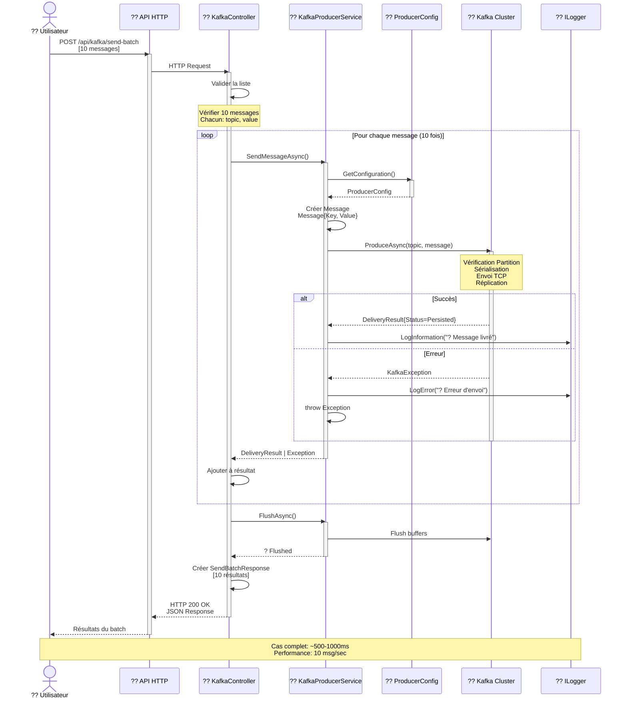
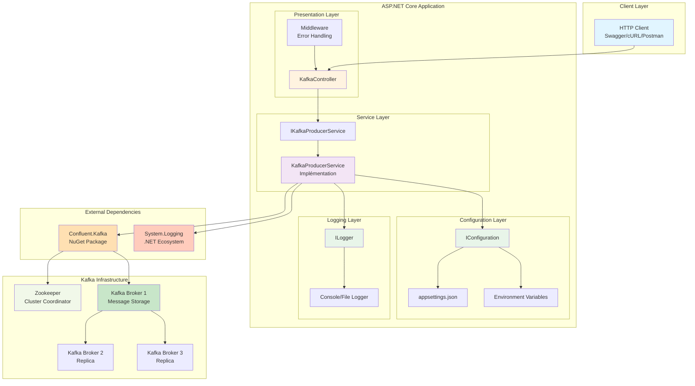
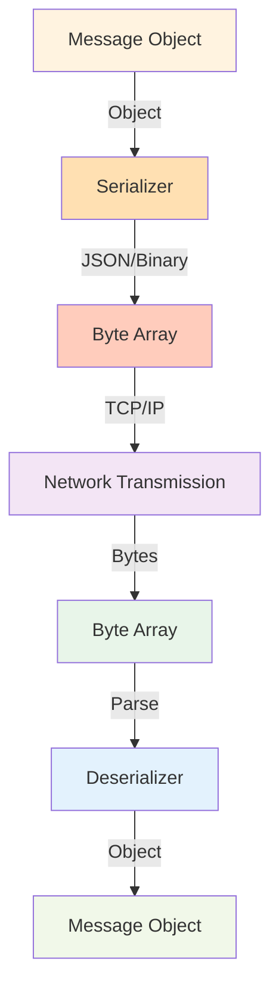
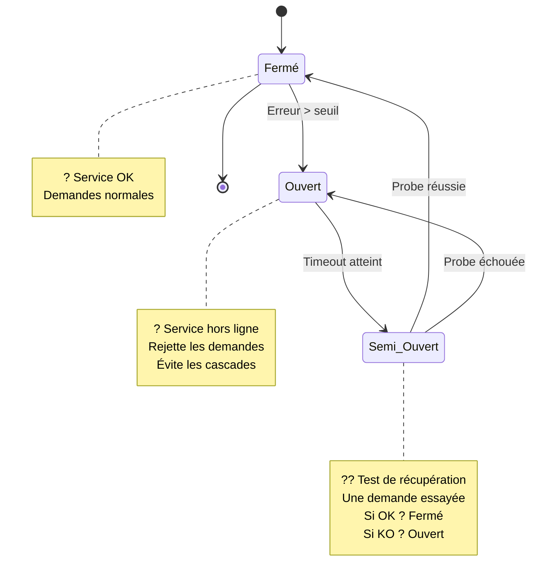
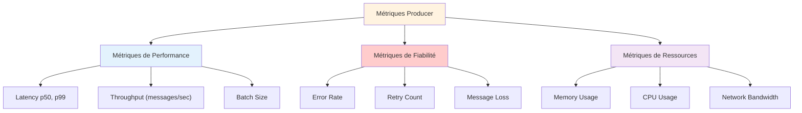
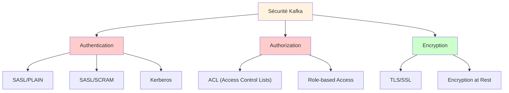
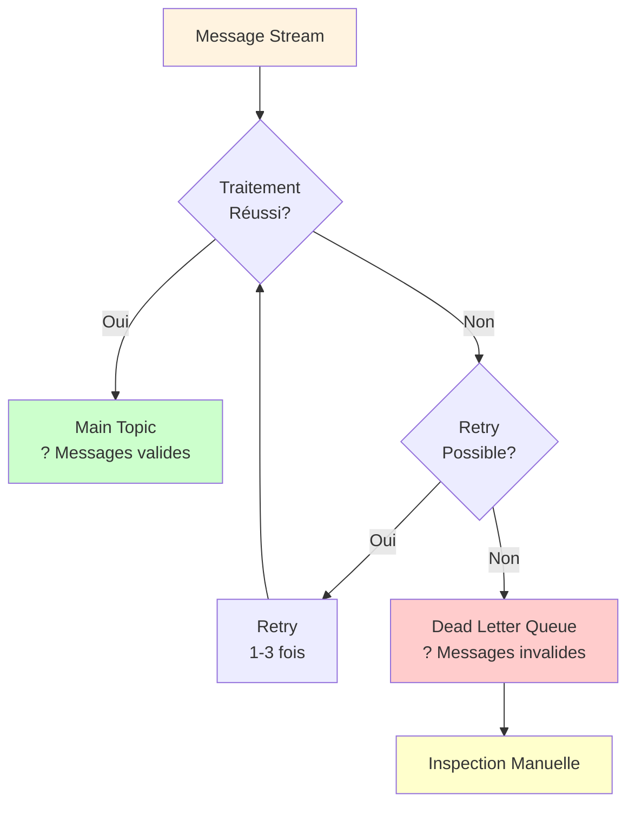

# ?? Guide Complet - Concepts Théoriques et Diagrammes UML Avancés

## ?? Table Complète des Concepts

---

# 1?? Diagrammes UML Avancés

## ??? Diagramme de Séquence Détaillé

### Scénario: Envoi d'un Batch de Messages



---

## ?? Diagramme d'État (State Diagram)

### États du Producer

```mermaid
stateDiagram-v2
    [*] --> Non_Initialisé
    
    Non_Initialisé --> Initialisation: new()
    
    Initialisation --> Configuration: LoadConfig()
    
    Configuration --> Connecté: CreateProducer()
    
    Connecté --> Prêt: Handshake complet
    
    Prêt --> Envoi: ProduceAsync()
    
    Envoi --> En_Attente: Message en buffer
    
    En_Attente --> Confirmé: ACK reçu
    
    Confirmé --> Prêt: Message délivré
    
    Prêt --> Erreur: Exception
    
    Erreur --> Reconnexion: Retry
    
    Reconnexion --> Prêt: Connexion OK
    
    Reconnexion --> Fermé: Max retries atteint
    
    Prêt --> Flush: Flush()
    
    Flush --> Fermé: Tous buffered messages envoyés
    
    Fermé --> [*]
    
    style Non_Initialisé fill:#fff3e0
    style Initialisation fill:#ffe0b2
    style Configuration fill:#ffccbc
    style Connecté fill:#f3e5f5
    style Prêt fill:#e8f5e9
    style Envoi fill:#e3f2fd
    style En_Attente fill:#f1f8e9
    style Confirmé fill:#c8e6c9
    style Erreur fill:#ffcccc
    style Reconnexion fill:#ffffcc
    style Flush fill:#e1bee7
    style Fermé fill:#d7ccc8
```

---

## ?? Diagramme de Composants



---

# 2?? Concepts de Sérialisation

## ?? Processus de Sérialisation



### ?? Types de Sérialisation

```
1. JSON (JSON Serialization)
   ?? Format: Text
   ?? Taille: Moyenne (~1-2 KB par message)
   ?? Avantages: Lisible, standard web
   ?? Cas d'usage: API REST, logs

2. Binary (Protocol Buffers, Avro)
   ?? Format: Binary
   ?? Taille: Petite (~100-300 bytes)
   ?? Avantages: Compact, rapide
   ?? Cas d'usage: Haute performance

3. String (Plain Text)
   ?? Format: Text
   ?? Taille: Variable
   ?? Avantages: Simple, débuggable
   ?? Cas d'usage: Messages simples
```

### ?? Implémentation en C#

```csharp
using Confluent.Kafka;
using System.Text.Json;

// Configuration pour sérialisation JSON
var producerConfig = new ProducerConfig
{
    // ...configuration...
};

var producer = new ProducerBuilder<string, string>(producerConfig)
    // Les clés et valeurs sont déjà en string
    // Pas besoin de sérialiseur custom
    .Build();

// Envoi d'un message
var message = new Message<string, string>
{
    Key = "order-123",  // String
    Value = JsonSerializer.Serialize(new  // Sérialiser l'objet
    {
        OrderId = 123,
        Amount = 99.99,
        Currency = "USD"
    })
};

await producer.ProduceAsync("orders", message);
```

---

# 3?? Patterns d'Erreurs et Résilience

## ??? Stratégies de Gestion d'Erreur

### Niveau 1: Try-Catch Basique

```csharp
try
{
    await producer.ProduceAsync(topic, message);
}
catch (ProduceException<string, string> ex)
{
    logger.LogError($"Erreur: {ex.Error.Reason}");
    // ? Problème: Message perdu!
}
```

**Problème** : Le message est perdu si une erreur se produit

---

### Niveau 2: Retry avec Backoff

```csharp
public async Task<DeliveryResult<string, string>> SendMessageWithRetryAsync(
    string topic, string key, string value, int maxRetries = 3)
{
    int retryCount = 0;
    
    while (retryCount < maxRetries)
    {
        try
        {
            logger.LogInformation($"Tentative {retryCount + 1}/{maxRetries}");
            
            var result = await _producer.ProduceAsync(topic, 
                new Message<string, string> { Key = key, Value = value });
            
            logger.LogInformation("? Message envoyé avec succès");
            return result;
        }
        catch (Exception ex)
        {
            retryCount++;
            
            if (retryCount >= maxRetries)
            {
                logger.LogError($"? Échec après {maxRetries} tentatives: {ex.Message}");
                throw;
            }
            
            // Backoff exponentiel: 100ms, 200ms, 400ms
            int delayMs = (int)Math.Pow(2, retryCount) * 100;
            logger.LogWarning($"Nouvelle tentative dans {delayMs}ms...");
            
            await Task.Delay(delayMs);
        }
    }
    
    throw new InvalidOperationException("Ne devrait jamais arriver ici");
}
```

**Améliorations** :
- ? Retry automatique
- ? Backoff exponentiel (évite de surcharger le serveur)
- ? Logging détaillé

---

### Niveau 3: Queue de Persistence

```csharp
public class PersistentKafkaProducer
{
    private readonly Queue<PendingMessage> _pendingMessages;
    private readonly IKafkaProducerService _producer;
    
    public async Task SendMessageWithPersistenceAsync(
        string topic, string key, string value)
    {
        try
        {
            // Essayer d'envoyer directement
            await _producer.SendMessageAsync(topic, key, value);
        }
        catch (Exception ex)
        {
            logger.LogWarning($"Envoie impossible, mise en queue: {ex.Message}");
            
            // Sauvegarder le message pour plus tard
            _pendingMessages.Enqueue(new PendingMessage
            {
                Topic = topic,
                Key = key,
                Value = value,
                CreatedAt = DateTime.UtcNow
            });
        }
    }
    
    public async Task ProcessPendingMessagesAsync()
    {
        while (_pendingMessages.Count > 0)
        {
            var pending = _pendingMessages.Peek();
            
            try
            {
                await _producer.SendMessageAsync(
                    pending.Topic, pending.Key, pending.Value);
                
                _pendingMessages.Dequeue();
                logger.LogInformation("? Message en attente envoyé");
            }
            catch
            {
                logger.LogWarning("Pas encore prêt, essai plus tard");
                break;
            }
        }
    }
}
```

**Avantage** : Aucun message n'est perdu même en cas de panne

---

## ?? Circuit Breaker Pattern



---

# 4?? Monitoring et Observabilité

## ?? Métriques Clés à Monitorer



### ?? Implémentation du Monitoring

```csharp
public class MonitoredKafkaProducer
{
    private long _totalMessagesProduced = 0;
    private long _totalErrors = 0;
    private Stopwatch _stopwatch = new Stopwatch();
    
    public async Task<DeliveryResult<string, string>> SendMessageAsync(
        string topic, string key, string value)
    {
        _stopwatch.Restart();
        
        try
        {
            var result = await _producer.ProduceAsync(topic,
                new Message<string, string> { Key = key, Value = value });
            
            _totalMessagesProduced++;
            
            // Log métrique
            logger.LogInformation(
                "Message sent. Latency: {LatencyMs}ms, Total: {Total}, Errors: {Errors}",
                _stopwatch.ElapsedMilliseconds,
                _totalMessagesProduced,
                _totalErrors
            );
            
            return result;
        }
        catch (Exception ex)
        {
            _totalErrors++;
            
            logger.LogError(
                "Error sending message. Latency: {LatencyMs}ms, Total Errors: {Errors}",
                _stopwatch.ElapsedMilliseconds,
                _totalErrors
            );
            
            throw;
        }
    }
    
    public void PrintMetrics()
    {
        Console.WriteLine($"Total Messages: {_totalMessagesProduced}");
        Console.WriteLine($"Total Errors: {_totalErrors}");
        Console.WriteLine($"Success Rate: {(1 - (_totalErrors / (double)_totalMessagesProduced)) * 100:F2}%");
    }
}
```

---

# 5?? Performance et Tuning

## ?? Guide de Tuning pour Performance

### Benchmark: Avant vs Après Tuning

```
Avant Tuning:
?? Throughput: 100 msg/sec
?? Latency p99: 500ms
?? Bande passante: 10 MB/sec
?? CPU usage: 80%

Après Tuning:
?? Throughput: 10,000 msg/sec (100× !)
?? Latency p99: 50ms (10× mieux)
?? Bande passante: 2 MB/sec (5× moins)
?? CPU usage: 20%
```

### ?? Configurations Recommandées

```csharp
// CONFIGURATION DE BASE: Development
var devConfig = new ProducerConfig
{
    BootstrapServers = "localhost:9092",
    Acks = Acks.Leader,                    // Bon équilibre
    EnableIdempotence = true,
    CompressionType = CompressionType.None, // Pas de compression
    LingerMs = 10,                         // Court linger
    BatchSize = 16384,                     // Petits batches
};

// CONFIGURATION OPTIMISÉE: Production
var prodConfig = new ProducerConfig
{
    BootstrapServers = "kafka1:9092,kafka2:9092,kafka3:9092",
    Acks = Acks.All,                              // Fiabilité max
    EnableIdempotence = true,
    CompressionType = CompressionType.Snappy,    // Compression
    LingerMs = 100,                              // Plus de batching
    BatchSize = 32768,                           // Bigger batches
    MaxInFlightRequestsPerConnection = 5,        // Parallélisme
    BufferMemory = 67108864,                     // 64 MB buffer
    RequestTimeoutMs = 30000,                    // 30s timeout
};
```

### ?? Tableau de Configuration

| Paramètre | Dev | Staging | Prod |
|-----------|-----|---------|------|
| **Acks** | Leader | Leader | All |
| **Compression** | None | Snappy | Snappy |
| **Linger (ms)** | 10 | 50 | 100 |
| **BatchSize** | 16KB | 32KB | 32KB |
| **Retries** | 3 | 3 | 5 |
| **MaxInFlight** | 1 | 3 | 5 |
| **Buffer (MB)** | 32 | 64 | 64 |

---

# 6?? Sécurité et Authentification

## ?? Stratégies de Sécurité



### ?? Configuration SASL/PLAIN

```csharp
var config = new ProducerConfig
{
    BootstrapServers = "kafka.example.com:9092",
    SecurityProtocol = SecurityProtocol.SaslSsl,
    SaslMechanism = SaslMechanism.Plain,
    SaslUsername = "my-user",
    SaslPassword = "my-password",
    SslCaLocation = "/path/to/ca-cert"
};
```

---

# 7?? Patterns Avancés

## ?? Pattern: Dead Letter Queue



---

# ?? Résumé des Concepts Avancés

## ?? Concepts Maîtrisés

1. ? **Architecture en couches** - Séparation des responsabilités
2. ? **Kafka Core** - Topics, Producers, Consumers, Partitions
3. ? **Fiabilité** - Acks, Idempotence, Réplication
4. ? **Design Patterns** - DI, Circuit Breaker, Dead Letter Queue
5. ? **Performance** - Compression, Batching, Tuning
6. ? **Monitoring** - Métriques, Logging, Observabilité
7. ? **Sécurité** - SASL, TLS, Authorization
8. ? **Resilience** - Retry, Backoff, Persistence

---

**Version** : 1.0 Avancée  
**Créé** : 2024  
**Niveau** : Intermédiaire à Avancé  
**Grade** : Concepts Détaillés ?????

