# ?? Tutoriel Pédagogique Avancé : Architecture Kafka avec ASP.NET Core

## ?? Guide Didactique avec Concepts Théoriques

**Objectif** : Comprendre l'architecture complète d'une API Kafka Producer  
**Niveau** : Intermédiaire  
**Approche** : Pédagogique avec diagrammes et explications détaillées  

---

## ?? Table des Matières Pédagogique

| Section | Contenu | Diagrammes |
|---------|---------|-----------|
| 1 | [Architecture Générale](#architecture-générale) | 3 diagrammes |
| 2 | [Concepts Fondamentaux](#concepts-fondamentaux-kafka) | 2 diagrammes |
| 3 | [Diagrammes UML](#diagrammes-uml-détaillés) | 4 diagrammes |
| 4 | [Flux de Données](#flux-de-données-complet) | 3 diagrammes |
| 5 | [Patterns & Concepts](#patterns-de-conception) | 2 diagrammes |

---

# 1?? Architecture Générale

## ??? Vue d'Ensemble de l'Architecture Complète

Voici l'architecture globale de notre application :

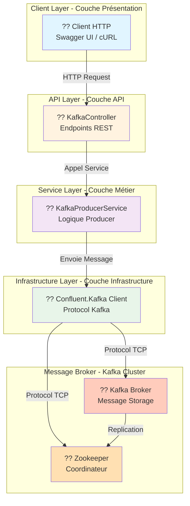

### ?? Explication par Couches

#### ?? **Couche Présentation (Client Layer)**
- **Rôle** : Interface utilisateur pour interagir avec l'API
- **Exemples** :
  - Swagger UI : Interface web interactive
  - cURL : Client en ligne de commande
  - Postman : Client REST desktop
  
#### ?? **Couche API (API Layer)**
- **Rôle** : Recevoir et valider les requêtes HTTP
- **Composants** :
  - `KafkaController` : Gère les endpoints REST
  - Validation des données
  - Gestion des erreurs
  
#### ?? **Couche Métier (Service Layer)**
- **Rôle** : Logique applicative métier
- **Responsabilités** :
  - Orchestrer les opérations Kafka
  - Configurer le producer
  - Gérer les erreurs métier
  
#### ?? **Couche Infrastructure**
- **Rôle** : Communication technique avec Kafka
- **Tâches** :
  - Gestion de la connexion TCP
  - Gestion du protocole Kafka
  - Gestion de la serialisation

#### ?? **Kafka Cluster**
- **Zookeeper** : Coordinateur du cluster
- **Kafka Broker** : Stockage des messages

---

## ?? Flux de Communication Complet

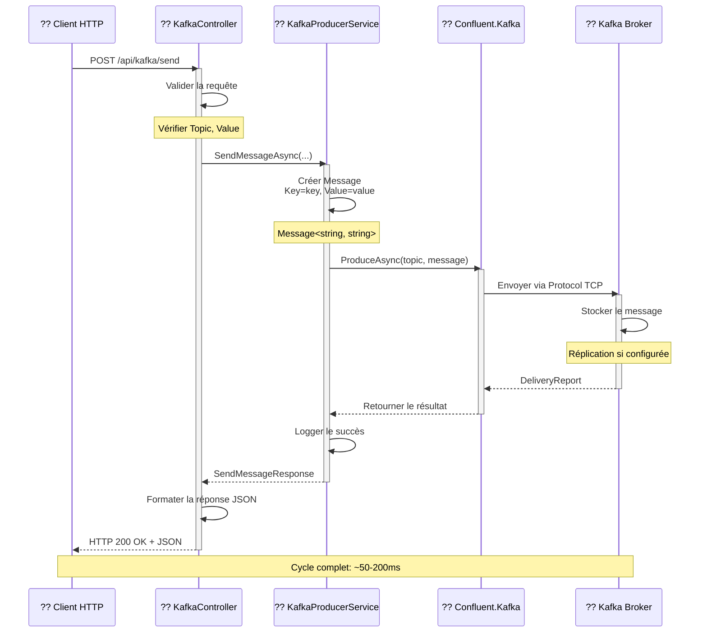

### ?? Étapes du Flux Expliquées

| Étape | Composant | Action | Temps |
|-------|-----------|--------|-------|
| 1 | Client | Envoie requête HTTP POST | 1ms |
| 2 | Controller | Valide les données | 2ms |
| 3 | Service | Crée le message | 1ms |
| 4 | Confluent | Sérialise et envoie | 10-50ms |
| 5 | Kafka | Reçoit et confirme | 20-100ms |
| 6 | Service | Log et prépare réponse | 2ms |
| 7 | Controller | Sérialise JSON | 1ms |
| 8 | Client | Reçoit réponse | 5-10ms |

**Total** : ~50-200ms (selon la latence réseau)

---

## ?? Diagramme de Dépendances

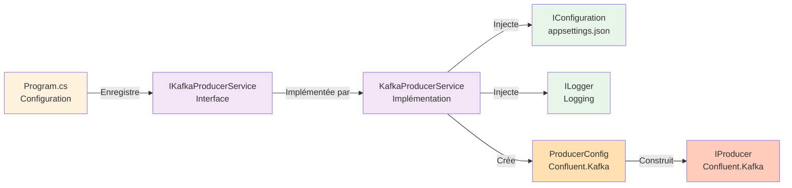

---

# 2?? Concepts Fondamentaux Kafka

## ?? Qu'est-ce que Kafka ?

### ?? Définition Simple

**Apache Kafka** est une **plateforme de streaming de données distribuée** qui permet :
- Publier et s'abonner à des flux de données
- Stocker les données de manière fiable
- Traiter les données en temps réel

### ?? Concepts Clés

#### 1?? **Topic (Sujet)**
```
Un Topic = Un canal de communication pour des messages

Analogie : Une chaîne de télévision
?? Vous publiez des messages ? chaîne Kafka
?? D'autres s'abonnent ? reçoivent les messages
```

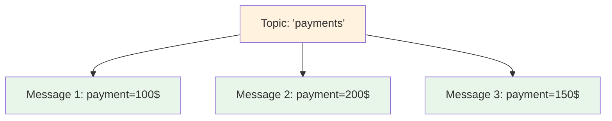

#### 2?? **Producer (Producteur)**
```
Un Producer = Celui qui envoie des messages

Notre KafkaProducerService est un Producer
?? Il crée et envoie des messages vers Kafka
```

#### 3?? **Consumer (Consommateur)**
```
Un Consumer = Celui qui reçoit des messages

Exemple : Un service de traitement
?? Il lit les messages du topic
```

#### 4?? **Partition (Partition)**
```
Chaque Topic peut avoir plusieurs Partitions

Topic: 'payments'
?? Partition 0: [Msg1, Msg3, Msg5]
?? Partition 1: [Msg2, Msg4, Msg6]
?? Partition 2: [Msg7, Msg8]

Avantages:
? Paralléliser le traitement
? Augmenter le throughput
? Distribuer la charge
```

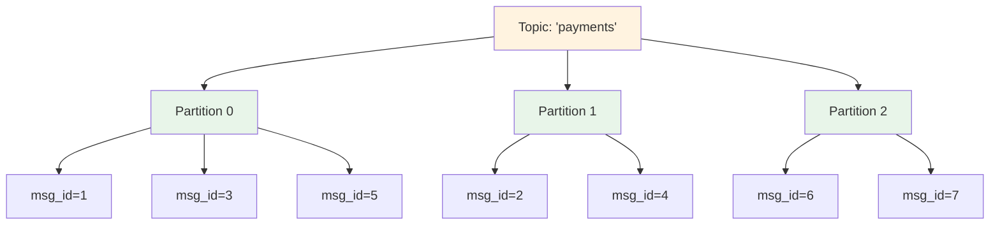

#### 5?? **Offset (Position)**
```
L'Offset = La position d'un message dans une partition

Partition 0: [Msg@0, Msg@1, Msg@2, Msg@3, Msg@4]

Un Consumer peut lire :
- Offset 0 : Commencer du début
- Offset 3 : Continuer à partir du 4e message
- Offset latest : Lire les nouveaux messages
```

---

## ?? Configuration du Producer Kafka

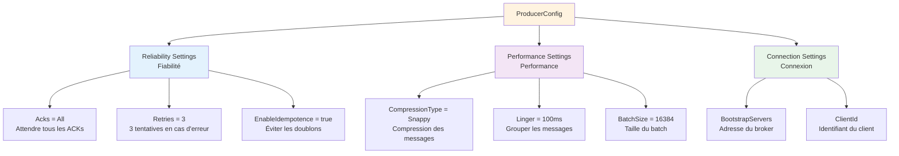

### ?? Explication de Chaque Configuration

#### **Acks = All (Fiabilité Maximale)**
```
Acks.All = Attendre la confirmation de tous les replicas

Workflow:
1. Producer ? envoie le message
2. Leader Broker ? reçoit le message
3. Followers ? reçoivent une copie
4. Followers ? confirment la réception (ACK)
5. Leader ? confirme au Producer

Résultat : 0 perte de données garantie
Inconvénient : Plus lent (latence +)
```

#### **EnableIdempotence = true (Pas de Doublons)**
```
Idempotence = "Pas d'effet si répété"

Situation sans idempotence:
1. Producer envoie message M1
2. Kafka reçoit et confirme
3. La confirmation se perd sur le réseau
4. Producer pense que l'envoi a échoué
5. Producer renvoie M1 (doublon!)

Avec idempotence:
? Kafka détecte le doublon
? Kafka ignore la deuxième copie
? Résultat : 1 seul message stocké
```

#### **CompressionType = Snappy (Performance)**
```
Compression = Réduire la taille du message

Avantages:
? Moins de bande passante utilisée
? Messages plus petits
? Transferts plus rapides

Types:
- None : Pas de compression (défaut)
- Gzip : Fort taux de compression, lent
- Snappy : Bon équilibre (recommandé)
- Lz4 : Très rapide
```

#### **Linger = 100ms (Batching)**
```
Linger = Attendre un peu pour grouper les messages

Sans Linger:
Msg1 ? envoi immédiat
Msg2 ? envoi immédiat
Msg3 ? envoi immédiat
Total : 3 envois = 3 × RTT

Avec Linger=100ms:
Msg1 ? mis en attente
Msg2 ? mis en attente
Msg3 ? mis en attente
       ? Après 100ms : Groupe + envoi
Total : 1 envoi = 1 × RTT (90% plus rapide!)
```

---

# 3?? Diagrammes UML Détaillés

## ??? Diagramme de Classes (Class Diagram)

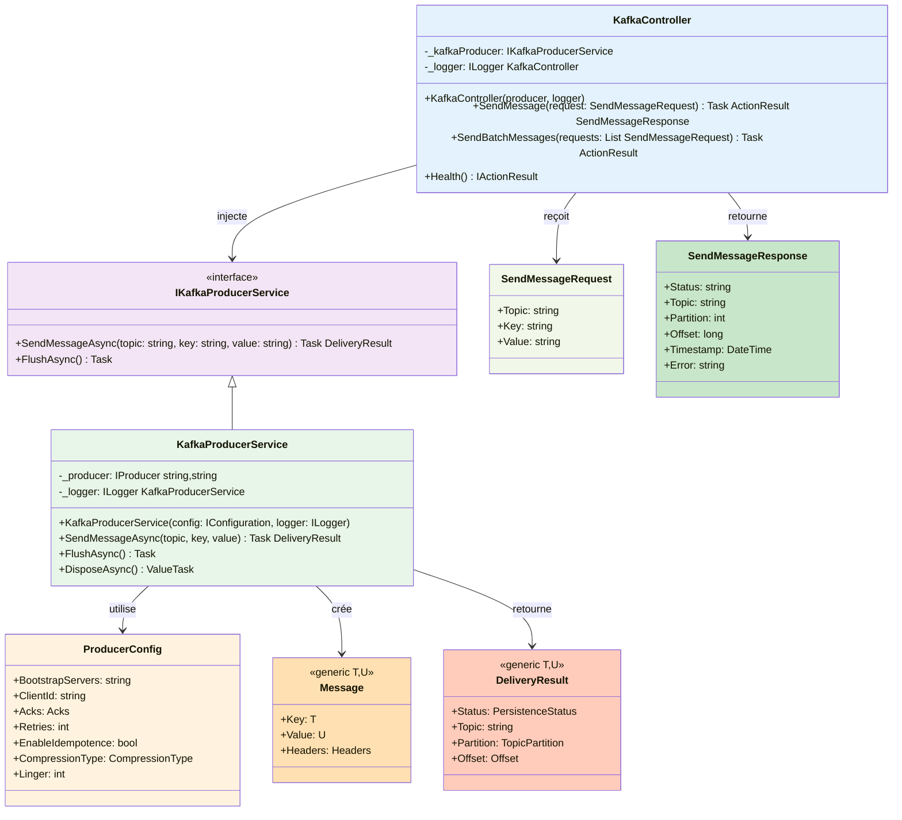

### ?? Explication du Diagramme

#### ?? **Relations entre Classes**

```
Réalisation (implements/implements):
    IKafkaProducerService <|-- KafkaProducerService
    Signification : KafkaProducerService implémente l'interface

Association (utilise):
    KafkaProducerService --> ProducerConfig
    Signification : KafkaProducerService utilise ProducerConfig

Dépendance (injecte):
    KafkaController --> IKafkaProducerService
    Signification : Injection de dépendance
```

#### ?? **Flux de Données dans les Classes**

```
1. SendMessageRequest
   ? (requête HTTP)
2. KafkaController.SendMessage()
   ? (appel)
3. KafkaProducerService.SendMessageAsync()
   ? (création)
4. Message<string,string>
   ? (envoi)
5. Confluent.Kafka
   ? (traitement)
6. DeliveryResult
   ? (retour)
7. SendMessageResponse
   ? (réponse HTTP)
8. Client
```

---

## ?? Diagramme d'Interaction (Interaction Diagram)

```mermaid
graph TB
    subgraph "Phase 1: Initialisation"
        A1["1. Program.cs démarre"]
        A2["2. Service Container créé"]
        A3["3. Enregistrer KafkaProducerService"]
        A4["4. Charger IConfiguration"]
        
        A1 --> A2 --> A3 --> A4
    end
    
    subgraph "Phase 2: Configuration Producer"
        B1["1. Créer ProducerConfig"]
        B2["2. Lire BootstrapServers"]
        B3["3. Configurer Reliability"]
        B4["4. Configurer Performance"]
        B5["5. Créer IProducer"]
        
        B1 --> B2 --> B3 --> B4 --> B5
    end
    
    subgraph "Phase 3: Requête HTTP"
        C1["1. Client envoie POST"]
        C2["2. KafkaController reçoit"]
        C3["3. Valider données"]
        C4["4. Injecter Service"]
        
        C1 --> C2 --> C3 --> C4
    end
    
    subgraph "Phase 4: Envoi Message"
        D1["1. Créer Message"]
        D2["2. Appeler ProduceAsync"]
        D3["3. Serialiser les données"]
        D4["4. Envoyer via TCP"]
        D5["5. Recevoir ACK"]
        
        D1 --> D2 --> D3 --> D4 --> D5
    end
    
    subgraph "Phase 5: Réponse"
        E1["1. Créer DeliveryResult"]
        E2["2. Logger le succès"]
        E3["3. Créer SendMessageResponse"]
        E4["4. Sérialiser JSON"]
        E5["5. Retourner au client"]
        
        E1 --> E2 --> E3 --> E4 --> E5
    end
    
    A4 --> B1
    B5 --> C1
    C4 --> D1
    D5 --> E1
    
    style A1 fill:#fff3e0
    style B1 fill:#ffe0b2
    style C1 fill:#ffccbc
    style D1 fill:#f3e5f5
    style E1 fill:#e8f5e9
```

---

## ?? Diagramme de Déploiement (Deployment Diagram)

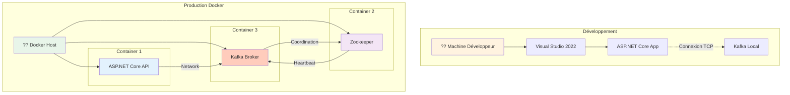

---

# 4?? Flux de Données Complet

## ?? Flux Détaillé d'une Requête

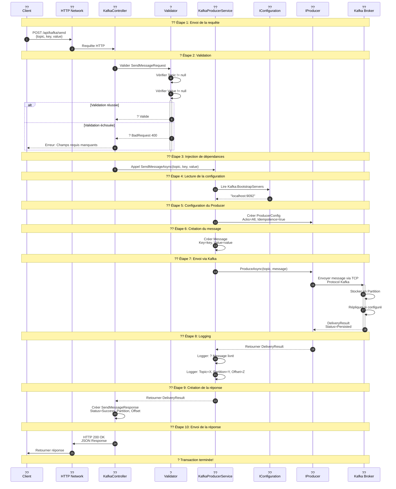

### ?? Timing et Performance

```
Étape 1: Envoi requête        : 5-10ms
Étape 2: Validation            : 1-2ms
Étape 3: Injection DI           : 0.5ms
Étape 4: Lecture config        : 1ms
Étape 5: Configuration         : 1ms
Étape 6: Création message      : 0.5ms
Étape 7: Envoi à Kafka        : 20-100ms (réseau)
Étape 8: Logging              : 1ms
Étape 9: Création réponse      : 1ms
Étape 10: Retour réponse       : 5-10ms
?????????????????????????????????????
Total                         : 35-130ms
```

---

# 5?? Patterns de Conception

## ?? Pattern: Injection de Dépendances (Dependency Injection)

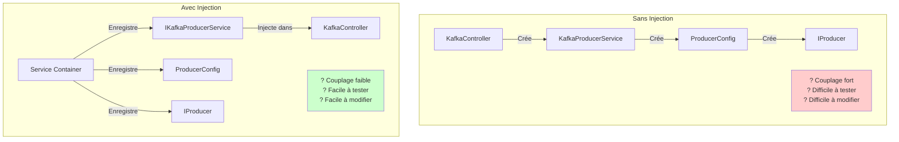

### ?? Comment Fonctionne l'Injection

```csharp
// ÉTAPE 1: Enregistrement dans Program.cs
builder.Services.AddSingleton<IKafkaProducerService, KafkaProducerService>();
//                            ?                        ?
//                         Interface              Implémentation

// ÉTAPE 2: Utilisation dans le Contrôleur
public KafkaController(
    IKafkaProducerService kafkaProducer,  // ? Injection automatique
    ILogger<KafkaController> logger       // ? Injection automatique
)
{
    // Le conteneur crée automatiquement une instance
    // et la passe au constructeur
}
```

### ?? Cycle de Vie des Objets

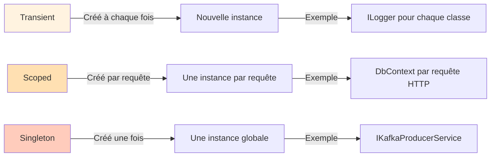

**Choix pour KafkaProducerService** : **Singleton**
```
Pourquoi?
? Un seul Producer pour toute l'application
? Le Producer maintient une connexion persistent
? Partage de ressources = efficacité
? Thread-safe

Inconvénients à éviter:
? Ne pas utiliser Transient (crée une connexion à chaque fois)
? Ne pas utiliser Scoped (une connexion par requête = lenteur)
```

---

## ??? Pattern: Gestion des Erreurs

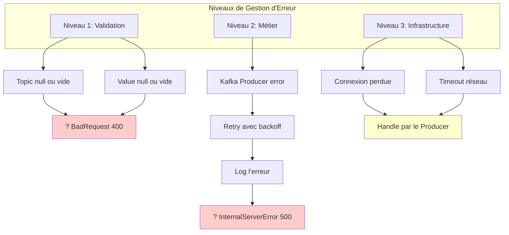

### ?? Implémentation en Code

```csharp
// NIVEAU 1: Validation HTTP
[HttpPost("send")]
public async Task<ActionResult<SendMessageResponse>> SendMessage(
    [FromBody] SendMessageRequest request)
{
    // Validation des données reçues
    if (string.IsNullOrWhiteSpace(request.Topic))
        return BadRequest(new { error = "Topic requis" });  // 400
    
    try
    {
        // NIVEAU 2: Logique métier
        var result = await _kafkaProducer.SendMessageAsync(
            request.Topic,
            request.Key ?? "default",
            request.Value);
        
        // Succès
        return Ok(new { status = "Success", ... });  // 200
    }
    catch (Exception ex)  // NIVEAU 3: Erreurs infrastructure
    {
        _logger.LogError($"Erreur Kafka: {ex.Message}");
        return StatusCode(500, new { error = ex.Message });  // 500
    }
}
```

---

# 6?? Concepts Théoriques Détaillés

## ?? Fiabilité et Durabilité des Messages

### ?? Trois Niveaux de Fiabilité

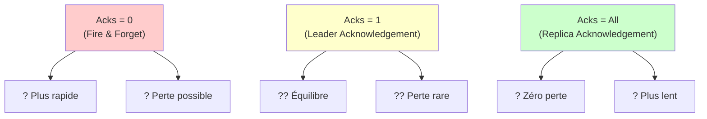

### ?? Workflow avec Acks=All

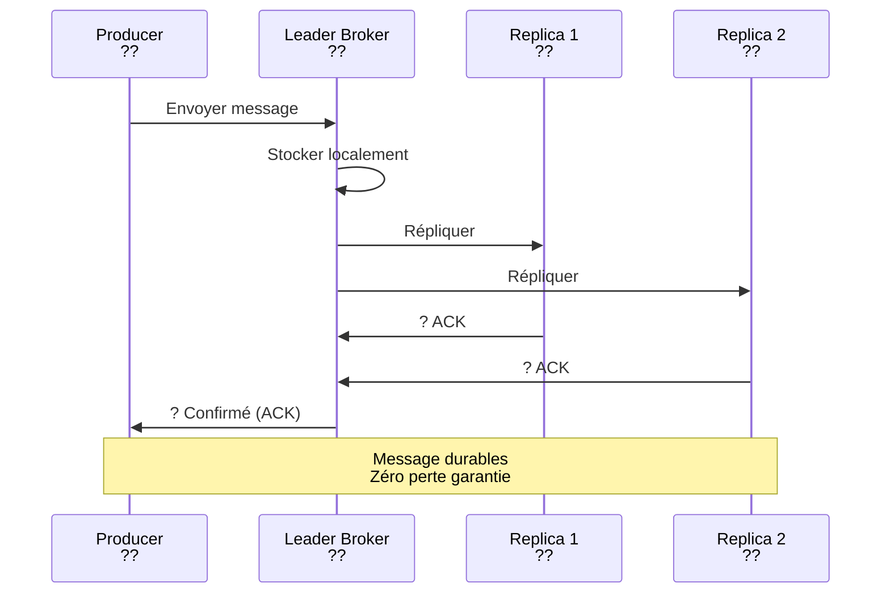

### ?? Réplication et Durabilité

```
Réplication = Copier le message sur plusieurs serveurs

Exemple: Replication Factor = 3
???????????????????????????????????????
?  Topic: 'payments'                  ?
?  Replication Factor: 3              ?
???????????????????????????????????????

Message: {id: 1, amount: 100}

Broker 1: ? Copie 1 (Leader)
Broker 2: ? Copie 2
Broker 3: ? Copie 3

Avantage:
? Si Broker 1 tombe ? Broker 2 prend le relais
? Si Broker 2 tombe ? Broker 3 prend le relais
? Maximum 2 Brokers peuvent tomber

Inconvénient:
? Utilise 3× l'espace disque
```

---

## ?? Performance et Optimisation

### ?? Facteurs Affectant la Performance

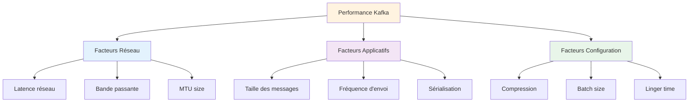

### ?? Optimisations Appliquées

```csharp
// OPTIMISATION 1: Compression
CompressionType = CompressionType.Snappy
// Réduit la bande passante de 50-70%

// OPTIMISATION 2: Batching
Linger = 100  // ms
// Groupe les messages pendant 100ms
// Gain: Réduit le nombre d'appels réseau

// OPTIMISATION 3: Idempotence
EnableIdempotence = true
// Élimine les doublons
// Gain: Garantie "exactly-once"
```

### ?? Comparaison des Stratégies

```
Scénario: Envoyer 1000 messages

STRATÉGIE 1: Sans Optimization
?? Compression: OFF
?? Batching: OFF
?? Appels réseau: 1000
?? Temps total: 10 secondes

STRATÉGIE 2: Avec Optimization
?? Compression: Snappy (50%)
?? Batching: Linger=100ms
?? Appels réseau: 100 (1 par 100ms)
?? Temps total: 1 seconde (10× plus rapide!)
```

---

## ?? Monitoring et Observabilité

### ?? Métriques Importantes

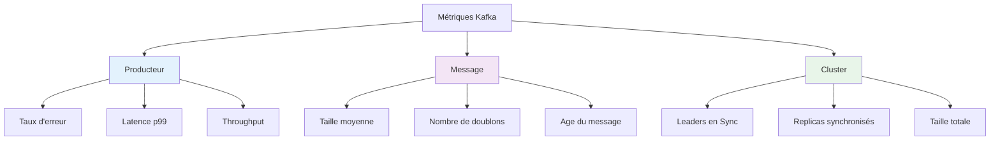

### ?? Implémentation du Logging

```csharp
// Logging structuré
_logger.LogInformation(
    "Message envoyé à Kafka - Topic: {Topic}, Partition: {Partition}, Offset: {Offset}",
    result.Topic,
    result.Partition.Value,
    result.Offset.Value
);

// Avantage du logging structuré:
// ? Facile de parser/analyser
// ? Searchable dans les logs agrégés
// ? Traçabilité complète
```

---

# ?? Résumé Pédagogique

## ?? Points Clés à Retenir

### 1. **Architecture en Couches**
```
Présentation (Client/Swagger)
        ?
API (Controllers)
        ?
Métier (Services)
        ?
Infrastructure (Kafka)
        ?
Storage (Message Broker)
```

### 2. **Kafka Core Concepts**
```
Topic = Canal de communication
Producer = Envoyeur de messages
Consumer = Lecteur de messages
Partition = Parallélisation
Offset = Position du message
```

### 3. **Fiabilité Kafka**
```
Acks=All ? Zéro perte
Idempotence=true ? Zéro doublon
Replication ? Durabilité
```

### 4. **Design Patterns Utilisés**
```
Injection de Dépendances
Gestion des Erreurs
Logging structuré
Async/Await pour non-bloquant
```

### 5. **Performance**
```
Compression ? -50% bande passante
Batching ? -90% appels réseau
Idempotence ? 0 perte + 0 doublon
```

---

## ?? Compétences Acquises

À la fin de ce tutoriel, vous comprenez :

? **Architecture** : Composants et leurs rôles  
? **Kafka** : Concepts fondamentaux et avancés  
? **ASP.NET Core** : DI, Services, Controllers  
? **Design** : Patterns et meilleures pratiques  
? **Performance** : Optimisations et tuning  
? **Reliability** : Gestion des erreurs et monitoring  

---

## ?? Ressources pour Approfondir

### Documentation Officielle
- [Apache Kafka Documentation](https://kafka.apache.org/documentation/)
- [Confluent.Kafka GitHub](https://github.com/confluentinc/confluent-kafka-dotnet)
- [ASP.NET Core Docs](https://learn.microsoft.com/en-us/aspnet/core/)

### Concepts Avancés à Explorer
- Kafka Streams pour le traitement
- Schéma Registry pour la sérialisation
- Security et authentification
- Disaster recovery et failover
- Monitoring avec Prometheus/Grafana

---

**Version** : 1.0 Pédagogique  
**Créé** : 2024  
**Auteur** : GitHub Copilot + Data2AI Academy  
**Grade** : Tutoriel Avancé avec Concepts ?????

