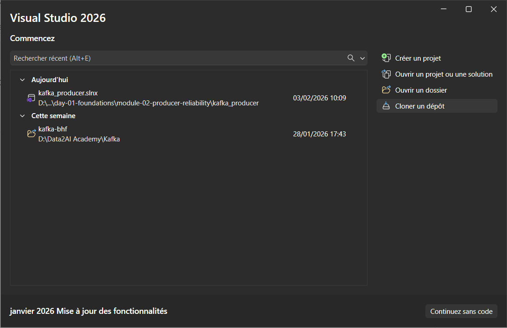
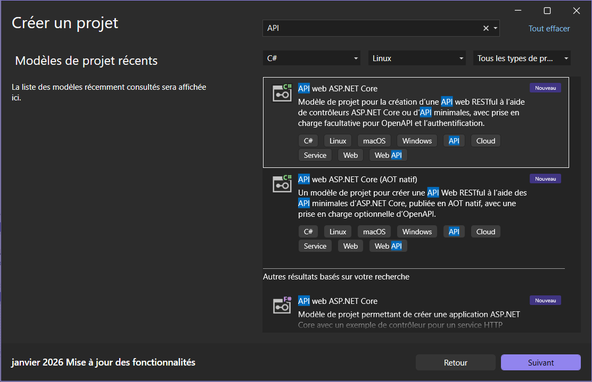
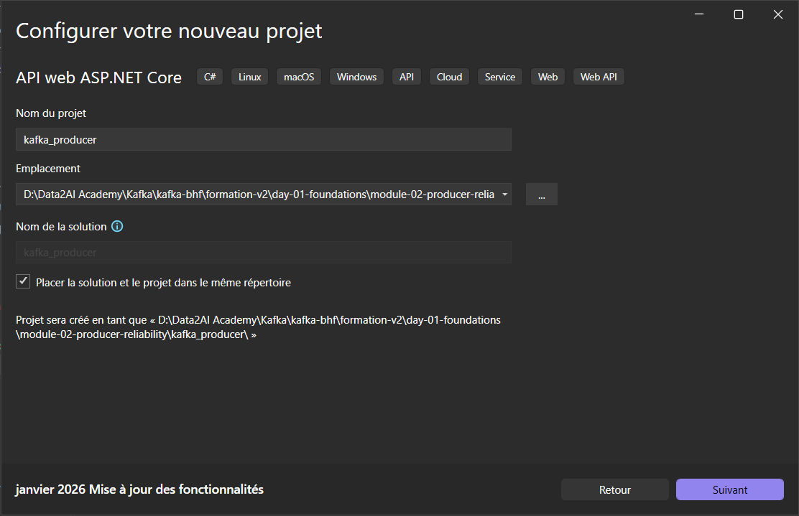

# Guide de Configuration - Producteur Kafka (.NET 8)

Ce guide vous présentera étape par étape comment configurer et exécuter ce projet producteur Kafka basé sur .NET 8 avec Confluent.Kafka.

## 📋 Table des Matières

1. [Prérequis](#-prérequis)
2. [Créer un Nouveau Projet](#-créer-un-nouveau-projet-aspnet-core-api)
3. [Configuration Kafka](#-configuration-kafka)
4. [Étapes de Configuration](#-étapes-de-configuration)
5. [Utilisation de Docker](#-utilisation-de-docker)
6. [Structure du Projet](#-structure-du-projet)
7. [Fichier de Projet](#-fichier-de-projet-kafka_producercsproj)
8. [Résolution des Erreurs](#-résolution-des-erreurs-courantes)
9. [Commandes Utiles](#-commandes-utiles)
10. [Secrets Utilisateur](#-secrets-utilisateur)
11. [Ressources](#-ressources-utiles)
12. [Checklist](#-checklist-de-vérification)
13. [Conseils](#-conseils-de-développement)

## 📋 Prérequis

Avant de commencer, assurez-vous d'avoir installé les éléments suivants sur votre machine :

- **.NET 8 SDK** : [Télécharger .NET 8](https://dotnet.microsoft.com/download/dotnet/8.0)
- **Visual Studio 2022** (optionnel mais recommandé) ou **Visual Studio Code**
- **Docker Desktop** (optionnel, pour la conteneurisation)
- **Git** : Pour cloner le référentiel
- **Kafka Cluster** : Local ou distant pour tester le producer

### Vérifier les versions installées

Ouvrez une invite de commande ou PowerShell et exécutez :

```powershell
dotnet --version
docker --version
git --version
```

## 🚀 Créer un Nouveau Projet ASP.NET Core API

### Méthode 1 : Utiliser Visual Studio 2022 (Interface Graphique)

#### Étape 1 : Lancer Visual Studio 2022



Ouvrez Visual Studio 2022 depuis le menu Démarrer ou le raccourci bureau.

#### Étape 2 : Créer un Nouveau Projet



- Cliquez sur **"Create a new project"** ou allez à **File → New → Project**

#### Étape 3 : Sélectionner le Modèle API


- Recherchez **"ASP.NET Core Web API"**
- Sélectionnez le modèle
- Cliquez sur **"Next"**

#### Étape 4 : Configurer le Projet



Remplissez les informations suivantes :

- **Project name** : `kafka_producer`
- **Location** : Choisissez le chemin `D:\Data2AI Academy\Kafka\kafka-bhf\formation-v2\day-01-foundations\module-02-producer-reliability\`
- **Solution name** : `kafka_producer`
- Cochez **"Place solution and project in the same directory"** (optionnel)
- Cliquez sur **"Next"**

#### Étape 5 : Sélectionner la Version .NET


- **Framework** : Sélectionnez **".NET 8.0"**
- **Authentication type** : Laissez à **"None"**
- **Configure for HTTPS** : Cochez cette option
- **Use controllers (uncheck to use minimal APIs)** : Décochez pour utiliser les APIs minimales
- Cliquez sur **"Create"**

#### Étape 6 : Projet Créé

Votre nouveau projet ASP.NET Core API est maintenant créé avec :
- ✅ Structure de base avec `Program.cs`, `Controllers/`, etc.
- ✅ Le fichier `.csproj` configuré
- ✅ Le dossier `Properties/` avec configurations de lancement

### Méthode 2 : Utiliser la Ligne de Commande (CLI)

Si vous préférez créer le projet via PowerShell/Terminal :

```powershell
# Naviguer vers le répertoire souhaité
cd "D:\Data2AI Academy\Kafka\kafka-bhf\formation-v2\day-01-foundations\module-02-producer-reliability\"

# Créer un nouveau projet ASP.NET Core API
dotnet new webapi -n kafka_producer --minimal

# Naviguer dans le projet
cd kafka_producer

# Restaurer les dépendances
dotnet restore

# Lancer l'application
dotnet run
```

**Résultat** : L'application démarre sur `https://localhost:5001`

---

## ⚙️ Configuration Kafka

### Étape 1 : Ajouter Confluent.Kafka

```powershell
# Ajouter le package Confluent.Kafka
dotnet add package Confluent.Kafka

# Vérifier l'installation
dotnet list package
```

### Étape 2 : Configurer le Producer

Créez un fichier `KafkaProducerService.cs` :

```csharp
using Confluent.Kafka;

public class KafkaProducerService
{
    private readonly IProducer<string, string> _producer;
    
    public KafkaProducerService()
    {
        var config = new ProducerConfig
        {
            BootstrapServers = "localhost:9092",
            Acks = Acks.All,
            EnableIdempotence = true,
            MessageSendMaxRetries = 3
        };
        
        _producer = new ProducerBuilder<string, string>(config).Build();
    }
    
    public async Task<DeliveryResult<string, string>> SendMessageAsync(string topic, string key, string value)
    {
        var message = new Message<string, string>
        {
            Key = key,
            Value = value
        };
        
        return await _producer.ProduceAsync(topic, message);
    }
}
```

### Étape 3 : Mettre à jour Program.cs

```csharp
var builder = WebApplication.CreateBuilder(args);

// Add services to the container.
builder.Services.AddSingleton<KafkaProducerService>();

var app = builder.Build();

// Configure Kafka endpoint
app.MapPost("/api/kafka/send", async (KafkaProducerService producer, string topic, string key, string value) =>
{
    try
    {
        var result = await producer.SendMessageAsync(topic, key, value);
        return Results.Ok(new { Status = "Success", Offset = result.Offset });
    }
    catch (Exception ex)
    {
        return Results.Problem(detail: ex.Message, statusCode: 500);
    }
});

app.Run();
```

---

## 🔧 Étapes de Configuration

### Étape 1 : Cloner le Référentiel

```powershell
git clone https://github.com/msellamiTN/kafka-bhf
cd kafka-bhf
```

### Étape 2 : Vérifier la Configuration NuGet

Le fichier `nuget.config` à la racine du projet configure les sources des packages NuGet. Il devrait contenir :

```xml
<?xml version="1.0" encoding="utf-8"?>
<configuration>
  <packageSources>
    <add key="nuget.org" value="https://api.nuget.org/v3/index.json" protocolVersion="3" />
  </packageSources>
</configuration>
```

**Important** : Ce fichier est nécessaire pour télécharger les packages depuis `nuget.org`. S'il est absent ou vide, vous recevrez l'erreur `NU1100` ou `NU1101`.

### Étape 3 : Restaurer les Dépendances

Cette commande télécharge tous les packages NuGet nécessaires :

```powershell
dotnet restore
```

**Résultat attendu** : Les packages doivent se télécharger sans erreur.

### Étape 4 : Construire le Projet

```powershell
dotnet build
```

**Résultat attendu** : Message "Génération réussie" (Build succeeded)

### Étape 5 : Exécuter le Projet

```powershell
dotnet run
```

L'application web devrait démarrer et être accessible à l'URL affichée dans la console (généralement `https://localhost:5001` ou `http://localhost:5000`).

## 🐳 Utilisation de Docker

Si vous souhaitez exécuter le projet dans un conteneur Docker :

### Étape 1 : Construire l'Image Docker

```powershell
docker build -t kafka-producer:latest .
```

### Étape 2 : Exécuter le Conteneur

```powershell
docker run -p 5000:80 --name kafka-producer kafka-producer:latest
```

L'application sera accessible à `http://localhost:5000`

### Étape 3 : Arrêter le Conteneur

```powershell
docker stop kafka-producer
docker rm kafka-producer
```

## 📁 Structure du Projet

```
kafka-bhf/
??? kafka_producer.csproj      # Fichier de configuration du projet
??? nuget.config               # Configuration des sources NuGet
??? [autres fichiers source]

## 📄 Fichier de Projet (kafka_producer.csproj)

Le fichier `.csproj` contient la configuration de votre projet :

- **TargetFramework** : `net8.0` (.NET 8)
- **Nullable** : `enable` (gestion stricte des valeurs nullables)
- **Dépendances** :
  - `Microsoft.AspNetCore.OpenApi` v8.0.0
  - `Confluent.Kafka` v2.3.0
  - `Microsoft.VisualStudio.Azure.Containers.Tools.Targets` v1.21.0

## 🛠️ Résolution des Erreurs Courantes

### Erreur : "NU1100 - Impossible de résoudre le package"

**Cause** : Le fichier `nuget.config` est manquant ou mal configuré.

**Solution** :
1. Vérifiez que `nuget.config` existe à la racine du projet
2. Assurez-vous qu'il contient la source `https://api.nuget.org/v3/index.json`
3. Exécutez : `dotnet restore`

### Erreur : ".NET 8 SDK non trouvé"

**Cause** : .NET 8 n'est pas installé.

**Solution** :
1. Téléchargez et installez [.NET 8 SDK](https://dotnet.microsoft.com/download/dotnet/8.0)
2. Redémarrez votre IDE et votre terminal
3. Vérifiez : `dotnet --version`

### Erreur : "Port déjà en utilisation"

**Cause** : Un autre processus utilise le port 5000 ou 5001.

**Solution** :
```powershell
# Trouver le processus utilisant le port 5000
netstat -ano | findstr :5000

# Arrêter le processus (remplacez PID par le numéro trouvé)
taskkill /PID <PID> /F
```

## ⚡ Commandes Utiles

```powershell
# Restaurer les dépendances
dotnet restore

# Construire le projet
dotnet build

# Exécuter le projet en mode debug
dotnet run

# Exécuter avec une configuration spécifique
dotnet run --configuration Release

# Nettoyer les fichiers de build
dotnet clean

# Vérifier les références de packages
dotnet list package

# Mettre à jour les packages
dotnet package update
```

## 🔐 Secrets Utilisateur

Le projet utilise un ID de secrets utilisateur : `a2b73e20-d132-44d8-ba05-986a35f975a2`

Pour configurer les secrets en développement :

```powershell
dotnet user-secrets init
dotnet user-secrets set "YourSecretKey" "YourSecretValue"
```

## 📚 Ressources Utiles

- [Documentation .NET 8](https://learn.microsoft.com/en-us/dotnet/fundamentals/)
- [Apache Kafka Documentation](https://kafka.apache.org/documentation/)
- [Docker Documentation](https://docs.docker.com/)
- [NuGet.org](https://www.nuget.org/)

## ✅ Checklist de Vérification

Avant de déployer votre application, assurez-vous que :

- [ ] .NET 8 SDK est installé
- [ ] `nuget.config` est présent à la racine du projet
- [ ] `dotnet restore` s'exécute sans erreur
- [ ] `dotnet build` réussit
- [ ] `dotnet run` démarre l'application
- [ ] L'application est accessible sur le navigateur
- [ ] Docker fonctionne correctement (si utilisé)
- [ ] Les images sont visibles dans le dossier `assets/`

## 💡 Conseils de Développement

1. **Utilisez Visual Studio 2022** pour une meilleure expérience de développement
2. **Activez les secrets utilisateur** pour gérer les données sensibles
3. **Testez localement avant le déploiement** en Docker
4. **Maintenez vos packages à jour** régulièrement
5. **Documentez votre code** avec des commentaires significatifs
6. **Utilisez Git** pour versionner votre code

## 📞 Support

Pour toute question ou problème, consultez :
- Les issues sur [GitHub](https://github.com/msellamiTN/kafka-bhf/issues)
- La documentation officielle [.NET 10](https://learn.microsoft.com/en-us/dotnet/)
- [Visual Studio 2022 Documentation](https://learn.microsoft.com/en-us/visualstudio/)
- Les forums de la communauté .NET sur Stack Overflow

## 📂 Structure des Fichiers

```
kafka-bhf/
??? README.md                        # Ce guide
??? nuget.config                     # Configuration NuGet
??? Dockerfile                       # Configuration Docker
??? assets/                          # Dossier pour les images
?   ??? IMAGES_GUIDE.md             # Guide des images
?   ??? README_IMAGES.md            # Instructions d'ajout d'images
?   ??? visual_studio_create_project_api_00.png  # Écran d'accueil VS
?   ??? visual_studio_create_project_api_01.png  # Créer nouveau projet
?   ??? visual_studio_create_project_api_03.png  # Sélectionner modèle
?   ??? visual_studio_create_project_api_04.png  # Configurer projet
??? formation-v2/
?   ??? day-01-foundations/
?       ??? module-02-producer-reliability/
?           ??? kafka_producer/       # Votre projet
?               ??? kafka_producer.csproj
?               ??? Program.cs
?               ??? Properties/
?               ??? Controllers/
?               ??? ...
??? [autres répertoires]
```

---

**Dernière mise à jour** : 2025
**Version .NET cible** : .NET 8
**Statut** : ✅ Guide complet avec images et configuration Kafka
