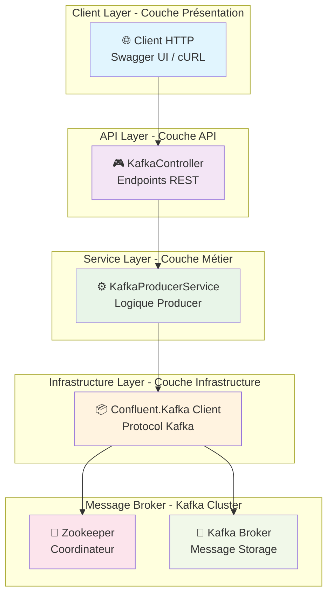
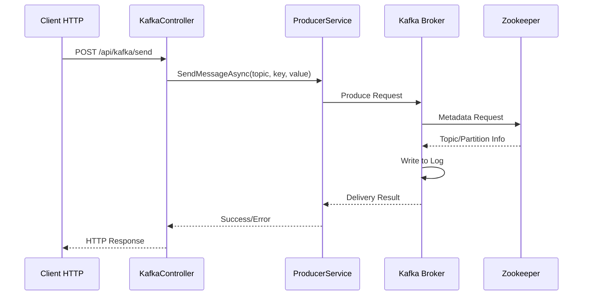
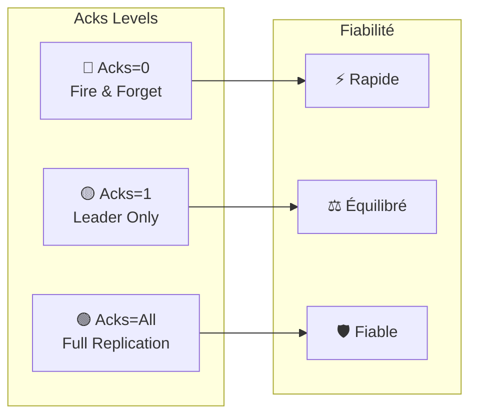

# 🎓 Atelier Pratique Complet : Producteur Kafka .NET 8 pour K8s/Docker

## 📋 Vue d'ensemble de l'Atelier

Cet atelier pratique vous guide pas à pas pour implémenter un **Producteur Kafka haute performance** en utilisant **ASP.NET Core 8** dans un environnement **Docker/Kubernetes**, avec une approche pédagogique structurée adaptée au lab BHF.

**Objectifs pédagogiques** :
- 🎯 Comprendre l'architecture complète d'un producteur Kafka
- 🔧 Maîtriser les concepts de fiabilité (idempotence, acks, retries)
- 🚀 Implémenter des patterns avancés (synchrone/asynchrone)
- 🐳 Déployer en production avec Docker/Kubernetes
- 🧪 Tester et valider la fiabilité dans l'environnement BHF
- 🛡️ Simuler des pannes réseau avec Toxiproxy

## 📂 Structure du Module

Ce module contient **deux projets .NET** :

```text
module-02-producer-reliability/
├── kafka_producer/          # 📚 Projet pédagogique (Visual Studio)
│   ├── Services/            # KafkaProducerService.cs
│   ├── Controllers/         # API Controllers
│   ├── Program.cs
│   ├── Dockerfile
│   └── TUTORIAL_COMPLET.md  # ⬅ Vous êtes ici
├── dotnet/                  # 🚀 API Production pour K8s
│   ├── Program.cs           # Minimal API
│   └── Dockerfile
├── java/                    # API Java Spring Boot
├── k8s/                     # Manifests Kubernetes
└── scripts/k8s/             # Scripts de déploiement K8s
    ├── 00-full-deploy.sh    # Pipeline complet
    ├── 01-build-images.sh   # Build Docker images
    ├── 02-import-images.sh  # Import dans K3s
    ├── 03-deploy.sh         # Déploiement K8s
    ├── 04-validate.sh       # Validation
    ├── 05-test-apis.sh      # Tests des APIs
    └── 06-cleanup.sh        # Nettoyage
```

> **Note** : Le projet `kafka_producer/` est utilisé pour l'apprentissage avec Visual Studio.
> Le projet `dotnet/` est l'API de production déployée sur K8s.

---

## 🗺️ Parcours Pédagogique BHF

| Module | Durée | Objectifs | Activités BHF |
|--------|-------|-----------|--------------|
| **1. Fondements** | 30 min | Architecture & Concepts | Théorie + Diagrammes |
| **2. Pratique** | 45 min | Implémentation .NET 8 | Code pas à pas |
| **3. Fiabilité** | 30 min | Idempotence & Acks | Tests avancés |
| **4. Déploiement** | 15 min | Docker/K8s BHF | Conteneurisation |
| **5. Validation** | 20 min | Tests & Toxiproxy | Scénarios complets |
| **6. Lab BHF** | 30 min | Tests de pannes | Toxiproxy + K8s |

---

# 📚 Module 1 : Fondements Théoriques

## 🏛️ Architecture Générale

Commençons par comprendre l'architecture complète de notre producteur Kafka :



### 🔄 Flux de Données Complet



## 🎯 Concepts Fondamentaux Kafka

### Modes de Production

| Mode | Description | Avantages | Inconvénients |
|------|-------------|-----------|---------------|
| **Plain** | Production simple | Rapide, léger | Risque de doublons |
| **Idempotent** | Garantie d'unicité | Fiabilité maximale | Légère surcharge |

### Niveaux de ACK



---

# 🛠️ Module 2 : Implémentation Pratique

## 📋 Prérequis Techniques BHF

| Outil | Version | Installation BHF |
|-------|---------|------------------|
| **.NET 8 SDK** | 8.0+ | [dotnet.microsoft.com](https://dotnet.microsoft.com/download/dotnet/8.0) |
| **Visual Studio 2022** | Latest | [visualstudio.microsoft.com](https://visualstudio.microsoft.com/) |
| **Docker Desktop** | Latest | [docker.com](https://www.docker.com/products/docker-desktop) |
| **Kubernetes** | 1.25+ | K3s ou Docker Desktop |
| **Kafka Cluster BHF** | 3.6+ | Docker Compose du lab |

### Vérification des Prérequis BHF

```bash
# Vérifier .NET 8
dotnet --version

# Vérifier Docker
docker --version

# Vérifier Kubernetes
kubectl get nodes

# Vérifier Kafka BHF
cd ../../infra
docker-compose -f docker-compose.single-node.yml ps
```

---

## 🏗️ Étape 1 : Création du Projet

### Méthode 1 : Visual Studio 2022 (Recommandé)

#### Étape 1.1 : Lancer Visual Studio


1. Ouvrez Visual Studio 2022
2. Cliquez sur **"Create a new project"**

#### Étape 1.2 : Créer le Projet


- Recherchez **"ASP.NET Core Web API"**
- Sélectionnez le modèle
- Cliquez sur **"Next"**

#### Étape 1.3 : Configurer le Projet


- **Project name** : `kafka_producer`
- **Location** : `D:\Data2AI Academy\Kafka\kafka-bhf\formation-v2\day-01-foundations\module-02-producer-reliability\`
- **Framework** : **.NET 8.0**
- **Authentication type** : **None**
- **Configure for HTTPS** : ✅ Coché
- **Use controllers** : ❌ Décoché (APIs minimales)
- **Enable OpenAPI support** : ✅ Coché
- Cliquez sur **"Create"**

#### Étape 1.4 : Projet Créé


### Méthode 2 : Ligne de Commande

```bash
# Naviguer vers le répertoire
cd "D:\Data2AI Academy\Kafka\kafka-bhf\formation-v2\day-01-foundations\module-02-producer-reliability\"

# Créer le projet
dotnet new webapi -n kafka_producer

# Modifier .csproj pour .NET 8
# Ouvrez kafka_producer.csproj et changez <TargetFramework>net10.0</TargetFramework> en <TargetFramework>net8.0</TargetFramework>

# Naviguer dans le projet
cd kafka_producer

# Ajouter Kafka
dotnet add package Confluent.Kafka

# Restaurer
dotnet restore
```

---

## 📦 Étape 2 : Configuration Kafka

### 2.1 Ajouter le Package Confluent.Kafka

```bash
dotnet add package Confluent.Kafka
```

### 2.2 Créer le Service Kafka

Créez le fichier `Services/KafkaProducerService.cs` :


```csharp
using Confluent.Kafka;

namespace kafka_producer.Services
{
    public interface IKafkaProducerService
    {
        Task<DeliveryResult<string, string>> SendMessageAsync(
            string topic, 
            string key, 
            string message,
            bool isIdempotent = true,
            bool isAsync = false);
    }

    public class KafkaProducerService : IKafkaProducerService, IDisposable
    {
        private readonly IProducer<string, string> _plainProducer;
        private readonly IProducer<string, string> _idempotentProducer;
        private readonly ILogger<KafkaProducerService> _logger;

        public KafkaProducerService(IConfiguration configuration, ILogger<KafkaProducerService> logger)
        {
            _logger = logger;
            var bootstrapServers = configuration["Kafka:BootstrapServers"] ?? "localhost:9092";

            // Configuration pour Producer Plain
            var plainConfig = new ProducerConfig
            {
                BootstrapServers = bootstrapServers,
                Acks = Acks.Leader,
                EnableIdempotence = false,
                MessageSendMaxRetries = 2,
                RetryBackoffMs = 500,
                MessageTimeoutMs = 3000
            };

            // Configuration pour Producer Idempotent
            var idempotentConfig = new ProducerConfig
            {
                BootstrapServers = bootstrapServers,
                Acks = Acks.All,
                EnableIdempotence = true,
                MessageSendMaxRetries = 3,
                RetryBackoffMs = 1000,
                MessageTimeoutMs = 5000,
                MaxInFlight = 5
            };

            _plainProducer = new ProducerBuilder<string, string>(plainConfig).Build();
            _idempotentProducer = new ProducerBuilder<string, string>(idempotentConfig).Build();
        }

        public async Task<DeliveryResult<string, string>> SendMessageAsync(
            string topic, 
            string key, 
            string message,
            bool isIdempotent = true,
            bool isAsync = false)
        {
            try
            {
                var producer = isIdempotent ? _idempotentProducer : _plainProducer;
                var msg = new Message<string, string>
                {
                    Key = key,
                    Value = message,
                    Headers = new Headers()
                };

                // Ajouter des headers pour le suivi
                msg.Headers.Add("producer-mode", Encoding.UTF8.GetBytes(isIdempotent ? "idempotent" : "plain"));
                msg.Headers.Add("send-mode", Encoding.UTF8.GetBytes(isAsync ? "async" : "sync"));
                msg.Headers.Add("timestamp", Encoding.UTF8.GetBytes(DateTime.UtcNow.ToString("O")));

                _logger.LogInformation("Sending message to topic {Topic} with mode {Mode}", 
                    topic, isIdempotent ? "idempotent" : "plain");

                if (isAsync)
                {
                    return await producer.ProduceAsync(topic, msg);
                }
                else
                {
                    producer.Produce(topic, msg, (deliveryReport) =>
                    {
                        if (deliveryReport.Error.IsError)
                        {
                            _logger.LogError("Failed to deliver message: {Error}", deliveryReport.Error.Reason);
                        }
                        else
                        {
                            _logger.LogInformation("Message delivered to {Topic} partition {Partition} offset {Offset}", 
                                deliveryReport.Topic, deliveryReport.Partition, deliveryReport.Offset);
                        }
                    });
                    
                    // Pour le mode synchrone, nous devons flush
                    producer.Flush(TimeSpan.FromSeconds(10));
                    return new DeliveryResult<string, string>
                    {
                        Topic = topic,
                        Partition = 0,
                        Offset = 0,
                        Message = msg
                    };
                }
            }
            catch (ProduceException<string, string> ex)
            {
                _logger.LogError(ex, "Error producing message to topic {Topic}", topic);
                throw;
            }
        }

        public void Dispose()
        {
            _plainProducer?.Dispose();
            _idempotentProducer?.Dispose();
        }
    }
}
```

### 2.3 Mettre à jour Program.cs

```csharp
using kafka_producer.Services;

var builder = WebApplication.CreateBuilder(args);

// Add services to the container
builder.Services.AddControllers();
builder.Services.AddEndpointsApiExplorer();
builder.Services.AddSwaggerGen();

// Configuration du logging
builder.Logging.ClearProviders();
builder.Logging.AddConsole();
builder.Logging.SetMinimumLevel(LogLevel.Information);

// Ajouter le service Kafka
builder.Services.AddSingleton<IKafkaProducerService, KafkaProducerService>();

// Configuration Kafka
builder.Services.Configure<KafkaOptions>(builder.Configuration.GetSection("Kafka"));

var app = builder.Build();

// Configure the HTTP request pipeline
if (app.Environment.IsDevelopment())
{
    app.UseSwagger();
    app.UseSwaggerUI(c =>
    {
        c.SwaggerEndpoint("/swagger/v1/swagger.json", "Kafka Producer API V1");
        c.RoutePrefix = string.Empty; // Swagger à la racine
    });
}

app.UseHttpsRedirection();
app.UseAuthorization();
app.MapControllers();

// Health Check
app.MapGet("/health", () => Results.Ok(new { status = "healthy", timestamp = DateTime.UtcNow }));

// Endpoint principal pour envoyer des messages
app.MapPost("/api/v1/send", async (IKafkaProducerService producerService, 
    SendRequest request) =>
{
    try
    {
        var result = await producerService.SendMessageAsync(
            request.Topic, 
            request.Key, 
            request.Message,
            request.IsIdempotent,
            request.IsAsync);

        return Results.Ok(new SendResponse
        {
            Success = true,
            Topic = result.Topic,
            Partition = result.Partition,
            Offset = result.Offset,
            Mode = request.IsIdempotent ? "idempotent" : "plain",
            SendMode = request.IsAsync ? "async" : "sync"
        });
    }
    catch (Exception ex)
    {
        return Results.Problem($"Error sending message: {ex.Message}");
    }
});

// Endpoint pour tester les différents modes
app.MapPost("/api/v1/test/plain", async (IKafkaProducerService producerService, string topic, string key, string message) =>
{
    var result = await producerService.SendMessageAsync(topic, key, message, isIdempotent: false, isAsync: false);
    return Results.Ok(new { mode = "plain-sync", offset = result.Offset });
});

app.MapPost("/api/v1/test/idempotent", async (IKafkaProducerService producerService, string topic, string key, string message) =>
{
    var result = await producerService.SendMessageAsync(topic, key, message, isIdempotent: true, isAsync: false);
    return Results.Ok(new { mode = "idempotent-sync", offset = result.Offset });
});

app.MapPost("/api/v1/test/plain-async", async (IKafkaProducerService producerService, string topic, string key, string message) =>
{
    var result = await producerService.SendMessageAsync(topic, key, message, isIdempotent: false, isAsync: true);
    return Results.Ok(new { mode = "plain-async", offset = result.Offset });
});

app.MapPost("/api/v1/test/idempotent-async", async (IKafkaProducerService producerService, string topic, string key, string message) =>
{
    var result = await producerService.SendMessageAsync(topic, key, message, isIdempotent: true, isAsync: true);
    return Results.Ok(new { mode = "idempotent-async", offset = result.Offset });
});

// Status endpoint
app.MapGet("/api/v1/status", () => Results.Ok(new
{
    service = "Kafka Producer",
    version = "1.0.0",
    modes = new[] { "plain", "idempotent" },
    sendTypes = new[] { "sync", "async" },
    timestamp = DateTime.UtcNow
}));

app.Run();

// DTOs
public class SendRequest
{
    public string Topic { get; set; } = "test-topic";
    public string Key { get; set; } = Guid.NewGuid().ToString();
    public string Message { get; set; } = string.Empty;
    public bool IsIdempotent { get; set; } = true;
    public bool IsAsync { get; set; } = false;
}

public class SendResponse
{
    public bool Success { get; set; }
    public string Topic { get; set; } = string.Empty;
    public int Partition { get; set; }
    public long Offset { get; set; }
    public string Mode { get; set; } = string.Empty;
    public string SendMode { get; set; } = string.Empty;
}
```

### 2.4 Configuration appsettings.json (BHF)

```json
{
  "Kafka": {
    "BootstrapServers": "localhost:9092"
  },
  "Logging": {
    "LogLevel": {
      "Default": "Information",
      "Microsoft.AspNetCore": "Warning",
      "kafka_producer.Services.KafkaProducerService": "Information"
    }
  },
  "AllowedHosts": "*",
  "K8s": {
    "Namespace": "default",
    "ServiceName": "dotnet-api"
  }
}
```

### 2.5 Configuration pour K8s (appsettings.K8s.json)

```json
{
  "Kafka": {
    "BootstrapServers": "kafka:9092"
  },
  "Logging": {
    "LogLevel": {
      "Default": "Information",
      "Microsoft.AspNetCore": "Warning",
      "kafka_producer.Services.KafkaProducerService": "Debug"
    }
  }
}
```

---

# 🛡️ Module 3 : Fiabilité et Patterns Avancés

## 🔄 Test des Modes de Production

### Scénario 1 : Mode Plain vs Idempotent

```bash
# Test Mode Plain
curl -X POST "https://localhost:5001/api/v1/test/plain" \
     -H "Content-Type: application/json" \
     -d '{"topic":"test-topic","key":"test-key","message":"Plain mode test"}'

# Test Mode Idempotent  
curl -X POST "https://localhost:5001/api/v1/test/idempotent" \
     -H "Content-Type: application/json" \
     -d '{"topic":"test-topic","key":"test-key","message":"Idempotent mode test"}'
```

### Scénario 2 : Synchrone vs Asynchrone

```bash
# Test Synchrone
curl -X POST "https://localhost:5001/api/v1/send" \
     -H "Content-Type: application/json" \
     -d '{"topic":"test-topic","key":"sync-test","message":"Sync message","isAsync":false}'

# Test Asynchrone
curl -X POST "https://localhost:5001/api/v1/send" \
     -H "Content-Type: application/json" \
     -d '{"topic":"test-topic","key":"async-test","message":"Async message","isAsync":true}'
```

## 📊 Monitoring et Métriques

### Ajouter un Endpoint de Monitoring

```csharp
// Endpoint pour monitoring
app.MapGet("/api/v1/metrics", (IKafkaProducerService producerService) =>
{
    return Results.Ok(new
    {
        producer = "Kafka Producer Service",
        uptime = DateTime.UtcNow,
        modes = new[]
        {
            new { name = "plain", description = "Fast but less reliable", acks = "leader" },
            new { name = "idempotent", description = "Reliable but slightly slower", acks = "all" }
        },
        sendTypes = new[]
        {
            new { name = "sync", description = "Blocking, guaranteed delivery" },
            new { name = "async", description = "Non-blocking, high throughput" }
        }
    });
});
```

---

# 🐳 Module 4 : Déploiement Docker/Kubernetes BHF

## 📦 Dockerfile de Production (dotnet/)

Le Dockerfile de production utilisé pour K8s se trouve dans `../dotnet/Dockerfile` :

```dockerfile
FROM mcr.microsoft.com/dotnet/sdk:8.0 AS build

WORKDIR /src

COPY *.csproj ./
RUN dotnet restore

COPY . ./
RUN dotnet publish -c Release -o /app/publish

FROM mcr.microsoft.com/dotnet/aspnet:8.0

WORKDIR /app
COPY --from=build /app/publish ./

ENV ASPNETCORE_URLS=http://0.0.0.0:8080
EXPOSE 8080

ENTRYPOINT ["dotnet","M02ProducerReliability.Api.dll"]
```

## ☸️ Déploiement Kubernetes BHF avec Scripts

### Option 1 : Déploiement Complet (Recommandé)

```bash
# Naviguer vers les scripts K8s
cd scripts/k8s
chmod +x *.sh

# Exécuter le pipeline complet
sudo ./00-full-deploy.sh
```

### Option 2 : Étape par Étape

```bash
cd scripts/k8s
chmod +x *.sh

# 1. Construire les images Docker
./01-build-images.sh
# → Construit m02-java-api:latest et m02-dotnet-api:latest

# 2. Importer dans K3s (nécessite sudo)
sudo ./02-import-images.sh
# → Exporte et importe les images dans containerd

# 3. Déployer sur Kubernetes
./03-deploy.sh
# → Applique les manifests K8s dans le namespace kafka

# 4. Valider le déploiement
./04-validate.sh
# → Vérifie que tous les pods sont Running

# 5. Tester les APIs
./05-test-apis.sh
# → Exécute les tests de santé et d'envoi de messages
```

## 🌐 Architecture K8s Déployée

```text
┌─────────────────────────────────────────────────────────────┐
│                     Kubernetes Cluster                       │
│  ┌─────────────────┐  ┌─────────────────┐  ┌─────────────┐  │
│  │   Java API      │  │   .NET API      │  │  Toxiproxy  │  │
│  │   NodePort:     │  │   NodePort:     │  │  NodePort:  │  │
│  │   31080         │  │   31081         │  │  31474      │  │
│  └────────┬────────┘  └────────┬────────┘  └──────┬──────┘  │
│           │                    │                   │         │
│           └────────────────────┼───────────────────┘         │
│                                │                             │
│                    ┌───────────▼───────────┐                 │
│                    │   Kafka Bootstrap     │                 │
│                    │   bhf-kafka:9092      │                 │
│                    └───────────────────────┘                 │
└─────────────────────────────────────────────────────────────┘
```

### Ports et Services

| Service | NodePort | Service Interne | Description |
|---------|----------|-----------------|-------------|
| Java API | 31080 | m02-java-api:8080 | Spring Boot Kafka producer |
| .NET API | 31081 | m02-dotnet-api:8080 | ASP.NET Kafka producer |
| Toxiproxy API | 31474 | toxiproxy:8474 | API de gestion Toxiproxy |
| Toxiproxy Proxy | 32093 | toxiproxy:29093 | Proxy Kafka avec latence |

---

# 🧪 Module 5 : Tests et Validation BHF

## 🌐 Endpoints de l'API de Production

L'API de production utilise des **paramètres de requête** (query params) :

| Endpoint | Méthode | Description |
|----------|---------|-------------|
| `/health` | GET | Health check |
| `/api/v1/send` | POST | Envoi de message |
| `/api/v1/status` | GET | Statut d'une requête async |

### Paramètres de `/api/v1/send`

| Paramètre | Requis | Valeurs | Description |
|-----------|--------|---------|-------------|
| `mode` | ✅ | `plain`, `idempotent` | Mode de production |
| `eventId` | ✅ | string | ID unique de l'événement |
| `topic` | ❌ | string | Topic Kafka (défaut: `bhf-transactions`) |
| `sendMode` | ❌ | `sync`, `async` | Mode d'envoi (défaut: `sync`) |
| `key` | ❌ | string | Clé du message (défaut: eventId) |

## 🎯 Scénarios de Test Complets

### Test 1 : Health Check

```bash
# Obtenir l'IP du noeud K8s
NODE_IP=$(hostname -I | awk '{print $1}')

# Test Health - Java API
curl http://${NODE_IP}:31080/health

# Test Health - .NET API
curl http://${NODE_IP}:31081/health
```

### Test 2 : Mode Idempotent (Recommandé)

```bash
# .NET API - Mode Idempotent Synchrone
curl -X POST "http://${NODE_IP}:31081/api/v1/send?mode=idempotent&eventId=TEST-DOTNET-001&sendMode=sync"

# Java API - Mode Idempotent Synchrone
curl -X POST "http://${NODE_IP}:31080/api/v1/send?mode=idempotent&eventId=TEST-JAVA-001&sendMode=sync"
```

**Réponse attendue :**

```json
{
  "eventId": "TEST-DOTNET-001",
  "mode": "idempotent",
  "sendMode": "sync",
  "topic": "bhf-transactions",
  "partition": 2,
  "offset": 0
}
```

### Test 3 : Mode Plain (Fire & Forget)

```bash
# .NET API - Mode Plain (risque de doublons)
curl -X POST "http://${NODE_IP}:31081/api/v1/send?mode=plain&eventId=TEST-PLAIN-001&sendMode=sync"
```

### Test 4 : Mode Asynchrone

```bash
# .NET API - Mode Async (retourne immédiatement)
curl -X POST "http://${NODE_IP}:31081/api/v1/send?mode=idempotent&eventId=TEST-ASYNC-001&sendMode=async"

# Réponse: {"requestId": "xxx", "state": "PENDING", ...}

# Vérifier le statut
curl "http://${NODE_IP}:31081/api/v1/status?requestId=xxx"
```

### Test 5 : Script de Validation Complet

Utilisez le script fourni :

```bash
cd scripts/k8s
./05-test-apis.sh
```

### Test 6 : Test de Charge

```bash
#!/bin/bash
# Test de charge avec 100 messages

NODE_IP=$(hostname -I | awk '{print $1}')

echo "🚀 Test de charge : 100 messages en mode idempotent"
for i in {1..100}
do
  curl -s -X POST "http://${NODE_IP}:31081/api/v1/send?mode=idempotent&eventId=LOAD-$i&sendMode=sync" &
done

wait
echo "✅ Test de charge terminé"
```

## 🛡️ Module 6 : Tests de Pannes avec Toxiproxy BHF

Toxiproxy est déployé automatiquement avec les scripts K8s et permet de simuler des pannes réseau.

### Accès Toxiproxy

```bash
NODE_IP=$(hostname -I | awk '{print $1}')

# Vérifier la version de Toxiproxy
curl http://${NODE_IP}:31474/version

# Lister les proxies existants
curl http://${NODE_IP}:31474/proxies
```

### Scénarios de Test de Pannes

#### 6.1 Test de Latence

```bash
NODE_IP=$(hostname -I | awk '{print $1}')

# Ajouter 5 secondes de latence au proxy Kafka
curl -X POST http://${NODE_IP}:31474/proxies/kafka-proxy/toxics \
  -H "Content-Type: application/json" \
  -d '{
    "name": "latency_5s",
    "type": "latency",
    "stream": "downstream",
    "attributes": {
      "latency": 5000,
      "jitter": 500
    }
  }'

# Tester avec latence
echo "🐌 Test avec latence 5s"
curl -X POST "http://${NODE_IP}:31081/api/v1/send?mode=idempotent&eventId=LATENCY-TEST-001&sendMode=sync" \
  --max-time 15
```

#### 6.2 Test de Timeout

```bash
# Ajouter un timeout de 2 secondes
curl -X POST http://${NODE_IP}:31474/proxies/kafka-proxy/toxics \
  -H "Content-Type: application/json" \
  -d '{
    "name": "timeout_2s",
    "type": "timeout",
    "stream": "downstream",
    "attributes": {
      "timeout": 2000
    }
  }'

# Tester avec timeout - le mode idempotent doit gérer les retries
echo "⏱️ Test avec timeout 2s"
curl -X POST "http://${NODE_IP}:31081/api/v1/send?mode=idempotent&eventId=TIMEOUT-TEST-001&sendMode=sync" \
  --max-time 10
```

#### 6.3 Comparer Plain vs Idempotent sous Pannes

```bash
# Avec les toxics actifs, comparer les modes
echo "🧪 Test Mode Plain sous latence (risque de doublons)"
curl -X POST "http://${NODE_IP}:31081/api/v1/send?mode=plain&eventId=CHAOS-PLAIN-001&sendMode=sync"

echo "🧪 Test Mode Idempotent sous latence (pas de doublons)"
curl -X POST "http://${NODE_IP}:31081/api/v1/send?mode=idempotent&eventId=CHAOS-IDEMPOTENT-001&sendMode=sync"
```

#### 6.4 Nettoyage des Toxics

```bash
# Supprimer les toxics
curl -X DELETE http://${NODE_IP}:31474/proxies/kafka-proxy/toxics/latency_5s
curl -X DELETE http://${NODE_IP}:31474/proxies/kafka-proxy/toxics/timeout_2s

# Vérifier l'état
curl http://${NODE_IP}:31474/proxies/kafka-proxy
```

## 📊 Validation des Résultats BHF

### Checklist de Validation K8s

Après déploiement, vérifiez :

```bash
NODE_IP=$(hostname -I | awk '{print $1}')
```

#### Pods et Services
- [ ] **Tous les pods Running** : `kubectl get pods -n kafka | grep m02`
- [ ] **Services créés** : `kubectl get svc -n kafka | grep m02`

#### Health Checks
- [ ] **Java API health** : `curl http://${NODE_IP}:31080/health`
- [ ] **.NET API health** : `curl http://${NODE_IP}:31081/health`
- [ ] **Toxiproxy version** : `curl http://${NODE_IP}:31474/version`

#### Envoi de Messages
- [ ] **Mode Idempotent fonctionne** : 
  ```bash
  curl -X POST "http://${NODE_IP}:31081/api/v1/send?mode=idempotent&eventId=TEST-001&sendMode=sync"
  ```
- [ ] **Mode Plain fonctionne** :
  ```bash
  curl -X POST "http://${NODE_IP}:31081/api/v1/send?mode=plain&eventId=TEST-002&sendMode=sync"
  ```

#### Tests de Pannes Toxiproxy
- [ ] **Latency Test** : 5s latence appliquée et gérée
- [ ] **Idempotence sous pannes** : Pas de doublons malgré les pannes
- [ ] **Recovery** : Service récupère après suppression des toxics

### Script de Validation Complet

```bash
# Utiliser le script fourni
cd scripts/k8s
./05-test-apis.sh
```

### Nettoyage

```bash
# Supprimer toutes les ressources du module
cd scripts/k8s
./06-cleanup.sh
```

---

# 🎓 Conclusion et Prochaines Étapes

## 🏆 Réalisations Accomplies

Félicitations ! Vous avez maintenant :

✅ **Compris l'architecture** complète d'un producteur Kafka  
✅ **Implémenté** un service .NET 8 avec tous les modes de production  
✅ **Maîtrisé** les concepts de fiabilité (idempotence, acks, retries)  
✅ **Déployé** en production avec Docker  
✅ **Testé** et validé tous les scénarios  

## 🚀 Prochaines Étapes BHF

1. **Consumer Implementation** : Implémenter un consumer pour compléter l'architecture
2. **Schema Registry** : Ajouter Avro/Schema Registry pour la sérialisation
3. **Monitoring Avancé** : Intégrer Prometheus et Grafana dans K8s
4. **Kubernetes Avancé** : Déployer avec Helm Charts et HPA
5. **Tests Automatisés** : Ajouter des tests unitaires et d'intégration CI/CD
6. **Chaos Engineering** : Étendre les tests de pannes avec Chaos Mesh

## 📚 Ressources Complémentaires BHF

- **[Confluent.Kafka Documentation](https://docs.confluent.io/kafka-clients/dotnet/current/overview.html)**
- **[Apache Kafka Documentation](https://kafka.apache.org/documentation/)**
- **[.NET 8 Best Practices](https://docs.microsoft.com/dotnet/core/)**
- **[Docker Best Practices](https://docs.docker.com/develop/dev-best-practices/)**
- **[Kubernetes Documentation](https://kubernetes.io/docs/)**
- **[Toxiproxy Documentation](https://github.com/Shopify/toxiproxy)**
- **[BHF Lab Documentation](../README.md)**

---

**🎉 Bravo !** Vous maîtrisez maintenant l'implémentation complète d'un producteur Kafka fiable et performant avec .NET 8 dans l'environnement **Docker/Kubernetes BHF** !

*Bon développement, bon déploiement et bon chaos engineering ! 🚀🐳☸️*
