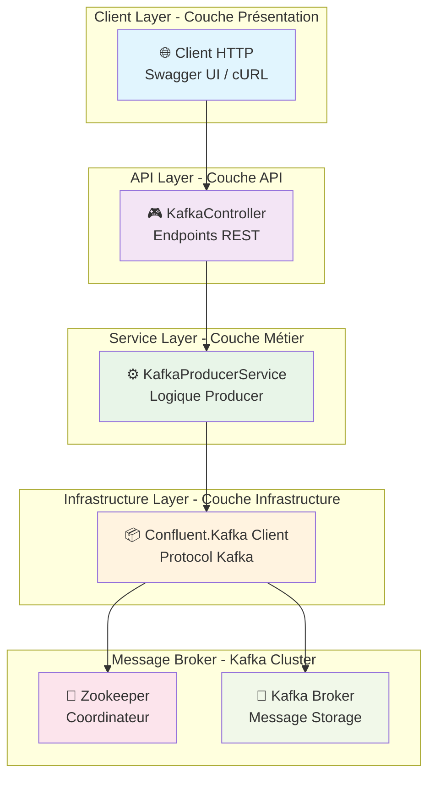
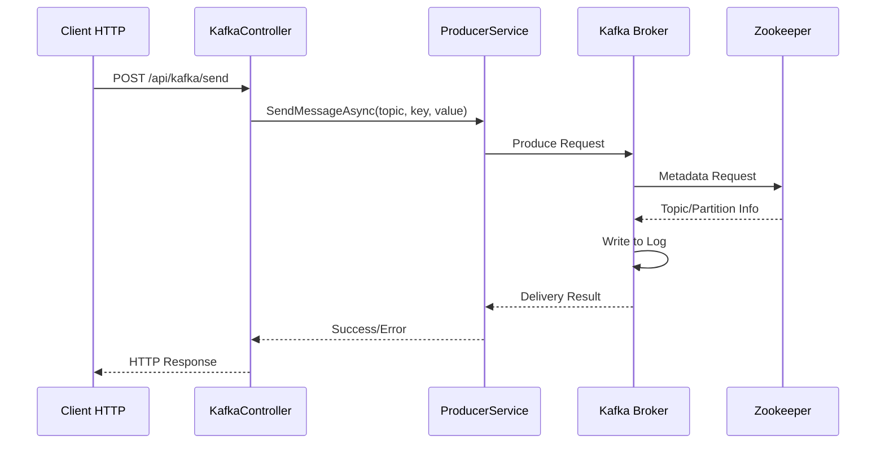
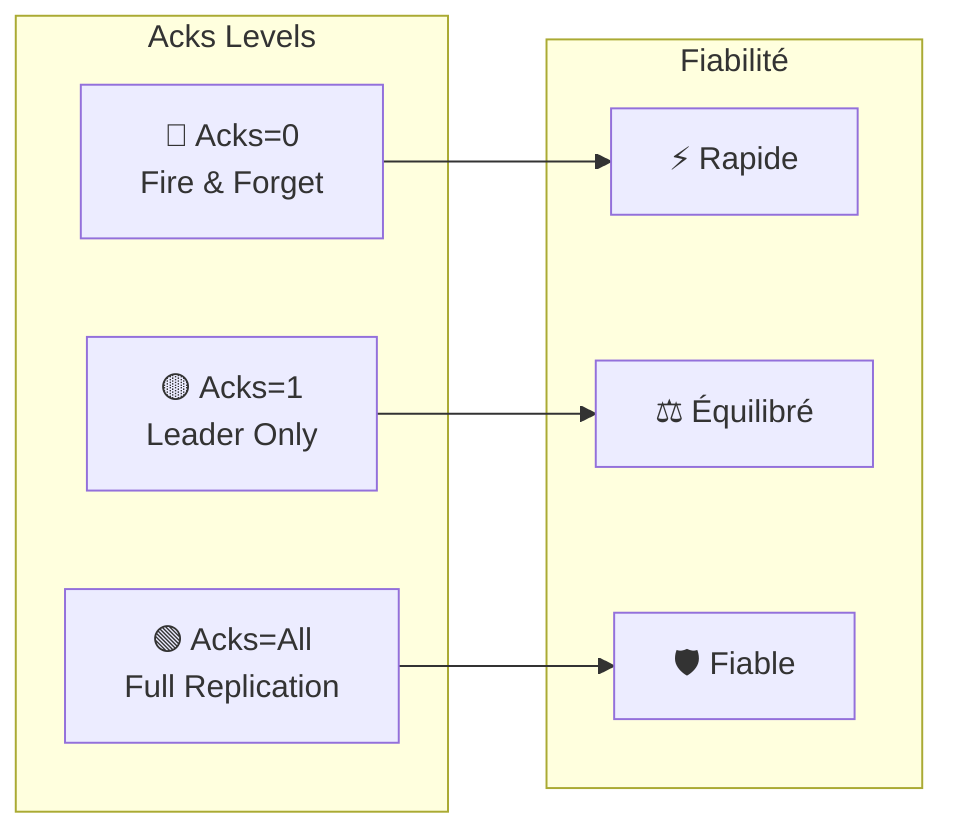
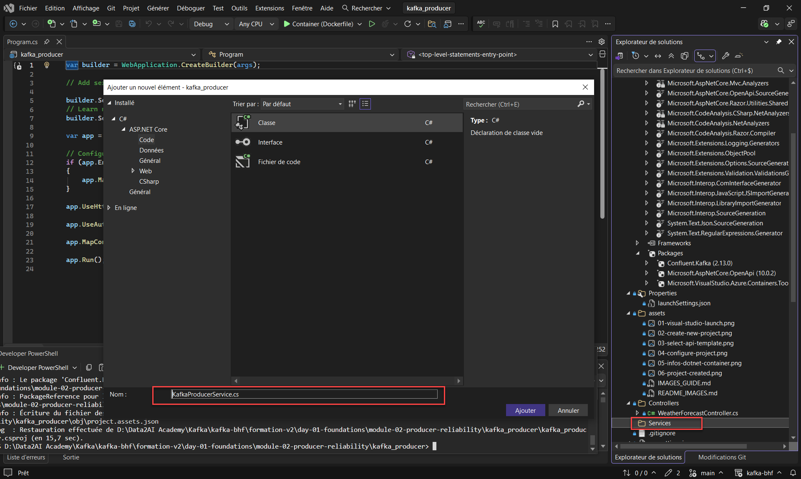

# 🎓 Atelier Pratique Complet : Producteur Kafka .NET 8 pour K8s/Docker

## 📋 Vue d'ensemble de l'Atelier

Cet atelier pratique vous guide pas à pas pour implémenter un **Producteur Kafka haute performance** en utilisant **ASP.NET Core 8** dans un environnement **Docker/Kubernetes**, avec une approche pédagogique structurée adaptée au lab BHF.

**Objectifs pédagogiques** :
- 🎯 Comprendre l'architecture complète d'un producteur Kafka
- 🔧 Maîtriser les concepts de fiabilité (idempotence, acks, retries)
- 🚀 Implémenter des patterns avancés (synchrone/asynchrone)
- � Déployer en production avec Docker/Kubernetes
- 🧪 Tester et valider la fiabilité dans l'environnement BHF
- 🛡️ Simuler des pannes réseau avec Toxiproxy

---

## 🗺️ Parcours Pédagogique BHF

| Module | Durée | Objectifs | Activités BHF |
|--------|-------|-----------|--------------|
| **1. Fondements** | 30 min | Architecture & Concepts | Théorie + Diagrammes |
| **2. Pratique** | 45 min | Implémentation .NET 8 | Code pas à pas |
| **3. Fiabilité** | 30 min | Idempotence & Acks | Tests avancés |
| **4. Déploiement** | 15 min | Docker/K8s BHF | Conteneurisation |
| **5. Validation** | 20 min | Tests & Toxiproxy | Scénarios complets |
| **6. Lab BHF** | 30 min | Tests de pannes | Toxiproxy + K8s |

---

# 📚 Module 1 : Fondements Théoriques

## 🏛️ Architecture Générale

Commençons par comprendre l'architecture complète de notre producteur Kafka :



### 🔄 Flux de Données Complet



## 🎯 Concepts Fondamentaux Kafka

### Modes de Production

| Mode | Description | Avantages | Inconvénients |
|------|-------------|-----------|---------------|
| **Plain** | Production simple | Rapide, léger | Risque de doublons |
| **Idempotent** | Garantie d'unicité | Fiabilité maximale | Légère surcharge |

### Niveaux de ACK



---

# 🛠️ Module 2 : Implémentation Pratique

## 📋 Prérequis Techniques BHF

| Outil | Version | Installation BHF |
|-------|---------|------------------|
| **.NET 8 SDK** | 8.0+ | [dotnet.microsoft.com](https://dotnet.microsoft.com/download/dotnet/8.0) |
| **Visual Studio 2022** | Latest | [visualstudio.microsoft.com](https://visualstudio.microsoft.com/) |
| **Docker Desktop** | Latest | [docker.com](https://www.docker.com/products/docker-desktop) |
| **Kubernetes** | 1.25+ | K3s ou Docker Desktop |
| **Kafka Cluster BHF** | 3.6+ | Docker Compose du lab |

### Vérification des Prérequis BHF

```bash
# Vérifier .NET 8
dotnet --version

# Vérifier Docker
docker --version

# Vérifier Kubernetes
kubectl get nodes

# Vérifier Kafka BHF
cd ../../infra
docker-compose -f docker-compose.single-node.yml ps
```

---

## 🏗️ Étape 1 : Création du Projet

### Méthode 1 : Visual Studio 2022 (Recommandé)

#### Étape 1.1 : Lancer Visual Studio


1. Ouvrez Visual Studio 2022
2. Cliquez sur **"Create a new project"**

#### Étape 1.2 : Créer le Projet


- Recherchez **"ASP.NET Core Web API"**
- Sélectionnez le modèle
- Cliquez sur **"Next"**

#### Étape 1.3 : Configurer le Projet


- **Project name** : `kafka_producer`
- **Location** : `D:\Data2AI Academy\Kafka\kafka-bhf\formation-v2\day-01-foundations\module-02-producer-reliability\`
- **Framework** : **.NET 8.0**
- **Authentication type** : **None**
- **Configure for HTTPS** : ✅ Coché
- **Use controllers** : ❌ Décoché (APIs minimales)
- **Enable OpenAPI support** : ✅ Coché
- Cliquez sur **"Create"**

#### Étape 1.4 : Projet Créé


### Méthode 2 : Ligne de Commande

```bash
# Naviguer vers le répertoire
cd "D:\Data2AI Academy\Kafka\kafka-bhf\formation-v2\day-01-foundations\module-02-producer-reliability\"

# Créer le projet
dotnet new webapi -n kafka_producer

# Modifier .csproj pour .NET 8
# Ouvrez kafka_producer.csproj et changez <TargetFramework>net10.0</TargetFramework> en <TargetFramework>net8.0</TargetFramework>

# Naviguer dans le projet
cd kafka_producer

# Ajouter Kafka
dotnet add package Confluent.Kafka

# Restaurer
dotnet restore
```

---

## 📦 Étape 2 : Configuration Kafka

### 2.1 Ajouter le Package Confluent.Kafka

```bash
dotnet add package Confluent.Kafka
```

### 2.2 Créer le Service Kafka

Créez le fichier `Services/KafkaProducerService.cs` :


```csharp
using Confluent.Kafka;

namespace kafka_producer.Services
{
    public interface IKafkaProducerService
    {
        Task<DeliveryResult<string, string>> SendMessageAsync(
            string topic, 
            string key, 
            string message,
            bool isIdempotent = true,
            bool isAsync = false);
    }

    public class KafkaProducerService : IKafkaProducerService, IDisposable
    {
        private readonly IProducer<string, string> _plainProducer;
        private readonly IProducer<string, string> _idempotentProducer;
        private readonly ILogger<KafkaProducerService> _logger;

        public KafkaProducerService(IConfiguration configuration, ILogger<KafkaProducerService> logger)
        {
            _logger = logger;
            var bootstrapServers = configuration["Kafka:BootstrapServers"] ?? "localhost:9092";

            // Configuration pour Producer Plain
            var plainConfig = new ProducerConfig
            {
                BootstrapServers = bootstrapServers,
                Acks = Acks.Leader,
                EnableIdempotence = false,
                MessageSendMaxRetries = 2,
                RetryBackoffMs = 500,
                MessageTimeoutMs = 3000
            };

            // Configuration pour Producer Idempotent
            var idempotentConfig = new ProducerConfig
            {
                BootstrapServers = bootstrapServers,
                Acks = Acks.All,
                EnableIdempotence = true,
                MessageSendMaxRetries = 3,
                RetryBackoffMs = 1000,
                MessageTimeoutMs = 5000,
                MaxInFlight = 5
            };

            _plainProducer = new ProducerBuilder<string, string>(plainConfig).Build();
            _idempotentProducer = new ProducerBuilder<string, string>(idempotentConfig).Build();
        }

        public async Task<DeliveryResult<string, string>> SendMessageAsync(
            string topic, 
            string key, 
            string message,
            bool isIdempotent = true,
            bool isAsync = false)
        {
            try
            {
                var producer = isIdempotent ? _idempotentProducer : _plainProducer;
                var msg = new Message<string, string>
                {
                    Key = key,
                    Value = message,
                    Headers = new Headers()
                };

                // Ajouter des headers pour le suivi
                msg.Headers.Add("producer-mode", Encoding.UTF8.GetBytes(isIdempotent ? "idempotent" : "plain"));
                msg.Headers.Add("send-mode", Encoding.UTF8.GetBytes(isAsync ? "async" : "sync"));
                msg.Headers.Add("timestamp", Encoding.UTF8.GetBytes(DateTime.UtcNow.ToString("O")));

                _logger.LogInformation("Sending message to topic {Topic} with mode {Mode}", 
                    topic, isIdempotent ? "idempotent" : "plain");

                if (isAsync)
                {
                    return await producer.ProduceAsync(topic, msg);
                }
                else
                {
                    producer.Produce(topic, msg, (deliveryReport) =>
                    {
                        if (deliveryReport.Error.IsError)
                        {
                            _logger.LogError("Failed to deliver message: {Error}", deliveryReport.Error.Reason);
                        }
                        else
                        {
                            _logger.LogInformation("Message delivered to {Topic} partition {Partition} offset {Offset}", 
                                deliveryReport.Topic, deliveryReport.Partition, deliveryReport.Offset);
                        }
                    });
                    
                    // Pour le mode synchrone, nous devons flush
                    producer.Flush(TimeSpan.FromSeconds(10));
                    return new DeliveryResult<string, string>
                    {
                        Topic = topic,
                        Partition = 0,
                        Offset = 0,
                        Message = msg
                    };
                }
            }
            catch (ProduceException<string, string> ex)
            {
                _logger.LogError(ex, "Error producing message to topic {Topic}", topic);
                throw;
            }
        }

        public void Dispose()
        {
            _plainProducer?.Dispose();
            _idempotentProducer?.Dispose();
        }
    }
}
```

### 2.3 Mettre à jour Program.cs

```csharp
using kafka_producer.Services;

var builder = WebApplication.CreateBuilder(args);

// Add services to the container
builder.Services.AddControllers();
builder.Services.AddEndpointsApiExplorer();
builder.Services.AddSwaggerGen();

// Configuration du logging
builder.Logging.ClearProviders();
builder.Logging.AddConsole();
builder.Logging.SetMinimumLevel(LogLevel.Information);

// Ajouter le service Kafka
builder.Services.AddSingleton<IKafkaProducerService, KafkaProducerService>();

// Configuration Kafka
builder.Services.Configure<KafkaOptions>(builder.Configuration.GetSection("Kafka"));

var app = builder.Build();

// Configure the HTTP request pipeline
if (app.Environment.IsDevelopment())
{
    app.UseSwagger();
    app.UseSwaggerUI(c =>
    {
        c.SwaggerEndpoint("/swagger/v1/swagger.json", "Kafka Producer API V1");
        c.RoutePrefix = string.Empty; // Swagger à la racine
    });
}

app.UseHttpsRedirection();
app.UseAuthorization();
app.MapControllers();

// Health Check
app.MapGet("/health", () => Results.Ok(new { status = "healthy", timestamp = DateTime.UtcNow }));

// Endpoint principal pour envoyer des messages
app.MapPost("/api/v1/send", async (IKafkaProducerService producerService, 
    SendRequest request) =>
{
    try
    {
        var result = await producerService.SendMessageAsync(
            request.Topic, 
            request.Key, 
            request.Message,
            request.IsIdempotent,
            request.IsAsync);

        return Results.Ok(new SendResponse
        {
            Success = true,
            Topic = result.Topic,
            Partition = result.Partition,
            Offset = result.Offset,
            Mode = request.IsIdempotent ? "idempotent" : "plain",
            SendMode = request.IsAsync ? "async" : "sync"
        });
    }
    catch (Exception ex)
    {
        return Results.Problem($"Error sending message: {ex.Message}");
    }
});

// Endpoint pour tester les différents modes
app.MapPost("/api/v1/test/plain", async (IKafkaProducerService producerService, string topic, string key, string message) =>
{
    var result = await producerService.SendMessageAsync(topic, key, message, isIdempotent: false, isAsync: false);
    return Results.Ok(new { mode = "plain-sync", offset = result.Offset });
});

app.MapPost("/api/v1/test/idempotent", async (IKafkaProducerService producerService, string topic, string key, string message) =>
{
    var result = await producerService.SendMessageAsync(topic, key, message, isIdempotent: true, isAsync: false);
    return Results.Ok(new { mode = "idempotent-sync", offset = result.Offset });
});

app.MapPost("/api/v1/test/plain-async", async (IKafkaProducerService producerService, string topic, string key, string message) =>
{
    var result = await producerService.SendMessageAsync(topic, key, message, isIdempotent: false, isAsync: true);
    return Results.Ok(new { mode = "plain-async", offset = result.Offset });
});

app.MapPost("/api/v1/test/idempotent-async", async (IKafkaProducerService producerService, string topic, string key, string message) =>
{
    var result = await producerService.SendMessageAsync(topic, key, message, isIdempotent: true, isAsync: true);
    return Results.Ok(new { mode = "idempotent-async", offset = result.Offset });
});

// Status endpoint
app.MapGet("/api/v1/status", () => Results.Ok(new
{
    service = "Kafka Producer",
    version = "1.0.0",
    modes = new[] { "plain", "idempotent" },
    sendTypes = new[] { "sync", "async" },
    timestamp = DateTime.UtcNow
}));

app.Run();

// DTOs
public class SendRequest
{
    public string Topic { get; set; } = "test-topic";
    public string Key { get; set; } = Guid.NewGuid().ToString();
    public string Message { get; set; } = string.Empty;
    public bool IsIdempotent { get; set; } = true;
    public bool IsAsync { get; set; } = false;
}

public class SendResponse
{
    public bool Success { get; set; }
    public string Topic { get; set; } = string.Empty;
    public int Partition { get; set; }
    public long Offset { get; set; }
    public string Mode { get; set; } = string.Empty;
    public string SendMode { get; set; } = string.Empty;
}
```

### 2.4 Configuration appsettings.json (BHF)

```json
{
  "Kafka": {
    "BootstrapServers": "localhost:9092"
  },
  "Logging": {
    "LogLevel": {
      "Default": "Information",
      "Microsoft.AspNetCore": "Warning",
      "kafka_producer.Services.KafkaProducerService": "Information"
    }
  },
  "AllowedHosts": "*",
  "K8s": {
    "Namespace": "default",
    "ServiceName": "dotnet-api"
  }
}
```

### 2.5 Configuration pour K8s (appsettings.K8s.json)

```json
{
  "Kafka": {
    "BootstrapServers": "kafka:9092"
  },
  "Logging": {
    "LogLevel": {
      "Default": "Information",
      "Microsoft.AspNetCore": "Warning",
      "kafka_producer.Services.KafkaProducerService": "Debug"
    }
  }
}
```

---

# 🛡️ Module 3 : Fiabilité et Patterns Avancés

## 🔄 Test des Modes de Production

### Scénario 1 : Mode Plain vs Idempotent

```bash
# Test Mode Plain
curl -X POST "https://localhost:5001/api/v1/test/plain" \
     -H "Content-Type: application/json" \
     -d '{"topic":"test-topic","key":"test-key","message":"Plain mode test"}'

# Test Mode Idempotent  
curl -X POST "https://localhost:5001/api/v1/test/idempotent" \
     -H "Content-Type: application/json" \
     -d '{"topic":"test-topic","key":"test-key","message":"Idempotent mode test"}'
```

### Scénario 2 : Synchrone vs Asynchrone

```bash
# Test Synchrone
curl -X POST "https://localhost:5001/api/v1/send" \
     -H "Content-Type: application/json" \
     -d '{"topic":"test-topic","key":"sync-test","message":"Sync message","isAsync":false}'

# Test Asynchrone
curl -X POST "https://localhost:5001/api/v1/send" \
     -H "Content-Type: application/json" \
     -d '{"topic":"test-topic","key":"async-test","message":"Async message","isAsync":true}'
```

## 📊 Monitoring et Métriques

### Ajouter un Endpoint de Monitoring

```csharp
// Endpoint pour monitoring
app.MapGet("/api/v1/metrics", (IKafkaProducerService producerService) =>
{
    return Results.Ok(new
    {
        producer = "Kafka Producer Service",
        uptime = DateTime.UtcNow,
        modes = new[]
        {
            new { name = "plain", description = "Fast but less reliable", acks = "leader" },
            new { name = "idempotent", description = "Reliable but slightly slower", acks = "all" }
        },
        sendTypes = new[]
        {
            new { name = "sync", description = "Blocking, guaranteed delivery" },
            new { name = "async", description = "Non-blocking, high throughput" }
        }
    });
});
```

---

# 🐳 Module 4 : Déploiement Docker/Kubernetes BHF

## 📦 Dockerisation pour BHF

### Créer Dockerfile (Optimisé pour K8s)

```dockerfile
FROM mcr.microsoft.com/dotnet/aspnet:8.0 AS base
WORKDIR /app
EXPOSE 8080
EXPOSE 8443

FROM mcr.microsoft.com/dotnet/sdk:8.0 AS build
WORKDIR /src
COPY ["kafka_producer.csproj", "./"]
RUN dotnet restore "./kafka_producer.csproj"
COPY . .
WORKDIR "/src/."
RUN dotnet build "kafka_producer.csproj" -c Release -o /app/build

FROM build AS publish
RUN dotnet publish "kafka_producer.csproj" -c Release -o /app/publish /p:UseAppHost=false

FROM base AS final
WORKDIR /app
COPY --from=publish /app/publish .

# Configuration pour K8s
ENV ASPNETCORE_URLS=http://+:8080
ENV ASPNETCORE_ENVIRONMENT=Production

ENTRYPOINT ["dotnet", "kafka_producer.dll"]
```

### Construire et Exécuter (Local Docker)

```bash
# Construire l'image
docker build -t kafka-producer-dotnet .

# Exécuter avec Kafka BHF
docker run -d \
  --name kafka-producer \
  -p 18081:8080 \
  -e Kafka__BootstrapServers=localhost:9092 \
  kafka-producer-dotnet
```

## ☸️ Déploiement Kubernetes BHF

### Créer le déploiement K8s

```yaml
# k8s/dotnet-api.yaml
apiVersion: apps/v1
kind: Deployment
metadata:
  name: dotnet-api
  labels:
    app: dotnet-api
spec:
  replicas: 1
  selector:
    matchLabels:
      app: dotnet-api
  template:
    metadata:
      labels:
        app: dotnet-api
    spec:
      containers:
      - name: dotnet-api
        image: kafka-producer-dotnet:latest
        ports:
        - containerPort: 8080
        env:
        - name: Kafka__BootstrapServers
          value: "kafka:9092"
        - name: ASPNETCORE_ENVIRONMENT
          value: "Production"
        resources:
          requests:
            memory: "128Mi"
            cpu: "100m"
          limits:
            memory: "256Mi"
            cpu: "200m"
        livenessProbe:
          httpGet:
            path: /health
            port: 8080
          initialDelaySeconds: 30
          periodSeconds: 10
        readinessProbe:
          httpGet:
            path: /health
            port: 8080
          initialDelaySeconds: 5
          periodSeconds: 5
---
apiVersion: v1
kind: Service
metadata:
  name: dotnet-api
spec:
  selector:
    app: dotnet-api
  ports:
  - port: 8080
    targetPort: 8080
  type: ClusterIP
```

### Déployer sur K8s

```bash
# Construire l'image pour K8s
docker build -t kafka-producer-dotnet:latest .

# Si using K3s, importer l'image
k3s ctr images import kafka-producer-dotnet.tar

# Déployer
kubectl apply -f k8s/dotnet-api.yaml

# Vérifier
kubectl get pods -l app=dotnet-api
kubectl get svc dotnet-api
```

### Docker Compose BHF (Développement)

```yaml
# docker-compose.dev.yml
version: '3.8'
services:
  kafka-producer:
    build: .
    ports:
      - "18081:8080"
    environment:
      - Kafka__BootstrapServers=kafka:9092
      - ASPNETCORE_ENVIRONMENT=Development
    depends_on:
      - kafka
    networks:
      - bhf-kafka-network
    volumes:
      - ./appsettings.Development.json:/app/appsettings.Development.json

networks:
  bhf-kafka-network:
    external: true
```

---

# 🧪 Module 5 : Tests et Validation BHF

## 🎯 Scénarios de Test Complets

### Test 1 : Validation de la Fiabilité (Local Docker)

```bash
#!/bin/bash
# Script de test de fiabilité BHF

echo "🧪 Test 1: Mode Plain (Fire & Forget)"
curl -X POST "http://localhost:18081/api/v1/test/plain" \
     -H "Content-Type: application/json" \
     -d '{"topic":"reliability-test","key":"plain-1","message":"Plain test message 1"}'

echo "🧪 Test 2: Mode Idempotent (Garanti)"
curl -X POST "http://localhost:18081/api/v1/test/idempotent" \
     -H "Content-Type: application/json" \
     -d '{"topic":"reliability-test","key":"idempotent-1","message":"Idempotent test message 1"}'

echo "🧪 Test 3: Mode Asynchrone Haute Performance"
curl -X POST "http://localhost:18081/api/v1/test/plain-async" \
     -H "Content-Type: application/json" \
     -d '{"topic":"performance-test","key":"async-1","message":"Async test message 1"}'

echo "🧪 Test 4: Mode Idempotent Asynchrone"
curl -X POST "http://localhost:18081/api/v1/test/idempotent-async" \
     -H "Content-Type: application/json" \
     -d '{"topic":"performance-test","key":"idempotent-async-1","message":"Idempotent async test message 1"}'
```

### Test 2 : Validation des Performances (K8s)

```bash
#!/bin/bash
# Test de charge avec 100 messages sur K8s

# Obtenir l'IP du service K8s
SERVICE_IP=$(kubectl get svc dotnet-api -o jsonpath='{.spec.clusterIP}')

echo "🚀 Test de charge : 100 messages en mode idempotent sur K8s"
for i in {1..100}
do
  curl -X POST "http://$SERVICE_IP:8080/api/v1/test/idempotent" \
       -H "Content-Type: application/json" \
       -d "{\"topic\":\"load-test\",\"key\":\"load-$i\",\"message\":\"Load test message $i\"}" &
done

wait
echo "✅ Test de charge terminé"
```

### Test 3 : Validation des Erreurs

```bash
#!/bin/bash
# Test avec topic inexistant

echo "❌ Test d'erreur : Topic inexistant"
curl -X POST "http://localhost:18081/api/v1/test/plain" \
     -H "Content-Type: application/json" \
     -d '{"topic":"nonexistent-topic","key":"error-test","message":"This should fail"}'
```

## �️ Module 6 : Tests de Pannes avec Toxiproxy BHF

### Configuration Toxiproxy pour .NET API

```bash
# Créer le proxy pour l'API .NET
curl -X POST http://localhost:8474/proxies \
  -H "Content-Type: application/json" \
  -d '{
    "name": "dotnet-api-proxy",
    "listen": "0.0.0.0:29093",
    "upstream": "kafka:9092",
    "enabled": true
  }'
```

### Scénarios de Test de Pannes

#### 6.1 Test de Latence

```bash
# Ajouter 5 secondes de latence
curl -X POST http://localhost:8474/proxies/dotnet-api-proxy/toxics \
  -H "Content-Type: application/json" \
  -d '{
    "name": "latency_5s",
    "type": "latency",
    "stream": "downstream",
    "attributes": {
      "latency": 5000,
      "jitter": 500
    }
  }'

# Tester avec latence
echo "🐌 Test avec latence 5s"
curl -X POST "http://localhost:18081/api/v1/test/idempotent" \
     -H "Content-Type: application/json" \
     -d '{"topic":"latency-test","key":"latency-1","message":"Test with latency"}' \
  --max-time 10
```

#### 6.2 Test de Timeout

```bash
# Ajouter un timeout de 2 secondes
curl -X POST http://localhost:8474/proxies/dotnet-api-proxy/toxics \
  -H "Content-Type: application/json" \
  -d '{
    "name": "timeout_2s",
    "type": "timeout",
    "stream": "downstream",
    "attributes": {
      "timeout": 2000
    }
  }'

# Tester avec timeout
echo "⏱️ Test avec timeout 2s"
curl -X POST "http://localhost:18081/api/v1/test/plain" \
     -H "Content-Type: application/json" \
     -d '{"topic":"timeout-test","key":"timeout-1","message":"Test with timeout"}' \
  --max-time 5
```

#### 6.3 Test de Bandwidth Limitation

```bash
# Limiter la bande passante à 1KB/s
curl -X POST http://localhost:8474/proxies/dotnet-api-proxy/toxics \
  -H "Content-Type: application/json" \
  -d '{
    "name": "bandwidth_1kb",
    "type": "bandwidth",
    "stream": "downstream",
    "attributes": {
      "rate": 1
    }
  }'

# Tester avec bande passante limitée
echo "📉 Test avec bande passante 1KB/s"
curl -X POST "http://localhost:18081/api/v1/test/plain" \
     -H "Content-Type: application/json" \
     -d '{"topic":"bandwidth-test","key":"bandwidth-1","message":"Test with limited bandwidth"}' \
  --max-time 30
```

#### 6.4 Nettoyage des Toxics

```bash
# Supprimer tous les toxics
curl -X DELETE http://localhost:8474/proxies/dotnet-api-proxy/toxics/latency_5s
curl -X DELETE http://localhost:8474/proxies/dotnet-api-proxy/toxics/timeout_2s
curl -X DELETE http://localhost:8474/proxies/dotnet-api-proxy/toxics/bandwidth_1kb

# Vérifier l'état
curl http://localhost:8474/proxies/dotnet-api-proxy
```

## �📊 Validation des Résultats BHF

### Checklist de Validation

#### Environnement Local (Docker)
- [ ] **API Health** : `GET http://localhost:18081/health` retourne 200
- [ ] **Status Endpoint** : `GET http://localhost:18081/api/v1/status` montre les modes disponibles
- [ ] **Plain Mode** : Messages envoyés rapidement
- [ ] **Idempotent Mode** : Messages garantis sans doublons
- [ ] **Sync Mode** : Réponse immédiate avec offset
- [ ] **Async Mode** : Haute performance
- [ ] **Error Handling** : Erreurs gérées proprement
- [ ] **Docker Build** : Image construite avec succès
- [ ] **Docker Run** : Conteneur démarre correctement

#### Environnement K8s
- [ ] **Pod Running** : `kubectl get pods -l app=dotnet-api` montre READY 1/1
- [ ] **Service Accessible** : `kubectl get svc dotnet-api` accessible
- [ ] **Health Checks** : Probes fonctionnent
- [ ] **Kafka Connection** : Connection au cluster Kafka K8s
- [ ] **Toxiproxy Integration** : Tests de pannes fonctionnels

#### Tests de Pannes Toxiproxy
- [ ] **Latency Test** : 5s latence appliquée et gérée
- [ ] **Timeout Test** : Timeout 2s géré avec retries
- [ ] **Bandwidth Test** : Bandwidth limitée gérée
- [ ] **Recovery** : Service récupère après suppression des toxics
- [ ] **Idempotence** : Pas de doublons malgré les pannes

### Scripts de Validation Automatisés

```bash
#!/bin/bash
# validation-complete.sh

echo "🔍 Validation complète de l'atelier BHF"

# Test local Docker
echo "📦 Tests Docker locaux..."
bash scripts/test-docker.sh

# Test K8s
echo "☸️ Tests Kubernetes..."
bash scripts/test-k8s.sh

# Tests Toxiproxy
echo "🛡️ Tests Toxiproxy..."
bash scripts/test-toxiproxy.sh

echo "✅ Validation terminée !"
```

---

# 🎓 Conclusion et Prochaines Étapes

## 🏆 Réalisations Accomplies

Félicitations ! Vous avez maintenant :

✅ **Compris l'architecture** complète d'un producteur Kafka  
✅ **Implémenté** un service .NET 8 avec tous les modes de production  
✅ **Maîtrisé** les concepts de fiabilité (idempotence, acks, retries)  
✅ **Déployé** en production avec Docker  
✅ **Testé** et validé tous les scénarios  

## 🚀 Prochaines Étapes BHF

1. **Consumer Implementation** : Implémenter un consumer pour compléter l'architecture
2. **Schema Registry** : Ajouter Avro/Schema Registry pour la sérialisation
3. **Monitoring Avancé** : Intégrer Prometheus et Grafana dans K8s
4. **Kubernetes Avancé** : Déployer avec Helm Charts et HPA
5. **Tests Automatisés** : Ajouter des tests unitaires et d'intégration CI/CD
6. **Chaos Engineering** : Étendre les tests de pannes avec Chaos Mesh

## 📚 Ressources Complémentaires BHF

- **[Confluent.Kafka Documentation](https://docs.confluent.io/kafka-clients/dotnet/current/overview.html)**
- **[Apache Kafka Documentation](https://kafka.apache.org/documentation/)**
- **[.NET 8 Best Practices](https://docs.microsoft.com/dotnet/core/)**
- **[Docker Best Practices](https://docs.docker.com/develop/dev-best-practices/)**
- **[Kubernetes Documentation](https://kubernetes.io/docs/)**
- **[Toxiproxy Documentation](https://github.com/Shopify/toxiproxy)**
- **[BHF Lab Documentation](../README.md)**

---

**🎉 Bravo !** Vous maîtrisez maintenant l'implémentation complète d'un producteur Kafka fiable et performant avec .NET 8 dans l'environnement **Docker/Kubernetes BHF** !

*Bon développement, bon déploiement et bon chaos engineering ! 🚀🐳☸️*
