# 🎓 Atelier Pratique Complet : Producteur Kafka .NET 8 avec Architecture Pédagogique

## 📋 Vue d'ensemble de l'Atelier

Cet atelier pratique vous guide pas à pas pour implémenter un **Producteur Kafka haute performance** en utilisant **ASP.NET Core 8** avec une approche pédagogique structurée.

**Objectifs pédagogiques** :
- 🎯 Comprendre l'architecture complète d'un producteur Kafka
- 🔧 Maîtriser les concepts de fiabilité (idempotence, acks, retries)
- 🚀 Implémenter des patterns avancés (synchrone/asynchrone)
- 📦 Déployer en production avec Docker
- 🧪 Tester et valider la fiabilité

---

## 🗺️ Parcours Pédagogique

| Module | Durée | Objectifs | Activités |
|--------|-------|-----------|-----------|
| **1. Fondements** | 30 min | Architecture & Concepts | Théorie + Diagrammes |
| **2. Pratique** | 45 min | Implémentation .NET 8 | Code pas à pas |
| **3. Fiabilité** | 30 min | Idempotence & Acks | Tests avancés |
| **4. Déploiement** | 15 min | Docker & Production | Conteneurisation |
| **5. Validation** | 20 min | Tests & Monitoring | Scénarios complets |

---

# 📚 Module 1 : Fondements Théoriques

## 🏛️ Architecture Générale

Commençons par comprendre l'architecture complète de notre producteur Kafka :

```mermaid
graph TB
    subgraph "Client Layer - Couche Présentation"
        A["🌐 Client HTTP<br/>Swagger UI / cURL"]
    end
    
    subgraph "API Layer - Couche API"
        B["🎮 KafkaController<br/>Endpoints REST"]
    end
    
    subgraph "Service Layer - Couche Métier"
        C["⚙️ KafkaProducerService<br/>Logique Producer"]
    end
    
    subgraph "Infrastructure Layer - Couche Infrastructure"
        D["📦 Confluent.Kafka Client<br/>Protocol Kafka"]
    end
    
    subgraph "Message Broker - Kafka Cluster"
        E["🐘 Zookeeper<br/>Coordinateur"]
        F["🏪 Kafka Broker<br/>Message Storage"]
    end
    
    A --> B
    B --> C
    C --> D
    D --> E
    D --> F
    
    style A fill:#e1f5fe
    style B fill:#f3e5f5
    style C fill:#e8f5e8
    style D fill:#fff3e0
    style E fill:#fce4ec
    style F fill:#f1f8e9
```



### 🔄 Flux de Données Complet


## 🎯 Concepts Fondamentaux Kafka

### Modes de Production

| Mode | Description | Avantages | Inconvénients |
|------|-------------|-----------|---------------|
| **Plain** | Production simple | Rapide, léger | Risque de doublons |
| **Idempotent** | Garantie d'unicité | Fiabilité maximale | Légère surcharge |

### Niveaux de ACK

```mermaid
graph LR
    subgraph "Acks Levels"
        A["🔴 Acks=0<br/>Fire & Forget"]
        B["🟡 Acks=1<br/>Leader Only"]
        C["🟢 Acks=All<br/>Full Replication"]
    end
    
    subgraph "Fiabilité"
        D["⚡ Rapide"]
        E["⚖️ Équilibré"]
        F["🛡️ Fiable"]
    end
    
    A --> D
    B --> E
    C --> F
```



---

# 🛠️ Module 2 : Implémentation Pratique

## 📋 Prérequis Techniques

| Outil | Version | Installation |
|-------|---------|--------------|
| **.NET 8 SDK** | 8.0+ | [dotnet.microsoft.com](https://dotnet.microsoft.com/download/dotnet/8.0) |
| **Visual Studio 2022** | Latest | [visualstudio.microsoft.com](https://visualstudio.microsoft.com/) |
| **Docker Desktop** | Latest | [docker.com](https://www.docker.com/products/docker-desktop) |
| **Kafka Cluster** | 3.6+ | Docker Compose |

### Vérification des Prérequis

```bash
# Vérifier .NET 8
dotnet --version

# Vérifier Docker
docker --version

# Vérifier Kafka
docker ps | grep kafka
```

---

## 🏗️ Étape 1 : Création du Projet

### Méthode 1 : Visual Studio 2022 (Recommandé)

#### Étape 1.1 : Lancer Visual Studio


1. Ouvrez Visual Studio 2022
2. Cliquez sur **"Create a new project"**

#### Étape 1.2 : Créer le Projet


- Recherchez **"ASP.NET Core Web API"**
- Sélectionnez le modèle
- Cliquez sur **"Next"**

#### Étape 1.3 : Configurer le Projet


- **Project name** : `kafka_producer`
- **Location** : `D:\Data2AI Academy\Kafka\kafka-bhf\formation-v2\day-01-foundations\module-02-producer-reliability\`
- **Framework** : **.NET 8.0**
- **Authentication type** : **None**
- **Configure for HTTPS** : ✅ Coché
- **Use controllers** : ❌ Décoché (APIs minimales)
- **Enable OpenAPI support** : ✅ Coché
- Cliquez sur **"Create"**

#### Étape 1.4 : Projet Créé


### Méthode 2 : Ligne de Commande

```bash
# Naviguer vers le répertoire
cd "D:\Data2AI Academy\Kafka\kafka-bhf\formation-v2\day-01-foundations\module-02-producer-reliability\"

# Créer le projet
dotnet new webapi -n kafka_producer

# Modifier .csproj pour .NET 8
# Ouvrez kafka_producer.csproj et changez <TargetFramework>net10.0</TargetFramework> en <TargetFramework>net8.0</TargetFramework>

# Naviguer dans le projet
cd kafka_producer

# Ajouter Kafka
dotnet add package Confluent.Kafka

# Restaurer
dotnet restore
```

---

## 📦 Étape 2 : Configuration Kafka

### 2.1 Ajouter le Package Confluent.Kafka

```bash
dotnet add package Confluent.Kafka
```

### 2.2 Créer le Service Kafka

Créez le fichier `Services/KafkaProducerService.cs` :
 
```csharp
using Confluent.Kafka;

namespace kafka_producer.Services
{
    public interface IKafkaProducerService
    {
        Task<DeliveryResult<string, string>> SendMessageAsync(
            string topic, 
            string key, 
            string message,
            bool isIdempotent = true,
            bool isAsync = false);
    }

    public class KafkaProducerService : IKafkaProducerService, IDisposable
    {
        private readonly IProducer<string, string> _plainProducer;
        private readonly IProducer<string, string> _idempotentProducer;
        private readonly ILogger<KafkaProducerService> _logger;

        public KafkaProducerService(IConfiguration configuration, ILogger<KafkaProducerService> logger)
        {
            _logger = logger;
            var bootstrapServers = configuration["Kafka:BootstrapServers"] ?? "localhost:9092";

            // Configuration pour Producer Plain
            var plainConfig = new ProducerConfig
            {
                BootstrapServers = bootstrapServers,
                Acks = Acks.Leader,
                EnableIdempotence = false,
                MessageSendMaxRetries = 2,
                RetryBackoffMs = 500,
                MessageTimeoutMs = 3000
            };

            // Configuration pour Producer Idempotent
            var idempotentConfig = new ProducerConfig
            {
                BootstrapServers = bootstrapServers,
                Acks = Acks.All,
                EnableIdempotence = true,
                MessageSendMaxRetries = 3,
                RetryBackoffMs = 1000,
                MessageTimeoutMs = 5000,
                MaxInFlight = 5
            };

            _plainProducer = new ProducerBuilder<string, string>(plainConfig).Build();
            _idempotentProducer = new ProducerBuilder<string, string>(idempotentConfig).Build();
        }

        public async Task<DeliveryResult<string, string>> SendMessageAsync(
            string topic, 
            string key, 
            string message,
            bool isIdempotent = true,
            bool isAsync = false)
        {
            try
            {
                var producer = isIdempotent ? _idempotentProducer : _plainProducer;
                var msg = new Message<string, string>
                {
                    Key = key,
                    Value = message,
                    Headers = new Headers()
                };

                // Ajouter des headers pour le suivi
                msg.Headers.Add("producer-mode", Encoding.UTF8.GetBytes(isIdempotent ? "idempotent" : "plain"));
                msg.Headers.Add("send-mode", Encoding.UTF8.GetBytes(isAsync ? "async" : "sync"));
                msg.Headers.Add("timestamp", Encoding.UTF8.GetBytes(DateTime.UtcNow.ToString("O")));

                _logger.LogInformation("Sending message to topic {Topic} with mode {Mode}", 
                    topic, isIdempotent ? "idempotent" : "plain");

                if (isAsync)
                {
                    return await producer.ProduceAsync(topic, msg);
                }
                else
                {
                    producer.Produce(topic, msg, (deliveryReport) =>
                    {
                        if (deliveryReport.Error.IsError)
                        {
                            _logger.LogError("Failed to deliver message: {Error}", deliveryReport.Error.Reason);
                        }
                        else
                        {
                            _logger.LogInformation("Message delivered to {Topic} partition {Partition} offset {Offset}", 
                                deliveryReport.Topic, deliveryReport.Partition, deliveryReport.Offset);
                        }
                    });
                    
                    // Pour le mode synchrone, nous devons flush
                    producer.Flush(TimeSpan.FromSeconds(10));
                    return new DeliveryResult<string, string>
                    {
                        Topic = topic,
                        Partition = 0,
                        Offset = 0,
                        Message = msg
                    };
                }
            }
            catch (ProduceException<string, string> ex)
            {
                _logger.LogError(ex, "Error producing message to topic {Topic}", topic);
                throw;
            }
        }

        public void Dispose()
        {
            _plainProducer?.Dispose();
            _idempotentProducer?.Dispose();
        }
    }
}
```

### 2.3 Mettre à jour Program.cs

```csharp
using kafka_producer.Services;

var builder = WebApplication.CreateBuilder(args);

// Add services to the container
builder.Services.AddControllers();
builder.Services.AddEndpointsApiExplorer();
builder.Services.AddSwaggerGen();

// Configuration du logging
builder.Logging.ClearProviders();
builder.Logging.AddConsole();
builder.Logging.SetMinimumLevel(LogLevel.Information);

// Ajouter le service Kafka
builder.Services.AddSingleton<IKafkaProducerService, KafkaProducerService>();

// Configuration Kafka
builder.Services.Configure<KafkaOptions>(builder.Configuration.GetSection("Kafka"));

var app = builder.Build();

// Configure the HTTP request pipeline
if (app.Environment.IsDevelopment())
{
    app.UseSwagger();
    app.UseSwaggerUI(c =>
    {
        c.SwaggerEndpoint("/swagger/v1/swagger.json", "Kafka Producer API V1");
        c.RoutePrefix = string.Empty; // Swagger à la racine
    });
}

app.UseHttpsRedirection();
app.UseAuthorization();
app.MapControllers();

// Health Check
app.MapGet("/health", () => Results.Ok(new { status = "healthy", timestamp = DateTime.UtcNow }));

// Endpoint principal pour envoyer des messages
app.MapPost("/api/v1/send", async (IKafkaProducerService producerService, 
    SendRequest request) =>
{
    try
    {
        var result = await producerService.SendMessageAsync(
            request.Topic, 
            request.Key, 
            request.Message,
            request.IsIdempotent,
            request.IsAsync);

        return Results.Ok(new SendResponse
        {
            Success = true,
            Topic = result.Topic,
            Partition = result.Partition,
            Offset = result.Offset,
            Mode = request.IsIdempotent ? "idempotent" : "plain",
            SendMode = request.IsAsync ? "async" : "sync"
        });
    }
    catch (Exception ex)
    {
        return Results.Problem($"Error sending message: {ex.Message}");
    }
});

// Endpoint pour tester les différents modes
app.MapPost("/api/v1/test/plain", async (IKafkaProducerService producerService, string topic, string key, string message) =>
{
    var result = await producerService.SendMessageAsync(topic, key, message, isIdempotent: false, isAsync: false);
    return Results.Ok(new { mode = "plain-sync", offset = result.Offset });
});

app.MapPost("/api/v1/test/idempotent", async (IKafkaProducerService producerService, string topic, string key, string message) =>
{
    var result = await producerService.SendMessageAsync(topic, key, message, isIdempotent: true, isAsync: false);
    return Results.Ok(new { mode = "idempotent-sync", offset = result.Offset });
});

app.MapPost("/api/v1/test/plain-async", async (IKafkaProducerService producerService, string topic, string key, string message) =>
{
    var result = await producerService.SendMessageAsync(topic, key, message, isIdempotent: false, isAsync: true);
    return Results.Ok(new { mode = "plain-async", offset = result.Offset });
});

app.MapPost("/api/v1/test/idempotent-async", async (IKafkaProducerService producerService, string topic, string key, string message) =>
{
    var result = await producerService.SendMessageAsync(topic, key, message, isIdempotent: true, isAsync: true);
    return Results.Ok(new { mode = "idempotent-async", offset = result.Offset });
});

// Status endpoint
app.MapGet("/api/v1/status", () => Results.Ok(new
{
    service = "Kafka Producer",
    version = "1.0.0",
    modes = new[] { "plain", "idempotent" },
    sendTypes = new[] { "sync", "async" },
    timestamp = DateTime.UtcNow
}));

app.Run();

// DTOs
public class SendRequest
{
    public string Topic { get; set; } = "test-topic";
    public string Key { get; set; } = Guid.NewGuid().ToString();
    public string Message { get; set; } = string.Empty;
    public bool IsIdempotent { get; set; } = true;
    public bool IsAsync { get; set; } = false;
}

public class SendResponse
{
    public bool Success { get; set; }
    public string Topic { get; set; } = string.Empty;
    public int Partition { get; set; }
    public long Offset { get; set; }
    public string Mode { get; set; } = string.Empty;
    public string SendMode { get; set; } = string.Empty;
}
```

### 2.4 Configuration appsettings.json

```json
{
  "Kafka": {
    "BootstrapServers": "localhost:9092"
  },
  "Logging": {
    "LogLevel": {
      "Default": "Information",
      "Microsoft.AspNetCore": "Warning",
      "kafka_producer.Services.KafkaProducerService": "Information"
    }
  },
  "AllowedHosts": "*"
}
```

---

# 🛡️ Module 3 : Fiabilité et Patterns Avancés

## 🔄 Test des Modes de Production

### Scénario 1 : Mode Plain vs Idempotent

```bash
# Test Mode Plain
curl -X POST "https://localhost:5001/api/v1/test/plain" \
     -H "Content-Type: application/json" \
     -d '{"topic":"test-topic","key":"test-key","message":"Plain mode test"}'

# Test Mode Idempotent  
curl -X POST "https://localhost:5001/api/v1/test/idempotent" \
     -H "Content-Type: application/json" \
     -d '{"topic":"test-topic","key":"test-key","message":"Idempotent mode test"}'
```

### Scénario 2 : Synchrone vs Asynchrone

```bash
# Test Synchrone
curl -X POST "https://localhost:5001/api/v1/send" \
     -H "Content-Type: application/json" \
     -d '{"topic":"test-topic","key":"sync-test","message":"Sync message","isAsync":false}'

# Test Asynchrone
curl -X POST "https://localhost:5001/api/v1/send" \
     -H "Content-Type: application/json" \
     -d '{"topic":"test-topic","key":"async-test","message":"Async message","isAsync":true}'
```

## 📊 Monitoring et Métriques

### Ajouter un Endpoint de Monitoring

```csharp
// Endpoint pour monitoring
app.MapGet("/api/v1/metrics", (IKafkaProducerService producerService) =>
{
    return Results.Ok(new
    {
        producer = "Kafka Producer Service",
        uptime = DateTime.UtcNow,
        modes = new[]
        {
            new { name = "plain", description = "Fast but less reliable", acks = "leader" },
            new { name = "idempotent", description = "Reliable but slightly slower", acks = "all" }
        },
        sendTypes = new[]
        {
            new { name = "sync", description = "Blocking, guaranteed delivery" },
            new { name = "async", description = "Non-blocking, high throughput" }
        }
    });
});
```

---

# 🐳 Module 4 : Déploiement en Production

## 📦 Dockerisation

### Créer Dockerfile

```dockerfile
FROM mcr.microsoft.com/dotnet/aspnet:8.0 AS base
WORKDIR /app
EXPOSE 80
EXPOSE 443

FROM mcr.microsoft.com/dotnet/sdk:8.0 AS build
WORKDIR /src
COPY ["kafka_producer.csproj", "./"]
RUN dotnet restore "./kafka_producer.csproj"
COPY . .
WORKDIR "/src/."
RUN dotnet build "kafka_producer.csproj" -c Release -o /app/build

FROM build AS publish
RUN dotnet publish "kafka_producer.csproj" -c Release -o /app/publish /p:UseAppHost=false

FROM base AS final
WORKDIR /app
COPY --from=publish /app/publish .
ENTRYPOINT ["dotnet", "kafka_producer.dll"]
```

### Construire et Exécuter

```bash
# Construire l'image
docker build -t kafka-producer-dotnet .

# Exécuter avec Kafka
docker run -d \
  --name kafka-producer \
  -p 8080:80 \
  -e Kafka__BootstrapServers=kafka:9092 \
  kafka-producer-dotnet
```

### Docker Compose pour Déploiement Complet

```yaml
version: '3.8'
services:
  zookeeper:
    image: confluentinc/cp-zookeeper:7.4.0
    environment:
      ZOOKEEPER_CLIENT_PORT: 2181
      ZOOKEEPER_TICK_TIME: 2000

  kafka:
    image: confluentinc/cp-kafka:7.4.0
    depends_on:
      - zookeeper
    ports:
      - "9092:9092"
    environment:
      KAFKA_BROKER_ID: 1
      KAFKA_ZOOKEEPER_CONNECT: zookeeper:2181
      KAFKA_ADVERTISED_LISTENERS: PLAINTEXT://localhost:9092
      KAFKA_OFFSETS_TOPIC_REPLICATION_FACTOR: 1

  kafka-producer:
    build: .
    depends_on:
      - kafka
    ports:
      - "8080:80"
    environment:
      Kafka__BootstrapServers: kafka:9092
      ASPNETCORE_ENVIRONMENT: Production
```

---

# 🧪 Module 5 : Tests et Validation

## 🎯 Scénarios de Test Complets

### Test 1 : Validation de la Fiabilité

```bash
#!/bin/bash
# Script de test de fiabilité

echo "🧪 Test 1: Mode Plain (Fire & Forget)"
curl -X POST "http://localhost:8080/api/v1/test/plain" \
     -H "Content-Type: application/json" \
     -d '{"topic":"reliability-test","key":"plain-1","message":"Plain test message 1"}'

echo "🧪 Test 2: Mode Idempotent (Garanti)"
curl -X POST "http://localhost:8080/api/v1/test/idempotent" \
     -H "Content-Type: application/json" \
     -d '{"topic":"reliability-test","key":"idempotent-1","message":"Idempotent test message 1"}'

echo "🧪 Test 3: Mode Asynchrone Haute Performance"
curl -X POST "http://localhost:8080/api/v1/test/plain-async" \
     -H "Content-Type: application/json" \
     -d '{"topic":"performance-test","key":"async-1","message":"Async test message 1"}'

echo "🧪 Test 4: Mode Idempotent Asynchrone"
curl -X POST "http://localhost:8080/api/v1/test/idempotent-async" \
     -H "Content-Type: application/json" \
     -d '{"topic":"performance-test","key":"idempotent-async-1","message":"Idempotent async test message 1"}'
```

### Test 2 : Validation des Performances

```bash
#!/bin/bash
# Test de charge avec 100 messages

echo "🚀 Test de charge : 100 messages en mode idempotent"
for i in {1..100}
do
  curl -X POST "http://localhost:8080/api/v1/test/idempotent" \
       -H "Content-Type: application/json" \
       -d "{\"topic\":\"load-test\",\"key\":\"load-$i\",\"message\":\"Load test message $i\"}" &
done

wait
echo "✅ Test de charge terminé"
```

### Test 3 : Validation des Erreurs

```bash
#!/bin/bash
# Test avec topic inexistant

echo "❌ Test d'erreur : Topic inexistant"
curl -X POST "http://localhost:8080/api/v1/test/plain" \
     -H "Content-Type: application/json" \
     -d '{"topic":"nonexistent-topic","key":"error-test","message":"This should fail"}'
```

## 📊 Validation des Résultats

### Checklist de Validation

- [ ] **API Health** : `GET /health` retourne 200
- [ ] **Status Endpoint** : `GET /api/v1/status` montre les modes disponibles
- [ ] **Plain Mode** : Messages envoyés rapidement
- [ ] **Idempotent Mode** : Messages garantis sans doublons
- [ ] **Sync Mode** : Réponse immédiate avec offset
- [ ] **Async Mode** : Haute performance
- [ ] **Error Handling** : Erreurs gérées proprement
- [ ] **Docker Build** : Image construite avec succès
- [ ] **Docker Run** : Conteneur démarre correctement

---

# 🎓 Conclusion et Prochaines Étapes

## 🏆 Réalisations Accomplies

Félicitations ! Vous avez maintenant :

✅ **Compris l'architecture** complète d'un producteur Kafka  
✅ **Implémenté** un service .NET 8 avec tous les modes de production  
✅ **Maîtrisé** les concepts de fiabilité (idempotence, acks, retries)  
✅ **Déployé** en production avec Docker  
✅ **Testé** et validé tous les scénarios  

## 🚀 Prochaines Étapes

1. **Consumer Implementation** : Implémenter un consumer pour compléter l'architecture
2. **Schema Registry** : Ajouter Avro/Schema Registry pour la sérialisation
3. **Monitoring Avancé** : Intégrer Prometheus et Grafana
4. **Kubernetes** : Déployer sur Kubernetes avec Helm
5. **Tests Automatisés** : Ajouter des tests unitaires et d'intégration

## 📚 Ressources Complémentaires

- **[Confluent.Kafka Documentation](https://docs.confluent.io/kafka-clients/dotnet/current/overview.html)**
- **[Apache Kafka Documentation](https://kafka.apache.org/documentation/)**
- **[.NET 8 Best Practices](https://docs.microsoft.com/dotnet/core/)**
- **[Docker Best Practices](https://docs.docker.com/develop/dev-best-practices/)**

---

**🎉 Bravo !** Vous maîtrisez maintenant l'implémentation complète d'un producteur Kafka fiable et performant avec .NET 8 !

*Bon développement et bon déploiement ! 🚀*
