# Module 03 - Consumer Read-Committed (Transactions) - Formation Auto-rythmée

## Durée estimée

⏱️ **30-45 minutes**

## Objectifs pédagogiques

À la fin de ce module, vous serez capable de :

1. ✅ Comprendre le concept de **transactions Kafka**
2. ✅ Configurer un consumer en mode `read_committed`
3. ✅ Différencier les transactions **committées** et **abortées**
4. ✅ Vérifier que les messages abortés ne sont pas visibles par les consumers `read_committed`
5. ✅ Désactiver l'auto-commit et gérer les offsets manuellement

---

## 📖 Partie Théorique Approfondie

### 1. Les Transactions Kafka

#### Qu'est-ce qu'une transaction ?

Une **transaction Kafka** permet d'écrire plusieurs messages de manière **atomique** : soit tous les messages sont visibles, soit aucun.

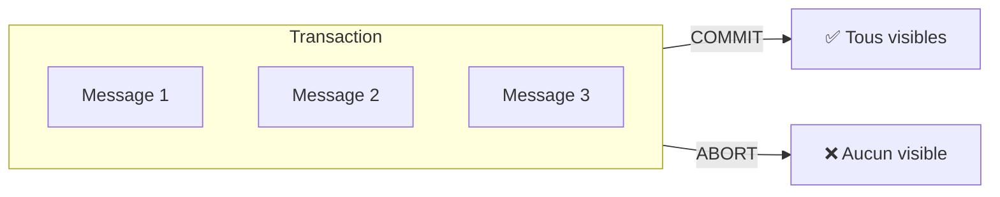

#### Cycle de vie d'une transaction

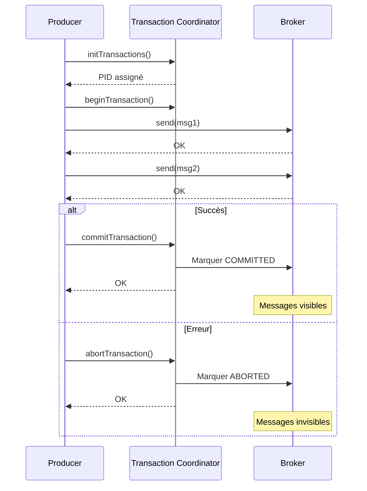

#### États d'une transaction

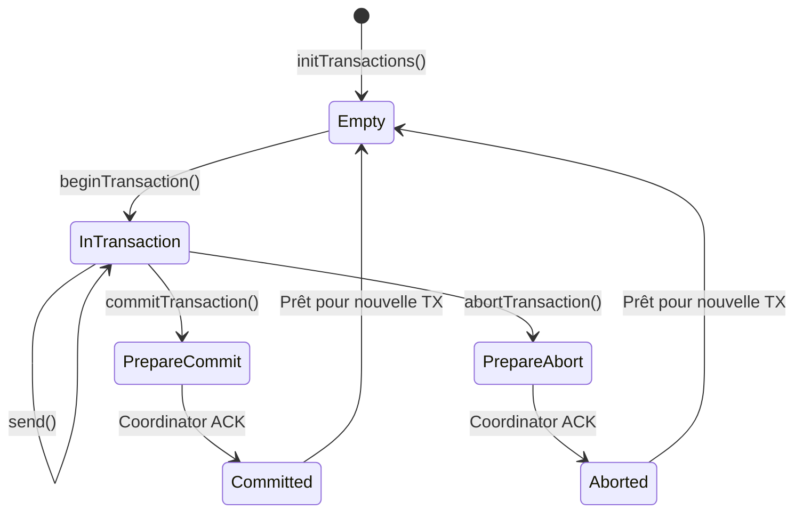

---

### 2. Exactly-Once Semantics (EOS)

#### Les 3 niveaux de garantie

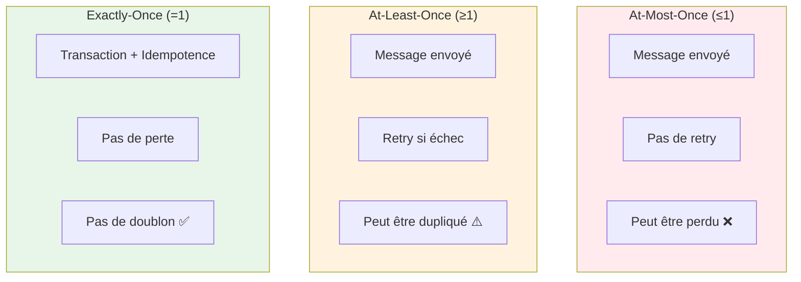

#### Comparaison

| Garantie | Perte possible | Doublon possible | Complexité | Cas d'usage |
|----------|----------------|------------------|------------|-------------|
| **At-Most-Once** | ✅ Oui | ❌ Non | Faible | Métriques, logs |
| **At-Least-Once** | ❌ Non | ✅ Oui | Moyenne | La plupart des cas |
| **Exactly-Once** | ❌ Non | ❌ Non | Élevée | Finance, inventaire |

---

### 3. Le Consumer Kafka

#### Anatomie d'un Consumer

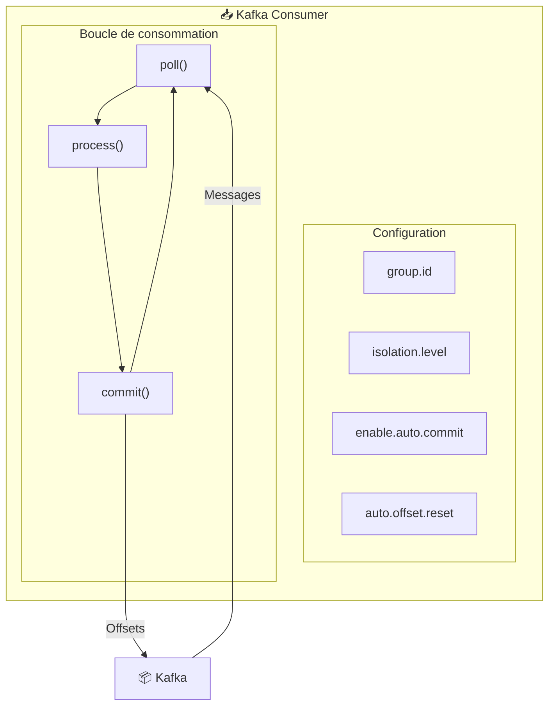

#### Le Consumer Group

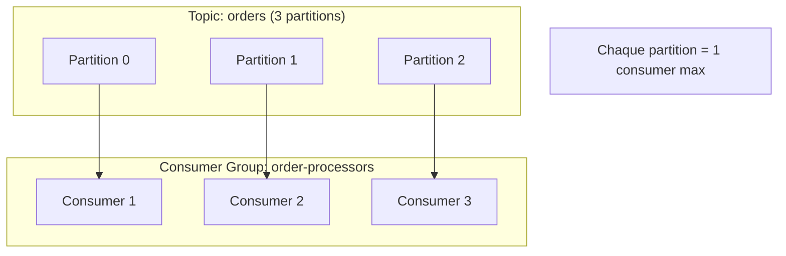

---

### 4. Isolation Levels

#### read_uncommitted (par défaut)

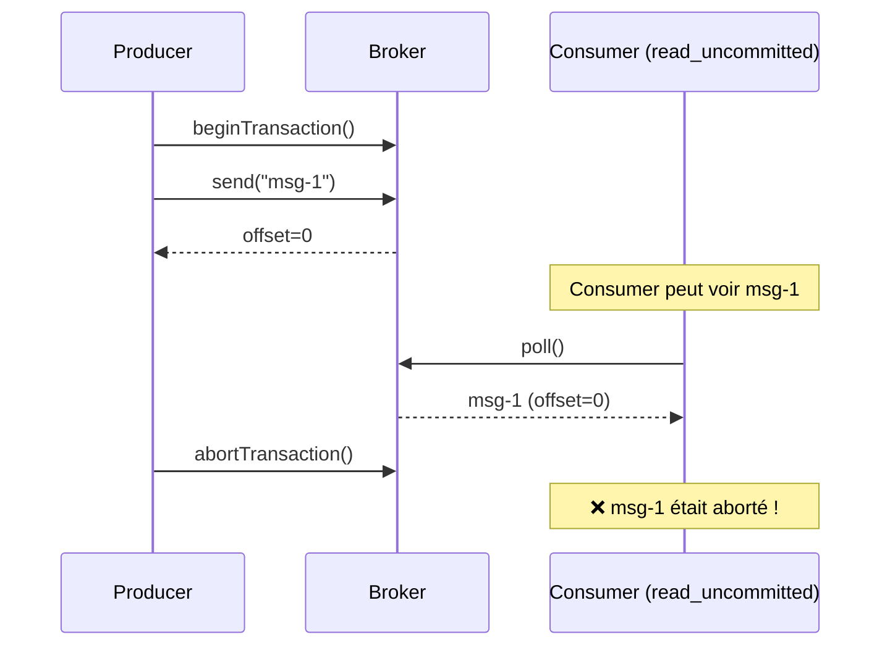

#### read_committed

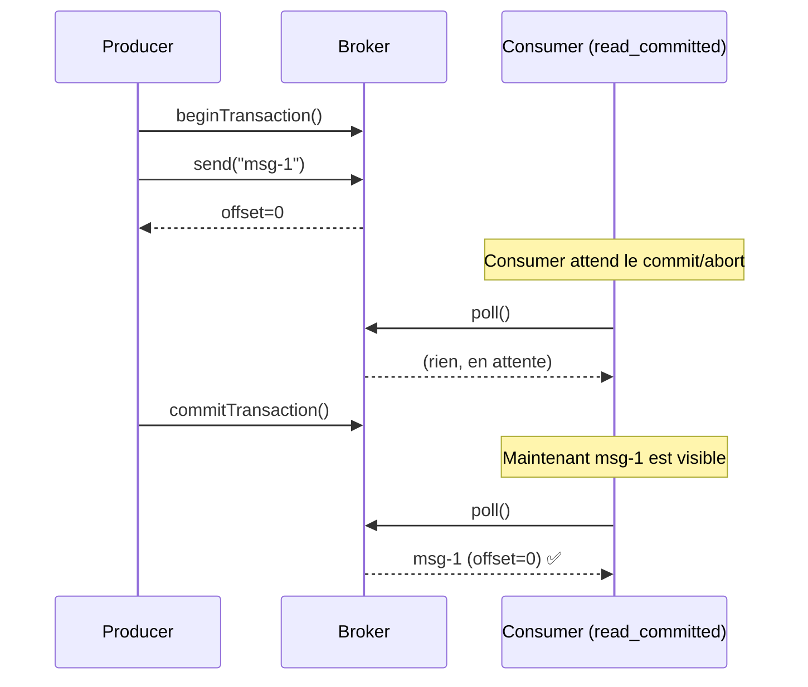

#### Comparaison visuelle

```
Timeline avec read_uncommitted:
┌─────────────────────────────────────────────────────────────┐
│ t=0: TX begin                                               │
│ t=1: msg-1 envoyé    → Consumer VOIT msg-1                  │
│ t=2: msg-2 envoyé    → Consumer VOIT msg-2                  │
│ t=3: TX abort        → Messages déjà consommés ! ❌          │
└─────────────────────────────────────────────────────────────┘

Timeline avec read_committed:
┌─────────────────────────────────────────────────────────────┐
│ t=0: TX begin                                               │
│ t=1: msg-1 envoyé    → Consumer ATTEND                      │
│ t=2: msg-2 envoyé    → Consumer ATTEND                      │
│ t=3: TX commit       → Consumer VOIT msg-1, msg-2 ✅         │
└─────────────────────────────────────────────────────────────┘
```

---

### 5. Gestion des Offsets

#### Auto-commit vs Manual commit

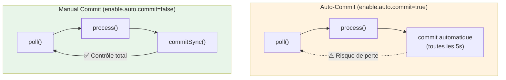

#### Scénarios de commit

| Scénario | Auto-commit | Manual commit |
|----------|-------------|---------------|
| **Crash après process, avant commit** | Message perdu | Message re-traité |
| **Crash après poll, avant process** | Message perdu | Message re-traité |
| **Traitement idempotent** | OK | Recommandé |
| **Exactly-once requis** | ❌ Impossible | ✅ Possible |

---

### 6. Transaction Coordinator

#### Rôle du Coordinator

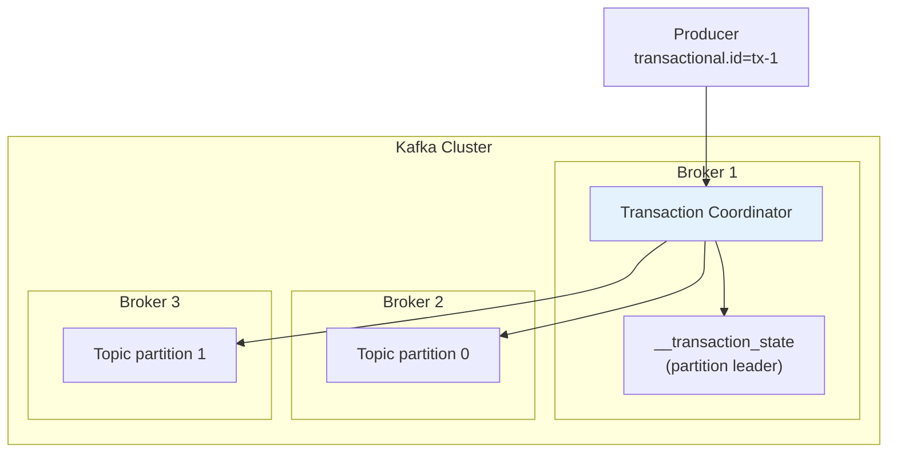

#### Topics internes

| Topic | Rôle |
|-------|------|
| `__transaction_state` | État des transactions en cours |
| `__consumer_offsets` | Offsets committés par consumer group |

---

### 7. Configuration du Producer Transactionnel

#### Paramètres requis

```properties
# Identifiant unique de la transaction
transactional.id=my-transactional-producer

# Idempotence obligatoire avec transactions
enable.idempotence=true

# ACKs obligatoire = all
acks=all

# Timeout de la transaction
transaction.timeout.ms=60000
```

#### Cycle de vie du Producer

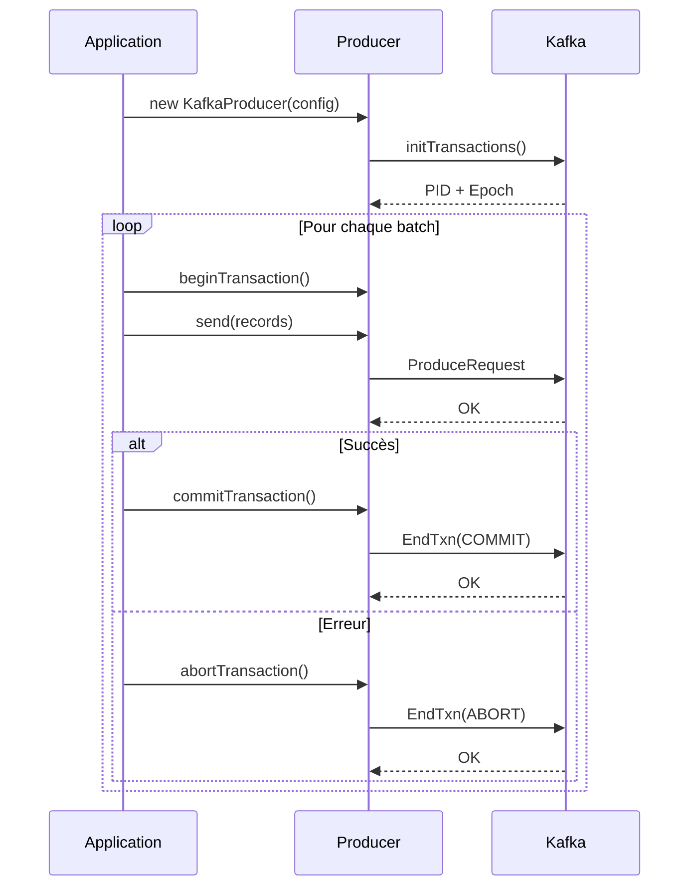

---

### 8. Diagramme complet du Lab

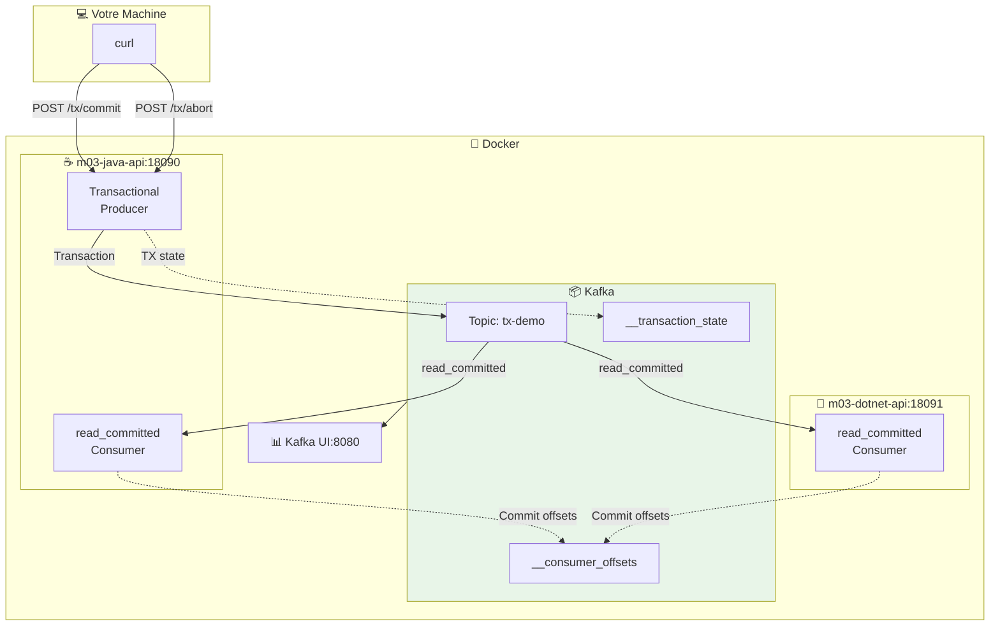

---

## 🏗️ Architecture du module

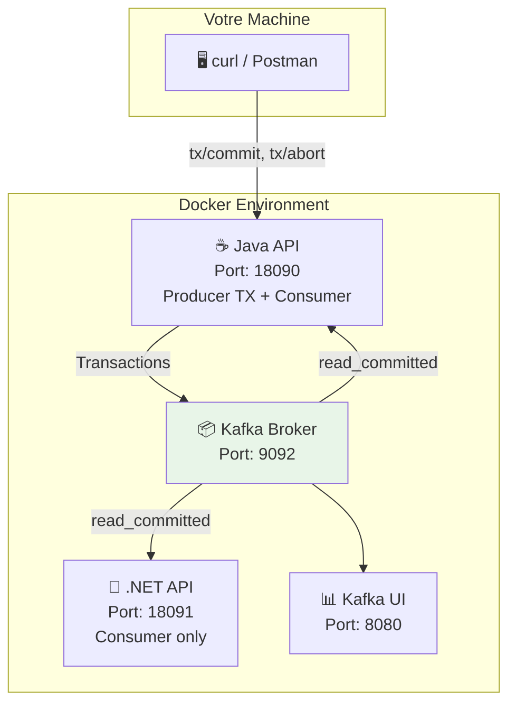

### Rôles des APIs

| API | Rôle |
|-----|------|
| **Java API** | Producer transactionnel + Consumer `read_committed` |
| **.NET API** | Consumer `read_committed` uniquement |

---

## 🔌 Ports et endpoints

### Services

| Service | Port | URL |
|---------|------|-----|
| Java API (M03) | 18090 | http://localhost:18090 |
| .NET API (M03) | 18091 | http://localhost:18091 |
| Kafka UI | 8080 | http://localhost:8080 |

### Endpoints du Java API (Producer)

| Méthode | Endpoint | Description |
|---------|----------|-------------|
| GET | `/health` | Health check |
| POST | `/api/v1/tx/commit?txId=...` | Produit un message et **commit** la transaction |
| POST | `/api/v1/tx/abort?txId=...` | Produit un message et **abort** la transaction |
| GET | `/api/v1/metrics` | Statistiques du consumer (messages lus) |

### Endpoints du .NET API (Consumer)

| Méthode | Endpoint | Description |
|---------|----------|-------------|
| GET | `/health` | Health check |
| GET | `/api/v1/metrics` | Statistiques du consumer (messages lus) |

---

## 📋 Pré-requis

### Logiciels

- ✅ Docker + Docker Compose
- ✅ curl (ligne de commande)
- ✅ Navigateur web

### Cluster Kafka démarré

```bash
cd formation-v2/
./scripts/up.sh
```

**Vérification** :

```bash
docker ps --format 'table {{.Names}}\t{{.Status}}' | grep kafka
```

**Résultat attendu** : `kafka` et `kafka-ui` sont `Up (healthy)`.

---

## 📚 Lab 03.0 - Démarrage du module

### Objectif

Démarrer les APIs Java et .NET configurées en mode `read_committed`.

---

### Étape 1 - Positionnement

**Objectif** : Se placer dans le bon répertoire.

```bash
cd formation-v2/
```

---

### Étape 2 - Démarrage des services

**Objectif** : Lancer les conteneurs du module.

**Explication** : Cette commande lance :

- **m03-java-api** : API avec producer transactionnel et consumer `read_committed`
- **m03-dotnet-api** : API avec consumer `read_committed` uniquement

**Commande** :

```bash
docker compose -f infra/docker-compose.single-node.yml \
  -f day-01-foundations/module-03-consumer-read-committed/docker-compose.module.yml \
  up -d --build
```

**⏱️ Temps d'attente** : 1-2 minutes (build des images).

---

### Étape 3 - Vérification des conteneurs

**Objectif** : S'assurer que les services sont opérationnels.

**Commande** :

```bash
docker ps --format 'table {{.Names}}\t{{.Status}}'
```

**Résultat attendu** :

| Conteneur | Statut attendu |
|-----------|----------------|
| kafka | Up (healthy) |
| kafka-ui | Up (healthy) |
| m03-java-api | Up |
| m03-dotnet-api | Up |

---

### Étape 4 - Test de santé des APIs

**Objectif** : Vérifier que les APIs répondent.

**Commandes** :

```bash
# Test Java API
curl -fsS http://localhost:18090/health
# Résultat attendu: OK

# Test .NET API
curl -fsS http://localhost:18091/health
# Résultat attendu: OK
```

**✅ Checkpoint 03.0** : Les deux APIs répondent `OK`.

---

## 📚 Lab 03.1 - Production de transactions

### Objectif

Produire une transaction **committée** et une transaction **abortée**.

---

### Étape 5 - Création d'identifiants uniques

**Objectif** : Générer des IDs pour identifier les messages.

**Commande** :

```bash
COMMITTED_ID="COMMITTED-$(date +%s)"
ABORTED_ID="ABORTED-$(date +%s)"

echo "Transaction committée: $COMMITTED_ID"
echo "Transaction abortée: $ABORTED_ID"
```

---

### Étape 6 - Production d'une transaction committée

**Objectif** : Envoyer un message dans une transaction qui sera **committée**.

**Théorie** : Une transaction committée rend le message visible aux consumers `read_committed`.

**Commande** :

```bash
curl -fsS -X POST "http://localhost:18090/api/v1/tx/commit?txId=$COMMITTED_ID"
```

**Résultat attendu** :

```json
{
  "status": "COMMITTED",
  "txId": "COMMITTED-1706400000"
}
```

---

### Étape 7 - Production d'une transaction abortée

**Objectif** : Envoyer un message dans une transaction qui sera **abortée**.

**Théorie** : Une transaction abortée rend le message **invisible** aux consumers `read_committed`.

**Commande** :

```bash
curl -fsS -X POST "http://localhost:18090/api/v1/tx/abort?txId=$ABORTED_ID"
```

**Résultat attendu** :

```json
{
  "status": "ABORTED",
  "txId": "ABORTED-1706400001"
}
```

**✅ Checkpoint 03.1** : Les deux transactions ont été produites.

---

## 📚 Lab 03.2 - Vérification des consumers

### Objectif

Confirmer que les consumers `read_committed` ne voient **pas** les messages abortés.

---

### Étape 8 - Attente de la consommation

**Objectif** : Laisser le temps aux consumers de lire les messages.

**Commande** :

```bash
# Attendre quelques secondes
sleep 5
```

---

### Étape 9 - Vérification du consumer Java

**Objectif** : Consulter les métriques du consumer Java.

**Commande** :

```bash
curl -fsS http://localhost:18090/api/v1/metrics
```

**Résultat attendu** :

```json
{
  "processedCount": 1,
  "messages": ["COMMITTED-1706400000"]
}
```

**Ce que vous devez observer** :

- ✅ `processedCount: 1` (un seul message)
- ✅ Le message **COMMITTED** est présent
- ❌ Le message **ABORTED** est **absent**

---

### Étape 10 - Vérification du consumer .NET

**Objectif** : Consulter les métriques du consumer .NET.

**Commande** :

```bash
curl -fsS http://localhost:18091/api/v1/metrics
```

**Résultat attendu** : Identique au consumer Java.

**✅ Checkpoint 03.2** : Les consumers ne voient que les messages committés.

---

## 📚 Lab 03.3 - Validation automatisée

### Objectif

Exécuter le script de validation complet.

---

### Étape 11 - Exécution du script

**Objectif** : Valider automatiquement le comportement `read_committed`.

**Explication** : Le script `validate.sh` :

1. Crée un topic temporaire
2. Produit une transaction committée
3. Produit une transaction abortée
4. Vérifie que les deux consumers ne voient que le message committé
5. Retourne `OK` si tout est correct

**Commande** :

```bash
./day-01-foundations/module-03-consumer-read-committed/scripts/validate.sh
```

**Résultat attendu** :

```
OK
```

**✅ Checkpoint 03.3** : Le script de validation retourne OK.

---

## 📚 Lab 03.4 - Observation dans Kafka UI

### Objectif

Observer les messages dans Kafka UI et comprendre la différence de visibilité.

---

### Étape 12 - Accès à Kafka UI

**Objectif** : Visualiser les messages dans l'interface graphique.

**Actions** :

1. Ouvrez **http://localhost:8080**
2. Cliquez sur le cluster **BHF-Training**
3. Menu **Topics** → Recherchez le topic de test
4. Onglet **Messages** → **Fetch Messages**

**Ce que vous devez observer** :

- Les messages committés sont visibles
- Les messages abortés sont **également visibles** dans Kafka UI (car UI lit en `read_uncommitted` par défaut)
- Mais les consumers `read_committed` ne les voient pas !

**💡 Note importante** : Kafka UI montre **tous** les messages, y compris les abortés. C'est uniquement le consumer configuré en `read_committed` qui filtre.

---

## ✅ Récapitulatif des checkpoints

| # | Checkpoint | Statut |
|---|------------|--------|
| 03.0 | APIs Java et .NET répondent OK | ☐ |
| 03.1 | Transactions commit et abort produites | ☐ |
| 03.2 | Consumers ne voient que les messages committés | ☐ |
| 03.3 | Script validate.sh retourne OK | ☐ |

---

## 🔧 Troubleshooting

### APIs ne démarrent pas

**Symptôme** : `m03-java-api` ou `m03-dotnet-api` en erreur.

**Solution** :

```bash
# Vérifier les logs
docker logs m03-java-api --tail 100
docker logs m03-dotnet-api --tail 100

# Reconstruire
docker compose -f infra/docker-compose.single-node.yml \
  -f day-01-foundations/module-03-consumer-read-committed/docker-compose.module.yml \
  up -d --build --force-recreate
```

### Messages abortés visibles dans metrics

**Symptôme** : Le consumer voit le message aborté.

**Causes possibles** :

1. Le consumer n'est pas configuré en `read_committed`
2. L'API n'a pas été redémarrée après une modification

**Solution** : Redémarrer les APIs.

### processedCount = 0

**Symptôme** : Aucun message n'est consommé.

**Causes possibles** :

1. Le consumer n'a pas encore poll le topic
2. Le topic n'existe pas

**Solution** :

```bash
# Attendre plus longtemps
sleep 10

# Vérifier à nouveau
curl -fsS http://localhost:18090/api/v1/metrics
```

---

## 🧹 Nettoyage

**Objectif** : Arrêter les services du module.

**Commande** :

```bash
docker compose -f infra/docker-compose.single-node.yml \
  -f day-01-foundations/module-03-consumer-read-committed/docker-compose.module.yml \
  down
```

---

## 📖 Pour aller plus loin

### Exercices supplémentaires

1. **Modifiez l'isolation level** du consumer et observez le comportement avec `read_uncommitted`
2. **Produisez plusieurs messages** dans la même transaction
3. **Simulez un crash** pendant une transaction pour observer le comportement

### Cas d'usage des transactions

| Scénario | Utilité des transactions |
|----------|--------------------------|
| **Transfert bancaire** | Garantir que le débit ET le crédit sont effectués |
| **Commande e-commerce** | Garantir stock + paiement + notification |
| **ETL/CDC** | Garantir exactly-once processing |

### Ressources

- [Kafka Transactions](https://kafka.apache.org/documentation/#semantics)
- [Exactly-Once Semantics](https://www.confluent.io/blog/exactly-once-semantics-are-possible-heres-how-apache-kafka-does-it/)
- [Consumer Configuration](https://kafka.apache.org/documentation/#consumerconfigs)

---

## ➡️ Formation terminée !

Félicitations ! Vous avez terminé les 3 modules fondamentaux de la formation Kafka :

- ✅ **Module 01** : Architecture du cluster Kafka (KRaft)
- ✅ **Module 02** : Fiabilité du producteur (Idempotence)
- ✅ **Module 03** : Consumer Read-Committed (Transactions)

### Prochaines étapes suggérées

1. **Explorez le mode cluster** : `./scripts/up.sh cluster`
2. **Testez la tolérance aux pannes** avec un cluster de 3 nœuds
3. **Intégrez Kafka** dans vos propres applications
