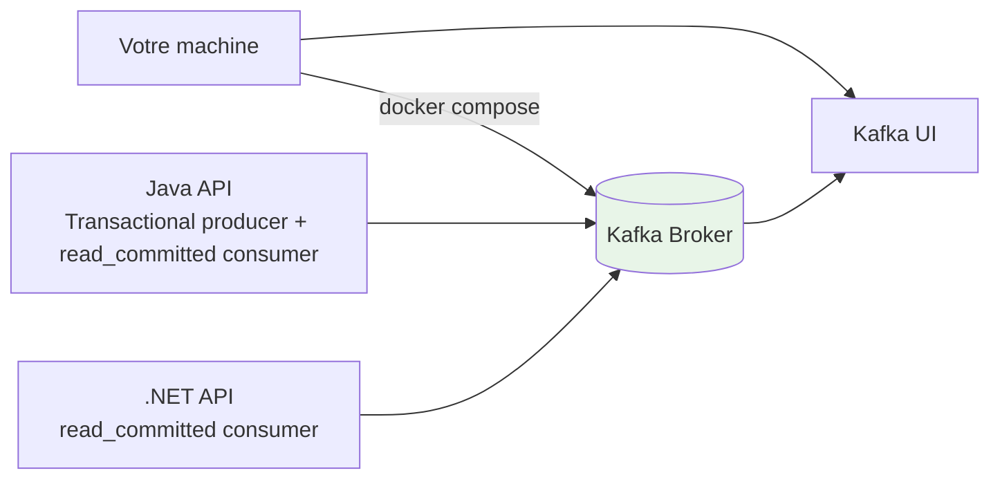

# Module 03 - Consumer Read-Committed (Self-Paced)

## Objectif

Comprendre comment un consumer peut éviter de lire des messages issus de transactions **abort** grâce à `isolation.level=read_committed`.

## Ce que vous allez apprendre

- Démarrer un consumer `read_committed` (Java + .NET)
- Désactiver l’auto-commit et contrôler le commit des offsets
- Produire des messages **transactionnels** (commit vs abort)
- Vérifier que les consumers `read_committed` ne lisent **pas** les messages abortés

## Architecture



## Ports

- Kafka UI: `localhost:8080`
- Java API (Module 03): `localhost:18090`
- .NET API (Module 03): `localhost:18091`

## Pré-requis

- Docker + Docker Compose plugin (`docker compose`)

## Step-by-step

### Step 0 - Se placer au bon endroit

Positionnez-vous dans le dossier `formation-v2/`.

### Step 1 - Démarrer la base Kafka

```bash
./scripts/up.sh
```

Vérifiez que Kafka est prêt:

```bash
docker ps --format '{{.Names}}\t{{.Status}}' | grep kafka
```

### Step 2 - Démarrer le module 03

```bash
docker compose -f infra/docker-compose.single-node.yml \
  -f day-01-foundations/module-03-consumer-read-committed/docker-compose.module.yml \
  up -d --build
```

Résultat attendu:

- Les conteneurs `m03-java-api` et `m03-dotnet-api` sont `Up`

### Step 3 - Health checks

```bash
curl -fsS localhost:18090/health | cat
curl -fsS localhost:18091/health | cat
```

Résultat attendu:

- `OK` pour les deux APIs

### Step 4 - Produire 1 transaction commit + 1 transaction abort

Le Java API expose un producteur transactionnel.

```bash
COMMITTED_ID="COMMITTED-$(date +%s)"
ABORTED_ID="ABORTED-$(date +%s)"

curl -fsS -X POST "localhost:18090/api/v1/tx/commit?txId=$COMMITTED_ID" | cat
curl -fsS -X POST "localhost:18090/api/v1/tx/abort?txId=$ABORTED_ID" | cat
```

### Step 5 - Vérifier côté consumers (read_committed)

```bash
curl -fsS "localhost:18090/api/v1/metrics" | cat
curl -fsS "localhost:18091/api/v1/metrics" | cat
```

Résultat attendu:

- Le `txId` **COMMITTED** apparaît
- Le `txId` **ABORTED** n’apparaît pas

### Step 6 - Checkpoint automatisé

```bash
./day-01-foundations/module-03-consumer-read-committed/scripts/validate.sh
```

Résultat attendu:

- `OK`

## Checkpoint

- Les consumers sont configurés en `read_committed`
- Les offsets sont commit manuellement (auto-commit désactivé)
- Un message produit dans une transaction abortée n’est pas visible côté consumer `read_committed`

## Nettoyage

```bash
docker compose -f infra/docker-compose.single-node.yml \
  -f day-01-foundations/module-03-consumer-read-committed/docker-compose.module.yml \
  down
```
