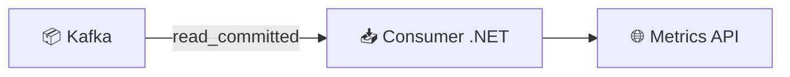

# 🛠️ Tutorial VS Code : Consumer Read Committed - .NET

## 📋 Vue d'ensemble

Ce tutorial vous guide pour implémenter un **Consumer Kafka .NET** avec :
- **Isolation Level `read_committed`**
- **BackgroundService** pour consommation continue
- Filtrage automatique des transactions non committées



---

## 🎯 Prérequis

| Outil | Version | Installation |
|-------|---------|--------------|
| **VS Code** | Latest | [code.visualstudio.com](https://code.visualstudio.com) |
| **.NET SDK** | 8.0+ | `winget install Microsoft.DotNet.SDK.8` |
| **Docker** | Latest | Pour Kafka |

---

## 📁 Créer le projet

```powershell
mkdir module03-dotnet-consumer
cd module03-dotnet-consumer
dotnet new web -n M03ReadCommittedConsumer
cd M03ReadCommittedConsumer
dotnet add package Confluent.Kafka
code .
```

---

## 💻 Program.cs complet

```csharp
using Confluent.Kafka;
using System.Collections.Concurrent;
using System.Text.Json;

var builder = WebApplication.CreateBuilder(args);

// Enregistrer les services
builder.Services.AddSingleton<ConsumerState>();
builder.Services.AddHostedService<KafkaConsumerHostedService>();

var app = builder.Build();

// ═══════════════════════════════════════════════════════════════
// ENDPOINTS
// ═══════════════════════════════════════════════════════════════

app.MapGet("/health", () => "OK");

app.MapGet("/api/v1/metrics", (ConsumerState state) => Results.Ok(new
{
    processedCount = state.ProcessedCount,
    processedTxIds = state.GetProcessedTxIds()
}));

app.Run();

// ═══════════════════════════════════════════════════════════════
// CONSUMER STATE
// Stocke les métriques du consumer
// ═══════════════════════════════════════════════════════════════
sealed class ConsumerState
{
    private long _processedCount;
    private readonly ConcurrentQueue<string> _processedTxIds = new();

    public long ProcessedCount => Interlocked.Read(ref _processedCount);

    public void RememberTxId(string? txId)
    {
        if (string.IsNullOrWhiteSpace(txId)) return;

        Interlocked.Increment(ref _processedCount);
        _processedTxIds.Enqueue(txId);

        // Garder les 20 derniers
        while (_processedTxIds.Count > 20)
        {
            _processedTxIds.TryDequeue(out _);
        }
    }

    public IReadOnlyList<string> GetProcessedTxIds() => _processedTxIds.ToArray();
}

// ═══════════════════════════════════════════════════════════════
// KAFKA CONSUMER HOSTED SERVICE
// BackgroundService pour consommation continue
// ═══════════════════════════════════════════════════════════════
sealed class KafkaConsumerHostedService : BackgroundService
{
    private readonly ConsumerState _state;

    public KafkaConsumerHostedService(ConsumerState state)
    {
        _state = state;
    }

    protected override async Task ExecuteAsync(CancellationToken stoppingToken)
    {
        var bootstrapServers = Environment.GetEnvironmentVariable("KAFKA_BOOTSTRAP_SERVERS") 
            ?? "localhost:9092";
        var topic = Environment.GetEnvironmentVariable("KAFKA_TOPIC") 
            ?? "bhf-read-committed-demo";
        var groupId = Environment.GetEnvironmentVariable("KAFKA_GROUP_ID") 
            ?? "m03-dotnet-consumer";

        var config = new ConsumerConfig
        {
            BootstrapServers = bootstrapServers,
            GroupId = groupId,
            AutoOffsetReset = AutoOffsetReset.Earliest,
            EnableAutoCommit = false,
            
            // ═══════════════════════════════════════════════════════
            // ISOLATION LEVEL : READ_COMMITTED
            // 
            // Le consumer ne verra que les messages des transactions
            // qui ont été COMMIT. Les messages ABORT sont ignorés.
            // ═══════════════════════════════════════════════════════
            IsolationLevel = IsolationLevel.ReadCommitted,
        };

        while (!stoppingToken.IsCancellationRequested)
        {
            try
            {
                using var consumer = new ConsumerBuilder<string, string>(config)
                    .SetKeyDeserializer(Deserializers.Utf8)
                    .SetValueDeserializer(Deserializers.Utf8)
                    .Build();

                consumer.Subscribe(topic);
                Console.WriteLine($"[CONSUMER] Subscribed to {topic} with read_committed isolation");

                while (!stoppingToken.IsCancellationRequested)
                {
                    var result = consumer.Consume(stoppingToken);
                    if (result?.Message?.Value is null) continue;

                    // Extraire le txId et mémoriser
                    var txId = ExtractTxId(result.Message.Value);
                    _state.RememberTxId(txId);

                    Console.WriteLine($"[CONSUMED] partition={result.Partition}, " +
                        $"offset={result.Offset}, txId={txId}");

                    consumer.Commit(result);
                }

                consumer.Close();
            }
            catch (OperationCanceledException)
            {
                return;
            }
            catch (Exception ex)
            {
                Console.WriteLine($"[ERROR] Consumer error: {ex.Message}");
                try
                {
                    await Task.Delay(2000, stoppingToken);
                }
                catch (OperationCanceledException)
                {
                    return;
                }
            }
        }
    }

    private static string? ExtractTxId(string json)
    {
        try
        {
            using var doc = JsonDocument.Parse(json);
            if (doc.RootElement.TryGetProperty("txId", out var txId))
            {
                return txId.GetString();
            }
            return null;
        }
        catch
        {
            return null;
        }
    }
}
```

---

## 🔑 Concepts clés

### IsolationLevel dans Confluent.Kafka

```csharp
// Consumer voit TOUS les messages (même non committés)
IsolationLevel = IsolationLevel.ReadUncommitted

// Consumer voit UNIQUEMENT les messages committés ✅
IsolationLevel = IsolationLevel.ReadCommitted
```

### Comparaison des modes

| Mode | Messages vus | Latence | Cas d'usage |
|------|--------------|---------|-------------|
| `ReadUncommitted` | Tous | Minimale | Debug, monitoring |
| `ReadCommitted` | Committés | +légère | Production (EOS) |

---

## 🐳 Dockerfile

```dockerfile
FROM mcr.microsoft.com/dotnet/sdk:8.0 AS build
WORKDIR /src
COPY *.csproj .
RUN dotnet restore
COPY . .
RUN dotnet publish -c Release -o /app/publish

FROM mcr.microsoft.com/dotnet/aspnet:8.0-alpine
WORKDIR /app
COPY --from=build /app/publish .

ENV KAFKA_BOOTSTRAP_SERVERS=kafka:29092
ENV KAFKA_TOPIC=bhf-read-committed-demo
ENV KAFKA_GROUP_ID=m03-dotnet-consumer
ENV ASPNETCORE_URLS=http://+:8080
EXPOSE 8080

ENTRYPOINT ["dotnet", "M03ReadCommittedConsumer.dll"]
```

---

## 🧪 Tests

### Créer `requests.http`

```http
### HEALTH
GET http://localhost:5000/health

### MÉTRIQUES
### Affiche les txId des messages consommés (uniquement COMMIT)
GET http://localhost:5000/api/v1/metrics
```

---

## � Docker Compose - Build et Déploiement

### Démarrer l'infrastructure Kafka

```powershell
# Depuis la racine formation-v2/
cd infra
docker-compose -f docker-compose.single-node.yml up -d
```

### Build et démarrer les APIs du module

```powershell
# Depuis le répertoire du module
cd ../day-01-foundations/module-03-consumer-read-committed

# Build et démarrer les APIs Java + .NET
docker-compose -f docker-compose.module.yml up -d --build
```

### Tester l'API .NET (port 18091)

```powershell
# Health check
curl http://localhost:18091/health

# Vérifier les métriques (seuls les COMMIT apparaissent)
curl http://localhost:18091/api/v1/metrics
```

### Arrêter les services

```powershell
docker-compose -f docker-compose.module.yml down
```

---

## 🖥️ Alternative : Exécution locale (sans Docker)

```powershell
# Lancer le consumer
dotnet run

# Dans un autre terminal, utiliser l'API Java pour produire
# (ou tout autre producer transactionnel)

# Vérifier les métriques
curl http://localhost:5000/api/v1/metrics
```

---

### Résultat attendu

Après avoir envoyé 1 COMMIT et 1 ABORT via le producer transactionnel :

```json
{
  "processedCount": 1,
  "processedTxIds": ["TX-COMMIT-001"]
}
```

> **Le message ABORT n'apparaît pas** car `IsolationLevel.ReadCommitted` le filtre.

---

## ✅ Checklist

- [ ] Consumer avec `IsolationLevel.ReadCommitted`
- [ ] BackgroundService pour consommation continue
- [ ] Métriques exposées via API
- [ ] Seuls les messages COMMIT sont consommés
- [ ] Messages ABORT ignorés automatiquement

---

**🎉 Félicitations !** Vous maîtrisez le Consumer read_committed en .NET !
