# 🛠️ Tutorial VS Code : Consumer Read Committed & Transactions - Java

## 📋 Vue d'ensemble

Ce tutorial vous guide pour implémenter :
- **Producer Transactionnel** (exactly-once semantics)
- **Consumer Read Committed** (isolation des transactions)
- Différence entre `read_uncommitted` et `read_committed`

```mermaid
flowchart LR
    TP["📤 Transactional<br/>Producer"] -->|commit/abort| K["📦 Kafka"]
    K -->|read_committed| RC["📥 Consumer<br/>Read Committed"]
    K -.->|read_uncommitted| RU["📥 Consumer<br/>Read Uncommitted"]
    
    style RC fill:#e8f5e9
```



---

## 🎯 Prérequis

| Outil | Version | Installation |
|-------|---------|--------------|
| **VS Code** | Latest | [code.visualstudio.com](https://code.visualstudio.com) |
| **Java JDK** | 17+ | `winget install Microsoft.OpenJDK.17` |
| **Maven** | 3.8+ | `winget install Apache.Maven` |
| **Docker** | Latest | Pour Kafka |

---

## 📁 Structure du projet

```
module03-read-committed/
├── pom.xml
├── src/main/java/com/bhf/m03/
│   ├── M03Application.java
│   ├── api/
│   │   ├── TxController.java
│   │   └── MetricsController.java
│   └── kafka/
│       ├── TransactionalProducerService.java
│       └── ReadCommittedConsumerService.java
└── requests.http
```

---

## 📝 Configuration Maven (pom.xml)

```xml
<project xmlns="http://maven.apache.org/POM/4.0.0">
  <modelVersion>4.0.0</modelVersion>

  <groupId>com.bhf</groupId>
  <artifactId>m03-consumer-read-committed</artifactId>
  <version>0.0.1-SNAPSHOT</version>

  <parent>
    <groupId>org.springframework.boot</groupId>
    <artifactId>spring-boot-starter-parent</artifactId>
    <version>3.2.2</version>
  </parent>

  <properties>
    <java.version>17</java.version>
  </properties>

  <dependencies>
    <dependency>
      <groupId>org.springframework.boot</groupId>
      <artifactId>spring-boot-starter-web</artifactId>
    </dependency>
    <dependency>
      <groupId>org.apache.kafka</groupId>
      <artifactId>kafka-clients</artifactId>
      <version>3.6.1</version>
    </dependency>
  </dependencies>

  <build>
    <plugins>
      <plugin>
        <groupId>org.springframework.boot</groupId>
        <artifactId>spring-boot-maven-plugin</artifactId>
      </plugin>
    </plugins>
  </build>
</project>
```

---

## ⚙️ Producer Transactionnel

### Créer `kafka/TransactionalProducerService.java`

```java
package com.bhf.m03.kafka;

import jakarta.annotation.PostConstruct;
import jakarta.annotation.PreDestroy;
import org.apache.kafka.clients.producer.*;
import org.apache.kafka.common.serialization.StringSerializer;
import org.springframework.stereotype.Service;

import java.time.Instant;
import java.util.Properties;
import java.util.UUID;

/**
 * Producer transactionnel Kafka.
 * 
 * Transactions Kafka permettent :
 * - Exactly-once semantics (EOS)
 * - Atomicité multi-messages
 * - Rollback en cas d'erreur
 */
@Service
public class TransactionalProducerService {

    private KafkaProducer<String, String> producer;
    private String topic;

    @PostConstruct
    public void init() {
        String bootstrapServers = System.getenv()
            .getOrDefault("KAFKA_BOOTSTRAP_SERVERS", "localhost:9092");
        topic = System.getenv().getOrDefault("KAFKA_TOPIC", "bhf-read-committed-demo");

        Properties props = new Properties();
        props.put(ProducerConfig.BOOTSTRAP_SERVERS_CONFIG, bootstrapServers);
        props.put(ProducerConfig.KEY_SERIALIZER_CLASS_CONFIG, StringSerializer.class.getName());
        props.put(ProducerConfig.VALUE_SERIALIZER_CLASS_CONFIG, StringSerializer.class.getName());
        
        // ═══════════════════════════════════════════════════════════
        // CONFIGURATION TRANSACTIONNELLE
        // ═══════════════════════════════════════════════════════════
        
        // Identifiant unique de transaction (requis)
        // Doit être stable entre redémarrages pour la récupération
        props.put(ProducerConfig.TRANSACTIONAL_ID_CONFIG, 
            "m03-tx-producer-" + UUID.randomUUID());
        
        // Idempotence activée automatiquement avec transactions
        props.put(ProducerConfig.ENABLE_IDEMPOTENCE_CONFIG, true);
        props.put(ProducerConfig.ACKS_CONFIG, "all");

        producer = new KafkaProducer<>(props);
        
        // Initialiser le producteur transactionnel (une seule fois)
        producer.initTransactions();
    }

    /**
     * Envoie un message dans une transaction COMMIT.
     */
    public String sendCommitted(String txId) {
        try {
            // Début de transaction
            producer.beginTransaction();
            
            String value = createMessage(txId, "COMMITTED");
            producer.send(new ProducerRecord<>(topic, txId, value)).get();
            
            // Commit de la transaction
            producer.commitTransaction();
            
            return "Transaction COMMITTED: " + txId;
        } catch (Exception e) {
            producer.abortTransaction();
            throw new RuntimeException("Transaction failed: " + e.getMessage(), e);
        }
    }

    /**
     * Envoie un message dans une transaction ABORT.
     * Le message sera écrit mais marqué comme annulé.
     */
    public String sendAborted(String txId) {
        try {
            producer.beginTransaction();
            
            String value = createMessage(txId, "ABORTED");
            producer.send(new ProducerRecord<>(topic, txId, value)).get();
            
            // Abort volontaire
            producer.abortTransaction();
            
            return "Transaction ABORTED: " + txId;
        } catch (Exception e) {
            try { producer.abortTransaction(); } catch (Exception ignored) {}
            throw new RuntimeException("Abort failed: " + e.getMessage(), e);
        }
    }

    private String createMessage(String txId, String status) {
        return String.format(
            "{\"txId\":\"%s\",\"status\":\"%s\",\"ts\":\"%s\"}",
            txId, status, Instant.now()
        );
    }

    @PreDestroy
    public void shutdown() {
        if (producer != null) {
            producer.close();
        }
    }
}
```

---

## 📥 Consumer Read Committed

### Créer `kafka/ReadCommittedConsumerService.java`

```java
package com.bhf.m03.kafka;

import jakarta.annotation.PostConstruct;
import jakarta.annotation.PreDestroy;
import org.apache.kafka.clients.consumer.*;
import org.apache.kafka.common.serialization.StringDeserializer;
import org.springframework.stereotype.Service;

import java.time.Duration;
import java.util.*;
import java.util.concurrent.ConcurrentLinkedQueue;
import java.util.concurrent.atomic.AtomicBoolean;
import java.util.concurrent.atomic.AtomicLong;

/**
 * Consumer avec isolation read_committed.
 * 
 * Ne voit que les messages des transactions COMMITTÉES.
 * Les messages des transactions ABORTED sont ignorés.
 */
@Service
public class ReadCommittedConsumerService {

    private KafkaConsumer<String, String> consumer;
    private final AtomicBoolean running = new AtomicBoolean(true);
    private final AtomicLong processedCount = new AtomicLong(0);
    private final ConcurrentLinkedQueue<String> processedTxIds = new ConcurrentLinkedQueue<>();
    private Thread consumerThread;

    @PostConstruct
    public void init() {
        String bootstrapServers = System.getenv()
            .getOrDefault("KAFKA_BOOTSTRAP_SERVERS", "localhost:9092");
        String topic = System.getenv()
            .getOrDefault("KAFKA_TOPIC", "bhf-read-committed-demo");
        String groupId = System.getenv()
            .getOrDefault("KAFKA_GROUP_ID", "m03-java-consumer");

        Properties props = new Properties();
        props.put(ConsumerConfig.BOOTSTRAP_SERVERS_CONFIG, bootstrapServers);
        props.put(ConsumerConfig.GROUP_ID_CONFIG, groupId);
        props.put(ConsumerConfig.KEY_DESERIALIZER_CLASS_CONFIG, StringDeserializer.class.getName());
        props.put(ConsumerConfig.VALUE_DESERIALIZER_CLASS_CONFIG, StringDeserializer.class.getName());
        props.put(ConsumerConfig.AUTO_OFFSET_RESET_CONFIG, "earliest");
        props.put(ConsumerConfig.ENABLE_AUTO_COMMIT_CONFIG, "false");
        
        // ═══════════════════════════════════════════════════════════
        // ISOLATION LEVEL : READ_COMMITTED
        // 
        // - read_uncommitted : Voit TOUS les messages (même non committés)
        // - read_committed : Voit UNIQUEMENT les messages des TX committées
        // ═══════════════════════════════════════════════════════════
        props.put(ConsumerConfig.ISOLATION_LEVEL_CONFIG, "read_committed");

        consumer = new KafkaConsumer<>(props);
        consumer.subscribe(Collections.singletonList(topic));

        // Démarrer le consumer dans un thread séparé
        consumerThread = new Thread(this::consumeLoop, "kafka-consumer");
        consumerThread.start();
    }

    private void consumeLoop() {
        while (running.get()) {
            try {
                ConsumerRecords<String, String> records = consumer.poll(Duration.ofMillis(1000));
                
                for (ConsumerRecord<String, String> record : records) {
                    // Extraire le txId du message
                    String txId = extractTxId(record.value());
                    if (txId != null) {
                        rememberTxId(txId);
                    }
                    
                    System.out.printf("[CONSUMED] partition=%d, offset=%d, txId=%s%n",
                        record.partition(), record.offset(), txId);
                }
                
                if (!records.isEmpty()) {
                    consumer.commitSync();
                }
            } catch (Exception e) {
                if (running.get()) {
                    System.err.println("Consumer error: " + e.getMessage());
                    try { Thread.sleep(2000); } catch (InterruptedException ignored) {}
                }
            }
        }
    }

    private String extractTxId(String json) {
        try {
            // Simple extraction (en production, utiliser Jackson)
            int start = json.indexOf("\"txId\":\"") + 8;
            int end = json.indexOf("\"", start);
            return json.substring(start, end);
        } catch (Exception e) {
            return null;
        }
    }

    private void rememberTxId(String txId) {
        processedCount.incrementAndGet();
        processedTxIds.add(txId);
        
        // Garder seulement les 20 derniers
        while (processedTxIds.size() > 20) {
            processedTxIds.poll();
        }
    }

    public long getProcessedCount() {
        return processedCount.get();
    }

    public List<String> getProcessedTxIds() {
        return new ArrayList<>(processedTxIds);
    }

    @PreDestroy
    public void shutdown() {
        running.set(false);
        if (consumer != null) {
            consumer.wakeup();
            consumer.close();
        }
        if (consumerThread != null) {
            try { consumerThread.join(5000); } catch (InterruptedException ignored) {}
        }
    }
}
```

---

## 🔑 Concept : Transactions Kafka

### Flux de transaction

```mermaid
sequenceDiagram
    participant P as Producer
    participant K as Kafka
    participant C as Consumer (read_committed)
    
    P->>K: beginTransaction()
    P->>K: send(msg1)
    P->>K: send(msg2)
    
    alt Transaction COMMIT
        P->>K: commitTransaction()
        K->>C: msg1, msg2 visibles ✅
    else Transaction ABORT
        P->>K: abortTransaction()
        K-xC: msg1, msg2 ignorés ❌
    end
```



### Comparaison des niveaux d'isolation

| Isolation | Messages vus | Cas d'usage |
|-----------|--------------|-------------|
| `read_uncommitted` | Tous (même non committés) | Monitoring, debug |
| `read_committed` | Uniquement committés | Production (EOS) |

---

## 🌐 Controllers REST

### Créer `api/TxController.java`

```java
package com.bhf.m03.api;

import com.bhf.m03.kafka.TransactionalProducerService;
import org.springframework.http.ResponseEntity;
import org.springframework.web.bind.annotation.*;

import java.util.Map;
import java.util.UUID;

@RestController
@RequestMapping("/api/v1/tx")
public class TxController {

    private final TransactionalProducerService producerService;

    public TxController(TransactionalProducerService producerService) {
        this.producerService = producerService;
    }

    /**
     * POST /api/v1/tx/commit
     * Envoie un message dans une transaction COMMIT
     */
    @PostMapping("/commit")
    public ResponseEntity<?> commit(@RequestParam(required = false) String txId) {
        if (txId == null) txId = "TX-" + UUID.randomUUID().toString().substring(0, 8);
        
        String result = producerService.sendCommitted(txId);
        return ResponseEntity.ok(Map.of(
            "status", "COMMITTED",
            "txId", txId,
            "message", result
        ));
    }

    /**
     * POST /api/v1/tx/abort
     * Envoie un message dans une transaction ABORT
     */
    @PostMapping("/abort")
    public ResponseEntity<?> abort(@RequestParam(required = false) String txId) {
        if (txId == null) txId = "TX-" + UUID.randomUUID().toString().substring(0, 8);
        
        String result = producerService.sendAborted(txId);
        return ResponseEntity.ok(Map.of(
            "status", "ABORTED",
            "txId", txId,
            "message", result
        ));
    }
}
```

### Créer `api/MetricsController.java`

```java
package com.bhf.m03.api;

import com.bhf.m03.kafka.ReadCommittedConsumerService;
import org.springframework.http.ResponseEntity;
import org.springframework.web.bind.annotation.*;

import java.util.Map;

@RestController
@RequestMapping("/api/v1")
public class MetricsController {

    private final ReadCommittedConsumerService consumerService;

    public MetricsController(ReadCommittedConsumerService consumerService) {
        this.consumerService = consumerService;
    }

    @GetMapping("/metrics")
    public ResponseEntity<?> metrics() {
        return ResponseEntity.ok(Map.of(
            "processedCount", consumerService.getProcessedCount(),
            "processedTxIds", consumerService.getProcessedTxIds()
        ));
    }

    @GetMapping("/health")
    public String health() {
        return "OK";
    }
}
```

---

## 🧪 Tests avec REST Client

### Créer `requests.http`

```http
### Variables
@baseUrl = http://localhost:8080/api/v1

### HEALTH CHECK
GET {{baseUrl}}/health

### ═══════════════════════════════════════════════════════════════
### ENVOYER UNE TRANSACTION COMMIT
### Le consumer read_committed VERRA ce message
### ═══════════════════════════════════════════════════════════════
POST {{baseUrl}}/tx/commit?txId=TX-COMMIT-001

### ═══════════════════════════════════════════════════════════════
### ENVOYER UNE TRANSACTION ABORT
### Le consumer read_committed NE VERRA PAS ce message
### ═══════════════════════════════════════════════════════════════
POST {{baseUrl}}/tx/abort?txId=TX-ABORT-001

### ═══════════════════════════════════════════════════════════════
### VÉRIFIER LES MÉTRIQUES DU CONSUMER
### Seuls les TX COMMIT doivent apparaître
### ═══════════════════════════════════════════════════════════════
GET {{baseUrl}}/metrics
```

---

## � Docker Compose - Build et Déploiement

### Architecture Docker

```mermaid
flowchart TB
    subgraph "Docker Network: bhf-kafka-network"
        K["📦 Kafka<br/>:29092"]
        UI["🖥️ Kafka UI<br/>:8080"]
        JAVA["☕ Java API<br/>:18090"]
        DOTNET["🔷 .NET API<br/>:18091"]
    end
    
    JAVA -->|produce/consume| K
    DOTNET -->|consume| K
    UI --> K
```



### Démarrer l'infrastructure Kafka

```powershell
# Depuis la racine formation-v2/
cd infra

# Démarrer Kafka single-node + Kafka UI
docker-compose -f docker-compose.single-node.yml up -d
```

### Créer le topic

```powershell
docker exec -it kafka kafka-topics.sh --create \
  --topic bhf-read-committed-demo \
  --partitions 3 \
  --bootstrap-server localhost:9092
```

### Build et démarrer les APIs du module

```powershell
# Depuis le répertoire du module
cd ../day-01-foundations/module-03-consumer-read-committed

# Build et démarrer les APIs Java + .NET
docker-compose -f docker-compose.module.yml up -d --build

# Vérifier les containers
docker-compose -f docker-compose.module.yml ps
```

### docker-compose.module.yml (référence)

```yaml
services:
  java-api:
    build:
      context: ./java
    container_name: m03-java-api
    environment:
      KAFKA_BOOTSTRAP_SERVERS: kafka:29092
      KAFKA_TOPIC: bhf-read-committed-demo
      KAFKA_GROUP_ID: m03-java-consumer
    ports:
      - "18090:8080"
    networks:
      - bhf-kafka-network

  dotnet-api:
    build:
      context: ./dotnet
    container_name: m03-dotnet-api
    environment:
      KAFKA_BOOTSTRAP_SERVERS: kafka:29092
      KAFKA_TOPIC: bhf-read-committed-demo
      KAFKA_GROUP_ID: m03-dotnet-consumer
    ports:
      - "18091:8080"
    networks:
      - bhf-kafka-network

networks:
  bhf-kafka-network:
    external: true
```

### Tester les APIs

```powershell
# Java API - Envoyer un COMMIT (port 18090)
curl -X POST "http://localhost:18090/api/v1/tx/commit?txId=TX-COMMIT-001"

# Java API - Envoyer un ABORT
curl -X POST "http://localhost:18090/api/v1/tx/abort?txId=TX-ABORT-001"

# Java API - Vérifier les métriques
curl http://localhost:18090/api/v1/metrics

# .NET API - Vérifier les métriques (port 18091)
curl http://localhost:18091/api/v1/metrics
```

### Arrêter les services

```powershell
docker-compose -f docker-compose.module.yml down
```

---

## 🖥️ Alternative : Exécution locale (sans Docker)

### Lancer l'application

```powershell
mvn spring-boot:run
```

### Tester le comportement

```powershell
# Envoyer un COMMIT
curl -X POST "http://localhost:8080/api/v1/tx/commit?txId=TEST-COMMIT"

# Envoyer un ABORT
curl -X POST "http://localhost:8080/api/v1/tx/abort?txId=TEST-ABORT"

# Vérifier les métriques
curl http://localhost:8080/api/v1/metrics
```

### 5. Résultat attendu

```json
{
  "processedCount": 1,
  "processedTxIds": ["TEST-COMMIT"]
}
```

> **Note** : Seul `TEST-COMMIT` apparaît car `TEST-ABORT` a été ignoré par le consumer read_committed.

---

## ✅ Checklist de validation

- [ ] Producer transactionnel initialisé
- [ ] Transaction COMMIT envoie le message
- [ ] Transaction ABORT annule le message
- [ ] Consumer read_committed ne voit que les COMMIT
- [ ] Métriques confirment le filtrage

---

**🎉 Félicitations !** Vous maîtrisez les transactions Kafka et l'isolation read_committed !
