# 🛠️ Tutorial Visual Studio 2022 : Consumer Read Committed - .NET

## 📋 Vue d'ensemble

Ce tutorial vous guide pour créer un **Consumer Kafka .NET** avec isolation transactionnelle dans Visual Studio 2022 :

- **Isolation Level** : `read_committed` vs `read_uncommitted`
- **Commit manuel** des offsets
- **Gestion des transactions** côté producer
- **Consumer Groups** et rebalancing

```mermaid
flowchart LR
    P["📤 Producer<br/>Transactionnel"] -->|"committed"| T["📦 Topic"]
    P -->|"aborted"| T
    T -->|"read_committed"| C["📥 Consumer"]
    
    style C fill:#e8f5e9
```



---

## 🎯 Prérequis

| Outil | Version | Installation |
|-------|---------|--------------|
| **Visual Studio 2022** | 17.8+ | [visualstudio.microsoft.com](https://visualstudio.microsoft.com/vs/) |
| **.NET SDK** | 8.0+ | Inclus avec VS2022 |
| **Docker Desktop** | Latest | Pour Kafka |
| **Module 02** | Complété | Producer fonctionnel |

---

## 📁 Étape 1 : Créer le projet Consumer

### 1.1 Ajouter un nouveau projet à la solution

1. Ouvrez la solution **KafkaTraining** créée dans le Module 02
2. Clic droit sur la **Solution** > **Add > New Project...**
3. Recherchez **ASP.NET Core Web API**
4. Configurez :

| Champ | Valeur |
|-------|--------|
| Project name | `M03.ConsumerReadCommitted` |
| Framework | .NET 8.0 |
| Use controllers | ❌ Décocher |
| Enable OpenAPI | ✅ Cocher |

### 1.2 Installer les packages NuGet

Clic droit sur **M03.ConsumerReadCommitted** > **Manage NuGet Packages...**

| Package | Version |
|---------|---------|
| `Confluent.Kafka` | Latest |

---

## 📂 Étape 2 : Structure du projet

Créez les dossiers suivants :

```
M03.ConsumerReadCommitted/
├── Configuration/
│   └── KafkaConsumerSettings.cs
├── Services/
│   ├── IKafkaConsumerService.cs
│   ├── KafkaConsumerService.cs
│   └── TransactionalProducerService.cs
├── Models/
│   └── ConsumedMessage.cs
├── Program.cs
└── appsettings.json
```

---

## ⚙️ Étape 3 : Configuration

### 3.1 KafkaConsumerSettings.cs

Clic droit sur **Configuration** > **Add > Class...**

```csharp
namespace M03.ConsumerReadCommitted.Configuration;

public class KafkaConsumerSettings
{
    public string BootstrapServers { get; set; } = "localhost:9092";
    public string GroupId { get; set; } = "m03-consumer-group";
    public string Topic { get; set; } = "bhf-transactions";
    public bool EnableAutoCommit { get; set; } = false;
    public string AutoOffsetReset { get; set; } = "earliest";
    public string IsolationLevel { get; set; } = "read_committed";
    public int SessionTimeoutMs { get; set; } = 45000;
    public int MaxPollIntervalMs { get; set; } = 300000;
}
```

### 3.2 appsettings.json

```json
{
  "Logging": {
    "LogLevel": {
      "Default": "Information",
      "Microsoft.AspNetCore": "Warning"
    }
  },
  "AllowedHosts": "*",
  "Kafka": {
    "Consumer": {
      "BootstrapServers": "localhost:9092",
      "GroupId": "m03-consumer-group",
      "Topic": "bhf-transactions",
      "EnableAutoCommit": false,
      "AutoOffsetReset": "earliest",
      "IsolationLevel": "read_committed",
      "SessionTimeoutMs": 45000,
      "MaxPollIntervalMs": 300000
    },
    "Producer": {
      "BootstrapServers": "localhost:9092",
      "TransactionalId": "m03-tx-producer"
    }
  }
}
```

---

## 📥 Étape 4 : Créer les modèles

### 4.1 ConsumedMessage.cs

```csharp
namespace M03.ConsumerReadCommitted.Models;

public record ConsumedMessage(
    string Topic,
    int Partition,
    long Offset,
    string Key,
    string Value,
    DateTime Timestamp,
    bool IsTransactional
);

public record ConsumerStatus(
    bool IsRunning,
    string GroupId,
    string Topic,
    int MessagesConsumed,
    DateTime? LastMessageAt
);

public record ProduceTransactionRequest(
    string EventId,
    bool ShouldCommit = true
);

public record TransactionResult(
    string EventId,
    string TransactionId,
    string Status,
    int? Partition,
    long? Offset
);
```

---

## 📤 Étape 5 : Producer Transactionnel

### 5.1 TransactionalProducerService.cs

```csharp
using Confluent.Kafka;
using M03.ConsumerReadCommitted.Models;
using System.Text.Json;

namespace M03.ConsumerReadCommitted.Services;

public interface ITransactionalProducerService : IDisposable
{
    Task<TransactionResult> SendWithTransactionAsync(ProduceTransactionRequest request);
}

public class TransactionalProducerService : ITransactionalProducerService
{
    private readonly IProducer<string, string> _producer;
    private readonly ILogger<TransactionalProducerService> _logger;
    private readonly string _topic;
    private readonly string _transactionalId;

    public TransactionalProducerService(
        IConfiguration configuration,
        ILogger<TransactionalProducerService> logger)
    {
        _logger = logger;
        _topic = configuration["Kafka:Consumer:Topic"] ?? "bhf-transactions";
        _transactionalId = configuration["Kafka:Producer:TransactionalId"] ?? "m03-tx-producer";

        var config = new ProducerConfig
        {
            BootstrapServers = configuration["Kafka:Producer:BootstrapServers"] ?? "localhost:9092",
            TransactionalId = _transactionalId,
            EnableIdempotence = true,
            Acks = Acks.All,
            MaxInFlight = 5
        };

        _producer = new ProducerBuilder<string, string>(config).Build();
        
        // Initialiser les transactions
        _producer.InitTransactions(TimeSpan.FromSeconds(30));
        
        _logger.LogInformation("Transactional producer initialized: {TransactionalId}", _transactionalId);
    }

    public async Task<TransactionResult> SendWithTransactionAsync(ProduceTransactionRequest request)
    {
        var transactionId = Guid.NewGuid().ToString();
        
        try
        {
            // Démarrer la transaction
            _producer.BeginTransaction();
            _logger.LogInformation("Transaction started: {TransactionId}", transactionId);

            var message = new Message<string, string>
            {
                Key = request.EventId,
                Value = JsonSerializer.Serialize(new
                {
                    eventId = request.EventId,
                    transactionId,
                    shouldCommit = request.ShouldCommit,
                    timestamp = DateTime.UtcNow,
                    api = "dotnet-vs2022-transactional"
                })
            };

            // Envoyer le message dans la transaction
            var result = await _producer.ProduceAsync(_topic, message);
            
            _logger.LogInformation(
                "Message sent in transaction: Topic={Topic}, Partition={Partition}, Offset={Offset}",
                result.Topic, result.Partition.Value, result.Offset.Value);

            if (request.ShouldCommit)
            {
                // Committer la transaction
                _producer.CommitTransaction();
                _logger.LogInformation("Transaction COMMITTED: {TransactionId}", transactionId);
                
                return new TransactionResult(
                    request.EventId,
                    transactionId,
                    "COMMITTED",
                    result.Partition.Value,
                    result.Offset.Value
                );
            }
            else
            {
                // Annuler la transaction
                _producer.AbortTransaction();
                _logger.LogWarning("Transaction ABORTED: {TransactionId}", transactionId);
                
                return new TransactionResult(
                    request.EventId,
                    transactionId,
                    "ABORTED",
                    result.Partition.Value,
                    result.Offset.Value
                );
            }
        }
        catch (Exception ex)
        {
            _logger.LogError(ex, "Transaction failed: {TransactionId}", transactionId);
            
            try
            {
                _producer.AbortTransaction();
            }
            catch { /* Ignorer les erreurs d'abort */ }
            
            return new TransactionResult(
                request.EventId,
                transactionId,
                $"FAILED: {ex.Message}",
                null,
                null
            );
        }
    }

    public void Dispose()
    {
        _producer?.Dispose();
    }
}
```

---

## 📥 Étape 6 : Consumer Service avec Read Committed

### 6.1 IKafkaConsumerService.cs

```csharp
using M03.ConsumerReadCommitted.Models;

namespace M03.ConsumerReadCommitted.Services;

public interface IKafkaConsumerService
{
    void StartConsuming(CancellationToken cancellationToken);
    void StopConsuming();
    ConsumerStatus GetStatus();
    IReadOnlyList<ConsumedMessage> GetConsumedMessages(int count = 10);
}
```

### 6.2 KafkaConsumerService.cs

```csharp
using Confluent.Kafka;
using M03.ConsumerReadCommitted.Configuration;
using M03.ConsumerReadCommitted.Models;
using Microsoft.Extensions.Options;
using System.Collections.Concurrent;

namespace M03.ConsumerReadCommitted.Services;

public class KafkaConsumerService : IKafkaConsumerService, IDisposable
{
    private readonly IConsumer<string, string> _consumer;
    private readonly KafkaConsumerSettings _settings;
    private readonly ILogger<KafkaConsumerService> _logger;
    private readonly ConcurrentQueue<ConsumedMessage> _consumedMessages = new();
    private readonly CancellationTokenSource _internalCts = new();
    
    private bool _isRunning;
    private int _messagesConsumed;
    private DateTime? _lastMessageAt;
    private Task? _consumeTask;

    public KafkaConsumerService(
        IOptions<KafkaConsumerSettings> settings,
        ILogger<KafkaConsumerService> logger)
    {
        _settings = settings.Value;
        _logger = logger;

        var config = new ConsumerConfig
        {
            BootstrapServers = _settings.BootstrapServers,
            GroupId = _settings.GroupId,
            
            // ═══════════════════════════════════════════════════════════
            // ISOLATION LEVEL : read_committed
            // - Ne lit que les messages des transactions commitées
            // - Ignore les messages des transactions abortées
            // ═══════════════════════════════════════════════════════════
            IsolationLevel = _settings.IsolationLevel == "read_committed"
                ? Confluent.Kafka.IsolationLevel.ReadCommitted
                : Confluent.Kafka.IsolationLevel.ReadUncommitted,
            
            // Commit manuel des offsets
            EnableAutoCommit = _settings.EnableAutoCommit,
            
            // Démarrer au début si pas d'offset sauvegardé
            AutoOffsetReset = _settings.AutoOffsetReset == "earliest"
                ? AutoOffsetReset.Earliest
                : AutoOffsetReset.Latest,
            
            // Timeouts
            SessionTimeoutMs = _settings.SessionTimeoutMs,
            MaxPollIntervalMs = _settings.MaxPollIntervalMs
        };

        _consumer = new ConsumerBuilder<string, string>(config)
            .SetPartitionsAssignedHandler((consumer, partitions) =>
            {
                _logger.LogInformation(
                    "Partitions assigned: {Partitions}",
                    string.Join(", ", partitions.Select(p => $"{p.Topic}[{p.Partition}]")));
            })
            .SetPartitionsRevokedHandler((consumer, partitions) =>
            {
                _logger.LogInformation(
                    "Partitions revoked: {Partitions}",
                    string.Join(", ", partitions.Select(p => $"{p.Topic}[{p.Partition}]")));
            })
            .Build();

        _logger.LogInformation(
            "Consumer initialized: GroupId={GroupId}, IsolationLevel={IsolationLevel}",
            _settings.GroupId, _settings.IsolationLevel);
    }

    public void StartConsuming(CancellationToken cancellationToken)
    {
        if (_isRunning)
        {
            _logger.LogWarning("Consumer already running");
            return;
        }

        _consumer.Subscribe(_settings.Topic);
        _isRunning = true;

        var linkedCts = CancellationTokenSource.CreateLinkedTokenSource(
            cancellationToken, _internalCts.Token);

        _consumeTask = Task.Run(() => ConsumeLoop(linkedCts.Token), linkedCts.Token);
        
        _logger.LogInformation("Consumer started on topic: {Topic}", _settings.Topic);
    }

    private async Task ConsumeLoop(CancellationToken ct)
    {
        try
        {
            while (!ct.IsCancellationRequested && _isRunning)
            {
                try
                {
                    var result = _consumer.Consume(TimeSpan.FromMilliseconds(100));
                    
                    if (result == null) continue;

                    var consumedMessage = new ConsumedMessage(
                        Topic: result.Topic,
                        Partition: result.Partition.Value,
                        Offset: result.Offset.Value,
                        Key: result.Message.Key,
                        Value: result.Message.Value,
                        Timestamp: result.Message.Timestamp.UtcDateTime,
                        IsTransactional: result.Message.Value?.Contains("transactionId") ?? false
                    );

                    // Stocker le message (garder les 100 derniers)
                    _consumedMessages.Enqueue(consumedMessage);
                    while (_consumedMessages.Count > 100)
                    {
                        _consumedMessages.TryDequeue(out _);
                    }

                    _messagesConsumed++;
                    _lastMessageAt = DateTime.UtcNow;

                    _logger.LogInformation(
                        "Message consumed: Topic={Topic}, Partition={Partition}, Offset={Offset}, Key={Key}",
                        result.Topic, result.Partition.Value, result.Offset.Value, result.Message.Key);

                    // Commit manuel de l'offset
                    _consumer.Commit(result);
                    
                    _logger.LogDebug("Offset committed: {Offset}", result.Offset.Value);
                }
                catch (ConsumeException ex)
                {
                    _logger.LogError(ex, "Consume error: {Reason}", ex.Error.Reason);
                }
            }
        }
        catch (OperationCanceledException)
        {
            _logger.LogInformation("Consumer loop cancelled");
        }
        finally
        {
            _isRunning = false;
        }
    }

    public void StopConsuming()
    {
        if (!_isRunning)
        {
            _logger.LogWarning("Consumer not running");
            return;
        }

        _isRunning = false;
        _internalCts.Cancel();
        
        try
        {
            _consumeTask?.Wait(TimeSpan.FromSeconds(5));
        }
        catch { /* Ignorer */ }

        _consumer.Unsubscribe();
        _logger.LogInformation("Consumer stopped");
    }

    public ConsumerStatus GetStatus()
    {
        return new ConsumerStatus(
            IsRunning: _isRunning,
            GroupId: _settings.GroupId,
            Topic: _settings.Topic,
            MessagesConsumed: _messagesConsumed,
            LastMessageAt: _lastMessageAt
        );
    }

    public IReadOnlyList<ConsumedMessage> GetConsumedMessages(int count = 10)
    {
        return _consumedMessages.TakeLast(count).ToList();
    }

    public void Dispose()
    {
        StopConsuming();
        _consumer?.Dispose();
        _internalCts?.Dispose();
    }
}
```

---

## 🌐 Étape 7 : Configurer Program.cs

```csharp
using M03.ConsumerReadCommitted.Configuration;
using M03.ConsumerReadCommitted.Models;
using M03.ConsumerReadCommitted.Services;

var builder = WebApplication.CreateBuilder(args);

// Configuration
builder.Services.Configure<KafkaConsumerSettings>(
    builder.Configuration.GetSection("Kafka:Consumer"));

// Services
builder.Services.AddSingleton<IKafkaConsumerService, KafkaConsumerService>();
builder.Services.AddSingleton<ITransactionalProducerService, TransactionalProducerService>();

// Swagger
builder.Services.AddEndpointsApiExplorer();
builder.Services.AddSwaggerGen(c =>
{
    c.SwaggerDoc("v1", new()
    {
        Title = "M03 Consumer Read Committed API",
        Version = "v1",
        Description = "Démonstration de l'isolation transactionnelle Kafka"
    });
});

var app = builder.Build();

// Swagger UI
app.UseSwagger();
app.UseSwaggerUI();

// ═══════════════════════════════════════════════════════════════
// Démarrer le consumer automatiquement
// ═══════════════════════════════════════════════════════════════
var consumer = app.Services.GetRequiredService<IKafkaConsumerService>();
var lifetime = app.Services.GetRequiredService<IHostApplicationLifetime>();

lifetime.ApplicationStarted.Register(() =>
{
    consumer.StartConsuming(lifetime.ApplicationStopping);
});

lifetime.ApplicationStopping.Register(() =>
{
    consumer.StopConsuming();
});

// ═══════════════════════════════════════════════════════════════
// Endpoints
// ═══════════════════════════════════════════════════════════════

// Health check
app.MapGet("/health", () => Results.Ok(new { status = "healthy" }))
    .WithTags("Health");

// Consumer status
app.MapGet("/api/v1/consumer/status", (IKafkaConsumerService consumer) =>
{
    return Results.Ok(consumer.GetStatus());
})
.WithName("GetConsumerStatus")
.WithTags("Consumer");

// Get consumed messages
app.MapGet("/api/v1/consumer/messages", (
    IKafkaConsumerService consumer,
    int count = 10) =>
{
    return Results.Ok(consumer.GetConsumedMessages(count));
})
.WithName("GetConsumedMessages")
.WithTags("Consumer");

// Send transactional message (commit)
app.MapPost("/api/v1/producer/transaction", async (
    ITransactionalProducerService producer,
    ProduceTransactionRequest request) =>
{
    var result = await producer.SendWithTransactionAsync(request);
    return Results.Ok(result);
})
.WithName("SendTransaction")
.WithTags("Producer");

// Send and COMMIT
app.MapPost("/api/v1/producer/commit", async (
    ITransactionalProducerService producer,
    string eventId) =>
{
    var result = await producer.SendWithTransactionAsync(
        new ProduceTransactionRequest(eventId, ShouldCommit: true));
    return Results.Ok(result);
})
.WithName("SendAndCommit")
.WithTags("Producer");

// Send and ABORT
app.MapPost("/api/v1/producer/abort", async (
    ITransactionalProducerService producer,
    string eventId) =>
{
    var result = await producer.SendWithTransactionAsync(
        new ProduceTransactionRequest(eventId, ShouldCommit: false));
    return Results.Ok(result);
})
.WithName("SendAndAbort")
.WithTags("Producer");

app.Run();
```

---

## ▶️ Étape 8 : Exécuter et tester

### 8.1 Configurer le projet de démarrage

1. Clic droit sur la **Solution** > **Properties**
2. Sélectionnez **Multiple startup projects**
3. Configurez :

| Projet | Action |
|--------|--------|
| M03.ConsumerReadCommitted | Start |

4. Cliquez **OK**

### 8.2 Lancer l'application

Appuyez sur **F5**

### 8.3 Tester avec Swagger UI

Ouvrez http://localhost:5000/swagger

#### Test 1 : Message COMMIT (visible par le consumer)

1. **POST /api/v1/producer/commit**
2. eventId = `tx-commit-001`
3. Exécuter

Résultat :
```json
{
  "eventId": "tx-commit-001",
  "transactionId": "...",
  "status": "COMMITTED",
  "partition": 0,
  "offset": 5
}
```

#### Test 2 : Message ABORT (invisible par le consumer)

1. **POST /api/v1/producer/abort**
2. eventId = `tx-abort-001`
3. Exécuter

Résultat :
```json
{
  "eventId": "tx-abort-001",
  "transactionId": "...",
  "status": "ABORTED",
  "partition": 0,
  "offset": 6
}
```

#### Test 3 : Vérifier les messages consommés

1. **GET /api/v1/consumer/messages**
2. count = `10`
3. Exécuter

**Résultat attendu** : Seul `tx-commit-001` est visible !

```json
[
  {
    "topic": "bhf-transactions",
    "partition": 0,
    "offset": 5,
    "key": "tx-commit-001",
    "value": "...",
    "isTransactional": true
  }
]
```

> **📌 Important** : Le message `tx-abort-001` n'apparaît PAS car le consumer utilise `read_committed` !

---

## 🔍 Étape 9 : Debugging de l'isolation

### 9.1 Ajouter des breakpoints

1. Ouvrez `KafkaConsumerService.cs`
2. Ajoutez un breakpoint à la ligne :
   ```csharp
   var consumedMessage = new ConsumedMessage(...);
   ```

### 9.2 Observer le comportement

1. Envoyez un message **COMMIT**
2. Le breakpoint est déclenché → le message est consommé

3. Envoyez un message **ABORT**
4. Le breakpoint n'est **PAS** déclenché → le message est filtré !

### 9.3 Fenêtre Output

Observez les logs :

```
info: M03...TransactionalProducerService[0]
      Transaction started: abc-123
info: M03...TransactionalProducerService[0]
      Message sent in transaction: Topic=bhf-transactions, Partition=0, Offset=7
info: M03...TransactionalProducerService[0]
      Transaction COMMITTED: abc-123
info: M03...KafkaConsumerService[0]
      Message consumed: Topic=bhf-transactions, Partition=0, Offset=7, Key=tx-commit-002
```

---

## 🔄 Étape 10 : Comparer read_committed vs read_uncommitted

### 10.1 Modifier appsettings.json

```json
"IsolationLevel": "read_uncommitted"
```

### 10.2 Redémarrer et tester

1. Redémarrez l'application
2. Envoyez un message **ABORT**
3. Vérifiez les messages consommés

**Résultat** : Avec `read_uncommitted`, le message ABORTED est aussi visible !

> **⚠️ Production** : Toujours utiliser `read_committed` pour garantir la cohérence des données !

---

## ✅ Checkpoint de validation

- [ ] Projet Consumer créé dans VS2022
- [ ] Producer transactionnel fonctionnel
- [ ] Consumer avec read_committed configuré
- [ ] Test COMMIT : message visible
- [ ] Test ABORT : message invisible
- [ ] Compréhension de l'isolation transactionnelle

---

## 🔧 Troubleshooting

### Erreur "TransactionalId requires idempotence"

```
InvalidOperationException: Cannot use transactions with idempotence disabled
```

**Solution** : Vérifiez que `EnableIdempotence = true` dans le ProducerConfig.

### Consumer ne reçoit pas de messages

1. Vérifiez que Kafka est démarré
2. Vérifiez le GroupId (nouveau groupe = commence au début)
3. Vérifiez `AutoOffsetReset = "earliest"`

### Transaction timeout

```
KafkaException: Transaction has timed out
```

**Solution** : Augmentez `transaction.timeout.ms` dans la configuration Kafka.

---

## 📚 Ressources

- [Kafka Transactions](https://kafka.apache.org/documentation/#semantics)
- [Confluent .NET Client](https://docs.confluent.io/kafka-clients/dotnet/current/overview.html)
- [Exactly-Once Semantics](https://www.confluent.io/blog/exactly-once-semantics-are-possible-heres-how-apache-kafka-does-it/)
