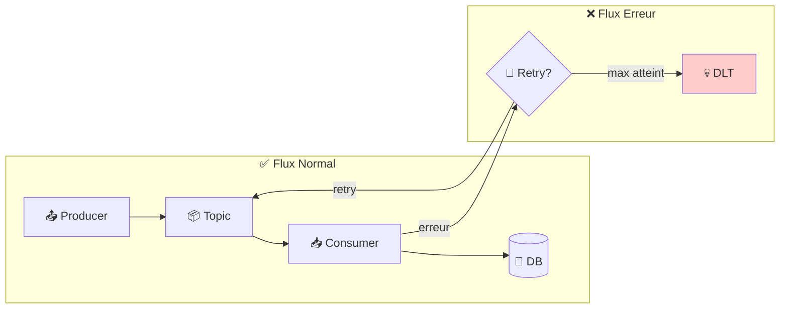
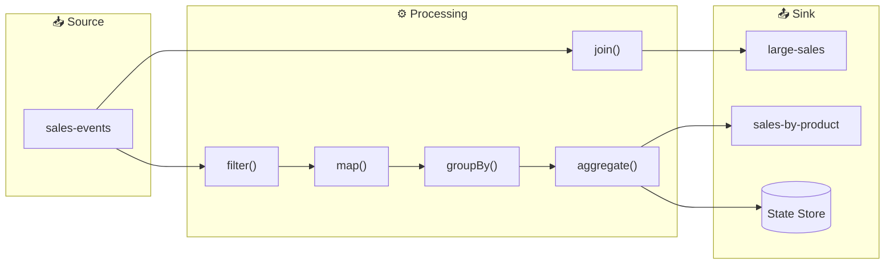
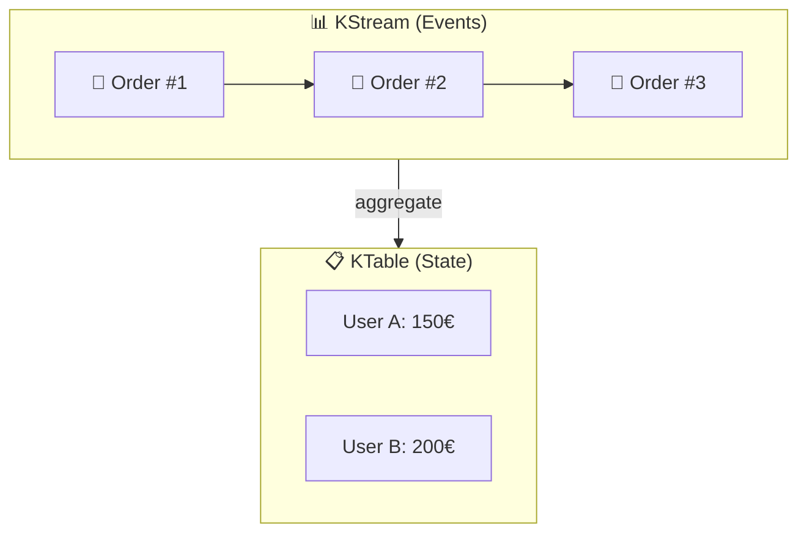
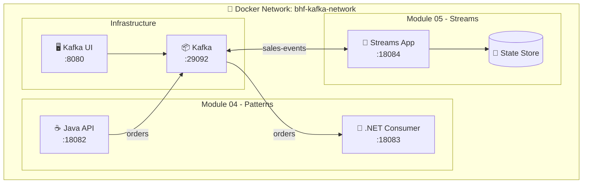

# 📅 Day 02 - Développement Avancé & Kafka Streams

> **Durée estimée** : 5-6 heures | **Niveau** : Intermédiaire → Avancé

---

## 🎯 Objectifs pédagogiques

À la fin de cette journée, vous serez capable de :

| # | Objectif | Module |
|---|----------|--------|
| 1 | Implémenter le pattern **Dead Letter Topic** (DLT) | M04 |
| 2 | Configurer des **retries avec backoff exponentiel** | M04 |
| 3 | Gérer le **rebalancing** avec CooperativeSticky | M04 |
| 4 | Distinguer les erreurs **transient vs permanent** | M04 |
| 5 | Créer une topologie **Kafka Streams** complète | M05 |
| 6 | Utiliser **KStream** et **KTable** pour le traitement temps réel | M05 |
| 7 | Implémenter des **agrégations windowed** et des **joins** | M05 |
| 8 | Interroger les **State Stores** via Interactive Queries | M05 |

---

## 📚 Concepts fondamentaux

### Dead Letter Topic (DLT)



### Stratégie de Retry

| Type d'erreur | Exemple | Action | Retry? |
|---------------|---------|--------|--------|
| **Transient** | Network timeout, DB lock | Retry avec backoff | ✅ Oui |
| **Permanent** | Invalid JSON, Business rule | Envoyer au DLT | ❌ Non |
| **Poison Pill** | Message corrompu | Log + Skip | ❌ Non |

### Backoff Exponentiel

```mermaid
gantt
    title Stratégie de Backoff Exponentiel
    dateFormat X
    axisFormat %s
    
    section Retries
    Tentative 1 (100ms)    :0, 1
    Attente               :1, 2
    Tentative 2 (200ms)    :2, 3
    Attente               :3, 5
    Tentative 3 (400ms)    :5, 6
    Attente               :6, 10
    DLT                    :crit, 10, 11
```



### Kafka Streams - Topologie



### KStream vs KTable

| Aspect | KStream | KTable |
|--------|---------|--------|
| **Sémantique** | Flux d'événements | Table de faits |
| **Données** | Append-only | Upsert (clé unique) |
| **Exemple** | Transactions | Solde compte |
| **Opération** | `filter`, `map` | `aggregate`, `reduce` |



---

## 💡 Tips & Best Practices

### Dead Letter Topic

> **💀 Toujours créer un DLT pour chaque topic critique**
> ```java
> @Bean
> public DeadLetterPublishingRecoverer recoverer(KafkaTemplate<?, ?> template) {
>     return new DeadLetterPublishingRecoverer(template,
>         (record, ex) -> new TopicPartition(record.topic() + ".DLT", -1));
> }
> ```

> **📊 Monitorer le DLT en production**
> - Alerter si messages dans DLT
> - Dashboard Grafana pour consumer lag du DLT
> - Processus de retraitement manuel

### Kafka Streams

> **🆔 Choisir un APPLICATION_ID unique par application**
> ```java
> props.put(StreamsConfig.APPLICATION_ID_CONFIG, "sales-processor-v1");
> ```

> **💾 Configurer le State Store pour la production**
> ```java
> props.put(StreamsConfig.STATE_DIR_CONFIG, "/var/kafka-streams");
> props.put(StreamsConfig.NUM_STANDBY_REPLICAS_CONFIG, 1);
> ```

> **⏰ Gérer le temps correctement**
> ```java
> // Utiliser event time, pas processing time
> props.put(StreamsConfig.DEFAULT_TIMESTAMP_EXTRACTOR_CLASS_CONFIG,
>           WallclockTimestampExtractor.class);
> ```

---

## 🏗️ Architecture du Lab



---

## 📦 Modules

| Module | Titre | Durée | Description |
|--------|-------|-------|-------------|
| [**M04**](./module-04-advanced-patterns/README.md) | Patterns Avancés | 90-120 min | DLT, Retry, Rebalancing |
| [**M05**](./module-05-kafka-streams/README.md) | Kafka Streams | 90-120 min | KStream, KTable, Aggregations |

---

## 🚀 Quick Start

### Prérequis

- ✅ Day 01 complété
- ✅ Kafka infrastructure running

### Démarrer les modules

```powershell
# Depuis formation-v2/
cd infra
docker-compose -f docker-compose.single-node.yml up -d

# Module 04
cd ../day-02-development/module-04-advanced-patterns
docker-compose -f docker-compose.module.yml up -d --build

# Module 05
cd ../module-05-kafka-streams
docker-compose -f docker-compose.module.yml up -d --build
```

### Ports

| Service | Port | Description |
|---------|------|-------------|
| M04 Java API | 18082 | Producer avec DLT |
| M04 .NET Consumer | 18083 | Consumer avec rebalancing |
| M05 Streams App | 18084 | Kafka Streams + REST |

---

## ⚠️ Erreurs courantes

| Erreur | Cause | Solution |
|--------|-------|----------|
| `StreamsException: task timeout` | Processing trop lent | Augmenter `max.poll.interval.ms` |
| `InvalidStateStoreException` | Store non prêt | Attendre `KafkaStreams.State.RUNNING` |
| `SerializationException` | Serde incorrect | Vérifier JsonSerde configuration |
| Message dans DLT | Erreur de traitement | Analyser l'exception dans le header |

---

## ➡️ Navigation

⬅️ **[Day 01 - Fondamentaux](../day-01-foundations/README.md)**

➡️ **[Day 03 - Intégration](../day-03-integration/README.md)**
