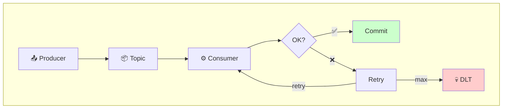
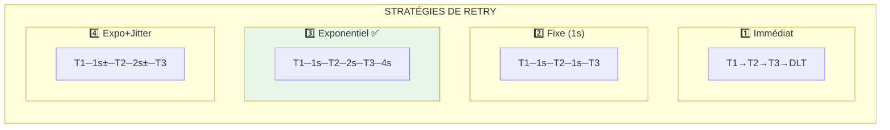
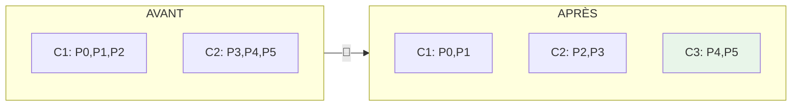
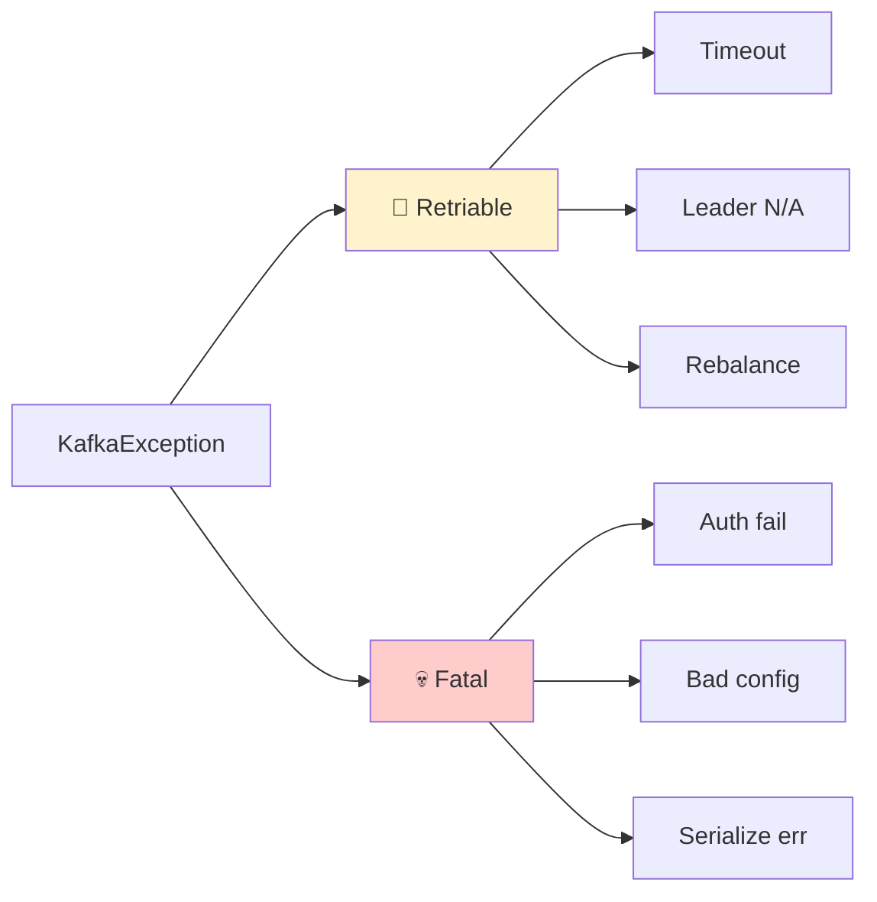

# 🔄 Module 04 - Patterns Avancés : DLT, Retries & Rebalancing

| Durée | Niveau | Prérequis |
|-------|--------|-----------|
| 3 heures | Intermédiaire | Modules 01-03 complétés |

## 🎯 Objectifs d'apprentissage

À la fin de ce module, vous serez capable de :

- ✅ Implémenter un Dead Letter Topic (DLT) pour gérer les messages en erreur
- ✅ Configurer des stratégies de retry robustes
- ✅ Comprendre et gérer le rebalancing des consumer groups
- ✅ Implémenter des patterns de gestion d'erreurs professionnels

---

## 📚 Partie Théorique (30%)

### 1. Dead Letter Topics (DLT)

#### Concept

Un **Dead Letter Topic** est un topic spécial où sont envoyés les messages qui ne peuvent pas être traités après plusieurs tentatives. C'est un pattern essentiel pour la résilience des applications.



#### Quand utiliser un DLT ?

| Situation | Avec DLT | Sans DLT |
|-----------|----------|----------|
| Message malformé | ✅ Isolé pour analyse | ❌ Bloque le consumer |
| Service externe down | ✅ Retry puis DLT | ❌ Perte ou blocage |
| Erreur de validation | ✅ Traçabilité | ❌ Message perdu |
| Bug applicatif | ✅ Replay possible | ❌ Données perdues |

#### Structure d'un message DLT

```json
{
  "originalTopic": "orders",
  "originalPartition": 2,
  "originalOffset": 12345,
  "originalKey": "order-123",
  "originalValue": "{...}",
  "errorMessage": "ValidationException: Invalid amount",
  "errorTimestamp": "2024-01-15T10:30:00Z",
  "retryCount": 3,
  "stackTrace": "..."
}
```

---

### 2. Stratégies de Retry

#### Types de Retry



#### Configuration recommandée

```java
// Backoff exponentiel avec jitter
RetryConfig config = RetryConfig.builder()
    .maxAttempts(5)
    .initialDelay(Duration.ofSeconds(1))
    .maxDelay(Duration.ofMinutes(5))
    .multiplier(2.0)
    .jitterFactor(0.2)
    .retryOn(TransientException.class)
    .build();
```

#### Erreurs Retryables vs Non-Retryables

| Type | Exemples | Action |
|------|----------|--------|
| **Retryable** | Timeout réseau, Service indisponible, Rate limit | Retry avec backoff |
| **Non-Retryable** | Validation échouée, Message malformé, Auth failure | DLT immédiat |

---

### 3. Consumer Rebalancing

#### Qu'est-ce que le Rebalancing ?

Le **rebalancing** est le processus par lequel Kafka redistribue les partitions entre les consumers d'un même group lorsque :
- Un consumer rejoint le group
- Un consumer quitte le group (crash ou shutdown)
- Le nombre de partitions change



> ⚠️ **PENDANT LE REBALANCING** : Aucun consumer ne traite de messages!

#### Stratégies d'assignation

| Stratégie | Description | Cas d'usage |
|-----------|-------------|-------------|
| **RangeAssignor** | Assignation par plage contiguë | Par défaut, simple |
| **RoundRobinAssignor** | Distribution équitable | Charge uniforme |
| **StickyAssignor** | Minimise les mouvements | Réduire le rebalancing |
| **CooperativeStickyAssignor** | Rebalancing incrémental | Production (recommandé) |

#### Callbacks de Rebalancing

```java
consumer.subscribe(topics, new ConsumerRebalanceListener() {
    @Override
    public void onPartitionsRevoked(Collection<TopicPartition> partitions) {
        // Appelé AVANT que les partitions soient retirées
        // → Commit les offsets, flush les buffers
        log.info("Partitions révoquées: {}", partitions);
        consumer.commitSync();
    }

    @Override
    public void onPartitionsAssigned(Collection<TopicPartition> partitions) {
        // Appelé APRÈS que les nouvelles partitions sont assignées
        // → Initialiser l'état, seek si nécessaire
        log.info("Partitions assignées: {}", partitions);
    }
});
```

---

### 4. Gestion d'erreurs professionnelle

#### Hiérarchie des erreurs Kafka



| Type | Action |
|------|--------|
| **Retriable** | Retry avec backoff |
| **Fatal** | Fail fast → DLT |

#### Pattern de gestion d'erreurs complet

```java
public void processWithErrorHandling(ConsumerRecords<String, String> records) {
    for (ConsumerRecord<String, String> record : records) {
        int retryCount = 0;
        boolean processed = false;
        
        while (!processed && retryCount < MAX_RETRIES) {
            try {
                // Traitement métier
                processRecord(record);
                processed = true;
                
            } catch (TransientException e) {
                // Erreur temporaire → retry
                retryCount++;
                log.warn("Retry {}/{} pour offset {}", 
                    retryCount, MAX_RETRIES, record.offset());
                sleepWithBackoff(retryCount);
                
            } catch (PermanentException e) {
                // Erreur permanente → DLT immédiat
                sendToDlt(record, e);
                processed = true;
            }
        }
        
        if (!processed) {
            // Max retries atteint → DLT
            sendToDlt(record, new MaxRetriesExceededException());
        }
    }
}
```

---

## 🔌 Ports et Services

| Service | Port | Description |
|---------|------|-------------|
| Java API (Producer/Consumer) | 18082 | API avec DLT et retries |
| .NET API (Consumer) | 18083 | Consumer avec rebalancing |
| Kafka UI | 8080 | Visualisation des topics |
| Kafka | 9092 | Broker externe |

---

## 🛠️ Partie Pratique (70%)

### Prérequis

<details>
<summary>🐳 <b>Mode Docker</b></summary>

```bash
cd formation-v2/
./scripts/up.sh
```

</details>

<details>
<summary>☸️ <b>Mode OKD/K3s</b></summary>

```bash
# Vérifier que le cluster Kafka est prêt
kubectl get kafka -n kafka
kubectl get pods -n kafka -l strimzi.io/cluster=bhf-kafka
```

</details>

---

### Étape 1 - Démarrer le module

**Objectif** : Lancer les services du module.

<details>
<summary>🐳 <b>Mode Docker</b></summary>

```bash
docker compose -f day-02-development/module-04-advanced-patterns/docker-compose.module.yml up -d --build
```

**Vérification** :

```bash
docker ps --format 'table {{.Names}}\t{{.Status}}\t{{.Ports}}' | grep m04
```

</details>

<details>
<summary>☸️ <b>Mode OKD/K3s</b></summary>

```bash
# Builder et pousser les images vers le registry local
cd formation-v2/day-02-development/module-04-advanced-patterns

docker build -t localhost:5000/m04-java-api:latest -f java/Dockerfile java/
docker push localhost:5000/m04-java-api:latest

# Déployer sur K8s
cat <<EOF | kubectl apply -f -
apiVersion: apps/v1
kind: Deployment
metadata:
  name: m04-java-api
  namespace: kafka
spec:
  replicas: 1
  selector:
    matchLabels:
      app: m04-java-api
  template:
    metadata:
      labels:
        app: m04-java-api
    spec:
      containers:
      - name: java-api
        image: localhost:5000/m04-java-api:latest
        ports:
        - containerPort: 8080
        env:
        - name: KAFKA_BOOTSTRAP_SERVERS
          value: "bhf-kafka-kafka-bootstrap.kafka.svc:9092"
---
apiVersion: v1
kind: Service
metadata:
  name: m04-java-api
  namespace: kafka
spec:
  type: NodePort
  ports:
  - port: 8080
    targetPort: 8080
    nodePort: 31082
  selector:
    app: m04-java-api
EOF
```

**Vérification** :

```bash
kubectl get pods -n kafka -l app=m04-java-api
```

</details>

---

### Étape 2 - Créer les topics

**Objectif** : Créer le topic principal et le DLT.

<details>
<summary>🐳 <b>Mode Docker</b></summary>

```bash
# Topic principal
docker exec kafka kafka-topics --create \
  --topic orders \
  --partitions 6 \
  --replication-factor 1 \
  --bootstrap-server localhost:9092

# Dead Letter Topic
docker exec kafka kafka-topics --create \
  --topic orders.DLT \
  --partitions 3 \
  --replication-factor 1 \
  --bootstrap-server localhost:9092

# Topic de retry
docker exec kafka kafka-topics --create \
  --topic orders.retry \
  --partitions 3 \
  --replication-factor 1 \
  --bootstrap-server localhost:9092
```

**Vérification** :

```bash
docker exec kafka kafka-topics --list --bootstrap-server localhost:9092 | grep orders
```

</details>

<details>
<summary>☸️ <b>Mode OKD/K3s</b></summary>

```bash
# Créer les topics via KafkaTopic CRs
cat <<EOF | kubectl apply -f -
apiVersion: kafka.strimzi.io/v1beta2
kind: KafkaTopic
metadata:
  name: orders
  namespace: kafka
  labels:
    strimzi.io/cluster: bhf-kafka
spec:
  partitions: 6
  replicas: 3
---
apiVersion: kafka.strimzi.io/v1beta2
kind: KafkaTopic
metadata:
  name: orders.dlt
  namespace: kafka
  labels:
    strimzi.io/cluster: bhf-kafka
spec:
  partitions: 3
  replicas: 3
---
apiVersion: kafka.strimzi.io/v1beta2
kind: KafkaTopic
metadata:
  name: orders.retry
  namespace: kafka
  labels:
    strimzi.io/cluster: bhf-kafka
spec:
  partitions: 3
  replicas: 3
EOF
```

**Vérification** :

```bash
kubectl get kafkatopics -n kafka | grep orders
```

</details>

**Résultat attendu** :

```text
orders
orders.DLT
orders.retry
```

---

### Étape 3 - Lab 1 : Envoi de messages valides

**Objectif** : Vérifier le flux normal sans erreur.

<details>
<summary>🐳 <b>Mode Docker</b></summary>

```bash
# Envoyer 5 messages valides
for i in {1..5}; do
  curl -X POST "http://localhost:18082/api/v1/orders" \
    -H "Content-Type: application/json" \
    -d "{\"orderId\": \"ORD-$i\", \"amount\": $((i * 100)), \"status\": \"PENDING\"}"
  echo ""
done
```

**Vérification dans Kafka UI** :

1. Ouvrez http://localhost:8080
2. Cliquez sur **Topics** → **orders**
3. Vérifiez que 5 messages sont présents

</details>

<details>
<summary>☸️ <b>Mode OKD/K3s</b></summary>

```bash
# Envoyer 5 messages valides (NodePort 31082)
for i in {1..5}; do
  curl -X POST "http://localhost:31082/api/v1/orders" \
    -H "Content-Type: application/json" \
    -d "{\"orderId\": \"ORD-$i\", \"amount\": $((i * 100)), \"status\": \"PENDING\"}"
  echo ""
done
```

**Vérification via kubectl** :

```bash
kubectl run kafka-consumer --rm -it --restart=Never \
  --image=quay.io/strimzi/kafka:latest-kafka-4.0.0 \
  -n kafka -- bin/kafka-console-consumer.sh \
  --bootstrap-server bhf-kafka-kafka-bootstrap:9092 \
  --topic orders --from-beginning --max-messages 5
```

</details>

---

### Étape 4 - Lab 2 : Simulation d'erreurs et DLT

**Objectif** : Observer le comportement avec des messages invalides.

#### 4.1 Envoyer un message invalide (montant négatif)

<details>
<summary>🐳 <b>Mode Docker</b></summary>

```bash
curl -X POST "http://localhost:18082/api/v1/orders" \
  -H "Content-Type: application/json" \
  -d '{"orderId": "ORD-INVALID", "amount": -50, "status": "PENDING"}'
```

</details>

<details>
<summary>☸️ <b>Mode OKD/K3s</b></summary>

```bash
curl -X POST "http://localhost:31082/api/v1/orders" \
  -H "Content-Type: application/json" \
  -d '{"orderId": "ORD-INVALID", "amount": -50, "status": "PENDING"}'
```

</details>

**Résultat attendu** : Le message est rejeté et envoyé au DLT.

#### 4.2 Vérifier le DLT

<details>
<summary>🐳 <b>Mode Docker</b></summary>

```bash
docker exec kafka kafka-console-consumer \
  --topic orders.DLT \
  --from-beginning \
  --max-messages 1 \
  --bootstrap-server localhost:9092
```

</details>

<details>
<summary>☸️ <b>Mode OKD/K3s</b></summary>

```bash
kubectl run kafka-consumer --rm -it --restart=Never \
  --image=quay.io/strimzi/kafka:latest-kafka-4.0.0 \
  -n kafka -- bin/kafka-console-consumer.sh \
  --bootstrap-server bhf-kafka-kafka-bootstrap:9092 \
  --topic orders.dlt --from-beginning --max-messages 1
```

</details>

**Résultat attendu** : Message avec métadonnées d'erreur.

---

### Étape 5 - Lab 3 : Test des retries avec erreur transitoire

**Objectif** : Observer le mécanisme de retry.

#### 5.1 Activer le mode "erreur transitoire"

<details>
<summary>🐳 <b>Mode Docker</b></summary>

```bash
curl -X POST "http://localhost:18082/api/v1/config/simulate-transient-error?enabled=true"
```

</details>

<details>
<summary>☸️ <b>Mode OKD/K3s</b></summary>

```bash
curl -X POST "http://localhost:31082/api/v1/config/simulate-transient-error?enabled=true"
```

</details>

#### 5.2 Envoyer un message

<details>
<summary>🐳 <b>Mode Docker</b></summary>

```bash
curl -X POST "http://localhost:18082/api/v1/orders" \
  -H "Content-Type: application/json" \
  -d '{"orderId": "ORD-RETRY", "amount": 200, "status": "PENDING"}'
```

</details>

<details>
<summary>☸️ <b>Mode OKD/K3s</b></summary>

```bash
curl -X POST "http://localhost:31082/api/v1/orders" \
  -H "Content-Type: application/json" \
  -d '{"orderId": "ORD-RETRY", "amount": 200, "status": "PENDING"}'
```

</details>

#### 5.3 Observer les logs

<details>
<summary>🐳 <b>Mode Docker</b></summary>

```bash
docker logs m04-java-api --tail 50 | grep -E "(Retry|attempt|DLT)"
```

</details>

<details>
<summary>☸️ <b>Mode OKD/K3s</b></summary>

```bash
kubectl logs -n kafka -l app=m04-java-api --tail 50 | grep -E "(Retry|attempt|DLT)"
```

</details>

**Résultat attendu** : Plusieurs tentatives avant succès ou DLT.

#### 5.4 Désactiver le mode erreur

<details>
<summary>🐳 <b>Mode Docker</b></summary>

```bash
curl -X POST "http://localhost:18082/api/v1/config/simulate-transient-error?enabled=false"
```

</details>

<details>
<summary>☸️ <b>Mode OKD/K3s</b></summary>

```bash
curl -X POST "http://localhost:31082/api/v1/config/simulate-transient-error?enabled=false"
```

</details>

---

### Étape 6 - Lab 4 : Observer le Rebalancing

**Objectif** : Voir le rebalancing en action.

#### 6.1 Démarrer un second consumer

<details>
<summary>🐳 <b>Mode Docker</b></summary>

```bash
docker compose -f day-02-development/module-04-advanced-patterns/docker-compose.module.yml \
  up -d --scale dotnet-consumer=2
```

</details>

<details>
<summary>☸️ <b>Mode OKD/K3s</b></summary>

```bash
kubectl scale deployment m04-java-api -n kafka --replicas=2
```

</details>

#### 6.2 Observer les logs de rebalancing

<details>
<summary>🐳 <b>Mode Docker</b></summary>

```bash
docker logs m04-dotnet-consumer-1 --tail 20 | grep -i rebalance
docker logs m04-dotnet-consumer-2 --tail 20 | grep -i rebalance
```

</details>

<details>
<summary>☸️ <b>Mode OKD/K3s</b></summary>

```bash
kubectl logs -n kafka -l app=m04-java-api --tail 20 | grep -i rebalance
```

</details>

#### 6.3 Envoyer des messages pendant le rebalancing

<details>
<summary>🐳 <b>Mode Docker</b></summary>

```bash
for i in {1..10}; do
  curl -X POST "http://localhost:18082/api/v1/orders" \
    -H "Content-Type: application/json" \
    -d "{\"orderId\": \"ORD-REBAL-$i\", \"amount\": 100, \"status\": \"PENDING\"}"
done
```

</details>

<details>
<summary>☸️ <b>Mode OKD/K3s</b></summary>

```bash
for i in {1..10}; do
  curl -X POST "http://localhost:31082/api/v1/orders" \
    -H "Content-Type: application/json" \
    -d "{\"orderId\": \"ORD-REBAL-$i\", \"amount\": 100, \"status\": \"PENDING\"}"
done
```

</details>

#### 6.4 Arrêter un consumer pour déclencher un rebalancing

<details>
<summary>🐳 <b>Mode Docker</b></summary>

```bash
docker stop m04-dotnet-consumer-2
```

</details>

<details>
<summary>☸️ <b>Mode OKD/K3s</b></summary>

```bash
kubectl scale deployment m04-java-api -n kafka --replicas=1
```

</details>

**Observer** : Les logs du consumer 1 montrent la réassignation des partitions.

---

### Étape 7 - Lab 5 : Monitoring des erreurs

**Objectif** : Utiliser les endpoints de monitoring.

<details>
<summary>🐳 <b>Mode Docker</b></summary>

```bash
# Statistiques des erreurs
curl -s http://localhost:18082/api/v1/stats | jq

# Messages dans le DLT
curl -s http://localhost:18082/api/v1/dlt/count

# Health check
curl -s http://localhost:18082/health
```

</details>

<details>
<summary>☸️ <b>Mode OKD/K3s</b></summary>

```bash
# Statistiques des erreurs (NodePort 31082)
curl -s http://localhost:31082/api/v1/stats | jq

# Messages dans le DLT
curl -s http://localhost:31082/api/v1/dlt/count

# Health check
curl -s http://localhost:31082/health
```

</details>

---

## ✅ Checkpoint de validation

Cochez chaque élément complété :

- [ ] Topic `orders` créé avec 6 partitions
- [ ] Topic `orders.DLT` créé
- [ ] Messages valides traités correctement
- [ ] Message invalide routé vers DLT
- [ ] Retries observés dans les logs
- [ ] Rebalancing déclenché et observé
- [ ] Statistiques d'erreurs consultées

---

## 🔧 Troubleshooting

### Consumer bloqué

**Symptôme** : Pas de traitement des messages.

```bash
# Vérifier le lag
docker exec kafka kafka-consumer-groups \
  --describe --group orders-consumer-group \
  --bootstrap-server localhost:9092
```

### DLT vide alors qu'il devrait y avoir des erreurs

**Symptôme** : Pas de messages dans le DLT.

```bash
# Vérifier les logs
docker logs m04-java-api --tail 100 | grep -i error
```

### Rebalancing trop fréquent

**Symptôme** : Logs montrant des rebalancing constants.

**Cause possible** : `session.timeout.ms` trop court.

---

## 🧹 Nettoyage

```bash
docker compose -f day-02-development/module-04-advanced-patterns/docker-compose.module.yml down

# Supprimer les topics (optionnel)
docker exec kafka kafka-topics --delete --topic orders --bootstrap-server localhost:9092
docker exec kafka kafka-topics --delete --topic orders.DLT --bootstrap-server localhost:9092
docker exec kafka kafka-topics --delete --topic orders.retry --bootstrap-server localhost:9092
```

---

## 📖 Pour aller plus loin

### Exercices supplémentaires

1. **Configurez un backoff exponentiel** avec un maximum de 5 minutes
2. **Ajoutez un circuit breaker** pour les erreurs répétées
3. **Implémentez un DLT processor** qui retraite automatiquement les erreurs corrigibles

### Ressources

- [Error Handling in Kafka](https://docs.confluent.io/platform/current/clients/consumer.html#error-handling)
- [Consumer Rebalance Protocol](https://cwiki.apache.org/confluence/display/KAFKA/KIP-429%3A+Kafka+Consumer+Incremental+Rebalance+Protocol)
- [Dead Letter Queue Pattern](https://www.enterpriseintegrationpatterns.com/patterns/messaging/DeadLetterChannel.html)

---

## 🛠️ Tutorials pas-à-pas

| IDE | Tutorial | Description |
|-----|----------|-------------|
| **VS Code** | [TUTORIAL-DOTNET.md](./TUTORIAL-DOTNET.md) | DLT, Retry avec Polly, Batch |
| **Visual Studio 2022** | [TUTORIAL-VS2022.md](./TUTORIAL-VS2022.md) | Projet complet avec Circuit Breaker, debugging |
| **IntelliJ / VS Code** | [TUTORIAL-JAVA.md](./TUTORIAL-JAVA.md) | Spring Kafka avec RetryTemplate |
