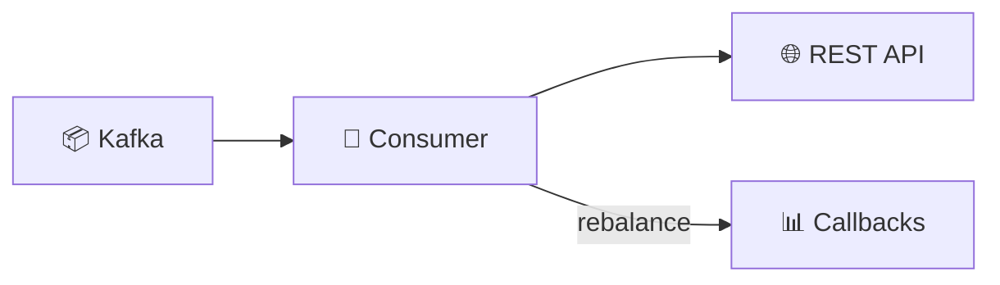
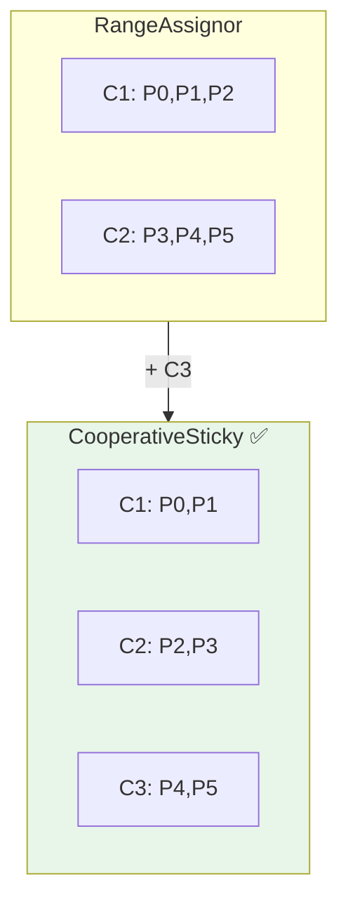
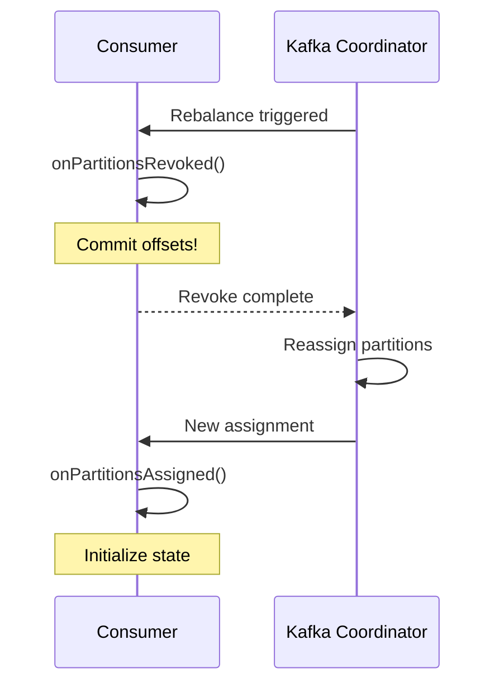

# 🛠️ Tutorial VS Code : API .NET - Consumer Kafka avec Rebalancing

## 📋 Vue d'ensemble

Ce tutorial vous guide pas à pas pour implémenter un **Consumer Kafka ASP.NET** avec :
- **Gestion du Rebalancing** (CooperativeSticky)
- **Callbacks de partition** (Assigned, Revoked, Lost)
- **Commit manuel** des offsets
- **API REST** pour monitoring



---

## 🎯 Prérequis

### Outils requis

| Outil | Version | Installation |
|-------|---------|--------------|
| **VS Code** | Latest | [code.visualstudio.com](https://code.visualstudio.com) |
| **.NET SDK** | 8.0+ | `winget install Microsoft.DotNet.SDK.8` |
| **Docker Desktop** | Latest | [docker.com](https://docker.com) |

### Extensions VS Code recommandées

```bash
# Installation via CLI
code --install-extension ms-dotnettools.csharp
code --install-extension ms-dotnettools.csdevkit
code --install-extension ms-azuretools.vscode-docker
code --install-extension humao.rest-client
```

---

## 📁 Étape 1 : Créer le projet

### 1.1 Initialiser le projet .NET

```powershell
# Créer le dossier et initialiser
mkdir module04-dotnet-consumer
cd module04-dotnet-consumer

# Créer un projet ASP.NET Minimal API
dotnet new web -n Module04Consumer

# Entrer dans le projet
cd Module04Consumer

# Ouvrir dans VS Code
code .
```

### 1.2 Ajouter le package Confluent.Kafka

```powershell
dotnet add package Confluent.Kafka
```

### 1.3 Structure finale

```
Module04Consumer/
├── Module04Consumer.csproj    # Configuration projet
├── Program.cs                 # Code principal
├── Dockerfile                 # Image Docker
└── requests.http              # Tests API
```

---

## 📦 Étape 2 : Configuration du projet (.csproj)

### 2.1 Vérifier `Module04Consumer.csproj`

```xml
<Project Sdk="Microsoft.NET.Sdk.Web">

  <PropertyGroup>
    <TargetFramework>net8.0</TargetFramework>
    <Nullable>enable</Nullable>
    <ImplicitUsings>enable</ImplicitUsings>
  </PropertyGroup>

  <ItemGroup>
    <!-- Client Kafka officiel pour .NET -->
    <PackageReference Include="Confluent.Kafka" Version="2.3.0" />
  </ItemGroup>

</Project>
```

### 2.2 Confluent.Kafka expliqué

| Classe | Rôle |
|--------|------|
| `ConsumerConfig` | Configuration du consumer |
| `ConsumerBuilder<K,V>` | Créateur de consumer avec handlers |
| `IConsumer<K,V>` | Interface du consumer |
| `ConsumeResult<K,V>` | Résultat d'un poll |

---

## 💻 Étape 3 : Programme principal (Program.cs)

### 3.1 Créer `Program.cs` complet

```csharp
using Confluent.Kafka;
using System.Text.Json;

// ═══════════════════════════════════════════════════════════════
// CONFIGURATION ASP.NET
// ═══════════════════════════════════════════════════════════════
var builder = WebApplication.CreateBuilder(args);

// ═══════════════════════════════════════════════════════════════
// VARIABLES D'ENVIRONNEMENT
// Peuvent être surchargées via Docker ou appsettings.json
// ═══════════════════════════════════════════════════════════════
var bootstrapServers = Environment.GetEnvironmentVariable("KAFKA_BOOTSTRAP_SERVERS") 
    ?? "localhost:9092";
var topic = Environment.GetEnvironmentVariable("KAFKA_TOPIC") 
    ?? "orders";
var groupId = Environment.GetEnvironmentVariable("KAFKA_GROUP_ID") 
    ?? "orders-consumer-group";
var autoOffsetReset = Environment.GetEnvironmentVariable("KAFKA_AUTO_OFFSET_RESET") 
    ?? "earliest";

// ═══════════════════════════════════════════════════════════════
// CONFIGURATION CONSUMER KAFKA
// ═══════════════════════════════════════════════════════════════
var consumerConfig = new ConsumerConfig
{
    // Serveur(s) Kafka
    BootstrapServers = bootstrapServers,
    
    // ID du groupe de consumers
    // Tous les consumers avec le même GroupId partagent les partitions
    GroupId = groupId,
    
    // Où commencer si pas d'offset sauvegardé
    // Earliest = début du topic, Latest = fin du topic
    AutoOffsetReset = Enum.Parse<AutoOffsetReset>(autoOffsetReset, true),
    
    // ═══════════════════════════════════════════════════════════
    // COMMIT MANUEL
    // Plus de contrôle : on commit après traitement réussi
    // ═══════════════════════════════════════════════════════════
    EnableAutoCommit = false,
    
    // ═══════════════════════════════════════════════════════════
    // TIMEOUTS DE SESSION
    // SessionTimeoutMs : délai avant que Kafka considère le consumer mort
    // HeartbeatIntervalMs : fréquence des heartbeats (doit être < SessionTimeout/3)
    // MaxPollIntervalMs : délai max entre deux poll() avant kick
    // ═══════════════════════════════════════════════════════════
    SessionTimeoutMs = 45000,      // 45 secondes
    HeartbeatIntervalMs = 15000,   // 15 secondes
    MaxPollIntervalMs = 300000,    // 5 minutes
    
    // ═══════════════════════════════════════════════════════════
    // STRATÉGIE D'ASSIGNATION
    // CooperativeSticky : Rebalancing incrémental, minimise les interruptions
    // ═══════════════════════════════════════════════════════════
    PartitionAssignmentStrategy = PartitionAssignmentStrategy.CooperativeSticky
};

// ═══════════════════════════════════════════════════════════════
// ÉTAT DU CONSUMER (pour monitoring)
// ═══════════════════════════════════════════════════════════════
var messagesProcessed = 0L;
var partitionsAssigned = new List<string>();
var lastRebalanceTime = DateTime.MinValue;
var rebalanceCount = 0;
var cts = new CancellationTokenSource();

// ═══════════════════════════════════════════════════════════════
// DÉMARRER LE CONSUMER EN BACKGROUND
// ═══════════════════════════════════════════════════════════════
Task.Run(() => ConsumeMessages(cts.Token));

var app = builder.Build();

// ═══════════════════════════════════════════════════════════════
// ENDPOINTS REST API
// ═══════════════════════════════════════════════════════════════

// Health check
app.MapGet("/health", () => Results.Ok(new { status = "UP" }));

// Statistiques du consumer
app.MapGet("/api/v1/stats", () => Results.Ok(new
{
    messagesProcessed,
    partitionsAssigned,
    rebalanceCount,
    lastRebalanceTime = lastRebalanceTime == DateTime.MinValue 
        ? "N/A" 
        : lastRebalanceTime.ToString("O")
}));

// Partitions actuellement assignées
app.MapGet("/api/v1/partitions", () => Results.Ok(new
{
    partitions = partitionsAssigned,
    count = partitionsAssigned.Count
}));

app.Run();

// ═══════════════════════════════════════════════════════════════
// FONCTION DE CONSOMMATION
// Boucle infinie qui poll les messages Kafka
// ═══════════════════════════════════════════════════════════════
async Task ConsumeMessages(CancellationToken cancellationToken)
{
    // ═══════════════════════════════════════════════════════════
    // CRÉATION DU CONSUMER AVEC HANDLERS DE REBALANCING
    // ═══════════════════════════════════════════════════════════
    using var consumer = new ConsumerBuilder<string, string>(consumerConfig)
        
        // ─────────────────────────────────────────────────────────
        // CALLBACK : PARTITIONS ASSIGNÉES
        // Appelé quand de nouvelles partitions sont assignées
        // ─────────────────────────────────────────────────────────
        .SetPartitionsAssignedHandler((c, partitions) =>
        {
            rebalanceCount++;
            lastRebalanceTime = DateTime.UtcNow;
            partitionsAssigned = partitions
                .Select(p => $"{p.Topic}-{p.Partition}")
                .ToList();
            
            Console.WriteLine($"[REBALANCE] Partitions assigned: " +
                $"{string.Join(", ", partitionsAssigned)}");
        })
        
        // ─────────────────────────────────────────────────────────
        // CALLBACK : PARTITIONS RÉVOQUÉES
        // Appelé AVANT que les partitions soient retirées
        // → Moment idéal pour committer les offsets
        // ─────────────────────────────────────────────────────────
        .SetPartitionsRevokedHandler((c, partitions) =>
        {
            var revoked = partitions
                .Select(p => $"{p.Topic}-{p.Partition}")
                .ToList();
            
            Console.WriteLine($"[REBALANCE] Partitions revoked: " +
                $"{string.Join(", ", revoked)}");
            
            try
            {
                // Committer avant de perdre les partitions
                c.Commit();
                Console.WriteLine("[REBALANCE] Offsets committed before revocation");
            }
            catch (Exception ex)
            {
                Console.WriteLine($"[REBALANCE] Error committing offsets: {ex.Message}");
            }
        })
        
        // ─────────────────────────────────────────────────────────
        // CALLBACK : PARTITIONS PERDUES
        // Appelé en cas de perte non gracieuse (timeout, crash)
        // Les offsets ne peuvent pas être committés
        // ─────────────────────────────────────────────────────────
        .SetPartitionsLostHandler((c, partitions) =>
        {
            var lost = partitions
                .Select(p => $"{p.Topic}-{p.Partition}")
                .ToList();
            
            Console.WriteLine($"[REBALANCE] Partitions lost: " +
                $"{string.Join(", ", lost)}");
        })
        
        .Build();

    // ═══════════════════════════════════════════════════════════
    // SOUSCRIPTION AU TOPIC
    // ═══════════════════════════════════════════════════════════
    consumer.Subscribe(topic);
    Console.WriteLine($"[CONSUMER] Subscribed to topic: {topic}");
    Console.WriteLine($"[CONSUMER] Group ID: {groupId}");
    Console.WriteLine($"[CONSUMER] Bootstrap servers: {bootstrapServers}");

    // ═══════════════════════════════════════════════════════════
    // BOUCLE DE CONSOMMATION
    // ═══════════════════════════════════════════════════════════
    while (!cancellationToken.IsCancellationRequested)
    {
        try
        {
            // Poll avec timeout de 1 seconde
            var consumeResult = consumer.Consume(TimeSpan.FromMilliseconds(1000));
            
            if (consumeResult == null) continue;

            // Log du message reçu
            Console.WriteLine($"[MESSAGE] Key: {consumeResult.Message.Key}, " +
                            $"Partition: {consumeResult.Partition}, " +
                            $"Offset: {consumeResult.Offset}");

            // ═══════════════════════════════════════════════════════
            // TRAITEMENT DU MESSAGE
            // Simuler un traitement de 100ms
            // ═══════════════════════════════════════════════════════
            await Task.Delay(100, cancellationToken);

            // ═══════════════════════════════════════════════════════
            // COMMIT MANUEL
            // Committer après traitement réussi uniquement
            // ═══════════════════════════════════════════════════════
            consumer.Commit(consumeResult);
            Interlocked.Increment(ref messagesProcessed);
        }
        catch (ConsumeException ex)
        {
            Console.WriteLine($"[ERROR] Consume error: {ex.Error.Reason}");
        }
        catch (OperationCanceledException)
        {
            break;
        }
    }

    // Fermer proprement le consumer
    consumer.Close();
}
```

---

## 🔄 Concepts clés expliqués

### Stratégies d'assignation



| Stratégie | Rebalancing | Interruption |
|-----------|-------------|--------------|
| **Range** | Toutes partitions redistribuées | ⚠️ Totale |
| **RoundRobin** | Toutes partitions redistribuées | ⚠️ Totale |
| **CooperativeSticky** | Incrémental, minimise les mouvements | ✅ Minimale |

### Callbacks de Rebalancing



### Commit manuel vs auto-commit

| Mode | Avantages | Inconvénients |
|------|-----------|---------------|
| **Auto-commit** | Simple, moins de code | Risque de perte ou duplication |
| **Manuel** ✅ | Contrôle total, exactly-once possible | Plus de code, responsabilité |

---

## 🐳 Étape 4 : Dockerfile

### 4.1 Créer `Dockerfile`

```dockerfile
# ═══════════════════════════════════════════════════════════════
# STAGE 1 : BUILD
# Compile l'application .NET
# ═══════════════════════════════════════════════════════════════
FROM mcr.microsoft.com/dotnet/sdk:8.0 AS build
WORKDIR /src

# Copier le fichier projet et restaurer les dépendances
COPY *.csproj .
RUN dotnet restore

# Copier le code source et publier
COPY . .
RUN dotnet publish -c Release -o /app/publish

# ═══════════════════════════════════════════════════════════════
# STAGE 2 : RUNTIME
# Image légère avec uniquement le runtime
# ═══════════════════════════════════════════════════════════════
FROM mcr.microsoft.com/dotnet/aspnet:8.0-alpine
WORKDIR /app

# Copier l'application publiée
COPY --from=build /app/publish .

# Variables d'environnement par défaut
ENV KAFKA_BOOTSTRAP_SERVERS=kafka:29092
ENV KAFKA_TOPIC=orders
ENV KAFKA_GROUP_ID=orders-consumer-group
ENV KAFKA_AUTO_OFFSET_RESET=earliest
ENV ASPNETCORE_URLS=http://+:8080

EXPOSE 8080

ENTRYPOINT ["dotnet", "Module04Consumer.dll"]
```

---

## 🧪 Étape 5 : Tests API

### 5.1 Créer `requests.http`

```http
### Variables
@baseUrl = http://localhost:8080

### ═══════════════════════════════════════════════════════════════
### HEALTH CHECK
### ═══════════════════════════════════════════════════════════════
GET {{baseUrl}}/health

### ═══════════════════════════════════════════════════════════════
### STATISTIQUES DU CONSUMER
### Affiche : messages traités, partitions, rebalances
### ═══════════════════════════════════════════════════════════════
GET {{baseUrl}}/api/v1/stats

### ═══════════════════════════════════════════════════════════════
### PARTITIONS ASSIGNÉES
### Liste des partitions actuellement consommées
### ═══════════════════════════════════════════════════════════════
GET {{baseUrl}}/api/v1/partitions
```

---

## � Étape 6 : Docker Compose - Build et Déploiement

### 6.1 Démarrer l'infrastructure Kafka

```powershell
# Depuis la racine formation-v2/
cd infra

# Démarrer Kafka single-node + Kafka UI
docker-compose -f docker-compose.single-node.yml up -d
```

### 6.2 Créer le topic

```powershell
docker exec -it kafka kafka-topics.sh --create \
  --topic orders \
  --partitions 6 \
  --bootstrap-server localhost:9092
```

### 6.3 Build et démarrer les APIs du module

```powershell
# Depuis le répertoire du module
cd ../day-02-development/module-04-advanced-patterns

# Build et démarrer les APIs Java + .NET
docker-compose -f docker-compose.module.yml up -d --build

# Vérifier les containers
docker-compose -f docker-compose.module.yml ps
```

### 6.4 Tester le .NET Consumer (port 18083)

```powershell
# Health check
curl http://localhost:18083/health

# Vérifier les stats
curl http://localhost:18083/api/v1/stats

# Vérifier les partitions assignées
curl http://localhost:18083/api/v1/partitions
```

### 6.5 Produire des messages de test

```powershell
# Via Java API (port 18082)
curl -X POST http://localhost:18082/api/v1/orders \
  -H "Content-Type: application/json" \
  -d '{"orderId":"ORD-001","amount":99.99,"status":"NEW"}'

# Ou via console producer
docker exec -it kafka kafka-console-producer.sh \
  --topic orders \
  --bootstrap-server localhost:9092 \
  --property "parse.key=true" \
  --property "key.separator=:"

# Taper : ORD-002:{"amount":50.00}
# Ctrl+C pour quitter
```

### 6.6 Arrêter les services

```powershell
docker-compose -f docker-compose.module.yml down
```

---

## 🖥️ Alternative : Exécution locale (sans Docker)

```powershell
# S'assurer que Kafka tourne sur localhost:9092
dotnet run

# Vérifier les stats
curl http://localhost:8080/api/v1/stats
```

---

## 🔬 Exercice : Tester le Rebalancing

### Démarrer plusieurs instances

```powershell
# Terminal 1 : Instance 1 (port 8080)
KAFKA_BOOTSTRAP_SERVERS=localhost:9092 dotnet run --urls=http://localhost:8080

# Terminal 2 : Instance 2 (port 8081)
KAFKA_BOOTSTRAP_SERVERS=localhost:9092 dotnet run --urls=http://localhost:8081

# Terminal 3 : Instance 3 (port 8082)
KAFKA_BOOTSTRAP_SERVERS=localhost:9092 dotnet run --urls=http://localhost:8082
```

### Observer le rebalancing

```powershell
# Vérifier les partitions de chaque instance
curl http://localhost:8080/api/v1/partitions
curl http://localhost:8081/api/v1/partitions
curl http://localhost:8082/api/v1/partitions
```

**Résultat attendu :**
- Avec 6 partitions et 3 consumers → 2 partitions par consumer
- En arrêtant un consumer → les 2 autres récupèrent ses partitions

---

## 📚 Ressources

| Sujet | Lien |
|-------|------|
| **Confluent.Kafka .NET** | [GitHub](https://github.com/confluentinc/confluent-kafka-dotnet) |
| **Documentation** | [docs.confluent.io](https://docs.confluent.io/kafka-clients/dotnet/current/overview.html) |
| **ASP.NET Minimal API** | [Microsoft Docs](https://learn.microsoft.com/en-us/aspnet/core/fundamentals/minimal-apis) |

---

## ✅ Checklist de validation

- [ ] Projet .NET créé avec `dotnet new web`
- [ ] Package `Confluent.Kafka` installé
- [ ] `Program.cs` avec consumer et handlers
- [ ] Dockerfile multi-stage créé
- [ ] Consumer souscrit au topic
- [ ] Messages consommés et affichés dans les logs
- [ ] Commit manuel après chaque message
- [ ] Endpoints REST fonctionnels (/health, /stats, /partitions)
- [ ] Rebalancing testé avec plusieurs instances

---

**🎉 Félicitations !** Vous avez implémenté un Consumer Kafka .NET robuste avec gestion du rebalancing !
