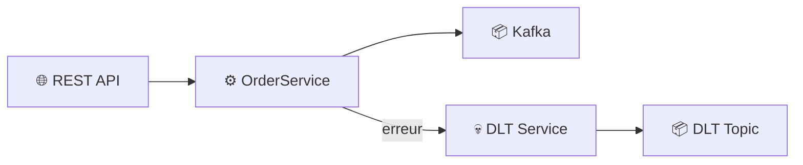
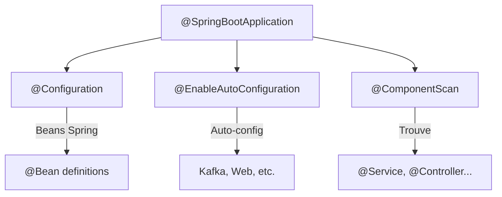
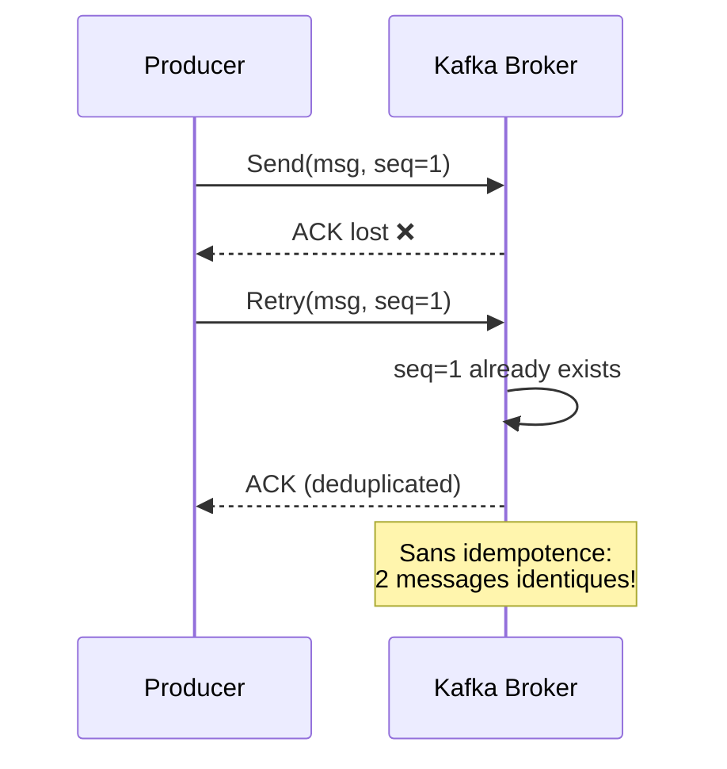
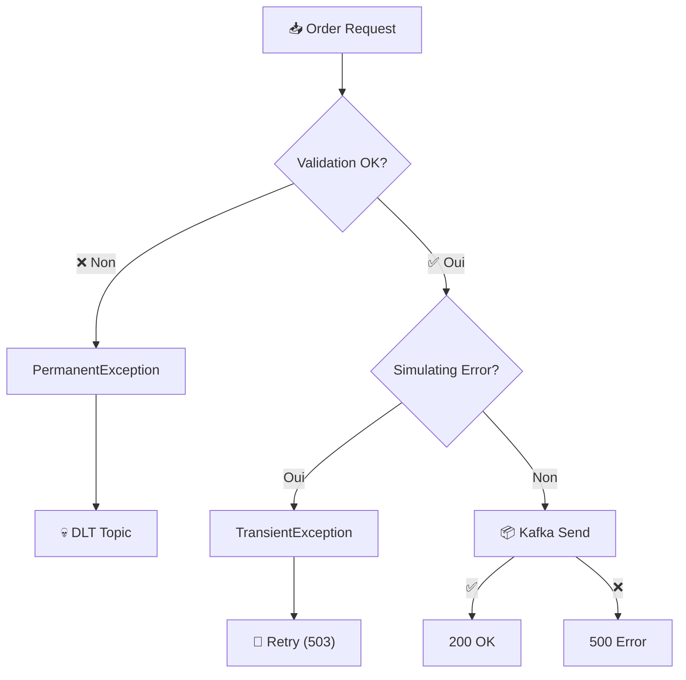
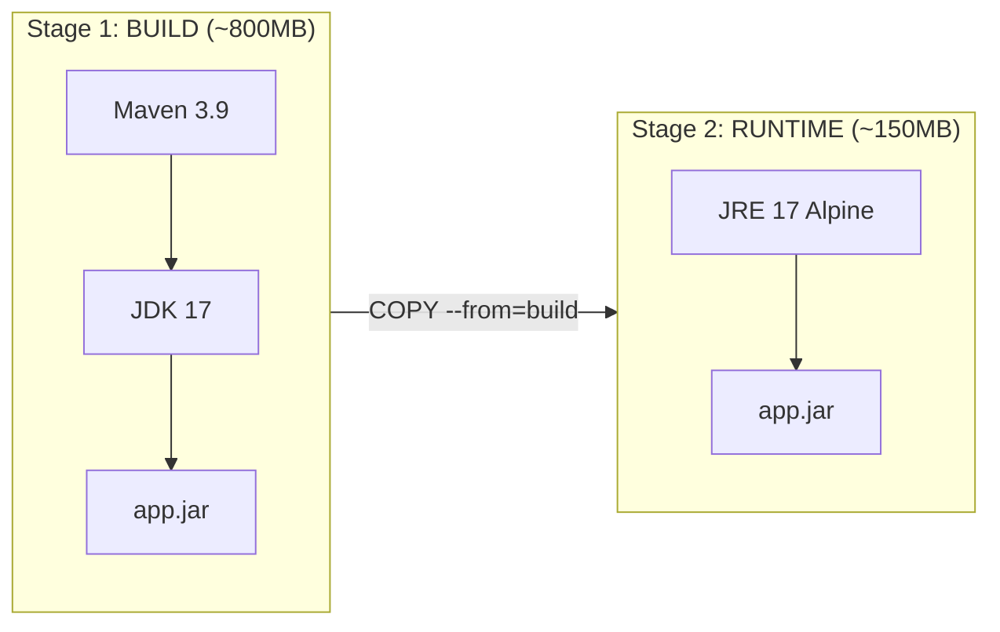
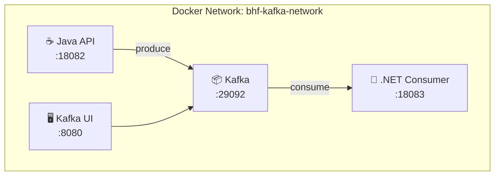

# 🛠️ Tutorial VS Code : API Java - Patterns Avancés Kafka

## 📋 Vue d'ensemble

Ce tutorial vous guide pas à pas pour implémenter une API REST Spring Boot avec :
- **Dead Letter Topic (DLT)** pour gérer les messages en erreur
- **Retry strategies** avec backoff exponentiel
- **Gestion d'erreurs** professionnelle (Transient vs Permanent)



---

## 🎯 Prérequis

### Outils requis

| Outil | Version | Installation |
|-------|---------|--------------|
| **VS Code** | Latest | [code.visualstudio.com](https://code.visualstudio.com) |
| **Java JDK** | 17+ | `winget install Microsoft.OpenJDK.17` |
| **Maven** | 3.8+ | `winget install Apache.Maven` |
| **Docker Desktop** | Latest | [docker.com](https://docker.com) |

### Extensions VS Code recommandées

Ouvrez VS Code et installez ces extensions (Ctrl+Shift+X) :

1. **Extension Pack for Java** (vscjava.vscode-java-pack)
2. **Spring Boot Extension Pack** (vmware.vscode-boot-dev-pack)
3. **Docker** (ms-azuretools.vscode-docker)
4. **REST Client** (humao.rest-client)

```bash
# Installation via CLI
code --install-extension vscjava.vscode-java-pack
code --install-extension vmware.vscode-boot-dev-pack
code --install-extension ms-azuretools.vscode-docker
code --install-extension humao.rest-client
```

---

## 📁 Étape 1 : Structure du projet

### 1.1 Créer le dossier du projet

```powershell
# Ouvrir un terminal PowerShell
mkdir -p module04-java-api
cd module04-java-api
code .
```

### 1.2 Structure finale attendue

```
module04-java-api/
├── pom.xml                          # Configuration Maven
├── Dockerfile                       # Image Docker
├── src/
│   └── main/
│       ├── java/
│       │   └── com/data2ai/kafka/
│       │       ├── Application.java         # Point d'entrée
│       │       ├── config/
│       │       │   └── KafkaConfig.java     # Configuration Kafka
│       │       ├── controller/
│       │       │   └── OrderController.java # Endpoints REST
│       │       ├── model/
│       │       │   └── Order.java           # Modèle de données
│       │       └── service/
│       │           ├── OrderService.java    # Logique métier
│       │           └── DltService.java      # Service DLT
│       └── resources/
│           └── application.properties       # Configuration
└── requests.http                    # Tests API
```

---

## 📝 Étape 2 : Configuration Maven (pom.xml)

### 2.1 Créer le fichier `pom.xml`

Dans VS Code, créez un nouveau fichier `pom.xml` à la racine :

```xml
<?xml version="1.0" encoding="UTF-8"?>
<project xmlns="http://maven.apache.org/POM/4.0.0"
         xmlns:xsi="http://www.w3.org/2001/XMLSchema-instance"
         xsi:schemaLocation="http://maven.apache.org/POM/4.0.0 
         https://maven.apache.org/xsd/maven-4.0.0.xsd">
    <modelVersion>4.0.0</modelVersion>
    
    <!-- 
    ╔═══════════════════════════════════════════════════════════╗
    ║ PARENT: Spring Boot Starter                               ║
    ║ Fournit les dépendances et plugins par défaut             ║
    ╚═══════════════════════════════════════════════════════════╝
    -->
    <parent>
        <groupId>org.springframework.boot</groupId>
        <artifactId>spring-boot-starter-parent</artifactId>
        <version>3.2.0</version>
        <relativePath/>
    </parent>
    
    <!-- Identifiants du projet -->
    <groupId>com.data2ai.kafka</groupId>
    <artifactId>module04-advanced-patterns</artifactId>
    <version>1.0.0</version>
    <name>Module 04 - Advanced Patterns</name>
    <description>DLT, Retries, and Rebalancing patterns</description>
    
    <properties>
        <java.version>17</java.version>
    </properties>
    
    <!-- 
    ╔═══════════════════════════════════════════════════════════╗
    ║ DÉPENDANCES                                               ║
    ╠═══════════════════════════════════════════════════════════╣
    ║ spring-boot-starter-web  → API REST                       ║
    ║ spring-kafka             → Client Kafka                   ║
    ║ spring-boot-actuator     → Health checks                  ║
    ║ jackson-databind         → Sérialisation JSON             ║
    ╚═══════════════════════════════════════════════════════════╝
    -->
    <dependencies>
        <dependency>
            <groupId>org.springframework.boot</groupId>
            <artifactId>spring-boot-starter-web</artifactId>
        </dependency>
        <dependency>
            <groupId>org.springframework.kafka</groupId>
            <artifactId>spring-kafka</artifactId>
        </dependency>
        <dependency>
            <groupId>org.springframework.boot</groupId>
            <artifactId>spring-boot-starter-actuator</artifactId>
        </dependency>
        <dependency>
            <groupId>com.fasterxml.jackson.core</groupId>
            <artifactId>jackson-databind</artifactId>
        </dependency>
    </dependencies>
    
    <build>
        <plugins>
            <plugin>
                <groupId>org.springframework.boot</groupId>
                <artifactId>spring-boot-maven-plugin</artifactId>
            </plugin>
        </plugins>
    </build>
</project>
```

### 2.2 Concepts expliqués

| Dépendance | Rôle | Documentation |
|------------|------|---------------|
| `spring-boot-starter-web` | Serveur Tomcat embarqué + Spring MVC | [Spring Web](https://spring.io/guides/gs/rest-service/) |
| `spring-kafka` | Client Kafka avec KafkaTemplate | [Spring Kafka](https://spring.io/projects/spring-kafka) |
| `spring-boot-starter-actuator` | Endpoints de monitoring (/health) | [Actuator](https://docs.spring.io/spring-boot/docs/current/reference/html/actuator.html) |
| `jackson-databind` | Conversion Java ↔ JSON | [Jackson](https://github.com/FasterXML/jackson-databind) |

---

## ☕ Étape 3 : Point d'entrée Application

### 3.1 Créer `src/main/java/com/data2ai/kafka/Application.java`

```java
package com.data2ai.kafka;

import org.springframework.boot.SpringApplication;
import org.springframework.boot.autoconfigure.SpringBootApplication;

/**
 * Point d'entrée de l'application Spring Boot.
 * 
 * @SpringBootApplication combine 3 annotations :
 * - @Configuration : Classe de configuration Spring
 * - @EnableAutoConfiguration : Configuration automatique basée sur les dépendances
 * - @ComponentScan : Scan des composants dans le package et sous-packages
 */
@SpringBootApplication
public class Application {
    public static void main(String[] args) {
        SpringApplication.run(Application.class, args);
    }
}
```

### 3.2 Concept : @SpringBootApplication



---

## ⚙️ Étape 4 : Configuration Kafka

### 4.1 Créer `src/main/java/com/data2ai/kafka/config/KafkaConfig.java`

```java
package com.data2ai.kafka.config;

import org.apache.kafka.clients.consumer.ConsumerConfig;
import org.apache.kafka.clients.producer.ProducerConfig;
import org.apache.kafka.common.serialization.StringDeserializer;
import org.apache.kafka.common.serialization.StringSerializer;
import org.springframework.beans.factory.annotation.Value;
import org.springframework.context.annotation.Bean;
import org.springframework.context.annotation.Configuration;
import org.springframework.kafka.config.ConcurrentKafkaListenerContainerFactory;
import org.springframework.kafka.core.*;
import org.springframework.kafka.listener.ContainerProperties;
import org.springframework.kafka.listener.DefaultErrorHandler;
import org.springframework.util.backoff.ExponentialBackOff;

import java.util.HashMap;
import java.util.Map;

/**
 * Configuration Kafka pour Producer et Consumer.
 * 
 * Cette classe définit :
 * - ProducerFactory : Comment créer des producteurs Kafka
 * - ConsumerFactory : Comment créer des consommateurs Kafka
 * - KafkaTemplate : API simplifiée pour envoyer des messages
 * - ErrorHandler : Gestion des erreurs avec retry exponentiel
 */
@Configuration
public class KafkaConfig {

    // ═══════════════════════════════════════════════════════════
    // VARIABLES D'ENVIRONNEMENT
    // Peuvent être surchargées via Docker ou application.properties
    // ═══════════════════════════════════════════════════════════
    
    @Value("${KAFKA_BOOTSTRAP_SERVERS:localhost:9092}")
    private String bootstrapServers;

    @Value("${MAX_RETRIES:3}")
    private int maxRetries;

    @Value("${RETRY_BACKOFF_MS:1000}")
    private long retryBackoffMs;

    // ═══════════════════════════════════════════════════════════
    // PRODUCER FACTORY
    // Crée des producteurs Kafka avec la configuration spécifiée
    // ═══════════════════════════════════════════════════════════
    
    @Bean
    public ProducerFactory<String, String> producerFactory() {
        Map<String, Object> config = new HashMap<>();
        
        // Serveur(s) Kafka
        config.put(ProducerConfig.BOOTSTRAP_SERVERS_CONFIG, bootstrapServers);
        
        // Sérialiseurs : Comment convertir clé/valeur en bytes
        config.put(ProducerConfig.KEY_SERIALIZER_CLASS_CONFIG, StringSerializer.class);
        config.put(ProducerConfig.VALUE_SERIALIZER_CLASS_CONFIG, StringSerializer.class);
        
        // ═══════════════════════════════════════════════════════
        // CONFIGURATION FIABILITÉ
        // ═══════════════════════════════════════════════════════
        
        // acks=all : Attendre que TOUS les replicas confirment
        // Garantit la durabilité maximale
        config.put(ProducerConfig.ACKS_CONFIG, "all");
        
        // Idempotence : Évite les doublons en cas de retry réseau
        // Kafka attribue un ID séquentiel à chaque message
        config.put(ProducerConfig.ENABLE_IDEMPOTENCE_CONFIG, true);
        
        // Nombre de retries automatiques par le producer
        config.put(ProducerConfig.RETRIES_CONFIG, maxRetries);
        
        return new DefaultKafkaProducerFactory<>(config);
    }

    // ═══════════════════════════════════════════════════════════
    // KAFKA TEMPLATE
    // API haut niveau pour envoyer des messages
    // ═══════════════════════════════════════════════════════════
    
    @Bean
    public KafkaTemplate<String, String> kafkaTemplate() {
        return new KafkaTemplate<>(producerFactory());
    }

    // ═══════════════════════════════════════════════════════════
    // CONSUMER FACTORY
    // Crée des consommateurs Kafka
    // ═══════════════════════════════════════════════════════════
    
    @Bean
    public ConsumerFactory<String, String> consumerFactory() {
        Map<String, Object> config = new HashMap<>();
        config.put(ConsumerConfig.BOOTSTRAP_SERVERS_CONFIG, bootstrapServers);
        config.put(ConsumerConfig.KEY_DESERIALIZER_CLASS_CONFIG, StringDeserializer.class);
        config.put(ConsumerConfig.VALUE_DESERIALIZER_CLASS_CONFIG, StringDeserializer.class);
        
        // Où commencer si pas d'offset existant
        config.put(ConsumerConfig.AUTO_OFFSET_RESET_CONFIG, "earliest");
        
        // Commit manuel : Plus de contrôle sur quand committer
        config.put(ConsumerConfig.ENABLE_AUTO_COMMIT_CONFIG, false);
        
        return new DefaultKafkaConsumerFactory<>(config);
    }

    // ═══════════════════════════════════════════════════════════
    // LISTENER CONTAINER FACTORY
    // Configure comment les @KafkaListener fonctionnent
    // ═══════════════════════════════════════════════════════════
    
    @Bean
    public ConcurrentKafkaListenerContainerFactory<String, String> kafkaListenerContainerFactory(
            DefaultErrorHandler errorHandler) {
        ConcurrentKafkaListenerContainerFactory<String, String> factory = 
            new ConcurrentKafkaListenerContainerFactory<>();
        factory.setConsumerFactory(consumerFactory());
        
        // Commit manuel immédiat après chaque message traité
        factory.getContainerProperties().setAckMode(ContainerProperties.AckMode.MANUAL_IMMEDIATE);
        
        // Gestionnaire d'erreurs personnalisé
        factory.setCommonErrorHandler(errorHandler);
        
        return factory;
    }

    // ═══════════════════════════════════════════════════════════
    // ERROR HANDLER avec BACKOFF EXPONENTIEL
    // 
    // Backoff exponentiel : 1s → 2s → 4s → 8s → ...
    // Évite de surcharger un service temporairement indisponible
    // ═══════════════════════════════════════════════════════════
    
    @Bean
    public DefaultErrorHandler errorHandler() {
        // Backoff exponentiel : délai initial × multiplier^attempt
        ExponentialBackOff backOff = new ExponentialBackOff(retryBackoffMs, 2.0);
        backOff.setMaxElapsedTime(60000L); // Max 60 secondes au total
        
        return new DefaultErrorHandler((record, exception) -> {
            // Callback quand max retries atteint → Message va au DLT
            System.err.println("Max retries exceeded for record: " + record.key() + 
                ", sending to DLT. Error: " + exception.getMessage());
        }, backOff);
    }
}
```

### 4.2 Concepts clés expliqués

#### Idempotence Producer



#### Backoff Exponentiel

```
Attempt 1: 1000ms  (1s)
Attempt 2: 2000ms  (2s)
Attempt 3: 4000ms  (4s)
Attempt 4: 8000ms  (8s)
... jusqu'à maxElapsedTime (60s)
```

---

## 📦 Étape 5 : Modèle Order

### 5.1 Créer `src/main/java/com/data2ai/kafka/model/Order.java`

```java
package com.data2ai.kafka.model;

import com.fasterxml.jackson.annotation.JsonProperty;

/**
 * Modèle représentant une commande.
 * 
 * @JsonProperty : Mappe les champs Java aux clés JSON
 * Exemple JSON : {"orderId": "ORD-001", "amount": 99.99, "status": "NEW"}
 */
public class Order {
    
    @JsonProperty("orderId")
    private String orderId;
    
    @JsonProperty("amount")
    private double amount;
    
    @JsonProperty("status")
    private String status;

    // Constructeur par défaut (requis pour Jackson)
    public Order() {}

    // Constructeur avec paramètres
    public Order(String orderId, double amount, String status) {
        this.orderId = orderId;
        this.amount = amount;
        this.status = status;
    }

    // ═══════════════════════════════════════════════════════════
    // GETTERS & SETTERS
    // ═══════════════════════════════════════════════════════════
    
    public String getOrderId() { return orderId; }
    public void setOrderId(String orderId) { this.orderId = orderId; }

    public double getAmount() { return amount; }
    public void setAmount(double amount) { this.amount = amount; }

    public String getStatus() { return status; }
    public void setStatus(String status) { this.status = status; }

    // ═══════════════════════════════════════════════════════════
    // VALIDATION MÉTIER
    // Lève IllegalArgumentException si invalide → Envoi au DLT
    // ═══════════════════════════════════════════════════════════
    
    public void validate() throws IllegalArgumentException {
        if (orderId == null || orderId.isEmpty()) {
            throw new IllegalArgumentException("Order ID is required");
        }
        if (amount < 0) {
            throw new IllegalArgumentException("Amount cannot be negative: " + amount);
        }
    }
}
```

### 5.2 Exemple de sérialisation

```
Java Object                          JSON String
┌─────────────────────┐              ┌──────────────────────────────────┐
│ Order               │   Jackson    │ {                                │
│   orderId: "ORD-1"  │ ──────────▶  │   "orderId": "ORD-1",            │
│   amount: 99.99     │              │   "amount": 99.99,               │
│   status: "NEW"     │              │   "status": "NEW"                │
└─────────────────────┘              │ }                                │
                                     └──────────────────────────────────┘
```

---

## 💀 Étape 6 : Service DLT (Dead Letter Topic)

### 6.1 Créer `src/main/java/com/data2ai/kafka/service/DltService.java`

```java
package com.data2ai.kafka.service;

import com.fasterxml.jackson.databind.ObjectMapper;
import org.springframework.beans.factory.annotation.Value;
import org.springframework.kafka.core.KafkaTemplate;
import org.springframework.stereotype.Service;

import java.time.Instant;
import java.util.HashMap;
import java.util.Map;
import java.util.concurrent.atomic.AtomicLong;

/**
 * Service pour envoyer les messages en erreur au Dead Letter Topic.
 * 
 * DLT = Topic spécial pour les messages qui n'ont pas pu être traités
 * après plusieurs tentatives. Permet :
 * - Analyse post-mortem des erreurs
 * - Replay manuel après correction
 * - Audit et traçabilité
 */
@Service
public class DltService {

    private final KafkaTemplate<String, String> kafkaTemplate;
    private final ObjectMapper objectMapper;

    // Topic DLT par convention : {topic}.DLT
    @Value("${KAFKA_DLT_TOPIC:orders.DLT}")
    private String dltTopic;

    // Compteur thread-safe pour les statistiques
    private final AtomicLong dltMessageCount = new AtomicLong(0);

    public DltService(KafkaTemplate<String, String> kafkaTemplate, 
                      ObjectMapper objectMapper) {
        this.kafkaTemplate = kafkaTemplate;
        this.objectMapper = objectMapper;
    }

    /**
     * Envoie un message au DLT avec métadonnées enrichies.
     * 
     * @param originalMessage Le message original qui a échoué
     * @param error L'exception qui a causé l'échec
     * @param originalTopic Le topic source
     * @param retryCount Nombre de tentatives effectuées
     */
    public void sendToDlt(Object originalMessage, Throwable error, 
                          String originalTopic, int retryCount) {
        try {
            // ═══════════════════════════════════════════════════════
            // STRUCTURE DU MESSAGE DLT
            // Enrichi avec contexte pour debugging
            // ═══════════════════════════════════════════════════════
            
            Map<String, Object> dltMessage = new HashMap<>();
            dltMessage.put("originalTopic", originalTopic);
            dltMessage.put("originalValue", objectMapper.writeValueAsString(originalMessage));
            dltMessage.put("errorMessage", error.getMessage());
            dltMessage.put("errorClass", error.getClass().getName());
            dltMessage.put("errorTimestamp", Instant.now().toString());
            dltMessage.put("retryCount", retryCount);
            
            // Stack trace (limité à 5 lignes pour lisibilité)
            StackTraceElement[] stackTrace = error.getStackTrace();
            if (stackTrace.length > 0) {
                StringBuilder sb = new StringBuilder();
                for (int i = 0; i < Math.min(5, stackTrace.length); i++) {
                    sb.append(stackTrace[i].toString()).append("\n");
                }
                dltMessage.put("stackTrace", sb.toString());
            }

            String dltValue = objectMapper.writeValueAsString(dltMessage);
            String key = "dlt-" + Instant.now().toEpochMilli();

            // Envoi asynchrone au DLT
            kafkaTemplate.send(dltTopic, key, dltValue)
                .whenComplete((result, ex) -> {
                    if (ex == null) {
                        dltMessageCount.incrementAndGet();
                        System.out.println("Message sent to DLT: " + key + 
                            " partition=" + result.getRecordMetadata().partition() +
                            " offset=" + result.getRecordMetadata().offset());
                    } else {
                        System.err.println("Failed to send to DLT: " + ex.getMessage());
                    }
                });

        } catch (Exception e) {
            System.err.println("Error creating DLT message: " + e.getMessage());
        }
    }

    public long getDltCount() {
        return dltMessageCount.get();
    }
}
```

### 6.2 Structure d'un message DLT

```json
{
  "originalTopic": "orders",
  "originalValue": "{\"orderId\":\"ORD-123\",\"amount\":-50,\"status\":\"NEW\"}",
  "errorMessage": "Amount cannot be negative: -50.0",
  "errorClass": "java.lang.IllegalArgumentException",
  "errorTimestamp": "2024-01-15T10:30:00.123Z",
  "retryCount": 0,
  "stackTrace": "com.data2ai.kafka.model.Order.validate(Order.java:38)\n..."
}
```

---

## 🔄 Étape 7 : Service Order avec Retry Logic

### 7.1 Créer `src/main/java/com/data2ai/kafka/service/OrderService.java`

```java
package com.data2ai.kafka.service;

import com.data2ai.kafka.model.Order;
import com.fasterxml.jackson.databind.ObjectMapper;
import org.springframework.beans.factory.annotation.Value;
import org.springframework.kafka.core.KafkaTemplate;
import org.springframework.kafka.support.SendResult;
import org.springframework.stereotype.Service;

import java.util.concurrent.CompletableFuture;
import java.util.concurrent.atomic.AtomicBoolean;
import java.util.concurrent.atomic.AtomicLong;

/**
 * Service de traitement des commandes avec gestion d'erreurs.
 * 
 * Implémente le pattern :
 * - Erreur Transiente (temporaire) → Retry avec backoff
 * - Erreur Permanente (validation) → Envoi immédiat au DLT
 */
@Service
public class OrderService {

    private final KafkaTemplate<String, String> kafkaTemplate;
    private final DltService dltService;
    private final ObjectMapper objectMapper;

    @Value("${KAFKA_TOPIC:orders}")
    private String topic;

    // ═══════════════════════════════════════════════════════════
    // SIMULATION D'ERREURS (pour les tests)
    // ═══════════════════════════════════════════════════════════
    private final AtomicBoolean simulateTransientError = new AtomicBoolean(false);
    
    // Compteurs thread-safe
    private final AtomicLong successCount = new AtomicLong(0);
    private final AtomicLong errorCount = new AtomicLong(0);
    private final AtomicLong dltCount = new AtomicLong(0);

    public OrderService(KafkaTemplate<String, String> kafkaTemplate, 
                       DltService dltService,
                       ObjectMapper objectMapper) {
        this.kafkaTemplate = kafkaTemplate;
        this.dltService = dltService;
        this.objectMapper = objectMapper;
    }

    /**
     * Envoie une commande à Kafka avec gestion d'erreurs.
     * 
     * Flow :
     * 1. Validation → Si échec → PermanentException → DLT
     * 2. Simulation transient error → TransientException → Retry
     * 3. Envoi Kafka → Async avec callback
     */
    public CompletableFuture<SendResult<String, String>> sendOrder(Order order) {
        try {
            // ═══════════════════════════════════════════════════════
            // ÉTAPE 1 : VALIDATION
            // Erreur de validation = Permanente → DLT immédiat
            // ═══════════════════════════════════════════════════════
            order.validate();
            
            // ═══════════════════════════════════════════════════════
            // ÉTAPE 2 : SIMULATION ERREUR TRANSIENTE
            // Utile pour tester le comportement de retry
            // ═══════════════════════════════════════════════════════
            if (simulateTransientError.get()) {
                throw new TransientException("Simulated transient error");
            }
            
            // ═══════════════════════════════════════════════════════
            // ÉTAPE 3 : ENVOI À KAFKA
            // Asynchrone avec CompletableFuture
            // ═══════════════════════════════════════════════════════
            String value = objectMapper.writeValueAsString(order);
            System.out.println("Sending order: " + order.getOrderId());
            
            return kafkaTemplate.send(topic, order.getOrderId(), value)
                .whenComplete((result, ex) -> {
                    if (ex == null) {
                        successCount.incrementAndGet();
                        System.out.println("Order sent successfully: " + order.getOrderId() + 
                            " to partition " + result.getRecordMetadata().partition() + 
                            " offset " + result.getRecordMetadata().offset());
                    } else {
                        errorCount.incrementAndGet();
                        System.err.println("Failed to send order: " + order.getOrderId() + 
                            " - " + ex.getMessage());
                    }
                });
                
        } catch (IllegalArgumentException e) {
            // ═══════════════════════════════════════════════════════
            // ERREUR PERMANENTE : Validation échouée
            // → Envoi immédiat au DLT, pas de retry
            // ═══════════════════════════════════════════════════════
            errorCount.incrementAndGet();
            dltCount.incrementAndGet();
            dltService.sendToDlt(order, e, topic, 0);
            throw new PermanentException("Validation failed: " + e.getMessage(), e);
            
        } catch (TransientException e) {
            // ═══════════════════════════════════════════════════════
            // ERREUR TRANSIENTE : Problème temporaire
            // → Le caller devrait retry
            // ═══════════════════════════════════════════════════════
            errorCount.incrementAndGet();
            throw e;
            
        } catch (Exception e) {
            errorCount.incrementAndGet();
            throw new RuntimeException("Error processing order: " + e.getMessage(), e);
        }
    }

    // ═══════════════════════════════════════════════════════════
    // CONTRÔLE DE LA SIMULATION
    // ═══════════════════════════════════════════════════════════
    
    public void setSimulateTransientError(boolean enabled) {
        simulateTransientError.set(enabled);
        System.out.println("Transient error simulation: " + (enabled ? "ENABLED" : "DISABLED"));
    }

    public boolean isSimulatingTransientError() {
        return simulateTransientError.get();
    }

    public Stats getStats() {
        return new Stats(successCount.get(), errorCount.get(), dltCount.get());
    }

    // ═══════════════════════════════════════════════════════════
    // CLASSES D'EXCEPTION PERSONNALISÉES
    // ═══════════════════════════════════════════════════════════
    
    public static class Stats {
        public final long success;
        public final long errors;
        public final long dlt;

        public Stats(long success, long errors, long dlt) {
            this.success = success;
            this.errors = errors;
            this.dlt = dlt;
        }
    }

    /**
     * Exception pour erreurs temporaires (réseau, timeout, etc.)
     * → Devrait être retryé
     */
    public static class TransientException extends RuntimeException {
        public TransientException(String message) {
            super(message);
        }
    }

    /**
     * Exception pour erreurs permanentes (validation, format, etc.)
     * → Ne pas retry, envoyer au DLT
     */
    public static class PermanentException extends RuntimeException {
        public PermanentException(String message, Throwable cause) {
            super(message, cause);
        }
    }
}
```

### 7.2 Diagramme du flow d'erreurs



---

## 🌐 Étape 8 : Controller REST

### 8.1 Créer `src/main/java/com/data2ai/kafka/controller/OrderController.java`

```java
package com.data2ai.kafka.controller;

import com.data2ai.kafka.model.Order;
import com.data2ai.kafka.service.DltService;
import com.data2ai.kafka.service.OrderService;
import org.springframework.http.ResponseEntity;
import org.springframework.web.bind.annotation.*;

import java.util.Map;

/**
 * Controller REST pour l'API de gestion des commandes.
 * 
 * Endpoints :
 * - POST /api/v1/orders         : Créer une commande
 * - GET  /api/v1/stats          : Statistiques de traitement
 * - GET  /api/v1/dlt/count      : Compteur DLT
 * - POST /api/v1/config/...     : Configuration simulation
 * - GET  /api/v1/health         : Health check
 */
@RestController
@RequestMapping("/api/v1")
public class OrderController {

    private final OrderService orderService;
    private final DltService dltService;

    // Injection de dépendances via constructeur (recommandé)
    public OrderController(OrderService orderService, DltService dltService) {
        this.orderService = orderService;
        this.dltService = dltService;
    }

    // ═══════════════════════════════════════════════════════════
    // POST /api/v1/orders
    // Crée une nouvelle commande et l'envoie à Kafka
    // ═══════════════════════════════════════════════════════════
    
    @PostMapping("/orders")
    public ResponseEntity<?> createOrder(@RequestBody Order order) {
        try {
            orderService.sendOrder(order);
            return ResponseEntity.ok(Map.of(
                "status", "ACCEPTED",
                "orderId", order.getOrderId(),
                "message", "Order sent to Kafka"
            ));
            
        } catch (OrderService.PermanentException e) {
            // Erreur de validation → 400 Bad Request
            return ResponseEntity.badRequest().body(Map.of(
                "status", "REJECTED",
                "orderId", order.getOrderId(),
                "error", e.getMessage(),
                "action", "Sent to DLT"
            ));
            
        } catch (OrderService.TransientException e) {
            // Erreur temporaire → 503 Service Unavailable
            // Le client devrait retry
            return ResponseEntity.status(503).body(Map.of(
                "status", "RETRY",
                "orderId", order.getOrderId(),
                "error", e.getMessage()
            ));
            
        } catch (Exception e) {
            // Erreur inattendue → 500 Internal Server Error
            return ResponseEntity.internalServerError().body(Map.of(
                "status", "ERROR",
                "error", e.getMessage()
            ));
        }
    }

    // ═══════════════════════════════════════════════════════════
    // CONFIGURATION SIMULATION D'ERREURS
    // Pour tester le comportement de retry en développement
    // ═══════════════════════════════════════════════════════════
    
    @PostMapping("/config/simulate-transient-error")
    public ResponseEntity<?> setTransientErrorSimulation(@RequestParam boolean enabled) {
        orderService.setSimulateTransientError(enabled);
        return ResponseEntity.ok(Map.of(
            "simulateTransientError", enabled,
            "message", enabled ? "Transient errors enabled" : "Transient errors disabled"
        ));
    }

    @GetMapping("/config/simulate-transient-error")
    public ResponseEntity<?> getTransientErrorSimulation() {
        return ResponseEntity.ok(Map.of(
            "simulateTransientError", orderService.isSimulatingTransientError()
        ));
    }

    // ═══════════════════════════════════════════════════════════
    // MONITORING ET STATISTIQUES
    // ═══════════════════════════════════════════════════════════
    
    @GetMapping("/stats")
    public ResponseEntity<?> getStats() {
        OrderService.Stats stats = orderService.getStats();
        return ResponseEntity.ok(Map.of(
            "success", stats.success,
            "errors", stats.errors,
            "dlt", stats.dlt
        ));
    }

    @GetMapping("/dlt/count")
    public ResponseEntity<?> getDltCount() {
        return ResponseEntity.ok(Map.of(
            "dltCount", dltService.getDltCount()
        ));
    }

    @GetMapping("/health")
    public ResponseEntity<?> health() {
        return ResponseEntity.ok(Map.of("status", "UP"));
    }
}
```

### 8.2 Table des codes HTTP

| Code | Signification | Quand |
|------|--------------|-------|
| **200** | OK | Commande acceptée |
| **400** | Bad Request | Validation échouée (→ DLT) |
| **503** | Service Unavailable | Erreur temporaire (→ Retry) |
| **500** | Internal Server Error | Erreur inattendue |

---

## 📄 Étape 9 : Configuration application.properties

### 9.1 Créer `src/main/resources/application.properties`

```properties
# ═══════════════════════════════════════════════════════════════
# SERVER CONFIGURATION
# ═══════════════════════════════════════════════════════════════
server.port=8080

# ═══════════════════════════════════════════════════════════════
# KAFKA CONFIGURATION
# Ces valeurs peuvent être surchargées par variables d'environnement
# ═══════════════════════════════════════════════════════════════
spring.kafka.bootstrap-servers=${KAFKA_BOOTSTRAP_SERVERS:localhost:9092}

# ═══════════════════════════════════════════════════════════════
# ACTUATOR (Health checks)
# ═══════════════════════════════════════════════════════════════
management.endpoints.web.exposure.include=health,info,metrics
management.endpoint.health.show-details=always

# ═══════════════════════════════════════════════════════════════
# LOGGING
# ═══════════════════════════════════════════════════════════════
logging.level.org.apache.kafka=WARN
logging.level.com.data2ai.kafka=INFO
```

---

## 🐳 Étape 10 : Dockerfile

### 10.1 Créer `Dockerfile`

```dockerfile
# ═══════════════════════════════════════════════════════════════
# STAGE 1 : BUILD
# Compile l'application avec Maven
# ═══════════════════════════════════════════════════════════════
FROM maven:3.9-eclipse-temurin-17 AS build

WORKDIR /app

# Copier d'abord le pom.xml pour cache des dépendances
COPY pom.xml .
RUN mvn dependency:go-offline -B

# Copier le code source et compiler
COPY src ./src
RUN mvn package -DskipTests -B

# ═══════════════════════════════════════════════════════════════
# STAGE 2 : RUNTIME
# Image légère avec uniquement le JAR
# ═══════════════════════════════════════════════════════════════
FROM eclipse-temurin:17-jre-alpine

WORKDIR /app

# Copier le JAR depuis le stage de build
COPY --from=build /app/target/*.jar app.jar

# Variables d'environnement par défaut
ENV KAFKA_BOOTSTRAP_SERVERS=kafka:29092
ENV KAFKA_TOPIC=orders
ENV KAFKA_DLT_TOPIC=orders.DLT

# Port exposé
EXPOSE 8080

# Commande de démarrage
ENTRYPOINT ["java", "-jar", "app.jar"]
```

### 10.2 Multi-stage build expliqué



---

## 🧪 Étape 11 : Tester l'API

### 11.1 Créer `requests.http` (REST Client VS Code)

```http
### Variables
@baseUrl = http://localhost:8080/api/v1

### ═══════════════════════════════════════════════════════════════
### HEALTH CHECK
### Vérifie que l'API est en ligne
### ═══════════════════════════════════════════════════════════════
GET {{baseUrl}}/health

### ═══════════════════════════════════════════════════════════════
### CREATE ORDER - Succès
### Commande valide → 200 OK
### ═══════════════════════════════════════════════════════════════
POST {{baseUrl}}/orders
Content-Type: application/json

{
    "orderId": "ORD-001",
    "amount": 99.99,
    "status": "NEW"
}

### ═══════════════════════════════════════════════════════════════
### CREATE ORDER - Validation Error → DLT
### Amount négatif → 400 Bad Request + envoi au DLT
### ═══════════════════════════════════════════════════════════════
POST {{baseUrl}}/orders
Content-Type: application/json

{
    "orderId": "ORD-BAD",
    "amount": -50.00,
    "status": "NEW"
}

### ═══════════════════════════════════════════════════════════════
### CREATE ORDER - Missing ID → DLT
### OrderId manquant → 400 Bad Request + envoi au DLT
### ═══════════════════════════════════════════════════════════════
POST {{baseUrl}}/orders
Content-Type: application/json

{
    "orderId": "",
    "amount": 25.00,
    "status": "NEW"
}

### ═══════════════════════════════════════════════════════════════
### ENABLE TRANSIENT ERROR SIMULATION
### Active la simulation d'erreurs temporaires
### ═══════════════════════════════════════════════════════════════
POST {{baseUrl}}/config/simulate-transient-error?enabled=true

### ═══════════════════════════════════════════════════════════════
### CREATE ORDER with Transient Error
### Retourne 503 Service Unavailable
### ═══════════════════════════════════════════════════════════════
POST {{baseUrl}}/orders
Content-Type: application/json

{
    "orderId": "ORD-RETRY",
    "amount": 50.00,
    "status": "NEW"
}

### ═══════════════════════════════════════════════════════════════
### DISABLE TRANSIENT ERROR SIMULATION
### ═══════════════════════════════════════════════════════════════
POST {{baseUrl}}/config/simulate-transient-error?enabled=false

### ═══════════════════════════════════════════════════════════════
### GET STATS
### Statistiques de traitement
### ═══════════════════════════════════════════════════════════════
GET {{baseUrl}}/stats

### ═══════════════════════════════════════════════════════════════
### GET DLT COUNT
### Nombre de messages envoyés au DLT
### ═══════════════════════════════════════════════════════════════
GET {{baseUrl}}/dlt/count
```

---

## � Étape 12 : Docker Compose - Build et Déploiement

### 12.1 Architecture Docker



### 12.2 Démarrer l'infrastructure Kafka

```powershell
# Depuis la racine formation-v2/
cd infra

# Démarrer Kafka single-node + Kafka UI
docker-compose -f docker-compose.single-node.yml up -d

# Vérifier que Kafka est healthy
docker-compose -f docker-compose.single-node.yml ps
```

### 12.3 Créer les topics

```powershell
docker exec -it kafka kafka-topics.sh --create --topic orders --partitions 3 --bootstrap-server localhost:9092
docker exec -it kafka kafka-topics.sh --create --topic orders.DLT --partitions 1 --bootstrap-server localhost:9092
docker exec -it kafka kafka-topics.sh --create --topic orders.retry --partitions 1 --bootstrap-server localhost:9092
```

### 12.4 Build et démarrer les APIs du module

```powershell
# Depuis le répertoire du module
cd ../day-02-development/module-04-advanced-patterns

# Build et démarrer les APIs Java + .NET
docker-compose -f docker-compose.module.yml up -d --build

# Vérifier les containers
docker-compose -f docker-compose.module.yml ps
```

### 12.5 docker-compose.module.yml (référence)

```yaml
services:
  java-api:
    build:
      context: ./java
    container_name: m04-java-api
    environment:
      KAFKA_BOOTSTRAP_SERVERS: kafka:29092
      KAFKA_TOPIC: orders
      KAFKA_DLT_TOPIC: orders.DLT
      KAFKA_RETRY_TOPIC: orders.retry
      MAX_RETRIES: 3
    ports:
      - "18082:8080"
    networks:
      - bhf-kafka-network

  dotnet-consumer:
    build:
      context: ./dotnet
    container_name: m04-dotnet-consumer
    environment:
      KAFKA_BOOTSTRAP_SERVERS: kafka:29092
      KAFKA_TOPIC: orders
      KAFKA_GROUP_ID: orders-consumer-group
    ports:
      - "18083:8080"
    networks:
      - bhf-kafka-network

networks:
  bhf-kafka-network:
    external: true
```

### 12.6 Tester les APIs

```powershell
# Java API (port 18082) - Health check
curl http://localhost:18082/health

# Java API - Créer une commande
curl -X POST http://localhost:18082/api/v1/orders \
  -H "Content-Type: application/json" \
  -d '{"orderId":"TEST-001","amount":99.99,"status":"NEW"}'

# Java API - Voir les stats
curl http://localhost:18082/api/v1/stats

# .NET Consumer (port 18083) - Health check
curl http://localhost:18083/health

# Consulter Kafka UI
# Ouvrir http://localhost:8080
```

### 12.7 Arrêter les services

```powershell
docker-compose -f docker-compose.module.yml down
```

---

## 🖥️ Alternative : Exécution locale (sans Docker)

### Lancer l'application

```powershell
# S'assurer que Kafka tourne sur localhost:9092
mvn spring-boot:run
```

### Tester localement

```powershell
# Health check
curl http://localhost:8080/api/v1/health

# Créer une commande
curl -X POST http://localhost:8080/api/v1/orders \
  -H "Content-Type: application/json" \
  -d '{"orderId":"TEST-001","amount":99.99,"status":"NEW"}'

# Voir les stats
curl http://localhost:8080/api/v1/stats
```

---

## 📚 Ressources et documentation

| Sujet | Lien |
|-------|------|
| **Spring Kafka** | [Documentation officielle](https://docs.spring.io/spring-kafka/reference/html/) |
| **Apache Kafka** | [kafka.apache.org](https://kafka.apache.org/documentation/) |
| **Spring Boot** | [spring.io/guides](https://spring.io/guides) |
| **Jackson JSON** | [GitHub FasterXML](https://github.com/FasterXML/jackson) |
| **VS Code Java** | [code.visualstudio.com/docs/java](https://code.visualstudio.com/docs/java/java-tutorial) |

---

## ✅ Checklist de validation

- [ ] `pom.xml` créé avec toutes les dépendances
- [ ] Structure des packages Java créée
- [ ] `Application.java` point d'entrée créé
- [ ] `KafkaConfig.java` avec Producer/Consumer configurés
- [ ] `Order.java` modèle avec validation
- [ ] `DltService.java` pour Dead Letter Topic
- [ ] `OrderService.java` avec gestion d'erreurs
- [ ] `OrderController.java` avec tous les endpoints
- [ ] `application.properties` configuré
- [ ] `Dockerfile` multi-stage créé
- [ ] `requests.http` pour tests REST Client
- [ ] API testée avec commandes valides et invalides
- [ ] Messages DLT vérifiés dans Kafka

---

**🎉 Félicitations !** Vous avez implémenté une API Kafka robuste avec gestion des erreurs, retry et DLT !
