# 🛠️ Tutorial Visual Studio 2022 : Advanced Patterns - .NET

## 📋 Vue d'ensemble

Ce tutorial couvre les patterns avancés Kafka dans Visual Studio 2022 :

- **Retry Pattern** avec backoff exponentiel
- **Dead Letter Topic (DLT)** pour les messages en erreur
- **Circuit Breaker** pour la résilience
- **Batch Processing** pour les performances

```mermaid
flowchart LR
    P["📤 Producer"] --> T["📦 Topic"]
    T --> C["📥 Consumer"]
    C -->|"Success"| OK["✅ Process"]
    C -->|"Retry 3x"| R["🔄 Retry"]
    R -->|"Failed"| DLT["💀 DLT"]
    
    style DLT fill:#ffcccc
```



---

## 🎯 Prérequis

| Outil | Version | Installation |
|-------|---------|--------------|
| **Visual Studio 2022** | 17.8+ | [visualstudio.microsoft.com](https://visualstudio.microsoft.com/vs/) |
| **.NET SDK** | 8.0+ | Inclus avec VS2022 |
| **Docker Desktop** | Latest | Pour Kafka |
| **Modules 02-03** | Complétés | Solution KafkaTraining |

---

## 📁 Étape 1 : Créer le projet

### 1.1 Ajouter un nouveau projet

1. Ouvrez la solution **KafkaTraining**
2. Clic droit sur la **Solution** > **Add > New Project...**
3. Sélectionnez **ASP.NET Core Web API**

| Champ | Valeur |
|-------|--------|
| Project name | `M04.AdvancedPatterns` |
| Framework | .NET 8.0 |

### 1.2 Installer les packages NuGet

```powershell
Install-Package Confluent.Kafka
Install-Package Polly
Install-Package Microsoft.Extensions.Http.Polly
```

| Package | Usage |
|---------|-------|
| `Confluent.Kafka` | Client Kafka |
| `Polly` | Retry, Circuit Breaker |

---

## 📂 Étape 2 : Structure du projet

```
M04.AdvancedPatterns/
├── Configuration/
│   └── KafkaAdvancedSettings.cs
├── Services/
│   ├── ResilientConsumerService.cs
│   ├── DeadLetterService.cs
│   └── BatchProducerService.cs
├── Models/
│   └── MessageModels.cs
├── Policies/
│   └── RetryPolicies.cs
├── Program.cs
└── appsettings.json
```

---

## ⚙️ Étape 3 : Configuration

### 3.1 KafkaAdvancedSettings.cs

```csharp
namespace M04.AdvancedPatterns.Configuration;

public class KafkaAdvancedSettings
{
    public string BootstrapServers { get; set; } = "localhost:9092";
    public string GroupId { get; set; } = "m04-advanced-group";
    public string MainTopic { get; set; } = "orders";
    public string DltTopic { get; set; } = "orders.DLT";
    public string RetryTopic { get; set; } = "orders.retry";
    
    // Retry settings
    public int MaxRetries { get; set; } = 3;
    public int InitialRetryDelayMs { get; set; } = 100;
    public int MaxRetryDelayMs { get; set; } = 5000;
    public double RetryMultiplier { get; set; } = 2.0;
    
    // Circuit Breaker
    public int CircuitBreakerThreshold { get; set; } = 5;
    public int CircuitBreakerDurationSeconds { get; set; } = 30;
    
    // Batch settings
    public int BatchSize { get; set; } = 100;
    public int BatchTimeoutMs { get; set; } = 1000;
}
```

### 3.2 appsettings.json

```json
{
  "Logging": {
    "LogLevel": {
      "Default": "Information",
      "Microsoft.AspNetCore": "Warning"
    }
  },
  "AllowedHosts": "*",
  "Kafka": {
    "BootstrapServers": "localhost:9092",
    "GroupId": "m04-advanced-group",
    "MainTopic": "orders",
    "DltTopic": "orders.DLT",
    "RetryTopic": "orders.retry",
    "MaxRetries": 3,
    "InitialRetryDelayMs": 100,
    "MaxRetryDelayMs": 5000,
    "RetryMultiplier": 2.0,
    "CircuitBreakerThreshold": 5,
    "CircuitBreakerDurationSeconds": 30,
    "BatchSize": 100,
    "BatchTimeoutMs": 1000
  }
}
```

---

## 📝 Étape 4 : Modèles

### 4.1 MessageModels.cs

```csharp
namespace M04.AdvancedPatterns.Models;

public record OrderMessage(
    string OrderId,
    string CustomerId,
    decimal Amount,
    DateTime CreatedAt
);

public record ProcessingResult(
    string OrderId,
    bool Success,
    string? Error = null,
    int RetryCount = 0
);

public record DltMessage(
    string OriginalTopic,
    string Key,
    string Value,
    string Error,
    int RetryCount,
    DateTime FailedAt,
    Dictionary<string, string>? Headers = null
);

public record BatchResult(
    int TotalMessages,
    int SuccessCount,
    int FailedCount,
    int DltCount,
    TimeSpan ProcessingTime
);

public record ConsumerStats(
    int TotalProcessed,
    int SuccessCount,
    int RetryCount,
    int DltCount,
    bool CircuitBreakerOpen,
    DateTime? LastProcessedAt
);
```

---

## 🔄 Étape 5 : Retry Policies avec Polly

### 5.1 RetryPolicies.cs

```csharp
using M04.AdvancedPatterns.Configuration;
using Microsoft.Extensions.Options;
using Polly;
using Polly.CircuitBreaker;
using Polly.Retry;

namespace M04.AdvancedPatterns.Policies;

public interface IRetryPolicies
{
    AsyncRetryPolicy<ProcessingResult> GetRetryPolicy();
    AsyncCircuitBreakerPolicy GetCircuitBreakerPolicy();
}

public class RetryPolicies : IRetryPolicies
{
    private readonly KafkaAdvancedSettings _settings;
    private readonly ILogger<RetryPolicies> _logger;
    private readonly AsyncRetryPolicy<ProcessingResult> _retryPolicy;
    private readonly AsyncCircuitBreakerPolicy _circuitBreakerPolicy;

    public RetryPolicies(
        IOptions<KafkaAdvancedSettings> settings,
        ILogger<RetryPolicies> logger)
    {
        _settings = settings.Value;
        _logger = logger;

        // ═══════════════════════════════════════════════════════════════
        // RETRY POLICY avec Backoff Exponentiel
        // ═══════════════════════════════════════════════════════════════
        _retryPolicy = Policy<ProcessingResult>
            .Handle<Exception>()
            .OrResult(r => !r.Success)
            .WaitAndRetryAsync(
                retryCount: _settings.MaxRetries,
                sleepDurationProvider: attempt =>
                {
                    // Backoff exponentiel : 100ms, 200ms, 400ms...
                    var delay = TimeSpan.FromMilliseconds(
                        Math.Min(
                            _settings.InitialRetryDelayMs * Math.Pow(_settings.RetryMultiplier, attempt - 1),
                            _settings.MaxRetryDelayMs));
                    
                    _logger.LogWarning(
                        "Retry attempt {Attempt}/{MaxRetries}, waiting {Delay}ms",
                        attempt, _settings.MaxRetries, delay.TotalMilliseconds);
                    
                    return delay;
                },
                onRetry: (outcome, timespan, attempt, context) =>
                {
                    _logger.LogWarning(
                        "Retry {Attempt}: {Error}",
                        attempt, outcome.Exception?.Message ?? outcome.Result?.Error);
                });

        // ═══════════════════════════════════════════════════════════════
        // CIRCUIT BREAKER
        // - S'ouvre après N erreurs consécutives
        // - Reste ouvert pendant X secondes
        // - Permet de protéger le système en cas de défaillance
        // ═══════════════════════════════════════════════════════════════
        _circuitBreakerPolicy = Policy
            .Handle<Exception>()
            .CircuitBreakerAsync(
                exceptionsAllowedBeforeBreaking: _settings.CircuitBreakerThreshold,
                durationOfBreak: TimeSpan.FromSeconds(_settings.CircuitBreakerDurationSeconds),
                onBreak: (ex, duration) =>
                {
                    _logger.LogError(
                        "Circuit OPEN for {Duration}s: {Error}",
                        duration.TotalSeconds, ex.Message);
                },
                onReset: () =>
                {
                    _logger.LogInformation("Circuit CLOSED - System recovered");
                },
                onHalfOpen: () =>
                {
                    _logger.LogWarning("Circuit HALF-OPEN - Testing...");
                });
    }

    public AsyncRetryPolicy<ProcessingResult> GetRetryPolicy() => _retryPolicy;
    public AsyncCircuitBreakerPolicy GetCircuitBreakerPolicy() => _circuitBreakerPolicy;
}

// Extension pour utiliser le résultat ProcessingResult
public static class ProcessingResultExtensions
{
    public static ProcessingResult Success(string orderId, int retryCount = 0) =>
        new(orderId, true, null, retryCount);

    public static ProcessingResult Failure(string orderId, string error, int retryCount = 0) =>
        new(orderId, false, error, retryCount);
}
```

---

## 💀 Étape 6 : Dead Letter Service

### 6.1 DeadLetterService.cs

```csharp
using Confluent.Kafka;
using M04.AdvancedPatterns.Configuration;
using M04.AdvancedPatterns.Models;
using Microsoft.Extensions.Options;
using System.Text;
using System.Text.Json;

namespace M04.AdvancedPatterns.Services;

public interface IDeadLetterService : IDisposable
{
    Task SendToDltAsync(string originalTopic, string key, string value, 
        string error, int retryCount, Dictionary<string, string>? headers = null);
    Task<IReadOnlyList<DltMessage>> GetDltMessagesAsync(int count = 10);
}

public class DeadLetterService : IDeadLetterService
{
    private readonly IProducer<string, string> _producer;
    private readonly IConsumer<string, string> _consumer;
    private readonly KafkaAdvancedSettings _settings;
    private readonly ILogger<DeadLetterService> _logger;

    public DeadLetterService(
        IOptions<KafkaAdvancedSettings> settings,
        ILogger<DeadLetterService> logger)
    {
        _settings = settings.Value;
        _logger = logger;

        var producerConfig = new ProducerConfig
        {
            BootstrapServers = _settings.BootstrapServers,
            EnableIdempotence = true,
            Acks = Acks.All
        };

        var consumerConfig = new ConsumerConfig
        {
            BootstrapServers = _settings.BootstrapServers,
            GroupId = $"{_settings.GroupId}-dlt-reader",
            AutoOffsetReset = AutoOffsetReset.Earliest,
            EnableAutoCommit = false
        };

        _producer = new ProducerBuilder<string, string>(producerConfig).Build();
        _consumer = new ConsumerBuilder<string, string>(consumerConfig).Build();

        _logger.LogInformation("DLT Service initialized: {DltTopic}", _settings.DltTopic);
    }

    public async Task SendToDltAsync(
        string originalTopic, 
        string key, 
        string value,
        string error, 
        int retryCount,
        Dictionary<string, string>? headers = null)
    {
        var dltMessage = new DltMessage(
            OriginalTopic: originalTopic,
            Key: key,
            Value: value,
            Error: error,
            RetryCount: retryCount,
            FailedAt: DateTime.UtcNow,
            Headers: headers
        );

        var message = new Message<string, string>
        {
            Key = key,
            Value = JsonSerializer.Serialize(dltMessage),
            Headers = new Headers
            {
                { "original-topic", Encoding.UTF8.GetBytes(originalTopic) },
                { "error", Encoding.UTF8.GetBytes(error) },
                { "retry-count", Encoding.UTF8.GetBytes(retryCount.ToString()) },
                { "failed-at", Encoding.UTF8.GetBytes(DateTime.UtcNow.ToString("O")) }
            }
        };

        try
        {
            var result = await _producer.ProduceAsync(_settings.DltTopic, message);
            
            _logger.LogWarning(
                "Message sent to DLT: Key={Key}, Error={Error}, Partition={Partition}, Offset={Offset}",
                key, error, result.Partition.Value, result.Offset.Value);
        }
        catch (Exception ex)
        {
            _logger.LogError(ex, "Failed to send message to DLT: {Key}", key);
            throw;
        }
    }

    public async Task<IReadOnlyList<DltMessage>> GetDltMessagesAsync(int count = 10)
    {
        var messages = new List<DltMessage>();
        
        _consumer.Subscribe(_settings.DltTopic);
        
        try
        {
            var deadline = DateTime.UtcNow.AddSeconds(2);
            
            while (messages.Count < count && DateTime.UtcNow < deadline)
            {
                var result = _consumer.Consume(TimeSpan.FromMilliseconds(100));
                
                if (result == null) continue;

                try
                {
                    var dltMessage = JsonSerializer.Deserialize<DltMessage>(result.Message.Value);
                    if (dltMessage != null)
                    {
                        messages.Add(dltMessage);
                    }
                }
                catch
                {
                    // Message non-DLT format
                }
            }
        }
        finally
        {
            _consumer.Unsubscribe();
        }

        return messages;
    }

    public void Dispose()
    {
        _producer?.Dispose();
        _consumer?.Dispose();
    }
}
```

---

## 📥 Étape 7 : Consumer Résilient

### 7.1 ResilientConsumerService.cs

```csharp
using Confluent.Kafka;
using M04.AdvancedPatterns.Configuration;
using M04.AdvancedPatterns.Models;
using M04.AdvancedPatterns.Policies;
using Microsoft.Extensions.Options;
using Polly.CircuitBreaker;
using System.Text.Json;

namespace M04.AdvancedPatterns.Services;

public interface IResilientConsumerService
{
    void StartConsuming(CancellationToken cancellationToken);
    void StopConsuming();
    ConsumerStats GetStats();
}

public class ResilientConsumerService : IResilientConsumerService, IDisposable
{
    private readonly IConsumer<string, string> _consumer;
    private readonly IDeadLetterService _dltService;
    private readonly IRetryPolicies _policies;
    private readonly KafkaAdvancedSettings _settings;
    private readonly ILogger<ResilientConsumerService> _logger;
    
    private bool _isRunning;
    private int _totalProcessed;
    private int _successCount;
    private int _retryCount;
    private int _dltCount;
    private DateTime? _lastProcessedAt;
    private Task? _consumeTask;
    private readonly CancellationTokenSource _internalCts = new();

    public ResilientConsumerService(
        IOptions<KafkaAdvancedSettings> settings,
        IDeadLetterService dltService,
        IRetryPolicies policies,
        ILogger<ResilientConsumerService> logger)
    {
        _settings = settings.Value;
        _dltService = dltService;
        _policies = policies;
        _logger = logger;

        var config = new ConsumerConfig
        {
            BootstrapServers = _settings.BootstrapServers,
            GroupId = _settings.GroupId,
            AutoOffsetReset = AutoOffsetReset.Earliest,
            EnableAutoCommit = false,
            IsolationLevel = IsolationLevel.ReadCommitted
        };

        _consumer = new ConsumerBuilder<string, string>(config).Build();

        _logger.LogInformation(
            "Resilient consumer initialized: GroupId={GroupId}, MaxRetries={MaxRetries}",
            _settings.GroupId, _settings.MaxRetries);
    }

    public void StartConsuming(CancellationToken cancellationToken)
    {
        if (_isRunning) return;

        _consumer.Subscribe(_settings.MainTopic);
        _isRunning = true;

        var linkedCts = CancellationTokenSource.CreateLinkedTokenSource(
            cancellationToken, _internalCts.Token);

        _consumeTask = Task.Run(() => ConsumeLoop(linkedCts.Token), linkedCts.Token);

        _logger.LogInformation("Consumer started on topic: {Topic}", _settings.MainTopic);
    }

    private async Task ConsumeLoop(CancellationToken ct)
    {
        var retryPolicy = _policies.GetRetryPolicy();
        var circuitBreaker = _policies.GetCircuitBreakerPolicy();

        while (!ct.IsCancellationRequested && _isRunning)
        {
            try
            {
                var result = _consumer.Consume(TimeSpan.FromMilliseconds(100));
                if (result == null) continue;

                _totalProcessed++;
                var orderId = result.Message.Key ?? "unknown";
                var retryAttempt = 0;

                try
                {
                    // Vérifier le Circuit Breaker
                    if (circuitBreaker.CircuitState == CircuitState.Open)
                    {
                        _logger.LogWarning("Circuit breaker OPEN, sending to DLT");
                        await SendToDlt(result, "Circuit breaker open", 0);
                        _consumer.Commit(result);
                        continue;
                    }

                    // Exécuter avec retry policy
                    var processingResult = await retryPolicy.ExecuteAsync(async () =>
                    {
                        retryAttempt++;
                        if (retryAttempt > 1) _retryCount++;

                        return await ProcessMessageAsync(result, retryAttempt);
                    });

                    if (processingResult.Success)
                    {
                        _successCount++;
                        _lastProcessedAt = DateTime.UtcNow;
                        _consumer.Commit(result);
                        
                        _logger.LogInformation(
                            "Message processed: OrderId={OrderId}, Retries={Retries}",
                            orderId, processingResult.RetryCount);
                    }
                    else
                    {
                        // Tous les retries échoués → DLT
                        await SendToDlt(result, processingResult.Error ?? "Unknown error", retryAttempt);
                        _consumer.Commit(result);
                    }
                }
                catch (BrokenCircuitException ex)
                {
                    _logger.LogError(ex, "Circuit breaker rejected request");
                    await SendToDlt(result, "Circuit breaker open", retryAttempt);
                    _consumer.Commit(result);
                }
                catch (Exception ex)
                {
                    _logger.LogError(ex, "Unhandled error processing message");
                    await SendToDlt(result, ex.Message, retryAttempt);
                    _consumer.Commit(result);
                }
            }
            catch (ConsumeException ex)
            {
                _logger.LogError(ex, "Consume error: {Reason}", ex.Error.Reason);
            }
        }
    }

    private async Task<ProcessingResult> ProcessMessageAsync(
        ConsumeResult<string, string> result, int attempt)
    {
        var orderId = result.Message.Key ?? "unknown";

        try
        {
            // Simuler le traitement métier
            var order = JsonSerializer.Deserialize<OrderMessage>(result.Message.Value);
            
            if (order == null)
            {
                return ProcessingResultExtensions.Failure(orderId, "Invalid message format", attempt);
            }

            // Simuler une erreur aléatoire pour démonstration (20% chance)
            if (Random.Shared.NextDouble() < 0.2)
            {
                throw new Exception("Simulated processing error");
            }

            // Traitement réussi
            _logger.LogDebug("Processing order: {OrderId}, Amount: {Amount}", 
                order.OrderId, order.Amount);

            return ProcessingResultExtensions.Success(orderId, attempt);
        }
        catch (Exception ex)
        {
            _logger.LogWarning(ex, "Processing failed for {OrderId}, attempt {Attempt}",
                orderId, attempt);
            return ProcessingResultExtensions.Failure(orderId, ex.Message, attempt);
        }
    }

    private async Task SendToDlt(ConsumeResult<string, string> result, string error, int retryCount)
    {
        await _dltService.SendToDltAsync(
            originalTopic: result.Topic,
            key: result.Message.Key ?? "unknown",
            value: result.Message.Value,
            error: error,
            retryCount: retryCount);

        _dltCount++;
    }

    public void StopConsuming()
    {
        if (!_isRunning) return;

        _isRunning = false;
        _internalCts.Cancel();
        
        try
        {
            _consumeTask?.Wait(TimeSpan.FromSeconds(5));
        }
        catch { }

        _consumer.Unsubscribe();
        _logger.LogInformation("Consumer stopped");
    }

    public ConsumerStats GetStats()
    {
        var circuitBreaker = _policies.GetCircuitBreakerPolicy();
        
        return new ConsumerStats(
            TotalProcessed: _totalProcessed,
            SuccessCount: _successCount,
            RetryCount: _retryCount,
            DltCount: _dltCount,
            CircuitBreakerOpen: circuitBreaker.CircuitState == CircuitState.Open,
            LastProcessedAt: _lastProcessedAt
        );
    }

    public void Dispose()
    {
        StopConsuming();
        _consumer?.Dispose();
        _internalCts?.Dispose();
    }
}
```

---

## 📤 Étape 8 : Batch Producer

### 8.1 BatchProducerService.cs

```csharp
using Confluent.Kafka;
using M04.AdvancedPatterns.Configuration;
using M04.AdvancedPatterns.Models;
using Microsoft.Extensions.Options;
using System.Diagnostics;
using System.Text.Json;

namespace M04.AdvancedPatterns.Services;

public interface IBatchProducerService : IDisposable
{
    Task<BatchResult> SendBatchAsync(IEnumerable<OrderMessage> orders);
}

public class BatchProducerService : IBatchProducerService
{
    private readonly IProducer<string, string> _producer;
    private readonly KafkaAdvancedSettings _settings;
    private readonly ILogger<BatchProducerService> _logger;

    public BatchProducerService(
        IOptions<KafkaAdvancedSettings> settings,
        ILogger<BatchProducerService> logger)
    {
        _settings = settings.Value;
        _logger = logger;

        var config = new ProducerConfig
        {
            BootstrapServers = _settings.BootstrapServers,
            EnableIdempotence = true,
            Acks = Acks.All,
            
            // Optimisation pour batch
            LingerMs = 5,
            BatchSize = 16384,
            CompressionType = CompressionType.Snappy
        };

        _producer = new ProducerBuilder<string, string>(config).Build();

        _logger.LogInformation("Batch producer initialized");
    }

    public async Task<BatchResult> SendBatchAsync(IEnumerable<OrderMessage> orders)
    {
        var stopwatch = Stopwatch.StartNew();
        var ordersList = orders.ToList();
        var successCount = 0;
        var failedCount = 0;
        var deliveryTasks = new List<Task<DeliveryResult<string, string>>>();

        _logger.LogInformation("Starting batch send: {Count} messages", ordersList.Count);

        foreach (var order in ordersList)
        {
            var message = new Message<string, string>
            {
                Key = order.OrderId,
                Value = JsonSerializer.Serialize(order)
            };

            // Utiliser ProduceAsync pour chaque message (non-bloquant)
            var task = _producer.ProduceAsync(_settings.MainTopic, message);
            deliveryTasks.Add(task);
        }

        // Attendre tous les résultats
        var results = await Task.WhenAll(deliveryTasks);

        foreach (var result in results)
        {
            if (result.Status == PersistenceStatus.Persisted)
            {
                successCount++;
            }
            else
            {
                failedCount++;
            }
        }

        // Flush pour s'assurer que tout est envoyé
        _producer.Flush(TimeSpan.FromSeconds(10));

        stopwatch.Stop();

        var batchResult = new BatchResult(
            TotalMessages: ordersList.Count,
            SuccessCount: successCount,
            FailedCount: failedCount,
            DltCount: 0,
            ProcessingTime: stopwatch.Elapsed
        );

        _logger.LogInformation(
            "Batch completed: {Success}/{Total} in {Duration}ms ({Rate} msg/s)",
            successCount, ordersList.Count, 
            stopwatch.ElapsedMilliseconds,
            ordersList.Count / Math.Max(0.001, stopwatch.Elapsed.TotalSeconds));

        return batchResult;
    }

    public void Dispose()
    {
        _producer?.Dispose();
    }
}
```

---

## 🌐 Étape 9 : Program.cs

```csharp
using M04.AdvancedPatterns.Configuration;
using M04.AdvancedPatterns.Models;
using M04.AdvancedPatterns.Policies;
using M04.AdvancedPatterns.Services;

var builder = WebApplication.CreateBuilder(args);

// Configuration
builder.Services.Configure<KafkaAdvancedSettings>(
    builder.Configuration.GetSection("Kafka"));

// Services
builder.Services.AddSingleton<IRetryPolicies, RetryPolicies>();
builder.Services.AddSingleton<IDeadLetterService, DeadLetterService>();
builder.Services.AddSingleton<IResilientConsumerService, ResilientConsumerService>();
builder.Services.AddSingleton<IBatchProducerService, BatchProducerService>();

// Swagger
builder.Services.AddEndpointsApiExplorer();
builder.Services.AddSwaggerGen(c =>
{
    c.SwaggerDoc("v1", new()
    {
        Title = "M04 Advanced Patterns API",
        Version = "v1",
        Description = "Retry, DLT, Circuit Breaker, Batch Processing"
    });
});

var app = builder.Build();

app.UseSwagger();
app.UseSwaggerUI();

// Démarrer le consumer
var consumer = app.Services.GetRequiredService<IResilientConsumerService>();
var lifetime = app.Services.GetRequiredService<IHostApplicationLifetime>();

lifetime.ApplicationStarted.Register(() =>
{
    consumer.StartConsuming(lifetime.ApplicationStopping);
});

lifetime.ApplicationStopping.Register(() =>
{
    consumer.StopConsuming();
});

// ═══════════════════════════════════════════════════════════════
// Endpoints
// ═══════════════════════════════════════════════════════════════

app.MapGet("/health", () => Results.Ok(new { status = "healthy" }))
    .WithTags("Health");

// Consumer stats
app.MapGet("/api/v1/consumer/stats", (IResilientConsumerService consumer) =>
{
    return Results.Ok(consumer.GetStats());
})
.WithName("GetConsumerStats")
.WithTags("Consumer");

// Get DLT messages
app.MapGet("/api/v1/dlt/messages", async (IDeadLetterService dltService, int count = 10) =>
{
    var messages = await dltService.GetDltMessagesAsync(count);
    return Results.Ok(messages);
})
.WithName("GetDltMessages")
.WithTags("DLT");

// Send single order
app.MapPost("/api/v1/orders", async (
    IBatchProducerService producer,
    OrderMessage order) =>
{
    var result = await producer.SendBatchAsync(new[] { order });
    return Results.Ok(result);
})
.WithName("SendOrder")
.WithTags("Producer");

// Send batch of orders
app.MapPost("/api/v1/orders/batch", async (
    IBatchProducerService producer,
    int count = 100) =>
{
    var orders = Enumerable.Range(1, count).Select(i => new OrderMessage(
        OrderId: $"order-{Guid.NewGuid():N}",
        CustomerId: $"customer-{i % 10}",
        Amount: Random.Shared.Next(10, 1000),
        CreatedAt: DateTime.UtcNow
    )).ToList();

    var result = await producer.SendBatchAsync(orders);
    return Results.Ok(result);
})
.WithName("SendBatch")
.WithTags("Producer");

app.Run();
```

---

## ▶️ Étape 10 : Exécuter et tester

### 10.1 Démarrer Kafka

```powershell
cd C:\Formation\kafka-bhf\formation-v2\infra
docker compose -f docker-compose.single-node.yml up -d
```

### 10.2 Créer les topics

```powershell
docker exec kafka kafka-topics --create --topic orders --bootstrap-server localhost:9092 --partitions 3 --replication-factor 1
docker exec kafka kafka-topics --create --topic orders.DLT --bootstrap-server localhost:9092 --partitions 1 --replication-factor 1
```

### 10.3 Lancer l'application (F5)

### 10.4 Tester avec Swagger

#### Test Batch (100 messages)

1. **POST /api/v1/orders/batch**
2. count = `100`
3. Exécuter

Résultat :
```json
{
  "totalMessages": 100,
  "successCount": 100,
  "failedCount": 0,
  "dltCount": 0,
  "processingTime": "00:00:00.234"
}
```

#### Vérifier les stats du consumer

1. **GET /api/v1/consumer/stats**

```json
{
  "totalProcessed": 100,
  "successCount": 80,
  "retryCount": 15,
  "dltCount": 5,
  "circuitBreakerOpen": false,
  "lastProcessedAt": "2026-01-28T17:30:00Z"
}
```

#### Consulter le DLT

1. **GET /api/v1/dlt/messages**

---

## 🔍 Étape 11 : Observer les patterns en action

### 11.1 Retry avec backoff

Dans la fenêtre **Output**, observez :

```
warn: Retry attempt 1/3, waiting 100ms
warn: Retry attempt 2/3, waiting 200ms
warn: Retry attempt 3/3, waiting 400ms
warn: Message sent to DLT: Key=order-123, Error=Simulated error
```

### 11.2 Circuit Breaker

Forcez des erreurs pour voir le circuit s'ouvrir :

```
error: Circuit OPEN for 30s: Too many failures
warn: Circuit breaker OPEN, sending to DLT
```

---

## ✅ Checkpoint de validation

- [ ] Projet M04 créé
- [ ] Polly configuré (Retry + Circuit Breaker)
- [ ] Dead Letter Service fonctionnel
- [ ] Consumer résilient avec retry
- [ ] Batch producer optimisé
- [ ] Stats et monitoring disponibles

---

## 📚 Ressources

- [Polly Documentation](https://github.com/App-vNext/Polly)
- [Circuit Breaker Pattern](https://docs.microsoft.com/azure/architecture/patterns/circuit-breaker)
- [Retry Pattern](https://docs.microsoft.com/azure/architecture/patterns/retry)
