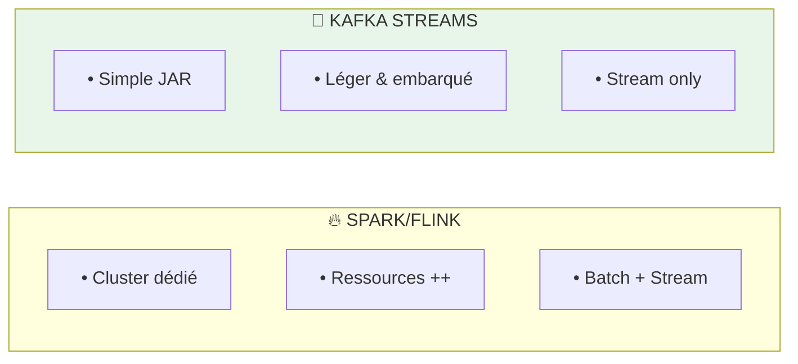
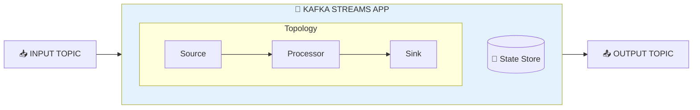
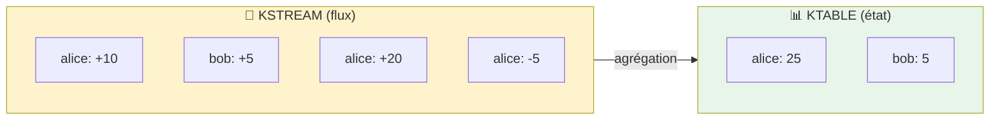
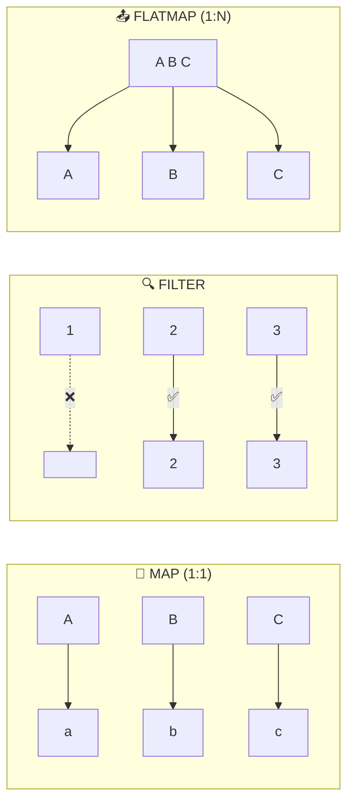
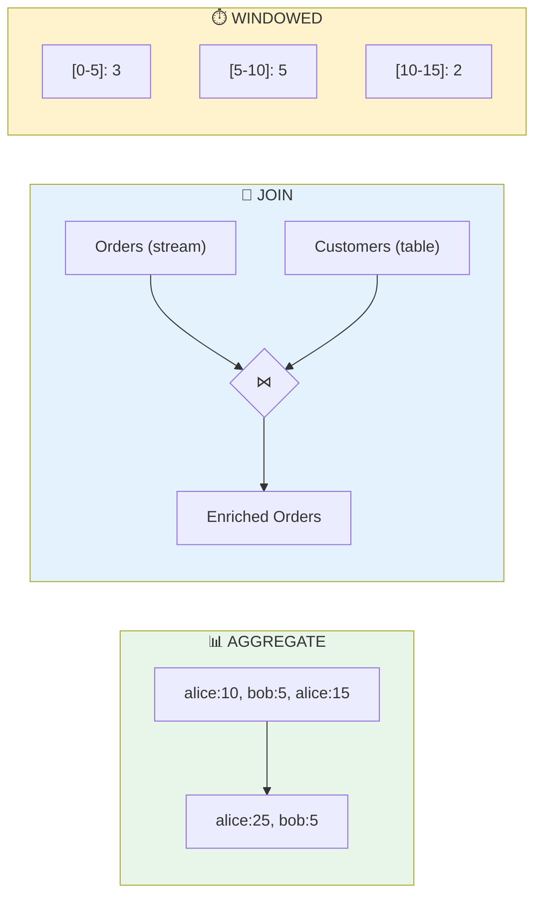

# 🌊 Module 05 - Kafka Streams : Traitement en Temps Réel

| Durée | Niveau | Prérequis |
|-------|--------|-----------|
| 3 heures | Intermédiaire | Modules 01-04 complétés |

## 🎯 Objectifs d'apprentissage

À la fin de ce module, vous serez capable de :

- ✅ Comprendre la différence entre KStream et KTable
- ✅ Créer une application Kafka Streams
- ✅ Implémenter des transformations (map, filter, flatMap)
- ✅ Réaliser des agrégations en temps réel
- ✅ Effectuer des jointures entre streams et tables

---

## 📚 Partie Théorique (30%)

### 1. Introduction à Kafka Streams

#### Qu'est-ce que Kafka Streams ?

**Kafka Streams** est une bibliothèque Java pour construire des applications de traitement de flux en temps réel. Contrairement à Spark ou Flink, elle ne nécessite pas de cluster séparé.



**Cas d'usage Kafka Streams** :
- Enrichissement de données en temps réel
- Agrégations continues (compteurs, moyennes)
- Détection de patterns / anomalies
- Transformation ETL légère

#### Architecture d'une application Kafka Streams



---

### 2. KStream vs KTable

#### Concepts fondamentaux

| Concept | KStream | KTable |
|---------|---------|--------|
| **Représentation** | Flux d'événements | Table de données |
| **Sémantique** | Append-only (insert) | Update/Delete |
| **Analogie SQL** | INSERT | INSERT + UPDATE |
| **Cas d'usage** | Logs, événements | États, lookups |



> **KStream** = Chaque message est un événement distinct  
> **KTable** = Dernière valeur par clé (état courant)

#### Quand utiliser quoi ?

```java
// KStream - pour traiter chaque événement individuellement
KStream<String, Order> orders = builder.stream("orders");
orders.filter((key, order) -> order.getAmount() > 100)
      .to("large-orders");

// KTable - pour maintenir un état par clé
KTable<String, Customer> customers = builder.table("customers");
// Représente l'état courant de chaque client
```

---

### 3. Opérations de transformation

#### Opérations sans état (Stateless)



```java
// Exemples de code
stream.map((key, value) -> KeyValue.pair(key.toUpperCase(), value * 2))
      .filter((key, value) -> value > 100)
      .flatMapValues(value -> Arrays.asList(value.split(" ")));
```

#### Opérations avec état (Stateful)



---

### 4. Fenêtres temporelles (Windowing)

```mermaid
gantt
    title Types de fenêtres temporelles
    dateFormat X
    axisFormat %s
    
    section Tumbling
    Window 1 :0, 5
    Window 2 :5, 10
    Window 3 :10, 15
    
    section Hopping
    Window A :0, 10
    Window B :5, 15
    Window C :10, 20
    
    section Session
    Session 1 :0, 3
    Session 2 :7, 12
    Session 3 :18, 20
```



| Type | Description |
|------|-------------|
| **Tumbling** | Fenêtres fixes, pas de chevauchement |
| **Hopping** | Fenêtres glissantes, chevauchement possible |
| **Session** | Basé sur l'inactivité (gap) |

```java
// Tumbling window de 5 minutes
stream.groupByKey()
      .windowedBy(TimeWindows.ofSizeWithNoGrace(Duration.ofMinutes(5)))
      .count();

// Hopping window: 10 min size, 5 min advance
stream.groupByKey()
      .windowedBy(TimeWindows.ofSizeAndGrace(
          Duration.ofMinutes(10), 
          Duration.ofMinutes(1))
          .advanceBy(Duration.ofMinutes(5)))
      .count();

// Session window avec 30 min d'inactivité
stream.groupByKey()
      .windowedBy(SessionWindows.ofInactivityGapWithNoGrace(Duration.ofMinutes(30)))
      .count();
```

---

## 🔌 Ports et Services

| Service | Port | Description |
|---------|------|-------------|
| Kafka Streams App | 18084 | Application de traitement |
| Kafka UI | 8080 | Visualisation des topics |
| Kafka | 9092 | Broker externe |

---

## 🛠️ Partie Pratique (70%)

### Prérequis

```bash
cd formation-v2/
./scripts/up.sh
```

---

### Étape 1 - Créer les topics

```bash
# Topic d'entrée - événements de vente
docker exec kafka kafka-topics --create \
  --topic sales-events \
  --partitions 6 \
  --replication-factor 1 \
  --bootstrap-server localhost:9092

# Topic de sortie - ventes par produit
docker exec kafka kafka-topics --create \
  --topic sales-by-product \
  --partitions 6 \
  --replication-factor 1 \
  --bootstrap-server localhost:9092

# Topic de sortie - ventes par fenêtre temporelle
docker exec kafka kafka-topics --create \
  --topic sales-per-minute \
  --partitions 6 \
  --replication-factor 1 \
  --bootstrap-server localhost:9092

# Table des produits (référentiel)
docker exec kafka kafka-topics --create \
  --topic products \
  --partitions 3 \
  --replication-factor 1 \
  --config cleanup.policy=compact \
  --bootstrap-server localhost:9092
```

---

### Étape 2 - Démarrer l'application Kafka Streams

```bash
docker compose -f day-02-development/module-05-kafka-streams/docker-compose.module.yml up -d --build
```

**Vérification** :

```bash
docker logs m05-streams-app --tail 20
```

---

### Étape 3 - Lab 1 : Transformation simple (map/filter)

**Objectif** : Filtrer les ventes > 100€ et transformer le format.

#### 3.1 Charger les données de référence (produits)

```bash
# Ajouter des produits dans la KTable
echo 'PROD-001:{"id":"PROD-001","name":"Laptop","category":"Electronics"}' | \
  docker exec -i kafka kafka-console-producer \
    --topic products \
    --property "parse.key=true" \
    --property "key.separator=:" \
    --bootstrap-server localhost:9092

echo 'PROD-002:{"id":"PROD-002","name":"Phone","category":"Electronics"}' | \
  docker exec -i kafka kafka-console-producer \
    --topic products \
    --property "parse.key=true" \
    --property "key.separator=:" \
    --bootstrap-server localhost:9092

echo 'PROD-003:{"id":"PROD-003","name":"Book","category":"Books"}' | \
  docker exec -i kafka kafka-console-producer \
    --topic products \
    --property "parse.key=true" \
    --property "key.separator=:" \
    --bootstrap-server localhost:9092
```

#### 3.2 Envoyer des événements de vente

```bash
# Via l'API
curl -X POST "http://localhost:18084/api/v1/sales" \
  -H "Content-Type: application/json" \
  -d '{"productId": "PROD-001", "quantity": 2, "unitPrice": 999.99}'

curl -X POST "http://localhost:18084/api/v1/sales" \
  -H "Content-Type: application/json" \
  -d '{"productId": "PROD-002", "quantity": 1, "unitPrice": 50.00}'

curl -X POST "http://localhost:18084/api/v1/sales" \
  -H "Content-Type: application/json" \
  -d '{"productId": "PROD-003", "quantity": 5, "unitPrice": 25.00}'
```

#### 3.3 Vérifier les résultats

```bash
# Ventes filtrées (> 100€)
docker exec kafka kafka-console-consumer \
  --topic large-sales \
  --from-beginning \
  --max-messages 5 \
  --bootstrap-server localhost:9092
```

---

### Étape 4 - Lab 2 : Agrégation par produit

**Objectif** : Compter les ventes totales par produit.

```bash
# Observer les agrégations
curl -s http://localhost:18084/api/v1/stats/by-product | jq
```

**Résultat attendu** :

```json
{
  "PROD-001": { "count": 2, "totalAmount": 1999.98 },
  "PROD-002": { "count": 1, "totalAmount": 50.00 },
  "PROD-003": { "count": 5, "totalAmount": 125.00 }
}
```

---

### Étape 5 - Lab 3 : Fenêtres temporelles

**Objectif** : Agréger les ventes par minute.

#### 5.1 Générer un flux continu de ventes

```bash
# Script de génération (30 secondes)
for i in {1..10}; do
  curl -s -X POST "http://localhost:18084/api/v1/sales" \
    -H "Content-Type: application/json" \
    -d "{\"productId\": \"PROD-00$((RANDOM % 3 + 1))\", \"quantity\": $((RANDOM % 5 + 1)), \"unitPrice\": $((RANDOM % 100 + 10))}"
  sleep 3
done
```

#### 5.2 Observer les agrégations par fenêtre

```bash
curl -s http://localhost:18084/api/v1/stats/per-minute | jq
```

---

### Étape 6 - Lab 4 : Jointure Stream-Table

**Objectif** : Enrichir les ventes avec les informations produit.

```bash
# Consommer le topic enrichi
docker exec kafka kafka-console-consumer \
  --topic enriched-sales \
  --from-beginning \
  --max-messages 5 \
  --bootstrap-server localhost:9092
```

**Résultat attendu** : Chaque vente contient maintenant le nom et la catégorie du produit.

---

### Étape 7 - Lab 5 : Interactive Queries

**Objectif** : Requêter l'état local de Kafka Streams.

```bash
# État du store local
curl -s http://localhost:18084/api/v1/stores/sales-by-product/all | jq

# Requête par clé
curl -s http://localhost:18084/api/v1/stores/sales-by-product/PROD-001 | jq
```

---

## ✅ Checkpoint de validation

- [ ] Topics créés (sales-events, sales-by-product, etc.)
- [ ] Application Kafka Streams démarrée
- [ ] Transformation map/filter fonctionnelle
- [ ] Agrégation par produit observable
- [ ] Fenêtres temporelles configurées
- [ ] Jointure stream-table testée
- [ ] Interactive queries fonctionnelles

---

## 🔧 Troubleshooting

### Application ne démarre pas

```bash
docker logs m05-streams-app --tail 100 | grep -i error
```

### State store non disponible

```bash
# Vérifier l'état de l'application
curl -s http://localhost:18084/api/v1/health
```

### Données non agrégées

**Cause possible** : Pas assez de messages ou mauvais partitionnement.

```bash
# Vérifier le nombre de messages
docker exec kafka kafka-run-class kafka.tools.GetOffsetShell \
  --broker-list localhost:9092 \
  --topic sales-events
```

---

## 🧹 Nettoyage

```bash
docker compose -f day-02-development/module-05-kafka-streams/docker-compose.module.yml down

# Supprimer les topics
docker exec kafka kafka-topics --delete --topic sales-events --bootstrap-server localhost:9092
docker exec kafka kafka-topics --delete --topic sales-by-product --bootstrap-server localhost:9092
docker exec kafka kafka-topics --delete --topic products --bootstrap-server localhost:9092
```

---

## 📖 Pour aller plus loin

### Exercices supplémentaires

1. **Ajoutez une fenêtre glissante** de 10 minutes avec avance de 1 minute
2. **Implémentez une alerte** quand les ventes dépassent un seuil
3. **Créez une jointure KStream-KStream** avec une fenêtre de temps

### Ressources

- [Kafka Streams Documentation](https://kafka.apache.org/documentation/streams/)
- [Confluent Kafka Streams Tutorial](https://developer.confluent.io/tutorials/)
- [Kafka Streams Interactive Queries](https://kafka.apache.org/documentation/streams/developer-guide/interactive-queries.html)
