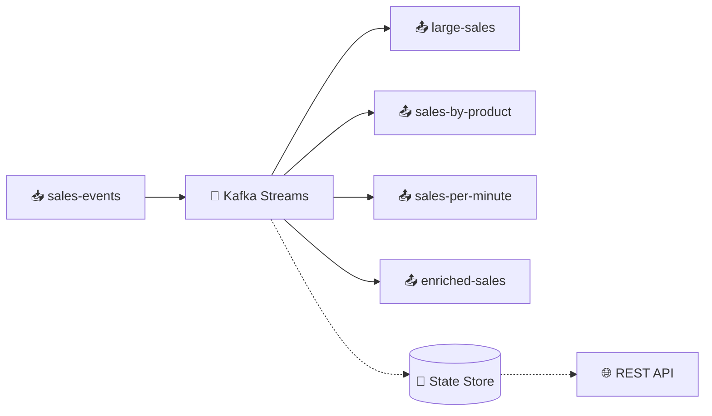
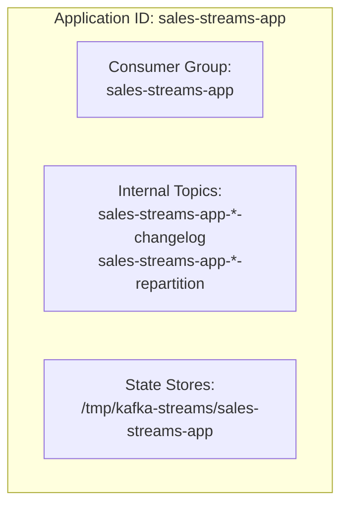
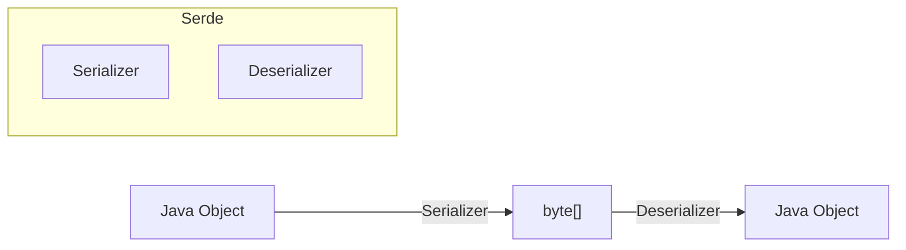
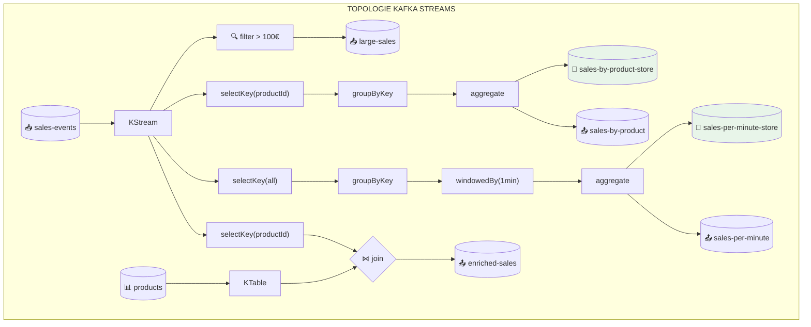
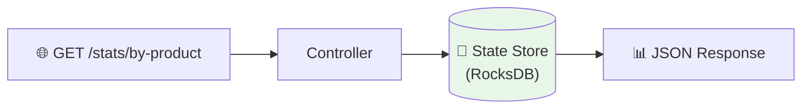

# 🛠️ Tutorial VS Code : Kafka Streams - Traitement en Temps Réel

## 📋 Vue d'ensemble

Ce tutorial vous guide pour implémenter une application **Kafka Streams** avec :
- **Filtrage** de messages (ventes > 100€)
- **Agrégation par clé** (ventes par produit)
- **Fenêtrage temporel** (ventes par minute)
- **Jointure Stream-Table** (enrichissement produit)
- **State Stores** interrogeables via REST API



---

## 🎯 Prérequis

### Outils requis

| Outil | Version | Installation |
|-------|---------|--------------|
| **VS Code** | Latest | [code.visualstudio.com](https://code.visualstudio.com) |
| **Java JDK** | 17+ | `winget install Microsoft.OpenJDK.17` |
| **Maven** | 3.8+ | `winget install Apache.Maven` |
| **Docker Desktop** | Latest | [docker.com](https://docker.com) |

### Extensions VS Code

```bash
code --install-extension vscjava.vscode-java-pack
code --install-extension vmware.vscode-boot-dev-pack
code --install-extension humao.rest-client
```

---

## 📁 Étape 1 : Structure du projet

### 1.1 Créer le projet

```powershell
mkdir module05-kafka-streams
cd module05-kafka-streams
code .
```

### 1.2 Structure finale

```
module05-kafka-streams/
├── pom.xml
├── Dockerfile
├── src/main/java/com/data2ai/kafka/
│   ├── Application.java
│   ├── config/
│   │   └── KafkaStreamsConfig.java
│   ├── controller/
│   │   └── SalesController.java
│   ├── model/
│   │   ├── Sale.java
│   │   └── SaleAggregate.java
│   └── streams/
│       ├── SalesTopology.java
│       └── JsonSerde.java
├── src/main/resources/
│   └── application.properties
└── requests.http
```

---

## 📝 Étape 2 : Configuration Maven (pom.xml)

```xml
<?xml version="1.0" encoding="UTF-8"?>
<project xmlns="http://maven.apache.org/POM/4.0.0"
         xmlns:xsi="http://www.w3.org/2001/XMLSchema-instance"
         xsi:schemaLocation="http://maven.apache.org/POM/4.0.0 
         https://maven.apache.org/xsd/maven-4.0.0.xsd">
    <modelVersion>4.0.0</modelVersion>
    
    <parent>
        <groupId>org.springframework.boot</groupId>
        <artifactId>spring-boot-starter-parent</artifactId>
        <version>3.2.0</version>
        <relativePath/>
    </parent>
    
    <groupId>com.data2ai.kafka</groupId>
    <artifactId>module05-kafka-streams</artifactId>
    <version>1.0.0</version>
    <name>Module 05 - Kafka Streams</name>
    
    <properties>
        <java.version>17</java.version>
        <kafka.version>3.6.0</kafka.version>
    </properties>
    
    <dependencies>
        <!-- Spring Boot Web -->
        <dependency>
            <groupId>org.springframework.boot</groupId>
            <artifactId>spring-boot-starter-web</artifactId>
        </dependency>
        
        <!-- ═══════════════════════════════════════════════════════
             KAFKA STREAMS
             Bibliothèque de traitement de flux en temps réel
             ═══════════════════════════════════════════════════════ -->
        <dependency>
            <groupId>org.apache.kafka</groupId>
            <artifactId>kafka-streams</artifactId>
            <version>${kafka.version}</version>
        </dependency>
        
        <!-- Spring Kafka (intégration Spring) -->
        <dependency>
            <groupId>org.springframework.kafka</groupId>
            <artifactId>spring-kafka</artifactId>
        </dependency>
        
        <!-- Jackson pour JSON -->
        <dependency>
            <groupId>com.fasterxml.jackson.core</groupId>
            <artifactId>jackson-databind</artifactId>
        </dependency>
        
        <!-- Actuator pour monitoring -->
        <dependency>
            <groupId>org.springframework.boot</groupId>
            <artifactId>spring-boot-starter-actuator</artifactId>
        </dependency>
    </dependencies>
    
    <build>
        <plugins>
            <plugin>
                <groupId>org.springframework.boot</groupId>
                <artifactId>spring-boot-maven-plugin</artifactId>
            </plugin>
        </plugins>
    </build>
</project>
```

### Concepts : Kafka Streams vs Spring Kafka

| Composant | Rôle |
|-----------|------|
| `kafka-streams` | Bibliothèque native Apache Kafka pour le stream processing |
| `spring-kafka` | Intégration Spring (KafkaTemplate, configuration auto) |
| `StreamsBuilder` | Constructeur de topologie Kafka Streams |

---

## ☕ Étape 3 : Application.java

```java
package com.data2ai.kafka;

import org.springframework.boot.SpringApplication;
import org.springframework.boot.autoconfigure.SpringBootApplication;

@SpringBootApplication
public class Application {
    public static void main(String[] args) {
        SpringApplication.run(Application.class, args);
    }
}
```

---

## ⚙️ Étape 4 : Configuration Kafka Streams

### 4.1 Créer `config/KafkaStreamsConfig.java`

```java
package com.data2ai.kafka.config;

import org.apache.kafka.clients.producer.ProducerConfig;
import org.apache.kafka.common.serialization.Serdes;
import org.apache.kafka.common.serialization.StringSerializer;
import org.apache.kafka.streams.StreamsConfig;
import org.springframework.beans.factory.annotation.Value;
import org.springframework.context.annotation.Bean;
import org.springframework.context.annotation.Configuration;
import org.springframework.kafka.annotation.KafkaStreamsDefaultConfiguration;
import org.springframework.kafka.config.KafkaStreamsConfiguration;
import org.springframework.kafka.core.DefaultKafkaProducerFactory;
import org.springframework.kafka.core.KafkaTemplate;
import org.springframework.kafka.core.ProducerFactory;

import java.util.HashMap;
import java.util.Map;

/**
 * Configuration Kafka Streams.
 * 
 * Concepts clés :
 * - APPLICATION_ID : Identifiant unique de l'application Streams
 *   → Définit le consumer group
 *   → Préfixe des topics internes
 * - STATE_DIR : Répertoire pour les state stores locaux
 * - COMMIT_INTERVAL : Fréquence de commit des offsets
 */
@Configuration
public class KafkaStreamsConfig {

    @Value("${KAFKA_BOOTSTRAP_SERVERS:localhost:9092}")
    private String bootstrapServers;

    @Value("${APPLICATION_ID:sales-streams-app}")
    private String applicationId;

    // ═══════════════════════════════════════════════════════════
    // CONFIGURATION KAFKA STREAMS
    // Bean spécial reconnu par Spring Kafka
    // ═══════════════════════════════════════════════════════════
    
    @Bean(name = KafkaStreamsDefaultConfiguration.DEFAULT_STREAMS_CONFIG_BEAN_NAME)
    public KafkaStreamsConfiguration kStreamsConfig() {
        Map<String, Object> props = new HashMap<>();
        
        // Identifiant unique de l'application
        // → Consumer group = applicationId
        // → Topics internes préfixés par applicationId
        props.put(StreamsConfig.APPLICATION_ID_CONFIG, applicationId);
        
        // Serveurs Kafka
        props.put(StreamsConfig.BOOTSTRAP_SERVERS_CONFIG, bootstrapServers);
        
        // Sérialiseurs par défaut pour clés et valeurs
        props.put(StreamsConfig.DEFAULT_KEY_SERDE_CLASS_CONFIG, 
            Serdes.String().getClass().getName());
        props.put(StreamsConfig.DEFAULT_VALUE_SERDE_CLASS_CONFIG, 
            Serdes.String().getClass().getName());
        
        // Fréquence de commit des offsets (ms)
        // Plus bas = moins de reprocessing en cas de crash
        // Plus haut = meilleures performances
        props.put(StreamsConfig.COMMIT_INTERVAL_MS_CONFIG, 1000);
        
        // Répertoire pour les state stores locaux (RocksDB)
        props.put(StreamsConfig.STATE_DIR_CONFIG, "/tmp/kafka-streams");
        
        return new KafkaStreamsConfiguration(props);
    }

    // ═══════════════════════════════════════════════════════════
    // KAFKA TEMPLATE (pour produire des messages via REST API)
    // ═══════════════════════════════════════════════════════════
    
    @Bean
    public ProducerFactory<String, String> producerFactory() {
        Map<String, Object> config = new HashMap<>();
        config.put(ProducerConfig.BOOTSTRAP_SERVERS_CONFIG, bootstrapServers);
        config.put(ProducerConfig.KEY_SERIALIZER_CLASS_CONFIG, StringSerializer.class);
        config.put(ProducerConfig.VALUE_SERIALIZER_CLASS_CONFIG, StringSerializer.class);
        return new DefaultKafkaProducerFactory<>(config);
    }

    @Bean
    public KafkaTemplate<String, String> kafkaTemplate() {
        return new KafkaTemplate<>(producerFactory());
    }
}
```

### 4.2 Concept : Application ID



---

## 📦 Étape 5 : Modèles de données

### 5.1 Créer `model/Sale.java`

```java
package com.data2ai.kafka.model;

import com.fasterxml.jackson.annotation.JsonProperty;

/**
 * Représente une vente individuelle.
 * 
 * Exemple JSON :
 * {"productId":"LAPTOP-001","quantity":2,"unitPrice":999.99}
 */
public class Sale {
    
    @JsonProperty("productId")
    private String productId;
    
    @JsonProperty("quantity")
    private int quantity;
    
    @JsonProperty("unitPrice")
    private double unitPrice;
    
    @JsonProperty("timestamp")
    private long timestamp;

    public Sale() {
        this.timestamp = System.currentTimeMillis();
    }

    public Sale(String productId, int quantity, double unitPrice) {
        this.productId = productId;
        this.quantity = quantity;
        this.unitPrice = unitPrice;
        this.timestamp = System.currentTimeMillis();
    }

    // Getters & Setters
    public String getProductId() { return productId; }
    public void setProductId(String productId) { this.productId = productId; }

    public int getQuantity() { return quantity; }
    public void setQuantity(int quantity) { this.quantity = quantity; }

    public double getUnitPrice() { return unitPrice; }
    public void setUnitPrice(double unitPrice) { this.unitPrice = unitPrice; }

    public long getTimestamp() { return timestamp; }
    public void setTimestamp(long timestamp) { this.timestamp = timestamp; }

    // Méthode calculée
    public double getTotalAmount() {
        return quantity * unitPrice;
    }
}
```

### 5.2 Créer `model/SaleAggregate.java`

```java
package com.data2ai.kafka.model;

import com.fasterxml.jackson.annotation.JsonProperty;

/**
 * Agrégat de ventes pour un produit ou une fenêtre temporelle.
 * 
 * Utilisé par Kafka Streams pour stocker l'état agrégé.
 * Doit être sérialisable/désérialisable (constructeur par défaut requis).
 */
public class SaleAggregate {
    
    @JsonProperty("count")
    private long count = 0;
    
    @JsonProperty("totalAmount")
    private double totalAmount = 0.0;
    
    @JsonProperty("totalQuantity")
    private long totalQuantity = 0;

    // Constructeur par défaut (requis pour la désérialisation)
    public SaleAggregate() {}

    /**
     * Ajoute une vente à l'agrégat.
     * Retourne this pour permettre le chaînage (pattern fluent).
     */
    public SaleAggregate add(Sale sale) {
        this.count++;
        this.totalAmount += sale.getTotalAmount();
        this.totalQuantity += sale.getQuantity();
        return this;
    }

    // Getters & Setters
    public long getCount() { return count; }
    public void setCount(long count) { this.count = count; }

    public double getTotalAmount() { return totalAmount; }
    public void setTotalAmount(double totalAmount) { this.totalAmount = totalAmount; }

    public long getTotalQuantity() { return totalQuantity; }
    public void setTotalQuantity(long totalQuantity) { this.totalQuantity = totalQuantity; }
}
```

---

## 🔧 Étape 6 : Serde JSON personnalisé

### 6.1 Créer `streams/JsonSerde.java`

```java
package com.data2ai.kafka.streams;

import com.fasterxml.jackson.databind.ObjectMapper;
import org.apache.kafka.common.serialization.Deserializer;
import org.apache.kafka.common.serialization.Serde;
import org.apache.kafka.common.serialization.Serializer;

/**
 * Serde (Serializer/Deserializer) personnalisé pour objets JSON.
 * 
 * Kafka Streams a besoin de savoir comment sérialiser/désérialiser
 * les objets pour les state stores et les topics internes.
 * 
 * @param <T> Type de l'objet à sérialiser
 */
public class JsonSerde<T> implements Serde<T> {
    
    private final ObjectMapper objectMapper;
    private final Class<T> targetType;

    public JsonSerde(Class<T> targetType, ObjectMapper objectMapper) {
        this.targetType = targetType;
        this.objectMapper = objectMapper;
    }

    @Override
    public Serializer<T> serializer() {
        return (topic, data) -> {
            try {
                return objectMapper.writeValueAsBytes(data);
            } catch (Exception e) {
                throw new RuntimeException("Error serializing " + targetType.getName(), e);
            }
        };
    }

    @Override
    public Deserializer<T> deserializer() {
        return (topic, data) -> {
            try {
                if (data == null) return null;
                return objectMapper.readValue(data, targetType);
            } catch (Exception e) {
                throw new RuntimeException("Error deserializing " + targetType.getName(), e);
            }
        };
    }
}
```

### 6.2 Concept : Serde dans Kafka Streams



---

## 🌊 Étape 7 : Topologie Kafka Streams

### 7.1 Créer `streams/SalesTopology.java`

```java
package com.data2ai.kafka.streams;

import com.data2ai.kafka.model.Sale;
import com.data2ai.kafka.model.SaleAggregate;
import com.fasterxml.jackson.databind.ObjectMapper;
import org.apache.kafka.common.serialization.Serdes;
import org.apache.kafka.common.utils.Bytes;
import org.apache.kafka.streams.StreamsBuilder;
import org.apache.kafka.streams.kstream.*;
import org.apache.kafka.streams.state.KeyValueStore;
import org.apache.kafka.streams.state.WindowStore;
import org.springframework.beans.factory.annotation.Value;
import org.springframework.context.annotation.Bean;
import org.springframework.context.annotation.Configuration;
import org.springframework.kafka.annotation.EnableKafkaStreams;

import java.time.Duration;

/**
 * Définit la topologie de traitement Kafka Streams.
 * 
 * Une topologie est un graphe de processeurs qui transforment les données :
 * - Source : Lit depuis un topic
 * - Processor : Transforme les données (filter, map, aggregate...)
 * - Sink : Écrit vers un topic
 * 
 * @EnableKafkaStreams active le support Kafka Streams dans Spring
 */
@Configuration
@EnableKafkaStreams
public class SalesTopology {

    @Value("${INPUT_TOPIC:sales-events}")
    private String inputTopic;

    @Value("${OUTPUT_TOPIC:sales-by-product}")
    private String outputTopic;

    @Value("${PRODUCTS_TOPIC:products}")
    private String productsTopic;

    private final ObjectMapper objectMapper = new ObjectMapper();

    // Noms des state stores (pour les requêtes interactives)
    public static final String SALES_BY_PRODUCT_STORE = "sales-by-product-store";
    public static final String SALES_PER_MINUTE_STORE = "sales-per-minute-store";

    /**
     * Définit la topologie Kafka Streams.
     * 
     * Cette méthode crée un graphe de traitement avec :
     * 1. Filtrage des grosses ventes (> 100€)
     * 2. Agrégation par produit
     * 3. Agrégation par fenêtre temporelle (1 minute)
     * 4. Jointure avec la table des produits
     */
    @Bean
    public KStream<String, String> kStream(StreamsBuilder builder) {
        
        // ═══════════════════════════════════════════════════════════
        // SOURCE : Lire le stream de ventes
        // ═══════════════════════════════════════════════════════════
        KStream<String, String> salesStream = builder.stream(inputTopic,
            Consumed.with(Serdes.String(), Serdes.String()));

        // ═══════════════════════════════════════════════════════════
        // 1. FILTER : Ventes supérieures à 100€
        // Opération stateless - ne nécessite pas de state store
        // ═══════════════════════════════════════════════════════════
        salesStream
            .filter((key, value) -> {
                try {
                    Sale sale = objectMapper.readValue(value, Sale.class);
                    return sale.getTotalAmount() > 100;
                } catch (Exception e) {
                    return false;
                }
            })
            .to("large-sales", Produced.with(Serdes.String(), Serdes.String()));

        // ═══════════════════════════════════════════════════════════
        // 2. AGGREGATE BY KEY : Ventes par produit
        // Opération stateful - utilise un state store
        // ═══════════════════════════════════════════════════════════
        salesStream
            // Re-keyer par productId pour le groupement
            .selectKey((key, value) -> {
                try {
                    Sale sale = objectMapper.readValue(value, Sale.class);
                    return sale.getProductId();
                } catch (Exception e) {
                    return "unknown";
                }
            })
            // Grouper par la nouvelle clé
            .groupByKey(Grouped.with(Serdes.String(), Serdes.String()))
            // Agréger avec un state store matérialisé
            .aggregate(
                // Initializer : Créer un nouvel agrégat vide
                SaleAggregate::new,
                // Aggregator : Ajouter chaque vente à l'agrégat
                (key, value, aggregate) -> {
                    try {
                        Sale sale = objectMapper.readValue(value, Sale.class);
                        return aggregate.add(sale);
                    } catch (Exception e) {
                        return aggregate;
                    }
                },
                // Materialized : Configurer le state store
                Materialized.<String, SaleAggregate, KeyValueStore<Bytes, byte[]>>
                    as(SALES_BY_PRODUCT_STORE)
                    .withKeySerde(Serdes.String())
                    .withValueSerde(new JsonSerde<>(SaleAggregate.class, objectMapper))
            )
            // Convertir KTable en KStream pour l'envoyer à un topic
            .toStream()
            .mapValues(agg -> {
                try {
                    return objectMapper.writeValueAsString(agg);
                } catch (Exception e) {
                    return "{}";
                }
            })
            .to(outputTopic, Produced.with(Serdes.String(), Serdes.String()));

        // ═══════════════════════════════════════════════════════════
        // 3. WINDOWED AGGREGATION : Ventes par minute
        // Fenêtre temporelle de 1 minute (tumbling window)
        // ═══════════════════════════════════════════════════════════
        salesStream
            .selectKey((key, value) -> "all-sales") // Clé unique pour tout agréger
            .groupByKey(Grouped.with(Serdes.String(), Serdes.String()))
            // Fenêtre tumbling de 1 minute
            .windowedBy(TimeWindows.ofSizeWithNoGrace(Duration.ofMinutes(1)))
            .aggregate(
                SaleAggregate::new,
                (key, value, aggregate) -> {
                    try {
                        Sale sale = objectMapper.readValue(value, Sale.class);
                        return aggregate.add(sale);
                    } catch (Exception e) {
                        return aggregate;
                    }
                },
                Materialized.<String, SaleAggregate, WindowStore<Bytes, byte[]>>
                    as(SALES_PER_MINUTE_STORE)
                    .withKeySerde(Serdes.String())
                    .withValueSerde(new JsonSerde<>(SaleAggregate.class, objectMapper))
            )
            .toStream()
            // Extraire les timestamps de la fenêtre dans la clé
            .map((windowedKey, value) -> {
                String newKey = windowedKey.window().startTime() + "-" + 
                               windowedKey.window().endTime();
                try {
                    return KeyValue.pair(newKey, objectMapper.writeValueAsString(value));
                } catch (Exception e) {
                    return KeyValue.pair(newKey, "{}");
                }
            })
            .to("sales-per-minute", Produced.with(Serdes.String(), Serdes.String()));

        // ═══════════════════════════════════════════════════════════
        // 4. STREAM-TABLE JOIN : Enrichissement avec produits
        // Jointure entre le stream de ventes et la table des produits
        // ═══════════════════════════════════════════════════════════
        
        // Lire la table des produits (compactée)
        KTable<String, String> productsTable = builder.table(productsTopic,
            Consumed.with(Serdes.String(), Serdes.String()),
            Materialized.as("products-store"));

        salesStream
            .selectKey((key, value) -> {
                try {
                    Sale sale = objectMapper.readValue(value, Sale.class);
                    return sale.getProductId();
                } catch (Exception e) {
                    return "unknown";
                }
            })
            // Inner join : Ne garde que les ventes avec un produit correspondant
            .join(productsTable, (saleJson, productJson) -> {
                try {
                    return "{\"sale\":" + saleJson + ",\"product\":" + productJson + "}";
                } catch (Exception e) {
                    return saleJson;
                }
            })
            .to("enriched-sales", Produced.with(Serdes.String(), Serdes.String()));

        return salesStream;
    }
}
```

### 7.2 Diagramme de la topologie



---

## 🌐 Étape 8 : Controller REST

### 8.1 Créer `controller/SalesController.java`

```java
package com.data2ai.kafka.controller;

import com.data2ai.kafka.model.Sale;
import com.data2ai.kafka.model.SaleAggregate;
import com.data2ai.kafka.streams.SalesTopology;
import com.fasterxml.jackson.databind.ObjectMapper;
import org.apache.kafka.streams.KafkaStreams;
import org.apache.kafka.streams.StoreQueryParameters;
import org.apache.kafka.streams.state.QueryableStoreTypes;
import org.apache.kafka.streams.state.ReadOnlyKeyValueStore;
import org.springframework.beans.factory.annotation.Value;
import org.springframework.http.ResponseEntity;
import org.springframework.kafka.config.StreamsBuilderFactoryBean;
import org.springframework.kafka.core.KafkaTemplate;
import org.springframework.web.bind.annotation.*;

import java.util.HashMap;
import java.util.Map;

/**
 * Controller REST pour :
 * - Envoyer des ventes au topic d'entrée
 * - Interroger les state stores Kafka Streams
 */
@RestController
@RequestMapping("/api/v1")
public class SalesController {

    private final KafkaTemplate<String, String> kafkaTemplate;
    private final StreamsBuilderFactoryBean factoryBean;
    private final ObjectMapper objectMapper;

    @Value("${INPUT_TOPIC:sales-events}")
    private String inputTopic;

    public SalesController(KafkaTemplate<String, String> kafkaTemplate,
                          StreamsBuilderFactoryBean factoryBean,
                          ObjectMapper objectMapper) {
        this.kafkaTemplate = kafkaTemplate;
        this.factoryBean = factoryBean;
        this.objectMapper = objectMapper;
    }

    // ═══════════════════════════════════════════════════════════
    // POST /api/v1/sales - Créer une vente
    // ═══════════════════════════════════════════════════════════
    
    @PostMapping("/sales")
    public ResponseEntity<?> createSale(@RequestBody Sale sale) {
        try {
            String key = sale.getProductId();
            String value = objectMapper.writeValueAsString(sale);
            
            kafkaTemplate.send(inputTopic, key, value);
            
            return ResponseEntity.ok(Map.of(
                "status", "ACCEPTED",
                "productId", sale.getProductId(),
                "totalAmount", sale.getTotalAmount(),
                "topic", inputTopic
            ));
        } catch (Exception e) {
            return ResponseEntity.internalServerError().body(Map.of(
                "status", "ERROR",
                "error", e.getMessage()
            ));
        }
    }

    // ═══════════════════════════════════════════════════════════
    // GET /api/v1/stats/by-product - Interroger le state store
    // INTERACTIVE QUERIES : Requêter l'état local
    // ═══════════════════════════════════════════════════════════
    
    @GetMapping("/stats/by-product")
    public ResponseEntity<?> getStatsByProduct() {
        try {
            KafkaStreams streams = factoryBean.getKafkaStreams();
            if (streams == null || streams.state() != KafkaStreams.State.RUNNING) {
                return ResponseEntity.status(503).body(Map.of(
                    "error", "Streams not ready",
                    "state", streams != null ? streams.state().toString() : "NULL"
                ));
            }

            // Accéder au state store en lecture seule
            ReadOnlyKeyValueStore<String, SaleAggregate> store = streams.store(
                StoreQueryParameters.fromNameAndType(
                    SalesTopology.SALES_BY_PRODUCT_STORE,
                    QueryableStoreTypes.keyValueStore()
                )
            );

            // Itérer sur toutes les entrées
            Map<String, Object> result = new HashMap<>();
            store.all().forEachRemaining(kv -> {
                result.put(kv.key, Map.of(
                    "count", kv.value.getCount(),
                    "totalAmount", kv.value.getTotalAmount(),
                    "totalQuantity", kv.value.getTotalQuantity()
                ));
            });

            return ResponseEntity.ok(result);
        } catch (Exception e) {
            return ResponseEntity.internalServerError().body(Map.of(
                "error", e.getMessage()
            ));
        }
    }

    // ═══════════════════════════════════════════════════════════
    // GET /api/v1/stores/{name}/{key} - Requête par clé
    // ═══════════════════════════════════════════════════════════
    
    @GetMapping("/stores/{storeName}/{key}")
    public ResponseEntity<?> getFromStore(@PathVariable String storeName, 
                                          @PathVariable String key) {
        try {
            KafkaStreams streams = factoryBean.getKafkaStreams();
            if (streams == null || streams.state() != KafkaStreams.State.RUNNING) {
                return ResponseEntity.status(503).body(Map.of("error", "Streams not ready"));
            }

            ReadOnlyKeyValueStore<String, SaleAggregate> store = streams.store(
                StoreQueryParameters.fromNameAndType(storeName, 
                    QueryableStoreTypes.keyValueStore())
            );

            SaleAggregate value = store.get(key);
            if (value == null) {
                return ResponseEntity.notFound().build();
            }
            return ResponseEntity.ok(value);
        } catch (Exception e) {
            return ResponseEntity.internalServerError().body(Map.of("error", e.getMessage()));
        }
    }

    // ═══════════════════════════════════════════════════════════
    // GET /api/v1/health - État de l'application Streams
    // ═══════════════════════════════════════════════════════════
    
    @GetMapping("/health")
    public ResponseEntity<?> health() {
        KafkaStreams streams = factoryBean.getKafkaStreams();
        String state = streams != null ? streams.state().toString() : "NOT_INITIALIZED";
        return ResponseEntity.ok(Map.of(
            "status", "UP",
            "streamsState", state
        ));
    }
}
```

### 8.2 Concept : Interactive Queries



Les **Interactive Queries** permettent d'interroger l'état local sans passer par Kafka :
- Latence ultra-faible (lecture RocksDB locale)
- Pas de consommation réseau
- État toujours à jour (committed)

---

## 📄 Étape 9 : Configuration

### 9.1 Créer `application.properties`

```properties
server.port=8080

# Kafka
spring.kafka.bootstrap-servers=${KAFKA_BOOTSTRAP_SERVERS:localhost:9092}

# Topics
INPUT_TOPIC=sales-events
OUTPUT_TOPIC=sales-by-product
PRODUCTS_TOPIC=products

# Streams
APPLICATION_ID=sales-streams-app

# Actuator
management.endpoints.web.exposure.include=health,info
```

---

## 🐳 Étape 10 : Dockerfile

```dockerfile
FROM maven:3.9-eclipse-temurin-17 AS build
WORKDIR /app
COPY pom.xml .
RUN mvn dependency:go-offline -B
COPY src ./src
RUN mvn package -DskipTests -B

FROM eclipse-temurin:17-jre-alpine
WORKDIR /app
COPY --from=build /app/target/*.jar app.jar

ENV KAFKA_BOOTSTRAP_SERVERS=kafka:29092
ENV INPUT_TOPIC=sales-events
ENV OUTPUT_TOPIC=sales-by-product
ENV APPLICATION_ID=sales-streams-app

EXPOSE 8080
ENTRYPOINT ["java", "-jar", "app.jar"]
```

---

## 🧪 Étape 11 : Tests avec REST Client

### 11.1 Créer `requests.http`

```http
### Variables
@baseUrl = http://localhost:8080/api/v1

### ═══════════════════════════════════════════════════════════════
### HEALTH CHECK
### ═══════════════════════════════════════════════════════════════
GET {{baseUrl}}/health

### ═══════════════════════════════════════════════════════════════
### CREATE SALE - Laptop (> 100€ → va dans large-sales aussi)
### ═══════════════════════════════════════════════════════════════
POST {{baseUrl}}/sales
Content-Type: application/json

{
    "productId": "LAPTOP-001",
    "quantity": 2,
    "unitPrice": 999.99
}

### ═══════════════════════════════════════════════════════════════
### CREATE SALE - Mouse (< 100€)
### ═══════════════════════════════════════════════════════════════
POST {{baseUrl}}/sales
Content-Type: application/json

{
    "productId": "MOUSE-001",
    "quantity": 5,
    "unitPrice": 15.99
}

### ═══════════════════════════════════════════════════════════════
### CREATE SALE - Another Laptop
### ═══════════════════════════════════════════════════════════════
POST {{baseUrl}}/sales
Content-Type: application/json

{
    "productId": "LAPTOP-001",
    "quantity": 1,
    "unitPrice": 1299.99
}

### ═══════════════════════════════════════════════════════════════
### GET STATS BY PRODUCT (Interactive Query)
### ═══════════════════════════════════════════════════════════════
GET {{baseUrl}}/stats/by-product

### ═══════════════════════════════════════════════════════════════
### GET SPECIFIC PRODUCT STATS
### ═══════════════════════════════════════════════════════════════
GET {{baseUrl}}/stores/sales-by-product-store/LAPTOP-001
```

---

## 🚀 Étape 12 : Exécution

### 12.1 Démarrer Kafka et créer les topics

```powershell
# Démarrer Kafka
docker-compose up -d kafka zookeeper

# Créer les topics requis
docker exec -it kafka bash -c "
kafka-topics --create --topic sales-events --partitions 3 --replication-factor 1 --bootstrap-server localhost:9092
kafka-topics --create --topic products --partitions 3 --replication-factor 1 --bootstrap-server localhost:9092 --config cleanup.policy=compact
kafka-topics --create --topic large-sales --partitions 3 --replication-factor 1 --bootstrap-server localhost:9092
kafka-topics --create --topic sales-by-product --partitions 3 --replication-factor 1 --bootstrap-server localhost:9092
kafka-topics --create --topic sales-per-minute --partitions 3 --replication-factor 1 --bootstrap-server localhost:9092
kafka-topics --create --topic enriched-sales --partitions 3 --replication-factor 1 --bootstrap-server localhost:9092
"
```

### 12.2 Ajouter des produits (pour le join)

```powershell
docker exec -it kafka kafka-console-producer \
  --topic products \
  --bootstrap-server localhost:9092 \
  --property "parse.key=true" \
  --property "key.separator=:"

# Entrer :
LAPTOP-001:{"name":"MacBook Pro","category":"Electronics"}
MOUSE-001:{"name":"Logitech MX","category":"Accessories"}
# Ctrl+C
```

### 12.3 Lancer l'application

```powershell
mvn spring-boot:run
```

### 12.4 Observer les résultats

```powershell
# Voir les ventes enrichies
docker exec -it kafka kafka-console-consumer \
  --topic enriched-sales \
  --bootstrap-server localhost:9092 \
  --from-beginning

# Voir les grosses ventes
docker exec -it kafka kafka-console-consumer \
  --topic large-sales \
  --bootstrap-server localhost:9092 \
  --from-beginning
```

---

## 📚 Concepts clés Kafka Streams

### KStream vs KTable

| Concept | KStream | KTable |
|---------|---------|--------|
| **Type** | Flux d'événements | Table de données |
| **Sémantique** | Append-only | Upsert (update/delete) |
| **Cas d'usage** | Logs, événements | Lookups, référentiels |

### Opérations Stateless vs Stateful

| Type | Exemples | State Store |
|------|----------|-------------|
| **Stateless** | filter, map, flatMap | Non |
| **Stateful** | aggregate, count, join | Oui (RocksDB) |

### Types de fenêtres

```mermaid
gantt
    title Types de fenêtres
    dateFormat X
    section Tumbling
    Window 1 :0, 5
    Window 2 :5, 10
    section Hopping
    Window A :0, 10
    Window B :5, 15
    section Session
    Session 1 :0, 3
    Session 2 :7, 12
```



---

## ✅ Checklist de validation

- [ ] Projet Maven créé avec dépendances Kafka Streams
- [ ] Configuration Streams avec APPLICATION_ID
- [ ] Modèles Sale et SaleAggregate créés
- [ ] JsonSerde personnalisé implémenté
- [ ] Topologie avec filter, aggregate, windowed, join
- [ ] State stores matérialisés
- [ ] Controller REST avec Interactive Queries
- [ ] Topics Kafka créés
- [ ] Application fonctionnelle et testée
- [ ] Stats par produit accessibles via API

---

**🎉 Félicitations !** Vous maîtrisez maintenant Kafka Streams pour le traitement en temps réel !
