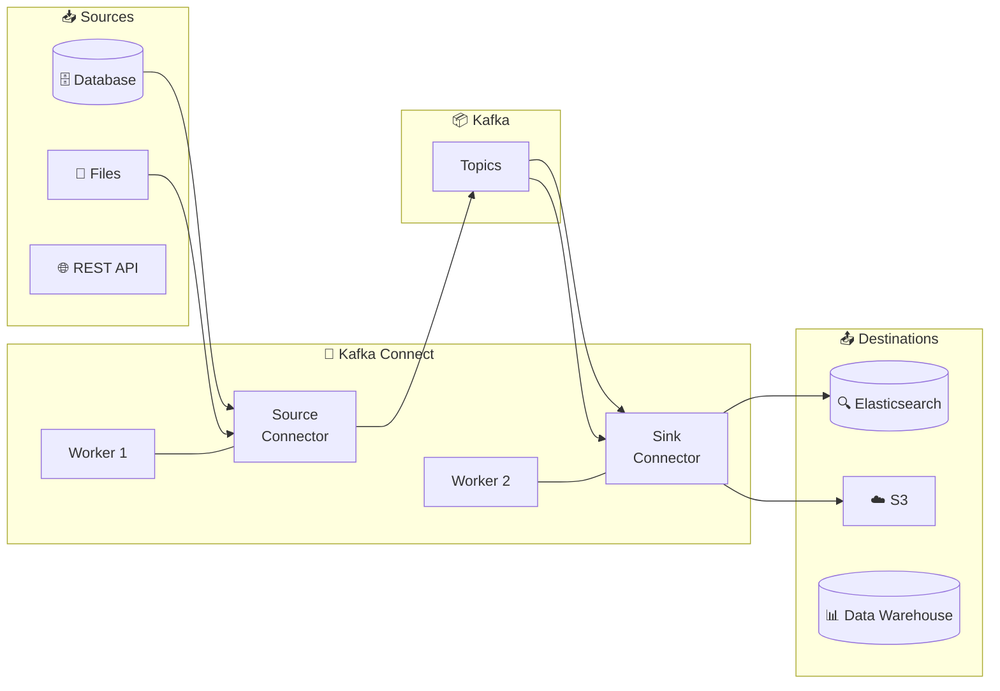
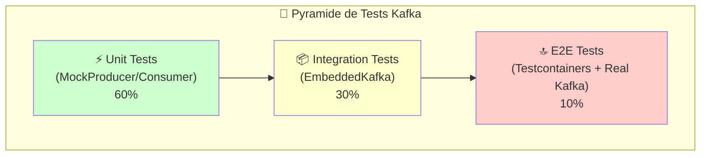
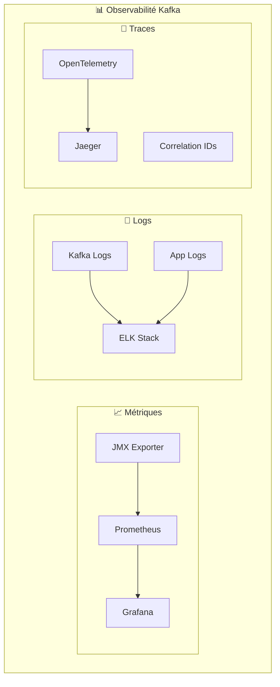
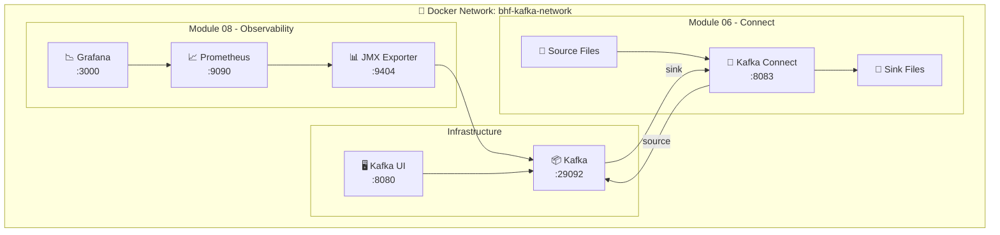

# 📅 Day 03 - Intégration, Tests & Observabilité

> **Durée estimée** : 5-6 heures | **Niveau** : Avancé → Production

---

## 🎯 Objectifs pédagogiques

À la fin de cette journée, vous serez capable de :

| # | Objectif | Module |
|---|----------|--------|
| 1 | Déployer un **connecteur Source** (fichier → Kafka) | M06 |
| 2 | Déployer un **connecteur Sink** (Kafka → fichier) | M06 |
| 3 | Configurer et gérer les connecteurs via **REST API** | M06 |
| 4 | Écrire des **tests unitaires** avec MockProducer/MockConsumer | M07 |
| 5 | Implémenter des **tests d'intégration** avec Testcontainers | M07 |
| 6 | Collecter les **métriques JMX** de Kafka | M08 |
| 7 | Visualiser le **consumer lag** et les performances | M08 |
| 8 | Mettre en place le **traçage distribué** des événements | M08 |

---

## 📚 Concepts fondamentaux

### Kafka Connect - Architecture



### Types de connecteurs

| Type | Direction | Exemples | Cas d'usage |
|------|-----------|----------|-------------|
| **Source** | Externe → Kafka | JDBC, Debezium, FileStream | CDC, ingestion |
| **Sink** | Kafka → Externe | Elasticsearch, S3, JDBC | Indexation, archivage |

### Testing Pyramid



### Stratégies de test

| Niveau | Outil | Vitesse | Fidélité | Isolation |
|--------|-------|---------|----------|-----------|
| **Unit** | MockProducer | ⚡⚡⚡ | ⭐ | ✅ Total |
| **Integration** | EmbeddedKafka | ⚡⚡ | ⭐⭐ | ✅ Process |
| **E2E** | Testcontainers | ⚡ | ⭐⭐⭐ | ✅ Container |

### Observabilité - Les 3 piliers



### Métriques clés à surveiller

| Métrique | Description | Seuil d'alerte |
|----------|-------------|----------------|
| **consumer_lag** | Messages non consommés | > 1000 |
| **request_latency_avg** | Latence moyenne | > 100ms |
| **bytes_in_per_sec** | Débit entrant | Selon capacité |
| **under_replicated_partitions** | Partitions sous-répliquées | > 0 |
| **active_controller_count** | Contrôleurs actifs | ≠ 1 |

---

## 💡 Tips & Best Practices

### Kafka Connect

> **🔌 Toujours valider la configuration avant déploiement**
> ```bash
> curl -X PUT http://localhost:8083/connector-plugins/FileStreamSource/config/validate \
>   -H "Content-Type: application/json" \
>   -d '{"connector.class": "FileStreamSource", "topic": "test"}'
> ```

> **📊 Monitorer les connecteurs en production**
> ```bash
> # Status du connecteur
> curl http://localhost:8083/connectors/my-connector/status
> 
> # Redémarrer une tâche en erreur
> curl -X POST http://localhost:8083/connectors/my-connector/tasks/0/restart
> ```

### Testing

> **⚡ Préférer MockProducer pour les tests unitaires**
> ```java
> MockProducer<String, String> producer = new MockProducer<>(
>     true, new StringSerializer(), new StringSerializer());
> 
> // Vérifier les messages envoyés
> assertEquals(1, producer.history().size());
> ```

> **🐳 Utiliser Testcontainers pour l'intégration**
> ```java
> @Container
> static KafkaContainer kafka = new KafkaContainer(
>     DockerImageName.parse("confluentinc/cp-kafka:7.5.0"));
> ```

### Observabilité

> **📈 Configurer des alertes sur le consumer lag**
> ```yaml
> # prometheus/alerts.yml
> - alert: HighConsumerLag
>   expr: kafka_consumer_group_lag > 1000
>   for: 5m
>   labels:
>     severity: warning
> ```

> **🔗 Propager les correlation IDs dans les headers**
> ```java
> record.headers().add("correlation-id", 
>     UUID.randomUUID().toString().getBytes());
> ```

---

## 🏗️ Architecture du Lab



---

## 📦 Modules

| Module | Titre | Durée | Description |
|--------|-------|-------|-------------|
| [**M06**](./module-06-kafka-connect/README.md) | Kafka Connect | 60-90 min | Source/Sink, REST API |
| [**M07**](./module-07-testing/README.md) | Testing | 60 min | Mock, Testcontainers |
| [**M08**](./module-08-observability/README.md) | Observabilité | 60-90 min | JMX, Prometheus, Grafana |

---

## 🚀 Quick Start

### Prérequis

- ✅ Day 01 & Day 02 complétés
- ✅ Kafka infrastructure running

### Démarrer les modules

```powershell
# Depuis formation-v2/
cd infra
docker-compose -f docker-compose.single-node.yml up -d

# Module 06 - Kafka Connect
cd ../day-03-integration/module-06-kafka-connect
docker-compose -f docker-compose.module.yml up -d

# Module 07 - Tests (exécution locale)
cd ../module-07-testing/java
mvn test

# Module 08 - Observabilité
cd ../module-08-observability
docker-compose -f docker-compose.module.yml up -d
```

### Ports

| Service | Port | Description |
|---------|------|-------------|
| Kafka Connect | 8083 | REST API |
| Prometheus | 9090 | Metrics store |
| Grafana | 3000 | Dashboards (admin/admin) |
| JMX Exporter | 9404 | Kafka metrics |

---

## ⚠️ Erreurs courantes

| Erreur | Cause | Solution |
|--------|-------|----------|
| `Connector not found` | Plugin non installé | Vérifier `/usr/share/java/` |
| `No tasks assigned` | Configuration invalide | Valider avec PUT validate |
| `Testcontainers timeout` | Docker lent | Augmenter timeout startup |
| `Prometheus scrape failed` | JMX non exposé | Vérifier KAFKA_JMX_OPTS |

---

## ➡️ Navigation

⬅️ **[Day 02 - Développement](../day-02-development/README.md)**

🏠 **[Overview](../00-overview/README.md)**
