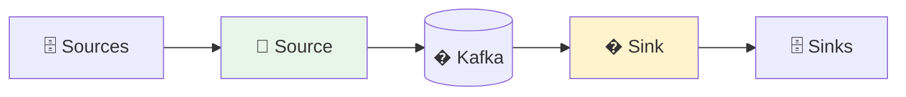
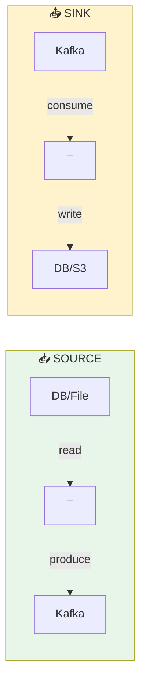
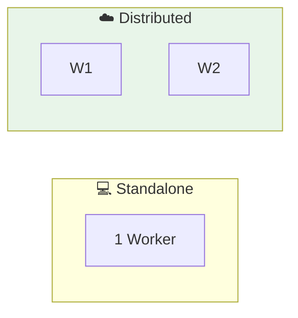
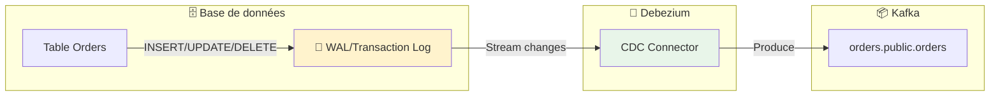
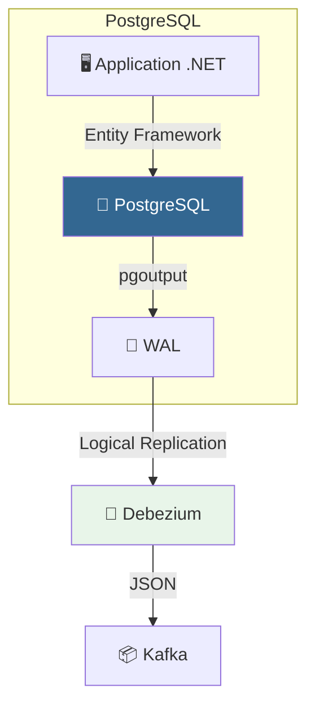
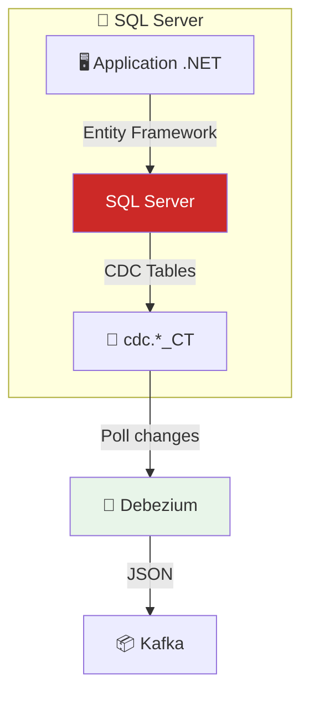

# 🔌 Module 06 - Kafka Connect : Intégration de Données

| Durée | Niveau | Prérequis |
|-------|--------|-----------|
| 2 heures | Intermédiaire | Modules 01-05 complétés |

## 🎯 Objectifs d'apprentissage

À la fin de ce module, vous serez capable de :

- ✅ Comprendre l'architecture de Kafka Connect
- ✅ Déployer un connecteur Source (fichier → Kafka)
- ✅ Déployer un connecteur Sink (Kafka → fichier)
- ✅ Configurer et monitorer les connecteurs

---

## 📚 Partie Théorique (30%)

### 1. Introduction à Kafka Connect

#### Qu'est-ce que Kafka Connect ?

**Kafka Connect** est un framework d'intégration de données scalable et fiable pour connecter Kafka à des systèmes externes (bases de données, fichiers, APIs, etc.).



#### Concepts clés

| Concept | Description |
|---------|-------------|
| **Connector** | Plugin qui définit comment se connecter à un système externe |
| **Task** | Unité de travail parallélisable du connecteur |
| **Worker** | Processus JVM qui exécute les connecteurs et tasks |
| **Converter** | Transforme les données entre Kafka et le format du connecteur |

---

### 2. Types de connecteurs



#### Connecteurs populaires

| Type | Connecteur | Usage |
|------|------------|-------|
| Source | JDBC Source | Importer depuis SQL |
| Source | Debezium | CDC (Change Data Capture) |
| Source | FileStream | Importer depuis fichiers |
| Sink | JDBC Sink | Exporter vers SQL |
| Sink | Elasticsearch | Indexation |
| Sink | S3 Sink | Archivage cloud |

---

### 3. Modes de déploiement



| Mode | Avantages | Inconvénients |
|------|-----------|---------------|
| **Standalone** | Simple, Dev/Test | Non HA, Single machine |
| **Distributed** | Scalable, Fault-tolerant | Plus complexe |

---

### 4. Configuration d'un connecteur

```json
{
  "name": "file-source-connector",
  "config": {
    "connector.class": "FileStreamSource",
    "tasks.max": "1",
    "file": "/data/input.txt",
    "topic": "file-topic",
    "key.converter": "org.apache.kafka.connect.storage.StringConverter",
    "value.converter": "org.apache.kafka.connect.storage.StringConverter"
  }
}
```

#### Paramètres essentiels

| Paramètre | Description |
|-----------|-------------|
| `connector.class` | Classe Java du connecteur |
| `tasks.max` | Nombre max de tasks parallèles |
| `key.converter` | Convertisseur pour les clés |
| `value.converter` | Convertisseur pour les valeurs |

---

### 5. Change Data Capture (CDC) avec Debezium

Le **CDC** permet de capturer les changements de données en temps réel depuis une base de données vers Kafka.



#### Pourquoi CDC vs Polling ?

| Approche | Avantages | Inconvénients |
|----------|-----------|---------------|
| **Polling (JDBC)** | Simple à configurer | Latence, charge DB, DELETE non capturés |
| **CDC (Debezium)** | Temps réel, tous les changements, faible impact | Configuration WAL requise |

#### Structure d'un événement CDC

```json
{
  "before": { "id": 1, "status": "pending" },
  "after": { "id": 1, "status": "shipped" },
  "source": {
    "db": "orders_db",
    "table": "orders",
    "ts_ms": 1706450400000
  },
  "op": "u"
}
```

| Champ | Description |
|-------|-------------|
| `before` | État avant modification (null pour INSERT) |
| `after` | État après modification (null pour DELETE) |
| `op` | Opération: `c`=create, `u`=update, `d`=delete, `r`=read |

---

### 6. CDC avec PostgreSQL

PostgreSQL utilise le **WAL (Write-Ahead Log)** avec le plugin `pgoutput` pour le CDC.



#### Configuration PostgreSQL requise

```sql
-- Activer la réplication logique (postgresql.conf)
-- wal_level = logical
-- max_replication_slots = 4
-- max_wal_senders = 4

-- Créer un slot de réplication
SELECT * FROM pg_create_logical_replication_slot('debezium', 'pgoutput');

-- Vérifier les slots
SELECT slot_name, plugin, slot_type, active FROM pg_replication_slots;
```

#### Configuration Debezium PostgreSQL

```json
{
  "name": "postgres-cdc-source",
  "config": {
    "connector.class": "io.debezium.connector.postgresql.PostgresConnector",
    "database.hostname": "postgres",
    "database.port": "5432",
    "database.user": "postgres",
    "database.password": "postgres",
    "database.dbname": "orders_db",
    "database.server.name": "orders",
    "plugin.name": "pgoutput",
    "slot.name": "debezium",
    "publication.name": "dbz_publication",
    "table.include.list": "public.orders,public.customers",
    "topic.prefix": "cdc",
    "schema.history.internal.kafka.bootstrap.servers": "kafka:29092",
    "schema.history.internal.kafka.topic": "schema-changes.orders"
  }
}
```

---

### 7. CDC avec SQL Server

SQL Server utilise le **Change Tracking** ou **CDC natif** pour capturer les modifications.



#### Activation CDC sur SQL Server

```sql
-- Activer CDC sur la base de données
USE orders_db;
EXEC sys.sp_cdc_enable_db;

-- Activer CDC sur une table
EXEC sys.sp_cdc_enable_table
  @source_schema = N'dbo',
  @source_name = N'Orders',
  @role_name = NULL,
  @supports_net_changes = 1;

-- Vérifier les tables CDC
SELECT name, is_tracked_by_cdc FROM sys.tables WHERE is_tracked_by_cdc = 1;

-- Vérifier le statut CDC
EXEC sys.sp_cdc_help_change_data_capture;
```

#### Configuration Debezium SQL Server

```json
{
  "name": "sqlserver-cdc-source",
  "config": {
    "connector.class": "io.debezium.connector.sqlserver.SqlServerConnector",
    "database.hostname": "sqlserver",
    "database.port": "1433",
    "database.user": "sa",
    "database.password": "YourStrong!Passw0rd",
    "database.names": "orders_db",
    "topic.prefix": "sqlserver",
    "table.include.list": "dbo.Orders,dbo.Customers",
    "database.encrypt": "false",
    "schema.history.internal.kafka.bootstrap.servers": "kafka:29092",
    "schema.history.internal.kafka.topic": "schema-changes.sqlserver"
  }
}
```

---

### 8. Comparaison PostgreSQL vs SQL Server CDC

| Critère | PostgreSQL | SQL Server |
|---------|------------|------------|
| **Mécanisme** | Logical Replication (WAL) | CDC Tables (polling) |
| **Latence** | ~100ms (temps réel) | ~1-5s (polling interval) |
| **Impact performance** | Faible | Modéré |
| **Configuration** | `wal_level=logical` | `sp_cdc_enable_db` |
| **DELETE** | Capturé | Capturé |
| **Schema changes** | Automatique | Reconfiguration requise |

#### Bonnes pratiques CDC

> **⚠️ Production** : Toujours tester le CDC en staging avant production

```text
✅ DO:
  - Monitorer le lag des slots de réplication
  - Configurer la rétention des slots
  - Utiliser des topics séparés par table
  - Activer la compression des topics CDC

❌ DON'T:
  - Activer CDC sur toutes les tables
  - Ignorer le monitoring des slots
  - Oublier de nettoyer les anciens slots
```

---

## 🔌 Ports et Services

| Service | Port | Description |
|---------|------|-------------|
| Kafka Connect | 8083 | REST API |
| Kafka UI | 8080 | Interface web |
| Kafka | 9092 | Broker |

---

## 🛠️ Partie Pratique (70%)

### Prérequis

<details>
<summary>🐳 <b>Mode Docker</b></summary>

```bash
cd formation-v2/
./scripts/up.sh
```

</details>

<details>
<summary>☸️ <b>Mode OKD/K3s</b></summary>

```bash
# Vérifier que le cluster Kafka est prêt
kubectl get kafka -n kafka
kubectl get pods -n kafka -l strimzi.io/cluster=bhf-kafka

# Kafka Connect avec Strimzi utilise KafkaConnect CR
kubectl get kafkaconnect -n kafka
```

</details>

---

### Étape 1 - Démarrer Kafka Connect

```bash
docker compose -f day-03-integration/module-06-kafka-connect/docker-compose.module.yml up -d
```

**Vérification** :

```bash
# Attendre le démarrage (30-60 secondes)
sleep 30

# Vérifier le statut
curl -s http://localhost:8083/ | jq
```

**Résultat attendu** :

```json
{
  "version": "3.6.0",
  "commit": "...",
  "kafka_cluster_id": "..."
}
```

---

### Étape 2 - Lab 1 : Lister les plugins disponibles

<details>
<summary>🐳 <b>Mode Docker</b></summary>

```bash
curl -s http://localhost:8083/connector-plugins | jq '.[].class'
```

</details>

<details>
<summary>☸️ <b>Mode OKD/K3s</b></summary>

```bash
# Via le Service NodePort Kafka Connect (31083)
curl -s http://localhost:31083/connector-plugins | jq '.[].class'
```

</details>

**Résultat attendu** : Liste des connecteurs disponibles (FileStreamSource, FileStreamSink, etc.)

---

### Étape 3 - Lab 2 : Créer un Source Connector

**Objectif** : Lire un fichier et envoyer son contenu vers Kafka.

#### 3.1 Créer le fichier source

```bash
docker exec kafka-connect sh -c 'echo "Hello Kafka Connect" > /tmp/source-data.txt'
docker exec kafka-connect sh -c 'echo "Line 2" >> /tmp/source-data.txt'
docker exec kafka-connect sh -c 'echo "Line 3" >> /tmp/source-data.txt'
```

#### 3.2 Créer le connecteur

<details>
<summary>🐳 <b>Mode Docker</b></summary>

```bash
curl -X POST http://localhost:8083/connectors \
  -H "Content-Type: application/json" \
  -d '{
    "name": "file-source",
    "config": {
      "connector.class": "FileStreamSource",
      "tasks.max": "1",
      "file": "/tmp/source-data.txt",
      "topic": "file-topic"
    }
  }'
```

</details>

<details>
<summary>☸️ <b>Mode OKD/K3s</b></summary>

```bash
curl -X POST http://localhost:31083/connectors \
  -H "Content-Type: application/json" \
  -d '{
    "name": "file-source",
    "config": {
      "connector.class": "FileStreamSource",
      "tasks.max": "1",
      "file": "/tmp/source-data.txt",
      "topic": "file-topic"
    }
  }'
```

</details>

#### 3.3 Vérifier le statut

<details>
<summary>🐳 <b>Mode Docker</b></summary>

```bash
curl -s http://localhost:8083/connectors/file-source/status | jq
```

</details>

<details>
<summary>☸️ <b>Mode OKD/K3s</b></summary>

```bash
curl -s http://localhost:31083/connectors/file-source/status | jq
```

</details>

**Résultat attendu** :

```json
{
  "name": "file-source",
  "connector": { "state": "RUNNING" },
  "tasks": [{ "id": 0, "state": "RUNNING" }]
}
```

#### 3.4 Vérifier les messages dans Kafka

<details>
<summary>🐳 <b>Mode Docker</b></summary>

```bash
docker exec kafka kafka-console-consumer \
  --topic file-topic \
  --from-beginning \
  --max-messages 3 \
  --bootstrap-server localhost:9092
```

</details>

<details>
<summary>☸️ <b>Mode OKD/K3s</b></summary>

```bash
kubectl run kafka-consumer --rm -it --restart=Never \
  --image=quay.io/strimzi/kafka:latest-kafka-4.0.0 \
  -n kafka -- bin/kafka-console-consumer.sh \
  --bootstrap-server bhf-kafka-kafka-bootstrap:9092 \
  --topic file-topic --from-beginning --max-messages 3
```

</details>

---

### Étape 4 - Lab 3 : Créer un Sink Connector

**Objectif** : Écrire les messages Kafka vers un fichier.

<details>
<summary>🐳 <b>Mode Docker</b></summary>

```bash
curl -X POST http://localhost:8083/connectors \
  -H "Content-Type: application/json" \
  -d '{
    "name": "file-sink",
    "config": {
      "connector.class": "FileStreamSink",
      "tasks.max": "1",
      "file": "/tmp/sink-output.txt",
      "topics": "file-topic"
    }
  }'
```

</details>

<details>
<summary>☸️ <b>Mode OKD/K3s</b></summary>

```bash
curl -X POST http://localhost:31083/connectors \
  -H "Content-Type: application/json" \
  -d '{
    "name": "file-sink",
    "config": {
      "connector.class": "FileStreamSink",
      "tasks.max": "1",
      "file": "/tmp/sink-output.txt",
      "topics": "file-topic"
    }
  }'
```

</details>

**Vérifier le fichier de sortie** :

```bash
docker exec kafka-connect cat /tmp/sink-output.txt
```

---

### Étape 5 - Lab 4 : Ajouter des données en temps réel

```bash
# Ajouter des lignes au fichier source
docker exec kafka-connect sh -c 'echo "New line 4" >> /tmp/source-data.txt'
docker exec kafka-connect sh -c 'echo "New line 5" >> /tmp/source-data.txt'

# Vérifier la propagation
sleep 5
docker exec kafka-connect cat /tmp/sink-output.txt
```

---

### Étape 6 - Lab 5 : Gestion des connecteurs

#### 6.1 Lister tous les connecteurs

<details>
<summary>🐳 <b>Mode Docker</b></summary>

```bash
curl -s http://localhost:8083/connectors | jq
```

</details>

<details>
<summary>☸️ <b>Mode OKD/K3s</b></summary>

```bash
curl -s http://localhost:31083/connectors | jq
```

</details>

#### 6.2 Obtenir la configuration

```bash
curl -s http://localhost:8083/connectors/file-source/config | jq
```

#### 6.3 Mettre en pause

```bash
curl -X PUT http://localhost:8083/connectors/file-source/pause
curl -s http://localhost:8083/connectors/file-source/status | jq '.connector.state'
```

#### 6.4 Reprendre

```bash
curl -X PUT http://localhost:8083/connectors/file-source/resume
```

#### 6.5 Supprimer

```bash
curl -X DELETE http://localhost:8083/connectors/file-source
```

---

## ✅ Checkpoint de validation

- [ ] Kafka Connect démarré et accessible sur :8083
- [ ] Source connector créé et RUNNING
- [ ] Messages visibles dans le topic file-topic
- [ ] Sink connector créé et écrit dans le fichier
- [ ] Données en temps réel propagées
- [ ] Connecteurs gérables via REST API

---

## 🔧 Troubleshooting

### Connecteur en état FAILED

```bash
# Voir les erreurs
curl -s http://localhost:8083/connectors/file-source/status | jq '.tasks[0].trace'

# Redémarrer la task
curl -X POST http://localhost:8083/connectors/file-source/tasks/0/restart
```

### Kafka Connect ne démarre pas

```bash
docker logs kafka-connect --tail 100 | grep -i error
```

---

## 🧹 Nettoyage

```bash
# Supprimer les connecteurs
curl -X DELETE http://localhost:8083/connectors/file-source
curl -X DELETE http://localhost:8083/connectors/file-sink

# Arrêter le module
docker compose -f day-03-integration/module-06-kafka-connect/docker-compose.module.yml down
```

---

## 📖 Pour aller plus loin

### Exercices supplémentaires

1. **Créez un connecteur JDBC** pour importer depuis une base de données
2. **Configurez un SMT** (Single Message Transform) pour modifier les messages
3. **Testez le mode distribué** avec plusieurs workers

### Ressources

- [Kafka Connect Documentation](https://kafka.apache.org/documentation/#connect)
- [Confluent Hub](https://www.confluent.io/hub/) - Marketplace de connecteurs
- [Debezium](https://debezium.io/) - CDC pour Kafka
