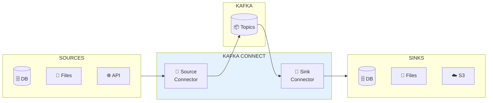
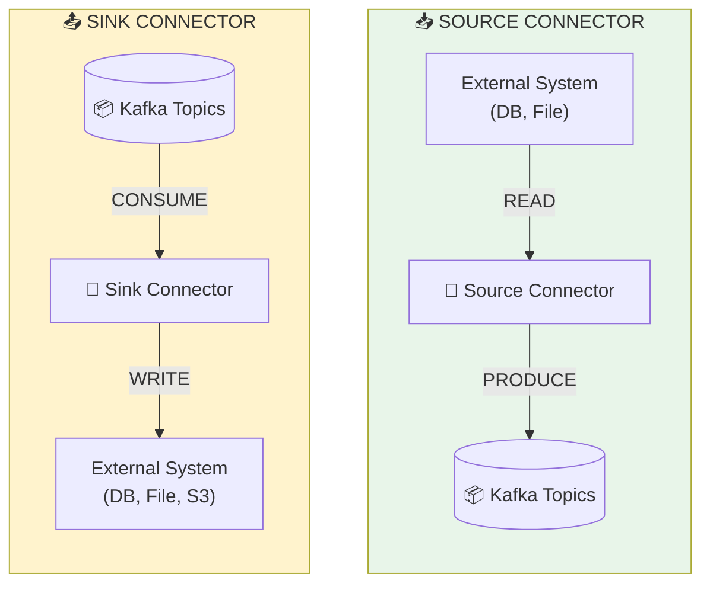
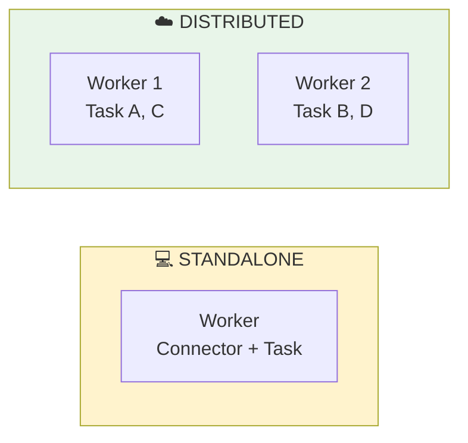

# 🔌 Module 06 - Kafka Connect : Intégration de Données

| Durée | Niveau | Prérequis |
|-------|--------|-----------|
| 2 heures | Intermédiaire | Modules 01-05 complétés |

## 🎯 Objectifs d'apprentissage

À la fin de ce module, vous serez capable de :

- ✅ Comprendre l'architecture de Kafka Connect
- ✅ Déployer un connecteur Source (fichier → Kafka)
- ✅ Déployer un connecteur Sink (Kafka → fichier)
- ✅ Configurer et monitorer les connecteurs

---

## 📚 Partie Théorique (30%)

### 1. Introduction à Kafka Connect

#### Qu'est-ce que Kafka Connect ?

**Kafka Connect** est un framework d'intégration de données scalable et fiable pour connecter Kafka à des systèmes externes (bases de données, fichiers, APIs, etc.).



#### Concepts clés

| Concept | Description |
|---------|-------------|
| **Connector** | Plugin qui définit comment se connecter à un système externe |
| **Task** | Unité de travail parallélisable du connecteur |
| **Worker** | Processus JVM qui exécute les connecteurs et tasks |
| **Converter** | Transforme les données entre Kafka et le format du connecteur |

---

### 2. Types de connecteurs



#### Connecteurs populaires

| Type | Connecteur | Usage |
|------|------------|-------|
| Source | JDBC Source | Importer depuis SQL |
| Source | Debezium | CDC (Change Data Capture) |
| Source | FileStream | Importer depuis fichiers |
| Sink | JDBC Sink | Exporter vers SQL |
| Sink | Elasticsearch | Indexation |
| Sink | S3 Sink | Archivage cloud |

---

### 3. Modes de déploiement



| Mode | Avantages | Inconvénients |
|------|-----------|---------------|
| **Standalone** | Simple, Dev/Test | Non HA, Single machine |
| **Distributed** | Scalable, Fault-tolerant | Plus complexe |

---

### 4. Configuration d'un connecteur

```json
{
  "name": "file-source-connector",
  "config": {
    "connector.class": "FileStreamSource",
    "tasks.max": "1",
    "file": "/data/input.txt",
    "topic": "file-topic",
    "key.converter": "org.apache.kafka.connect.storage.StringConverter",
    "value.converter": "org.apache.kafka.connect.storage.StringConverter"
  }
}
```

#### Paramètres essentiels

| Paramètre | Description |
|-----------|-------------|
| `connector.class` | Classe Java du connecteur |
| `tasks.max` | Nombre max de tasks parallèles |
| `key.converter` | Convertisseur pour les clés |
| `value.converter` | Convertisseur pour les valeurs |

---

## 🔌 Ports et Services

| Service | Port | Description |
|---------|------|-------------|
| Kafka Connect | 8083 | REST API |
| Kafka UI | 8080 | Interface web |
| Kafka | 9092 | Broker |

---

## 🛠️ Partie Pratique (70%)

### Prérequis

```bash
cd formation-v2/
./scripts/up.sh
```

---

### Étape 1 - Démarrer Kafka Connect

```bash
docker compose -f day-03-integration/module-06-kafka-connect/docker-compose.module.yml up -d
```

**Vérification** :

```bash
# Attendre le démarrage (30-60 secondes)
sleep 30

# Vérifier le statut
curl -s http://localhost:8083/ | jq
```

**Résultat attendu** :

```json
{
  "version": "3.6.0",
  "commit": "...",
  "kafka_cluster_id": "..."
}
```

---

### Étape 2 - Lab 1 : Lister les plugins disponibles

```bash
curl -s http://localhost:8083/connector-plugins | jq '.[].class'
```

**Résultat attendu** : Liste des connecteurs disponibles (FileStreamSource, FileStreamSink, etc.)

---

### Étape 3 - Lab 2 : Créer un Source Connector

**Objectif** : Lire un fichier et envoyer son contenu vers Kafka.

#### 3.1 Créer le fichier source

```bash
docker exec kafka-connect sh -c 'echo "Hello Kafka Connect" > /tmp/source-data.txt'
docker exec kafka-connect sh -c 'echo "Line 2" >> /tmp/source-data.txt'
docker exec kafka-connect sh -c 'echo "Line 3" >> /tmp/source-data.txt'
```

#### 3.2 Créer le connecteur

```bash
curl -X POST http://localhost:8083/connectors \
  -H "Content-Type: application/json" \
  -d '{
    "name": "file-source",
    "config": {
      "connector.class": "FileStreamSource",
      "tasks.max": "1",
      "file": "/tmp/source-data.txt",
      "topic": "file-topic"
    }
  }'
```

#### 3.3 Vérifier le statut

```bash
curl -s http://localhost:8083/connectors/file-source/status | jq
```

**Résultat attendu** :

```json
{
  "name": "file-source",
  "connector": { "state": "RUNNING" },
  "tasks": [{ "id": 0, "state": "RUNNING" }]
}
```

#### 3.4 Vérifier les messages dans Kafka

```bash
docker exec kafka kafka-console-consumer \
  --topic file-topic \
  --from-beginning \
  --max-messages 3 \
  --bootstrap-server localhost:9092
```

---

### Étape 4 - Lab 3 : Créer un Sink Connector

**Objectif** : Écrire les messages Kafka vers un fichier.

```bash
curl -X POST http://localhost:8083/connectors \
  -H "Content-Type: application/json" \
  -d '{
    "name": "file-sink",
    "config": {
      "connector.class": "FileStreamSink",
      "tasks.max": "1",
      "file": "/tmp/sink-output.txt",
      "topics": "file-topic"
    }
  }'
```

**Vérifier le fichier de sortie** :

```bash
docker exec kafka-connect cat /tmp/sink-output.txt
```

---

### Étape 5 - Lab 4 : Ajouter des données en temps réel

```bash
# Ajouter des lignes au fichier source
docker exec kafka-connect sh -c 'echo "New line 4" >> /tmp/source-data.txt'
docker exec kafka-connect sh -c 'echo "New line 5" >> /tmp/source-data.txt'

# Vérifier la propagation
sleep 5
docker exec kafka-connect cat /tmp/sink-output.txt
```

---

### Étape 6 - Lab 5 : Gestion des connecteurs

#### 6.1 Lister tous les connecteurs

```bash
curl -s http://localhost:8083/connectors | jq
```

#### 6.2 Obtenir la configuration

```bash
curl -s http://localhost:8083/connectors/file-source/config | jq
```

#### 6.3 Mettre en pause

```bash
curl -X PUT http://localhost:8083/connectors/file-source/pause
curl -s http://localhost:8083/connectors/file-source/status | jq '.connector.state'
```

#### 6.4 Reprendre

```bash
curl -X PUT http://localhost:8083/connectors/file-source/resume
```

#### 6.5 Supprimer

```bash
curl -X DELETE http://localhost:8083/connectors/file-source
```

---

## ✅ Checkpoint de validation

- [ ] Kafka Connect démarré et accessible sur :8083
- [ ] Source connector créé et RUNNING
- [ ] Messages visibles dans le topic file-topic
- [ ] Sink connector créé et écrit dans le fichier
- [ ] Données en temps réel propagées
- [ ] Connecteurs gérables via REST API

---

## 🔧 Troubleshooting

### Connecteur en état FAILED

```bash
# Voir les erreurs
curl -s http://localhost:8083/connectors/file-source/status | jq '.tasks[0].trace'

# Redémarrer la task
curl -X POST http://localhost:8083/connectors/file-source/tasks/0/restart
```

### Kafka Connect ne démarre pas

```bash
docker logs kafka-connect --tail 100 | grep -i error
```

---

## 🧹 Nettoyage

```bash
# Supprimer les connecteurs
curl -X DELETE http://localhost:8083/connectors/file-source
curl -X DELETE http://localhost:8083/connectors/file-sink

# Arrêter le module
docker compose -f day-03-integration/module-06-kafka-connect/docker-compose.module.yml down
```

---

## 📖 Pour aller plus loin

### Exercices supplémentaires

1. **Créez un connecteur JDBC** pour importer depuis une base de données
2. **Configurez un SMT** (Single Message Transform) pour modifier les messages
3. **Testez le mode distribué** avec plusieurs workers

### Ressources

- [Kafka Connect Documentation](https://kafka.apache.org/documentation/#connect)
- [Confluent Hub](https://www.confluent.io/hub/) - Marketplace de connecteurs
- [Debezium](https://debezium.io/) - CDC pour Kafka
