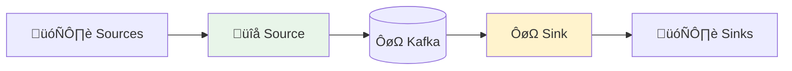
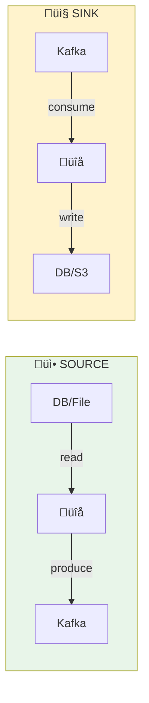
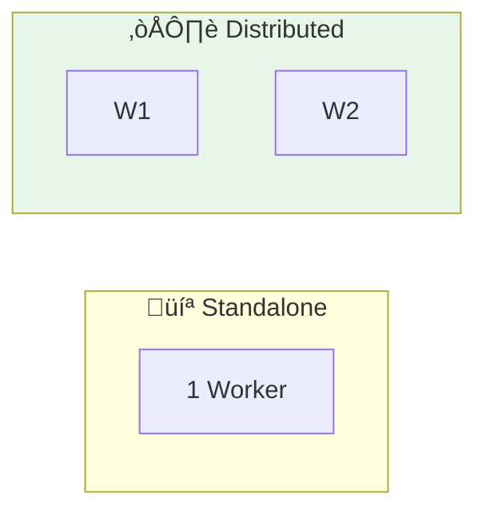
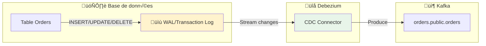
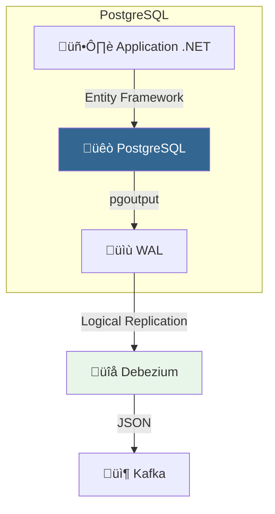
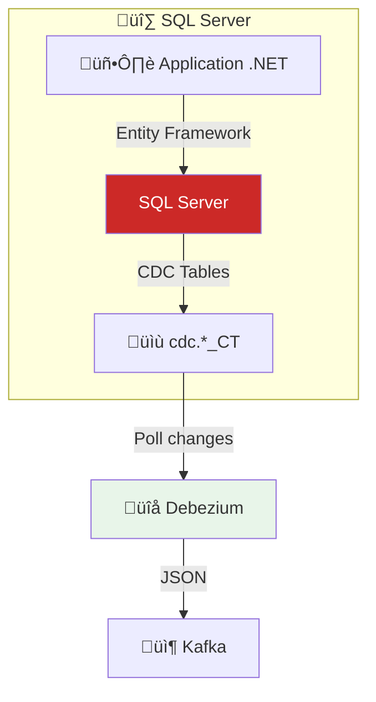

# 🔌 Module 06 - Kafka Connect : Intégration de Données

| Durée | Niveau | Prérequis |
|-------|--------|-----------|
| 2 heures | Intermédiaire | Modules 01-05 complétés |

## 🎯 Objectifs d'apprentissage

À la fin de ce module, vous serez capable de :

- ✅ Comprendre l'architecture de Kafka Connect
- ✅ Déployer un connecteur Source (fichier → Kafka)
- ✅ Déployer un connecteur Sink (Kafka → fichier)
- ✅ Configurer et monitorer les connecteurs

---

## 📚 Partie Théorique (30%)

### 1. Introduction à Kafka Connect

#### Qu'est-ce que Kafka Connect ?

**Kafka Connect** est un framework d'intégration de données scalable et fiable pour connecter Kafka à des systèmes externes (bases de données, fichiers, APIs, etc.).



#### Concepts clés

| Concept | Description |
|---------|-------------|
| **Connector** | Plugin qui définit comment se connecter à un système externe |
| **Task** | Unité de travail parallélisable du connecteur |
| **Worker** | Processus JVM qui exécute les connecteurs et tasks |
| **Converter** | Transforme les données entre Kafka et le format du connecteur |

---

### 2. Types de connecteurs



#### Connecteurs populaires

| Type | Connecteur | Usage |
|------|------------|-------|
| Source | JDBC Source | Importer depuis SQL |
| Source | Debezium | CDC (Change Data Capture) |
| Source | FileStream | Importer depuis fichiers |
| Sink | JDBC Sink | Exporter vers SQL |
| Sink | Elasticsearch | Indexation |
| Sink | S3 Sink | Archivage cloud |

---

### 3. Modes de déploiement



| Mode | Avantages | Inconvénients |
|------|-----------|---------------|
| **Standalone** | Simple, Dev/Test | Non HA, Single machine |
| **Distributed** | Scalable, Fault-tolerant | Plus complexe |

---

### 4. Configuration d'un connecteur

```json
{
  "name": "file-source-connector",
  "config": {
    "connector.class": "FileStreamSource",
    "tasks.max": "1",
    "file": "/data/input.txt",
    "topic": "file-topic",
    "key.converter": "org.apache.kafka.connect.storage.StringConverter",
    "value.converter": "org.apache.kafka.connect.storage.StringConverter"
  }
}
```

#### Paramètres essentiels

| Paramètre | Description |
|-----------|-------------|
| `connector.class` | Classe Java du connecteur |
| `tasks.max` | Nombre max de tasks parallèles |
| `key.converter` | Convertisseur pour les clés |
| `value.converter` | Convertisseur pour les valeurs |

---

### 5. Change Data Capture (CDC) avec Debezium

Le **CDC** permet de capturer les changements de données en temps réel depuis une base de données vers Kafka.



#### Pourquoi CDC vs Polling ?

| Approche | Avantages | Inconvénients |
|----------|-----------|---------------|
| **Polling (JDBC)** | Simple à configurer | Latence, charge DB, DELETE non capturés |
| **CDC (Debezium)** | Temps réel, tous les changements, faible impact | Configuration WAL requise |

#### Structure d'un événement CDC

```json
{
  "before": { "id": 1, "status": "pending" },
  "after": { "id": 1, "status": "shipped" },
  "source": {
    "db": "orders_db",
    "table": "orders",
    "ts_ms": 1706450400000
  },
  "op": "u"
}
```

| Champ | Description |
|-------|-------------|
| `before` | État avant modification (null pour INSERT) |
| `after` | État après modification (null pour DELETE) |
| `op` | Opération: `c`=create, `u`=update, `d`=delete, `r`=read |

---

### 6. CDC avec PostgreSQL

PostgreSQL utilise le **WAL (Write-Ahead Log)** avec le plugin `pgoutput` pour le CDC.



#### Configuration PostgreSQL requise

```sql
-- Activer la réplication logique (postgresql.conf)
-- wal_level = logical
-- max_replication_slots = 4
-- max_wal_senders = 4

-- Créer un slot de réplication
SELECT * FROM pg_create_logical_replication_slot('debezium', 'pgoutput');

-- Vérifier les slots
SELECT slot_name, plugin, slot_type, active FROM pg_replication_slots;
```

#### Configuration Debezium PostgreSQL

```json
{
  "name": "postgres-cdc-source",
  "config": {
    "connector.class": "io.debezium.connector.postgresql.PostgresConnector",
    "database.hostname": "postgres",
    "database.port": "5432",
    "database.user": "postgres",
    "database.password": "postgres",
    "database.dbname": "orders_db",
    "database.server.name": "orders",
    "plugin.name": "pgoutput",
    "slot.name": "debezium",
    "publication.name": "dbz_publication",
    "table.include.list": "public.orders,public.customers",
    "topic.prefix": "cdc",
    "schema.history.internal.kafka.bootstrap.servers": "kafka:29092",
    "schema.history.internal.kafka.topic": "schema-changes.orders"
  }
}
```

---

### 7. CDC avec SQL Server

SQL Server utilise le **Change Tracking** ou **CDC natif** pour capturer les modifications.



#### Activation CDC sur SQL Server

```sql
-- Activer CDC sur la base de données
USE orders_db;
EXEC sys.sp_cdc_enable_db;

-- Activer CDC sur une table
EXEC sys.sp_cdc_enable_table
  @source_schema = N'dbo',
  @source_name = N'Orders',
  @role_name = NULL,
  @supports_net_changes = 1;

-- Vérifier les tables CDC
SELECT name, is_tracked_by_cdc FROM sys.tables WHERE is_tracked_by_cdc = 1;

-- Vérifier le statut CDC
EXEC sys.sp_cdc_help_change_data_capture;
```

#### Configuration Debezium SQL Server

```json
{
  "name": "sqlserver-cdc-source",
  "config": {
    "connector.class": "io.debezium.connector.sqlserver.SqlServerConnector",
    "database.hostname": "sqlserver",
    "database.port": "1433",
    "database.user": "sa",
    "database.password": "YourStrong!Passw0rd",
    "database.names": "orders_db",
    "topic.prefix": "sqlserver",
    "table.include.list": "dbo.Orders,dbo.Customers",
    "database.encrypt": "false",
    "schema.history.internal.kafka.bootstrap.servers": "kafka:29092",
    "schema.history.internal.kafka.topic": "schema-changes.sqlserver"
  }
}
```

---

### 8. Comparaison PostgreSQL vs SQL Server CDC

| Critère | PostgreSQL | SQL Server |
|---------|------------|------------|
| **Mécanisme** | Logical Replication (WAL) | CDC Tables (polling) |
| **Latence** | ~100ms (temps réel) | ~1-5s (polling interval) |
| **Impact performance** | Faible | Modéré |
| **Configuration** | `wal_level=logical` | `sp_cdc_enable_db` |
| **DELETE** | Capturé | Capturé |
| **Schema changes** | Automatique | Reconfiguration requise |

#### Bonnes pratiques CDC

> **⚠️ Production** : Toujours tester le CDC en staging avant production

```text
✅ DO:
  - Monitorer le lag des slots de réplication
  - Configurer la rétention des slots
  - Utiliser des topics séparés par table
  - Activer la compression des topics CDC

❌ DON'T:
  - Activer CDC sur toutes les tables
  - Ignorer le monitoring des slots
  - Oublier de nettoyer les anciens slots
```

---

## 🔌 Ports et Services

| Service | Port | Description |
|---------|------|-------------|
| Kafka Connect | 8083 | REST API |
| PostgreSQL Banking | 5432 | Core Banking System |
| SQL Server Banking | 1433 | Transaction Processing |
| Kafka UI | 8080 | Interface web |
| Kafka | 9092 | Broker |

---

## 🏦 Scénario Banking : Architecture CDC

```mermaid
flowchart TB
    subgraph CoreBanking["🏦 Core Banking (PostgreSQL)"]
        C["👤 Customers"]
        A["💰 Accounts"]
        T["📝 Transactions"]
        TR["🔄 Transfers"]
    end
    
    subgraph TxProcessing["💳 Transaction Processing (SQL Server)"]
        CA["💳 Cards"]
        CT["🧾 CardTransactions"]
        FA["🚨 FraudAlerts"]
        M["🏪 Merchants"]
    end
    
    subgraph Debezium["🔌 Debezium CDC"]
        PG["PostgreSQL Connector"]
        SQL["SQL Server Connector"]
    end
    
    subgraph Kafka["📦 Kafka Topics"]
        T1["banking.postgres.*"]
        T2["banking.sqlserver.*"]
    end
    
    CoreBanking -->|WAL| PG
    TxProcessing -->|CDC Tables| SQL
    PG --> T1
    SQL --> T2
    
    style CoreBanking fill:#336791,color:#fff
    style TxProcessing fill:#cc2927,color:#fff
    style Debezium fill:#e8f5e9
```



---

## 🛠️ Partie Pratique (70%)

### Prérequis

<details>
<summary>🐳 <b>Mode Docker</b></summary>

```bash
cd formation-v2/
./scripts/up.sh
```

</details>

<details>
<summary>☸️ <b>Mode OKD/K3s</b></summary>

```bash
# Vérifier que le cluster Kafka est prêt
kubectl get kafka -n kafka
kubectl get pods -n kafka -l strimzi.io/cluster=bhf-kafka

# Kafka Connect avec Strimzi utilise KafkaConnect CR
kubectl get kafkaconnect -n kafka
```

</details>

---

### Étape 1 - Démarrer Kafka Connect

```bash
docker compose -f day-03-integration/module-06-kafka-connect/docker-compose.module.yml up -d
```

**Vérification** :

```bash
# Attendre le démarrage (30-60 secondes)
sleep 30

# Vérifier le statut
curl -s http://localhost:8083/ | jq
```

**Résultat attendu** :

```json
{
  "version": "3.6.0",
  "commit": "...",
  "kafka_cluster_id": "..."
}
```

---

### Étape 2 - Lab 1 : Lister les plugins disponibles

<details>
<summary>🐳 <b>Mode Docker</b></summary>

```bash
curl -s http://localhost:8083/connector-plugins | jq '.[].class'
```

</details>

<details>
<summary>☸️ <b>Mode OKD/K3s</b></summary>

```bash
# Via le Service NodePort Kafka Connect (31083)
curl -s http://localhost:31083/connector-plugins | jq '.[].class'
```

</details>

**Résultat attendu** : Liste des connecteurs disponibles (FileStreamSource, FileStreamSink, etc.)

---

### Étape 3 - Lab 2 : Créer un Source Connector

**Objectif** : Lire un fichier et envoyer son contenu vers Kafka.

#### 3.1 Créer le fichier source

```bash
docker exec kafka-connect sh -c 'echo "Hello Kafka Connect" > /tmp/source-data.txt'
docker exec kafka-connect sh -c 'echo "Line 2" >> /tmp/source-data.txt'
docker exec kafka-connect sh -c 'echo "Line 3" >> /tmp/source-data.txt'
```

#### 3.2 Créer le connecteur

<details>
<summary>🐳 <b>Mode Docker</b></summary>

```bash
curl -X POST http://localhost:8083/connectors \
  -H "Content-Type: application/json" \
  -d '{
    "name": "file-source",
    "config": {
      "connector.class": "FileStreamSource",
      "tasks.max": "1",
      "file": "/tmp/source-data.txt",
      "topic": "file-topic"
    }
  }'
```

</details>

<details>
<summary>☸️ <b>Mode OKD/K3s</b></summary>

```bash
curl -X POST http://localhost:31083/connectors \
  -H "Content-Type: application/json" \
  -d '{
    "name": "file-source",
    "config": {
      "connector.class": "FileStreamSource",
      "tasks.max": "1",
      "file": "/tmp/source-data.txt",
      "topic": "file-topic"
    }
  }'
```

</details>

#### 3.3 Vérifier le statut

<details>
<summary>🐳 <b>Mode Docker</b></summary>

```bash
curl -s http://localhost:8083/connectors/file-source/status | jq
```

</details>

<details>
<summary>☸️ <b>Mode OKD/K3s</b></summary>

```bash
curl -s http://localhost:31083/connectors/file-source/status | jq
```

</details>

**Résultat attendu** :

```json
{
  "name": "file-source",
  "connector": { "state": "RUNNING" },
  "tasks": [{ "id": 0, "state": "RUNNING" }]
}
```

#### 3.4 Vérifier les messages dans Kafka

<details>
<summary>🐳 <b>Mode Docker</b></summary>

```bash
docker exec kafka kafka-console-consumer \
  --topic file-topic \
  --from-beginning \
  --max-messages 3 \
  --bootstrap-server localhost:9092
```

</details>

<details>
<summary>☸️ <b>Mode OKD/K3s</b></summary>

```bash
kubectl run kafka-consumer --rm -it --restart=Never \
  --image=quay.io/strimzi/kafka:latest-kafka-4.0.0 \
  -n kafka -- bin/kafka-console-consumer.sh \
  --bootstrap-server bhf-kafka-kafka-bootstrap:9092 \
  --topic file-topic --from-beginning --max-messages 3
```

</details>

---

### Étape 4 - Lab 3 : Créer un Sink Connector

**Objectif** : Écrire les messages Kafka vers un fichier.

<details>
<summary>🐳 <b>Mode Docker</b></summary>

```bash
curl -X POST http://localhost:8083/connectors \
  -H "Content-Type: application/json" \
  -d '{
    "name": "file-sink",
    "config": {
      "connector.class": "FileStreamSink",
      "tasks.max": "1",
      "file": "/tmp/sink-output.txt",
      "topics": "file-topic"
    }
  }'
```

</details>

<details>
<summary>☸️ <b>Mode OKD/K3s</b></summary>

```bash
curl -X POST http://localhost:31083/connectors \
  -H "Content-Type: application/json" \
  -d '{
    "name": "file-sink",
    "config": {
      "connector.class": "FileStreamSink",
      "tasks.max": "1",
      "file": "/tmp/sink-output.txt",
      "topics": "file-topic"
    }
  }'
```

</details>

**Vérifier le fichier de sortie** :

```bash
docker exec kafka-connect cat /tmp/sink-output.txt
```

---

### Étape 5 - Lab 4 : Ajouter des données en temps réel

```bash
# Ajouter des lignes au fichier source
docker exec kafka-connect sh -c 'echo "New line 4" >> /tmp/source-data.txt'
docker exec kafka-connect sh -c 'echo "New line 5" >> /tmp/source-data.txt'

# Vérifier la propagation
sleep 5
docker exec kafka-connect cat /tmp/sink-output.txt
```

---

### Étape 6 - Lab 5 : Gestion des connecteurs

#### 6.1 Lister tous les connecteurs

<details>
<summary>🐳 <b>Mode Docker</b></summary>

```bash
curl -s http://localhost:8083/connectors | jq
```

</details>

<details>
<summary>☸️ <b>Mode OKD/K3s</b></summary>

```bash
curl -s http://localhost:31083/connectors | jq
```

</details>

#### 6.2 Obtenir la configuration

```bash
curl -s http://localhost:8083/connectors/file-source/config | jq
```

#### 6.3 Mettre en pause

```bash
curl -X PUT http://localhost:8083/connectors/file-source/pause
curl -s http://localhost:8083/connectors/file-source/status | jq '.connector.state'
```

#### 6.4 Reprendre

```bash
curl -X PUT http://localhost:8083/connectors/file-source/resume
```

#### 6.5 Supprimer

```bash
curl -X DELETE http://localhost:8083/connectors/file-source
```

---

## 🏦 Labs Banking : CDC avec PostgreSQL et SQL Server

### Étape 7 - Lab 6 : Démarrer l'environnement Banking

**Objectif** : Déployer PostgreSQL (Core Banking) et SQL Server (Transaction Processing) avec CDC activé.

<details>
<summary>🐳 <b>Mode Docker</b></summary>

```bash
# Démarrer tous les services (Kafka Connect + Databases)
docker compose -f day-03-integration/module-06-kafka-connect/docker-compose.module.yml up -d

# Attendre l'initialisation (2-3 minutes)
echo "Waiting for databases to initialize..."
sleep 120

# Vérifier les services
docker ps --format "table {{.Names}}\t{{.Status}}" | grep -E "(kafka-connect|postgres|sqlserver)"
```

</details>

<details>
<summary>☸️ <b>Mode OKD/K3s</b></summary>

```bash
# Vérifier que le cluster Kafka est prêt
kubectl get kafka -n kafka
kubectl get pods -n kafka -l strimzi.io/cluster=bhf-kafka

# Déployer Kafka Connect avec Strimzi (nécessaire pour le mode K8s)
echo "🚀 Déploiement de Kafka Connect avec Debezium..."
kubectl apply -f - <<EOF
apiVersion: kafka.strimzi.io/v1beta2
kind: KafkaConnect
metadata:
  name: kafka-connect-banking
  namespace: kafka
spec:
  version: 4.0.0
  replicas: 1
  bootstrapServers: bhf-kafka-bootstrap:9092
  image: debezium/connect:2.5
  config:
    group.id: connect-cluster-banking
    offset.storage.topic: connect-cluster-banking-offsets
    config.storage.topic: connect-cluster-banking-configs
    status.storage.topic: connect-cluster-banking-status
    config.providers: file
    config.providers.file.class: org.apache.kafka.common.config.provider.FileConfigProvider
  resources:
    requests:
      memory: 512Mi
      cpu: 500m
    limits:
      memory: 1Gi
      cpu: 1000m
EOF

# Attendre que Kafka Connect soit prêt
echo "⏳ Attente du déploiement de Kafka Connect..."
kubectl wait --for=condition=Ready kafkaconnect/kafka-connect-banking -n kafka --timeout=300s

# Vérifier le déploiement
kubectl get kafkaconnect -n kafka
kubectl get pods -n kafka -l strimzi.io/kind=KafkaConnect

# Exposer Kafka Connect via NodePort
echo "🌐 Exposition de Kafka Connect via NodePort..."
kubectl apply -f - <<EOF
apiVersion: v1
kind: Service
metadata:
  name: kafka-connect-banking
  namespace: kafka
spec:
  type: NodePort
  ports:
  - port: 8083
    nodePort: 31083
  selector:
    strimzi.io/kind: KafkaConnect
    strimzi.io/cluster: kafka-connect-banking
EOF

# Vérifier que le service est accessible
echo "🔍 Vérification de l'accès à Kafka Connect..."
sleep 10
curl -s http://localhost:31083/connector-plugins | jq '.[].class' | head -5

# Déployer PostgreSQL avec Helm
helm install postgres-banking bitnami/postgresql \
  -n kafka \
  --set auth.username=banking \
  --set auth.password=banking123 \
  --set auth.database=core_banking \
  --set primary.extendedConfiguration="wal_level=logical\nmax_replication_slots=4\nmax_wal_senders=4"

# Déployer SQL Server
kubectl apply -f - <<EOF
apiVersion: apps/v1
kind: Deployment
metadata:
  name: sqlserver-banking
  namespace: kafka
spec:
  replicas: 1
  selector:
    matchLabels:
      app: sqlserver-banking
  template:
    metadata:
      labels:
        app: sqlserver-banking
    spec:
      containers:
      - name: sqlserver
        image: mcr.microsoft.com/mssql/server:2022-latest
        env:
        - name: ACCEPT_EULA
          value: "Y"
        - name: MSSQL_SA_PASSWORD
          value: "BankingStr0ng!Pass"
        ports:
        - containerPort: 1433
---
apiVersion: v1
kind: Service
metadata:
  name: sqlserver-banking
  namespace: kafka
spec:
  type: NodePort
  ports:
  - port: 1433
    nodePort: 31433
  selector:
    app: sqlserver-banking
EOF

# Attendre que tous les services soient prêts
echo "⏳ Attente de PostgreSQL..."
kubectl wait --for=condition=Ready pod -l app.kubernetes.io/name=postgres-banking -n kafka --timeout=300s

echo "⏳ Attente de SQL Server..."
kubectl wait --for=condition=Ready pod -l app=sqlserver-banking -n kafka --timeout=300s

# Vérifier l'état final
echo "🔍 État des déploiements:"
kubectl get pods -n kafka -l app.kubernetes.io/name=postgres-banking
kubectl get pods -n kafka -l app=sqlserver-banking
kubectl get kafkaconnect -n kafka
```

</details>

#### 7.1 Vérifier PostgreSQL

<details>
<summary>🐳 <b>Mode Docker</b></summary>

```bash
# Connexion et vérification du schéma
docker exec -it postgres-banking psql -U banking -d core_banking -c "\dt"

# Vérifier les données clients
docker exec -it postgres-banking psql -U banking -d core_banking -c "SELECT customer_number, first_name, last_name, customer_type FROM customers;"

# Vérifier la publication CDC
docker exec -it postgres-banking psql -U banking -d core_banking -c "SELECT * FROM pg_publication_tables WHERE pubname = 'dbz_publication';"
```

</details>

<details>
<summary>☸️ <b>Mode OKD/K3s</b></summary>

```bash
# Vérifier que Kafka Connect est déployé
kubectl get kafkaconnect -n kafka
kubectl get pods -n kafka -l strimzi.io/kind=KafkaConnect

# Vérifier que PostgreSQL est prêt
kubectl wait --for=condition=Ready pod -l app=postgres-banking -n kafka --timeout=60s
kubectl get pods -n kafka -l app=postgres-banking

# Connexion et vérification du schéma
kubectl exec -it -n kafka deploy/postgres-banking -- psql -U banking -d core_banking -c "\dt"

# Vérifier les données clients
kubectl exec -it -n kafka deploy/postgres-banking -- psql -U banking -d core_banking -c "SELECT customer_number, first_name, last_name, customer_type FROM customers;"

# Vérifier la publication CDC
kubectl exec -it -n kafka deploy/postgres-banking -- psql -U banking -d core_banking -c "SELECT * FROM pg_publication_tables WHERE pubname = 'dbz_publication';"
```

</details>

#### 7.2 Vérifier SQL Server

<details>
<summary>🐳 <b>Mode Docker</b></summary>

```bash
# Vérifier les tables CDC
docker exec -it sqlserver-banking /opt/mssql-tools18/bin/sqlcmd \
  -S localhost -U sa -P "BankingStr0ng!Pass" -C \
  -Q "USE transaction_banking; SELECT name, is_tracked_by_cdc FROM sys.tables WHERE is_tracked_by_cdc = 1;"

# Vérifier les cartes
docker exec -it sqlserver-banking /opt/mssql-tools18/bin/sqlcmd \
  -S localhost -U sa -P "BankingStr0ng!Pass" -C \
  -Q "USE transaction_banking; SELECT CardNumber, CardholderName, CardType, Status FROM Cards;"
```

</details>

<details>
<summary>☸️ <b>Mode OKD/K3s</b></summary>

```bash
kubectl exec -it -n kafka deploy/sqlserver-banking -- /opt/mssql-tools18/bin/sqlcmd \
  -S localhost -U sa -P "BankingStr0ng!Pass" -C \
  -Q "USE transaction_banking; SELECT name, is_tracked_by_cdc FROM sys.tables WHERE is_tracked_by_cdc = 1;"
```

</details>

---

### Étape 8 - Lab 7 : Créer le connecteur PostgreSQL CDC

**Objectif** : Capturer les changements du Core Banking System en temps réel.

<details>
<summary>🐳 <b>Mode Docker</b></summary>

```bash
# Créer le connecteur Debezium PostgreSQL
curl -X POST http://localhost:8083/connectors \
  -H "Content-Type: application/json" \
  -d '{
    "name": "postgres-banking-cdc",
    "config": {
      "connector.class": "io.debezium.connector.postgresql.PostgresConnector",
      "database.hostname": "postgres-banking",
      "database.port": "5432",
      "database.user": "banking",
      "database.password": "banking123",
      "database.dbname": "core_banking",
      "topic.prefix": "banking.postgres",
      "plugin.name": "pgoutput",
      "publication.name": "dbz_publication",
      "slot.name": "debezium_slot",
      "table.include.list": "public.customers,public.accounts,public.transactions,public.transfers",
      "key.converter": "org.apache.kafka.connect.json.JsonConverter",
      "key.converter.schemas.enable": "false",
      "value.converter": "org.apache.kafka.connect.json.JsonConverter",
      "value.converter.schemas.enable": "false",
      "transforms": "unwrap",
      "transforms.unwrap.type": "io.debezium.transforms.ExtractNewRecordState",
      "transforms.unwrap.drop.tombstones": "false",
      "transforms.unwrap.delete.handling.mode": "rewrite",
      "transforms.unwrap.add.fields": "op,table,source.ts_ms",
      "snapshot.mode": "initial"
    }
  }'
```

</details>

<details>
<summary>☸️ <b>Mode OKD/K3s</b></summary>

```bash
curl -X POST http://localhost:31083/connectors \
  -H "Content-Type: application/json" \
  -d @connectors/postgres-cdc-connector.json
```

</details>

#### 8.1 Vérifier le connecteur PostgreSQL

```bash
# Statut du connecteur
curl -s http://localhost:8083/connectors/postgres-banking-cdc/status | jq

# Topics créés
docker exec kafka kafka-topics --list --bootstrap-server localhost:9092 | grep banking.postgres
```

**Topics attendus** :
- `banking.postgres.public.customers`
- `banking.postgres.public.accounts`
- `banking.postgres.public.transactions`
- `banking.postgres.public.transfers`

#### 8.2 Consommer les événements CDC PostgreSQL

<details>
<summary>🐳 <b>Mode Docker</b></summary>

```bash
# Voir les clients capturés lors du snapshot initial
docker exec kafka kafka-console-consumer \
  --topic banking.postgres.public.customers \
  --from-beginning \
  --max-messages 5 \
  --bootstrap-server localhost:9092
```

</details>

<details>
<summary>☸️ <b>Mode OKD/K3s</b></summary>

```bash
kubectl run kafka-consumer --rm -it --restart=Never \
  --image=quay.io/strimzi/kafka:latest-kafka-4.0.0 \
  -n kafka -- bin/kafka-console-consumer.sh \
  --bootstrap-server bhf-kafka-kafka-bootstrap:9092 \
  --topic banking.postgres.public.customers --from-beginning --max-messages 5
```

</details>

---

### Étape 9 - Lab 8 : Créer le connecteur SQL Server CDC

**Objectif** : Capturer les transactions carte et alertes fraude en temps réel.

<details>
<summary>🐳 <b>Mode Docker</b></summary>

```bash
# Créer le connecteur Debezium SQL Server
curl -X POST http://localhost:8083/connectors \
  -H "Content-Type: application/json" \
  -d '{
    "name": "sqlserver-banking-cdc",
    "config": {
      "connector.class": "io.debezium.connector.sqlserver.SqlServerConnector",
      "database.hostname": "sqlserver-banking",
      "database.port": "1433",
      "database.user": "sa",
      "database.password": "BankingStr0ng!Pass",
      "database.names": "transaction_banking",
      "topic.prefix": "banking.sqlserver",
      "table.include.list": "dbo.Cards,dbo.CardTransactions,dbo.FraudAlerts,dbo.Merchants",
      "database.encrypt": "false",
      "database.trustServerCertificate": "true",
      "schema.history.internal.kafka.bootstrap.servers": "kafka:29092",
      "schema.history.internal.kafka.topic": "schema-changes.sqlserver",
      "key.converter": "org.apache.kafka.connect.json.JsonConverter",
      "key.converter.schemas.enable": "false",
      "value.converter": "org.apache.kafka.connect.json.JsonConverter",
      "value.converter.schemas.enable": "false",
      "transforms": "unwrap",
      "transforms.unwrap.type": "io.debezium.transforms.ExtractNewRecordState",
      "transforms.unwrap.drop.tombstones": "false",
      "transforms.unwrap.delete.handling.mode": "rewrite",
      "transforms.unwrap.add.fields": "op,table,source.ts_ms",
      "snapshot.mode": "initial"
    }
  }'
```

</details>

<details>
<summary>☸️ <b>Mode OKD/K3s</b></summary>

```bash
curl -X POST http://localhost:31083/connectors \
  -H "Content-Type: application/json" \
  -d @connectors/sqlserver-cdc-connector.json
```

</details>

#### 9.1 Vérifier le connecteur SQL Server

```bash
# Statut du connecteur
curl -s http://localhost:8083/connectors/sqlserver-banking-cdc/status | jq

# Topics créés
docker exec kafka kafka-topics --list --bootstrap-server localhost:9092 | grep banking.sqlserver
```

**Topics attendus** :
- `banking.sqlserver.transaction_banking.dbo.Cards`
- `banking.sqlserver.transaction_banking.dbo.CardTransactions`
- `banking.sqlserver.transaction_banking.dbo.FraudAlerts`
- `banking.sqlserver.transaction_banking.dbo.Merchants`

---

### Étape 10 - Lab 9 : Simuler des opérations bancaires

**Objectif** : Observer le CDC en action avec des modifications de données.

#### 10.1 Créer un nouveau client (PostgreSQL)

<details>
<summary>🐳 <b>Mode Docker</b></summary>

```bash
# Insérer un nouveau client
docker exec -it postgres-banking psql -U banking -d core_banking -c "
INSERT INTO customers (customer_number, first_name, last_name, email, customer_type, kyc_status)
VALUES ('CUST-NEW-001', 'Alice', 'Wonderland', 'alice@bank.fr', 'VIP', 'VERIFIED');
"

# Observer l'événement CDC
docker exec kafka kafka-console-consumer \
  --topic banking.postgres.public.customers \
  --from-beginning \
  --max-messages 10 \
  --bootstrap-server localhost:9092 | tail -1 | jq
```

</details>

<details>
<summary>☸️ <b>Mode OKD/K3s</b></summary>

```bash
kubectl exec -it -n kafka deploy/postgres-banking -- psql -U banking -d core_banking -c "
INSERT INTO customers (customer_number, first_name, last_name, email, customer_type, kyc_status)
VALUES ('CUST-NEW-001', 'Alice', 'Wonderland', 'alice@bank.fr', 'VIP', 'VERIFIED');
"
```

</details>

#### 10.2 Effectuer un virement (PostgreSQL)

<details>
<summary>🐳 <b>Mode Docker</b></summary>

```bash
# Créer un transfert entre comptes
docker exec -it postgres-banking psql -U banking -d core_banking -c "
INSERT INTO transfers (transfer_reference, from_account_id, to_account_id, amount, status, description)
SELECT 
  'TRF-' || TO_CHAR(NOW(), 'YYYYMMDDHH24MISS'),
  (SELECT account_id FROM accounts WHERE account_number = 'FR7612345000010001234567890'),
  (SELECT account_id FROM accounts WHERE account_number = 'FR7612345000010001234567892'),
  500.00,
  'COMPLETED',
  'Virement entre comptes';
"

# Observer l'événement
docker exec kafka kafka-console-consumer \
  --topic banking.postgres.public.transfers \
  --from-beginning \
  --bootstrap-server localhost:9092 --max-messages 5
```

</details>

<details>
<summary>☸️ <b>Mode OKD/K3s</b></summary>

```bash
# Créer un transfert entre comptes
kubectl exec -it -n kafka deploy/postgres-banking -- psql -U banking -d core_banking -c "
INSERT INTO transfers (transfer_reference, from_account_id, to_account_id, amount, status, description)
SELECT 
  'TRF-' || TO_CHAR(NOW(), 'YYYYMMDDHH24MISS'),
  (SELECT account_id FROM accounts WHERE account_number = 'FR7612345000010001234567890'),
  (SELECT account_id FROM accounts WHERE account_number = 'FR7612345000010001234567892'),
  500.00,
  'COMPLETED',
  'Virement entre comptes';
"

# Observer l'événement
kubectl run kafka-consumer --rm -it --restart=Never \
  --image=quay.io/strimzi/kafka:latest-kafka-4.0.0 \
  -n kafka -- bin/kafka-console-consumer.sh \
  --bootstrap-server bhf-kafka-kafka-bootstrap:9092 \
  --topic banking.postgres.public.transfers --from-beginning --max-messages 5
```

</details>

#### 10.3 Simuler une transaction carte (SQL Server)

<details>
<summary>🐳 <b>Mode Docker</b></summary>

```bash
# Nouvelle transaction carte
docker exec -it sqlserver-banking /opt/mssql-tools18/bin/sqlcmd \
  -S localhost -U sa -P "BankingStr0ng!Pass" -C \
  -Q "
USE transaction_banking;
DECLARE @CardId UNIQUEIDENTIFIER = (SELECT TOP 1 CardId FROM Cards WHERE CardNumber = '4532XXXXXXXX1234');
INSERT INTO CardTransactions (TransactionReference, CardId, TransactionType, Amount, MerchantName, MerchantCategory, MerchantCity, MerchantCountry, AuthorizationCode, ResponseCode, Status, Channel)
VALUES ('TXN-LIVE-001', @CardId, 'PURCHASE', 89.99, 'Fnac Paris', '5732', 'Paris', 'FRA', 'AUTH999', '00', 'APPROVED', 'CONTACTLESS');
"

# Observer l'événement CDC
docker exec kafka kafka-console-consumer \
  --topic banking.sqlserver.transaction_banking.dbo.CardTransactions \
  --from-beginning \
  --bootstrap-server localhost:9092 --max-messages 10 | tail -1 | jq
```

</details>

<details>
<summary>☸️ <b>Mode OKD/K3s</b></summary>

```bash
# Nouvelle transaction carte
kubectl exec -it -n kafka deploy/sqlserver-banking -- /opt/mssql-tools18/bin/sqlcmd \
  -S localhost -U sa -P "BankingStr0ng!Pass" -C \
  -Q "
USE transaction_banking;
DECLARE @CardId UNIQUEIDENTIFIER = (SELECT TOP 1 CardId FROM Cards WHERE CardNumber = '4532XXXXXXXX1234');
INSERT INTO CardTransactions (TransactionReference, CardId, TransactionType, Amount, MerchantName, MerchantCategory, MerchantCity, MerchantCountry, AuthorizationCode, ResponseCode, Status, Channel)
VALUES ('TXN-LIVE-001', @CardId, 'PURCHASE', 89.99, 'Fnac Paris', '5732', 'Paris', 'FRA', 'AUTH999', '00', 'APPROVED', 'CONTACTLESS');
"

# Observer l'événement CDC
kubectl run kafka-consumer --rm -it --restart=Never \
  --image=quay.io/strimzi/kafka:latest-kafka-4.0.0 \
  -n kafka -- bin/kafka-console-consumer.sh \
  --bootstrap-server bhf-kafka-kafka-bootstrap:9092 \
  --topic banking.sqlserver.transaction_banking.dbo.CardTransactions --from-beginning --max-messages 10
```

</details>

#### 10.4 Déclencher une alerte fraude (SQL Server)

<details>
<summary>🐳 <b>Mode Docker</b></summary>

```bash
# Créer une alerte fraude
docker exec -it sqlserver-banking /opt/mssql-tools18/bin/sqlcmd \
  -S localhost -U sa -P "BankingStr0ng!Pass" -C \
  -Q "
USE transaction_banking;
DECLARE @TxId UNIQUEIDENTIFIER = (SELECT TOP 1 TransactionId FROM CardTransactions ORDER BY CreatedAt DESC);
DECLARE @CardId UNIQUEIDENTIFIER = (SELECT TOP 1 CardId FROM CardTransactions ORDER BY CreatedAt DESC);
INSERT INTO FraudAlerts (TransactionId, CardId, AlertType, RiskLevel, Description, Status)
VALUES (@TxId, @CardId, 'UNUSUAL_LOCATION', 'HIGH', 'Transaction from unusual location detected', 'OPEN');
"

# Observer les alertes fraude
docker exec kafka kafka-console-consumer \
  --topic banking.sqlserver.transaction_banking.dbo.FraudAlerts \
  --from-beginning \
  --bootstrap-server localhost:9092 --max-messages 5
```

</details>

<details>
<summary>☸️ <b>Mode OKD/K3s</b></summary>

```bash
# Créer une alerte fraude
kubectl exec -it -n kafka deploy/sqlserver-banking -- /opt/mssql-tools18/bin/sqlcmd \
  -S localhost -U sa -P "BankingStr0ng!Pass" -C \
  -Q "
USE transaction_banking;
DECLARE @TxId UNIQUEIDENTIFIER = (SELECT TOP 1 TransactionId FROM CardTransactions ORDER BY CreatedAt DESC);
DECLARE @CardId UNIQUEIDENTIFIER = (SELECT TOP 1 CardId FROM CardTransactions ORDER BY CreatedAt DESC);
INSERT INTO FraudAlerts (TransactionId, CardId, AlertType, RiskLevel, Description, Status)
VALUES (@TxId, @CardId, 'UNUSUAL_LOCATION', 'HIGH', 'Transaction from unusual location detected', 'OPEN');
"

# Observer les alertes fraude
kubectl run kafka-consumer --rm -it --restart=Never \
  --image=quay.io/strimzi/kafka:latest-kafka-4.0.0 \
  -n kafka -- bin/kafka-console-consumer.sh \
  --bootstrap-server bhf-kafka-kafka-bootstrap:9092 \
  --topic banking.sqlserver.transaction_banking.dbo.FraudAlerts --from-beginning --max-messages 5
```

</details>

---

### Étape 11 - Lab 10 : Monitoring des connecteurs

#### 11.1 Tableau de bord des connecteurs

<details>
<summary>🐳 <b>Mode Docker</b></summary>

```bash
# Liste de tous les connecteurs
curl -s http://localhost:8083/connectors | jq

# Statut détaillé
for connector in $(curl -s http://localhost:8083/connectors | jq -r '.[]'); do
  echo "=== $connector ==="
  curl -s http://localhost:8083/connectors/$connector/status | jq '{name: .name, state: .connector.state, tasks: [.tasks[].state]}'
done
```

</details>

<details>
<summary>☸️ <b>Mode OKD/K3s</b></summary>

```bash
# Liste de tous les connecteurs
curl -s http://localhost:31083/connectors | jq

# Statut détaillé
for connector in $(curl -s http://localhost:31083/connectors | jq -r '.[]'); do
  echo "=== $connector ==="
  curl -s http://localhost:31083/connectors/$connector/status | jq '{name: .name, state: .connector.state, tasks: [.tasks[].state]}'
done
```

</details>

#### 11.2 Métriques des topics CDC

<details>
<summary>🐳 <b>Mode Docker</b></summary>

```bash
# Nombre de messages par topic
for topic in $(docker exec kafka kafka-topics --list --bootstrap-server localhost:9092 | grep banking); do
  count=$(docker exec kafka kafka-run-class kafka.tools.GetOffsetShell \
    --broker-list localhost:9092 --topic $topic 2>/dev/null | awk -F: '{sum+=$3} END {print sum}')
  echo "$topic: $count messages"
done
```

</details>

<details>
<summary>☸️ <b>Mode OKD/K3s</b></summary>

```bash
# Nombre de messages par topic
kubectl run kafka-topics --rm -it --restart=Never \
  --image=quay.io/strimzi/kafka:latest-kafka-4.0.0 \
  -n kafka -- bin/kafka-topics.sh \
  --bootstrap-server bhf-kafka-kafka-bootstrap:9092 --list | grep banking

# Pour chaque topic, compter les messages
for topic in $(kubectl run kafka-topics --rm -it --restart=Never \
  --image=quay.io/strimzi/kafka:latest-kafka-4.0.0 \
  -n kafka -- bin/kafka-topics.sh \
  --bootstrap-server bhf-kafka-kafka-bootstrap:9092 --list | grep banking); do
  echo "Counting messages for $topic..."
  kubectl run kafka-offsets --rm -it --restart=Never \
    --image=quay.io/strimzi/kafka:latest-kafka-4.0.0 \
    -n kafka -- bin/kafka-run-class.sh kafka.tools.GetOffsetShell \
    --broker-list bhf-kafka-kafka-bootstrap:9092 --topic $topic
done
```

</details>

#### 11.3 Vérifier le lag de réplication

<details>
<summary>🐳 <b>Mode Docker</b></summary>

```bash
# Consumer groups CDC
docker exec kafka kafka-consumer-groups --list --bootstrap-server localhost:9092 | grep connect

# Lag détaillé
docker exec kafka kafka-consumer-groups \
  --describe \
  --group connect-postgres-banking-cdc \
  --bootstrap-server localhost:9092
```

</details>

<details>
<summary>☸️ <b>Mode OKD/K3s</b></summary>

```bash
# Consumer groups CDC
kubectl run kafka-consumer-groups --rm -it --restart=Never \
  --image=quay.io/strimzi/kafka:latest-kafka-4.0.0 \
  -n kafka -- bin/kafka-consumer-groups.sh \
  --bootstrap-server bhf-kafka-kafka-bootstrap:9092 --list | grep connect

# Lag détaillé
kubectl run kafka-consumer-groups --rm -it --restart=Never \
  --image=quay.io/strimzi/kafka:latest-kafka-4.0.0 \
  -n kafka -- bin/kafka-consumer-groups.sh \
  --describe \
  --group connect-postgres-banking-cdc \
  --bootstrap-server bhf-kafka-kafka-bootstrap:9092
```

</details>

---

## ✅ Checkpoint de validation

### Labs basiques (File Connector)
- [ ] Kafka Connect démarré et accessible sur :8083
- [ ] Source connector créé et RUNNING
- [ ] Messages visibles dans le topic file-topic
- [ ] Sink connector créé et écrit dans le fichier
- [ ] Données en temps réel propagées
- [ ] Connecteurs gérables via REST API

### Labs Banking (CDC)
- [ ] PostgreSQL démarré avec schéma core_banking
- [ ] SQL Server démarré avec schéma transaction_banking
- [ ] CDC activé sur les deux bases de données
- [ ] Connecteur PostgreSQL CDC créé et RUNNING
- [ ] Connecteur SQL Server CDC créé et RUNNING
- [ ] Topics banking.postgres.* créés
- [ ] Topics banking.sqlserver.* créés
- [ ] Événements INSERT/UPDATE capturés en temps réel
- [ ] Alertes fraude visibles dans Kafka

---

## 🔧 Troubleshooting

### Connecteur en état FAILED

```bash
# Voir les erreurs
curl -s http://localhost:8083/connectors/file-source/status | jq '.tasks[0].trace'

# Redémarrer la task
curl -X POST http://localhost:8083/connectors/file-source/tasks/0/restart
```

### Kafka Connect ne démarre pas

```bash
docker logs kafka-connect --tail 100 | grep -i error
```

---

## 🧹 Nettoyage

<details>
<summary>🐳 <b>Mode Docker</b></summary>

```bash
# Supprimer les connecteurs
curl -X DELETE http://localhost:8083/connectors/file-source
curl -X DELETE http://localhost:8083/connectors/file-sink
curl -X DELETE http://localhost:8083/connectors/postgres-banking-cdc
curl -X DELETE http://localhost:8083/connectors/sqlserver-banking-cdc

# Arrêter le module (avec volumes pour supprimer les données)
docker compose -f day-03-integration/module-06-kafka-connect/docker-compose.module.yml down -v
```

</details>

<details>
<summary>☸️ <b>Mode OKD/K3s</b></summary>

```bash
# Supprimer les connecteurs
curl -X DELETE http://localhost:31083/connectors/postgres-banking-cdc
curl -X DELETE http://localhost:31083/connectors/sqlserver-banking-cdc

# Supprimer les déploiements
kubectl delete deployment postgres-banking sqlserver-banking -n kafka
kubectl delete svc postgres-banking sqlserver-banking -n kafka
```

</details>

---

## 📖 Pour aller plus loin

### Exercices supplémentaires

1. **Créez un connecteur JDBC** pour importer depuis une base de données
2. **Configurez un SMT** (Single Message Transform) pour modifier les messages
3. **Testez le mode distribué** avec plusieurs workers

### Ressources

- [Kafka Connect Documentation](https://kafka.apache.org/documentation/#connect)
- [Confluent Hub](https://www.confluent.io/hub/) - Marketplace de connecteurs
- [Debezium](https://debezium.io/) - CDC pour Kafka
