# 🗄️ SQL Server CDC Exemples Pratiques

> Exemples concrets de connecteurs SQL Server + CDC pour le module Kafka Connect

---

## 📋 Contexte

Ce document fournit des exemples **prêt-à-l'emploi** pour intégrer **SQL Server** avec **Apache Kafka** via **Change Data Capture (CDC)** dans le contexte du **Module 06 - Kafka Connect**.

---

## 🎯 Scénarios d'Utilisation

### 1. Banking System - Transactions en temps réel
### 2. E-Commerce - Catalogue produits
### 3. HR System - Gestion des employés
### 4. IoT Platform - Données de capteurs

---

## 🏦 Scénario 1: Banking System

### Architecture

```mermaid
flowchart TB
    subgraph SQL["🗄️ SQL Server"]
        DB1["BankingDB"]
        T1["Customers"]
        T2["Accounts"]
        T3["Transactions"]
    end
    
    subgraph Connect["🔌 Kafka Connect"]
        CDC1["Debezium SQL Server"]
    end
    
    subgraph Kafka["📦 Apache Kafka"]
        TOPIC1["banking.customers"]
        TOPIC2["banking.accounts"]
        TOPIC3["banking.transactions"]
    end
    
    subgraph Services["☁️ .NET Services"]
        SVC1["Customer Service"]
        SVC2["Fraud Detection"]
        SVC3["Analytics Service"]
    end
    
    DB1 --> T1 & T2 & T3
    T1 & T2 & T3 -->|CDC| CDC1
    CDC1 --> TOPIC1 & TOPIC2 & TOPIC3
    TOPIC1 --> SVC1
    TOPIC2 --> SVC2
    TOPIC3 --> SVC3
```



### Configuration du connecteur

```json
{
  "name": "sqlserver-banking-cdc",
  "config": {
    "connector.class": "io.debezium.connector.sqlserver.SqlServerConnector",
    "database.hostname": "sqlserver-banking",
    "database.port": "1433",
    "database.user": "kafka-connect",
    "database.password": "BankingSecure123!",
    "database.names": "BankingDB",
    "database.encrypt": "false",
    "database.trustServerCertificate": "true",
    "topic.prefix": "banking.sqlserver",
    "schema.history.internal.kafka.bootstrap.servers": "kafka:9092",
    "schema.history.internal.kafka.topic": "schema-history.banking",
    "table.include.list": "dbo.Customers,dbo.Accounts,dbo.Transactions",
    "column.include.list": "dbo.Customers.CustomerId,dbo.Customers.FirstName,dbo.Customers.LastName,dbo.Customers.Email,dbo.Customers.CreatedAt,dbo.Accounts.AccountId,dbo.Accounts.CustomerId,dbo.Accounts.Balance,dbo.Accounts.AccountType,dbo.Accounts.CreatedAt,dbo.Transactions.TransactionId,dbo.Transactions.AccountId,dbo.Transactions.Amount,dbo.Transactions.TransactionType,dbo.Transactions.TransactionDate",
    "key.converter": "org.apache.kafka.connect.json.JsonConverter",
    "key.converter.schemas.enable": "false",
    "value.converter": "org.apache.kafka.connect.json.JsonConverter",
    "value.converter.schemas.enable": "false",
    "transforms": "unwrap,route",
    "transforms.unwrap.type": "io.debezium.transforms.ExtractNewRecordState",
    "transforms.unwrap.drop.tombstones": "false",
    "transforms.unwrap.delete.handling.mode": "rewrite",
    "transforms.unwrap.add.fields": "op,table,source.ts_ms",
    "transforms.route.type": "org.apache.kafka.connect.transforms.RegexRouter",
    "transforms.route.regex": "([^.]+)\\.([^.]+)\\.([^.]+)",
    "transforms.route.replacement": "banking.$3",
    "snapshot.mode": "initial",
    "snapshot.isolation.mode": "snapshot",
    "snapshot.locking.mode": "minimal",
    "max.batch.size": "2048",
    "max.queue.size": "8192",
    "poll.interval.ms": "1000",
    "connect.timeout.ms": "30000"
  }
}
```

### Scripts SQL de préparation

```sql
-- Activer le CDC sur la base de données
USE master;
GO
EXEC sys.sp_cdc_enable_db;
GO

-- Créer les tables
USE BankingDB;
GO

-- Table Customers
CREATE TABLE dbo.Customers (
    CustomerId UNIQUEIDENTIFIER PRIMARY KEY DEFAULT NEWID(),
    FirstName NVARCHAR(50) NOT NULL,
    LastName NVARCHAR(50) NOT NULL,
    Email NVARCHAR(100) UNIQUE NOT NULL,
    PhoneNumber NVARCHAR(20),
    DateOfBirth DATE,
    CreatedAt DATETIME2 DEFAULT GETUTCDATE(),
    UpdatedAt DATETIME2,
    IsActive BIT DEFAULT 1
);
GO

-- Table Accounts
CREATE TABLE dbo.Accounts (
    AccountId UNIQUEIDENTIFIER PRIMARY KEY DEFAULT NEWID(),
    CustomerId UNIQUEIDENTIFIER NOT NULL,
    AccountNumber NVARCHAR(20) UNIQUE NOT NULL,
    AccountType NVARCHAR(20) NOT NULL DEFAULT 'Checking',
    Balance DECIMAL(18,2) NOT NULL DEFAULT 0.00,
    Currency NVARCHAR(3) NOT NULL DEFAULT 'USD',
    CreatedAt DATETIME2 DEFAULT GETUTCDATE(),
    UpdatedAt DATETIME2,
    IsActive BIT DEFAULT 1,
    FOREIGN KEY (CustomerId) REFERENCES dbo.Customers(CustomerId)
);
GO

-- Table Transactions
CREATE TABLE dbo.Transactions (
    TransactionId UNIQUEIDENTIFIER PRIMARY KEY DEFAULT NEWID(),
    AccountId UNIQUEIDENTIFIER NOT NULL,
    TransactionType NVARCHAR(20) NOT NULL,
    Amount DECIMAL(18,2) NOT NULL,
    Description NVARCHAR(200),
    TransactionDate DATETIME2 DEFAULT GETUTCDATE(),
    ReferenceNumber NVARCHAR(50),
    Status NVARCHAR(20) NOT NULL DEFAULT 'Pending',
    CreatedAt DATETIME2 DEFAULT GETUTCDATE(),
    FOREIGN KEY (AccountId) REFERENCES dbo.Accounts(AccountId)
);
GO

-- Activer le CDC sur les tables
EXEC sys.sp_cdc_enable_table
    @source_schema = 'dbo',
    @source_name = 'Customers',
    @role_name = NULL,
    @supports_net_changes = 1;
GO

EXEC sys.sp_cdc_enable_table
    @source_schema = 'dbo',
    @source_name = 'Accounts',
    @role_name = NULL,
    @supports_net_changes = 1;
GO

EXEC sys.sp_cdc_enable_table
    @source_schema = 'dbo',
    @source_name = 'Transactions',
    @role_name = NULL,
    @supports_net_changes = 1;
GO
```

### Exemples de messages CDC

```json
// Customer Created
{
  "before": null,
  "after": {
    "CustomerId": "a1b2c3d4-e5f6-7890-1234-567890abcdef",
    "FirstName": "Jean",
    "LastName": "Dupont",
    "Email": "jean.dupont@example.com",
    "PhoneNumber": "+33 6 12 34 56 78",
    "DateOfBirth": "1985-05-15",
    "CreatedAt": "2024-02-05T10:30:00.000Z",
    "UpdatedAt": null,
    "IsActive": true
  },
  "op": "c",
  "ts_ms": 1707138600000,
  "table": "Customers"
}

// Account Balance Updated
{
  "before": {
    "AccountId": "b2c3d4e5-f6g7-8901-2345-67890abcdef1",
    "Balance": 1500.00,
    "UpdatedAt": "2024-02-05T10:30:00.000Z"
  },
  "after": {
    "AccountId": "b2c3d4e5-f6g7-8901-2345-67890abcdef1",
    "Balance": 1350.00,
    "UpdatedAt": "2024-02-05T11:15:00.000Z"
  },
  "op": "u",
  "ts_ms": 1707141300000,
  "table": "Accounts"
}

// Transaction Created
{
  "before": null,
  "after": {
    "TransactionId": "c3d4e5f6-g7h8-9012-3456-7890abcdef12",
    "AccountId": "b2c3d4e5-f6g7-8901-2345-67890abcdef1",
    "TransactionType": "Debit",
    "Amount": -150.00,
    "Description": "ATM Withdrawal",
    "TransactionDate": "2024-02-05T11:20:00.000Z",
    "ReferenceNumber": "ATM202402051120",
    "Status": "Completed",
    "CreatedAt": "2024-02-05T11:20:00.000Z"
  },
  "op": "c",
  "ts_ms": 1707141600000,
  "table": "Transactions"
}
```

---

## 🛒 Scénario 2: E-Commerce - Catalogue Produits

### Configuration du connecteur

```json
{
  "name": "sqlserver-ecommerce-cdc",
  "config": {
    "connector.class": "io.debezium.connector.sqlserver.SqlServerConnector",
    "database.hostname": "sqlserver-ecommerce",
    "database.port": "1433",
    "database.user": "kafka-connect",
    "database.password": "EcommerceSecure123!",
    "database.names": "ECommerceDB",
    "topic.prefix": "ecommerce.sqlserver",
    "table.include.list": "dbo.Products,dbo.Categories,dbo.Inventory,dbo.ProductPrices",
    "transforms": "unwrap,filter,route",
    "transforms.unwrap.type": "io.debezium.transforms.ExtractNewRecordState",
    "transforms.filter.type": "io.debezium.transforms.Filter",
    "transforms.filter.condition": "value.table IN ('Products', 'Inventory', 'ProductPrices')",
    "transforms.route.type": "org.apache.kafka.connect.transforms.RegexRouter",
    "transforms.route.regex": "([^.]+)\\.([^.]+)\\.([^.]+)",
    "transforms.route.replacement": "ecommerce.$3.events"
  }
}
```

### Scripts SQL

```sql
USE ECommerceDB;
GO

-- Table Products
CREATE TABLE dbo.Products (
    ProductId UNIQUEIDENTIFIER PRIMARY KEY DEFAULT NEWID(),
    SKU NVARCHAR(50) UNIQUE NOT NULL,
    Name NVARCHAR(200) NOT NULL,
    Description NVARCHAR(MAX),
    CategoryId UNIQUEIDENTIFIER,
    Brand NVARCHAR(100),
    Weight DECIMAL(10,2),
    Dimensions NVARCHAR(50),
    CreatedAt DATETIME2 DEFAULT GETUTCDATE(),
    UpdatedAt DATETIME2,
    IsActive BIT DEFAULT 1
);
GO

-- Table Categories
CREATE TABLE dbo.Categories (
    CategoryId UNIQUEIDENTIFIER PRIMARY KEY DEFAULT NEWID(),
    Name NVARCHAR(100) NOT NULL,
    Description NVARCHAR(500),
    ParentCategoryId UNIQUEIDENTIFIER,
    SortOrder INT DEFAULT 0,
    CreatedAt DATETIME2 DEFAULT GETUTCDATE(),
    UpdatedAt DATETIME2,
    IsActive BIT DEFAULT 1
);
GO

-- Table Inventory
CREATE TABLE dbo.Inventory (
    InventoryId UNIQUEIDENTIFIER PRIMARY KEY DEFAULT NEWID(),
    ProductId UNIQUEIDENTIFIER NOT NULL,
    WarehouseId UNIQUEIDENTIFIER NOT NULL,
    Quantity INT NOT NULL DEFAULT 0,
    ReservedQuantity INT NOT NULL DEFAULT 0,
    AvailableQuantity AS (Quantity - ReservedQuantity) PERSISTED,
    ReorderLevel INT DEFAULT 10,
    LastUpdated DATETIME2 DEFAULT GETUTCDATE(),
    FOREIGN KEY (ProductId) REFERENCES dbo.Products(ProductId)
);
GO

-- Table ProductPrices
CREATE TABLE dbo.ProductPrices (
    PriceId UNIQUEIDENTIFIER PRIMARY KEY DEFAULT NEWID(),
    ProductId UNIQUEIDENTIFIER NOT NULL,
    Currency NVARCHAR(3) NOT NULL DEFAULT 'USD',
    Price DECIMAL(18,2) NOT NULL,
    SalePrice DECIMAL(18,2),
    SaleStartDate DATETIME2,
    SaleEndDate DATETIME2,
    EffectiveDate DATETIME2 DEFAULT GETUTCDATE(),
    IsActive BIT DEFAULT 1,
    FOREIGN KEY (ProductId) REFERENCES dbo.Products(ProductId)
);
GO
```

---

## 👥 Scénario 3: HR System - Gestion Employés

### Configuration du connecteur

```json
{
  "name": "sqlserver-hr-cdc",
  "config": {
    "connector.class": "io.debezium.connector.sqlserver.SqlServerConnector",
    "database.hostname": "sqlserver-hr",
    "database.port": "1433",
    "database.user": "kafka-connect",
    "database.password": "HRSecure123!",
    "database.names": "HRDB",
    "topic.prefix": "hr.sqlserver",
    "table.include.list": "dbo.Employees,dbo.Departments,dbo.Salaries,dbo.Attendance",
    "transforms": "unwrap,maskPII",
    "transforms.unwrap.type": "io.debezium.transforms.ExtractNewRecordState",
    "transforms.maskPII.type": "io.debezium.transforms.MaskField",
    "transforms.maskPII.fields": "SSN,Email,PhoneNumber,Address",
    "transforms.maskPII.replacement": "***"
  }
}
```

---

## 📊 Scénario 4: IoT Platform - Données de Capteurs

### Configuration du connecteur

```json
{
  "name": "sqlserver-iot-cdc",
  "config": {
    "connector.class": "io.debezium.connector.sqlserver.SqlServerConnector",
    "database.hostname": "sqlserver-iot",
    "database.port": "1433",
    "database.user": "kafka-connect",
    "database.password": "IoTSecure123!",
    "database.names": "IoTDB",
    "topic.prefix": "iot.sqlserver",
    "table.include.list": "dbo.DeviceReadings,dbo.DeviceStatus,dbo.Alerts",
    "max.batch.size": "4096",
    "poll.interval.ms": "500",
    "snapshot.mode": "never"
  }
}
```

---

## 🧪 Scripts de Test

### Script de simulation bancaire

```bash
#!/bin/bash
# simulate-banking-operations.sh

echo "🏦 Simulation d'opérations bancaires..."

# Connexion SQL Server
SQLSERVER="sqlserver-banking"
DATABASE="BankingDB"
USER="sa"
PASSWORD="YourStrong@Passw0rd"

# Créer un client
sqlcmd -S $SQLSERVER -d $DATABASE -U $USER -P $PASSWORD -Q "
INSERT INTO Customers (FirstName, LastName, Email, PhoneNumber, DateOfBirth)
VALUES ('Alice', 'Martin', 'alice.martin@example.com', '+33 6 98 76 54 32', '1990-03-15');
"

# Créer un compte
sqlcmd -S $SQLSERVER -d $DATABASE -U $USER -P $PASSWORD -Q "
DECLARE @CustomerId UNIQUEIDENTIFIER;
SELECT @CustomerId = CustomerId FROM Customers WHERE Email = 'alice.martin@example.com';

INSERT INTO Accounts (CustomerId, AccountNumber, AccountType, Balance, Currency)
VALUES (@CustomerId, 'ACC001234567', 'Checking', 5000.00, 'USD');
"

# Effectuer une transaction
sqlcmd -S $SQLSERVER -d $DATABASE -U $USER -P $PASSWORD -Q "
DECLARE @AccountId UNIQUEIDENTIFIER;
SELECT @AccountId = AccountId FROM Accounts WHERE AccountNumber = 'ACC001234567';

INSERT INTO Transactions (AccountId, TransactionType, Amount, Description, ReferenceNumber, Status)
VALUES (@AccountId, 'Debit', 150.00, 'ATM Withdrawal', 'ATM$(date +%Y%m%d%H%M%S)', 'Completed');
"

echo "✅ Opérations bancaires simulées avec succès"
```

### Script de vérification Kafka

```bash
#!/bin/bash
# verify-kafka-topics.sh

echo "📦 Vérification des topics Kafka..."

# Topics à vérifier
TOPICS=("banking.customers" "banking.accounts" "banking.transactions")

for topic in "${TOPPS[@]}"; do
    echo "🔍 Vérification du topic: $topic"
    kafka-console-consumer.sh \
        --bootstrap-server kafka:9092 \
        --topic $topic \
        --from-beginning \
        --max-messages 1 \
        --property print.key=true \
        --property print.value=true | jq .
done

echo "✅ Vérification terminée"
```

---

## 📊 Monitoring et Alertes

### Dashboard Grafana

```json
{
  "dashboard": {
    "title": "SQL Server CDC Monitoring",
    "panels": [
      {
        "title": "Messages par seconde",
        "type": "graph",
        "targets": [
          {
            "expr": "rate(kafka_connect_record_send_rate[1m])",
            "legendFormat": "{{connector}}"
          }
        ]
      },
      {
        "title": "Lag des connecteurs",
        "type": "singlestat",
        "targets": [
          {
            "expr": "kafka_connect_source_task_record_lag_max",
            "legendFormat": "Lag"
          }
        ]
      }
    ]
  }
}
```

### Alertes Prometheus

```yaml
groups:
- name: sqlserver-cdc
  rules:
  - alert: SQLServerCDCConnectorDown
    expr: kafka_connect_connector_status{state="RUNNING"} == 0
    for: 1m
    labels:
      severity: critical
    annotations:
      summary: "Connecteur CDC SQL Server down"
      description: "Le connecteur {{connector}} n'est plus en cours d'exécution"

  - alert: SQLServerCDCHighLag
    expr: kafka_connect_source_task_record_lag_max > 10000
    for: 5m
    labels:
      severity: warning
    annotations:
      summary: "Lag CDC élevé"
      description: "Le lag du connecteur {{connector}} est de {{value}} messages"
```

---

## 🔧 Dépannage

### Problèmes courants

| Problème | Cause | Solution |
|----------|-------|----------|
| **Pas de messages** | CDC non activé | `EXEC sys.sp_cdc_enable_db` |
| **Messages en double** | Redémarrage connecteur | `snapshot.mode: never` |
| **Lag important** | Volume élevé | Augmenter `max.batch.size` |
| **Connexion refusée** | Credentials invalides | Vérifier `database.user/password` |
| **Permissions refusées** | Droits insuffisants | `GRANT SELECT ON dbo.TableName TO kafka-connect` |

### Scripts de diagnostic

```bash
#!/bin/bash
# diagnose-sqlserver-cdc.sh

echo "🔍 Diagnostic SQL Server CDC..."

# Vérifier si CDC est activé
sqlcmd -S $SQLSERVER -d $DATABASE -U $USER -P $PASSWORD -Q "
SELECT name, is_cdc_enabled 
FROM sys.databases 
WHERE name = '$DATABASE';
"

# Vérifier les tables CDC
sqlcmd -S $SQLSERVER -d $DATABASE -U $USER -P $PASSWORD -Q "
SELECT object_id, name, is_tracked_by_cdc
FROM sys.tables
WHERE is_tracked_by_cdc = 1;
"

# Vérifier le statut du connecteur
curl -X GET "http://localhost:8083/connectors/sqlserver-cdc/status" | jq .

echo "✅ Diagnostic terminé"
```

---

## 📚 Références

- [Debezium SQL Server Documentation](https://debezium.io/documentation/reference/connectors/sqlserver.html)
- [SQL Server CDC Documentation](https://docs.microsoft.com/en-us/sql/relational-databases/track-changes/about-change-data-capture-sql-server)
- [Kafka Connect Documentation](https://kafka.apache.org/documentation/#connect)

---

## ✅ Checklist de déploiement

- [ ] CDC activé sur SQL Server
- [ ] Tables configurées pour le CDC
- [ ] Connecteur Debezium déployé
- [ ] Topics Kafka créés
- [ ] Scripts de test exécutés
- [ ] Monitoring configuré
- [ ] Alertes mises en place
- [ ] Documentation mise à jour

---

## 🎯 Conclusion

Ces exemples **SQL Server + CDC** fournissent une base solide pour intégrer des bases de données existantes avec **Apache Kafka** dans un contexte **microservices .NET**. Les scénarios couvrent les cas d'usage les plus courants et peuvent être adaptés selon les besoins spécifiques de votre organisation.
