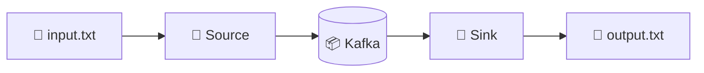
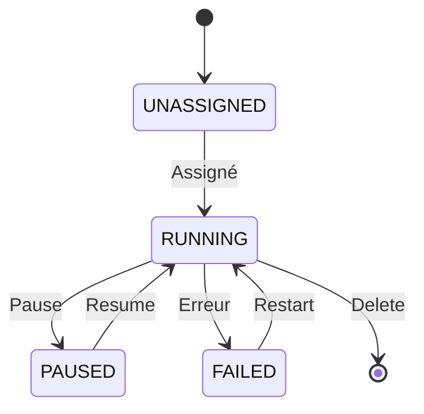

# 🛠️ Tutorial VS Code : Kafka Connect - Intégration de Données

## 📋 Vue d'ensemble

Ce tutorial vous guide pour configurer **Kafka Connect** avec :
- **Source Connector** : Fichier → Kafka
- **Sink Connector** : Kafka → Fichier
- **REST API** pour gérer les connecteurs
- **Mode Distributed** pour la production



---

## 🎯 Prérequis

| Outil | Version | Installation |
|-------|---------|--------------|
| **VS Code** | Latest | [code.visualstudio.com](https://code.visualstudio.com) |
| **Docker Desktop** | Latest | [docker.com](https://docker.com) |
| **REST Client** | Extension | `code --install-extension humao.rest-client` |

---

## 📁 Étape 1 : Structure du projet

```
module06-kafka-connect/
├── docker-compose.yml           # Infrastructure
├── connect/
│   ├── Dockerfile               # Image Connect personnalisée
│   └── plugins/                 # Connecteurs additionnels
├── config/
│   ├── source-file.json         # Config Source Connector
│   └── sink-file.json           # Config Sink Connector
├── data/
│   ├── input/                   # Fichiers source
│   └── output/                  # Fichiers destination
└── requests.http                # Tests API
```

---

## 🐳 Étape 2 : Docker Compose

### 2.1 Créer `docker-compose.yml`

```yaml
version: '3.8'

services:
  # ═══════════════════════════════════════════════════════════
  # ZOOKEEPER
  # ═══════════════════════════════════════════════════════════
  zookeeper:
    image: confluentinc/cp-zookeeper:7.5.0
    hostname: zookeeper
    container_name: zookeeper
    ports:
      - "2181:2181"
    environment:
      ZOOKEEPER_CLIENT_PORT: 2181
      ZOOKEEPER_TICK_TIME: 2000

  # ═══════════════════════════════════════════════════════════
  # KAFKA BROKER
  # ═══════════════════════════════════════════════════════════
  kafka:
    image: confluentinc/cp-kafka:7.5.0
    hostname: kafka
    container_name: kafka
    depends_on:
      - zookeeper
    ports:
      - "9092:9092"
      - "29092:29092"
    environment:
      KAFKA_BROKER_ID: 1
      KAFKA_ZOOKEEPER_CONNECT: zookeeper:2181
      KAFKA_LISTENER_SECURITY_PROTOCOL_MAP: PLAINTEXT:PLAINTEXT,PLAINTEXT_HOST:PLAINTEXT
      KAFKA_ADVERTISED_LISTENERS: PLAINTEXT://kafka:29092,PLAINTEXT_HOST://localhost:9092
      KAFKA_OFFSETS_TOPIC_REPLICATION_FACTOR: 1
      KAFKA_TRANSACTION_STATE_LOG_REPLICATION_FACTOR: 1
      KAFKA_TRANSACTION_STATE_LOG_MIN_ISR: 1

  # ═══════════════════════════════════════════════════════════
  # KAFKA CONNECT (Distributed Mode)
  # ═══════════════════════════════════════════════════════════
  connect:
    image: confluentinc/cp-kafka-connect:7.5.0
    hostname: connect
    container_name: connect
    depends_on:
      - kafka
    ports:
      - "8083:8083"
    environment:
      # Serveurs Kafka
      CONNECT_BOOTSTRAP_SERVERS: kafka:29092
      
      # Identifiant du cluster Connect
      CONNECT_GROUP_ID: connect-cluster
      
      # Topics internes pour stocker l'état
      CONNECT_CONFIG_STORAGE_TOPIC: connect-configs
      CONNECT_OFFSET_STORAGE_TOPIC: connect-offsets
      CONNECT_STATUS_STORAGE_TOPIC: connect-status
      
      # Replication factor (1 pour dev, 3 pour prod)
      CONNECT_CONFIG_STORAGE_REPLICATION_FACTOR: 1
      CONNECT_OFFSET_STORAGE_REPLICATION_FACTOR: 1
      CONNECT_STATUS_STORAGE_REPLICATION_FACTOR: 1
      
      # Convertisseurs par défaut
      CONNECT_KEY_CONVERTER: org.apache.kafka.connect.storage.StringConverter
      CONNECT_VALUE_CONVERTER: org.apache.kafka.connect.json.JsonConverter
      CONNECT_VALUE_CONVERTER_SCHEMAS_ENABLE: "false"
      
      # REST API
      CONNECT_REST_ADVERTISED_HOST_NAME: connect
      CONNECT_REST_PORT: 8083
      
      # Plugin path
      CONNECT_PLUGIN_PATH: /usr/share/java,/usr/share/confluent-hub-components
    volumes:
      - ./data:/data
    command:
      - bash
      - -c
      - |
        # Attendre que Kafka soit prêt
        echo "Waiting for Kafka..."
        cub kafka-ready -b kafka:29092 1 60
        
        # Démarrer Connect
        /etc/confluent/docker/run

  # ═══════════════════════════════════════════════════════════
  # KAFKA UI (optionnel)
  # ═══════════════════════════════════════════════════════════
  kafka-ui:
    image: provectuslabs/kafka-ui:latest
    container_name: kafka-ui
    depends_on:
      - kafka
      - connect
    ports:
      - "8080:8080"
    environment:
      KAFKA_CLUSTERS_0_NAME: local
      KAFKA_CLUSTERS_0_BOOTSTRAPSERVERS: kafka:29092
      KAFKA_CLUSTERS_0_KAFKACONNECT_0_NAME: connect
      KAFKA_CLUSTERS_0_KAFKACONNECT_0_ADDRESS: http://connect:8083
```

### 2.2 Concepts clés

| Composant | Rôle |
|-----------|------|
| **GROUP_ID** | Identifie le cluster Connect (pour coordination) |
| **CONFIG_STORAGE_TOPIC** | Stocke la configuration des connecteurs |
| **OFFSET_STORAGE_TOPIC** | Stocke les offsets des sources |
| **STATUS_STORAGE_TOPIC** | Stocke l'état des tâches |

---

## 📄 Étape 3 : Configuration des connecteurs

### 3.1 Créer `config/source-file.json`

```json
{
  "name": "file-source-connector",
  "config": {
    "connector.class": "org.apache.kafka.connect.file.FileStreamSourceConnector",
    "tasks.max": "1",
    "file": "/data/input/orders.txt",
    "topic": "file-orders",
    "key.converter": "org.apache.kafka.connect.storage.StringConverter",
    "value.converter": "org.apache.kafka.connect.storage.StringConverter"
  }
}
```

#### Explication des paramètres

| Paramètre | Description |
|-----------|-------------|
| `name` | Identifiant unique du connecteur |
| `connector.class` | Classe Java du connecteur |
| `tasks.max` | Nombre max de tâches parallèles |
| `file` | Chemin du fichier source (dans le container) |
| `topic` | Topic Kafka de destination |

### 3.2 Créer `config/sink-file.json`

```json
{
  "name": "file-sink-connector",
  "config": {
    "connector.class": "org.apache.kafka.connect.file.FileStreamSinkConnector",
    "tasks.max": "1",
    "file": "/data/output/orders-processed.txt",
    "topics": "file-orders",
    "key.converter": "org.apache.kafka.connect.storage.StringConverter",
    "value.converter": "org.apache.kafka.connect.storage.StringConverter"
  }
}
```

---

## 🧪 Étape 4 : Tests avec REST Client

### 4.1 Créer `requests.http`

```http
### Variables
@connectUrl = http://localhost:8083

### ═══════════════════════════════════════════════════════════════
### GET CONNECT INFO
### Vérifie que Kafka Connect est opérationnel
### ═══════════════════════════════════════════════════════════════
GET {{connectUrl}}/

### ═══════════════════════════════════════════════════════════════
### LIST CONNECTOR PLUGINS
### Affiche les plugins disponibles
### ═══════════════════════════════════════════════════════════════
GET {{connectUrl}}/connector-plugins

### ═══════════════════════════════════════════════════════════════
### LIST CONNECTORS
### Liste les connecteurs déployés
### ═══════════════════════════════════════════════════════════════
GET {{connectUrl}}/connectors

### ═══════════════════════════════════════════════════════════════
### CREATE SOURCE CONNECTOR
### Déploie le connecteur source (fichier → Kafka)
### ═══════════════════════════════════════════════════════════════
POST {{connectUrl}}/connectors
Content-Type: application/json

{
  "name": "file-source-connector",
  "config": {
    "connector.class": "org.apache.kafka.connect.file.FileStreamSourceConnector",
    "tasks.max": "1",
    "file": "/data/input/orders.txt",
    "topic": "file-orders",
    "key.converter": "org.apache.kafka.connect.storage.StringConverter",
    "value.converter": "org.apache.kafka.connect.storage.StringConverter"
  }
}

### ═══════════════════════════════════════════════════════════════
### CREATE SINK CONNECTOR
### Déploie le connecteur sink (Kafka → fichier)
### ═══════════════════════════════════════════════════════════════
POST {{connectUrl}}/connectors
Content-Type: application/json

{
  "name": "file-sink-connector",
  "config": {
    "connector.class": "org.apache.kafka.connect.file.FileStreamSinkConnector",
    "tasks.max": "1",
    "file": "/data/output/orders-processed.txt",
    "topics": "file-orders",
    "key.converter": "org.apache.kafka.connect.storage.StringConverter",
    "value.converter": "org.apache.kafka.connect.storage.StringConverter"
  }
}

### ═══════════════════════════════════════════════════════════════
### GET CONNECTOR STATUS
### Vérifie l'état d'un connecteur
### ═══════════════════════════════════════════════════════════════
GET {{connectUrl}}/connectors/file-source-connector/status

### ═══════════════════════════════════════════════════════════════
### GET CONNECTOR CONFIG
### Récupère la configuration d'un connecteur
### ═══════════════════════════════════════════════════════════════
GET {{connectUrl}}/connectors/file-source-connector/config

### ═══════════════════════════════════════════════════════════════
### PAUSE CONNECTOR
### Met en pause un connecteur
### ═══════════════════════════════════════════════════════════════
PUT {{connectUrl}}/connectors/file-source-connector/pause

### ═══════════════════════════════════════════════════════════════
### RESUME CONNECTOR
### Reprend un connecteur en pause
### ═══════════════════════════════════════════════════════════════
PUT {{connectUrl}}/connectors/file-source-connector/resume

### ═══════════════════════════════════════════════════════════════
### RESTART CONNECTOR
### Redémarre un connecteur
### ═══════════════════════════════════════════════════════════════
POST {{connectUrl}}/connectors/file-source-connector/restart

### ═══════════════════════════════════════════════════════════════
### DELETE CONNECTOR
### Supprime un connecteur
### ═══════════════════════════════════════════════════════════════
DELETE {{connectUrl}}/connectors/file-source-connector
```

---

## 🚀 Étape 5 : Exécution

### 5.1 Démarrer l'infrastructure

```powershell
# Créer les dossiers de données
mkdir -p data/input data/output

# Démarrer les services
docker-compose up -d

# Vérifier les logs
docker-compose logs -f connect
```

### 5.2 Attendre que Connect soit prêt

```powershell
# Vérifier l'état de Connect
curl http://localhost:8083/

# Attendu : {"version":"7.5.0-ccs","commit":"...","kafka_cluster_id":"..."}
```

### 5.3 Créer un fichier de test

```powershell
# Créer des données de test
echo "Order 1: Laptop - 999.99" >> data/input/orders.txt
echo "Order 2: Mouse - 29.99" >> data/input/orders.txt
echo "Order 3: Keyboard - 79.99" >> data/input/orders.txt
```

### 5.4 Déployer les connecteurs

```powershell
# Source connector
curl -X POST http://localhost:8083/connectors \
  -H "Content-Type: application/json" \
  -d '{
    "name": "file-source-connector",
    "config": {
      "connector.class": "org.apache.kafka.connect.file.FileStreamSourceConnector",
      "tasks.max": "1",
      "file": "/data/input/orders.txt",
      "topic": "file-orders"
    }
  }'

# Sink connector
curl -X POST http://localhost:8083/connectors \
  -H "Content-Type: application/json" \
  -d '{
    "name": "file-sink-connector",
    "config": {
      "connector.class": "org.apache.kafka.connect.file.FileStreamSinkConnector",
      "tasks.max": "1",
      "file": "/data/output/orders-processed.txt",
      "topics": "file-orders"
    }
  }'
```

### 5.5 Vérifier les résultats

```powershell
# Vérifier le topic
docker exec -it kafka kafka-console-consumer \
  --topic file-orders \
  --bootstrap-server localhost:9092 \
  --from-beginning

# Vérifier le fichier de sortie
cat data/output/orders-processed.txt

# Ajouter plus de données (streaming)
echo "Order 4: Monitor - 299.99" >> data/input/orders.txt
```

---

## 📊 Étape 6 : Monitoring avec Kafka UI

1. Ouvrir http://localhost:8080
2. Aller dans **Kafka Connect** → Voir les connecteurs
3. Aller dans **Topics** → `file-orders` → Voir les messages

---

## 🔧 Étape 7 : Connecteurs avancés (optionnel)

### 7.1 Installer des plugins additionnels

```dockerfile
# connect/Dockerfile
FROM confluentinc/cp-kafka-connect:7.5.0

# Installer le connecteur JDBC
RUN confluent-hub install --no-prompt confluentinc/kafka-connect-jdbc:10.7.4

# Installer le connecteur Elasticsearch
RUN confluent-hub install --no-prompt confluentinc/kafka-connect-elasticsearch:14.0.10

# Installer Debezium pour CDC
RUN confluent-hub install --no-prompt debezium/debezium-connector-mysql:2.4.0
```

### 7.2 Exemple : JDBC Source Connector

```json
{
  "name": "jdbc-source-connector",
  "config": {
    "connector.class": "io.confluent.connect.jdbc.JdbcSourceConnector",
    "connection.url": "jdbc:mysql://mysql:3306/mydb",
    "connection.user": "user",
    "connection.password": "password",
    "table.whitelist": "orders,products",
    "mode": "incrementing",
    "incrementing.column.name": "id",
    "topic.prefix": "db-",
    "poll.interval.ms": "1000"
  }
}
```

### 7.3 Modes de capture JDBC

| Mode | Description | Cas d'usage |
|------|-------------|-------------|
| **bulk** | Copie complète à chaque poll | Petites tables |
| **incrementing** | Nouvelles lignes seulement | INSERT only |
| **timestamp** | Lignes modifiées | INSERT + UPDATE |
| **timestamp+incrementing** | Combiné | Meilleure couverture |

---

## 📚 API REST Kafka Connect

### Endpoints principaux

| Méthode | Endpoint | Description |
|---------|----------|-------------|
| `GET` | `/connectors` | Liste des connecteurs |
| `POST` | `/connectors` | Créer un connecteur |
| `GET` | `/connectors/{name}` | Détails d'un connecteur |
| `GET` | `/connectors/{name}/status` | État du connecteur |
| `PUT` | `/connectors/{name}/config` | Modifier la config |
| `PUT` | `/connectors/{name}/pause` | Mettre en pause |
| `PUT` | `/connectors/{name}/resume` | Reprendre |
| `POST` | `/connectors/{name}/restart` | Redémarrer |
| `DELETE` | `/connectors/{name}` | Supprimer |

### États des connecteurs



---

## ✅ Checklist de validation

- [ ] Docker Compose avec Kafka + Connect + UI
- [ ] Connect démarre et répond sur :8083
- [ ] Source connector créé et RUNNING
- [ ] Sink connector créé et RUNNING
- [ ] Données copiées du fichier source au topic
- [ ] Données écrites du topic vers le fichier destination
- [ ] Streaming fonctionne (nouvelles lignes)
- [ ] Kafka UI montre les connecteurs

---

**🎉 Félicitations !** Vous maîtrisez Kafka Connect pour l'intégration de données !
