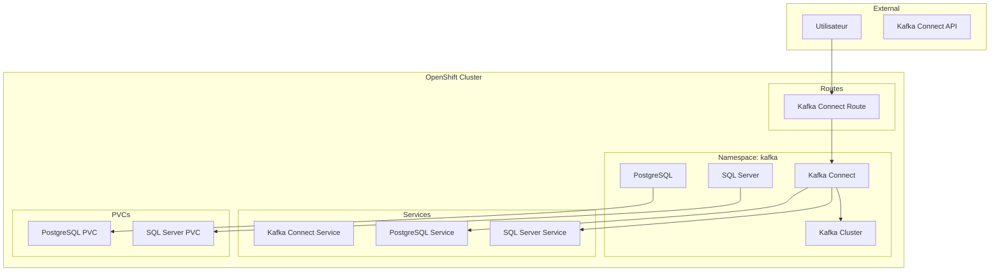

# 🏢 Scripts OpenShift - Module Kafka Connect

> Scripts pour le module Kafka Connect avec OpenShift/OKD sur Ubuntu

---

## 📋 Vue d'ensemble

Ce répertoire contient les scripts pour déployer et gérer l'environnement Kafka Connect avec PostgreSQL et SQL Server sur OpenShift, dans le cadre du module 6 de la formation BHF.

---

## 🎯 Objectifs Pédagogiques

- **Déployer Kafka Connect** sur OpenShift avec Strimzi
- **Configurer PostgreSQL** avec Helm Chart
- **Déployer SQL Server** sur OpenShift
- **Créer des connectors CDC** avec Debezium
- **Simuler des opérations bancaires** réelles
- **Monitorer les connectors** et les flux de données
- **Nettoyer l'environnement** proprement

---

## 🛠️ Prérequis

### OpenShift Cluster
```bash
# Cluster OpenShift/OKD/K3s opérationnel
oc login <cluster-url>
oc project kafka
```

### Namespace Kafka
```bash
# Créer le namespace si nécessaire
oc new-project kafka
```

### Kafka Cluster
```bash
# Cluster Kafka déployé avec Strimzi
oc get kafka -n kafka
oc get pods -n kafka -l strimzi.io/cluster=bhf-kafka
```

---

## 🚀 Scripts Disponibles

### 1. **Démarrage de l'environnement**
**Script**: `01-start-environment.sh`

| Action | Description |
|--------|-------------|
| **Déploie Kafka Connect** | Strimzi KafkaConnect avec Debezium |
| **Configure PostgreSQL** | Helm Chart Bitnami PostgreSQL |
| **Déploie SQL Server** | Conteneur SQL Server 2022 |
| **Expose les services** | Routes OpenShift pour Kafka Connect |

### 2. **Vérification PostgreSQL**
**Script**: `02-verify-postgresql.sh`

| Action | Description |
|--------|-------------|
| **Vérifie PostgreSQL** | Statut du pod et du service |
| **Configure la base** | Scripts SQL de configuration |
| **Test la connectivité** | Depuis Kafka Connect |
| **Active la réplication** | Configuration CDC PostgreSQL |

### 3. **Vérification SQL Server**
**Script**: `03-verify-sqlserver.sh`

| Action | Description |
|--------|-------------|
| **Vérifie SQL Server** | Statut du pod et du service |
| **Configure la base** | Scripts SQL de configuration |
| **Active le CDC** | Configuration CDC SQL Server |
| **Test la connectivité** | Depuis Kafka Connect |

### 4. **Création Connector PostgreSQL**
**Script**: `04-create-postgres-connector.sh`

| Action | Description |
|--------|-------------|
| **Crée le connector** | Debezium PostgreSQL Connector |
| **Configure les topics** | Topics Kafka pour les changements |
| **Test le connector** | Insertion de données de test |
| **Vérifie la propagation** | Messages dans les topics Kafka |

### 5. **Création Connector SQL Server**
**Script**: `05-create-sqlserver-connector.sh`

| Action | Description |
|--------|-------------|
| **Crée le connector** | Debezium SQL Server Connector |
| **Configure les topics** | Topics Kafka pour les changements |
| **Test le connector** | Insertion de données de test |
| **Vérifie la propagation** | Messages dans les topics Kafka |

### 6. **Simulation Opérations Bancaires**
**Script**: `06-simulate-banking-operations.sh`

| Action | Description |
|--------|-------------|
| **Génère des données** | Opérations bancaires aléatoires |
| **Insère dans PostgreSQL** | Comptes et transactions |
| **Insère dans SQL Server** | Comptes et transactions |
| **Vérifie la propagation** | Messages CDC dans Kafka |
| **Test la concurrence** | Opérations simultanées |

### 7. **Monitoring des Connectors**
**Script**: `07-monitor-connectors.sh`

| Action | Description |
|--------|-------------|
| **Statut des connectors** | État et configuration |
| **Statistiques des topics** | Messages et partitions |
| **Logs des connectors** | Erreurs et événements |
| **Métriques des bases** | Taille et nombre d'enregistrements |
| **Alertes et problèmes** | Détection d'anomalies |

### 8. **Nettoyage de l'environnement**
**Script**: `08-cleanup.sh`

| Action | Description |
|--------|-------------|
| **Supprime les connectors** | Kafka Connect connectors |
| **Nettoie les topics** | Topics Kafka CDC |
| **Supprime les déploiements** | PostgreSQL et SQL Server |
| **Nettoie les PVCs** | Volumes persistants |
| **Supprime les routes** | Routes OpenShift |

---

## 🎯 Parcours Pédagogique

### Étape 1: Démarrage
```bash
# Démarrer l'environnement complet
./01-start-environment.sh
```

### Étape 2: Vérification
```bash
# Vérifier PostgreSQL
./02-verify-postgresql.sh

# Vérifier SQL Server
./03-verify-sqlserver.sh
```

### Étape 3: Connectors
```bash
# Créer le connector PostgreSQL
./04-create-postgres-connector.sh

# Créer le connector SQL Server
./05-create-sqlserver-connector.sh
```

### Étape 4: Simulation
```bash
# Simuler des opérations bancaires
./06-simulate-banking-operations.sh
```

### Étape 5: Monitoring
```bash
# Monitorer les connectors
./07-monitor-connectors.sh
```

### Étape 6: Nettoyage
```bash
# Nettoyer l'environnement
./08-cleanup.sh
```

---

## 📊 Architecture OpenShift



---

## 🔧 Configuration Spécifique OpenShift

### Routes
```bash
# Route Kafka Connect
oc get route kafka-connect-banking -n kafka
# URL: http://kafka-connect-banking-kafka.apps.<cluster-domain>
```

### Services
```bash
# Services internes
oc get services -n kafka
# kafka-connect-banking-connect:8083
# postgres-banking-service:5432
# sqlserver-banking-service:1433
```

### PVCs
```bash
# Volumes persistants
oc get pvc -n kafka
# postgres-banking-postgresql-0
# sqlserver-banking-pvc
```

---

## 📋 Commandes Utiles

### Gestion OpenShift
```bash
# Login et projet
oc login <cluster-url>
oc project kafka

# Vérification des pods
oc get pods -n kafka
oc logs <pod-name> -n kafka

# Routes et services
oc get routes -n kafka
oc get services -n kafka
```

### Kafka Connect
```bash
# URL de l'API
CONNECT_URL=$(oc get route kafka-connect-banking -n kafka -o jsonpath='{.spec.host}')

# Connecteurs
curl http://${CONNECT_URL}/connectors
curl http://${CONNECT_URL}/connectors/<connector-name>/status
```

### Bases de données
```bash
# PostgreSQL
POSTGRES_POD=$(oc get pods -n kafka -l app.kubernetes.io/instance=postgres-banking -o jsonpath='{.items[0].metadata.name}')
oc exec $POSTGRES_POD -n kafka -- psql -U banking -d banking

# SQL Server
SQLSERVER_POD=$(oc get pods -n kafka -l app=sqlserver-banking -o jsonpath='{.items[0].metadata.name}')
oc exec $SQLSERVER_POD -n kafka -- bash -c "export PATH=\$PATH:/opt/mssql-tools/bin && sqlcmd -S localhost -U sa -P 'SqlServer123!'"
```

---

## 🚨 Dépannage

### Problèmes Communs

| Problème | Solution |
|----------|----------|
| **Route inaccessible** | Vérifier le statut de la route: `oc get route kafka-connect-banking -n kafka` |
| **Pods en erreur** | Vérifier les logs: `oc logs <pod-name> -n kafka` |
| **Connectors échouent** | Vérifier la connectivité réseau entre les services |
| **PVCs bloqués** | Supprimer manuellement les PVCs: `oc delete pvc <pvc-name> -n kafka` |

### Logs Utiles
```bash
# Logs Kafka Connect
CONNECT_POD=$(oc get pods -n kafka -l strimzi.io/kind=KafkaConnect -o jsonpath='{.items[0].metadata.name}')
oc logs $CONNECT_POD -n kafka -f

# Logs PostgreSQL
POSTGRES_POD=$(oc get pods -n kafka -l app.kubernetes.io/instance=postgres-banking -o jsonpath='{.items[0].metadata.name}')
oc logs $POSTGRES_POD -n kafka -f

# Logs SQL Server
SQLSERVER_POD=$(oc get pods -n kafka -l app=sqlserver-banking -o jsonpath='{.items[0].metadata.name}')
oc logs $SQLSERVER_POD -n kafka -f
```

---

## 📚 Ressources Additionnelles

### Documentation
- [OpenShift Documentation](https://docs.openshift.com/)
- [Strimzi Kafka Connect](https://strimzi.io/docs/operators/latest/full/html/#deploying-kafka-connect-str)
- [Debezium Connectors](https://debezium.io/documentation/connectors/)

### Monitoring
- [OpenShift Console](https://console-openshift-console.apps.<cluster-domain>)
- [Kafka Connect API](http://kafka-connect-banking-kafka.apps.<cluster-domain>)

---

## ✅ Checklist de Validation

### Avant de commencer
- [ ] Cluster OpenShift opérationnel
- [ ] Namespace kafka créé
- [ ] Cluster Kafka déployé
- [ ] Droits suffisants pour créer des ressources

### Après déploiement
- [ ] Kafka Connect accessible via route
- [ ] PostgreSQL prêt et configuré
- [ ] SQL Server prêt et configuré
- [ ] Connecteurs CDC créés
- [ ] Topics Kafka créés
- [ ] Messages CDC propagés

### Après nettoyage
- [ ] Connecteurs supprimés
- [ ] Topics CDC supprimés
- [ ] Déploiements supprimés
- [ ] PVCs supprimés
- [ ] Routes supprimées

---

## 🎯 Conclusion

Les scripts OpenShift pour le module Kafka Connect offrent une **expérience complète** de déploiement et de gestion de connectors CDC sur OpenShift, avec une **intégration parfaite** avec l'écosystème Strimzi et Debezium.

L'approche **pas-à-pas** permet aux apprenants de maîtriser:
- Le déploiement sur OpenShift
- La configuration de connectors CDC
- Le monitoring des flux de données
- Le nettoyage des ressources

C'est le complément parfait des scripts Docker et K8s_OKD existants !
