# 🛠️ Tutorial VS Code : Tests d'Applications Kafka

## 📋 Vue d'ensemble

Ce tutorial vous guide pour implémenter des tests Kafka avec :
- **Tests unitaires** avec MockProducer/MockConsumer
- **Tests d'intégration** avec Testcontainers
- **Tests de topologie** Kafka Streams

```mermaid
flowchart TB
    UNIT["✅ Unit Tests"] --- INT["🔗 Integration"] --- E2E["🌐 E2E"]
    style UNIT fill:#e8f5e9
```



---

## 🎯 Prérequis

| Outil | Version | Installation |
|-------|---------|--------------|
| **VS Code** | Latest | [code.visualstudio.com](https://code.visualstudio.com) |
| **Java JDK** | 17+ | `winget install Microsoft.OpenJDK.17` |
| **Maven** | 3.8+ | `winget install Apache.Maven` |
| **Docker Desktop** | Latest | Pour Testcontainers |

---

## 📁 Étape 1 : Structure du projet

```
module07-kafka-testing/
├── pom.xml
├── src/
│   ├── main/java/com/data2ai/kafka/
│   │   ├── producer/
│   │   │   └── OrderProducer.java
│   │   └── consumer/
│   │       └── OrderConsumer.java
│   └── test/java/com/data2ai/kafka/
│       ├── unit/
│       │   ├── MockProducerTest.java
│       │   └── MockConsumerTest.java
│       └── integration/
│           └── KafkaIntegrationTest.java
```

---

## 📝 Étape 2 : Configuration Maven

```xml
<?xml version="1.0" encoding="UTF-8"?>
<project xmlns="http://maven.apache.org/POM/4.0.0"
         xmlns:xsi="http://www.w3.org/2001/XMLSchema-instance"
         xsi:schemaLocation="http://maven.apache.org/POM/4.0.0 
         https://maven.apache.org/xsd/maven-4.0.0.xsd">
    <modelVersion>4.0.0</modelVersion>
    
    <groupId>com.data2ai.kafka</groupId>
    <artifactId>module07-kafka-testing</artifactId>
    <version>1.0.0</version>
    
    <properties>
        <java.version>17</java.version>
        <maven.compiler.source>17</maven.compiler.source>
        <maven.compiler.target>17</maven.compiler.target>
        <kafka.version>3.6.0</kafka.version>
        <junit.version>5.10.0</junit.version>
        <testcontainers.version>1.19.3</testcontainers.version>
    </properties>
    
    <dependencies>
        <!-- Kafka Client -->
        <dependency>
            <groupId>org.apache.kafka</groupId>
            <artifactId>kafka-clients</artifactId>
            <version>${kafka.version}</version>
        </dependency>
        
        <!-- ═══════════════════════════════════════════════════════
             TESTING DEPENDENCIES
             ═══════════════════════════════════════════════════════ -->
        
        <!-- JUnit 5 -->
        <dependency>
            <groupId>org.junit.jupiter</groupId>
            <artifactId>junit-jupiter</artifactId>
            <version>${junit.version}</version>
            <scope>test</scope>
        </dependency>
        
        <!-- AssertJ pour assertions fluides -->
        <dependency>
            <groupId>org.assertj</groupId>
            <artifactId>assertj-core</artifactId>
            <version>3.24.2</version>
            <scope>test</scope>
        </dependency>
        
        <!-- Testcontainers Kafka -->
        <dependency>
            <groupId>org.testcontainers</groupId>
            <artifactId>kafka</artifactId>
            <version>${testcontainers.version}</version>
            <scope>test</scope>
        </dependency>
        
        <!-- Testcontainers JUnit 5 -->
        <dependency>
            <groupId>org.testcontainers</groupId>
            <artifactId>junit-jupiter</artifactId>
            <version>${testcontainers.version}</version>
            <scope>test</scope>
        </dependency>
        
        <!-- SLF4J pour logs -->
        <dependency>
            <groupId>org.slf4j</groupId>
            <artifactId>slf4j-simple</artifactId>
            <version>2.0.9</version>
            <scope>test</scope>
        </dependency>
    </dependencies>
    
    <build>
        <plugins>
            <plugin>
                <groupId>org.apache.maven.plugins</groupId>
                <artifactId>maven-surefire-plugin</artifactId>
                <version>3.2.2</version>
            </plugin>
        </plugins>
    </build>
</project>
```

---

## 📤 Étape 3 : Code à tester

### 3.1 Créer `producer/OrderProducer.java`

```java
package com.data2ai.kafka.producer;

import org.apache.kafka.clients.producer.Producer;
import org.apache.kafka.clients.producer.ProducerRecord;
import org.apache.kafka.clients.producer.RecordMetadata;

import java.util.concurrent.Future;

/**
 * Producer Kafka injectable pour faciliter les tests.
 * 
 * Design Pattern : Injection de dépendance
 * Le Producer est injecté, permettant d'utiliser un MockProducer en test.
 */
public class OrderProducer {
    
    private final Producer<String, String> producer;
    private final String topic;

    public OrderProducer(Producer<String, String> producer, String topic) {
        this.producer = producer;
        this.topic = topic;
    }

    /**
     * Envoie une commande à Kafka.
     * 
     * @param orderId Identifiant de la commande (clé)
     * @param orderJson Contenu JSON de la commande (valeur)
     * @return Future contenant les métadonnées du record
     */
    public Future<RecordMetadata> send(String orderId, String orderJson) {
        ProducerRecord<String, String> record = new ProducerRecord<>(topic, orderId, orderJson);
        return producer.send(record);
    }

    /**
     * Envoie synchrone avec attente du résultat.
     */
    public RecordMetadata sendSync(String orderId, String orderJson) throws Exception {
        return send(orderId, orderJson).get();
    }

    public void close() {
        producer.close();
    }
}
```

### 3.2 Créer `consumer/OrderConsumer.java`

```java
package com.data2ai.kafka.consumer;

import org.apache.kafka.clients.consumer.Consumer;
import org.apache.kafka.clients.consumer.ConsumerRecord;
import org.apache.kafka.clients.consumer.ConsumerRecords;

import java.time.Duration;
import java.util.ArrayList;
import java.util.Collections;
import java.util.List;

/**
 * Consumer Kafka injectable pour faciliter les tests.
 */
public class OrderConsumer {
    
    private final Consumer<String, String> consumer;
    private final String topic;

    public OrderConsumer(Consumer<String, String> consumer, String topic) {
        this.consumer = consumer;
        this.topic = topic;
    }

    /**
     * S'abonne au topic.
     */
    public void subscribe() {
        consumer.subscribe(Collections.singletonList(topic));
    }

    /**
     * Poll les messages et les traite.
     * 
     * @param timeout Durée max d'attente
     * @return Liste des valeurs des messages traités
     */
    public List<String> pollAndProcess(Duration timeout) {
        List<String> processed = new ArrayList<>();
        
        ConsumerRecords<String, String> records = consumer.poll(timeout);
        
        for (ConsumerRecord<String, String> record : records) {
            // Traitement du message
            String value = processRecord(record);
            processed.add(value);
        }
        
        return processed;
    }

    /**
     * Traitement d'un record individuel.
     * Peut être surchargé pour des tests spécifiques.
     */
    protected String processRecord(ConsumerRecord<String, String> record) {
        System.out.println("Processing: key=" + record.key() + 
                          ", value=" + record.value() + 
                          ", partition=" + record.partition() + 
                          ", offset=" + record.offset());
        return record.value();
    }

    public void close() {
        consumer.close();
    }
}
```

---

## ✅ Étape 4 : Tests unitaires avec MockProducer

### 4.1 Créer `unit/MockProducerTest.java`

```java
package com.data2ai.kafka.unit;

import com.data2ai.kafka.producer.OrderProducer;
import org.apache.kafka.clients.producer.MockProducer;
import org.apache.kafka.clients.producer.ProducerRecord;
import org.apache.kafka.common.serialization.StringSerializer;
import org.junit.jupiter.api.AfterEach;
import org.junit.jupiter.api.BeforeEach;
import org.junit.jupiter.api.DisplayName;
import org.junit.jupiter.api.Test;

import java.util.List;

import static org.assertj.core.api.Assertions.assertThat;

/**
 * Tests unitaires du Producer avec MockProducer.
 * 
 * MockProducer simule un Producer Kafka sans connexion réelle.
 * Avantages :
 * - Rapide (pas de réseau)
 * - Déterministe (pas de latence)
 * - Contrôle total sur le comportement
 */
class MockProducerTest {

    private MockProducer<String, String> mockProducer;
    private OrderProducer orderProducer;
    private static final String TOPIC = "test-orders";

    @BeforeEach
    void setUp() {
        // ═══════════════════════════════════════════════════════
        // CRÉATION DU MOCK PRODUCER
        // autoComplete=true : Les sends sont complétés immédiatement
        // ═══════════════════════════════════════════════════════
        mockProducer = new MockProducer<>(
            true,                    // autoComplete
            new StringSerializer(),  // key serializer
            new StringSerializer()   // value serializer
        );
        
        orderProducer = new OrderProducer(mockProducer, TOPIC);
    }

    @AfterEach
    void tearDown() {
        orderProducer.close();
    }

    @Test
    @DisplayName("Should send order to correct topic with correct key/value")
    void shouldSendOrderSuccessfully() {
        // Arrange
        String orderId = "ORD-001";
        String orderJson = "{\"amount\": 99.99}";

        // Act
        orderProducer.send(orderId, orderJson);

        // Assert
        List<ProducerRecord<String, String>> history = mockProducer.history();
        
        assertThat(history).hasSize(1);
        assertThat(history.get(0).topic()).isEqualTo(TOPIC);
        assertThat(history.get(0).key()).isEqualTo(orderId);
        assertThat(history.get(0).value()).isEqualTo(orderJson);
    }

    @Test
    @DisplayName("Should send multiple orders in order")
    void shouldSendMultipleOrdersInOrder() {
        // Act
        orderProducer.send("ORD-001", "{\"amount\": 10}");
        orderProducer.send("ORD-002", "{\"amount\": 20}");
        orderProducer.send("ORD-003", "{\"amount\": 30}");

        // Assert
        List<ProducerRecord<String, String>> history = mockProducer.history();
        
        assertThat(history).hasSize(3);
        assertThat(history.get(0).key()).isEqualTo("ORD-001");
        assertThat(history.get(1).key()).isEqualTo("ORD-002");
        assertThat(history.get(2).key()).isEqualTo("ORD-003");
    }

    @Test
    @DisplayName("Should handle send failure")
    void shouldHandleSendFailure() {
        // ═══════════════════════════════════════════════════════
        // MOCK PRODUCER AVEC AUTO-COMPLETE DÉSACTIVÉ
        // Permet de simuler des erreurs manuellement
        // ═══════════════════════════════════════════════════════
        MockProducer<String, String> failingProducer = new MockProducer<>(
            false,                   // autoComplete = false
            new StringSerializer(),
            new StringSerializer()
        );
        
        OrderProducer producer = new OrderProducer(failingProducer, TOPIC);

        // Act
        var future = producer.send("ORD-FAIL", "{\"amount\": 0}");
        
        // Simuler une erreur
        RuntimeException error = new RuntimeException("Kafka unavailable");
        failingProducer.errorNext(error);

        // Assert
        assertThat(future).isCompletedExceptionally();
        
        producer.close();
    }

    @Test
    @DisplayName("Should complete send manually when autoComplete is false")
    void shouldCompleteManually() throws Exception {
        MockProducer<String, String> manualProducer = new MockProducer<>(
            false, new StringSerializer(), new StringSerializer()
        );
        
        OrderProducer producer = new OrderProducer(manualProducer, TOPIC);

        // Act
        var future = producer.send("ORD-MANUAL", "{\"test\": true}");
        
        // Le future n'est pas encore complété
        assertThat(future.isDone()).isFalse();
        
        // Compléter manuellement
        manualProducer.completeNext();
        
        // Maintenant il est complété
        assertThat(future.isDone()).isTrue();
        assertThat(future.get().topic()).isEqualTo(TOPIC);
        
        producer.close();
    }
}
```

---

## ✅ Étape 5 : Tests unitaires avec MockConsumer

### 5.1 Créer `unit/MockConsumerTest.java`

```java
package com.data2ai.kafka.unit;

import com.data2ai.kafka.consumer.OrderConsumer;
import org.apache.kafka.clients.consumer.ConsumerRecord;
import org.apache.kafka.clients.consumer.MockConsumer;
import org.apache.kafka.clients.consumer.OffsetResetStrategy;
import org.apache.kafka.common.TopicPartition;
import org.junit.jupiter.api.AfterEach;
import org.junit.jupiter.api.BeforeEach;
import org.junit.jupiter.api.DisplayName;
import org.junit.jupiter.api.Test;

import java.time.Duration;
import java.util.HashMap;
import java.util.List;
import java.util.Map;

import static org.assertj.core.api.Assertions.assertThat;

/**
 * Tests unitaires du Consumer avec MockConsumer.
 * 
 * MockConsumer simule un Consumer Kafka sans connexion réelle.
 * On peut injecter des records manuellement pour tester le traitement.
 */
class MockConsumerTest {

    private MockConsumer<String, String> mockConsumer;
    private OrderConsumer orderConsumer;
    private static final String TOPIC = "test-orders";
    private static final int PARTITION = 0;

    @BeforeEach
    void setUp() {
        // ═══════════════════════════════════════════════════════
        // CRÉATION DU MOCK CONSUMER
        // OffsetResetStrategy définit où commencer si pas d'offset
        // ═══════════════════════════════════════════════════════
        mockConsumer = new MockConsumer<>(OffsetResetStrategy.EARLIEST);
        orderConsumer = new OrderConsumer(mockConsumer, TOPIC);
        
        // ═══════════════════════════════════════════════════════
        // CONFIGURATION OBLIGATOIRE POUR MOCK CONSUMER
        // 1. Assigner les partitions
        // 2. Définir les offsets de début
        // ═══════════════════════════════════════════════════════
        TopicPartition partition = new TopicPartition(TOPIC, PARTITION);
        mockConsumer.assign(List.of(partition));
        
        Map<TopicPartition, Long> beginningOffsets = new HashMap<>();
        beginningOffsets.put(partition, 0L);
        mockConsumer.updateBeginningOffsets(beginningOffsets);
    }

    @AfterEach
    void tearDown() {
        orderConsumer.close();
    }

    @Test
    @DisplayName("Should process single message")
    void shouldProcessSingleMessage() {
        // Arrange - Ajouter un record au mock
        mockConsumer.addRecord(new ConsumerRecord<>(
            TOPIC,           // topic
            PARTITION,       // partition
            0L,              // offset
            "ORD-001",       // key
            "{\"amount\": 99.99}"  // value
        ));

        // Act
        List<String> processed = orderConsumer.pollAndProcess(Duration.ofMillis(100));

        // Assert
        assertThat(processed).hasSize(1);
        assertThat(processed.get(0)).contains("99.99");
    }

    @Test
    @DisplayName("Should process multiple messages in order")
    void shouldProcessMultipleMessagesInOrder() {
        // Arrange
        mockConsumer.addRecord(createRecord(0L, "ORD-001", "{\"seq\": 1}"));
        mockConsumer.addRecord(createRecord(1L, "ORD-002", "{\"seq\": 2}"));
        mockConsumer.addRecord(createRecord(2L, "ORD-003", "{\"seq\": 3}"));

        // Act
        List<String> processed = orderConsumer.pollAndProcess(Duration.ofMillis(100));

        // Assert
        assertThat(processed).hasSize(3);
        assertThat(processed.get(0)).contains("\"seq\": 1");
        assertThat(processed.get(1)).contains("\"seq\": 2");
        assertThat(processed.get(2)).contains("\"seq\": 3");
    }

    @Test
    @DisplayName("Should return empty list when no messages")
    void shouldReturnEmptyListWhenNoMessages() {
        // Act - Poll sans avoir ajouté de records
        List<String> processed = orderConsumer.pollAndProcess(Duration.ofMillis(100));

        // Assert
        assertThat(processed).isEmpty();
    }

    @Test
    @DisplayName("Should handle messages with null key")
    void shouldHandleMessagesWithNullKey() {
        // Arrange
        mockConsumer.addRecord(new ConsumerRecord<>(
            TOPIC, PARTITION, 0L, null, "{\"noKey\": true}"
        ));

        // Act
        List<String> processed = orderConsumer.pollAndProcess(Duration.ofMillis(100));

        // Assert
        assertThat(processed).hasSize(1);
        assertThat(processed.get(0)).contains("noKey");
    }

    // Helper method
    private ConsumerRecord<String, String> createRecord(long offset, String key, String value) {
        return new ConsumerRecord<>(TOPIC, PARTITION, offset, key, value);
    }
}
```

---

## 🔗 Étape 6 : Tests d'intégration avec Testcontainers

### 6.1 Créer `integration/KafkaIntegrationTest.java`

```java
package com.data2ai.kafka.integration;

import com.data2ai.kafka.consumer.OrderConsumer;
import com.data2ai.kafka.producer.OrderProducer;
import org.apache.kafka.clients.consumer.ConsumerConfig;
import org.apache.kafka.clients.consumer.KafkaConsumer;
import org.apache.kafka.clients.producer.KafkaProducer;
import org.apache.kafka.clients.producer.ProducerConfig;
import org.apache.kafka.common.serialization.StringDeserializer;
import org.apache.kafka.common.serialization.StringSerializer;
import org.junit.jupiter.api.*;
import org.testcontainers.containers.KafkaContainer;
import org.testcontainers.junit.jupiter.Container;
import org.testcontainers.junit.jupiter.Testcontainers;
import org.testcontainers.utility.DockerImageName;

import java.time.Duration;
import java.util.List;
import java.util.Properties;
import java.util.UUID;

import static org.assertj.core.api.Assertions.assertThat;

/**
 * Tests d'intégration avec un vrai Kafka via Testcontainers.
 * 
 * Testcontainers démarre automatiquement un container Docker Kafka
 * pour chaque classe de test. Avantages :
 * - Test avec un vrai broker Kafka
 * - Isolation complète entre tests
 * - Pas de dépendance sur un Kafka externe
 */
@Testcontainers
@TestMethodOrder(MethodOrderer.OrderAnnotation.class)
class KafkaIntegrationTest {

    // ═══════════════════════════════════════════════════════════
    // CONTAINER KAFKA
    // @Container démarre/arrête automatiquement le container
    // ═══════════════════════════════════════════════════════════
    @Container
    static KafkaContainer kafka = new KafkaContainer(
        DockerImageName.parse("confluentinc/cp-kafka:7.5.0")
    );

    private static final String TOPIC = "integration-test-orders";
    
    private OrderProducer producer;
    private OrderConsumer consumer;
    private KafkaProducer<String, String> kafkaProducer;
    private KafkaConsumer<String, String> kafkaConsumer;

    @BeforeEach
    void setUp() {
        // ═══════════════════════════════════════════════════════
        // CONFIGURATION PRODUCER
        // ═══════════════════════════════════════════════════════
        Properties producerProps = new Properties();
        producerProps.put(ProducerConfig.BOOTSTRAP_SERVERS_CONFIG, 
            kafka.getBootstrapServers());
        producerProps.put(ProducerConfig.KEY_SERIALIZER_CLASS_CONFIG, 
            StringSerializer.class.getName());
        producerProps.put(ProducerConfig.VALUE_SERIALIZER_CLASS_CONFIG, 
            StringSerializer.class.getName());
        
        kafkaProducer = new KafkaProducer<>(producerProps);
        producer = new OrderProducer(kafkaProducer, TOPIC);

        // ═══════════════════════════════════════════════════════
        // CONFIGURATION CONSUMER
        // Utiliser un group.id unique par test pour isolation
        // ═══════════════════════════════════════════════════════
        Properties consumerProps = new Properties();
        consumerProps.put(ConsumerConfig.BOOTSTRAP_SERVERS_CONFIG, 
            kafka.getBootstrapServers());
        consumerProps.put(ConsumerConfig.GROUP_ID_CONFIG, 
            "test-group-" + UUID.randomUUID());
        consumerProps.put(ConsumerConfig.KEY_DESERIALIZER_CLASS_CONFIG, 
            StringDeserializer.class.getName());
        consumerProps.put(ConsumerConfig.VALUE_DESERIALIZER_CLASS_CONFIG, 
            StringDeserializer.class.getName());
        consumerProps.put(ConsumerConfig.AUTO_OFFSET_RESET_CONFIG, "earliest");
        
        kafkaConsumer = new KafkaConsumer<>(consumerProps);
        consumer = new OrderConsumer(kafkaConsumer, TOPIC);
    }

    @AfterEach
    void tearDown() {
        if (producer != null) producer.close();
        if (consumer != null) consumer.close();
    }

    @Test
    @Order(1)
    @DisplayName("Kafka container should be running")
    void kafkaContainerShouldBeRunning() {
        assertThat(kafka.isRunning()).isTrue();
        System.out.println("Kafka bootstrap servers: " + kafka.getBootstrapServers());
    }

    @Test
    @Order(2)
    @DisplayName("Should produce and consume message end-to-end")
    void shouldProduceAndConsumeMessage() throws Exception {
        // Arrange
        String orderId = "ORD-INT-001";
        String orderJson = "{\"product\": \"Laptop\", \"amount\": 1299.99}";

        // Act - Produce
        var metadata = producer.sendSync(orderId, orderJson);
        System.out.println("Produced to partition " + metadata.partition() + 
                          " at offset " + metadata.offset());

        // Act - Consume
        consumer.subscribe();
        
        // Poll plusieurs fois car le consumer peut avoir besoin de temps
        List<String> processed = List.of();
        for (int i = 0; i < 10 && processed.isEmpty(); i++) {
            processed = consumer.pollAndProcess(Duration.ofMillis(500));
        }

        // Assert
        assertThat(processed).hasSize(1);
        assertThat(processed.get(0)).contains("Laptop");
        assertThat(processed.get(0)).contains("1299.99");
    }

    @Test
    @Order(3)
    @DisplayName("Should produce multiple messages and consume all")
    void shouldProduceAndConsumeMultipleMessages() throws Exception {
        // Arrange & Act - Produce 5 messages
        for (int i = 1; i <= 5; i++) {
            producer.sendSync("ORD-BATCH-" + i, "{\"seq\": " + i + "}");
        }

        // Act - Consume
        consumer.subscribe();
        
        List<String> allProcessed = new java.util.ArrayList<>();
        for (int attempt = 0; attempt < 20 && allProcessed.size() < 5; attempt++) {
            var batch = consumer.pollAndProcess(Duration.ofMillis(500));
            allProcessed.addAll(batch);
        }

        // Assert
        assertThat(allProcessed).hasSize(5);
    }

    @Test
    @Order(4)
    @DisplayName("Should handle message ordering within partition")
    void shouldMaintainOrderWithinPartition() throws Exception {
        // Arrange - Utiliser la même clé pour garantir la même partition
        String sameKey = "SAME-KEY";

        // Act - Produce
        producer.sendSync(sameKey, "{\"order\": 1}");
        producer.sendSync(sameKey, "{\"order\": 2}");
        producer.sendSync(sameKey, "{\"order\": 3}");

        // Act - Consume
        consumer.subscribe();
        
        List<String> processed = new java.util.ArrayList<>();
        for (int attempt = 0; attempt < 20 && processed.size() < 3; attempt++) {
            processed.addAll(consumer.pollAndProcess(Duration.ofMillis(500)));
        }

        // Assert - L'ordre doit être préservé
        assertThat(processed).hasSize(3);
        assertThat(processed.get(0)).contains("\"order\": 1");
        assertThat(processed.get(1)).contains("\"order\": 2");
        assertThat(processed.get(2)).contains("\"order\": 3");
    }
}
```

---

## 🚀 Étape 7 : Exécution des tests

### 7.1 Depuis VS Code

1. Ouvrir le fichier de test
2. Cliquer sur "Run Test" au-dessus de chaque méthode
3. Ou "Run All Tests" au-dessus de la classe

### 7.2 Depuis le terminal

```powershell
# Tous les tests
mvn test

# Tests unitaires uniquement
mvn test -Dtest="**/unit/*"

# Tests d'intégration uniquement
mvn test -Dtest="**/integration/*"

# Test spécifique
mvn test -Dtest="MockProducerTest#shouldSendOrderSuccessfully"
```

### 7.3 Voir les résultats

```powershell
# Rapport HTML
start target/surefire-reports/index.html
```

---

## � Note : Docker Compose pour tests E2E

Pour les tests end-to-end nécessitant une infrastructure Kafka complète :

```powershell
# Depuis la racine formation-v2/
cd infra

# Démarrer Kafka
docker-compose -f docker-compose.single-node.yml up -d

# Lancer les tests d'intégration
cd ../day-03-integration/module-07-testing
mvn test -Dtest="**/integration/*"

# Arrêter après les tests
cd ../infra
docker-compose -f docker-compose.single-node.yml down
```

> **Note :** Les tests Testcontainers démarrent automatiquement leur propre Kafka, aucune infrastructure externe n'est requise.

---

## �📊 Concepts de test Kafka

### Pyramide des tests

```mermaid
flowchart TB
    E2E["🌐 E2E<br/>Environnement complet<br/>Minutes"]
    INT["🔗 Integration<br/>Testcontainers<br/>Secondes"]
    UNIT["✅ Unit<br/>MockProducer/Consumer<br/>Millisecondes"]
    
    E2E --> INT --> UNIT
    
    style UNIT fill:#e8f5e9
    style INT fill:#fff3cd
    style E2E fill:#ffcccc
```



### Quand utiliser quoi

| Type | Quand | Outils |
|------|-------|--------|
| **Unit** | Logique de sérialisation, validation | MockProducer, MockConsumer |
| **Integration** | Interaction réelle avec Kafka | Testcontainers |
| **E2E** | Validation du système complet | Docker Compose |

---

## ✅ Checklist de validation

- [ ] Projet Maven avec dépendances test
- [ ] OrderProducer injectable créé
- [ ] OrderConsumer injectable créé
- [ ] Tests MockProducer passent
- [ ] Tests MockConsumer passent
- [ ] Tests Testcontainers passent
- [ ] `mvn test` réussit (tous les tests)

---

**🎉 Félicitations !** Vous maîtrisez les tests d'applications Kafka !
