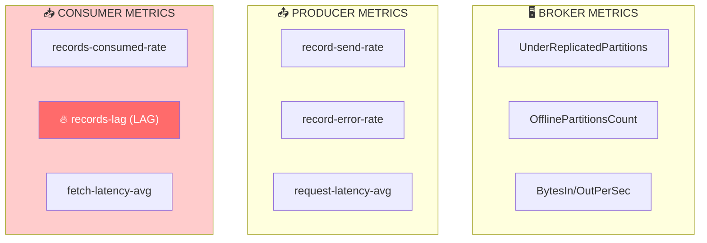
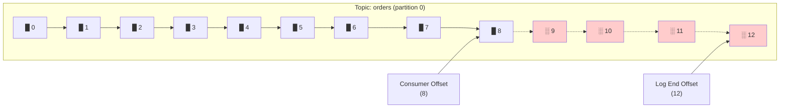
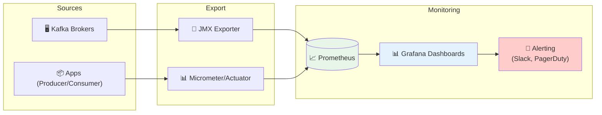
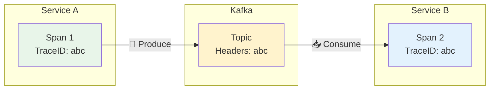

# 📊 Module 08 - Observabilité & Monitoring

| Durée | Niveau | Prérequis |
|-------|--------|-----------|
| 2 heures | Intermédiaire | Modules 01-07 complétés |

## 🎯 Objectifs d'apprentissage

À la fin de ce module, vous serez capable de :

- ✅ Collecter les métriques Kafka via JMX
- ✅ Monitorer le consumer lag
- ✅ Configurer des alertes
- ✅ Mettre en place le tracing distribué

---

## 📚 Partie Théorique (30%)

### 1. Métriques clés Kafka



---

### 2. Consumer Lag - La métrique critique



> **LAG = Log End Offset - Consumer Committed Offset = 4**

| LAG | Status |
|-----|--------|
| **= 0** | ✅ Parfait, consumer à jour |
| **< 100** | 🟡 Normal, légère latence |
| **> 1000** | ⚠️ Attention, consumer lent |
| **croissant** | 🔥 ALERTE, consumer ne suit pas |

#### Causes du lag élevé

| Cause | Symptôme | Solution |
|-------|----------|----------|
| Consumer lent | Lag croissant constant | Optimiser le traitement |
| Pas assez de consumers | Lag sur toutes partitions | Ajouter des consumers |
| Rebalancing fréquent | Pics de lag | Optimiser session.timeout |
| GC pauses | Lag intermittent | Tuner la JVM |

---

### 3. Architecture de monitoring



---

### 4. Tracing distribué



**Headers Kafka transportent le contexte de trace:**
```
traceparent: 00-abc123-def456-01
tracestate: vendor=value
```

---

## 🔌 Ports et Services

| Service | Port | Description |
|---------|------|-------------|
| Prometheus | 9090 | Métriques |
| Grafana | 3000 | Dashboards |
| JMX Exporter | 9404 | Export métriques Kafka |
| Jaeger | 16686 | Tracing UI |

---

## 🛠️ Partie Pratique (70%)

### Prérequis

```bash
cd formation-v2/
./scripts/up.sh
```

---

### Étape 1 - Démarrer le stack de monitoring

```bash
docker compose -f day-03-integration/module-08-observability/docker-compose.module.yml up -d
```

**Vérification** :

```bash
# Prometheus
curl -s http://localhost:9090/-/healthy

# Grafana
curl -s http://localhost:3000/api/health
```

---

### Étape 2 - Lab 1 : Explorer les métriques Kafka

#### 2.1 Via Kafka CLI

```bash
# Consumer lag pour un groupe
docker exec kafka kafka-consumer-groups \
  --describe \
  --group orders-consumer-group \
  --bootstrap-server localhost:9092
```

**Résultat attendu** :

```
GROUP                TOPIC      PARTITION  CURRENT-OFFSET  LOG-END-OFFSET  LAG
orders-consumer-group orders    0          100             105             5
orders-consumer-group orders    1          200             200             0
```

#### 2.2 Via JMX

```bash
# Lister les MBeans Kafka
docker exec kafka kafka-run-class kafka.tools.JmxTool \
  --jmx-url service:jmx:rmi:///jndi/rmi://localhost:9999/jmxrmi \
  --object-name 'kafka.server:type=BrokerTopicMetrics,name=*'
```

---

### Étape 3 - Lab 2 : Configurer Prometheus

#### 3.1 Vérifier les targets

Ouvrez http://localhost:9090/targets

**Targets attendus** :
- `kafka-jmx-exporter` : UP
- `kafka-ui` : UP (si configuré)

#### 3.2 Exécuter des requêtes PromQL

```promql
# Messages produits par seconde
rate(kafka_server_brokertopicmetrics_messagesin_total[5m])

# Consumer lag
kafka_consumer_consumer_fetch_manager_metrics_records_lag

# Bytes in/out
rate(kafka_server_brokertopicmetrics_bytesin_total[5m])
```

---

### Étape 4 - Lab 3 : Dashboard Grafana

#### 4.1 Accéder à Grafana

1. Ouvrez http://localhost:3000
2. Login: `admin` / `admin`
3. Changez le mot de passe si demandé

#### 4.2 Importer un dashboard

1. Cliquez sur **+** → **Import**
2. Entrez l'ID du dashboard Kafka : `7589`
3. Sélectionnez la datasource Prometheus
4. Cliquez sur **Import**

#### 4.3 Explorer les métriques

- **Throughput** : Messages/sec, Bytes/sec
- **Latency** : Request latency percentiles
- **Consumer Lag** : Par topic et partition
- **Resources** : CPU, Memory, Disk

---

### Étape 5 - Lab 4 : Simuler du lag et observer

#### 5.1 Créer du lag artificiellement

```bash
# Produire beaucoup de messages
for i in {1..1000}; do
  echo "message-$i" | docker exec -i kafka kafka-console-producer \
    --topic test-lag \
    --bootstrap-server localhost:9092
done
```

#### 5.2 Observer le lag dans Grafana

1. Allez sur le dashboard Kafka
2. Trouvez le panel "Consumer Lag"
3. Observez le lag augmenter puis diminuer quand le consumer rattrape

---

### Étape 6 - Lab 5 : Configurer une alerte

#### 6.1 Créer une règle d'alerte dans Grafana

1. Allez dans **Alerting** → **Alert rules**
2. Cliquez sur **New alert rule**
3. Configurez :
   - **Name** : High Consumer Lag
   - **Query** : `kafka_consumergroup_lag > 1000`
   - **Condition** : Is above 1000
   - **Evaluation** : Every 1m for 5m
4. Sauvegardez

#### 6.2 Tester l'alerte

Reproduisez du lag et vérifiez que l'alerte se déclenche.

---

## ✅ Checkpoint de validation

- [ ] Stack de monitoring démarré
- [ ] Métriques Kafka visibles dans Prometheus
- [ ] Dashboard Grafana importé et fonctionnel
- [ ] Consumer lag visible et compris
- [ ] Alerte configurée et testée

---

## 🔧 Troubleshooting

### Prometheus ne collecte pas les métriques

```bash
# Vérifier JMX Exporter
curl -s http://localhost:9404/metrics | head -20
```

### Grafana ne montre pas de données

1. Vérifiez la datasource Prometheus
2. Testez une requête simple : `up`
3. Vérifiez les time ranges

---

## 🧹 Nettoyage

```bash
docker compose -f day-03-integration/module-08-observability/docker-compose.module.yml down -v
```

---

## 📖 Pour aller plus loin

### Exercices supplémentaires

1. **Configurez des alertes Slack** via Grafana
2. **Ajoutez le tracing** avec Jaeger
3. **Créez un dashboard custom** pour votre application

### Ressources

- [Kafka Monitoring Documentation](https://kafka.apache.org/documentation/#monitoring)
- [Prometheus + Kafka](https://prometheus.io/docs/instrumenting/exporters/)
- [Grafana Kafka Dashboards](https://grafana.com/grafana/dashboards/)
