# 📊 Module 08 - Observabilité & Monitoring

| Durée | Niveau | Prérequis |
|-------|--------|-----------|
| 2 heures | Intermédiaire | Modules 01-07 complétés |

## 🎯 Objectifs d'apprentissage

À la fin de ce module, vous serez capable de :

- ✅ Collecter les métriques Kafka via JMX
- ✅ Monitorer le consumer lag
- ✅ Configurer des alertes
- ✅ Mettre en place le tracing distribué

---

## 📚 Partie Théorique (30%)

### 1. Métriques clés Kafka

```mermaid
flowchart LR
    B["🖥️ Broker"] --- P["📤 Producer"] --- C["📥 Consumer"]
    C --> LAG["🔥 LAG"]
    style LAG fill:#ff6b6b,color:#fff
```



---

### 2. Consumer Lag - La métrique critique

```mermaid
flowchart LR
    subgraph lag["LAG = 4"]
        CO["Consumer: 8"] -.->|"🔥 LAG"| LEO["Log End: 12"]
    end
    style lag fill:#ffcccc
```



> **LAG = Log End Offset - Consumer Committed Offset = 4**

| LAG | Status |
|-----|--------|
| **= 0** | ✅ Parfait, consumer à jour |
| **< 100** | 🟡 Normal, légère latence |
| **> 1000** | ⚠️ Attention, consumer lent |
| **croissant** | 🔥 ALERTE, consumer ne suit pas |

#### Causes du lag élevé

| Cause | Symptôme | Solution |
|-------|----------|----------|
| Consumer lent | Lag croissant constant | Optimiser le traitement |
| Pas assez de consumers | Lag sur toutes partitions | Ajouter des consumers |
| Rebalancing fréquent | Pics de lag | Optimiser session.timeout |
| GC pauses | Lag intermittent | Tuner la JVM |

---

### 3. Architecture de monitoring

```mermaid
flowchart LR
    K["🖥️ Kafka"] --> JMX["🔌 JMX"] --> PROM[("📈 Prometheus")] --> GRAF["📊 Grafana"] --> ALERT["🚨 Alert"]
    style PROM fill:#e8f5e9
```



---

### 4. Traçage distribué

Le traçage distribué permet de suivre une requête à travers plusieurs services et topics Kafka.

```mermaid
flowchart LR
    subgraph Trace["🔗 Trace ID: abc-123"]
        SA["🔵 Service A<br/>Span 1"] -->|"📨 order.created"| K1["📦 Kafka"]
        K1 -->|"📥"| SB["🟢 Service B<br/>Span 2"]
        SB -->|"📨 payment.requested"| K2["📦 Kafka"]
        K2 -->|"📥"| SC["🟠 Service C<br/>Span 3"]
    end
    
    style SA fill:#e3f2fd
    style SB fill:#e8f5e9
    style SC fill:#fff3e0
```



#### Propagation du contexte

Les **headers Kafka** transportent le contexte de trace selon le standard W3C Trace Context :

```text
┌─────────────────────────────────────────────────────────────┐
│  Headers Kafka                                              │
├─────────────────────────────────────────────────────────────┤
│  traceparent: 00-0af7651916cd43dd8448eb211c80319c-b7ad6b...│
│  tracestate: vendor=value                                   │
│  correlation-id: order-12345                                │
│  causation-id: event-67890                                  │
└─────────────────────────────────────────────────────────────┘
```

| Header | Format | Description |
|--------|--------|-------------|
| **traceparent** | `version-traceid-spanid-flags` | Identifiant W3C standard |
| **tracestate** | `vendor=value` | Métadonnées vendor-specific |
| **correlation-id** | UUID | ID de corrélation métier |
| **causation-id** | UUID | ID de l'événement parent |

#### Corrélation des événements

```mermaid
flowchart TB
    subgraph Correlation["📊 Corrélation des événements"]
        E1["🛒 OrderCreated<br/>correlation: order-123<br/>causation: null"]
        E2["💳 PaymentRequested<br/>correlation: order-123<br/>causation: order-created-1"]
        E3["📦 ShipmentCreated<br/>correlation: order-123<br/>causation: payment-completed-2"]
    end
    
    E1 -->|"cause"| E2 -->|"cause"| E3
```



#### Implémentation Java avec OpenTelemetry

```java
// Producer - Injection du contexte
@Autowired
private Tracer tracer;

public void send(String topic, String key, String value) {
    Span span = tracer.spanBuilder("kafka-produce")
        .setSpanKind(SpanKind.PRODUCER)
        .startSpan();
    
    try (Scope scope = span.makeCurrent()) {
        ProducerRecord<String, String> record = new ProducerRecord<>(topic, key, value);
        
        // Injecter le contexte dans les headers
        Context context = Context.current();
        GlobalOpenTelemetry.getPropagators().getTextMapPropagator()
            .inject(context, record.headers(), (headers, k, v) -> 
                headers.add(k, v.getBytes()));
        
        producer.send(record);
    } finally {
        span.end();
    }
}
```

```java
// Consumer - Extraction du contexte
public void consume(ConsumerRecord<String, String> record) {
    // Extraire le contexte des headers
    Context extractedContext = GlobalOpenTelemetry.getPropagators()
        .getTextMapPropagator()
        .extract(Context.current(), record.headers(), 
            (headers, key) -> {
                Header h = headers.lastHeader(key);
                return h != null ? new String(h.value()) : null;
            });
    
    Span span = tracer.spanBuilder("kafka-consume")
        .setSpanKind(SpanKind.CONSUMER)
        .setParent(extractedContext)
        .startSpan();
    
    try (Scope scope = span.makeCurrent()) {
        // Traitement du message
        processMessage(record);
    } finally {
        span.end();
    }
}
```

#### Visualisation dans Jaeger

```mermaid
gantt
    title Trace Timeline - Order Processing
    dateFormat X
    axisFormat %s
    
    section Service A
    OrderCreated (50ms)     :a1, 0, 50
    
    section Kafka
    Produce (5ms)           :k1, 50, 55
    Consume (5ms)           :k2, 55, 60
    
    section Service B
    PaymentProcess (100ms)  :b1, 60, 160
    
    section Service C
    ShipmentCreate (30ms)   :c1, 160, 190
```



---

## 🔌 Ports et Services

| Service | Port | Description |
|---------|------|-------------|
| Prometheus | 9090 | Métriques |
| Grafana | 3000 | Dashboards |
| JMX Exporter | 9404 | Export métriques Kafka |
| Jaeger | 16686 | Tracing UI |

---

## 🛠️ Partie Pratique (70%)

### Prérequis

<details>
<summary>🐳 <b>Mode Docker</b></summary>

```bash
cd formation-v2/
./scripts/up.sh
```

</details>

<details>
<summary>☸️ <b>Mode OKD/K3s</b></summary>

```bash
# Vérifier que le cluster Kafka est prêt
kubectl get kafka -n kafka
kubectl get pods -n kafka -l strimzi.io/cluster=bhf-kafka

# Vérifier les métriques JMX exposées par Strimzi
kubectl get pods -n kafka -l strimzi.io/kind=Kafka -o jsonpath='{.items[*].metadata.name}'
```

</details>

---

### Étape 1 - Démarrer le stack de monitoring

<details>
<summary>🐳 <b>Mode Docker</b></summary>

```bash
docker compose -f day-03-integration/module-08-observability/docker-compose.module.yml up -d
```

**Vérification** :

```bash
# Prometheus
curl -s http://localhost:9090/-/healthy

# Grafana
curl -s http://localhost:3000/api/health
```

</details>

<details>
<summary>☸️ <b>Mode OKD/K3s</b></summary>

```bash
# Déployer Prometheus et Grafana via Helm
helm repo add prometheus-community https://prometheus-community.github.io/helm-charts
helm repo update

# Installer kube-prometheus-stack
helm install prometheus prometheus-community/kube-prometheus-stack \
  --namespace monitoring --create-namespace \
  --set prometheus.prometheusSpec.serviceMonitorSelectorNilUsesHelmValues=false

# Vérifier le déploiement
kubectl get pods -n monitoring
```

**Accès** :

```bash
# Prometheus (port-forward)
kubectl port-forward -n monitoring svc/prometheus-kube-prometheus-prometheus 9090:9090

# Grafana (port-forward)
kubectl port-forward -n monitoring svc/prometheus-grafana 3000:80
# Login: admin / prom-operator
```

> **Note** : Strimzi expose automatiquement les métriques JMX via PodMonitor CRs.

</details>

---

### Étape 2 - Lab 1 : Explorer les métriques Kafka

#### 2.1 Via Kafka CLI

```bash
# Consumer lag pour un groupe
docker exec kafka kafka-consumer-groups \
  --describe \
  --group orders-consumer-group \
  --bootstrap-server localhost:9092
```

**Résultat attendu** :

```
GROUP                TOPIC      PARTITION  CURRENT-OFFSET  LOG-END-OFFSET  LAG
orders-consumer-group orders    0          100             105             5
orders-consumer-group orders    1          200             200             0
```

#### 2.2 Via JMX

```bash
# Lister les MBeans Kafka
docker exec kafka kafka-run-class kafka.tools.JmxTool \
  --jmx-url service:jmx:rmi:///jndi/rmi://localhost:9999/jmxrmi \
  --object-name 'kafka.server:type=BrokerTopicMetrics,name=*'
```

---

### Étape 3 - Lab 2 : Configurer Prometheus

#### 3.1 Vérifier les targets

Ouvrez http://localhost:9090/targets

**Targets attendus** :
- `kafka-jmx-exporter` : UP
- `kafka-ui` : UP (si configuré)

#### 3.2 Exécuter des requêtes PromQL

```promql
# Messages produits par seconde
rate(kafka_server_brokertopicmetrics_messagesin_total[5m])

# Consumer lag
kafka_consumer_consumer_fetch_manager_metrics_records_lag

# Bytes in/out
rate(kafka_server_brokertopicmetrics_bytesin_total[5m])
```

---

### Étape 4 - Lab 3 : Dashboard Grafana

#### 4.1 Accéder à Grafana

1. Ouvrez http://localhost:3000
2. Login: `admin` / `admin`
3. Changez le mot de passe si demandé

#### 4.2 Importer un dashboard

1. Cliquez sur **+** → **Import**
2. Entrez l'ID du dashboard Kafka : `7589`
3. Sélectionnez la datasource Prometheus
4. Cliquez sur **Import**

#### 4.3 Explorer les métriques

- **Throughput** : Messages/sec, Bytes/sec
- **Latency** : Request latency percentiles
- **Consumer Lag** : Par topic et partition
- **Resources** : CPU, Memory, Disk

---

### Étape 5 - Lab 4 : Simuler du lag et observer

#### 5.1 Créer du lag artificiellement

```bash
# Produire beaucoup de messages
for i in {1..1000}; do
  echo "message-$i" | docker exec -i kafka kafka-console-producer \
    --topic test-lag \
    --bootstrap-server localhost:9092
done
```

#### 5.2 Observer le lag dans Grafana

1. Allez sur le dashboard Kafka
2. Trouvez le panel "Consumer Lag"
3. Observez le lag augmenter puis diminuer quand le consumer rattrape

---

### Étape 6 - Lab 5 : Configurer une alerte

#### 6.1 Créer une règle d'alerte dans Grafana

1. Allez dans **Alerting** → **Alert rules**
2. Cliquez sur **New alert rule**
3. Configurez :
   - **Name** : High Consumer Lag
   - **Query** : `kafka_consumergroup_lag > 1000`
   - **Condition** : Is above 1000
   - **Evaluation** : Every 1m for 5m
4. Sauvegardez

#### 6.2 Tester l'alerte

Reproduisez du lag et vérifiez que l'alerte se déclenche.

---

## ✅ Checkpoint de validation

- [ ] Stack de monitoring démarré
- [ ] Métriques Kafka visibles dans Prometheus
- [ ] Dashboard Grafana importé et fonctionnel
- [ ] Consumer lag visible et compris
- [ ] Alerte configurée et testée

---

## 🔧 Troubleshooting

### Prometheus ne collecte pas les métriques

```bash
# Vérifier JMX Exporter
curl -s http://localhost:9404/metrics | head -20
```

### Grafana ne montre pas de données

1. Vérifiez la datasource Prometheus
2. Testez une requête simple : `up`
3. Vérifiez les time ranges

---

## 🧹 Nettoyage

```bash
docker compose -f day-03-integration/module-08-observability/docker-compose.module.yml down -v
```

---

## 📖 Pour aller plus loin

### Exercices supplémentaires

1. **Configurez des alertes Slack** via Grafana
2. **Ajoutez le tracing** avec Jaeger
3. **Créez un dashboard custom** pour votre application

### Ressources

- [Kafka Monitoring Documentation](https://kafka.apache.org/documentation/#monitoring)
- [Prometheus + Kafka](https://prometheus.io/docs/instrumenting/exporters/)
- [Grafana Kafka Dashboards](https://grafana.com/grafana/dashboards/)
