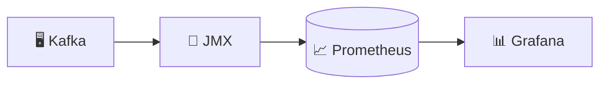
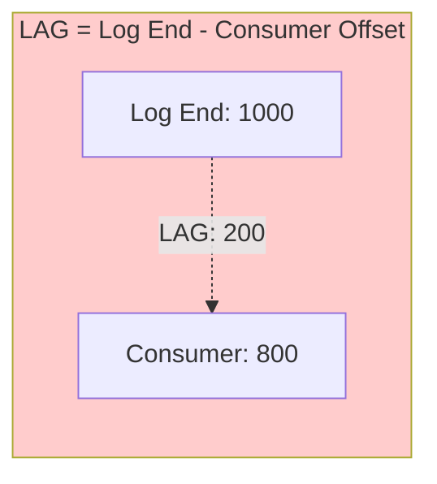

# 🛠️ Tutorial VS Code : Observabilité & Monitoring Kafka

## 📋 Vue d'ensemble

Ce tutorial vous guide pour mettre en place le monitoring Kafka avec :
- **JMX Exporter** pour exposer les métriques Kafka
- **Prometheus** pour collecter et stocker les métriques
- **Grafana** pour visualiser les dashboards
- **Consumer Lag** monitoring



---

## 🎯 Prérequis

| Outil | Version | Installation |
|-------|---------|--------------|
| **VS Code** | Latest | [code.visualstudio.com](https://code.visualstudio.com) |
| **Docker Desktop** | Latest | [docker.com](https://docker.com) |

---

## 📁 Étape 1 : Structure du projet

```
module08-observability/
├── docker-compose.yml
├── prometheus/
│   └── prometheus.yml
├── grafana/
│   ├── provisioning/
│   │   ├── dashboards/
│   │   │   ├── dashboard.yml
│   │   │   └── kafka-overview.json
│   │   └── datasources/
│   │       └── datasource.yml
├── jmx-exporter/
│   └── kafka-config.yml
└── alertmanager/
    └── alertmanager.yml
```

---

## 🐳 Étape 2 : Docker Compose

### 2.1 Créer `docker-compose.yml`

```yaml
version: '3.8'

services:
  # ═══════════════════════════════════════════════════════════
  # ZOOKEEPER
  # ═══════════════════════════════════════════════════════════
  zookeeper:
    image: confluentinc/cp-zookeeper:7.5.0
    container_name: zookeeper
    ports:
      - "2181:2181"
    environment:
      ZOOKEEPER_CLIENT_PORT: 2181

  # ═══════════════════════════════════════════════════════════
  # KAFKA avec JMX EXPORTER
  # ═══════════════════════════════════════════════════════════
  kafka:
    image: confluentinc/cp-kafka:7.5.0
    container_name: kafka
    depends_on:
      - zookeeper
    ports:
      - "9092:9092"
      - "29092:29092"
      - "9404:9404"  # JMX Exporter
    environment:
      KAFKA_BROKER_ID: 1
      KAFKA_ZOOKEEPER_CONNECT: zookeeper:2181
      KAFKA_LISTENER_SECURITY_PROTOCOL_MAP: PLAINTEXT:PLAINTEXT,PLAINTEXT_HOST:PLAINTEXT
      KAFKA_ADVERTISED_LISTENERS: PLAINTEXT://kafka:29092,PLAINTEXT_HOST://localhost:9092
      KAFKA_OFFSETS_TOPIC_REPLICATION_FACTOR: 1
      
      # ═══════════════════════════════════════════════════════
      # JMX CONFIGURATION
      # ═══════════════════════════════════════════════════════
      KAFKA_JMX_PORT: 9999
      KAFKA_JMX_HOSTNAME: kafka
      
      # JMX Exporter (agent Java)
      KAFKA_OPTS: "-javaagent:/opt/jmx-exporter/jmx_prometheus_javaagent.jar=9404:/opt/jmx-exporter/kafka-config.yml"
    volumes:
      - ./jmx-exporter:/opt/jmx-exporter

  # ═══════════════════════════════════════════════════════════
  # JMX EXPORTER INIT (download jar)
  # ═══════════════════════════════════════════════════════════
  jmx-exporter-init:
    image: curlimages/curl:latest
    container_name: jmx-exporter-init
    volumes:
      - ./jmx-exporter:/opt/jmx-exporter
    command: >
      sh -c "
        if [ ! -f /opt/jmx-exporter/jmx_prometheus_javaagent.jar ]; then
          curl -L -o /opt/jmx-exporter/jmx_prometheus_javaagent.jar 
            https://repo1.maven.org/maven2/io/prometheus/jmx/jmx_prometheus_javaagent/0.19.0/jmx_prometheus_javaagent-0.19.0.jar
        fi
      "

  # ═══════════════════════════════════════════════════════════
  # PROMETHEUS
  # Collecte et stocke les métriques
  # ═══════════════════════════════════════════════════════════
  prometheus:
    image: prom/prometheus:v2.47.0
    container_name: prometheus
    ports:
      - "9090:9090"
    volumes:
      - ./prometheus/prometheus.yml:/etc/prometheus/prometheus.yml
      - prometheus-data:/prometheus
    command:
      - '--config.file=/etc/prometheus/prometheus.yml'
      - '--storage.tsdb.path=/prometheus'
      - '--web.enable-lifecycle'

  # ═══════════════════════════════════════════════════════════
  # GRAFANA
  # Visualisation des dashboards
  # ═══════════════════════════════════════════════════════════
  grafana:
    image: grafana/grafana:10.2.0
    container_name: grafana
    ports:
      - "3000:3000"
    environment:
      GF_SECURITY_ADMIN_USER: admin
      GF_SECURITY_ADMIN_PASSWORD: admin
      GF_USERS_ALLOW_SIGN_UP: "false"
    volumes:
      - ./grafana/provisioning:/etc/grafana/provisioning
      - grafana-data:/var/lib/grafana
    depends_on:
      - prometheus

  # ═══════════════════════════════════════════════════════════
  # KAFKA EXPORTER (métriques consumer lag)
  # ═══════════════════════════════════════════════════════════
  kafka-exporter:
    image: danielqsj/kafka-exporter:latest
    container_name: kafka-exporter
    ports:
      - "9308:9308"
    command:
      - '--kafka.server=kafka:29092'
      - '--topic.filter=.*'
      - '--group.filter=.*'
    depends_on:
      - kafka

volumes:
  prometheus-data:
  grafana-data:
```

---

## ⚙️ Étape 3 : Configuration JMX Exporter

### 3.1 Créer `jmx-exporter/kafka-config.yml`

```yaml
# ═══════════════════════════════════════════════════════════════
# JMX EXPORTER CONFIGURATION
# Transforme les MBeans JMX en métriques Prometheus
# ═══════════════════════════════════════════════════════════════

lowercaseOutputName: true
lowercaseOutputLabelNames: true

rules:
  # ─────────────────────────────────────────────────────────────
  # BROKER METRICS
  # ─────────────────────────────────────────────────────────────
  
  # Messages in/out per second
  - pattern: kafka.server<type=BrokerTopicMetrics, name=(.+), topic=(.+)><>Count
    name: kafka_server_brokertopicmetrics_$1_total
    type: COUNTER
    labels:
      topic: "$2"

  # Bytes in/out per second
  - pattern: kafka.server<type=BrokerTopicMetrics, name=(.+)PerSec><>Count
    name: kafka_server_brokertopicmetrics_$1_total
    type: COUNTER

  # Under replicated partitions (CRITICAL)
  - pattern: kafka.server<type=ReplicaManager, name=UnderReplicatedPartitions><>Value
    name: kafka_server_replicamanager_underreplicatedpartitions
    type: GAUGE

  # Offline partitions count (CRITICAL)
  - pattern: kafka.controller<type=KafkaController, name=OfflinePartitionsCount><>Value
    name: kafka_controller_offlinepartitionscount
    type: GAUGE

  # Active controller count
  - pattern: kafka.controller<type=KafkaController, name=ActiveControllerCount><>Value
    name: kafka_controller_activecontrollercount
    type: GAUGE

  # ─────────────────────────────────────────────────────────────
  # REQUEST METRICS
  # ─────────────────────────────────────────────────────────────
  
  - pattern: kafka.network<type=RequestMetrics, name=RequestsPerSec, request=(.+), version=(.+)><>Count
    name: kafka_network_requestmetrics_requestspersec_total
    type: COUNTER
    labels:
      request: "$1"
      version: "$2"

  - pattern: kafka.network<type=RequestMetrics, name=TotalTimeMs, request=(.+)><>Count
    name: kafka_network_requestmetrics_totaltimems_count
    type: COUNTER
    labels:
      request: "$1"

  # ─────────────────────────────────────────────────────────────
  # PARTITION METRICS
  # ─────────────────────────────────────────────────────────────
  
  - pattern: kafka.log<type=Log, name=Size, topic=(.+), partition=(.+)><>Value
    name: kafka_log_size
    type: GAUGE
    labels:
      topic: "$1"
      partition: "$2"

  - pattern: kafka.log<type=Log, name=LogEndOffset, topic=(.+), partition=(.+)><>Value
    name: kafka_log_logendoffset
    type: GAUGE
    labels:
      topic: "$1"
      partition: "$2"

  # ─────────────────────────────────────────────────────────────
  # CONSUMER GROUP METRICS
  # ─────────────────────────────────────────────────────────────
  
  - pattern: kafka.server<type=group-coordinator-metrics, name=(.+)><>Value
    name: kafka_server_groupcoordinator_$1
    type: GAUGE

  # ─────────────────────────────────────────────────────────────
  # JVM METRICS
  # ─────────────────────────────────────────────────────────────
  
  - pattern: java.lang<type=Memory><HeapMemoryUsage>(\w+)
    name: jvm_memory_heap_$1
    type: GAUGE
    
  - pattern: java.lang<type=GarbageCollector, name=(.+)><CollectionCount>
    name: jvm_gc_collection_count
    type: COUNTER
    labels:
      gc: "$1"
```

---

## 📈 Étape 4 : Configuration Prometheus

### 4.1 Créer `prometheus/prometheus.yml`

```yaml
# ═══════════════════════════════════════════════════════════════
# PROMETHEUS CONFIGURATION
# ═══════════════════════════════════════════════════════════════

global:
  scrape_interval: 15s      # Fréquence de collecte
  evaluation_interval: 15s   # Fréquence d'évaluation des règles

# ═══════════════════════════════════════════════════════════════
# ALERTING (optionnel)
# ═══════════════════════════════════════════════════════════════
alerting:
  alertmanagers:
    - static_configs:
        - targets: []
          # - alertmanager:9093

# ═══════════════════════════════════════════════════════════════
# SCRAPE CONFIGS
# Définit les cibles à monitorer
# ═══════════════════════════════════════════════════════════════
scrape_configs:
  # Prometheus lui-même
  - job_name: 'prometheus'
    static_configs:
      - targets: ['localhost:9090']

  # ─────────────────────────────────────────────────────────────
  # KAFKA BROKER (via JMX Exporter)
  # Métriques du broker : messages, bytes, partitions...
  # ─────────────────────────────────────────────────────────────
  - job_name: 'kafka'
    static_configs:
      - targets: ['kafka:9404']
    relabel_configs:
      - source_labels: [__address__]
        target_label: instance
        regex: '([^:]+):\d+'
        replacement: '$1'

  # ─────────────────────────────────────────────────────────────
  # KAFKA EXPORTER
  # Métriques consumer lag, offsets...
  # ─────────────────────────────────────────────────────────────
  - job_name: 'kafka-exporter'
    static_configs:
      - targets: ['kafka-exporter:9308']
```

---

## 📊 Étape 5 : Configuration Grafana

### 5.1 Créer `grafana/provisioning/datasources/datasource.yml`

```yaml
# ═══════════════════════════════════════════════════════════════
# GRAFANA DATASOURCE PROVISIONING
# Configure automatiquement Prometheus comme source de données
# ═══════════════════════════════════════════════════════════════

apiVersion: 1

datasources:
  - name: Prometheus
    type: prometheus
    access: proxy
    url: http://prometheus:9090
    isDefault: true
    editable: false
```

### 5.2 Créer `grafana/provisioning/dashboards/dashboard.yml`

```yaml
# ═══════════════════════════════════════════════════════════════
# GRAFANA DASHBOARD PROVISIONING
# Charge automatiquement les dashboards depuis le dossier
# ═══════════════════════════════════════════════════════════════

apiVersion: 1

providers:
  - name: 'default'
    orgId: 1
    folder: 'Kafka'
    type: file
    disableDeletion: false
    updateIntervalSeconds: 30
    options:
      path: /etc/grafana/provisioning/dashboards
```

### 5.3 Créer `grafana/provisioning/dashboards/kafka-overview.json`

```json
{
  "annotations": {
    "list": []
  },
  "editable": true,
  "fiscalYearStartMonth": 0,
  "graphTooltip": 0,
  "id": null,
  "links": [],
  "liveNow": false,
  "panels": [
    {
      "datasource": {
        "type": "prometheus",
        "uid": "prometheus"
      },
      "fieldConfig": {
        "defaults": {
          "color": {
            "mode": "palette-classic"
          },
          "mappings": [],
          "thresholds": {
            "mode": "absolute",
            "steps": [
              {"color": "green", "value": null},
              {"color": "red", "value": 1}
            ]
          }
        }
      },
      "gridPos": {"h": 4, "w": 6, "x": 0, "y": 0},
      "id": 1,
      "options": {
        "colorMode": "value",
        "graphMode": "none",
        "justifyMode": "auto",
        "orientation": "auto",
        "reduceOptions": {
          "calcs": ["lastNotNull"],
          "fields": "",
          "values": false
        },
        "textMode": "auto"
      },
      "pluginVersion": "10.2.0",
      "targets": [
        {
          "expr": "kafka_server_replicamanager_underreplicatedpartitions",
          "legendFormat": "Under Replicated",
          "refId": "A"
        }
      ],
      "title": "Under Replicated Partitions",
      "type": "stat"
    },
    {
      "datasource": {
        "type": "prometheus",
        "uid": "prometheus"
      },
      "fieldConfig": {
        "defaults": {
          "color": {"mode": "palette-classic"},
          "mappings": [],
          "thresholds": {
            "mode": "absolute",
            "steps": [
              {"color": "green", "value": null},
              {"color": "red", "value": 1}
            ]
          }
        }
      },
      "gridPos": {"h": 4, "w": 6, "x": 6, "y": 0},
      "id": 2,
      "options": {
        "colorMode": "value",
        "graphMode": "none",
        "justifyMode": "auto",
        "orientation": "auto",
        "reduceOptions": {
          "calcs": ["lastNotNull"],
          "fields": "",
          "values": false
        }
      },
      "targets": [
        {
          "expr": "kafka_controller_offlinepartitionscount",
          "legendFormat": "Offline",
          "refId": "A"
        }
      ],
      "title": "Offline Partitions",
      "type": "stat"
    },
    {
      "datasource": {
        "type": "prometheus",
        "uid": "prometheus"
      },
      "fieldConfig": {
        "defaults": {
          "color": {"mode": "palette-classic"},
          "custom": {
            "axisCenteredZero": false,
            "axisColorMode": "text",
            "axisLabel": "",
            "axisPlacement": "auto",
            "barAlignment": 0,
            "drawStyle": "line",
            "fillOpacity": 10,
            "gradientMode": "none",
            "hideFrom": {"legend": false, "tooltip": false, "viz": false},
            "lineInterpolation": "linear",
            "lineWidth": 1,
            "pointSize": 5,
            "scaleDistribution": {"type": "linear"},
            "showPoints": "never",
            "spanNulls": false,
            "stacking": {"group": "A", "mode": "none"},
            "thresholdsStyle": {"mode": "off"}
          },
          "mappings": [],
          "thresholds": {"mode": "absolute", "steps": [{"color": "green", "value": null}]},
          "unit": "short"
        }
      },
      "gridPos": {"h": 8, "w": 12, "x": 0, "y": 4},
      "id": 3,
      "options": {
        "legend": {"calcs": ["mean", "max"], "displayMode": "table", "placement": "bottom"},
        "tooltip": {"mode": "multi", "sort": "none"}
      },
      "targets": [
        {
          "expr": "sum(kafka_consumergroup_lag) by (consumergroup, topic)",
          "legendFormat": "{{consumergroup}} - {{topic}}",
          "refId": "A"
        }
      ],
      "title": "Consumer Lag by Group",
      "type": "timeseries"
    },
    {
      "datasource": {
        "type": "prometheus",
        "uid": "prometheus"
      },
      "fieldConfig": {
        "defaults": {
          "color": {"mode": "palette-classic"},
          "custom": {
            "axisCenteredZero": false,
            "drawStyle": "line",
            "fillOpacity": 10,
            "lineWidth": 1,
            "pointSize": 5,
            "showPoints": "never"
          },
          "unit": "Bps"
        }
      },
      "gridPos": {"h": 8, "w": 12, "x": 12, "y": 4},
      "id": 4,
      "targets": [
        {
          "expr": "rate(kafka_server_brokertopicmetrics_bytesin_total[5m])",
          "legendFormat": "Bytes In",
          "refId": "A"
        },
        {
          "expr": "rate(kafka_server_brokertopicmetrics_bytesout_total[5m])",
          "legendFormat": "Bytes Out",
          "refId": "B"
        }
      ],
      "title": "Broker Bytes In/Out",
      "type": "timeseries"
    }
  ],
  "refresh": "5s",
  "schemaVersion": 38,
  "style": "dark",
  "tags": ["kafka"],
  "templating": {"list": []},
  "time": {"from": "now-15m", "to": "now"},
  "timepicker": {},
  "timezone": "",
  "title": "Kafka Overview",
  "uid": "kafka-overview",
  "version": 1,
  "weekStart": ""
}
```

---

## 🚀 Étape 6 : Démarrage

### 6.1 Préparer le JMX Exporter

```powershell
# Créer le dossier et télécharger le JAR
mkdir -p jmx-exporter

# Télécharger le JMX Exporter (PowerShell)
Invoke-WebRequest -Uri "https://repo1.maven.org/maven2/io/prometheus/jmx/jmx_prometheus_javaagent/0.19.0/jmx_prometheus_javaagent-0.19.0.jar" -OutFile "jmx-exporter/jmx_prometheus_javaagent.jar"
```

### 6.2 Démarrer l'infrastructure Kafka (depuis infra/)

```powershell
# Depuis la racine formation-v2/
cd infra

# Démarrer Kafka single-node + Kafka UI
docker-compose -f docker-compose.single-node.yml up -d
```

### 6.3 Démarrer la stack d'observabilité

```powershell
# Depuis le répertoire du module
cd ../day-03-integration/module-08-observability

# Démarrer Prometheus, Grafana, Exporters
docker-compose -f docker-compose.module.yml up -d

# Vérifier les containers
docker-compose -f docker-compose.module.yml ps
```

### 6.4 Vérifier les services

```powershell
# JMX Exporter metrics (port 9404)
curl http://localhost:9404/metrics

# Prometheus (port 9090)
curl http://localhost:9090/api/v1/targets

# Kafka Exporter (port 9308)
curl http://localhost:9308/metrics

# Grafana (port 3000) - Login: admin/admin
# Ouvrir http://localhost:3000
```

### 6.5 Arrêter les services

```powershell
# Arrêter la stack observabilité
docker-compose -f docker-compose.module.yml down

# Arrêter Kafka
cd ../infra
docker-compose -f docker-compose.single-node.yml down
```

---

## 🔍 Étape 7 : Explorer les métriques

### 7.1 Prometheus UI

1. Ouvrir http://localhost:9090
2. Aller dans **Status** → **Targets** pour voir les cibles
3. Requêtes PromQL utiles :

```promql
# Under-replicated partitions (doit être 0)
kafka_server_replicamanager_underreplicatedpartitions

# Consumer lag par groupe
sum(kafka_consumergroup_lag) by (consumergroup, topic)

# Messages par seconde
rate(kafka_server_brokertopicmetrics_messagesin_total[5m])

# Bytes in/out par topic
rate(kafka_server_brokertopicmetrics_bytesin_total[5m])
```

### 7.2 Grafana

1. Ouvrir http://localhost:3000
2. Login : `admin` / `admin`
3. Aller dans **Dashboards** → **Kafka** → **Kafka Overview**

---

## 📊 Étape 8 : Métriques clés à surveiller

### Métriques critiques

| Métrique | Seuil | Action |
|----------|-------|--------|
| `UnderReplicatedPartitions` | > 0 | Vérifier les brokers |
| `OfflinePartitionsCount` | > 0 | ALERTE CRITIQUE |
| `Consumer Lag` | croissant | Scaler les consumers |
| `RequestQueueSize` | > 100 | Scaler les brokers |

### Consumer Lag expliqué



| LAG | Status | Action |
|-----|--------|--------|
| **= 0** | ✅ Parfait | Aucune |
| **< 100** | 🟡 Normal | Surveiller |
| **> 1000** | ⚠️ Attention | Optimiser consumer |
| **croissant** | 🔥 ALERTE | Scaler ou débugger |

---

## 🚨 Étape 9 : Alertes (optionnel)

### 9.1 Règles d'alertes Prometheus

Créer `prometheus/alerts.yml` :

```yaml
groups:
  - name: kafka-alerts
    rules:
      - alert: KafkaOfflinePartitions
        expr: kafka_controller_offlinepartitionscount > 0
        for: 1m
        labels:
          severity: critical
        annotations:
          summary: "Kafka has offline partitions"
          description: "{{ $value }} partitions are offline"

      - alert: KafkaUnderReplicatedPartitions
        expr: kafka_server_replicamanager_underreplicatedpartitions > 0
        for: 5m
        labels:
          severity: warning
        annotations:
          summary: "Kafka has under-replicated partitions"

      - alert: KafkaConsumerLagHigh
        expr: sum(kafka_consumergroup_lag) by (consumergroup) > 1000
        for: 5m
        labels:
          severity: warning
        annotations:
          summary: "Consumer group {{ $labels.consumergroup }} has high lag"
```

---

## 🧪 Étape 10 : Test du monitoring

### 10.1 Générer du trafic

```powershell
# Créer un topic de test
docker exec -it kafka kafka-topics --create \
  --topic test-metrics \
  --partitions 3 \
  --bootstrap-server localhost:9092

# Producer des messages
docker exec -it kafka bash -c "
  for i in {1..100}; do
    echo 'Message \$i' | kafka-console-producer --topic test-metrics --bootstrap-server localhost:9092
    sleep 0.1
  done
"
```

### 10.2 Créer un consumer avec lag

```powershell
# Consumer lent (simule du lag)
docker exec -it kafka kafka-console-consumer \
  --topic test-metrics \
  --group slow-consumer \
  --bootstrap-server localhost:9092
```

### 10.3 Observer dans Grafana

1. Rafraîchir le dashboard
2. Observer le consumer lag augmenter
3. Observer les bytes in/out

---

## 📚 Requêtes PromQL utiles

| Requête | Description |
|---------|-------------|
| `kafka_controller_activecontrollercount` | Nombre de controllers actifs (doit être 1) |
| `sum(kafka_consumergroup_lag) by (consumergroup)` | Lag total par groupe |
| `rate(kafka_server_brokertopicmetrics_messagesin_total[5m])` | Messages/sec |
| `kafka_log_size` | Taille des logs par partition |
| `jvm_memory_heap_used` | Mémoire heap utilisée |

---

## ✅ Checklist de validation

- [ ] Docker Compose démarre tous les services
- [ ] JMX Exporter expose les métriques (:9404/metrics)
- [ ] Prometheus scrape les targets (Status → Targets)
- [ ] Kafka Exporter expose le consumer lag (:9308/metrics)
- [ ] Grafana accessible (admin/admin)
- [ ] Dashboard Kafka Overview affiche les métriques
- [ ] Consumer lag visible après création d'un consumer group
- [ ] UnderReplicatedPartitions = 0
- [ ] OfflinePartitionsCount = 0

---

## 🔗 Ressources

| Ressource | Lien |
|-----------|------|
| **JMX Exporter** | [GitHub](https://github.com/prometheus/jmx_exporter) |
| **Kafka Exporter** | [GitHub](https://github.com/danielqsj/kafka_exporter) |
| **Prometheus** | [prometheus.io](https://prometheus.io/docs/) |
| **Grafana Dashboards** | [grafana.com/dashboards](https://grafana.com/grafana/dashboards/) |
| **Kafka Metrics** | [Confluent Docs](https://docs.confluent.io/platform/current/kafka/monitoring.html) |

---

**🎉 Félicitations !** Vous avez mis en place un monitoring complet pour Kafka !
