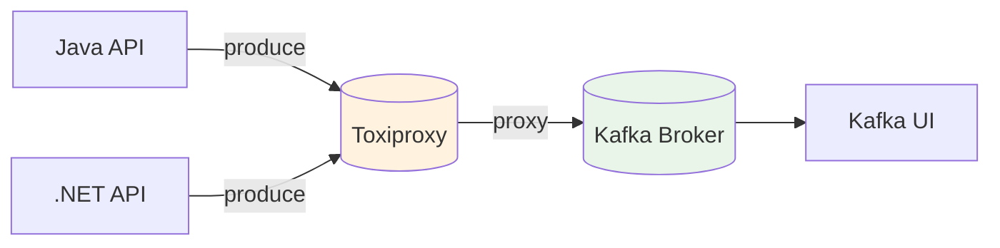

# Module 02 - Producer Reliability (Idempotence) - Self-Paced

## Objectif

Mettre en place deux APIs (**Java** et **.NET**) déployées via Docker et démontrer le rôle de l'idempotence côté producer lorsque des erreurs réseau provoquent des retries.

## Ce que vous allez apprendre

- Différence entre un producer **idempotent** et **non-idempotent**
- Différence entre envoi **synchrone** (blocking) et **asynchrone** (callback)
- Gestion des **callbacks** (acks / erreurs) et stratégie de traitement
- Rôle des **retries** et des timeouts dans la fiabilité
- Impact de la **clé** sur le partitionnement (ordre, scalabilité)
- Pourquoi la **log compaction** dépend des keys
- Pourquoi les retries réseau peuvent créer des doublons
- Comment observer les événements dans Kafka (Kafka UI)
- Comment injecter une panne réseau contrôlée via **Toxiproxy**

## Ports & endpoints

- Java API: `localhost:18080`
  - `GET /health`
  - `POST /api/v1/send?mode=plain|idempotent&eventId=...&sendMode=sync|async&key=...&partition=...`
  - `GET /api/v1/status?requestId=...` (uniquement si `sendMode=async`)
- .NET API: `localhost:18081`
  - `GET /health`
  - `POST /api/v1/send?mode=plain|idempotent&eventId=...&sendMode=sync|async&key=...&partition=...`
  - `GET /api/v1/status?requestId=...` (uniquement si `sendMode=async`)
- Toxiproxy API: `localhost:8474`
- Kafka UI: `localhost:8080`

## Paramètres de tuning (retries / timeouts)

Pour expérimenter les comportements de retry, vous pouvez surcharger ces variables d’environnement dans `docker-compose.module.yml`.

- Java API:
  - `KAFKA_REQUEST_TIMEOUT_MS` (défaut: 1000)
  - `KAFKA_DELIVERY_TIMEOUT_MS` (défaut: 120000)
  - `KAFKA_RETRY_BACKOFF_MS` (défaut: 100)
  - `KAFKA_RETRIES` (défaut: 10)
  - `KAFKA_LINGER_MS` (défaut: 0)
- .NET API:
  - `KAFKA_REQUEST_TIMEOUT_MS` (défaut: 1000)
  - `KAFKA_DELIVERY_TIMEOUT_MS` (défaut: 120000)
  - `KAFKA_RETRY_BACKOFF_MS` (défaut: 100)
  - `KAFKA_RETRIES` (défaut: 10)
  - `KAFKA_LINGER_MS` (défaut: 0)

## Rappels théoriques (ultra-pratiques)

### Synchrone vs asynchrone

- **Synchrone**: l’API attend l’ack Kafka (HTTP 200 + offset). Simple, mais plus lent.
- **Asynchrone**: l’API retourne tout de suite (HTTP 202) puis vous consultez le résultat via `/api/v1/status`.

### Callbacks & erreurs

- En asynchrone, le résultat (OK/ERROR) arrive dans un **callback** (delivery report).
- En pratique, on stocke un état (ex: `PENDING -> OK/ERROR`) et on expose un endpoint de suivi.

### Retries & timeouts

- `retries` + `request.timeout.ms` + `delivery.timeout.ms` déterminent combien de temps le producer peut “s’acharner”.
- Si le réseau est lent (latence), vous pouvez:
  - augmenter les timeouts
  - autoriser des retries
  - activer l’idempotence

### Idempotence

Idempotence = Kafka garantit “**pas de doublon**” pour un producer (session) même avec retries.

Pré-requis usuels:

- `enable.idempotence=true`
- `acks=all`
- `max.in.flight.requests.per.connection <= 5`

### Partitionnement

- La **clé** (`key`) détermine (par défaut) la **partition**.
- L’ordre n’est garanti **que dans une partition**.
- Forcer une `partition` est utile pour les demos, mais en prod on préfère la clé.

### Log compaction

- Compaction fonctionne par **clé** (dernière valeur par clé).
- Topic compacté = bon pour “état courant” (ex: profil client, dernier solde, dernière position).

## Architecture



## Pré-requis

- Base stack démarrée:

```bash
./scripts/up-base.sh
./scripts/bootstrap-topics.sh
```

Si vous partez de zéro, exécutez aussi:

```bash
./scripts/validate-base.sh
```

## Step-by-step

## Lab 02.0 - Setup & smoke test

### Objectif (Lab 02.0)

Démarrer les services du module (Toxiproxy + Java API + .NET API) et vérifier que tout est prêt.

### Step 0 - Se placer au bon endroit

Positionnez-vous dans le dossier `formation/formation-v2/`.

### Step 1 - Démarrer les services du module

Depuis le dossier `formation-v2/`:

```bash
docker compose -f infra/docker-compose.base.yml \
  -f day-01-foundations/module-02-producer-reliability/docker-compose.module.yml \
  up -d --build
```

Attendez ~1-2 minutes (le temps de build des images Java/.NET).

### Step 2 - Vérifier l’état des conteneurs

```bash
docker ps --format '{{.Names}}\t{{.Status}}' | grep -E 'kafka$|zookeeper$|kafka-ui$|toxiproxy$|m02-java-api$|m02-dotnet-api$|toxiproxy-init$'
```

Résultat attendu:

- `kafka`, `zookeeper`, `kafka-ui` sont `Up`
- `toxiproxy` est `Up`
- `toxiproxy-init` peut être `Exited (0)` (c’est normal: one-shot)
- `m02-java-api` et `m02-dotnet-api` sont `Up`

### Step 3 - Vérifier la santé des APIs

```bash
curl -fsS localhost:18080/health
curl -fsS localhost:18081/health
```

Résultat attendu:

- `OK` (pour chaque commande)

### Checkpoint 02.0

- Les conteneurs du module sont `Up`
- `GET /health` répond `OK` pour Java et .NET

## Lab 02.1 - Send synchrone (baseline)

### Objectif (Lab 02.1)

Envoyer un événement en **synchrone** et récupérer immédiatement le `partition/offset` (ack).

### Step 4 - Envoyer un événement (mode plain, sync)

```bash
EVENT_ID="PLAIN-$(date +%s)"
curl -fsS -X POST "localhost:18080/api/v1/send?mode=plain&sendMode=sync&eventId=$EVENT_ID" | cat
```

Résultat attendu:

- Un JSON avec `topic=bhf-transactions` et un `offset`

### Checkpoint 02.1

- Vous obtenez un JSON avec `partition` et `offset`

### Step 5 - Observer l’événement dans Kafka UI

1. Ouvrez `localhost:8080`
2. Cluster `BHF-Training`
3. Topic `bhf-transactions`
4. Onglet messages (consommer depuis le début)

Vous devez retrouver votre `eventId`.

## Lab 02.2 - Callbacks & erreurs (asynchrone)

### Objectif (Lab 02.2)

Utiliser `sendMode=async` et observer le résultat via `GET /api/v1/status` (OK/ERROR), comme un callback réel.

### Step 6 - Injecter un problème réseau (latency) avec Toxiproxy

Vérifier que le proxy existe:

```bash
curl -fsS localhost:8474/proxies | cat
```

Ajouter une latence (5s) sur le flux downstream:

```bash
curl -fsS -H 'Content-Type: application/json' \
  -X POST localhost:8474/proxies/kafka/toxics \
  -d '{"name":"latency","type":"latency","stream":"downstream","attributes":{"latency":5000,"jitter":0}}' \
  | cat
```

Supprimer la latence:

```bash
curl -fsS -X DELETE localhost:8474/proxies/kafka/toxics/latency >/dev/null || true
```

### Step 6bis - Envoi asynchrone + polling (Java)

```bash
EVENT_ID="JAVA-ASYNC-$(date +%s)"

REQ_ID=$(curl -fsS -X POST "localhost:18080/api/v1/send?mode=idempotent&sendMode=async&eventId=$EVENT_ID" | sed -n 's/.*"requestId":"\([^"]*\)".*/\1/p')
echo "requestId=$REQ_ID"

curl -fsS "localhost:18080/api/v1/status?requestId=$REQ_ID" | cat
```

### Step 6ter - Forcer une erreur (timeout) et vérifier le status (.NET)

```bash
curl -fsS -H 'Content-Type: application/json' \
  -X POST localhost:8474/proxies/kafka/toxics \
  -d '{"name":"timeout","type":"timeout","stream":"downstream","attributes":{"timeout":1}}' \
  | cat

EVENT_ID="DOTNET-ASYNC-FAIL-$(date +%s)"
REQ_ID=$(curl -fsS -X POST "localhost:18081/api/v1/send?mode=plain&sendMode=async&eventId=$EVENT_ID" | sed -n 's/.*"requestId":"\([^"]*\)".*/\1/p')
echo "requestId=$REQ_ID"

curl -fsS "localhost:18081/api/v1/status?requestId=$REQ_ID" | cat

curl -fsS -X DELETE localhost:8474/proxies/kafka/toxics/timeout >/dev/null || true
```

### Checkpoint 02.2

- En async vous voyez un `state=OK` (ou `ERROR` si Kafka est injoignable)
- Vous savez récupérer le résultat via `/api/v1/status`

## Lab 02.3 - Retries & Idempotence (checkpoint principal)

### Objectif (Lab 02.3)

Provoquer des retries via latence réseau et prouver que:

- En `plain`, des doublons peuvent apparaître.
- En `idempotent`, **exactement 1** message est écrit pour un `eventId` donné.

### Step 7 - Comparer plain vs idempotent sous panne réseau

Le but est de provoquer des retries (réseau lent), puis de constater:

- En `plain`, un doublon peut apparaître.
- En `idempotent`, vous devez obtenir **exactement 1** message pour un `eventId` donné.

Au lieu de le faire à la main, on passe au checkpoint automatisé.

### Step 8 - Exécuter la validation (checkpoint)

```bash
./day-01-foundations/module-02-producer-reliability/scripts/validate.sh
```

Résultat attendu:

- `OK: ...`

Si vous voyez un `WARN` sur le mode plain, c’est acceptable (le doublon dépend du timing).

### Checkpoint 02.3

- Le script `validate.sh` termine par `OK`

## Lab 02.4 - Partitionnement

### Objectif (Lab 02.4)

Comprendre comment la **key** influence la partition et pourquoi l’ordre est garanti **par partition**.

### Step 9 - Partitionnement (clé vs partition)

Envoyer explicitement sur 2 partitions différentes:

```bash
EVENT_ID="P0-$(date +%s)"
curl -fsS -X POST "localhost:18080/api/v1/send?mode=plain&sendMode=sync&eventId=$EVENT_ID&key=account-123&partition=0" | cat

EVENT_ID="P1-$(date +%s)"
curl -fsS -X POST "localhost:18080/api/v1/send?mode=plain&sendMode=sync&eventId=$EVENT_ID&key=account-123&partition=1" | cat
```

Consommer et afficher partition/offset:

```bash
docker exec kafka kafka-console-consumer \
  --bootstrap-server localhost:9092 \
  --topic bhf-transactions \
  --from-beginning \
  --timeout-ms 10000 \
  --property print.partition=true \
  --property print.offset=true
```

### Checkpoint 02.4

- Vous voyez des messages apparaître sur des partitions différentes

## Lab 02.5 - Log compaction

### Objectif (Lab 02.5)

Comprendre le principe “dernière valeur par key” et pourquoi la compaction nécessite une key.

### Step 10 - Créer un topic compacté + produire plusieurs versions

Créer un topic compacté (démo):

```bash
docker exec kafka kafka-topics \
  --bootstrap-server localhost:9092 \
  --create --if-not-exists \
  --topic bhf-compact-demo \
  --partitions 3 \
  --replication-factor 1 \
  --config cleanup.policy=compact \
  --config segment.ms=1000 \
  --config min.cleanable.dirty.ratio=0.01 \
  --config delete.retention.ms=1000
```

Envoyer 3 valeurs avec la **même key**:

```bash
KEY="customer-42"
curl -fsS -X POST "localhost:18081/api/v1/send?mode=plain&sendMode=sync&topic=bhf-compact-demo&eventId=V1&key=$KEY" | cat
curl -fsS -X POST "localhost:18081/api/v1/send?mode=plain&sendMode=sync&topic=bhf-compact-demo&eventId=V2&key=$KEY" | cat
curl -fsS -X POST "localhost:18081/api/v1/send?mode=plain&sendMode=sync&topic=bhf-compact-demo&eventId=V3&key=$KEY" | cat
```

### Checkpoint 02.5

- Vous comprenez que la compaction est asynchrone
- Vous savez qu’à terme Kafka conservera la dernière valeur par key

## Checkpoint

- L'envoi **idempotent** doit produire **1 seul événement** pour un `eventId` donné.
- L'envoi **non-idempotent** peut produire **1 ou plusieurs événements** pour un `eventId` donné (selon la répétition observée).

## Troubleshooting

### APIs en erreur / timeout

- Vérifiez les logs:

```bash
docker logs -n 200 m02-java-api
docker logs -n 200 m02-dotnet-api
```

### Kafka non accessible

- Vérifiez le base stack:

```bash
./scripts/validate-base.sh
```

## Nettoyage

```bash
docker compose -f infra/docker-compose.base.yml \
  -f day-01-foundations/module-02-producer-reliability/docker-compose.module.yml \
  down
```
