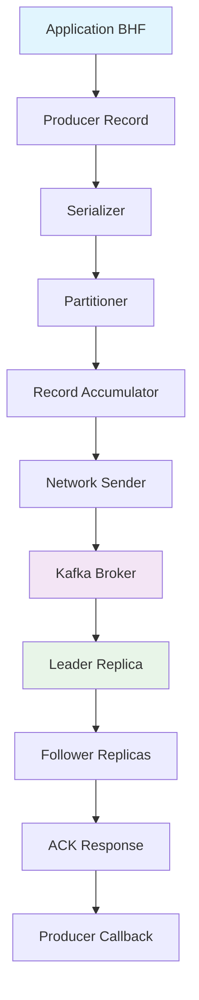
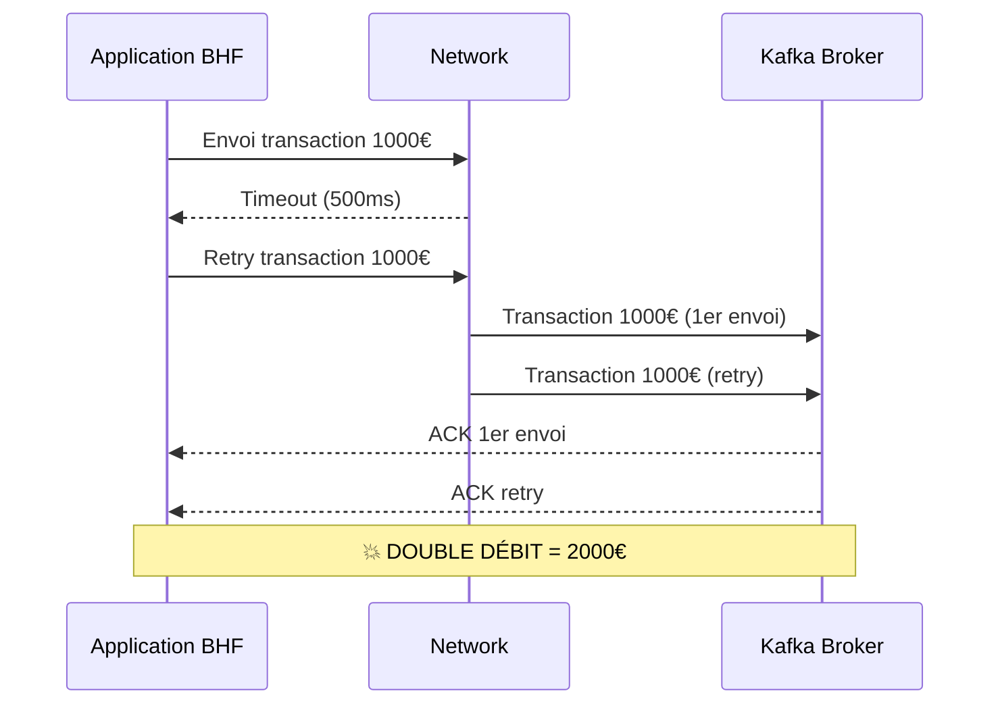
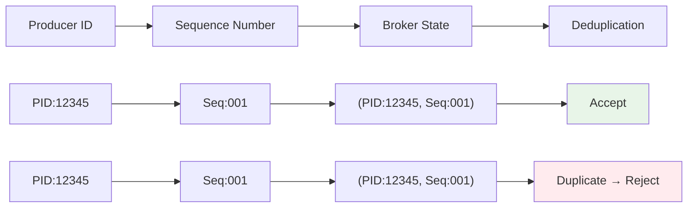

# Module 02 - Producer Idempotent (Ubuntu Enterprise)

## 📚 Théorie (30%) - Producteur Kafka & Idempotence

### 2.1 Cycle de vie du producteur



### 2.2 Problème : Messages dupliqués

#### 🏦 **Scénario BHF critique**


#### ⚠️ **Impact bancaire**
- **Perte financière** : Double débit = perte directe
- **Réglementaire** : Non-conformité ACPR/ECB
- **Réputation** : Perte de confiance client
- **Opérationnel** : Processus de remboursement manuel

### 2.3 Solution : Idempotence Kafka

#### 🔥 **Configuration idempotent BHF**
```properties
# Configuration obligatoire pour BHF
enable.idempotence=true
acks=all
retries=Integer.MAX_VALUE
max.in.flight.requests.per.connection=5

# Tuning production BHF
delivery.timeout.ms=30000
request.timeout.ms=20000
retry.backoff.ms=100
max.block.ms=60000
```

#### 🎯 **Mécanisme interne**


### 2.4 Contraintes techniques - Matrix BHF

| Configuration | Valeur | Impact BHF | Pourquoi ? |
|---------------|--------|------------|------------|
| `enable.idempotence` | `true` | ✅ Sécurité | Active l'anti-doublon |
| `acks` | `all` | ✅ Durabilité | Garantit persistance complète |
| `max.in.flight.requests` | `≤ 5` | ✅ Ordre | Préserve l'ordre des transactions |
| `retries` | `Integer.MAX_VALUE` | ✅ Résilience | Retry infini pour haute disponibilité |
| `delivery.timeout.ms` | `30000` | ✅ SLA | Timeout 30s pour transactions critiques |

---

## 🛠️ Pratique (70%) - Producer Idempotent BHF Ubuntu

### Lab 02.1 - Producer Idempotent pour Transactions BHF

#### Étape 1 : Configuration Maven Ubuntu

**pom.xml optimisé pour Ubuntu Enterprise :**
```xml
<?xml version="1.0" encoding="UTF-8"?>
<project xmlns="http://maven.apache.org/POM/4.0.0"
         xmlns:xsi="http://www.w3.org/2001/XMLSchema-instance"
         xsi:schemaLocation="http://maven.apache.org/POM/4.0.0 http://maven.apache.org/xsd/maven-4.0.0.xsd">
  <modelVersion>4.0.0</modelVersion>

  <groupId>com.bhf.kafka</groupId>
  <artifactId>idempotent-producer</artifactId>
  <version>1.0.0</version>
  <name>BHF Idempotent Producer</name>
  <description>Kafka Idempotent Producer for BHF Banking - Ubuntu Enterprise</description>

  <properties>
    <maven.compiler.source>17</maven.compiler.source>
    <maven.compiler.target>17</maven.compiler.target>
    <project.build.sourceEncoding>UTF-8</project.build.sourceEncoding>
    <kafka.version>3.4.1</kafka.version>
    <slf4j.version>1.7.36</slf4j.version>
    <logback.version>1.2.12</logback.version>
  </properties>

  <dependencies>
    <!-- Kafka Core -->
    <dependency>
      <groupId>org.apache.kafka</groupId>
      <artifactId>kafka-clients</artifactId>
      <version>${kafka.version}</version>
    </dependency>
    
    <!-- Logging -->
    <dependency>
      <groupId>org.slf4j</groupId>
      <artifactId>slf4j-api</artifactId>
      <version>${slf4j.version}</version>
    </dependency>
    <dependency>
      <groupId>ch.qos.logback</groupId>
      <artifactId>logback-classic</artifactId>
      <version>${logback.version}</version>
    </dependency>
    
    <!-- JSON Processing -->
    <dependency>
      <groupId>com.fasterxml.jackson.core</groupId>
      <artifactId>jackson-databind</artifactId>
      <version>2.15.2</version>
    </dependency>
    
    <!-- Testing -->
    <dependency>
      <groupId>junit</groupId>
      <artifactId>junit</artifactId>
      <version>4.13.2</version>
      <scope>test</scope>
    </dependency>
  </dependencies>

  <build>
    <plugins>
      <plugin>
        <groupId>org.apache.maven.plugins</groupId>
        <artifactId>maven-compiler-plugin</artifactId>
        <version>3.11.0</version>
        <configuration>
          <source>17</source>
          <target>17</target>
          <encoding>UTF-8</encoding>
        </configuration>
      </plugin>
      
      <plugin>
        <groupId>org.apache.maven.plugins</groupId>
        <artifactId>maven-jar-plugin</artifactId>
        <version>3.2.2</version>
        <configuration>
          <archive>
            <manifest>
              <mainClass>com.bhf.kafka.IdempotentProducerApp</mainClass>
            </manifest>
          </archive>
        </configuration>
      </plugin>
      
      <plugin>
        <groupId>org.apache.maven.plugins</groupId>
        <artifactId>maven-surefire-plugin</artifactId>
        <version>3.0.0-M9</version>
      </plugin>
    </plugins>
  </build>
</project>
```

#### Étape 2 : Code Producer Idempotent Ubuntu - Étape par Étape

##### 📋 **Étape 2.1 - Structure du projet**

```bash
# Créer la structure des dossiers
mkdir -p src/main/java/com/bhf/kafka
mkdir -p src/main/resources
mkdir -p src/test/java/com/bhf/kafka
mkdir -p logs
```

##### 📝 **Étape 2.2 - Code Producer Idempotent**

Créer `src/main/java/com/bhf/kafka/IdempotentProducerApp.java` :

```java
package com.bhf.kafka;

import org.apache.kafka.clients.producer.*;
import org.apache.kafka.common.serialization.StringSerializer;
import org.slf4j.Logger;
import org.slf4j.LoggerFactory;

import java.util.Properties;
import java.util.concurrent.ExecutionException;
import java.util.UUID;

/**
 * 🏦 Producer Idempotent BHF - Application principale
 * 
 * Ce producteur garantit l'unicité des messages même en cas de retry
 * pour éviter les doubles débits dans le contexte bancaire BHF.
 */
public class IdempotentProducerApp {
    private static final Logger log = LoggerFactory.getLogger(IdempotentProducerApp.class);

    public static void main(String[] args) {
        log.info("🏦 Démarrage du Producer Idempotent BHF");
        
        // 🔥 Étape 1 : Configuration du producer
        Properties props = configureProducer();
        
        try (KafkaProducer<String, String> producer = new KafkaProducer<>(props)) {
            
            // 🔥 Étape 2 : Création de la transaction BHF
            Transaction transaction = createBHFTransaction();
            
            // 🔥 Étape 3 : Envoi de la transaction
            sendTransaction(producer, transaction);
            
            // 🔥 Étape 4 : Vérification du résultat
            log.info("✅ Transaction BHF envoyée avec succès");
            
        } catch (Exception e) {
            log.error("❌ Erreur lors de l'envoi de la transaction", e);
            System.exit(1);
        }
    }
    
    /**
     * 🔥 Configuration du producer idempotent BHF
     */
    private static Properties configureProducer() {
        Properties props = new Properties();
        
        // Configuration de base
        props.put(ProducerConfig.BOOTSTRAP_SERVERS_CONFIG, "localhost:9092");
        props.put(ProducerConfig.KEY_SERIALIZER_CLASS_CONFIG, StringSerializer.class.getName());
        props.put(ProducerConfig.VALUE_SERIALIZER_CLASS_CONFIG, StringSerializer.class.getName());
        
        // 🔥 Configuration idempotent BHF - OBLIGATOIRE
        props.put(ProducerConfig.ENABLE_IDEMPOTENCE_CONFIG, true);
        props.put(ProducerConfig.ACKS_CONFIG, "all");
        props.put(ProducerConfig.RETRIES_CONFIG, Integer.MAX_VALUE);
        props.put(ProducerConfig.MAX_IN_FLIGHT_REQUESTS_PER_CONNECTION, 5);
        
        // Tuning production BHF
        props.put(ProducerConfig.DELIVERY_TIMEOUT_MS_CONFIG, 30000);
        props.put(ProducerConfig.REQUEST_TIMEOUT_MS_CONFIG, 20000);
        props.put(ProducerConfig.RETRY_BACKOFF_MS_CONFIG, 100);
        
        log.info("📋 Configuration producer idempotent terminée");
        return props;
    }
    
    /**
     * 🏦 Création d'une transaction BHF de test
     */
    private static Transaction createBHFTransaction() {
        String transactionId = "TXN-" + UUID.randomUUID().toString().substring(0, 8).toUpperCase();
        String accountId = "ACC-" + String.format("%06d", (int)(Math.random() * 999999));
        double amount = 100 + Math.random() * 10000;
        
        return new Transaction(transactionId, accountId, amount, "EUR", "DEBIT", "PENDING");
    }
    
    /**
     * 🏦 Envoi de la transaction avec monitoring détaillé
     */
    private static void sendTransaction(KafkaProducer<String, String> producer, Transaction transaction) {
        String topic = "bhf-transactions";
        String key = transaction.getAccountId();
        String value = transaction.toJson();
        
        log.info("📤 Envoi transaction BHF :");
        log.info("   Transaction ID : {}", transaction.getTransactionId());
        log.info("   Compte : {}", transaction.getAccountId());
        log.info("   Montant : {} {}", transaction.getAmount(), transaction.getCurrency());
        log.info("   Type : {}", transaction.getTransactionType());
        log.info("   Statut : {}", transaction.getStatus());
        
        try {
            ProducerRecord<String, String> record = new ProducerRecord<>(topic, key, value);
            
            // 🔥 Envoi synchrone pour garantir la réception
            RecordMetadata metadata = producer.send(record).get();
            
            log.info("✅ Transaction envoyée avec succès :");
            log.info("   Topic : {}", metadata.topic());
            log.info("   Partition : {}", metadata.partition());
            log.info("   Offset : {}", metadata.offset());
            log.info("   Timestamp : {}", metadata.timestamp());
            
            // Mise à jour du statut
            transaction.setStatus("COMPLETED");
            
        } catch (InterruptedException | ExecutionException e) {
            log.error("❌ Erreur lors de l'envoi de la transaction {}", transaction.getTransactionId(), e);
            transaction.setStatus("FAILED");
            Thread.currentThread().interrupt();
        }
    }
    
    /**
     * 🏦 Modèle Transaction BHF
     */
    private static class Transaction {
        private String transactionId;
        private String accountId;
        private double amount;
        private String currency;
        private String transactionType;
        private String status;
        private long timestamp;
        
        public Transaction(String transactionId, String accountId, double amount, 
                          String currency, String transactionType, String status) {
            this.transactionId = transactionId;
            this.accountId = accountId;
            this.amount = amount;
            this.currency = currency;
            this.transactionType = transactionType;
            this.status = status;
            this.timestamp = System.currentTimeMillis();
        }
        
        // Getters
        public String getTransactionId() { return transactionId; }
        public String getAccountId() { return accountId; }
        public double getAmount() { return amount; }
        public String getCurrency() { return currency; }
        public String getTransactionType() { return transactionType; }
        public String getStatus() { return status; }
        public long getTimestamp() { return timestamp; }
        
        // Setters
        public void setStatus(String status) { this.status = status; }
        
        public String toJson() {
            return String.format(
                "{\"transactionId\":\"%s\",\"accountId\":\"%s\",\"amount\":%.2f,\"currency\":\"%s\",\"type\":\"%s\",\"status\":\"%s\",\"timestamp\":%d}",
                transactionId, accountId, amount, currency, transactionType, status, timestamp
            );
        }
    }
}
```
                
                log.info("✅ Transaction envoyée avec succès :");
                log.info("   Topic : {}", metadata.topic());
                log.info("   Partition : {}", metadata.partition());
                log.info("   Offset : {}", metadata.offset());
                log.info("   Timestamp : {}", metadata.timestamp());
                
            } catch (InterruptedException | ExecutionException e) {
                log.error("❌ Erreur lors de l'envoi de la transaction", e);
            }
        }
    }
}
```

#### Étape 3 : Test de l'idempotence

```powershell
# 1. Compiler le projet
mvn clean compile

# 2. Créer le topic BHF
docker exec kafka kafka-topics --create --topic bhf-transactions --bootstrap-server localhost:9092 --partitions 3 --replication-factor 1

# 3. Exécuter le producer 3 fois pour tester l'idempotence
for ($i=1; $i -le 3; $i++) {
    Write-Host "🔄 Exécution $i/3"
    mvn exec:java -Dexec.mainClass="com.bhf.kafka.IdempotentProducerApp"
    Start-Sleep 1
}
```

#### Étape 4 : Vérification des résultats

```powershell
# Consommer pour vérifier l'unicité
docker exec kafka kafka-console-consumer --topic bhf-transactions --bootstrap-server localhost:9092 --from-beginning --property print.key=true
```

**Résultat attendu (1 seul message malgré 3 envois) :**
```
account-456	{"transactionId":"TXN-1643723400123","amount":1250.75,"currency":"EUR","type":"DEBIT","status":"PENDING"}
```

#### Étape 5 : Test avec retries réseau (simulation)

```java
// Ajouter une configuration pour simuler des timeouts
props.put(ProducerConfig.REQUEST_TIMEOUT_MS_CONFIG, 1000); // Timeout court
props.put(ProducerConfig.RETRY_BACKOFF_MS_CONFIG, 100); // Retry rapide
```

**Observation des logs :**
```
2024-01-01 10:00:00 INFO  IdempotentProducerApp - 🏦 Envoi transaction BHF : TXN-1643723400123
2024-01-01 10:00:01 WARN  NetworkClient - Connection to node 1 could not be established. Broker may not be available.
2024-01-01 10:00:02 INFO  IdempotentProducerApp - ✅ Transaction envoyée avec succès
# Retry automatique mais 1 seul message dans Kafka
```

---

## 🎯 Checkpoint Module 02

### ✅ Validation des compétences

- [ ] Producer idempotent configuré
- [ ] Messages uniques malgré retries
- [ ] Configuration BHF appliquée
- [ ] Logs de retry et succès observés

### 📝 Questions de checkpoint

1. **Pourquoi `acks=all` est obligatoire avec l'idempotence ?**
   - Garantit que tous les replicas ont persisté avant l'ACK
   - Essentiel pour la déduplication

2. **Quel est l'impact sur la performance ?**
   - Latence légèrement augmentée (attente de tous les replicas)
   - Mais garantie forte pour transactions bancaires

3. **Comment BHF utilise-t-il l'idempotence en production ?**
   - Évite les doubles débits
   - Garantit l'intégrité des transactions
   - Conforme aux exigences réglementaires

---

## 🚀 Prochain module

**Module 03** : Consumer Read-Committed - Stratégies de commit et isolation des transactions.
