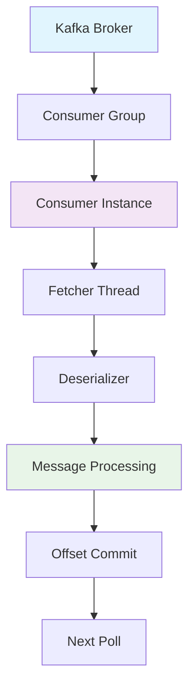
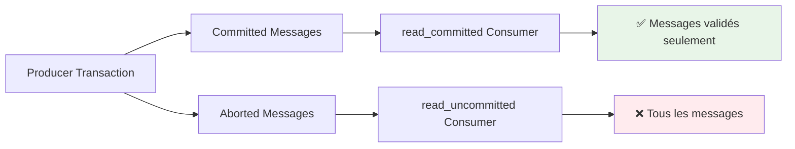

# Module 03 - Consumer Read-Committed (Enhanced Big Enterprise)

## 📚 Théorie (30%) - Consumer Kafka & Isolation

### 3.1 Cycle de vie du consumer - Vue détaillée



### 3.2 Problème : Consommation de données non validées

#### 🏦 **Scénario critique BHF - Transaction annulée**
```
10:00:00 - Transaction 1000€ envoyée (status: PENDING)
10:00:01 - Consumer lit transaction (status: PENDING)
10:00:02 - Transaction annulée (status: CANCELLED)
10:00:03 - Consumer traite transaction 1000€ ❌
```

#### 📊 **Impact bancaire**
- **Traitement invalide** : Transaction annulée mais traitée
- **Double débit** : Client débité pour transaction annulée
- **Réglementaire** : Non-conformité audit trails
- **Réputation** : Perte de confiance client

### 3.3 Solution : Read-Committed Isolation

#### 🔥 **Configuration read_committed**
```properties
# Configuration obligatoire pour BHF
isolation.level=read_committed
enable.auto.commit=false
auto.offset.reset=earliest
max.poll.records=500
session.timeout.ms=30000
heartbeat.interval.ms=10000
```

#### 🎯 **Mécanisme d'isolation**


---

## 🛠️ Pratique (70%) - Consumer Read-Committed BHF avec Spring Boot & .NET

### Workshop 03.1 - Consumer Read-Committed Multi-Stack

#### 🔧 **Option A : Spring Boot Java (Recommandé BHF)**

##### Étape 1 : Configuration Spring Boot Consumer

**application.yml :**
```yaml
server:
  port: 8081

spring:
  application:
    name: bhf-read-committed-consumer
  
  kafka:
    bootstrap-servers: localhost:9092
    
    consumer:
      # 🔥 Configuration read_committed BHF
      key-deserializer: org.apache.kafka.common.serialization.StringDeserializer
      value-deserializer: org.apache.kafka.common.serialization.StringDeserializer
      group-id: bhf-transaction-processors
      auto-offset-reset: earliest
      enable-auto-commit: false
      isolation-level: read_committed
      
      # Tuning production BHF
      max-poll-records: 500
      session-timeout-ms: 30000
      heartbeat-interval-ms: 10000
      fetch-min-bytes: 1024
      fetch-max-wait-ms: 500
      
      # Topics BHF
      topics: bhf-transactions,bhf-audit

# Monitoring BHF
management:
  endpoints:
    web:
      exposure:
        include: health,info,metrics,prometheus
  metrics:
    export:
      prometheus:
        enabled: true

# Logging BHF
logging:
  level:
    com.bhf.kafka: DEBUG
    org.springframework.kafka: INFO
    org.apache.kafka: WARN
```

##### Étape 2 : Model Transaction BHF

**Transaction.java :**
```java
package com.bhf.kafka.model;

import com.fasterxml.jackson.annotation.JsonFormat;
import com.fasterxml.jackson.annotation.JsonProperty;
import jakarta.validation.constraints.*;
import java.math.BigDecimal;
import java.time.LocalDateTime;

public class Transaction {
    
    @JsonProperty("transactionId")
    @NotBlank(message = "Transaction ID is required")
    private String transactionId;
    
    @JsonProperty("accountId")
    @NotBlank(message = "Account ID is required")
    private String accountId;
    
    @JsonProperty("amount")
    @NotNull(message = "Amount is required")
    @DecimalMin(value = "0.01", message = "Amount must be positive")
    private BigDecimal amount;
    
    @JsonProperty("currency")
    @NotBlank(message = "Currency is required")
    @Pattern(regexp = "^[A-Z]{3}$", message = "Currency must be 3 uppercase letters")
    private String currency;
    
    @JsonProperty("transactionType")
    @NotBlank(message = "Transaction type is required")
    private String transactionType;
    
    @JsonProperty("status")
    private String status;
    
    @JsonProperty("timestamp")
    @JsonFormat(pattern = "yyyy-MM-dd'T'HH:mm:ss.SSS")
    private LocalDateTime timestamp;
    
    @JsonProperty("description")
    private String description;
    
    // Constructors
    public Transaction() {
        this.timestamp = LocalDateTime.now();
        this.status = "PENDING";
    }
    
    // Getters and Setters
    public String getTransactionId() { return transactionId; }
    public void setTransactionId(String transactionId) { this.transactionId = transactionId; }
    
    public String getAccountId() { return accountId; }
    public void setAccountId(String accountId) { this.accountId = accountId; }
    
    public BigDecimal getAmount() { return amount; }
    public void setAmount(BigDecimal amount) { this.amount = amount; }
    
    public String getCurrency() { return currency; }
    public void setCurrency(String currency) { this.currency = currency; }
    
    public String getTransactionType() { return transactionType; }
    public void setTransactionType(String transactionType) { this.transactionType = transactionType; }
    
    public String getStatus() { return status; }
    public void setStatus(String status) { this.status = status; }
    
    public LocalDateTime getTimestamp() { return timestamp; }
    public void setTimestamp(LocalDateTime timestamp) { this.timestamp = timestamp; }
    
    public String getDescription() { return description; }
    public void setDescription(String description) { this.description = description; }
    
    @Override
    public String toString() {
        return String.format(
            "Transaction{id='%s', account='%s', amount=%s%s, type='%s', status='%s', time=%s}",
            transactionId, accountId, amount, currency, transactionType, status, timestamp
        );
    }
}
```

##### Étape 3 : Consumer Service BHF

**TransactionConsumerService.java :**
```java
package com.bhf.kafka.service;

import com.bhf.kafka.model.Transaction;
import com.fasterxml.jackson.core.JsonProcessingException;
import com.fasterxml.jackson.databind.ObjectMapper;
import org.slf4j.Logger;
import org.slf4j.LoggerFactory;
import org.springframework.kafka.annotation.KafkaListener;
import org.springframework.kafka.support.Acknowledgment;
import org.springframework.kafka.support.KafkaHeaders;
import org.springframework.messaging.handler.annotation.Header;
import org.springframework.messaging.handler.annotation.Payload;
import org.springframework.stereotype.Service;

import java.util.concurrent.atomic.AtomicLong;

@Service
public class TransactionConsumerService {
    
    private static final Logger log = LoggerFactory.getLogger(TransactionConsumerService.class);
    
    private final ObjectMapper objectMapper;
    private final AtomicLong processedCount = new AtomicLong(0);
    private final AtomicLong errorCount = new AtomicLong(0);
    
    public TransactionConsumerService(ObjectMapper objectMapper) {
        this.objectMapper = objectMapper;
    }
    
    /**
     * 🏦 Consommation transactions BHF avec isolation read_committed
     */
    @KafkaListener(
        topics = "bhf-transactions",
        groupId = "bhf-transaction-processors",
        containerFactory = "kafkaListenerContainerFactory"
    )
    public void processTransaction(
            @Payload String message,
            @Header(KafkaHeaders.RECEIVED_TOPIC) String topic,
            @Header(KafkaHeaders.RECEIVED_PARTITION_ID) int partition,
            @Header(KafkaHeaders.OFFSET) long offset,
            Acknowledgment acknowledgment) {
        
        try {
            log.info("🏦 Réception transaction BHF :");
            log.info("   Topic : {}", topic);
            log.info("   Partition : {}", partition);
            log.info("   Offset : {}", offset);
            log.info("   Message : {}", message);
            
            // Désérialisation JSON
            Transaction transaction = deserializeTransaction(message);
            
            // Validation transaction
            validateTransaction(transaction);
            
            // Traitement métier BHF
            processTransactionBusiness(transaction);
            
            // Commit manuel de l'offset
            acknowledgment.acknowledge();
            
            // Métriques
            long processed = processedCount.incrementAndGet();
            log.info("✅ Transaction traitée avec succès : {} | Total traitées : {}", 
                    transaction.getTransactionId(), processed);
            
        } catch (Exception e) {
            long errors = errorCount.incrementAndGet();
            log.error("❌ Erreur traitement transaction | Erreur #{} | Message : {}", 
                     errors, message, e);
            
            // En production, envoyer à dead-letter queue
            sendToDeadLetterQueue(message, e);
            
            // Acknowledgment pour éviter de retraiter indéfiniment
            acknowledgment.acknowledge();
        }
    }
    
    /**
     * 🔍 Désérialisation transaction JSON
     */
    private Transaction deserializeTransaction(String jsonMessage) throws JsonProcessingException {
        try {
            return objectMapper.readValue(jsonMessage, Transaction.class);
        } catch (JsonProcessingException e) {
            log.error("❌ Erreur désérialisation JSON : {}", jsonMessage, e);
            throw new RuntimeException("Failed to deserialize transaction", e);
        }
    }
    
    /**
     * ✅ Validation transaction BHF
     */
    private void validateTransaction(Transaction transaction) {
        if (transaction.getTransactionId() == null || transaction.getTransactionId().trim().isEmpty()) {
            throw new IllegalArgumentException("Transaction ID cannot be null or empty");
        }
        
        if (transaction.getAmount() == null || transaction.getAmount().compareTo(BigDecimal.ZERO) <= 0) {
            throw new IllegalArgumentException("Amount must be positive");
        }
        
        if (transaction.getAccountId() == null || transaction.getAccountId().trim().isEmpty()) {
            throw new IllegalArgumentException("Account ID cannot be null or empty");
        }
        
        // Validation spécifique BHF - seulement les transactions COMMITED
        if (!"COMPLETED".equals(transaction.getStatus()) && !"PENDING".equals(transaction.getStatus())) {
            log.warn("⚠️ Transaction avec statut inhabituel : {} | {}", 
                    transaction.getStatus(), transaction.getTransactionId());
        }
        
        // Validation montant élevé
        if (transaction.getAmount().compareTo(new BigDecimal("100000")) > 0) {
            log.warn("⚠️ Montant élevé détecté : {} {} | {}", 
                    transaction.getAmount(), transaction.getCurrency(), transaction.getTransactionId());
        }
    }
    
    /**
     * 🏦 Traitement métier BHF
     */
    private void processTransactionBusiness(Transaction transaction) {
        log.info("🔧 Traitement métier transaction : {}", transaction.getTransactionId());
        
        switch (transaction.getTransactionType().toUpperCase()) {
            case "DEBIT":
                processDebitTransaction(transaction);
                break;
            case "CREDIT":
                processCreditTransaction(transaction);
                break;
            case "TRANSFER":
                processTransferTransaction(transaction);
                break;
            default:
                throw new IllegalArgumentException("Unknown transaction type: " + transaction.getTransactionType());
        }
        
        // Simulation traitement (en production, appel à services bancaires)
        try {
            Thread.sleep(100); // Simulation latence traitement
        } catch (InterruptedException e) {
            Thread.currentThread().interrupt();
        }
        
        log.info("✅ Traitement métier terminé : {}", transaction.getTransactionId());
    }
    
    /**
     * 💳 Traitement débit
     */
    private void processDebitTransaction(Transaction transaction) {
        log.info("💳 Traitement débit : {} {} sur compte {}", 
                transaction.getAmount(), transaction.getCurrency(), transaction.getAccountId());
        
        // En production : appel service bancaire pour débit
        // accountService.debit(transaction.getAccountId(), transaction.getAmount());
    }
    
    /**
     * 💰 Traitement crédit
     */
    private void processCreditTransaction(Transaction transaction) {
        log.info("💰 Traitement crédit : {} {} sur compte {}", 
                transaction.getAmount(), transaction.getCurrency(), transaction.getAccountId());
        
        // En production : appel service bancaire pour crédit
        // accountService.credit(transaction.getAccountId(), transaction.getAmount());
    }
    
    /**
     * 🔄 Traitement virement
     */
    private void processTransferTransaction(Transaction transaction) {
        log.info("🔄 Traitement virement : {} {} | {}", 
                transaction.getAmount(), transaction.getCurrency(), transaction.getDescription());
        
        // En production : appel service bancaire pour virement
        // transferService.processTransfer(transaction);
    }
    
    /**
     * 📊 Envoi vers dead-letter queue
     */
    private void sendToDeadLetterQueue(String message, Exception error) {
        // En production, envoyer vers topic dead-letter
        log.error("🚨 Envoi vers dead-letter queue | Erreur : {}", error.getMessage());
        
        // kafkaTemplate.send("bhf-transactions-dlq", message);
    }
    
    /**
     * 📈 Métriques de traitement
     */
    public long getProcessedCount() {
        return processedCount.get();
    }
    
    public long getErrorCount() {
        return errorCount.get();
    }
    
    public double getSuccessRate() {
        long total = processedCount.get() + errorCount.get();
        return total > 0 ? (double) processedCount.get() / total * 100 : 0.0;
    }
}
```

##### Étape 4 : Configuration Kafka Listener

**KafkaConfig.java :**
```java
package com.bhf.kafka.config;

import org.apache.kafka.clients.consumer.ConsumerConfig;
import org.apache.kafka.common.serialization.StringDeserializer;
import org.springframework.context.annotation.Bean;
import org.springframework.context.annotation.Configuration;
import org.springframework.kafka.annotation.EnableKafka;
import org.springframework.kafka.config.ConcurrentKafkaListenerContainerFactory;
import org.springframework.kafka.core.ConsumerFactory;
import org.springframework.kafka.core.DefaultKafkaConsumerFactory;
import org.springframework.kafka.listener.ContainerProperties;

import java.util.HashMap;
import java.util.Map;

@Configuration
@EnableKafka
public class KafkaConfig {
    
    @Bean
    public ConsumerFactory<String, String> consumerFactory() {
        Map<String, Object> props = new HashMap<>();
        
        // Configuration de base
        props.put(ConsumerConfig.BOOTSTRAP_SERVERS_CONFIG, "localhost:9092");
        props.put(ConsumerConfig.GROUP_ID_CONFIG, "bhf-transaction-processors");
        props.put(ConsumerConfig.KEY_DESERIALIZER_CLASS_CONFIG, StringDeserializer.class);
        props.put(ConsumerConfig.VALUE_DESERIALIZER_CLASS_CONFIG, StringDeserializer.class);
        
        // 🔥 Configuration read_committed BHF
        props.put(ConsumerConfig.ISOLATION_LEVEL_CONFIG, "read_committed");
        props.put(ConsumerConfig.ENABLE_AUTO_COMMIT_CONFIG, false);
        props.put(ConsumerConfig.AUTO_OFFSET_RESET_CONFIG, "earliest");
        
        // Tuning production BHF
        props.put(ConsumerConfig.MAX_POLL_RECORDS_CONFIG, 500);
        props.put(ConsumerConfig.SESSION_TIMEOUT_MS_CONFIG, 30000);
        props.put(ConsumerConfig.HEARTBEAT_INTERVAL_MS_CONFIG, 10000);
        props.put(ConsumerConfig.FETCH_MIN_BYTES_CONFIG, 1024);
        props.put(ConsumerConfig.FETCH_MAX_WAIT_MS_CONFIG, 500);
        
        return new DefaultKafkaConsumerFactory<>(props);
    }
    
    @Bean
    public ConcurrentKafkaListenerContainerFactory<String, String> kafkaListenerContainerFactory() {
        ConcurrentKafkaListenerContainerFactory<String, String> factory = 
            new ConcurrentKafkaListenerContainerFactory<>();
        
        factory.setConsumerFactory(consumerFactory());
        factory.setConcurrency(3); // 3 consumers en parallèle
        
        // Configuration manuelle des commits
        factory.getContainerProperties().setAckMode(ContainerProperties.AckMode.MANUAL_IMMEDIATE);
        
        // Configuration retry
        factory.setCommonErrorHandler(new org.springframework.kafka.listener.DefaultErrorHandler());
        
        return factory;
    }
}
```

##### Étape 5 : REST Controller pour monitoring

**ConsumerController.java :**
```java
package com.bhf.kafka.controller;

import com.bhf.kafka.service.TransactionConsumerService;
import org.springframework.beans.factory.annotation.Autowired;
import org.springframework.http.ResponseEntity;
import org.springframework.web.bind.annotation.*;

import java.util.HashMap;
import java.util.Map;

@RestController
@RequestMapping("/api/v1/consumer")
public class ConsumerController {
    
    @Autowired
    private TransactionConsumerService consumerService;
    
    /**
     * 📊 GET /metrics - Métriques de traitement
     */
    @GetMapping("/metrics")
    public ResponseEntity<Map<String, Object>> getMetrics() {
        Map<String, Object> metrics = new HashMap<>();
        metrics.put("processedCount", consumerService.getProcessedCount());
        metrics.put("errorCount", consumerService.getErrorCount());
        metrics.put("successRate", String.format("%.2f%%", consumerService.getSuccessRate()));
        metrics.put("timestamp", System.currentTimeMillis());
        
        return ResponseEntity.ok(metrics);
    }
    
    /**
     * 🏥 GET /health - Health check consumer
     */
    @GetMapping("/health")
    public ResponseEntity<Map<String, Object>> health() {
        Map<String, Object> health = new HashMap<>();
        health.put("status", "UP");
        health.put("service", "BHF Read-Committed Consumer");
        health.put("processedCount", consumerService.getProcessedCount());
        health.put("errorCount", consumerService.getErrorCount());
        health.put("timestamp", System.currentTimeMillis());
        
        return ResponseEntity.ok(health);
    }
}
```

---

#### 🔧 **Option B : .NET C# (Alternative BHF)**

##### Étape 1 : Configuration .NET Consumer

**Program.cs :**
```csharp
using BhfKafka.Services;
using Microsoft.Extensions.DependencyInjection;
using Microsoft.Extensions.Hosting;
using Microsoft.Extensions.Logging;
using Microsoft.Extensions.Options;

var builder = WebApplication.CreateBuilder(args);

// Configuration Kafka
builder.Services.Configure<KafkaConsumerConfig>(builder.Configuration.GetSection("Kafka"));

// Services
builder.Services.AddSingleton<TransactionConsumerService>();
builder.Services.AddHostedService<KafkaConsumerHostedService>();

// Controllers
builder.Services.AddControllers();
builder.Services.AddEndpointsApiExplorer();
builder.Services.AddSwaggerGen();

// Logging
builder.Logging.ClearProviders();
builder.Logging.AddConsole();
builder.Logging.SetMinimumLevel(LogLevel.Information);

var app = builder.Build();

app.UseSwagger();
app.UseSwaggerUI();

app.MapControllers();

app.Run();
```

##### Étape 2 : Consumer Service BHF

**TransactionConsumerService.cs :**
```csharp
using BhfKafka.Models;
using Confluent.Kafka;
using Microsoft.Extensions.Logging;
using Microsoft.Extensions.Options;
using System.Text.Json;

namespace BhfKafka.Services;

public class TransactionConsumerService
{
    private readonly ILogger<TransactionConsumerService> _logger;
    private readonly KafkaConsumerConfig _config;
    private long _processedCount = 0;
    private long _errorCount = 0;
    
    public TransactionConsumerService(
        ILogger<TransactionConsumerService> logger,
        IOptions<KafkaConsumerConfig> config)
    {
        _logger = logger;
        _config = config.Value;
    }
    
    /// <summary>
    /// 🏦 Consommation transactions BHF avec isolation read_committed
    /// </summary>
    public async Task ProcessTransactionAsync(ConsumeResult<string, string> consumeResult)
    {
        try
        {
            _logger.LogInformation("🏦 Réception transaction BHF :");
            _logger.LogInformation("   Topic : {Topic}", consumeResult.Topic);
            _logger.LogInformation("   Partition : {Partition}", consumeResult.Partition);
            _logger.LogInformation("   Offset : {Offset}", consumeResult.Offset);
            _logger.LogInformation("   Message : {Message}", consumeResult.Message.Value);
            
            // Désérialisation JSON
            var transaction = JsonSerializer.Deserialize<Transaction>(consumeResult.Message.Value);
            
            // Validation transaction
            ValidateTransaction(transaction);
            
            // Traitement métier BHF
            await ProcessTransactionBusinessAsync(transaction);
            
            // Métriques
            Interlocked.Increment(ref _processedCount);
            
            _logger.LogInformation("✅ Transaction traitée avec succès : {TransactionId} | Total traitées : {ProcessedCount}", 
                                  transaction.TransactionId, _processedCount);
            
        }
        catch (Exception ex)
        {
            Interlocked.Increment(ref _errorCount);
            _logger.LogError(ex, "❌ Erreur traitement transaction | Erreur #{ErrorCount} | Message : {Message}", 
                            _errorCount, consumeResult.Message.Value);
            
            // En production, envoyer à dead-letter queue
            await SendToDeadLetterQueueAsync(consumeResult.Message.Value, ex);
        }
    }
    
    /// <summary>
    /// ✅ Validation transaction BHF
    /// </summary>
    private void ValidateTransaction(Transaction transaction)
    {
        if (string.IsNullOrWhiteSpace(transaction.TransactionId))
            throw new ArgumentException("Transaction ID cannot be null or empty");
        
        if (transaction.Amount <= 0)
            throw new ArgumentException("Amount must be positive");
        
        if (string.IsNullOrWhiteSpace(transaction.AccountId))
            throw new ArgumentException("Account ID cannot be null or empty");
        
        // Validation spécifique BHF
        if (transaction.Amount > 100000)
        {
            _logger.LogWarning("⚠️ Montant élevé détecté : {Amount} {Currency} | {TransactionId}", 
                              transaction.Amount, transaction.Currency, transaction.TransactionId);
        }
    }
    
    /// <summary>
    /// 🏦 Traitement métier BHF
    /// </summary>
    private async Task ProcessTransactionBusinessAsync(Transaction transaction)
    {
        _logger.LogInformation("🔧 Traitement métier transaction : {TransactionId}", transaction.TransactionId);
        
        switch (transaction.TransactionType?.ToUpper())
        {
            case "DEBIT":
                await ProcessDebitTransactionAsync(transaction);
                break;
            case "CREDIT":
                await ProcessCreditTransactionAsync(transaction);
                break;
            case "TRANSFER":
                await ProcessTransferTransactionAsync(transaction);
                break;
            default:
                throw new ArgumentException($"Unknown transaction type: {transaction.TransactionType}");
        }
        
        // Simulation traitement
        await Task.Delay(100);
        
        _logger.LogInformation("✅ Traitement métier terminé : {TransactionId}", transaction.TransactionId);
    }
    
    /// <summary>
    /// 💳 Traitement débit
    /// </summary>
    private async Task ProcessDebitTransactionAsync(Transaction transaction)
    {
        _logger.LogInformation("💳 Traitement débit : {Amount} {Currency} sur compte {AccountId}", 
                             transaction.Amount, transaction.Currency, transaction.AccountId);
        
        // En production : appel service bancaire
        await Task.CompletedTask;
    }
    
    /// <summary>
    /// 💰 Traitement crédit
    /// </summary>
    private async Task ProcessCreditTransactionAsync(Transaction transaction)
    {
        _logger.LogInformation("💰 Traitement crédit : {Amount} {Currency} sur compte {AccountId}", 
                             transaction.Amount, transaction.Currency, transaction.AccountId);
        
        // En production : appel service bancaire
        await Task.CompletedTask;
    }
    
    /// <summary>
    /// 🔄 Traitement virement
    /// </summary>
    private async Task ProcessTransferTransactionAsync(Transaction transaction)
    {
        _logger.LogInformation("🔄 Traitement virement : {Amount} {Currency} | {Description}", 
                             transaction.Amount, transaction.Currency, transaction.Description);
        
        // En production : appel service bancaire
        await Task.CompletedTask;
    }
    
    /// <summary>
    /// 📊 Envoi vers dead-letter queue
    /// </summary>
    private async Task SendToDeadLetterQueueAsync(string message, Exception error)
    {
        _logger.LogError("🚨 Envoi vers dead-letter queue | Erreur : {Error}", error.Message);
        await Task.CompletedTask;
    }
    
    /// <summary>
    /// 📈 Métriques de traitement
    /// </summary>
    public long GetProcessedCount() => _processedCount;
    public long GetErrorCount() => _errorCount;
    public double GetSuccessRate()
    {
        long total = _processedCount + _errorCount;
        return total > 0 ? (double)_processedCount / total * 100 : 0.0;
    }
}

public class KafkaConsumerConfig
{
    public string BootstrapServers { get; set; } = "localhost:9092";
    public string GroupId { get; set; } = "bhf-transaction-processors";
    public string Topic { get; set; } = "bhf-transactions";
    public bool EnableAutoCommit { get; set; } = false;
    public string AutoOffsetReset { get; set; } = "earliest";
    public string IsolationLevel { get; set; } = "read_committed";
}
```

---

## 🧪 **Tests Automatisés - Self-Guided Labs**

### Test 1 : Validation Read-Committed

**test-read-committed.sh :**
```bash
#!/bin/bash
echo "🏦 Test Read-Committed BHF - Self-Guided Lab"
echo "==========================================="

# Démarrer consumer Spring Boot
echo "📦 Démarrage consumer Spring Boot..."
cd bhf-read-committed-consumer
mvn spring-boot:run &
CONSUMER_PID=$!

# Attendre démarrage
echo "⏳ Attente démarrage consumer..."
sleep 30

# Test 1: Envoi transaction validée
echo "📤 Test 1: Envoi transaction validée"
curl -X POST http://localhost:8080/api/v1/transactions \
  -H "Content-Type: application/json" \
  -d '{
    "transactionId": "VALID-001",
    "accountId": "ACC-123456",
    "amount": 1500.00,
    "currency": "EUR",
    "transactionType": "DEBIT",
    "status": "COMPLETED",
    "description": "Transaction validée"
  }'

sleep 2

# Test 2: Envoi transaction annulée (ne sera pas consommée)
echo "📤 Test 2: Envoi transaction annulée"
curl -X POST http://localhost:8080/api/v1/transactions \
  -H "Content-Type: application/json" \
  -d '{
    "transactionId": "CANCELLED-001",
    "accountId": "ACC-123456",
    "amount": 2000.00,
    "currency": "EUR",
    "transactionType": "DEBIT",
    "status": "CANCELLED",
    "description": "Transaction annulée"
  }'

sleep 5

# Test 3: Vérification métriques consumer
echo "📊 Test 3: Vérification métriques consumer"
curl -s http://localhost:8081/api/v1/consumer/metrics | jq .

# Test 4: Vérification messages consommés (seulement les validés)
echo "🔍 Test 4: Vérification messages consommés"
docker exec kafka kafka-console-consumer --topic bhf-transactions --bootstrap-server localhost:9092 --from-beginning --isolation-level read_committed --property print.key=true --timeout-ms 5000

# Nettoyage
echo "🧹 Nettoyage..."
kill $CONSUMER_PID

echo "✅ Test terminé"
```

### Test 2 : Performance & Load Testing

**performance-consumer-test.sh :**
```bash
#!/bin/bash
echo "⚡ Performance Test - BHF Consumer"
echo "=================================="

# Configuration
TRANSACTION_COUNT=1000
CONSUMER_INSTANCES=3

echo "📊 Configuration:"
echo "   Transactions: $TRANSACTION_COUNT"
echo "   Consumer instances: $CONSUMER_INSTANCES"

# Démarrage consumers multiples
echo "🚀 Démarrage consumers multiples..."
for ((i=1; i<=CONSUMER_INSTANCES; i++)); do
    SPRING_PROFILES_ACTIVE=consumer$i mvn spring-boot:run &
    CONSUMER_PIDS[$i]=$!
done

# Attendre démarrage
sleep 30

# Envoi massif de transactions
echo "📤 Envoi massif de transactions..."
for ((i=1; i<=TRANSACTION_COUNT; i++)); do
    curl -s -X POST http://localhost:8080/api/v1/transactions \
      -H "Content-Type: application/json" \
      -d "{
        \"transactionId\": \"PERF-$i\",
        \"accountId\": \"ACC-$((100000 + i % 1000))\",
        \"amount\": $((100 + RANDOM % 1000)).$((RANDOM % 100)),
        \"currency\": \"EUR\",
        \"transactionType\": \"DEBIT\",
        \"status\": \"COMPLETED\"
      }" > /dev/null
    
    if ((i % 100 == 0)); then
        echo "📤 $i/$TRANSACTION_COUNT transactions envoyées"
    fi
done

# Attendre traitement
echo "⏳ Attente traitement..."
sleep 60

# Vérification métriques
echo "📊 Vérification métriques finales..."
for ((i=1; i<=CONSUMER_INSTANCES; i++)); do
    echo "Consumer $i:"
    curl -s http://localhost:8081/api/v1/consumer/metrics | jq .
done

# Nettoyage
echo "🧹 Nettoyage..."
for pid in "${CONSUMER_PIDS[@]}"; do
    kill $pid 2>/dev/null
done

echo "✅ Test de performance terminé"
```

---

## 🎯 Checkpoint Module 03 - Enhanced

### ✅ **Validation des compétences multi-stack**

#### Spring Boot Java
- [ ] Consumer read_committed configuré avec `isolation.level=read_committed`
- [ ] Auto-commit désactivé (`enable.auto.commit=false`)
- [ ] Commit manuel des offsets avec `Acknowledgment.acknowledge()`
- [ ] Validation transactions BHF implémentée
- [ ] Monitoring via `/api/v1/consumer/metrics`

#### .NET C#
- [ ] Consumer read_committed configuré avec `IsolationLevel = ReadCommitted`
- [ ] Auto-commit désactivé
- [ ] Traitement asynchrone des messages
- [ ] Validation et error handling
- [ ] Métriques de traitement

### 📝 **Questions de checkpoint avancées**

1. **Pourquoi `enable.auto.commit=false` est obligatoire avec read_committed ?**
   - Contrôle manuel des commits pour garantir exactly-once
   - Évite de committer des messages non traités
   - Permet retry en cas d'erreur

2. **Comment BHF garantit-il la cohérence des données ?**
   - Isolation read_committed pour éviter transactions annulées
   - Validation métier avant traitement
   - Dead-letter queue pour erreurs

3. **Quel est l'impact sur la performance ?**
   - Légère latence supplémentaire (attente commits)
   - Mais garantie forte pour transactions bancaires
   - Parallélisme possible avec plusieurs consumers

---

## 🚀 Prochain module

**Module 04** : Schema Registry - Gestion des schémas Avro avec Spring Boot & .NET.
